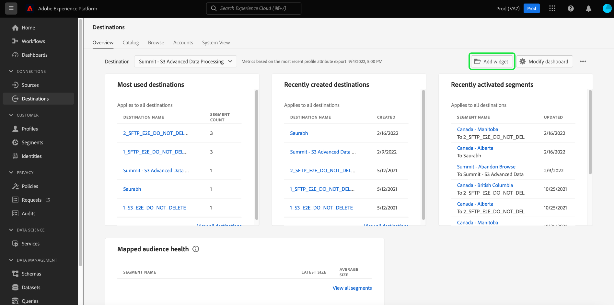
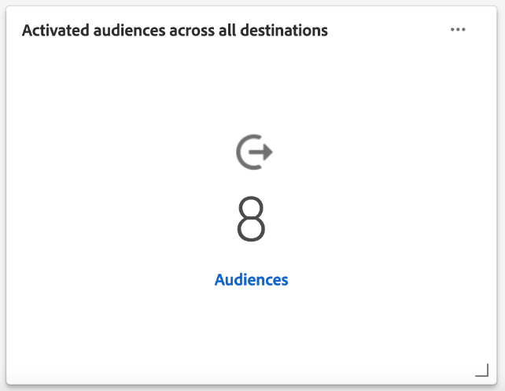

# [!UICONTROL Destinations] dashboard

De gebruikersinterface van Adobe Experience Platform (UI) verstrekt een dashboard waardoor u belangrijke informatie over de actieve bestemmingen van uw organisatie kunt bekijken, zoals die tijdens een dagelijkse momentopname wordt gevangen. Deze gids schetst hoe te om tot het dashboard van bestemmingen in UI toegang te hebben en te werken en verstrekt meer informatie betreffende de metriek die in het dashboard wordt getoond.

Voor een overzicht van bestemmingen, evenals een catalogus van alle beschikbare bestemmingen binnen Experience Platform, gelieve de [ documentatie van bestemmingen ](../../destinations/home.md) te bezoeken.

## [!UICONTROL Destinations] dashboardgegevens {#destinations-dashboard-data}

Het dashboard van Doelen toont een momentopname van de bestemmingen die uw organisatie binnen Experience Platform heeft toegelaten. De gegevens in de momentopname geven de gegevens precies zo weer als op het specifieke tijdstip waarop de momentopname is gemaakt. Met andere woorden, de momentopname is geen benadering of steekproef van de gegevens, en het dashboard van bestemmingen werkt niet in real time bij.

>[!NOTE]
>
>Wijzigingen of updates die zijn aangebracht in de gegevens nadat de momentopname is gemaakt, worden pas in het dashboard weergegeven als de volgende momentopname is gemaakt.

## Het dashboard van [!UICONTROL Destinations] verkennen {#explore}

Als u naar het doeldashboard in de gebruikersinterface van het platform wilt navigeren, selecteert u **[!UICONTROL Destinations]** in de linkertrack en selecteert u vervolgens het tabblad **[!UICONTROL Overview]** om het dashboard weer te geven.

De datum en tijd van de meest recente momentopname worden getoond bij de bovenkant van [!UICONTROL Overview] naast het bestemmingsdrop-down. Alle widgetgegevens zijn nauwkeurig vanaf die datum en tijd. De tijdstempel van de momentopname wordt opgegeven in UTC; deze bevindt zich niet in de tijdzone van de individuele gebruiker of organisatie.

>[!NOTE]
>
>Als uw organisatie nieuw is aan Experience Platform en nog geen actieve bestemmingen heeft, zijn het dashboard van Doelen en het lusje [!UICONTROL Overview] niet zichtbaar. Als u in plaats daarvan [!UICONTROL Destinations] selecteert in de linkernavigatie, wordt het tabblad [!UICONTROL Catalog] weergegeven. Raadpleeg de [[!UICONTROL Destinations] handleiding voor de werkruimte ](../../destinations/ui/destinations-workspace.md) voor meer informatie over de tab [!UICONTROL Catalog] .

### Het dashboard [!UICONTROL Destinations] wijzigen {#modify}

Selecteer **[!UICONTROL Modify dashboard]** om de weergave van het dashboard met doelen te wijzigen. Wijzigingen in het dashboard zijn per gebruiker en niet voor de hele organisatie. U kunt widgets verplaatsen, toevoegen, vergroten, verkleinen en verwijderen van het dashboard en tot de widgetbibliotheek toegang hebben om uw dashboard aan te passen. In de widgetbibliotheek kunt u de beschikbare widgets verkennen en aangepaste widgets maken voor uw organisatie.

Gelieve te verwijzen naar [ wijzigend dashboards ](../customize/modify.md) en [ het overzicht van de widgetbibliotheek ](../customize/widget-library.md) documentatie om meer te leren.

### Widgets toevoegen {#add-widget}

Selecteer **[!UICONTROL Add widget]** om naar de widgetbibliotheek te navigeren en een lijst met de beschikbare widgets weer te geven die u aan het dashboard wilt toevoegen.

In de widgetbibliotheek kunt u door de selectie van standaard- en aangepaste doelgroepwidgets bladeren. Voor informatie over hoe te om widgets toe te voegen, te zien gelieve de documentatie van de widgetbibliotheek over hoe te [ een widget ](../customize/widget-library.md#add-widgets) toevoegen.

### SQL weergeven {#view-sql}

U kunt de SQL bekijken die de inzichten produceert die op uw dashboard met een knevel op de [!UICONTROL Overview] werkruimte worden visualiseerd. U kunt inspiratie putten uit de SQL van uw bestaande inzichten om nieuwe vragen tot stand te brengen die unieke inzichten uit de gegevens van het Platform voortbrengen die op uw bedrijfsbehoeften worden gebaseerd. Om meer over deze eigenschap te leren, zie de [ SQL gids van de Mening UI ](../view-sql.md).

## Standaardwidgets {#default-widgets}

Voor alle nieuwe Adobe Experience Platform-instanties wordt een standaardwidgetbelasting opgegeven die de meest recente inzichten van uw gegevens belicht. De volgende widgets zijn vooraf geconfigureerd in uw segmentweergave van meet af aan. Hieronder vindt u volledige informatie over het doel en de functie van de widgets.

* [[!UICONTROL Most used destinations]](#most-used-destinations)
* [[!UICONTROL Recently created destinations]](#recently-created-destinations)
* [[!UICONTROL Recently activated segments]](#recently-activated-segments)

>[!NOTE]
>
>Vanaf 26 juli 2023 zijn [!UICONTROL Profiles] -, [!UICONTROL Audiences] - en [!UICONTROL Destinations] overzichtdashboards hersteld naar een nieuwe standaardwidgetload voor alle gebruikers die hun weergaven in de afgelopen zes maanden niet hebben gewijzigd.
>Verwijs naar de documentatie in de [ Profielen ](./profiles.md#default-widgets) en [ de sectie van het publiek ](./audiences.md#default-widgets) gebrek widget voor details waarop widgets als deel van standaard widget lading-uit inbegrepen zijn. U kunt uw dashboardwidgets net als voorheen aanpassen.

## Standaardwidgets {#standard-widgets}

Adobe biedt meerdere standaardwidgets die u kunt gebruiken om verschillende metrics met betrekking tot uw bestemmingen te visualiseren en de volledigheid te beoordelen van de doelgroepen die beschikbaar zijn voor uw gegevensanalyse. U kunt ook aangepaste widgets maken die u met uw organisatie wilt delen met de [!UICONTROL Widget library] . Om meer over het creëren van douanewidgets te leren, gelieve te beginnen door het [ overzicht van de bibliotheek van Widget ](../customize/widget-library.md) te lezen.

### Vereisten {#prerequisites}

Voordat u doorgaat met de beschrijvingen van standaardwidgets, moet u de definities van de volgende belangrijke termen doornemen die in de documentatie worden gebruikt:

* **definitie van het Segment:** Een segmentdefinitie is a **reeks regels** die wordt gebruikt om zeer belangrijke kenmerken of gedrag van een doelpubliek te beschrijven. Deze regels omvatten kenmerk- en gebeurtenisgegevens die de profielen kwalificeren als onderdeel van een doelgroep.
* **Publiek**: Een reeks mensen, rekeningen, huishoudens, of andere entiteiten die gemeenschappelijke kenmerken en gedrag delen.
* **In kaart gebracht/in kaart gebracht**: De afbeelding van gegevens is het proces om brongegevensgebieden aan verwante doelgebieden in een bestemming in kaart te brengen.
* **Identiteit**: Een identiteit is een herkenningsteken dat uniek een individuele klant, zoals een koekjesidentiteitskaart, apparatenidentiteitskaart, of e-mailidentiteitskaart vertegenwoordigt.
* **activeer**: Activeer is de actie die door een gebruiker wordt genomen om een publiek of profielen aan een bestemming zoals Oracle Eloqua, Google, of de Marketing Cloud van Salesforce in kaart te brengen.

Als u meer wilt weten over elk van de beschikbare standaardwidgets, selecteert u de naam van een widget in de volgende lijst:

* [[!UICONTROL Most used destinations]](#most-used-destinations)
* [[!UICONTROL Recently created destinations]](#recently-created-destinations)
* [[!UICONTROL Recently activated audiences]](#recently-activated-audiences)
* [[!UICONTROL Recently activated audiences by destination]](#recently-activated-audiences-by-destination)
* [[!UICONTROL Audience size trend]](#audience-size-trend)
* [[!UICONTROL Unmapped audiences by identity]](#unmapped-audiences-by-identity)
* [[!UICONTROL Mapped audiences by identity]](#mapped-audiences-by-identity)
* [[!UICONTROL Common audiences]](#common-audiences)
* [[!UICONTROL Mapped audiences]](#mapped-audiences)
* [[!UICONTROL Mapped audience health]](#mapped-audience-health)
* [[!UICONTROL Destinations count]](#destinations-count)
* [[!UICONTROL Destination status]](#destination-status)
* [[!UICONTROL Active destinations by destination platform]](#active-destinations-by-destination-platform)
* [[!UICONTROL Activated audiences across all destinations]](#activated-audiences-across-all-destinations)
* [[!UICONTROL Activated audiences]](#activated-audiences)

### [!UICONTROL Most used destinations] {#most-used-destinations}

>[!CONTEXTUALHELP]
>id="platform_dashboards_destinations_mostuseddestinations"
>title="Meest gebruikte bestemmingen"
>abstract="Deze widget geeft de meest actieve doelen van uw organisatie weer op basis van het aantal toegewezen doelgroepen. Deze getallen zijn nauwkeurig op het moment van de laatste opname. Deze rangschikking biedt inzicht in welke bestemmingen momenteel het meest worden gebruikt en markeert de doelen die mogelijk onderbenut zijn."

De **[!UICONTROL Most used destinations]** -widget geeft de belangrijkste doelen van uw organisatie weer op basis van het aantal toegewezen doelgroepen, vanaf de laatste momentopname. Deze rangschikking biedt inzicht in welke bestemmingen worden gebruikt en toont mogelijk ook de bestemmingen die mogelijk onderbenut zijn.

Als u bijvoorbeeld gisteren een bestemming hebt geconfigureerd, maar er geen publiek aan hebt toegewezen, kunt u zien dat de bestemming momenteel te weinig wordt gebruikt.

Het aantal toegewezen doelgroepen in de kolom [!UICONTROL Audience count] is nauwkeurig vanaf de laatste dagelijkse momentopname. Wanneer u een nieuw publiek aan de bestemming toewijst, wordt het aantal pas bijgewerkt wanneer de volgende momentopname is gemaakt.

Selecteer de naam van een bestemming in de lijst die op de widget wordt weergegeven om naar de doeldetails voor die specifieke bestemming te navigeren. U kunt ook **[!UICONTROL View All]** selecteren om naar het tabblad **[!UICONTROL Browse]** te navigeren en vervolgens de naam van een doel selecteren om de details ervan weer te geven.

### [!UICONTROL Recently created destinations] {#recently-created-destinations}

>[!CONTEXTUALHELP]
>id="platform_dashboards_destinations_recentlycreateddestinations"
>title="Onlangs gemaakte doelen"
>abstract="Deze widget geeft een lijst weer met de laatst geconfigureerde doelen binnen uw organisatie."

Met de **[!UICONTROL Recently created destinations]** -widget kunt u een lijst weergeven met de laatst geconfigureerde doelen van uw organisatie.

De getoonde datum is nauwkeurig aan de laatste dagelijkse momentopname. Met andere woorden, als u een nieuwe bestemming creeert, zal het niet in de lijst verschijnen tot nadat de volgende momentopname wordt genomen.

Als u de naam van een doel selecteert in de lijst die wordt weergegeven op de widget, gaat u naar de doeldetails die worden gekoppeld via het tabblad **[!UICONTROL Browse]** . U kunt ook **[!UICONTROL View All]** selecteren om naar het tabblad **[!UICONTROL Browse]** te navigeren en vervolgens de naam van een doel selecteren om de details ervan weer te geven.

Meer over leren hoe te om specifieke soorten bestemmingen te vormen, bezoek de [ documentatie van bestemmingen ](../../destinations/home.md).

### [!UICONTROL Recently activated audiences] {#recently-activated-audiences}

>[!CONTEXTUALHELP]
>id="platform_dashboards_destinations_recentlyactivatedsegments"
>title="Onlangs geactiveerd publiek"
>abstract="Deze widget bevat een lijst met de soorten publiek die het laatst aan een doel zijn toegewezen. Deze lijst verstrekt een momentopname van het publiek en de bestemmingen die actief in gebruik in het systeem zijn en in het oplossen van problemen kunnen helpen om het even welke onjuiste afbeeldingen."

De widget **[!UICONTROL Recently activated audiences]** bevat een lijst met soorten publiek die het laatst aan een doel zijn toegewezen. Deze lijst verstrekt een momentopname van het publiek en de bestemmingen die actief in gebruik in het systeem zijn en in het oplossen van problemen kunnen helpen om het even welke onjuiste afbeeldingen.

De [!UICONTROL Updated] getoonde datum toont de laatste tijd het publiek aan de bestemming werd geactiveerd en aan de laatste dagmomentopname nauwkeurig is. Met andere woorden, als u een publiek aan de bestemming activeert, zal de bijgewerkte datum niet veranderen tot na de volgende momentopname wordt genomen.

Als u de naam van een publiek selecteert in de lijst die wordt weergegeven op de widget, gaat u naar de publieksdetails. U kunt ook **[!UICONTROL View All]** selecteren om naar het tabblad [!UICONTROL Audiences] [!UICONTROL Browse] te navigeren en vervolgens de naam van een publiek selecteren om de details ervan weer te geven.

Voor meer informatie bij het werken met publiek in Experience Platform, gelieve te verwijzen naar het [ overzicht van de Dienst van de Segmentatie ](../../segmentation/home.md).

### [!UICONTROL Recently activated audiences by destination] {#recently-activated-audiences-by-destination}

>[!CONTEXTUALHELP]
>id="platform_dashboards_destinations_recentlyactivatedsegmentsbydestination"
>title="Onlangs geactiveerd publiek naar bestemming"
>abstract="Deze widget geeft de vijf meest recente geactiveerde doelgroepen in aflopende volgorde weer, afhankelijk van het doel dat u hebt gekozen in het overzichtsvervolgkeuzemenu."

Met de widget **[!UICONTROL Recently activated audiences by destination]** worden de meest recente vijf geactiveerde doelgroepen in aflopende volgorde weergegeven, afhankelijk van de bestemming die u hebt gekozen in de overzichtsvervolgkeuzelijst. Het is gelijkaardig aan [!UICONTROL Recently activated audiences] widget, maar de getoonde gegevens **slechts** is op de geselecteerde bestemming van toepassing.

Deze widget bevat twee metriek: de naam van het publiek en de datum waarop het publiek voor het laatst naar de bestemming is geactiveerd. De weergegeven gegevens zijn correct vanaf de laatste dagelijkse momentopname.

U kunt de details van een publiek bekijken door de naam van het publiek van de getoonde lijst te selecteren.

Gelieve te zien de eerste vereisten sectie voor de [ definities van termen die ](#prerequisites) in deze beschrijving worden gebruikt.

### [!UICONTROL Audience size trend] {#audience-size-trend}

>[!CONTEXTUALHELP]
>id="platform_dashboards_destinations_audiencesizetrend"
>title="Ontwikkeling van de omvang van het publiek"
>abstract="Deze widget illustreert het aantal profielen in het publiek dat dagelijks naar de doelaccount wordt verzonden. In het eerste vervolgkeuzemenu wordt de tijdsperiode voor de trend voor het publiek aangepast. In het tweede vervolgkeuzemenu van de widget selecteert u het publiek voor analyse. Het doel wordt gekozen uit de overzichtsvervolgkeuzelijst."

De **[!UICONTROL Audience size trend]** -widget geeft de relatie weer van het aantal profielen over een bepaalde tijdsperiode voor een publiek dat aan dat doelaccount is toegewezen. De widget gebruikt een lijngrafiek om het aantal profielen in het publiek te illustreren dat dagelijks naar het doelaccount wordt verzonden.

Met het eerste vervolgkeuzemenu kunt u een tijdsperiode voor de doelgroeptrend in de afgelopen 30 dagen, 90 dagen of 12 maanden aanpassen.

Het tweede vervolgkeuzemenu bevat alle beschikbare doelgroepen die naar de doelaccount kunnen worden verzonden die boven aan het dashboard is gekozen.

De **[!UICONTROL Audience size trend]** -widget biedt een [!UICONTROL Captions] -knop in de rechterbovenhoek van de widget. Selecteer **[!UICONTROL Captions]** om het dialoogvenster voor automatische bijschriften te openen. Een machine het leren model produceert automatisch titels om de belangrijkste tendensen en de belangrijke gebeurtenissen te beschrijven door de grafiek en de publieksgegevens te analyseren.

### [!UICONTROL Unmapped audiences by identity] {#unmapped-audiences-by-identity}

>[!CONTEXTUALHELP]
>id="platform_dashboards_destinations_unmappedsegmentsbyidentity"
>title="Toegewezen publiek op identiteit"
>abstract="Deze widget maakt een lijst van de hoogste vijf **niet in kaart gebrachte** doelgroepen die door dalende identiteitstelling voor een bepaalde bestemming en een identiteit worden gerangschikt. De filter-id&#39;s die in de vervolgkeuzelijst van de widget staan, worden aangepast aan de doelaccount die boven aan de overzichtspagina is geselecteerd."

De **[!UICONTROL Unmapped audiences by identity]** widget maakt een lijst van de hoogste vijf **niet in kaart gebrachte** doelgroepen die door dalende identiteitstelling voor een bepaalde bestemming en een identiteit worden gerangschikt. Hiermee worden doelgroepen gemarkeerd die het meest geschikt zijn om op basis van de gekozen id toe te wijzen aan het gekozen doelaccount.

Met het vervolgkeuzemenu voor de doel-id filtert u het beschikbare publiek. De filter-id&#39;s in de vervolgkeuzelijst veranderen, afhankelijk van de doelaccount die boven aan de overzichtspagina is geselecteerd.

In de kolom met identiteiten wordt het aantal bron-id&#39;s in het publiek geteld dat kan worden toegewezen aan de id die is gekozen in het vervolgkeuzemenu voor de widget-id.

Gelieve te zien de eerste vereisten sectie voor de [ definities van termen die ](#prerequisites) in deze beschrijving worden gebruikt.

### [!UICONTROL Mapped audiences by identity] {#mapped-audiences-by-identity}

>[!CONTEXTUALHELP]
>id="platform_dashboards_destinations_mappedsegmentsbyidentity"
>title="Toegewezen publiek op identiteit"
>abstract="Deze widget verstrekt een hoogste vijf lijst van **in kaart gebrachte** publiek. De lijst is van hoog tot laag geordend op basis van het aantal bron-id&#39;s in het publiek. De doel-id die moet worden geteld, wordt geselecteerd in het vervolgkeuzemenu onder de titel van de widget. De doel-id&#39;s die beschikbaar zijn in de keuzelijst met widgets zijn afhankelijk van de bestemming die boven aan het overzichtsdashboard is gekozen."

Deze widget verstrekt een hoogste vijf lijst van **in kaart gebrachte** publiek. De lijst is van hoog tot laag geordend op basis van het aantal bron-id&#39;s in het publiek. De doel-id die moet worden geteld, wordt geselecteerd in het vervolgkeuzemenu onder de titel van de widget. De doel-id&#39;s die beschikbaar zijn in de vervolgkeuzelijst in de widget, worden gewijzigd op basis van het doelaccountfilter dat boven aan het overzichtsdashboard is gekozen.

De widget **[!UICONTROL Mapped audiences by identity]** markeert in één oogopslag de kans dat u zich met succes richt op profielkansen voor een campagne binnen de gekozen bestemming. Een efficiënte gerichte campagne is niet afhankelijk van het aantal profielen dat naar de bestemming wordt verzonden, maar van het aantal bron-id&#39;s dat waarschijnlijk met de doel-id&#39;s wordt aangepast om nuttige en uitvoerbare gegevens te verschaffen.

### Algemene doelgroepen {#common-audiences}

>[!CONTEXTUALHELP]
>id="platform_dashboards_destinations_commonaudiences"
>title="Algemene doelgroepen"
>abstract="Deze widget bevat een lijst met de vijf belangrijkste doelgroepen die worden geactiveerd over het doelaccount dat boven aan de pagina is gekozen, en het doel dat is geselecteerd in het vervolgkeuzemenu van de widget. De lijst met doelgroepen is geordend op basis van de manier waarop ze onlangs zijn geactiveerd. De laatst geactiveerde doelgroep wordt bovenaan weergegeven."

De **[!UICONTROL Common audiences]** -widget bevat een lijst met de vijf belangrijkste doelgroepen die worden geactiveerd over het doelaccount dat boven aan de pagina is gekozen en het doel dat is geselecteerd in het vervolgkeuzemenu van de widget. De lijst met doelgroepen is geordend op basis van de manier waarop ze onlangs zijn geactiveerd. De laatst geactiveerde doelgroep wordt bovenaan weergegeven.

De kolom [!UICONTROL AUDIENCE SIZE] bevat het totale aantal profielen van elk vermeld publiek.

### Toegewezen doelgroepen {#mapped-audiences}

De [!UICONTROL Mapped audiences] -widget geeft het totale aantal toegewezen doelgroepen weer dat kan worden geactiveerd voor het doel dat boven aan de pagina is geselecteerd.

Selecteer **[!UICONTROL Audiences]** om naar het tabblad Soorten publiek [!UICONTROL Browse] te navigeren. In deze werkruimte wordt een lijst met alle segmentdefinities voor uw organisatie weergegeven.

### Gewijzigde volksgezondheid {#mapped-audience-health}

>[!CONTEXTUALHELP]
>id="platform_dashboards_destinations_mappedaudiencehealth"
>title="Gewijzigde volksgezondheid"
>abstract="Deze widget biedt een lijst met maximaal 20 toegewezen doelgroepen waarvan het totale aantal profielen met een factor van ten minste één standaardafwijking afwijkt van de gemiddelde 30 dagen-doelgrootte. Het verstrekt een berekende metrisch voor de spreiding van publieksgrootte van het gemiddelde over de laatste 30 dagen. De grootten van de doelgroep worden gesorteerd van hoog naar laag."

De widget biedt een lijst met maximaal 20 toegewezen doelgroepen waarvan het totale aantal profielen, vanaf de laatste dagelijkse momentopname, met een factor van minstens één standaardafwijking afwijkt van de gemiddelde publieksgrootte van 30 dagen die aan die bestemming is toegewezen.

Kortom, het biedt een berekende maatstaf voor de spreiding van de publieksformaten ten opzichte van het gemiddelde over de afgelopen 30 dagen. Het vergelijkt of de omvang van het publiek van vandaag buiten de historische standaardafwijking valt die in de afgelopen 30 dagen in de gegevens werd gezien.

Alle publieksgrootten in het systeem worden gesorteerd van hoge naar lage publieksgrootte, zoals aangegeven in de kolom [!UICONTROL LATEST SIZE] .

Als het aantal toegewezen publieksprofielen de afgelopen 30 dagen buiten één standaardafwijking van de gemiddelde toegewezen profielgrootte ligt, wijst dit op een anomalie in het systeem en het zou moeten worden onderzocht.

Als een publiek in de [!UICONTROL Mapped audience health] -widget met een grote marge afwijkt, moet u naar het trends voor de doelgrootte verwijzen en het afwijkende publiek zoeken. De trend kan meer inzicht geven in de gezondheid van uw publiek.

>[!NOTE]
>
>De standaardgrootte van de widget voor de volksgezondheid toewijzen kan de tabelinformatie belemmeren. Wijzig de grootte van de widget om de leesbaarheid van uw toegewezen publieksnamen en kolomtitels te verbeteren. Zie wijzigen dashboarddocumentatie voor begeleiding op [ hoe te resize een widget ](../customize/modify.md).

### [!UICONTROL Destinations count] {#destinations-count}

>[!CONTEXTUALHELP]
>id="platform_dashboards_destinations_destinationscount"
>title="Aantal doelen"
>abstract="Deze widget geeft het totale aantal beschikbare eindpunten weer waarop een publiek kan worden geactiveerd en geleverd binnen het systeem. Dit aantal omvat zowel actieve als inactieve bestemmingen."

De [!UICONTROL Destinations count] -widget geeft het totale aantal beschikbare eindpunten op waar een publiek kan worden geactiveerd en geleverd binnen het systeem. Dit aantal omvat zowel actieve als inactieve bestemmingen.

Onder het totale aantal, uitgezochte **[!UICONTROL Destinations]** om aan de bestemmingen te navigeren doorbladert tabel. Deze pagina bevat een lijst met alle doelen waarmee u tot op heden verbinding hebt gemaakt.

### [!UICONTROL Destination status] {#destination-status}

De [!UICONTROL Destination status] widget toont het totale aantal toegelaten bestemmingen als enige metrisch en gebruikt een donutgrafiek om het proportionele verschil tussen toegelaten en gehandicapte bestemmingen te illustreren.

Individuele tellingen voor of toegelaten of gehandicapte bestemmingen worden getoond in een dialoog wanneer de curseur over de respectieve sectie van de donutgrafiek beweegt.

### [!UICONTROL Active destinations by destination platform] {#active-destinations-by-destination-platform}

Widget verstrekt een twee kolomlijst om een lijst van actieve bestemmingsplatforms en het totale aantal actieve bestemmingen voor elk bestemmingsplatform te tonen. De lijst met doelplatforms is geordend van hoog naar laag.

### [!UICONTROL Activated audiences across all destinations] {#activated-audiences-across-all-destinations}

De [!UICONTROL Activated audiences across all destinations] -widget geeft het totale aantal doelgroepen op dat in één meting voor alle bestemmingen wordt geactiveerd. Dit getal is nauwkeurig tot aan de meest recente momentopname.

Selecteer **[!UICONTROL Audiences]** om naar de doelen [!UICONTROL Browse] tab te navigeren. Deze pagina verstrekt een lijst van alle toegelaten bestemmingen en een verscheidenheid van relevante metriek. Zie de documentatie voor meer informatie over het [[!UICONTROL Browse] lusje ](../../destinations/ui/destinations-workspace.md#browse).

Gelieve te zien de eerste vereisten sectie voor de [ definities van termen die ](#prerequisites) in deze beschrijving worden gebruikt.

### [!UICONTROL Activated audiences] {#activated-audiences}

Deze widget biedt één meting voor het totale aantal soorten publiek dat aan een doel wordt geactiveerd.

Selecteer **[!UICONTROL Audiences]** om naar de detailspagina van het dashboard van bestemmingen te navigeren. Op het tabblad [!UICONTROL Activation data] wordt een lijst weergegeven met soorten publiek die aan de bestemming zijn toegewezen, inclusief de begindatum en einddatum (indien van toepassing) en andere relevante informatie voor de gegevensexport, zoals het exporttype, de planning en de frequentie. Als u de details over een bepaald publiek wilt weergeven, selecteert u de naam in de kolom [!UICONTROL Audience Name] .

Deze widget helpt u de waarde van uw bestemmingen te begrijpen die op het aantal publiek wordt gebaseerd dat bij een blik wordt geactiveerd. Het biedt ook eenvoudig toegang tot meer gedetailleerde informatie voor verdere analyse.

Gelieve te zien de eerste vereisten sectie voor de [ definities van termen die ](#prerequisites) in deze beschrijving worden gebruikt.

## Volgende stappen

Als u dit document volgt, kunt u nu het dashboard voor doelen vinden en begrijpen welke maatstaven worden weergegeven in de beschikbare widgets. Meer leren over het werken met bestemmingen in Experience Platform, gelieve te verwijzen naar de [ documentatie van bestemmingen ](../../destinations/home.md).
