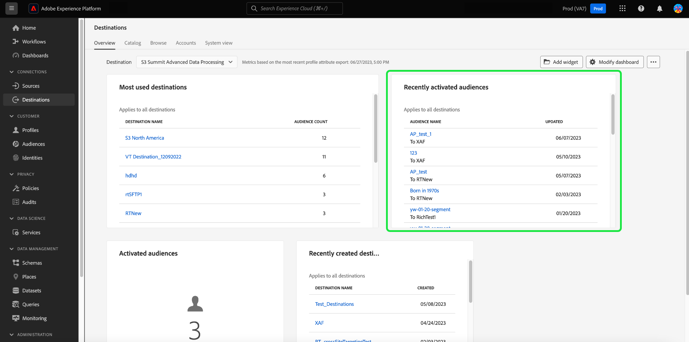

# [!UICONTROL Destinations] dashboard

De gebruikersinterface van Adobe Experience Platform (UI) verstrekt een dashboard waardoor u belangrijke informatie over de actieve bestemmingen van uw organisatie kunt bekijken, zoals die tijdens een dagelijkse momentopname wordt gevangen. Deze gids schetst hoe te om tot het dashboard van bestemmingen in UI toegang te hebben en te werken en verstrekt meer informatie betreffende de metriek die in het dashboard wordt getoond.

Voor een overzicht van de bestemmingen en een lijst van alle beschikbare bestemmingen in Experience Platform, gelieve te bezoeken [documentatie voor doelen](../../destinations/home.md).

## [!UICONTROL Destinations] dashboardgegevens {#destinations-dashboard-data}

Het dashboard van Doelen toont een momentopname van de bestemmingen die uw organisatie binnen Experience Platform heeft toegelaten. De gegevens in de momentopname geven de gegevens precies zo weer als op het specifieke tijdstip waarop de momentopname is gemaakt. Met andere woorden, de momentopname is geen benadering of steekproef van de gegevens, en het dashboard van bestemmingen werkt niet in real time bij.

>[!NOTE]
>
>Wijzigingen of updates die zijn aangebracht in de gegevens nadat de momentopname is gemaakt, worden pas in het dashboard weergegeven als de volgende momentopname is gemaakt.

## Ontdek de [!UICONTROL Destinations] dashboard {#explore}

Om aan het bestemmingdashboard binnen UI van het Platform te navigeren, selecteert **[!UICONTROL Destinations]** in de linkerspoorstaaf, dan selecteer **[!UICONTROL Overview]** om het dashboard weer te geven.

De datum en tijd van de meest recente opname worden boven aan het dialoogvenster [!UICONTROL Overview] naast het vervolgkeuzemenu van het doel. Alle widgetgegevens zijn nauwkeurig vanaf die datum en tijd. De tijdstempel van de momentopname wordt opgegeven in UTC; deze bevindt zich niet in de tijdzone van de individuele gebruiker of organisatie.

>[!NOTE]
>
>Als uw organisatie nieuw aan Experience Platform is en nog geen actieve bestemmingen heeft, dashboard van Doelen en [!UICONTROL Overview] zijn niet zichtbaar. In plaats daarvan selecteert u [!UICONTROL Destinations] van de linkernavigatie toont de [!UICONTROL Catalog] tab. Meer informatie over de [!UICONTROL Catalog] tabblad, verwijst naar de [[!UICONTROL Destinations] werkruimtegids](../../destinations/ui/destinations-workspace.md).

### Wijzig de [!UICONTROL Destinations] dashboard {#modify}

Selecteren **[!UICONTROL Modify dashboard]** om de verschijning van het dashboard van bestemmingen te veranderen. Wijzigingen in het dashboard zijn per gebruiker en niet voor de hele organisatie. U kunt widgets verplaatsen, toevoegen, vergroten, verkleinen en verwijderen van het dashboard en tot de widgetbibliotheek toegang hebben om uw dashboard aan te passen. In de widgetbibliotheek kunt u de beschikbare widgets verkennen en aangepaste widgets maken voor uw organisatie.

Raadpleeg de [wijzigen, dashboards](../customize/modify.md) en [Overzicht van widgetbibliotheek](../customize/widget-library.md) documentatie voor meer informatie.

### Widgets toevoegen {#add-widget}

Selecteren **[!UICONTROL Add widget]** om naar de widgetbibliotheek te navigeren en een lijst met de beschikbare widgets te bekijken die aan uw dashboard moeten worden toegevoegd.

In de widgetbibliotheek kunt u bladeren door de selectie van standaard- en aangepaste publiekswidgets. Raadpleeg de documentatie bij de widgetbibliotheek voor informatie over het toevoegen van widgets [Een widget toevoegen](../customize/widget-library.md#add-widgets).

## Standaardwidgets {#default-widgets}

Voor alle nieuwe Adobe Experience Platform-instanties wordt een standaardwidgetbelasting opgegeven die de meest recente inzichten van uw gegevens belicht. De volgende widgets zijn vooraf geconfigureerd in uw segmentweergave van meet af aan. Hieronder vindt u volledige informatie over het doel en de functie van de widgets.

* [[!UICONTROL Most used destinations]](#most-used-destinations)
* [[!UICONTROL Recently created destinations]](#recently-created-destinations)
* [[!UICONTROL Recently activated segments]](#recently-activated-segments)

>[!NOTE]
>
>Vanaf 26 juli 2023 [!UICONTROL Profiles], [!UICONTROL Audiences], en [!UICONTROL Destinations] De overzichtdashboards zijn teruggesteld aan een nieuwe gebrek widget lading-uit voor alle gebruikers die hun meningen in de voorafgaande zes maanden niet veranderden.
>Raadpleeg de documentatie in het dialoogvenster [Profielen](./profiles.md#default-widgets) en [Soorten publiek](./audiences.md#default-widgets) standaardwidgetsecties voor details waarop widgets zijn opgenomen als onderdeel van de standaard-widget-taaktaken. U kunt uw dashboardwidgets op dezelfde manier blijven aanpassen als voorheen.

## Standaardwidgets {#standard-widgets}

Adobe verstrekt veelvoudige standaardwidgets die u kunt gebruiken om verschillende metriek met betrekking tot uw bestemmingen te visualiseren en de volledigheid van de publiek te beoordelen beschikbaar voor uw gegevensanalyse. U kunt ook aangepaste widgets maken die u met uw organisatie kunt delen met de [!UICONTROL Widget library]. Als u meer wilt weten over het maken van aangepaste widgets, leest u eerst de [Overzicht van widgetbibliotheek](../customize/widget-library.md).

### Vereisten {#prerequisites}

Voordat u doorgaat met de beschrijvingen van standaardwidgets, moet u de definities van de volgende belangrijke termen die in de documentatie worden gebruikt, goed kennen:

* **Segmentdefinitie:** Een segmentdefinitie is een **reeks regels** gebruikt om sleutelkenmerken of gedrag van een doelpubliek te beschrijven. Deze regels omvatten attributen en gebeurtenisgegevens die de profielen als deel van een publiek kwalificeren.
* **Publiek**: Een reeks personen, accounts, huishoudens of andere entiteiten die gemeenschappelijke kenmerken en gedragingen delen.
* **Toegewezen/toewijzen**: Gegevenstoewijzing is het proces waarbij brongegevensvelden worden toegewezen aan verwante doelvelden in een doel.
* **Identiteit**: Een identiteit is een id die uniek een individuele klant vertegenwoordigt, zoals een cookie-id, apparaat-id of e-mailadres.
* **Activeren**: Activate is de actie die door een gebruiker wordt uitgevoerd om een publiek of profielen toe te wijzen aan een bestemming zoals Oracle Eloqua, Google, of Marketing Cloud Salesforce.

Als u meer wilt weten over elk van de beschikbare standaardwidgets, selecteert u de naam van een widget in de volgende lijst:

* [[!UICONTROL Most used destinations]](#most-used-destinations)
* [[!UICONTROL Recently created destinations]](#recently-created-destinations)
* [[!UICONTROL Recently activated audiences]](#recently-activated-audiences)
* [[!UICONTROL Recently activated audiences by destination]](#recently-activated-audiences-by-destination)
* [[!UICONTROL Audience size trend]](#audience-size-trend)
* [[!UICONTROL Unmapped audiences by identity]](#unmapped-audiences-by-identity)
* [[!UICONTROL Mapped audiences by identity]](#mapped-audiences-by-identity)
* [[!UICONTROL Common audiences]](#common-audiences)
* [[!UICONTROL Mapped audiences]](#mapped-audiences)
* [[!UICONTROL Mapped audience health]](#mapped-audience-health)
* [[!UICONTROL Destinations count]](#destinations-count)
* [[!UICONTROL Destination status]](#destination-status)
* [[!UICONTROL Active destinations by destination platform]](#active-destinations-by-destination-platform)
* [[!UICONTROL Activated audiences across all destinations]](#activated-audiences-across-all-destinations)
* [[!UICONTROL Activated audiences]](#activated-audiences)

### [!UICONTROL Most used destinations] {#most-used-destinations}

>[!CONTEXTUALHELP]
>id="platform_dashboards_destinations_mostuseddestinations"
>title="Meest gebruikte bestemmingen"
>abstract="Deze widget geeft de meest actieve doelen van uw organisatie weer op basis van het aantal toegewezen doelgroepen. Deze getallen zijn nauwkeurig op het moment van de laatste opname. Deze rangschikking biedt inzicht in welke bestemmingen momenteel het meest worden gebruikt en markeert de doelen die mogelijk onderbenut zijn."

De **[!UICONTROL Most used destinations]** widget geeft de belangrijkste doelen van uw organisatie weer op basis van het aantal toegewezen doelgroepen, vanaf de laatste momentopname. Deze rangschikking biedt inzicht in welke bestemmingen worden gebruikt en toont mogelijk ook de bestemmingen die mogelijk onderbenut zijn.

Bijvoorbeeld, als u een bestemming gisteren vormde maar geen publiek aan het in kaart gebracht, zou u kunnen zien dat de bestemming momenteel onderbenut is.

Het aantal toegewezen soorten publiek dat wordt weergegeven in het dialoogvenster [!UICONTROL Audience count] de kolom is nauwkeurig vanaf de laatste dagelijkse momentopname. Wanneer u een nieuw publiek aan de bestemming toewijst, wordt de telling pas bijgewerkt wanneer de volgende opname is gemaakt.

Selecteer de naam van een bestemming in de lijst die op widget wordt getoond om naar de bestemmingsdetails voor die bepaalde bestemming te navigeren. U kunt ook **[!UICONTROL View All]** om naar de **[!UICONTROL Browse]** en selecteert u vervolgens de naam van een bestemming om de details ervan weer te geven.

### [!UICONTROL Recently created destinations] {#recently-created-destinations}

>[!CONTEXTUALHELP]
>id="platform_dashboards_destinations_recentlycreateddestinations"
>title="Onlangs gemaakte doelen"
>abstract="Deze widget geeft een lijst weer met de laatst geconfigureerde doelen binnen uw organisatie."

De **[!UICONTROL Recently created destinations]** widget laat u toe om een lijst van onlangs gevormde bestemmingen van uw organisatie te zien.

De gecreeerde getoonde datum is nauwkeurig aan de laatste dagelijkse momentopname. Met andere woorden, als u een nieuwe bestemming creeert, zal het niet in de lijst verschijnen tot nadat de volgende momentopname wordt genomen.

Als u de naam van een doel selecteert in de lijst die wordt weergegeven op de widget, gaat u naar de doeldetails die zijn gekoppeld vanuit het menu **[!UICONTROL Browse]** tab. U kunt ook **[!UICONTROL View All]** om naar de **[!UICONTROL Browse]** en selecteert u vervolgens de naam van een bestemming om de details ervan weer te geven.

Om meer over te leren hoe te om specifieke soorten bestemmingen te vormen, bezoek [documentatie voor doelen](../../destinations/home.md).

### [!UICONTROL Recently activated audiences] {#recently-activated-audiences}

>[!CONTEXTUALHELP]
>id="platform_dashboards_destinations_recentlyactivatedsegments"
>title="Onlangs geactiveerd publiek"
>abstract="Deze widget bevat een lijst met de soorten publiek die het laatst aan een doel zijn toegewezen. Deze lijst verstrekt een momentopname van het publiek en de bestemmingen die actief in gebruik in het systeem zijn en in het oplossen van problemen kunnen helpen om het even welke onjuiste afbeeldingen."

De **[!UICONTROL Recently activated audiences]** widget bevat een lijst met de soorten publiek die het laatst aan een doel zijn toegewezen. Deze lijst verstrekt een momentopname van het publiek en de bestemmingen die actief in gebruik in het systeem zijn en in het oplossen van problemen kunnen helpen om het even welke onjuiste afbeeldingen.

De [!UICONTROL Updated] de getoonde datum toont de laatste tijd het publiek aan de bestemming werd geactiveerd en aan de laatste dagelijkse momentopname nauwkeurig is. Met andere woorden, als u een publiek aan de bestemming activeert, zal de bijgewerkte datum niet veranderen tot na de volgende momentopname wordt genomen.

Als u de naam van een publiek selecteert in de lijst die wordt weergegeven op de widget, gaat u naar de publieksdetails. U kunt ook **[!UICONTROL View All]** om naar de [!UICONTROL Audiences] [!UICONTROL Browse] en selecteert u vervolgens de naam van een publiek om de details ervan weer te geven.

Raadpleeg voor meer informatie over het werken met Experience Platforms [Overzicht van segmentatieservice](../../segmentation/home.md).

### [!UICONTROL Recently activated audiences by destination] {#recently-activated-audiences-by-destination}

>[!CONTEXTUALHELP]
>id="platform_dashboards_destinations_recentlyactivatedsegmentsbydestination"
>title="Onlangs geactiveerd publiek naar bestemming"
>abstract="Deze widget geeft de vijf meest recente geactiveerde doelgroepen in aflopende volgorde weer, afhankelijk van het doel dat u hebt gekozen in de overzichtsvervolgkeuzelijst."

De **[!UICONTROL Recently activated audiences by destination]** widget geeft de vijf meest recente geactiveerde doelgroepen in aflopende volgorde weer, afhankelijk van het doel dat u hebt gekozen in de overzichtsvervolgkeuzelijst. Het lijkt op het [!UICONTROL Recently activated audiences] widget, maar de gegevens worden weergegeven **alleen** wordt toegepast op het geselecteerde doel.

Deze widget bevat twee metriek: de naam van het publiek en de datum waarop het publiek voor het laatst naar de bestemming is geactiveerd. De weergegeven gegevens zijn correct vanaf de laatste dagelijkse momentopname.

U kunt de details van een publiek bekijken door de naam van het publiek van de getoonde lijst te selecteren.

Zie de sectie met voorwaarden voor de [definities van gebruikte termen](#prerequisites) in deze beschrijving.

### [!UICONTROL Audience size trend] {#audience-size-trend}

>[!CONTEXTUALHELP]
>id="platform_dashboards_destinations_audiencesizetrend"
>title="Ontwikkeling van de omvang van het publiek"
>abstract="Deze widget illustreert het aantal profielen in het publiek dat dagelijks naar de doelaccount wordt verzonden. In het eerste vervolgkeuzemenu wordt de tijdsperiode voor de trend voor het publiek aangepast. In het tweede vervolgkeuzemenu van de widget selecteert u het publiek voor analyse. Het doel wordt gekozen uit de overzichtsvervolgkeuzelijst."

De **[!UICONTROL Audience size trend]** widget geeft de relatie weer van het aantal profielen over een bepaalde tijdsperiode voor een publiek dat is toegewezen aan dat doelaccount. De widget gebruikt een lijngrafiek om het aantal profielen in het publiek te illustreren, die dagelijks naar de bestemmingsrekening worden verzonden.

Een tijdsperiode voor de publiekstrend over de afgelopen 30 dagen, 90 dagen, of 12 maanden, kan worden aangepast gebruikend het eerste drop-down menu.

Het tweede vervolgkeuzemenu bevat alle beschikbare doelgroepen die naar de doelaccount kunnen worden verzonden die boven aan het dashboard is gekozen.

De **[!UICONTROL Audience size trend]** widget biedt een [!UICONTROL Captions] rechtsboven in de widget. Selecteren **[!UICONTROL Captions]** om het dialoogvenster voor automatische bijschriften te openen. Een machine het leren model produceert automatisch titels om de belangrijkste tendensen en de belangrijke gebeurtenissen te beschrijven door de grafiek en de publieksgegevens te analyseren.

### [!UICONTROL Unmapped audiences by identity] {#unmapped-audiences-by-identity}

>[!CONTEXTUALHELP]
>id="platform_dashboards_destinations_unmappedsegmentsbyidentity"
>title="Toegewezen publiek op identiteit"
>abstract="Deze widget bevat de bovenste vijf **ongestructureerd** publiek gerangschikt op basis van het dalende aantal identiteiten voor een bepaalde bestemming en identiteit. De filter-id&#39;s die in het vervolgkeuzemenu van de widget worden weergegeven, veranderen afhankelijk van de doelaccount die boven aan de overzichtspagina is geselecteerd."

De **[!UICONTROL Unmapped audiences by identity]** widget geeft de bovenste vijf weer **ongestructureerd** publiek gerangschikt op basis van het dalende aantal identiteiten voor een bepaalde bestemming en identiteit. Het benadrukt publiek dat het voordeligst is om aan de gekozen bestemmingsrekening in kaart te brengen die op gekozen identiteitskaart wordt gebaseerd.

Met het vervolgkeuzemenu voor de doel-id filtert u het beschikbare publiek. De filter-id&#39;s in de vervolgkeuzelijst veranderen, afhankelijk van de doelaccount die boven aan de overzichtspagina is geselecteerd.

In de kolom met identiteiten wordt het aantal bron-id&#39;s in het publiek geteld dat kan worden toegewezen aan de id die is gekozen in het vervolgkeuzemenu voor de widget-id.

Zie de sectie met voorwaarden voor de [definities van gebruikte termen](#prerequisites) in deze beschrijving.

### [!UICONTROL Mapped audiences by identity] {#mapped-audiences-by-identity}

>[!CONTEXTUALHELP]
>id="platform_dashboards_destinations_mappedsegmentsbyidentity"
>title="Toegewezen publiek op identiteit"
>abstract="Deze widget biedt een bovenste lijst van vijf **toegewezen** publiek. De lijst is van hoog tot laag geordend op basis van het aantal bron-id&#39;s in het publiek. De doel-id die moet worden geteld, wordt geselecteerd in het vervolgkeuzemenu onder de titel van de widget. De doel-id&#39;s die beschikbaar zijn in de keuzelijst met widgets zijn afhankelijk van de bestemming die boven aan het overzichtsdashboard is gekozen."

Deze widget biedt een bovenste lijst van vijf **toegewezen** publiek. De lijst is van hoog tot laag geordend op basis van het aantal bron-id&#39;s in het publiek. De doel-id die moet worden geteld, wordt geselecteerd in het vervolgkeuzemenu onder de titel van de widget. De doel-id&#39;s die beschikbaar zijn in de vervolgkeuzelijst in de widget, worden gewijzigd op basis van het doelaccountfilter dat boven aan het overzichtsdashboard is gekozen.

De **[!UICONTROL Mapped audiences by identity]** in één oogopslag wordt de nadruk gelegd op de waarschijnlijkheid om profielkansen voor een campagne binnen de gekozen bestemming met succes te richten . Een efficiënte gerichte campagne is niet afhankelijk van het aantal profielen dat naar de bestemming wordt verzonden, maar van het aantal bron-id&#39;s dat waarschijnlijk met de doel-id&#39;s wordt aangepast om nuttige en uitvoerbare gegevens te verschaffen.

### Algemeen publiek {#common-audiences}

>[!CONTEXTUALHELP]
>id="platform_dashboards_destinations_commonaudiences"
>title="Algemeen publiek"
>abstract="Deze widget bevat een lijst met de bovenste vijf soorten publiek die worden geactiveerd via de doelaccount die boven aan de pagina is gekozen, en het doel dat is geselecteerd in de widgetvervolgkeuzelijst. De lijst met soorten publiek wordt geordend op basis van de mate waarin ze zijn geactiveerd. Het laatst geactiveerde publiek wordt bovenaan weergegeven."

De **[!UICONTROL Common audiences]** widget geeft een lijst weer met de bovenste vijf soorten publiek die worden geactiveerd via de doelaccount die boven aan de pagina is gekozen, en het doel dat is geselecteerd in de widgetvervolgkeuzelijst. De lijst met soorten publiek wordt geordend op basis van de mate waarin ze zijn geactiveerd. Het laatst geactiveerde publiek wordt bovenaan weergegeven.

De [!UICONTROL AUDIENCE SIZE] bevat het totale aantal profielen van elk vermeld publiek.

### Toegewezen publiek {#mapped-audiences}

De [!UICONTROL Mapped audiences] widget geeft het totale aantal toegewezen doelgroepen weer dat kan worden geactiveerd voor het doel dat boven aan de pagina is geselecteerd.

Selecteren **[!UICONTROL Audiences]** naar het dashboard Soorten publiek navigeren [!UICONTROL Browse] tab. Deze werkruimte toont een lijst van alle segmentdefinities voor uw organisatie.

### Gewijzigde volksgezondheid {#mapped-audience-health}

>[!CONTEXTUALHELP]
>id="platform_dashboards_destinations_mappedaudiencehealth"
>title="Gewijzigde volksgezondheid"
>abstract="Deze widget biedt een lijst met maximaal 20 toegewezen doelgroepen waarvan het totale aantal profielen met een factor van ten minste één standaardafwijking afwijkt van de gemiddelde 30 dagen-doelgrootte. Het verstrekt een berekende metrisch voor de spreiding van publieksgrootte van het gemiddelde over de laatste 30 dagen. De grootten van de doelgroep worden gesorteerd van hoog naar laag."

De widget biedt een lijst met maximaal 20 toegewezen doelgroepen waarvan het totale aantal profielen, vanaf de laatste dagelijkse momentopname, met een factor van minstens één standaardafwijking afwijkt van de gemiddelde publieksgrootte van 30 dagen die aan die bestemming is toegewezen.

Kortom, het biedt een berekende maatstaf voor de spreiding van de publieksformaten ten opzichte van het gemiddelde over de afgelopen 30 dagen. Het vergelijkt of de omvang van het publiek van vandaag buiten de historische standaardafwijking valt die in de afgelopen 30 dagen in de gegevens werd gezien.

Alle publieksgrootten in het systeem worden gesorteerd van hoge naar lage publieksgrootte, zoals aangegeven in het dialoogvenster [!UICONTROL LATEST SIZE] kolom.

Als het aantal toegewezen publieksprofielen de afgelopen 30 dagen buiten één standaardafwijking van de gemiddelde toegewezen profielgrootte ligt, wijst dit op een anomalie in het systeem en het zou moeten worden onderzocht.

Als een publiek binnen de [!UICONTROL Mapped audience health] widget wijkt met een grote marge af. Raadpleeg het trends voor de doelgrootte en zoek het afwijkende publiek op. De trend kan meer inzicht geven in de gezondheid van uw publiek.

>[!NOTE]
>
>De standaardgrootte van de widget voor de volksgezondheid toewijzen kan de tabelinformatie belemmeren. Wijzig de grootte van de widget om de leesbaarheid van uw toegewezen publieksnamen en kolomtitels te verbeteren. Raadpleeg de documentatie bij het wijzigen van dashboards voor hulp bij [hoe u de grootte van een widget wijzigt](../customize/modify.md).

### [!UICONTROL Destinations count] {#destinations-count}

>[!CONTEXTUALHELP]
>id="platform_dashboards_destinations_destinationscount"
>title="Aantal doelen"
>abstract="Deze widget geeft het totale aantal beschikbare eindpunten weer waarop een publiek kan worden geactiveerd en geleverd binnen het systeem. Dit aantal omvat zowel actieve als inactieve bestemmingen."

De [!UICONTROL Destinations count] widget geeft het totale aantal beschikbare eindpunten weer waarop een publiek kan worden geactiveerd en geleverd binnen het systeem. Dit aantal omvat zowel actieve als inactieve bestemmingen.

Onder het totale aantal, selecteer **[!UICONTROL Destinations]** om naar de bestemmingen te navigeren doorbladert tabel. Deze pagina bevat een lijst met alle doelen waarmee u tot op heden verbinding hebt gemaakt.

### [!UICONTROL Destination status] {#destination-status}

De [!UICONTROL Destination status] widget geeft het totale aantal ingeschakelde bestemmingen als één enkele metrische waarde weer en gebruikt een donutgrafiek om het proportionele verschil tussen toegelaten en gehandicapte bestemmingen te illustreren.

Individuele tellingen voor of toegelaten of gehandicapte bestemmingen worden getoond in een dialoog wanneer de curseur over de respectieve sectie van de donutgrafiek beweegt.

### [!UICONTROL Active destinations by destination platform] {#active-destinations-by-destination-platform}

Widget verstrekt een twee kolomlijst om een lijst van actieve bestemmingsplatforms en het totale aantal actieve bestemmingen voor elk bestemmingsplatform te tonen. De lijst met doelplatforms is van hoog naar laag geordend.

### [!UICONTROL Activated audiences across all destinations] {#activated-audiences-across-all-destinations}

De [!UICONTROL Activated audiences across all destinations] widget geeft het totale aantal soorten publiek aan dat voor alle bestemmingen in één meting wordt geactiveerd. Dit getal is nauwkeurig tot aan de meest recente opname.

Selecteren **[!UICONTROL Audiences]** om naar de bestemmingen te navigeren [!UICONTROL Browse] tab. Deze pagina verstrekt een lijst van alle toegelaten bestemmingen en een verscheidenheid van relevante metriek. Zie de documentatie voor meer informatie over de [[!UICONTROL Browse] tab](../../destinations/ui/destinations-workspace.md#browse).

Zie de sectie met voorwaarden voor de [definities van gebruikte termen](#prerequisites) in deze beschrijving.

### [!UICONTROL Activated audiences] {#activated-audiences}

Deze widget biedt één meting voor het totale aantal soorten publiek dat aan een doel wordt geactiveerd.

Selecteren **[!UICONTROL Audiences]** om naar de detailspagina van het bestemmingdashboard te navigeren. De [!UICONTROL Activation data] wordt een lijst weergegeven van soorten publiek dat aan de bestemming is toegewezen, met inbegrip van hun begindatum en einddatum (indien van toepassing), en andere relevante informatie voor de gegevensexport, zoals het exporttype, de planning en de frequentie. Als u de details over een bepaald publiek wilt weergeven, selecteert u de naam in het menu [!UICONTROL Audience Name] kolom.

Deze widget helpt u de waarde van uw bestemmingen te begrijpen die op het aantal publiek wordt gebaseerd dat bij een blik wordt geactiveerd. Het biedt ook eenvoudig toegang tot meer gedetailleerde informatie voor verdere analyse.

Zie de sectie met voorwaarden voor de [definities van gebruikte termen](#prerequisites) in deze beschrijving.

## Volgende stappen

Als u dit document volgt, kunt u nu het dashboard voor doelen vinden en begrijpen welke maatstaven worden weergegeven in de beschikbare widgets. Als u meer wilt weten over het werken met bestemmingen in Experience Platform, raadpleegt u de [documentatie voor doelen](../../destinations/home.md).
