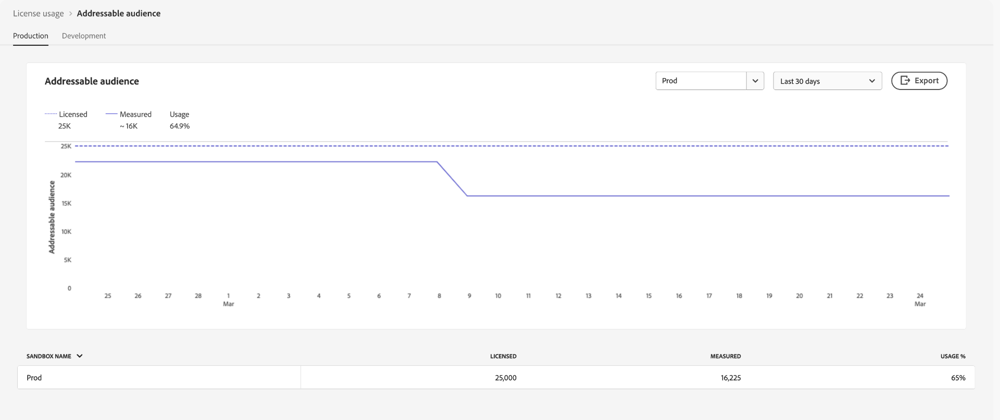

# Het gebruiksdashboard voor licenties {#license-usage-dashboard}

>[!CONTEXTUALHELP]
>id="testy-mctestface"
>title="Dialoogvenster testen dat niet zichtbaar moet zijn"
>abstract="Het object {name} wordt weergegeven op {date} ."

>[!CONTEXTUALHELP]
>id="platform_dashboards_licenseusage_core"
>title="Tabel met kernproducten"
>abstract="De kernproducten die in de tabel worden vermeld, hebben hun eigen metriek, gebruiksregistratie en doorboor-through-weergaven op sandboxniveau. Deze kernproducten verstrekken de belangrijkste metriek voor het volgen, en om het even welke toe:voegen-ons zijn inbegrepen in deze metriek."

>[!CONTEXTUALHELP]
>id="platform_dashboards_licenseusage_addons"
>title="Toevoegingstabel"
>abstract="De lijst Add-ons maakt een lijst met producten waarvan de licentiebedragen worden gecombineerd met de metriek die door kernproducten wordt ondersteund. Deze toe:voegen-ons hebben geen afzonderlijke metriek maar verbetert het gebruik het volgen van de kernproducten zij met worden geassocieerd."

>[!CONTEXTUALHELP]
>id="platform_dashboards_licenseUsage"
>title="Het gebruiksdashboard voor licenties"
>abstract="Het licentiedashboard biedt insight toegang tot de Adobe Experience Platform-producten die u hebt aangeschaft. In het dashboardoverzicht worden de primaire meetgegevens voor uw producten weergegeven, inclusief uw gebruik voor elk van de primaire meetgegevens en het bedrag van de gecontracteerde licentie. In de werkruimte Details wordt een uitsplitsing weergegeven van de meetgegevens voor elk product binnen specifieke sandboxen."
>additional-url="https://experienceleague.adobe.com/docs/experience-platform/data-lifecycle/ui/dataset-expiration.html?lang=nl-NL" text="Verlopen van geautomatiseerde gegevenssets"
>additional-url="https://experienceleague.adobe.com/docs/experience-platform/profile/pseudonymous-profiles.html?lang=nl-NL" text="Verlopen gegevens van pseudoniem-profielen"

>[!CONTEXTUALHELP]
>id="platform_licenseusage"
>title="Het gebruiksdashboard voor licenties"
>abstract="Het licentiedashboard biedt insight toegang tot de Adobe Experience Platform-producten die u hebt aangeschaft. In het dashboardoverzicht worden de primaire meetgegevens voor uw producten weergegeven, inclusief uw gebruik voor elk van de primaire meetgegevens en het bedrag van de gecontracteerde licentie. In de werkruimte Details wordt een uitsplitsing weergegeven van de meetgegevens voor elk product binnen specifieke sandboxen."
>additional-url="https://experienceleague.adobe.com/docs/experience-platform/data-lifecycle/ui/dataset-expiration.html?lang=nl-NL" text="Verlopen van geautomatiseerde gegevenssets"
>additional-url="https://experienceleague.adobe.com/docs/experience-platform/profile/pseudonymous-profiles.html?lang=nl-NL" text="Verlopen gegevens van pseudoniem-profielen"

>[!CONTEXTUALHELP]
>id="platform_dashboards_licenseusage_predictedusage_computehours"
>title="Verwachte rekenuren"
>abstract="De meting van Uren van de rekenmachine van de tijdVraag de motoren van de Dienst lezen, verwerken, en het schrijven gegevens wanneer het runnen van partijvragen.  Uw gebruik zou het vergunning gegeven bedrag kunnen bereiken. Als u het gebruik wilt beoordelen of verminderen, gaat u naar Query&#39;s > Logboek om uw querygeschiedenis te bekijken. Neem contact op met de beheerder als u geen toegang hebt tot de werkruimte Query&#39;s."
>additional-url="https://experience.adobe.com/#/platform/query/log.html" text="Zoeklogwerkruimte"

>[!CONTEXTUALHELP]
>id="platform_dashboards_licenseusage_predictedusage_addressableaudience"
>title="Voorspeld adresseerbaar publiek"
>abstract="Het adresseerbare publiek is de reeks personenprofielen in het profiel van de Klant in real time die uw organisatie mag aangaan. Deze metrische waarde omvat zowel direct identificeerbare als Pseudoniem Profielen.  Uw gebruik zou het vergunning gegeven bedrag kunnen bereiken. Om gebruik te verminderen, vorm dataset of de Pseudoniem gegevensvervalsing van het Profiel."
>additional-url="https://experienceleague.adobe.com/docs/experience-platform/profile/event-expirations.html?lang=nl-NL" text="Verlopen van gebeurtenissen beleven"
>additional-url="https://experienceleague.adobe.com/docs/experience-platform/profile/pseudonymous-profiles.html?lang=nl-NL" text="Verlopen gegevens van pseudoniem-profielen"

>[!CONTEXTUALHELP]
>id="platform_dashboards_licenseusage_predictedusage_engageableprofiles"
>title="Voorspelde inschrijfbare profielen"
>abstract="Inschakelbare profielen zijn persoonlijke profielen in Real-Time klantprofiel die uw organisatie in de afgelopen 12 maanden heeft geprobeerd te gebruiken met Journey Optimizer.  Uw gebruik zou het vergunning gegeven bedrag kunnen bereiken. Om gebruik te verminderen, vorm dataset of de Pseudoniem gegevensvervalsing van het Profiel."
>additional-url="https://experienceleague.adobe.com/docs/experience-platform/profile/event-expirations.html?lang=nl-NL" text="Verlopen van gebeurtenissen beleven"
>additional-url="https://experienceleague.adobe.com/docs/experience-platform/profile/pseudonymous-profiles.html?lang=nl-NL" text="Verlopen gegevens van pseudoniem-profielen"

>[!CONTEXTUALHELP]
>id="platform_dashboards_licenseusage_predictedusage_businesspersonprofile"
>title="Voorspeld profiel van een ondernemer"
>abstract="Profielen van zakelijke personen zijn records in realtime-klantprofiel die personen in een B2B-context vertegenwoordigen.  Uw gebruik zou het vergunning gegeven bedrag kunnen bereiken. Om gebruik te verminderen, vorm dataset of de Pseudoniem gegevensvervalsing van het Profiel."
>additional-url="https://experienceleague.adobe.com/docs/experience-platform/profile/event-expirations.html?lang=nl-NL" text="Verlopen van gebeurtenissen beleven"
>additional-url="https://experienceleague.adobe.com/docs/experience-platform/profile/pseudonymous-profiles.html?lang=nl-NL" text="Verlopen gegevens van pseudoniem-profielen"

>[!CONTEXTUALHELP]
>id="platform_dashboards_licenseusage_predictedusage_corehours"
>title="Voorspelde kernuren"
>abstract="De uren van de kern vertegenwoordigen verwerkingstijd die over de diensten van Experience Platform wordt verbruikt.  Uw gebruik zou het vergunning gegeven bedrag kunnen bereiken. Om gebruik te verminderen, vorm dataset of de Pseudoniem gegevensvervalsing van het Profiel."
>additional-url="https://experienceleague.adobe.com/docs/experience-platform/profile/event-expirations.html?lang=nl-NL" text="Verlopen van gebeurtenissen beleven"
>additional-url="https://experienceleague.adobe.com/docs/experience-platform/profile/pseudonymous-profiles.html?lang=nl-NL" text="Verlopen gegevens van pseudoniem-profielen"

>[!CONTEXTUALHELP]
>id="platform_dashboards_licenseusage_predictedusage_totaldatavolume"
>title="Voorspeld totaal gegevensvolume"
>abstract="Het totale gegevensvolume is de hoeveelheid gegevens die beschikbaar is in realtime klantprofiel voor gebruik in workflows voor betrokkenheid en personalisatie.  Uw gebruik zou het vergunning gegeven bedrag kunnen bereiken. Om gebruik te verminderen, vorm dataset of de Pseudoniem gegevensvervalsing van het Profiel."
>additional-url="https://experienceleague.adobe.com/docs/experience-platform/profile/event-expirations.html?lang=nl-NL" text="Verlopen van gebeurtenissen beleven"
>additional-url="https://experienceleague.adobe.com/docs/experience-platform/profile/pseudonymous-profiles.html?lang=nl-NL" text="Verlopen gegevens van pseudoniem-profielen"

>[!CONTEXTUALHELP]
>id="platform_dashboards_licenseusage_predictedusage_cjaRowsAvailable"
>title="Voorspelde CJA-rijen beschikbaar"
>abstract="CJA Rows Available heeft betrekking op de dagelijkse gemiddelde rijen gegevens die beschikbaar zijn voor analyse in Customer Journey Analytics.  Uw gebruik zou het vergunning gegeven bedrag kunnen bereiken. Om gebruik te verminderen, vorm dataset of de Pseudoniem gegevensvervalsing van het Profiel."
>additional-url="https://experienceleague.adobe.com/docs/experience-platform/profile/event-expirations.html?lang=nl-NL" text="Verlopen van gebeurtenissen beleven"
>additional-url="https://experienceleague.adobe.com/docs/experience-platform/profile/pseudonymous-profiles.html?lang=nl-NL" text="Verlopen gegevens van pseudoniem-profielen"

>[!CONTEXTUALHELP]
>id="platform_dashboards_licenseusage_exceededusage_addressableaudience"
>title="Voorspeld adresseerbaar publiek"
>abstract="Het adresseerbare publiek is de reeks personenprofielen in het profiel van de Klant in real time die uw organisatie mag aangaan. Dit omvat zowel direct identificeerbare als pseudoniem profielen.  Uw gebruik heeft het vergunning gegeven bedrag overschreden. Om gebruik te verminderen, vorm dataset of de Pseudoniem gegevensvervalsing van het Profiel."
>additional-url="https://experienceleague.adobe.com/docs/experience-platform/profile/event-expirations.html?lang=nl-NL" text="Verlopen van gebeurtenissen beleven"
>additional-url="https://experienceleague.adobe.com/docs/experience-platform/profile/pseudonymous-profiles.html?lang=nl-NL" text="Verlopen gegevens van pseudoniem-profielen"

>[!CONTEXTUALHELP]
>id="platform_dashboards_licenseusage_exceededusage_engageableprofiles"
>title="Voorspelde inschrijfbare profielen"
>abstract="Inschakelbare profielen zijn persoonlijke profielen in Real-Time klantprofiel die uw organisatie in de afgelopen 12 maanden heeft geprobeerd te gebruiken met Journey Optimizer.  Uw gebruik heeft het vergunning gegeven bedrag overschreden. Om gebruik te verminderen, vorm dataset of de Pseudoniem gegevensvervalsing van het Profiel."
>additional-url="https://experienceleague.adobe.com/docs/experience-platform/profile/event-expirations.html?lang=nl-NL" text="Verlopen van gebeurtenissen beleven"
>additional-url="https://experienceleague.adobe.com/docs/experience-platform/profile/pseudonymous-profiles.html?lang=nl-NL" text="Verlopen gegevens van pseudoniem-profielen"

>[!CONTEXTUALHELP]
>id="platform_dashboards_licenseusage_exceededusage_businesspersonprofile"
>title="Voorspeld profiel van een ondernemer"
>abstract="Profielen van zakelijke personen zijn records in realtime-klantprofiel die personen in een B2B-context vertegenwoordigen.  Uw gebruik heeft het vergunning gegeven bedrag overschreden. Om gebruik te verminderen, vorm dataset of de Pseudoniem gegevensvervalsing van het Profiel."
>additional-url="https://experienceleague.adobe.com/docs/experience-platform/profile/event-expirations.html?lang=nl-NL" text="Verlopen van gebeurtenissen beleven"
>additional-url="https://experienceleague.adobe.com/docs/experience-platform/profile/pseudonymous-profiles.html?lang=nl-NL" text="Verlopen gegevens van pseudoniem-profielen"

>[!CONTEXTUALHELP]
>id="platform_dashboards_licenseusage_exceededusage_corehours"
>title="Voorspelde kernuren"
>abstract="De uren van de kern vertegenwoordigen verwerkingstijd die over de diensten van Experience Platform wordt verbruikt.  Uw gebruik heeft het vergunning gegeven bedrag overschreden. Om gebruik te verminderen, vorm dataset of de Pseudoniem gegevensvervalsing van het Profiel."
>additional-url="https://experienceleague.adobe.com/docs/experience-platform/profile/event-expirations.html?lang=nl-NL" text="Verlopen van gebeurtenissen beleven"
>additional-url="https://experienceleague.adobe.com/docs/experience-platform/profile/pseudonymous-profiles.html?lang=nl-NL" text="Verlopen gegevens van pseudoniem-profielen"

>[!CONTEXTUALHELP]
>id="platform_dashboards_licenseusage_exceededusage_totaldatavolume"
>title="Voorspeld totaal gegevensvolume"
>abstract="Het totale gegevensvolume is de hoeveelheid gegevens die beschikbaar is in realtime klantprofiel voor gebruik in workflows voor betrokkenheid en personalisatie.  Uw gebruik heeft het vergunning gegeven bedrag overschreden. Om gebruik te verminderen, vorm dataset of de Pseudoniem gegevensvervalsing van het Profiel."
>additional-url="https://experienceleague.adobe.com/docs/experience-platform/profile/event-expirations.html?lang=nl-NL" text="Verlopen van gebeurtenissen beleven"
>additional-url="https://experienceleague.adobe.com/docs/experience-platform/profile/pseudonymous-profiles.html?lang=nl-NL" text="Verlopen gegevens van pseudoniem-profielen"

>[!CONTEXTUALHELP]
>id="platform_dashboards_licenseusage_exceededusage_cjaRowsAvailable"
>title="Voorspelde CJA-rijen beschikbaar"
>abstract="CJA Rows Available heeft betrekking op de dagelijkse gemiddelde rijen gegevens die beschikbaar zijn voor analyse in Customer Journey Analytics.  Uw gebruik heeft het vergunning gegeven bedrag overschreden. Om gebruik te verminderen, vorm dataset of de Pseudoniem gegevensvervalsing van het Profiel."
>additional-url="https://experienceleague.adobe.com/docs/experience-platform/profile/event-expirations.html?lang=nl-NL" text="Verlopen van gebeurtenissen beleven"
>additional-url="https://experienceleague.adobe.com/docs/experience-platform/profile/pseudonymous-profiles.html?lang=nl-NL" text="Verlopen gegevens van pseudoniem-profielen"

U kunt belangrijke informatie over het gebruik van licenties voor uw organisatie bekijken via het Adobe Experience Platform [!UICONTROL License usage] -dashboard. De informatie die hier wordt weergegeven, wordt vastgelegd tijdens een dagelijkse momentopname van uw Experience Platform-exemplaar.

De gebruiksrapporten van de vergunning verstrekken een hoge graad van granulariteit. De meeste metriek worden gedeeld over veelvoudige producten en wijzen op bijeengevoegd gebruik over alle producten die hen, niet per-producttotalen gebruiken. Het dashboard biedt een geconsolideerd gebruik van deze metriek in alle productie- of ontwikkelingssandboxen en de metrische methode voor het gebruik van een specifieke sandbox. De volgende Experience Platform-toepassingen kunnen worden bijgehouden met maatstaven voor gebruik: Real-Time Customer Data Platform, Adobe Journey Optimizer en Customer Journey Analytics.

Deze gids schetst hoe te om tot en met het dashboard van het vergunningsgebruik in UI toegang te hebben en te werken en verstrekt meer informatie betreffende de visualisaties die in het dashboard worden getoond.

Voor een algemeen overzicht van Experience Platform UI, verwijs naar de [ gids UI van Experience Platform ](../../landing/ui-guide.md).

## [!UICONTROL License usage] dashboardgegevens

Op het dashboard van [!UICONTROL License usage] wordt een lijst weergegeven met alle Experience Platform-producten die u hebt aangeschaft en alle invoegtoepassingen voor die producten. Vanuit dit dashboard kunt u een momentopname vinden van de licentiegerelateerde gegevens van uw organisatie voor Experience Platform in elke bijbehorende sandbox.

De gegevens in dit dashboard worden precies zo weergegeven als op het specifieke tijdstip waarop de momentopname is gemaakt. Het is geen benadering of voorbeeld, maar het dashboard wordt niet in real time bijgewerkt.

>[!NOTE]
>
>De meeste metriek in het dashboard worden dagelijks bijgewerkt op basis van een momentopname van uw Experience Platform-exemplaar. [!UICONTROL CJA Rows Available] is een uitzondering en wordt maandelijks bijgewerkt. Metrische gegevens met de labels &quot;packages&quot;, zoals [!UICONTROL Adhoc Query Service Users Packs] , [!UICONTROL Profile Richness No of Packs] en [!UICONTROL Streaming Segmentation No of Packs] , weerspiegelen licentierechten voor add-on-aanbiedingen en houden geen gegevens bij van het huidige gebruik. Wijzigingen die na de opname worden aangebracht, zijn pas zichtbaar wanneer de volgende opname wordt gemaakt.

## Het dashboard voor licentiegebruik verkennen {#explore}

Als u naar het dashboard voor licentiegebruik in de gebruikersinterface van Experience Platform wilt navigeren, selecteert u **[!UICONTROL License usage]** in de linkertrack. Het dashboard bevat twee tabbladen: **[!UICONTROL Metrics]** en **[!UICONTROL Products]** .

>[!NOTE]
>
>Het dashboard voor licentiegebruik is niet standaard ingeschakeld. Gebruikers moeten toestemming krijgen om het dashboard weer te geven via het &#39;Dashboard voor licentiegebruik weergeven&#39;. Voor stappen bij het verlenen van toegangstoestemmingen, verwijs naar de [ gids van de toestemmingen van het dashboard ](../permissions.md).

## [!UICONTROL Metrics] tab {#metrics-tab}

Het tabblad **[!UICONTROL Metrics]** biedt een gecentraliseerde weergave van alle gegevens over het licentiegebruik in uw organisatie. Omdat de meeste metriek over producten worden gedeeld, is er geen afzonderlijke onderverdeling per product voor deze metriek.

De metrietabel bevat de volgende kolommen:

| Kolomnaam | Beschrijving |
|---|---|
| **[!UICONTROL Metric Name]** | De naam van metrische code voor licentiegebruik. Elke ingang omvat een infopictogram (`ⓘ`) dat een beschrijving en een lijst van bijbehorende producten toont. |
| **[!UICONTROL Licensed]** | Het aantal eenheden dat uw organisatie mag gebruiken, zoals gedefinieerd in uw contract. Dit metrisch is de zelfde waarde zoals het **Bedrag van de Vergunning** in het lusje van Producten. |
| **[!UICONTROL Measured]** | De hoeveelheid metrisch die momenteel door uw organisatie wordt gebruikt. |
| **[!UICONTROL Usage %]** | Het percentage van de waarde onder licentie dat momenteel wordt gebruikt. |
| **[!UICONTROL Predicted Usage %]** | Het verwachte bereik van metrisch gebruik in de komende 6 weken. |

Met de schakeloptie **[!UICONTROL Production]** of **[!UICONTROL Development]** kunt u de metriek filteren die door sandboxen wordt weergegeven.

>[!NOTE]
>
>Consumptierapporten zijn cumulatief per type sandbox. Als u [!UICONTROL Production] of [!UICONTROL Development] selecteert, wordt het gecombineerde gebruik van alle sandboxen van dat type weergegeven.

>[!WARNING]
>
>Toestemming om het dashboard voor het gebruiksbewijs van licenties weer te geven, moet worden opgegeven op sandboxniveau. Voeg machtigingen toe aan elke afzonderlijke sandbox om deze in het dashboard weer te geven. Deze beperking wordt in een toekomstige release opgelost. Ondertussen is de volgende oplossing beschikbaar:
>
>1. Maak een productprofiel in de Adobe Admin Console.
>2. Voeg onder Machtiging in de categorie Sandbox alle sandboxen toe die u wilt weergeven in het dashboard voor licentiegebruik.
>3. Voeg onder de categorie Machtigingen voor het dashboard van de Gebruiker de machtiging &#39;Licentiegebruiksdashboard weergeven&#39; toe.

### Metrische details weergeven {#view-metric-details}

Als u gebruiksdetails voor een bepaalde metrische waarde wilt weergeven, selecteert u een metrische naam in de lijst. Er wordt een gedetailleerde weergave van de metrische waarde weergegeven, waaronder:

- Een historische lijngrafiek die het gebruik in de tijd toont
- Een vergelijking van in licentie gegeven en gemeten waarden
- Gebruik door afzonderlijke sandbox
- Een sandboxkiezer om gegevens te filteren
- Een exportoptie voor CSV-download

Met deze visualisatie kunt u trends volgen, begrijpen hoe elke sandbox bijdraagt aan het algemene gebruik en de gegevens exporteren voor offline analyse.

Elk diagram bevat vervolgkeuzemenu&#39;s waarmee de gegevens worden gefilterd. Gebruik de vervolgkeuzelijst met datumbereiken om de terugzoekperiode aan te passen (standaard: laatste 30 dagen) of gebruik de vervolgkeuzelijst met sandboxen om het gebruik voor een specifieke productie- of ontwikkelingssandbox weer te geven.

U kunt ook een **[!UICONTROL Custom date]** selecteren om de weergegeven tijdsperiode te kiezen.

### CSV-export {#export-metric-usage-data}

U kunt historische gebruiksgegevens voor de geselecteerde metrische en sandbox rechtstreeks vanuit de gedetailleerde metrische weergave exporteren als een CSV-bestand. Selecteer het pictogram **[!UICONTROL Export]** om de gegevens van het diagram in tabelvorm te downloaden. Met de geëxporteerde CSV kunt u gemakkelijk trends offline analyseren of gebruiksinzichten delen tussen teams.

## [!UICONTROL Products] tab {#products-tab}

Het tabblad **[!UICONTROL Products]** bevat gebruiksgegevens voor licenties die zijn gegroepeerd op aangeschafte producten en eventuele bijbehorende invoegtoepassingen. Het tabblad [!UICONTROL Products] bevat twee tabellen:

- **[!UICONTROL Core products]lijst**: Deze lijst maakt een lijst van de belangrijkste producten van Adobe Experience Platform die door uw organisatie worden vergunning gegeven. Elk product maakt een lijst van zijn primaire metrisch, gebruik het volgen, en voorspeld gebruik.
- **[!UICONTROL Add-ons]table**: maakt een lijst van extra punten de waarvan vergunningsbedragen tot kernproductmetriek bijdragen. Invoegtoepassingen hebben geen aparte metriek, maar verbeteren de gebruiksregistratie van de kernproducten waaraan zij zijn gekoppeld.

| Kolomnaam | Beschrijving |
|---|---|
| **[!UICONTROL Product]** | De Adobe-oplossing waarvoor uw organisatie een licentie heeft. |
| **[!UICONTROL Primary Metric]** | De primaire metrisch die voor het volgen binnen dat product wordt gebruikt. |
| **[!UICONTROL License Amount]** | De gecontracteerde waarde voor het maximumbedrag van primaire metrisch. |
| **[!UICONTROL Usage]** | De hoeveelheid primaire metrisch die wordt gebruikt. |
| **[!UICONTROL Usage %]** | Het percentage van de primaire metrische waarde dat wordt gebruikt op basis van uw licentiehoeveelheid. |
| **[!UICONTROL Predicted Usage]** | Het voorspelde gebruikspercentage van uw primaire metrisch. |

>[!NOTE]
>
>De [!UICONTROL License Amount] voor invoegtoepassingen wordt opgenomen in de totale hoeveelheid licenties van het kernproduct. Invoegtoepassingen worden niet afzonderlijk bijgehouden, maar verbeteren de mogelijkheden van de bijbehorende producten. Als u bijvoorbeeld een pakket van vijf sandboxen als invoegtoepassing koopt, wordt de hoeveelheid toegevoegd aan die van het basisproduct. De add-ons lijst toont [!UICONTROL License Amount] specifiek voor toe:voegen-op, maar het daadwerkelijke gebruik wordt gevolgd door het basisproduct.

### Voorspeld gebruik {#predicted-usage}

>[!CONTEXTUALHELP]
>id="platform_dashboards_licenseUsage_prediction"
>title="Voorspeld gebruik"
>abstract="De voorspellingen zijn gebaseerd op het gebruik in de afgelopen 6-7 maanden en worden elke vrijdag wekelijks gegenereerd. Houd er rekening mee dat voorspelling van het licentiegebruik benaderingen zijn die zijn gebaseerd op gebruik in het verleden. U bent verantwoordelijk voor het begrijpen van het daadwerkelijke gebruik van uw organisatie en ervoor te zorgen dat het gebruik niet verder gaat dan het bereik van de licentie van uw organisatie voor Adobe. Om het gebruik te verminderen, kunt u dataset of de Pseudoniem gegevensvervalsing van het Profiel voor zandbakken en datasets vormen."
>additional-url="https://experienceleague.adobe.com/docs/experience-platform/data-lifecycle/ui/dataset-expiration.html?lang=nl-NL" text="Verlopen van geautomatiseerde gegevenssets"
>additional-url="https://experienceleague.adobe.com/docs/experience-platform/profile/pseudonymous-profiles.html?lang=nl-NL" text="Verlopen gegevens van pseudoniem-profielen"

>[!CONTEXTUALHELP]
>id="platform_licenseusage_prediction"
>title="Voorspeld gebruik"
>abstract="De voorspellingen zijn gebaseerd op het gebruik in de afgelopen 6-7 maanden en worden gegenereerd op de 15e van elke maand. Houd er rekening mee dat voorspelling van het licentiegebruik benaderingen zijn die zijn gebaseerd op gebruik in het verleden. U bent verantwoordelijk voor het begrijpen van het daadwerkelijke gebruik van uw organisatie en ervoor te zorgen dat het gebruik niet verder gaat dan het bereik van de licentie van uw organisatie voor Adobe. Om het gebruik te verminderen, kunt u dataset of de Pseudoniem gegevensvervalsing van het Profiel voor zandbakken en datasets vormen."
>additional-url="https://experienceleague.adobe.com/docs/experience-platform/data-lifecycle/ui/dataset-expiration.html?lang=nl-NL" text="Verlopen van geautomatiseerde gegevenssets"
>additional-url="https://experienceleague.adobe.com/docs/experience-platform/profile/pseudonymous-profiles.html?lang=nl-NL" text="Verlopen gegevens van pseudoniem-profielen"

Beheer en optimaliseer proactief uw licentiebronnen met nauwkeurige, actuele gebruiksvoorspelling. In de kolom [!UICONTROL Predicted Usage] wordt het toekomstige gebruik van licenties op sandboxniveau voor alle productie- en ontwikkelingssandboxen voor alle aangeschafte producten voorspeld. De voorspellingen worden nu wekelijks bijgewerkt en bieden een prognose van zes weken op basis van de meest recente gebruiksgegevens. Elke voorspelling omvat zowel een ondergrens als bovengrens om geïnformeerde planning te steunen.

>[!IMPORTANT]
>
>De voorspellingen worden elke vrijdag elke week vernieuwd. De datum van verfrist zich is inbegrepen in een infopictogram ( ) boven de kolomtitel.

Een overzicht weergeven van het gebruik van de rechten van een product op de tab [!UICONTROL Product] onder de tabel [!UICONTROL Core products] .

![ het [!UICONTROL License usage] [!UICONTROL Product] lusje met een product en de voorspelde benadrukte gebruikskolom.](../images/license-usage/product-predicted-usage.png)

>[!NOTE]
>
>Houd er rekening mee dat voorspelling van het licentiegebruik benaderingen zijn die zijn gebaseerd op gebruik in het verleden. U bent verantwoordelijk voor het begrijpen van het daadwerkelijke gebruik van uw organisatie en ervoor te zorgen dat het gebruik niet verder gaat dan het bereik van de licentie van uw organisatie voor Adobe.

Het percentage van het voorspelde gebruik wordt als volgt bepaald:

- Als de onder- en bovengrenzen aanzienlijk verschillen, worden deze weergegeven als een bereik (bijvoorbeeld 32% - 35%).
- Als de onder- en bovengrenzen bijna identiek zijn en niet nul, worden ze weergegeven als een geschatte waarde (bijvoorbeeld ~34%).
- Als de onder- en bovengrenzen bijna gelijk en nul zijn, worden ze weergegeven als exact 0%.

>[!NOTE]
>
>&quot;Bijna identiek&quot; betekent in deze context dat de waarden statistisch significant zijn tot twee decimalen (een ondergrens van 0,342 en een bovengrens van 0,344 worden bijvoorbeeld beide afgerond tot 34%).

De voorspelde gebruiksfunctie ondersteunt de volgende meetgegevens:

- [!UICONTROL Addressable audience]
- [!UICONTROL Businessperson profiles]
- [!UICONTROL Compute hours]
- [!UICONTROL Customer Journey Audience number of rows]
- [!UICONTROL Engageable profiles]
- [!UICONTROL Total Data Volume]

## Beschikbare cijfers {#available-metrics}

>[!IMPORTANT]
>
>Beginnend 20th Augustus, zagen de klanten met rechten voor &#39;[!UICONTROL Average Profile Richness]&#39; en &#39;[!UICONTROL Total Storage]&#39; in plaats daarvan &#39;[!UICONTROL Total Data Volume]&#39; in het Dashboard van het Gebruik van de Vergunning. Er was geen wijziging in de rechten van de klant, alleen een vereenvoudiging van de meetwaarden. [!UICONTROL Total Data Volume] geeft de gegevens weer die beschikbaar zijn in Real-Time Klantprofiel voor service- en personalisatieworkflows. Deze vereenvoudigde metrisch verbeterde het beheer en de meting van het gebruik van het Profiel van de Klant in real time. Klanten werden aangemoedigd contact op te nemen met hun Adobe-vertegenwoordiger voor meer informatie over deze wijziging.

Het dashboard van het vergunningsgebruik rapporteert over verscheidene unieke metriek die op veelvoudige producten in de organisatie van toepassing zijn. De beschikbare meetwaarden zijn:

| Metrisch | Beschrijving |
|---|---|
| [!UICONTROL Audience Activation Size] | De totale grootte van profielen die in een jaar op een op een bestand gebaseerd doel zijn geactiveerd. Opmerking: hieronder vallen geen profielen die via streamingdoelen worden verzonden. |
| [!UICONTROL Addressable Audience] | De reeks personenprofielen in het Profiel van de Klant in real time dat uw organisatie gerechtigd is in dienst te nemen, met inbegrip van zowel direct identificeerbare als Pseudoniem Profielen. Deze profielen kunnen kenmerken, gedrag, en de gegevens van het segmentlidmaatschap bevatten. Profielvolumes worden berekend met de standaard deterministische identiteitsgrafiek van Adobe Experience Platform en worden beschouwd als een gedeelde functie. |
| [!UICONTROL Adhoc Query Service Users Packs] | Een add-on om uw geautoriseerde machtiging voor gelijktijdige gebruikers van Query Service te verhogen met vijf extra gelijktijdige gebruikers van Query Service en één extra query tegelijk voor ad-hocquery per pakket. Er kan een licentie worden verleend voor meerdere extra Ad hoc Query User-pakketten. |
| [!UICONTROL Average profile richness] | **Vervangen** - de som van alle productiegegevens die binnen de Dienst van het Profiel van de Hub op om het even welk punt in tijd worden opgeslagen, die door vijf keer het aantal erkende bedrijfspersoonprofielen wordt verdeeld. [!UICONTROL Average profile richness] is een gedeelde functie. |
| [!UICONTROL CJA Rows Available] | De dagelijkse gemiddelde rijen gegevens die beschikbaar zijn voor analyse binnen Customer Journey Analytics. |
| [!UICONTROL Computed Attributes] | Geaggregeerde profielgedragsgegevens op basis van ervaringsgebeurtenissen die worden omgezet in een profielkenmerk en kunnen worden opgenomen in een personenprofiel. |
| [!UICONTROL Consumer Audience] | Het aantal personenprofielen dat op de verkooporder als &quot;Consumer Audience&quot; is geïdentificeerd. |
| [!UICONTROL Data Export Size] | De hoeveelheid gegevens die via gegevenssetactivering in een jaar wordt verzonden. |
| [!UICONTROL Data Exports] | De totale omvang van gegevenssets die (direct of indirect) naar een niet-Adobe-oplossing in een jaar kunnen worden geëxporteerd. |
| [!UICONTROL Data Lake Storage] | De hoeveelheid die in Adobe Experience Platform wordt gebruikt voor de opslag van analysegegevens. |
| [!UICONTROL Engageable Audience] | Een groep personenprofielen in het Profiel van de Klant in real time die u hebt geprobeerd om binnen de afgelopen 12 maanden te verbinden gebruikend het auteursrecht, het besluit, de levering, de experimentatie, of de mogelijkheden van de Orchestratie van Journey Optimizer. |
| [!UICONTROL Look-alike Audiences] | Een publiek ziet-als publiek is een publiek dat door een bestaand publiek te modelleren van het Publiek van de Consumenten wordt geproduceerd om Profielen van Persoon met gelijkaardige attributen of gedrag te identificeren. |
| [!UICONTROL Number of AMM Models] | Een telling van het model voor machinaal leren (gebouwd in Adobe Mix Modeler) dat wordt gebruikt om een bepaald resultaat te meten en/of te voorspellen die op uw investeringen wordt gebaseerd. |
| [!UICONTROL Number of Sandboxes] | Het aantal logische scheidingen binnen uw instantie van om het even welke Adobe On-demand Dienst die tot Adobe Experience Platform toegang heeft isolerend gegevens en verrichtingen. |
| [!UICONTROL Profile Richness No of Packs] | Een toename in uw geautoriseerde totale gegevensvolume met 25 kB per profiel voor elk extra rijvaardigheidspakket van het Profiel. |
| [!UICONTROL Query Service Compute Hours] | Een maatregel van de hoeveelheid tijd die door de motoren van de Dienst van de Vraag wordt genomen om, gegevens terug in het gegevensmeer te lezen te verwerken en te schrijven wanneer een partijvraag wordt uitgevoerd. |
| [!UICONTROL Streaming Segmentation No of Packs] | De pakketten werken segmentlidmaatschap voor een persoonprofiel bij aangezien de nieuwe gegevens de Dienst van de Segmentatie door een het stromen stroom ingaan. Het lidmaatschap van een segment wordt beoordeeld op basis van de kenmerken van het huidige personenprofiel en de waarde van de huidige gebeurtenis, zonder rekening te houden met het historische gedrag. Streaming segmentatie is een gedeelde functie. |
| [!UICONTROL Total Data Volume] | De totale hoeveelheid gegevens die beschikbaar is voor realtime-klantprofiel voor gebruik in workflows met betrokkenheid. Het totale Volume van Gegevens wordt berekend gebruikend de volgende formule: **Totale Volume van Gegevens = Adresseerbare Volgorde × Gemiddelde Rijheid van het Profiel**. Deze metrische waarde geeft gegevens weer die alleen in de profielopslag zijn opgeslagen en sluit de opslag van gegevens in het meer uit. Het biedt een meer gerichte weergave van gegevens die relevant zijn voor op profielen gebaseerde betrokkenheid. Zie [ vaak gestelde vragen over het Totale Volume van Gegevens ](../../landing/license-usage-and-guardrails/total-data-volume.md) om meer te leren. |
| [!UICONTROL Total Volume of Data Egress] | Het gecumuleerde jaarlijkse volume aan gegevens dat uit Adobe Experience Platform naar derde gegevensopslagcentra wordt uitgevoerd. |

<!-- |  [!UICONTROL Sandbox No of Packs] |  A logical separation within your instance of any Adobe On-demand Service that accesses Adobe Experience Platform isolating data and operations | -->

>[!TIP]
>
>U kunt uw licentierechten in uw verkooporder controleren om meetgegevens te berekenen zoals uw &#39;opslagvergoeding&#39;.  Bijvoorbeeld,<ul><li>Opslagruimte = het aantal &quot;geoorloofde profielen&quot; in uw contract X Gemiddelde rijkheid van profiel</li></ul>

De beschikbaarheid van deze cijfers en de specifieke definitie van elk van deze cijfers variëren afhankelijk van de licenties die uw organisatie heeft aangeschaft. Raadpleeg de desbetreffende documentatie bij de productbeschrijving voor gedetailleerde definities van elke metrische waarde:

| Licentie | Productbeschrijving |
| --- | --- |
| <ul><li>ADOBE EXPERIENCE PLATFORM:OD LITE</li><li>ADOBE EXPERIENCE PLATFORM :OD STANDARD</li><li>ADOBE EXPERIENCE PLATFORM:OD HEAVY</li></ul> | [ Adobe Experience Platform ](https://helpx.adobe.com/nl/legal/product-descriptions/adobe-experience-platform.html) |
| <ul><li>ADOBE EXPERIENCE PLATFORM:OD</li></ul> | [ Experience Platform, de Diensten van App, en de Intelligente Diensten ](https://helpx.adobe.com/nl/legal/product-descriptions/exp-platform-app-svcs.html) |
| <ul><li>RT KLANTENGEGEVENSPLAATFORM :OD</li><li>RT KLANTGEGEVENSPLATFORM VAN KLANT :OD PRFL AAN 10M</li><li>RT KLANTGEGEVENSPLATFORM VAN KLANT :OD PRFL AAN 50M</li></ul> | [ Adobe Real-Time Customer Data Platform ](https://helpx.adobe.com/nl/legal/product-descriptions/real-time-customer-data-platform.html) |
| <ul><li>AEP :OD ACTIVATION</li><li>AEP:OD ACTIVERING PRFL NAAR 10M</li><li>AEP :OD ACTIVERING PRFL TOT 50M</li></ul> | [ de Activering van Adobe Experience Platform ](https://helpx.adobe.com/nl/legal/product-descriptions/adobe-experience-platform0.html) |
| <ul><li>AEP :OD INTELLIGENCE</li></ul> | [ Intelligentie van Adobe Experience Platform ](https://helpx.adobe.com/nl/legal/product-descriptions/adobe-experience-platform-intelligence---product-description.html) |
| <ul><li>JOURNEY OPTIMIZER SELECT :OD</li><li>JOURNEY OPTIMIZER PRIME :OD</li><li>JOURNEY OPTIMIZER ULTIMATE :OD</li><li>UNP AJO PRIME STARTER :OD</li><li>UNP AJO ULTIMATE STARTER :OD</li><li>UNP Real-Time CDP :OD PROFIELORCHESTRATION</li></ul> | [Adobe Journey Optimizer](https://helpx.adobe.com/nl/legal/product-descriptions/adobe-journey-optimizer.html) |

>[!WARNING]
>
>Het dashboard voor het gebruiksgemak rapporteert alleen over de nieuwste licentie die voor uw organisatie is ingericht. Als de meest recente licentie die voor uw organisatie is ingesteld, niet in de bovenstaande tabel wordt weergegeven, wordt het licentiegebruiksdashboard mogelijk niet correct weergegeven. Ondersteuning voor extra licenties en meerdere licenties in één organisatie is gepland voor een toekomstige release.

## Volgende stappen

Nadat u dit document hebt gelezen, kunt u het dashboard voor het licentiegebruik vinden en de gebruiksgegevens voor elk aangeschaft product, voor alle productie- of ontwikkelingssandboxen en voor een specifieke sandbox bekijken. Meer informatie over de beschikbare metriek voor uw organisatie vindt u op basis van de licentie die uw organisatie heeft aangeschaft.

Meer over andere eigenschappen leren beschikbaar in Experience Platform UI, verwijs naar de [ gids van Experience Platform UI ](../../landing/ui-guide.md).
