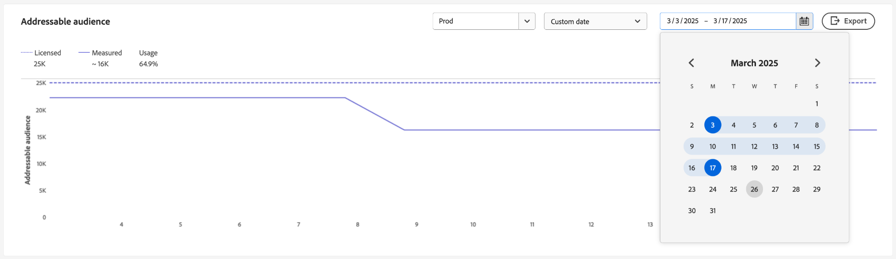

# Het gebruiksdashboard voor licenties {#license-usage-dashboard}

>[!CONTEXTUALHELP]
>id="platform_dashboards_licenseUsage"
>title="Het gebruiksdashboard voor licenties"
>abstract="Het licentiedashboard biedt inzicht in de Adobe Experience Platform-producten die u hebt aangeschaft. In het dashboardoverzicht worden de primaire meetgegevens voor uw producten weergegeven, inclusief uw gebruik voor elk van de primaire meetgegevens en het bedrag van de gecontracteerde licentie. In de werkruimte Details wordt een uitsplitsing weergegeven van de meetgegevens voor elk product binnen specifieke sandboxen."

>[!CONTEXTUALHELP]
>id="platform_dashboards_licenseUsage_prediction"
>title="Het gebruiksdashboard voor licenties"
>abstract="Het licentiedashboard biedt inzicht in de Adobe Experience Platform-producten die u hebt aangeschaft. In het dashboardoverzicht worden de primaire meetgegevens voor uw producten weergegeven, inclusief uw gebruik voor elk van de primaire meetgegevens en het bedrag van de gecontracteerde licentie. In de werkruimte Details wordt een uitsplitsing weergegeven van de meetgegevens voor elk product binnen specifieke sandboxen."
>additional-url="https://experienceleague.adobe.com/docs/experience-platform/data-lifecycle/ui/dataset-expiration.html" text="Verlopen gegevensset"
>additional-url="https://experienceleague.adobe.com/docs/experience-platform/profile/pseudonymous-profiles.html" text="Verlopen gegevens van pseudoniem-profielen"

U kunt belangrijke informatie over het gebruik van licenties voor uw organisatie bekijken via het Adobe Experience Platform [!UICONTROL License usage] -dashboard. De hier weergegeven informatie wordt vastgelegd tijdens een dagelijkse momentopname van uw platforminstantie.

De gebruiksrapporten van de vergunning verstrekken een hoge graad van granulariteit over uw metriek van het vergunningsgebruik. Het dashboard biedt gebruiksmaatstaven voor elk aangeschaft product, het geconsolideerde gebruik van metriek in alle productie- of ontwikkelingssandboxen en de gebruikstemetriek van een specifieke sandbox. De volgende Experience Platforms kunnen met gebruiksmetriek worden gevolgd: Real-time Customer Data Platform, Adobe Journey Optimizer, en Customer Journey Analytics.

Deze gids schetst hoe te om tot en met het dashboard van het vergunningsgebruik in UI toegang te hebben en te werken en verstrekt meer informatie betreffende de visualisaties die in het dashboard worden getoond.

Voor een algemeen overzicht van Platform UI, verwijs naar de [ gids UI van het Experience Platform ](../../landing/ui-guide.md).

## [!UICONTROL License usage] dashboardgegevens

Op het dashboard van [!UICONTROL License usage] wordt een lijst weergegeven met alle Experience Platforms die u hebt aangeschaft. In deze lijst vindt u een momentopname van de licentiegegevens van uw organisatie voor Experience Platform in elke bijbehorende sandbox.

De gegevens in dit dashboard worden precies zo weergegeven als op het specifieke tijdstip waarop de momentopname is gemaakt. Met andere woorden, de momentopname is geen benadering of voorbeeld van de gegevens en het dashboard wordt niet in real-time bijgewerkt.

>[!NOTE]
>
>Wijzigingen of updates die zijn aangebracht in de gegevens nadat de momentopname is gemaakt, worden pas in het dashboard weergegeven als de volgende momentopname is gemaakt.

## Het dashboard voor licentiegebruik verkennen {#explore}

Als u naar het dashboard voor licentiegebruik in de gebruikersinterface van het platform wilt navigeren, selecteert u **[!UICONTROL License usage]** in de linkertrack. Het tabblad [!UICONTROL Overview] wordt geopend en er wordt een lijst met beschikbare producten weergegeven.

>[!NOTE]
>
>Het dashboard voor licentiegebruik is niet standaard ingeschakeld. Gebruikers moeten de machtiging &#39;Dashboard voor licentiegebruik weergeven&#39; hebben om het dashboard te kunnen weergeven. Voor stappen bij het verlenen van toegangstoestemmingen voor het bekijken van het dashboard van het vergunningsgebruik, verwijs naar de [ gids van de toestemmingen van het dashboard ](../permissions.md).

## [!UICONTROL Overview] tab {#overview-tab}

Op dit dashboard worden al uw Adobe Experience Platform-producten met licentie, inclusief invoegtoepassingen, weergegeven in een tabelindeling. De tabel bevat belangrijke informatie over het gebruik van uw licentie voor al uw beschikbare profielen.

| Kolomnaam | Beschrijving |
|---|---|
| **[!UICONTROL Product]** | De oplossing van de Adobe die door uw organisatie wordt vergunning gegeven. |
| **[!UICONTROL Primary Metric]** | De primaire metrisch die voor het volgen binnen voor dat product wordt gebruikt. |
| **[!UICONTROL License Amount]** | De gecontracteerde waarde voor het maximale bedrag van de primaire metrische waarde zoals overeengekomen in uw productlicentieovereenkomst. |
| **[!UICONTROL Usage]** | De hoeveelheid primaire metrisch die wordt gebruikt. Deze waarde geeft het totale gebruik van die metrische waarde voor alle sandboxen aan, productie of ontwikkeling. |
| **[!UICONTROL Usage %]** | Het percentage van de primaire metrische waarde dat wordt gebruikt op basis van uw licentiehoeveelheid. |
| **[!UICONTROL Prediction Usage]** | (**Beta**) het voorspelde gebruikspercentage van uw primaire metrisch volgens uw vergunningsbedrag. |

>[!NOTE]
>
>Als gevolg van invoegtoepassingen worden boven op de [!UICONTROL License Amount] voor basisproducten zoals Real-time Customer Data Platform, Adobe Journey Optimizer en Customer Journey Analytics toevoegingen aan de [!UICONTROL License Amount] toegevoegd. Het gebruik van dat gelicentieerde bedrag (na de toe:voegen-ons) wordt door de basisproducten gevolgd. Als u bijvoorbeeld één verpakking met vijf sandboxen koopt, wordt de hoeveelheid van vijf toegevoegd aan die van het basisproduct. In dit geval wordt in de invoegtoepassing een [!UICONTROL License Amount] van één weergegeven en is het gebruik voor die invoegtoepassing &quot;leeg&quot; wanneer het gebruik door het basisproduct wordt gevolgd.

De lijst wijst op primaire metrisch voor elk product, aangezien elk product talrijke metriek kan volgen.

### [!BADGE  Beta ] {type=Informative} Voorspeld gebruik {#predicted-usage}

>[!AVAILABILITY]
>
De functionaliteit om toekomstig vergunningsgebruik te voorspellen is momenteel in bèta. De documentatie en de functionaliteit kunnen worden gewijzigd.

Beheer en optimaliseer proactief uw licentiemiddelen op basis van inzichtelijke gebruiksvoorspellingen. De kolom [!UICONTROL Predicted Usage] voorspelt nauwkeurig toekomstig vergunningsgebruik op het zandbakniveau, over alle productie en ontwikkelingszandbakken, voor al uw gekochte producten. Deze alarmeringscapaciteit verstrekt een prognose van vergunningsgebruik voor zes weken in de toekomst, gebaseerd op uw gebruik tot de 15e van deze kalendermaand. Voorspellingen worden geleverd met een ondergrens &amp; bovengrens.

>[!IMPORTANT]
>
De voorspellingen worden maandelijks vernieuwd. De datum van verfrist zich is inbegrepen in een infopictogram ( ) boven de kolomtitel.

Als u een overzicht wilt zien van het gebruik van een productmachtiging, selecteert u een product in de lijst [!UICONTROL Overview] .

![ [!UICONTROL License usage] [!UICONTROL Overview] met een product en de voorspelde benadrukte gebruikskolom.](../images/license-usage/product-predicted-usage.png)

Het tabblad Samenvatting wordt weergegeven. U kunt de korrelige voorspellingen gebruiken die beschikbaar zijn op de tabbladen [!UICONTROL Summary] en [!UICONTROL Details] voor een geïnformeerde besluitvorming voor efficiënt gebruik van de licentie.

Het percentage van het voorspelde gebruik wordt als volgt bepaald:

- Als de onder- en bovengrenzen aanzienlijk verschillen, worden deze weergegeven als een bereik (bijvoorbeeld 32% - 35%).
- Als de onder- en bovengrenzen bijna identiek zijn en niet nul, worden ze weergegeven als een geschatte waarde (bijvoorbeeld ~34%).
- Als de onder- en bovengrenzen bijna gelijk en nul zijn, worden ze weergegeven als exact 0%.

>[!NOTE]
>
&quot;Bijna identiek&quot; betekent in deze context dat de waarden statistisch significant zijn tot twee decimalen (een ondergrens van 0,342 en een bovengrens van 0,344 worden bijvoorbeeld beide afgerond tot 34%).

De voorspelde gebruiksfunctie ondersteunt de volgende meetgegevens:

- [!UICONTROL Addressable audience]
- [!UICONTROL Average profile richness]
- [!UICONTROL Compute hours]
- [!UICONTROL Customer Journey Audience number of rows]
- [!UICONTROL Total storage]

## [!UICONTROL Summary] tab {#summary-tab}

Als u meer cijfers en gedetailleerd inzicht in het gebruik van uw productlicentie wilt bekijken, selecteert u een productnaam in de lijst. De weergave [!UICONTROL Summary] voor dat product wordt weergegeven. Alle beschikbare metriek worden weergegeven op het tabblad [!UICONTROL Summary] . De beschikbare maatstaven zijn afhankelijk van het product met licentie. Deze mening verstrekt **een geconsolideerde mening van alle metriek over alle productie of ontwikkelingszandbakken**. Hetzelfde analyseniveau geldt voor zowel productie- als ontwikkelingssandboxen.

Op het tabblad Overzicht bevat de tabel de kolom [!UICONTROL Metric] . Deze door mensen leesbare beschrijvingen geven alle metriek aan die voor dat type wordt gebruikt of sandbox.

### Een sandbox selecteren {#select-sandbox}

De weergave wijzigen tussen de typen productie- en ontwikkelingssandbox select [!UICONTROL Production sandboxes] of [!UICONTROL Development sandboxes] . Het geselecteerde type sandbox is wordt aangegeven door het keuzerondje naast de naam van de sandbox.

Consumptierapporten voor sandboxen zijn cumulatief voor alle sandboxen van hetzelfde type. In Met andere woorden: als u [!UICONTROL Production] of [!UICONTROL Development] selecteert, worden verbruiksrapporten weergegeven voor respectievelijk alle productie- of ontwikkelingssandboxen.

>[!WARNING]
>
Toestemming om het dashboard voor het gebruiksbewijs van licenties weer te geven, moet worden opgegeven op sandboxniveau. Voeg machtigingen toe aan elke afzonderlijke sandbox om deze in het dashboard weer te geven. Deze beperking wordt in een toekomstige release opgelost. Ondertussen is de volgende oplossing beschikbaar:
>
1. Maak een productprofiel in de Adobe Admin Console.
2. Voeg onder Machtiging in de categorie Sandbox alle sandboxen toe die u wilt weergeven in het dashboard voor licentiegebruik.
3. Voeg onder de categorie Machtiging voor dashboard van gebruiker de machtiging &#39;Licentiegebruiksdashboard weergeven&#39; toe.

## Het tabblad [!UICONTROL Details] {#details-tab}

Om **een bepaald gebruik metrisch van een specifieke zandbak** te zien, navigeer aan het [!UICONTROL Details] lusje. Op het tabblad [!UICONTROL Details] worden alle beschikbare sandboxen weergegeven in de sandboxen Productie of Ontwikkeling.

Van deze mening, kunt u  naast de naam van een sandbox om de visualisatie voor die metrische waarde weer te geven. Er wordt een dialoogvenster geopend met een visualisatie voor die metrische waarde.

### Visualisaties {#visualizations}

Elke visualisatiewidget bevat de volgende aspecten:

- Een lijngrafiek die de metrische wijziging in de tijd volgt
- Een sleutel voor de lijngrafiek
- De naam van de sandbox
- Een vervolgkeuzemenu voor het aanpassen van de tijdsperiode voor de lijngrafiek

De lijngrafieken vergelijken de gebruiksaantallen voor uw organisatie met het totaal beschikbaar met de vergunning van uw organisatie en verstrekken een percentage van totaal gebruik.

De terugkijkperiode van analyse kan van het dropdown menu worden aangepast. De standaardwaarde van de laatste 30 dagen

Als u een datumbereik wilt selecteren, selecteert u met de vervolgkeuzelijst voor het datumbereik de periode die u in het dashboard wilt weergeven. Er zijn meerdere opties beschikbaar, waaronder de standaardwaarde van de laatste 30 dagen.

U kunt ook **[!UICONTROL Custom date]** selecteren om de tijdsperiode te kiezen die wordt weergegeven.

## Beschikbare cijfers {#available-metrics}

Het dashboard van het vergunningsgebruik rapporteert over verscheidene unieke metriek die op veelvoudige producten in de organisatie van toepassing zijn. De beschikbare meetwaarden zijn:

| Metrisch | Beschrijving |
|---|---|
| [!UICONTROL Audience Activation Size] | De totale grootte van profielen die in een jaar op een op een bestand gebaseerd doel zijn geactiveerd. Opmerking: hieronder vallen geen profielen die via streamingdoelen worden verzonden. |
| [!UICONTROL Addressable Audience] | De som van de rechten van uw zakelijke publiek en de rechten van het consumentenpubliek. Een publiek voor de consument wordt gedefinieerd als het aantal personenprofielen dat op de verkooporder als &quot;Consumentenpubliek&quot; wordt aangeduid. Een zakelijk publiek wordt gedefinieerd als het aantal bedrijfspersoonprofielen dat als &quot;BedrijfsPubliek&quot;op de verkooporde wordt geïdentificeerd. |
| [!UICONTROL Adhoc Query Service Users Packs] | Een add-on om uw geautoriseerde machtiging voor gelijktijdige gebruikers van Query Service te verhogen met vijf extra gelijktijdige gebruikers van Query Service en één extra query tegelijk voor ad-hocquery per pakket. Er kan een licentie worden verleend voor meerdere extra Ad hoc Query User-pakketten. |
| [!UICONTROL Average profile richness] | De som van alle productiegegevens die binnen de dienst van het Profiel van de Hub op om het even welk ogenblik worden opgeslagen, gedeeld door vijf keer het aantal gemachtigde bedrijfspersoonprofielen. [!UICONTROL Average profile richness] is een gedeelde functie. |
| [!UICONTROL CJA Rows Available] | De dagelijkse gemiddelde rijen van gegevens beschikbaar voor analyse binnen Customer Journey Analytics. |
| [!UICONTROL Computed Attributes] | Het totale aantal geaggregeerde gedragsgegevens van het profiel. Geaggregeerde gedragsgegevens voor profielen zijn gebaseerd op ervaringsgebeurtenissen die worden omgezet in een profielkenmerk en kunnen worden opgenomen in een persoonprofiel of bedrijfspersoonprofiel. |
| [!UICONTROL Consumer Audience] | Het aantal personenprofielen dat op de verkooporder als &quot;Consumer Audience&quot; is geïdentificeerd. |
| [!UICONTROL Data Export Size] | De hoeveelheid gegevens die via gegevenssetactivering in een jaar wordt verzonden. |
| [!UICONTROL Data Exports] | De totale omvang van gegevenssets die (direct of indirect) naar een niet-Adobe oplossing in een jaar kunnen worden uitgevoerd. |
| [!UICONTROL Data Lake Storage] | De hoeveelheid die in Adobe Experience Platform wordt gebruikt voor de opslag van analysegegevens. |
| [!UICONTROL Engageable Audience] | Deze maatstaf verwijst naar het publiek van controleerbare profielen. Een aanspreekbaar profiel is een record met informatie die een individu vertegenwoordigt en wordt weergegeven in de profielservice. Deze records zijn profielen die u in de afgelopen 12 maanden hebt proberen te gebruiken voor het schrijven, beslissen, leveren, experimenteren of orchestreren van Journey Optimizer. |
| [!UICONTROL Look-alike Audiences] | Het aantal doelgroepen dat wordt gegenereerd door een bestaand publiek voor consumenten te modelleren om te bepalen welke personenprofielen vergelijkbaar zijn met het bestaande publiek voor consumenten. |
| [!UICONTROL Number of AMM Models] | Een telling van het machine het leren model (ingebouwde Adobe Mix Modeler) dat wordt gebruikt om een gespecificeerd resultaat te meten en/of te voorspellen die op uw investeringen wordt gebaseerd. |
| [!UICONTROL Number of Sandboxes] | Het aantal logische scheidingen binnen uw instantie van om het even welke Adobe On-demand Dienst die tot Adobe Experience Platform toegang heeft isolerend gegevens en verrichtingen. |
| [!UICONTROL Profile Richness No of Packs] | Een verhoging van uw geautoriseerde Gemiddelde rijsheid van het Profiel met 25 KB per profiel voor elk Extra rijvaardigheidspak van het Profiel. |
| [!UICONTROL Query Service Compute Hours] | Een maatregel van de hoeveelheid tijd die door de motoren van de Dienst van de Vraag wordt genomen om, gegevens terug in het gegevensmeer te lezen te verwerken en te schrijven wanneer een partijvraag wordt uitgevoerd. |
| [!UICONTROL Streaming Segmentation No of Packs] | De pakketten werken segmentlidmaatschap voor een persoonprofiel bij aangezien de nieuwe gegevens de Dienst van de Segmentatie door een het stromen stroom ingaan. Het lidmaatschap van een segment wordt beoordeeld op basis van de kenmerken van het huidige personenprofiel en de waarde van de huidige gebeurtenis, zonder rekening te houden met het historische gedrag. Streaming segmentatie is een gedeelde functie. |

<!-- |  [!UICONTROL Sandbox No of Packs] |  A logical separation within your instance of any Adobe On-demand Service that accesses Adobe Experience Platform isolating data and operations | -->

>[!TIP]
>
U kunt uw licentierechten in uw verkooporder controleren om meetgegevens te berekenen, zoals uw &#39;opslagvergoeding&#39;.  Bijvoorbeeld,<ul><li>Opslagruimte = het aantal &quot;geoorloofde profielen&quot; in uw contract X Gemiddelde rijkheid van profiel</li></ul>

De beschikbaarheid van deze cijfers en de specifieke definitie van elk van deze cijfers variëren afhankelijk van de licenties die uw organisatie heeft aangeschaft. Raadpleeg de desbetreffende documentatie bij de productbeschrijving voor gedetailleerde definities van elke metrische waarde:

| Licentie | Productbeschrijving |
|---|---|
| <ul><li>ADOBE EXPERIENCE PLATFORM:OD LITE</li><li>ADOBE EXPERIENCE PLATFORM:OD STANDARD</li><li>ADOBE EXPERIENCE PLATFORM:OD HEAVY</li></ul> | [ Adobe Experience Platform ](https://helpx.adobe.com/legal/product-descriptions/adobe-experience-platform.html) |
| <ul><li>ADOBE EXPERIENCE PLATFORM:OD</li></ul> | [ Experience Platform, de Diensten van de App, en de Intelligente Diensten ](https://helpx.adobe.com/legal/product-descriptions/exp-platform-app-svcs.html) |
| <ul><li>RT-KLANTENGEGEVENSPLATFORM:OD</li><li>RT KLANTENGEGEVENSPLATFORM:OD PRFL NAAR 10M</li><li>RT KLANTENGEGEVENSPLATFORM:OD PRFL NAAR 50M</li></ul> | [ Adobe Real-time Customer Data Platform ](https://helpx.adobe.com/legal/product-descriptions/real-time-customer-data-platform.html) |
| <ul><li>AEP:OD ACTIVATION</li><li>AEP:OD ACTIVATION PRFL NAAR 10M</li><li>AEP:OD ACTIVATION PRFL TOT 50M</li></ul> | [ de Activering van Adobe Experience Platform ](https://helpx.adobe.com/legal/product-descriptions/adobe-experience-platform0.html) |
| <ul><li>AEP:OD INTELLIGENCE</li></ul> | [ Intelligentie van Adobe Experience Platform ](https://helpx.adobe.com/legal/product-descriptions/adobe-experience-platform-intelligence---product-description.html) |
| <ul><li>JOURNEY OPTIMIZER SELECT:OD</li><li>JOURNEY OPTIMIZER PRIME:OD</li><li>JOURNEY OPTIMIZER ULTIMATE:OD</li><li>UNP AJO PRIME STARTER:OD</li><li>UNP AJO ULTIMATE STARTER:OD</li><li>UNP Real-Time CDP:OD PROFILE ORCHESTRATION</li></ul> | [ Adobe Journey Optimizer ](https://helpx.adobe.com/legal/product-descriptions/adobe-journey-optimizer.html) |

>[!WARNING]
>
Het dashboard voor het gebruiksgemak rapporteert alleen over de nieuwste licentie die voor uw organisatie is ingericht. Als de meest recente licentie die voor uw organisatie is ingesteld, niet in de bovenstaande tabel wordt weergegeven, wordt het licentiegebruiksdashboard mogelijk niet correct weergegeven. Ondersteuning voor extra licenties en meerdere licenties in één organisatie is gepland voor een toekomstige release.

## Volgende stappen

Nadat u dit document hebt gelezen, kunt u het dashboard voor het licentiegebruik vinden en de gebruiksgegevens voor elk aangeschaft product, voor alle productie- of ontwikkelingssandboxen en voor een specifieke sandbox bekijken. Meer informatie over de beschikbare metriek voor uw organisatie vindt u op basis van de licentie die uw organisatie heeft aangeschaft.

Meer over andere eigenschappen leren beschikbaar in het Experience Platform UI, verwijs naar de [ gids UI van het Platform ](../../landing/ui-guide.md).
