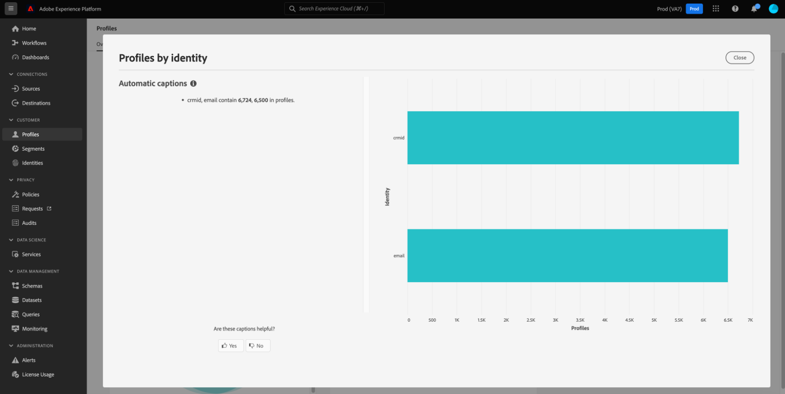

# [!UICONTROL Profiles] dashboard

De gebruikersinterface van Adobe Experience Platform (UI) biedt een dashboard waarmee u belangrijke informatie over uw [!DNL Real-Time Customer Profile] gegevens kunt bekijken, zoals vastgelegd tijdens een dagelijkse momentopname. In deze handleiding wordt beschreven hoe u het dashboard Profielen in de gebruikersinterface kunt openen en gebruiken en wordt informatie gegeven over de metriek die in het dashboard wordt weergegeven.

Verwijs naar de [ Realtime gids UI van het Profiel van de Klant ](../../profile/ui/user-guide.md) voor een overzicht van de eigenschappen van het Profiel binnen het gebruikersinterface van Experience Platform.

## Profieldashboardgegevens

Op het dashboard Profielen wordt een momentopname weergegeven van de kenmerkgegevens (record) die uw organisatie heeft in de profielopslag in Experience Platform. De momentopname bevat geen gebeurtenis (tijdreeks)-gegevens.

De kenmerkgegevens in de momentopname geven de gegevens precies zo weer als op het specifieke tijdstip waarop de momentopname is gemaakt. Met andere woorden, de momentopname is geen benadering of voorbeeld van de gegevens, en het dashboard van het Profiel werkt niet in real time bij.

>[!NOTE]
>
>Wijzigingen of updates die zijn aangebracht in de gegevens nadat de momentopname is gemaakt, worden pas in het dashboard weergegeven als de volgende momentopname is gemaakt.

## Het dashboard Profielen verkennen {#explore-dashboard}

Als u naar het dashboard Profielen in de gebruikersinterface van Experience Platform wilt navigeren, selecteert u **[!UICONTROL Profiles]** in de linkertrack en selecteert u vervolgens het tabblad **[!UICONTROL Overview]** om het dashboard weer te geven.

>[!NOTE]
>
>Als uw organisatie nieuw is voor Experience Platform en nog geen actieve profielgegevenssets of samenvoegbeleid is gemaakt, is het dashboard Profielen niet zichtbaar. In plaats daarvan geeft het tabblad [!UICONTROL Overview] koppelingen en documentatie weer om u te helpen aan de slag te gaan met Real-Time Klantprofiel.

### Het dashboard Profielen wijzigen {#modify-dashboard}

U kunt de weergave van het dashboard Profielen wijzigen door **[!UICONTROL Modify dashboard]** te selecteren. U kunt widgets verplaatsen, toevoegen, vergroten, verkleinen en verwijderen van het dashboard, en **[!UICONTROL Widget library]** openen om beschikbare widgets te verkennen en aangepaste widgets voor uw organisatie te maken.

Meer leren, verwijs naar [ wijzigend dashboards ](../customize/modify.md) en [ het overzicht van de bibliotheek van Widget ](../customize/widget-library.md) documentatie.

### Widgets toevoegen {#add-widget}

Selecteer **[!UICONTROL Add widget]** om naar de widgetbibliotheek te navigeren en een lijst met de beschikbare widgets weer te geven die u aan het dashboard wilt toevoegen.

In de widgetbibliotheek kunt u bladeren door de selectie van standaard- en aangepaste publiekswidgets. Voor informatie over hoe te om widgets toe te voegen, te zien gelieve de documentatie van de widgetbibliotheek over hoe te [ een widget ](../customize/widget-library.md#add-widgets) toevoegen.

### SQL weergeven {#view-sql}

U kunt de SQL bekijken die de inzichten produceert die op uw dashboard met een knevel op de [!UICONTROL Overview] werkruimte worden visualiseerd. U kunt inspiratie putten uit de SQL van uw bestaande inzichten om nieuwe vragen tot stand te brengen die unieke inzichten van de gegevens van Experience Platform afleiden die op uw bedrijfsbehoeften worden gebaseerd. Om meer over deze eigenschap te leren, zie de [ SQL gids van de Mening UI ](../view-sql.md).

<!-- ## (Beta) Profile efficacy insights {#profile-efficacy-insights}

>[!IMPORTANT]
>
>The profile efficacy insight functionality is currently in beta and are not available to all users. The documentation and the functionality are subject to change.

The [!UICONTROL Efficacy] tab provides metrics on the quality and completeness of your profile data through the use of profile efficacy widgets. These widgets illustrate at a glance the composition of your profiles, trends in completeness over time, and assessments on the quality of your profile data.

See the [profile efficacy widgets section](#profile-efficacy-widgets) for more information on the widgets currently available.

The layout of this dashboard is also customizable by selecting [**[!UICONTROL Modify dashboard]**](../customize/modify.md) from the [!UICONTROL Overview] tab. -->

## Bladeren door profielen {#browse-profiles}

Op het tabblad [!UICONTROL Browse] kunt u zoeken naar de alleen-lezen profielen die in uw organisatie worden opgenomen. Van hieruit kunt u belangrijke informatie zien die tot het profiel behoort met betrekking tot hun voorkeuren, gebeurtenissen uit het verleden, interacties en doelgroepen.

## Profieldetails {#profile-details}

Als u de [!UICONTROL Profiles] [!UICONTROL Detail] -werkruimte wilt openen, selecteert u een [!UICONTROL Profile ID] in de lijst.

In de werkruimte [!UICONTROL Profiles] [!UICONTROL Detail] worden verschillende vooraf geconfigureerde widgets weergegeven die specifieke informatie over dat profiel overbrengen. Met deze informatie kunt u in één oogopslag de belangrijkste kenmerken van het profiel begrijpen. U kunt de [!UICONTROL Profiles] [!UICONTROL Detail] -werkruimte ook aanpassen door uw eigen widgets te maken. Zie de sectie op [ hoe te om widgets ](#add-widgets) voor meer details toe te voegen.

![ de [!UICONTROL Profiles] [!UICONTROL Detail] werkruimte met het [!UICONTROL Detail] benadrukte lusje.](../images/profiles/profile-details-workspace.png)

### Profieldetails, widgets {#widgets}

De vooraf geconfigureerde profieldetails-widgets zijn als volgt:

#### Klantprofiel {#customer-profile}

De [!UICONTROL Customer profile] -widget geeft de voor- en achternaam weer van de gebruiker die aan het profiel is gekoppeld, alsmede hun [!UICONTROL Profile ID] . Een profiel-id is een automatisch gegenereerde id die is gekoppeld aan een identiteitstype en die een profiel vertegenwoordigt. Meer over identiteiten en identiteitsnamespaces leren, zie het [ overzicht van identiteiten ](../../rtcdp/profile/identities-overview.md).

#### Basiskenmerken {#basic-attributes}

De widget [!UICONTROL Basic attributes] geeft de meestgebruikte kenmerken weer die worden gebruikt om een afzonderlijk profiel te definiëren.

#### Gekoppelde identiteiten {#linked-identities}

De [!UICONTROL Linked identities] -widget geeft alle andere identiteiten weer die aan het profiel zijn gekoppeld.

Selecteer **[!UICONTROL View identity graph]** als u de identiteitsgegevens van het profiel diepgaander wilt weergeven en naar de werkruimte van [!UICONTROL Identities] wilt navigeren.

#### Kanaalvoorkeuren {#channel-preferences}

De widget [!UICONTROL Channel preferences] geeft de communicatiekanalen weer waarvan de gebruiker toestemming heeft gegeven om communicatie van te ontvangen. Een vinkje geeft elk kanaal aan dat de gebruiker heeft geaccepteerd om communicatie van te ontvangen.

<!-- image needs a blue tick added below -->

De toestemming van de klant en de contactvoorkeur zijn complexe onderwerpen. Als u wilt weten hoe toestemmings- en contextvoorkeuren kunnen worden verzameld, verwerkt en gefilterd in Experience Platform, kunt u het beste de volgende documenten lezen:

* Om over de groepen van het schemagebied te leren die worden vereist om [ toestemmingsgegevens volgens de norm van Adobe ](../../landing/governance-privacy-security/consent/adobe/overview.md) te verzamelen, zie de documentatie over deze profiel-Toegelaten groepen van het schemagebied.
   * [[!UICONTROL Consent and Preference Details]](../../xdm/field-groups/profile/consents.md)
   * [[!UICONTROL IdentityMap]](../../xdm/field-groups/profile/identitymap.md) (vereist als u toestemmingssignalen verzendt via het Experience Platform Web of Mobile SDK)
* Leren hoe te om klantentoestemming en voorkeursgegevens te verwerken gebruikend de norm van Adobe, zie het overzicht over [ toestemmingsverwerking in Experience Platform ](../../landing/governance-privacy-security/consent/adobe/overview.md).
* Een gecombineerd beleid voor gegevensbeheer en instemming kan worden gebruikt om profielen voor segmentatie te filteren op basis van hun voorkeuren voor toestemming en uw vastgestelde organisatorische regels. Leren om dit gecombineerde beleid tot stand te brengen en te gebruiken, zie de gebruikersgids over [ het beheren van het beleid van het gegevensgebruik ](../../data-governance/policies/user-guide.md#combine-policies).

### Widgets toevoegen {#add-widgets}

Als u aangepaste widgets wilt toevoegen aan uw [!UICONTROL Profiles] [!UICONTROL Detail] -werkruimte, selecteert u **[!UICONTROL Customize profile details]** .

![ de werkruimte van het Detail van Profielen met [!UICONTROL Customize profile details] benadrukt.](../images/profiles/customize-profile-details.png)

U kunt de werkruimte nu bewerken door de widgets te vergroten of te verkleinen of te verplaatsen. Selecteer **[!UICONTROL Add widget]** om een widget met aangepaste kenmerken te maken.

![ de profielen [!UICONTROL Detail] werkruimte met [!UICONTROL Add widget] benadrukte.](../images/profiles/add-widget.png)

De maker van de widget wordt weergegeven. Voer in het tekstveld [!UICONTROL Card title] een beschrijvende naam voor de widget in en selecteer **[!UICONTROL Add attributes]** .

![ het widgetcreatorcanvas met het [!UICONTROL Card title] gebied en [!UICONTROL Add attributes] benadrukte.](../images/profiles/widget-creator.png)

Er wordt een dialoogvenster weergegeven met een visualisatie van het samenvoegingsschema van het profiel. Gebruik het zoekveld of de schuifbalk om te zoeken naar de kenmerken waarover u met de widget wilt rapporteren. Schakel het selectievakje in voor alle kenmerken die u wilt opnemen. Selecteer **[!UICONTROL Select]** om door te gaan met de ontwerpworkflow.

>[!TIP]
>
>Een selectie van het bovenste selectievakje bevat eventuele onderliggende elementen.

![ het diagram van het unieschema met het vakje van de loyaliteitattributen en [!UICONTROL Select] benadrukte.](../images/profiles/union-schema-attributes.png)

Er wordt een voorvertoning van de voltooide widget weergegeven op het canvas. Als u tevreden bent met de gekozen kenmerken, selecteert u **[!UICONTROL Save]** om uw keuzes te bevestigen en terug te keren naar de [!UICONTROL Profiles] [!UICONTROL Detail] -werkruimte. De nieuwe widget is nu zichtbaar in de werkruimte.

## Beleid samenvoegen {#merge-policies}

De metriek die in het dashboard van Profielen wordt getoond is gebaseerd op samenvoegbeleid dat op uw gegevens van het Profiel van de Klant in real time wordt toegepast. Wanneer gegevens uit meerdere bronnen worden samengevoegd om het klantprofiel te maken, kunnen de gegevens conflicterende waarden bevatten. Bijvoorbeeld, kan één dataset een klant als &quot;enig&quot;vermelden terwijl een andere dataset de klant als &quot;gehuwd&quot;kan vermelden. Het is de taak van het fusiebeleid om te bepalen welke gegevens aan prioriteit en vertoning als deel van het profiel moeten.

Voor meer informatie over fusiebeleid, met inbegrip van hoe te om, een standaardfusiebeleid voor uw organisatie tot stand te brengen uit te geven en te verklaren, verwijs naar het [ overzicht van het fusiebeleid ](../../profile/merge-policies/overview.md).

Op het dashboard wordt automatisch een samenvoegbeleid geselecteerd dat moet worden gebruikt. Het toegepaste samenvoegbeleid kan worden gewijzigd via het vervolgkeuzemenu naast de naam van het samenvoegbeleid.

>[!NOTE]
>
>In het vervolgkeuzemenu ziet u alleen samenvoegbeleidsregels die gebruikmaken van het schema `_xdm.context.profile` . Nochtans, als uw organisatie veelvoudige samenvoegingsbeleid heeft gecreeerd, kan het betekenen dat u moet scrollen om de volledige lijst van beschikbare samenvoegingsbeleid te bekijken.

## Unieregelingen

Het dashboard van [!UICONTROL Union Schema] toont het verenigingsschema voor een specifieke klasse XDM. Door het vervolgkeuzemenu **[!UICONTROL Class]** te selecteren, kunt u de samenvoegingsschema&#39;s voor verschillende XDM-klassen bekijken.

De schema&#39;s van de unie zijn samengesteld uit veelvoudige schema&#39;s die de zelfde klasse delen en voor Profiel toegelaten. Ze stellen u in staat om in één weergave een samenvoeging te zien van elk veld in elk schema dat dezelfde klasse deelt.

Meer over [ het bekijken verenigingsschema&#39;s binnen Experience Platform UI ](../../profile/ui/union-schema.md#view-union-schemas) leren, verwijs naar de gids van het unieschema UI.

## Widgets en metriek

Het dashboard bestaat uit widgets. Dit zijn alleen-lezen metriek die belangrijke informatie over uw profielgegevens verschaft.

De datum en tijd van de meest recente momentopname worden getoond bij de bovenkant van het [!UICONTROL Overview] lusje naast de dropdown van het fusiebeleid. Alle widgetgegevens zijn nauwkeurig vanaf die datum en tijd. De tijdstempel van de momentopname wordt opgegeven in UTC; deze bevindt zich niet in de tijdzone van de individuele gebruiker of organisatie.

## Standaardwidgets {#default-widgets}

Voor alle nieuwe Adobe Experience Platform-instanties wordt een standaardwidgetbelasting opgegeven die de meest recente inzichten van uw gegevens belicht. De volgende widgets zijn vooraf geconfigureerd in uw segmentweergave van meet af aan. Hieronder vindt u volledige informatie over het doel en de functie van de widgets.

* [[!UICONTROL Profile count]](#profile-count)
* [[!UICONTROL Profile count change]](#profile-count-change)
* [[!UICONTROL Profiles count change trend]](#profiles-count-change-trend)
* [[!UICONTROL Profiles by identity]](#profiles-by-identity)
* [[!UICONTROL Identity overlap]](#identity-overlap)

>[!NOTE]
>
>Vanaf 26 juli 2023 zijn de dashboards met het overzicht [!UICONTROL Profiles] , [!UICONTROL Audiences] en [!UICONTROL Destinations] opnieuw ingesteld op een nieuwe standaardwidgetbelasting voor alle gebruikers die hun weergaven in de afgelopen zes maanden niet hebben gewijzigd. Verwijs naar de documentatie in de [ Doelen ](./destinations.md#default-widgets) en [ de 3&rbrace; standaardwidgetsecties van het publiek &lbrace;voor details waarop widgets als deel van standaard widget lading-outs inbegrepen zijn. ](./audiences.md#default-widgets) U kunt uw dashboardwidgets op dezelfde manier blijven aanpassen als voorheen.

## AI-widgets van klant {#customer-ai-profiles-widgets}

Klant-AI wordt gebruikt om aangepaste eigenschapscores zoals churn en conversie voor individuele profielen op schaal te genereren. De klant AI doet dit door de bestaande gegevens van de Gebeurtenis van de Ervaring van de consument te analyseren om **te voorspellen de dun of de scores van de omzetsingsvolheid**. Deze zeer nauwkeurige modellen van de klantenneiging staan voor nauwkeurigere segmentatie en het richten toe. De [ distributie van scores ](#customer-ai-distribution-of-scores) en [ het scoren samenvatting ](#customer-ai-scoring-summary) inzichten tonen de afdeling in uw publiek aan. Ze benadrukken welke profielen de hoge/lage/gemiddelde dichtheid zijn en hoe deze over het aantal profielen worden verdeeld.

* [[!UICONTROL Customer AI scoring summary]](#customer-ai-scoring-summary)
* [[!UICONTROL Customer AI distribution of scores]](#customer-ai-distribution-of-scores)

### [!UICONTROL Customer AI distribution of scores] {#customer-ai-distribution-of-scores}

>[!CONTEXTUALHELP]
>id="platform_dashboards_profiles_distributionOfScores"
>title="Verdeling van scores"
>abstract="Deze widget visualiseert de verdeling van het totale aantal profielen aan de hand van hun eigenschapscores in stappen van 5 procent. De verdeling van het profielaantal wordt bepaald door het AI-model en het geselecteerde samenvoegbeleid. U kunt het AI-model wijzigen in het vervolgkeuzemenu onder de titel van de widget."

De [!UICONTROL Customer AI distribution of scores] -widget categoriseert het totale aantal profielen op basis van hun densiteitsscores. De verdeling van het profielaantal wordt bepaald door het AI model en het geselecteerde fusiebeleid, dan visualiseerd in vijf percententoename die op hun neiging wijzen. Het aantal profielen wordt opgegeven langs de Y-as en de dichtheidsscores langs de X-as.

>[!NOTE]
>
>Als de visualisatie een conversiesnelheidsscore is, worden de hoge scores groen en de lage scores rood weergegeven. Als je de eigenheid van de kroon voorspelt, wordt deze gespiegeld, dan zijn de hoge scores rood en zijn de lage scores groen. Het gemiddelde emmertje blijft geel ongeacht welk aandrijvingstype u kiest.

Het AI-model waarmee de densiteitsscores worden bepaald, wordt gekozen uit de vervolgkeuzelijst onder de titel van de widget. Het vervolgkeuzemenu bevat een lijst met alle geconfigureerde AI-modellen van de Klant. Selecteer het juiste AI-model voor uw analyse in de lijst met beschikbare modellen. Als er geen AI-model van de Klant beschikbaar is, geeft een bericht in de widget u de opdracht ten minste één AI-model van de Klant te configureren en wordt een hyperlink naar de configuratiepagina van het AI-model van de Klant weergegeven. Zie de documentatie voor instructies op [ hoe te om een instantie van AI van de Klant te vormen ](../../intelligent-services/customer-ai/user-guide/configure.md).

>[!NOTE]
>
>Selecteer de vervolgkeuzelijst direct onder het tabblad Overzicht om het samenvoegbeleid te wijzigen dat bepaalt welke profielen in de analyse worden opgenomen. Zie de sectie over [ fusiebeleid ](#merge-policies) voor een korte beschrijving, of het [ overzicht van het fusiebeleid ](../../profile/merge-policies/overview.md) voor meer details.

Selecteer **[!UICONTROL View model details]** om naar de pagina met gedetailleerde inzichten voor het geselecteerde AI-model van de Klant te navigeren.

![ het dashboard van het Soorten Soorten publiek van Experience Platform met [!UICONTROL Customer AI distribution of scores] wordt benadrukt widget en [!UICONTROL View model details].](../images/segments/customer-ai-distribution-of-scores.png)

De gedetailleerde pagina met modelinzichten wordt weergegeven.

Meer informatie over Klant AI kan op [ worden gevonden ontdek de gids van inzicht UI ](../../intelligent-services/customer-ai/user-guide/discover-insights.md).

### [!UICONTROL Customer AI scoring summary] {#customer-ai-scoring-summary}

>[!CONTEXTUALHELP]
>id="platform_dashboards_profiles_scoringSummary"
>title="Overzicht van scores"
>abstract="Deze widget geeft het totale aantal scoreprofielen weer en categoriseert deze in emmers met een hoge, gemiddelde en lage dichtheid. Het donutdiagram illustreert de proportionele samenstelling van totale profielen in hoge, gemiddelde en lage dichtheid."

Deze widget geeft het totale aantal profielen met een score weer en categoriseert deze in emmers met een hoge, gemiddelde en lage dichtheid, respectievelijk groen, geel en rood. Een donutdiagram illustreert de proportionele samenstelling van profielen tussen hoge, gemiddelde en lage eigenschappen. Een profiel komt in aanmerking voor een hoge dichtheid van meer dan 75, een gemiddelde dichtheid tussen 25 en 74 en een lage dichtheid onder 24. Een legenda geeft de kleurcode en drempelwaarden van eigenschappen aan. De tellingen van het profiel voor de hoge, middelgrote, en lage eigenschappen worden getoond in een dialoog wanneer de curseur over de respectieve sectie van de donutgrafiek beweegt.

>[!NOTE]
>
>Als de visualisatie een conversiesnelheidsscore is, worden de hoge scores groen en de lage scores rood weergegeven. Als je de eigenheid van de kroon voorspelt, wordt deze gespiegeld, dan zijn de hoge scores rood en zijn de lage scores groen. Het gemiddelde emmertje blijft geel ongeacht welk aandrijvingstype u kiest.

Het vervolgkeuzemenu onder de widgettitel bevat een lijst met alle geconfigureerde AI-modellen van de Klant. Selecteer het juiste AI-model voor uw analyse in de lijst met beschikbare modellen. Als er geen AI-model van de Klant beschikbaar is, geeft een bericht in de widget u de opdracht ten minste één AI-model van de Klant te configureren en wordt een hyperlink naar de configuratiepagina van het AI-model van de Klant weergegeven. Zie de documentatie op [ hoe te om een instantie van AI van de Klant ](../../intelligent-services/customer-ai/user-guide/configure.md) voor gedetailleerde instructies te vormen.

>[!NOTE]
>
>Het totale aantal berekende profielen is afhankelijk van het gekozen samenvoegingsbeleid. Als u het gebruikte samenvoegingsbeleid wilt wijzigen, selecteert u de vervolgkeuzelijst direct onder het tabblad Overzicht. Zie de sectie over [ fusiebeleid ](#merge-policies) voor een korte beschrijving, of het [ overzicht van het fusiebeleid ](../../profile/merge-policies/overview.md) voor meer details.

Selecteer **[!UICONTROL View model details]** om naar de pagina met gedetailleerde inzichten voor het geselecteerde AI-model van de Klant te navigeren. Meer informatie over Klant AI kan op [ worden gevonden ontdek de gids van inzicht UI ](../../intelligent-services/customer-ai/user-guide/discover-insights.md).

## Standaardwidgets {#standard-widgets}

Adobe biedt meerdere standaardwidgets die u kunt gebruiken voor het visualiseren van verschillende meetgegevens die betrekking hebben op uw profielgegevens. U kunt ook aangepaste widgets maken die u met uw organisatie wilt delen met de [!UICONTROL Widget library] . Meer leren over het creëren van douanewidgets, begin door het [ overzicht van de bibliotheek van Widget ](../customize/widget-library.md) te lezen.

Als u meer wilt weten over elk van de beschikbare standaardwidgets, selecteert u de naam van een widget in de volgende lijst:

* [[!UICONTROL Profile count]](#profile-count)
* [[!UICONTROL Profile count trend]](#profile-count-trend)
* [[!UICONTROL Profile count change]](#profile-count-change)
* [[!UICONTROL Profiles count change trend]](#profiles-count-change-trend)
* [[!UICONTROL Profiles count change trend by identity]](#profiles-count-change-trend-by-identity)
* [[!UICONTROL Profiles by identity]](#profiles-by-identity)
* [[!UICONTROL Identity overlap]](#identity-overlap)
* [[!UICONTROL Single identity profiles]](#single-identity-profiles)
* [[!UICONTROL Single identity profiles by identity]](#single-identity-profiles-by-identity)
* [[!UICONTROL Unsegmented profiles]](#unsegmented-profiles)
* [[!UICONTROL Unsegmented profiles change trend]](#unsegmented-profiles-change-trend)
* [[!UICONTROL Unsegmented profiles by identity]](#unsegmented-profiles-by-identity)
* [[!UICONTROL Audiences]](#audiences)
* [[!UICONTROL Audiences mapped to destination status]](#audiences-mapped-to-destination-status)
* [[!UICONTROL Audiences size]](#audiences-size)
* [[!UICONTROL Audience overlap by merge policy]](#audience-overlap-by-merge-policy)
* [[!UICONTROL Audience overlap report]](#audience-overlap-report)

### [!UICONTROL Profile count] {#profile-count}

>[!CONTEXTUALHELP]
>id="platform_dashboards_profiles_profilecount"
>title="Aantal profielen"
>abstract="Deze widget geeft het totale aantal samengevoegde profielen weer in de profielenwinkel op het moment dat de momentopname werd gemaakt. Het getal is afhankelijk van het geselecteerde samenvoegbeleid dat wordt toegepast op de profielgegevens."

De **[!UICONTROL Profile count]** -widget geeft het totale aantal samengevoegde profielen weer in de profielenwinkel op het moment dat de momentopname werd gemaakt. Dit getal is het resultaat van het geselecteerde samenvoegbeleid dat wordt toegepast op de profielgegevens om profielfragmenten samen te voegen tot één profiel voor elke persoon.

Zie de [ sectie over samenvoegbeleid vroeger in dit document ](#merge-policies) om meer te leren.

>[!NOTE]
>
>De [!UICONTROL Profile count] -widget kan om meerdere redenen een ander getal weergeven dan het aantal profielen dat wordt weergegeven op het tabblad [!UICONTROL Browse] in de sectie [!UICONTROL Profiles] van de gebruikersinterface. De meest gebruikelijke reden voor dit verschil is dat het tabblad [!UICONTROL Browse] verwijst naar het totale aantal samengevoegde profielen dat is gebaseerd op het standaardsamenvoegbeleid van uw organisatie, terwijl de [!UICONTROL Profile count] -widget verwijst naar het totale aantal samengevoegde profielen dat is gebaseerd op het samenvoegbeleid dat u hebt geselecteerd om te bekijken in het dashboard.
>
>Een andere algemene reden is dat er verschillen zijn tussen de tijd waarop de dashboardmomentopname wordt gemaakt en de tijd waarop de voorbeeldtaak voor het tabblad [!UICONTROL Browse] wordt uitgevoerd. U kunt zien wanneer de [!UICONTROL Profile count] -widget voor het laatst is bijgewerkt door de tijdstempel op de widget te bekijken. Meer over leren hoe de steekproefbaan op het [!UICONTROL Browse] lusje wordt teweeggebracht, zie de [ sectie van de profieltelling in de Realtime gids UI van het Profiel van de Klant ](../../profile/ui/user-guide.md#profile-count).

### [!UICONTROL Profile count trend] {#profile-count-trend}

De widget [!UICONTROL Profile count trend] gebruikt een lijngrafiek om de trend in het totale aantal profielen in het systeem in de loop van de tijd te illustreren. Dit totale aantal bevat alle profielen die sinds de laatste dagelijkse momentopname in het systeem zijn geïmporteerd. De gegevens kunnen gedurende perioden van 30 dagen, 90 dagen en 12 maanden worden weergegeven. De tijdsperiode wordt gekozen in een vervolgkeuzemenu in de widget.

### [!UICONTROL Profile count change] {#profile-count-change}

>[!CONTEXTUALHELP]
>id="platform_dashboards_profiles_profilescountchange"
>title="Wijziging van aantal profielen"
>abstract="Deze widget toont het totale aantal samengevoegde profielen **&#x200B;**&#x200B;toegevoegd aan de opslag van het Profiel op het tijdstip van de laatste momentopname. Het getal is afhankelijk van het geselecteerde samenvoegbeleid dat wordt toegepast op de profielgegevens."

De **[!UICONTROL Profile count change]** -widget geeft het aantal samengevoegde profielen weer dat sinds de vorige momentopname aan de profielopslag is toegevoegd. Dit getal is het resultaat van het geselecteerde samenvoegbeleid dat wordt toegepast op de profielgegevens om profielfragmenten samen te voegen tot één profiel voor elke persoon. U kunt de keuzekiezer gebruiken om het aantal toegevoegde profielen weer te geven in de afgelopen 30 dagen, 90 dagen of 12 maanden.

>[!NOTE]
>
>De [!UICONTROL Profile count change] widget wijst op het aantal toegevoegde profielen **na** de aanvankelijke profielopname en de opslagopstelling van het Profiel. Met andere woorden, als uw organisatie de opslag van het Profiel opstelde en 4.000.000 op Dag 1 innam, zou het dashboard binnen 24 uur beschikbaar zijn, nochtans [!UICONTROL Profile count change] widget aan 0 worden geplaatst. Deze telmethode wordt gebruikt om een piek te voorkomen die verband houdt met de eerste opname van profielen in het systeem. In de komende 30 dagen, neemt uw organisatie een extra 1.000.000 profielen in de opslag van het Profiel op. Nadat de volgende opname is gemaakt, geeft de [!UICONTROL Profile count change] -widget in totaal 1.000.000 toegevoegde profielen weer, terwijl de [!UICONTROL Profile count] -widget in totaal 5.000.000 profielen zou weergeven.

### [!UICONTROL Profiles count change trend] {#profiles-count-change-trend}

>[!CONTEXTUALHELP]
>id="platform_dashboards_profiles_profilesaddedtrend"
>title="Ontwikkeling van aantal profielen"
>abstract="Deze widget geeft het aantal samengevoegde profielen weer dat de afgelopen 30 dagen, 90 dagen of 12 maanden dagelijks aan de profielopslag is toegevoegd. Het nummer hangt ook af van het geselecteerde samenvoegbeleid dat wordt toegepast op de profielgegevens."

De **[!UICONTROL Profiles count change trend]** -widget geeft het totale aantal samengevoegde profielen weer dat de afgelopen 30 dagen, 90 dagen of 12 maanden dagelijks is toegevoegd aan de profielopslag. Dit aantal wordt bijgewerkt elke dag wanneer de momentopname wordt genomen, daarom als u profielen in Experience Platform zou moeten opnemen, zou het aantal profielen niet worden weerspiegeld tot de volgende momentopname wordt genomen. Het aantal toegevoegde profielen is het resultaat van het geselecteerde samenvoegbeleid dat wordt toegepast op uw profielgegevens om profielfragmenten samen te voegen tot één profiel voor elke persoon.

Meer leren, verwijs naar de [ sectie over fusiebeleid vroeger in dit document ](#merge-policies).

De widget **[!UICONTROL Profiles count change trend]** geeft een knop &#39;Bijschriften&#39; weer, rechtsboven in de widget. Selecteer **[!UICONTROL Captions]** om het dialoogvenster voor automatische bijschriften te openen.

Een machine het leren model produceert automatisch titels voor het beschrijven van de belangrijkste tendensen en belangrijke gebeurtenissen door de grafiek en de gegevens te analyseren. Annotaties worden op basis van de bijschriften toegevoegd aan het diagram. Selecteer een bijschrift waarop u de bijbehorende annotatie wilt toepassen.

### [!UICONTROL Profiles count change trend by identity] {#profiles-count-change-trend-by-identity}

<!-- This widget uses a line graph to illustrate the change in number of profiles filtered by a chosen source identity and merge policy. -->

Deze widget filtert het aantal profielen op basis van een geselecteerde bronidentiteit en voegt het beleid samen. Vervolgens wordt de wijziging in aantal voor verschillende periodes aan de hand van een lijngrafiek getoond. Het samenvoegbeleid wordt geselecteerd in de overzichtsvervolgkeuzelijst boven aan de pagina, de bronidentiteit en de tijdsperiode worden geselecteerd in de widgetvervolgkeuzemenu&#39;s. De trend kan worden weergegeven over perioden van 30 dagen, 90 dagen en 12 maanden.

Met deze widget kunt u de behoeften voor doelactivering beheren door het groeipatroon van profielen aan te tonen die met een vereiste identiteit zijn gefilterd.

### [!UICONTROL Profiles by identity] {#profiles-by-identity}

>[!CONTEXTUALHELP]
>id="platform_dashboards_profiles_profilesbyidentity"
>title="Profielen op identiteit"
>abstract="Deze widget geeft de indeling van alle samengevoegde profielen in uw profielenarchief op identiteiten weer."

De **[!UICONTROL Profiles by identity]** -widget geeft de indeling van de identiteiten weer in alle samengevoegde profielen in uw profielenarchief. Het totale aantal profielen op basis van identiteit (met andere woorden, door de waarden voor elke naamruimte bij elkaar op te tellen) kan hoger zijn dan het totale aantal samengevoegde profielen, omdat aan één profiel meerdere naamruimten kunnen zijn gekoppeld. Bijvoorbeeld, als een klant met uw merk op meer dan één kanaal in wisselwerking staat, zouden de veelvoudige namespaces met die individuele klant worden geassocieerd.

Meer leren, verwijs naar de [ sectie over fusiebeleid vroeger in dit document ](#merge-policies).

Selecteer **[!UICONTROL Captions]** om het dialoogvenster voor automatische bijschriften te openen.

Een machine-leermodel produceert automatisch gegevensinzichten door de algemene distributie en belangrijkste dimensies van de gegevens te analyseren.

Meer over identiteiten leren, verwijs naar de [ documentatie van de Dienst van de Identiteit van Adobe Experience Platform ](../../identity-service/home.md).

### [!UICONTROL Identity overlap] {#identity-overlap}

>[!CONTEXTUALHELP]
>id="platform_dashboards_profiles_identityoverlap"
>title="Identiteitsoverlapping"
>abstract="Deze widget gebruikt een Venn-diagram om de overlapping weer te geven van profielen in uw profielarchief die de twee geselecteerde identiteiten bevatten."

De widget **[!UICONTROL Identity overlap]** gebruikt een Venn-diagram of een insteldiagram om de overlapping weer te geven van profielen in uw profielarchief die de twee geselecteerde identiteiten bevatten.

Gebruik de widgetvervolgkeuzemenu&#39;s om de identiteiten te selecteren die u wilt vergelijken. De cirkels tonen het relatieve totale aantal profielen die elke identiteit bevatten. Het aantal profielen met beide identiteiten wordt weergegeven door de grootte van de overlapping tussen de cirkels. Als een klant op meer dan één kanaal met uw merk communiceert, zouden veelvoudige identiteiten met die individuele klant worden geassocieerd. In dit geval is het waarschijnlijk dat uw organisatie meerdere profielen heeft die fragmenten van meer dan één identiteit bevatten.

Voor meer informatie over profielfragmenten, verwijs naar de sectie over [ profielfragmenten vs samengevoegde profielen ](../../profile/home.md#profile-fragments-vs-merged-profiles) in het overzicht van het Profiel van de Klant in real time.

Meer over identiteiten leren, verwijs naar de [ documentatie van de Dienst van de Identiteit van Adobe Experience Platform ](../../identity-service/home.md).

### [!UICONTROL Single identity profiles] {#single-identity-profiles}

>[!CONTEXTUALHELP]
>id="platform_dashboards_profiles_singleidentityprofiles"
>title="Eén identiteitsprofiel"
>abstract="Deze widget bevat een aantal profielen van uw organisatie die slechts één type id hebben waarmee hun identiteit wordt gemaakt. Dit id-type kan een e-mail of een ECID zijn."

De [!UICONTROL Single Identity Profiles] -widget bevat een aantal profielen van uw organisatie die slechts één type id hebben waarmee hun identiteit wordt gemaakt. Dit id-type kan een e-mail of een ECID zijn. Het aantal profielen wordt gegenereerd op basis van de gegevens in de meest recente momentopname.

### [!UICONTROL Single identity profiles by identity] {#single-identity-profiles-by-identity}

Deze widget gebruikt een staafdiagram om het totale aantal profielen te illustreren dat met slechts één unieke id wordt geïdentificeerd. De widget ondersteunt maximaal vijf van de meest voorkomende identiteiten.

Als u een dialoogvenster wilt weergeven waarin het totale aantal profielen voor een identiteit wordt weergegeven, houdt u de cursor boven afzonderlijke balken.

### [!UICONTROL Unsegmented profiles] {#unsegmented-profiles}

>[!CONTEXTUALHELP]
>id="platform_dashboards_profiles_unsegmentedprofiles"
>title="Niet-gesegmenteerde profielen"
>abstract="Deze widget geeft het totale aantal profielen weer dat niet aan een publiek is gekoppeld en biedt de mogelijkheid om profielen in uw hele organisatie te activeren."

De [!UICONTROL Unsegmented Profiles] -widget geeft het totale aantal profielen weer dat niet aan een publiek is gekoppeld. Het gegenereerde nummer is nauwkeurig vanaf de laatste momentopname en biedt de mogelijkheid om het profiel in uw organisatie te activeren. Het wijst ook op de kans om profielen uit te sluiten die geen adequate ROI verstrekken.

### [!UICONTROL Unsegmented profiles change trend] {#unsegmented-profiles-change-trend}

>[!CONTEXTUALHELP]
>id="platform_dashboards_profiles_unsegmentedprofilestrend"
>title="Trend voor niet-gesegmenteerde profielen"
>abstract="Deze widget bevat een lijngrafiekillustratie voor het aantal profielen dat gedurende een bepaalde tijdsperiode niet aan een publiek is gekoppeld. De trend van profielen die niet aan een publiek zijn gekoppeld, kan worden weergegeven over perioden van 30 dagen, 90 dagen en 12 maanden."

De widget [!UICONTROL Unsegmented profiles change trend] gebruikt een lijngrafiek om het aantal toegevoegde profielen sinds de laatste dagelijkse momentopname te illustreren die niet aan om het even welk publiek in bijlage zijn. De veranderende trend van profielen die niet aan om het even welk publiek worden verbonden kan over 30 dagen, 90 dagen, en periodes van 12 maanden worden visualiseerd. De tijdsperiode wordt gekozen in een vervolgkeuzemenu in de widget. Het aantal profielen wordt weerspiegeld op de y-as en de tijd op de x-as.

### [!UICONTROL Unsegmented profiles by identity] {#unsegmented-profiles-by-identity}

>[!NOTE]
>
>De niet-gesegmenteerde profielen per identiteitswidget zijn vanaf oktober 2022 afgekeurd en zijn niet meer beschikbaar.

<!-- 

>[!CONTEXTUALHELP]
>id="platform_dashboards_profiles_unsegmentedprofilesbyidentity"
>title="Unsegmented profiles by identity"
>abstract="This widget categorizes the total number of unsegmented profiles by their unique identifier."

The [!UICONTROL Unsegmented Profiles by Identity] widget categorizes the total number of unsegmented profiles by their unique identifier. The data is visualized in a bar chart for ease of comparison. 

 -->

### [!UICONTROL Audiences] {#audiences}

Deze widget geeft het totale aantal soorten publiek weer dat gereed is om te worden geactiveerd, afhankelijk van het gekozen samenvoegbeleid dat op de profielgegevens wordt toegepast.

Selecteer **[!UICONTROL Audiences]** om naar het tabblad [!UICONTROL Audiences] dashboard [!UICONTROL Browse] te navigeren. Van daar, kunt u een lijst van alle segmentdefinities voor uw organisatie zien.

<!-- https://jira.corp.adobe.com/browse/PLAT-115291 -->

<!-- * [[!UICONTROL Audiences change trend]](#audiences-change-trend) -->
<!-- ### [!UICONTROL Audiences change trend] {#audiences-change-trend}

This line graph widget visualizes the change in the total number of audiences each day, trending over time. The change in the number of audiences is dependent on the selected merge policy being applied to your profile data. The period of analysis is selected from the widget dropdown menu. The bar chart can be visualized over 30 days, 90 days, and 12-month periods.

The visualization allows you to monitor the overall health of audiences within Adobe Experience Platform by understanding trends in the growth or decline of the total number of audiences. -->

<!--  -->

### [!UICONTROL Audience overlap report] {#audience-overlap-report}

Deze widget maakt een tabularisatie van de gegevensoverlapping van alle beschikbare soorten publiek die door samenvoegbeleid worden gefilterd. Een lijst van vijf publiek dat van hoogste tot laagste overlappende percentages wordt gerangschikt wordt verstrekt voor het fusiebeleid dat van het dropdown menu bij de bovenkant van het scherm wordt gekozen. De twee geanalyseerde soorten publiek worden vermeld in de kolommen [!UICONTROL AUDIENCE A NAME] en [!UICONTROL AUDIENCE B NAME] . De procentuele overlapping wordt vermeld in de derde kolom, tot op twaalf decimalen nauwkeurig.

Het publiek overlapt rapport helpt u om nieuwe, krachtige soorten publiek te bouwen. Wanneer u een hoog percentage van de overlappingen observeert, kunt u het publiek onderdrukken en voorkomen dat hetzelfde publiek naar andere bestemmingen wordt gestuurd. Ze helpen u ook verborgen inzichten te identificeren die kunnen helpen met betere segmentatie. Met een laag percentage overlappingen kunt u unieke profielen zoeken.

Selecteer **[!UICONTROL View more]** om een dialoogvenster op volledig scherm te openen dat meer publiek overlappende gegevens bevat.

Het dialoogvenster [!UICONTROL Audience overlap report] wordt weergegeven. Dit dialoogvenster kan tot 50 rijen publiek bevatten die analyses overlappen die in zes kolommen zijn opgedeeld. Om kolommen uit de lijst te verwijderen of toe te voegen, selecteer het montagespictogram ().

>[!NOTE]
>
>Selecteer de kolomkop **[!UICONTROL Overlapping]** als u de volgorde van de resultaten wilt wijzigen van het hoogste naar het laagste en het laagste naar het hoogste.

Als u het volledige rapport in PDF-indeling wilt downloaden, selecteert u het optiemenu (**`...`**) gevolgd door **[!UICONTROL Download]** .

Om een diagram van Venn van de overlappende analyse te openen, selecteer een rij van het rapport. Houd de muisaanwijzer boven een gedeelte van het Venn-diagram om het aantal profielen in een dialoogvenster weer te geven.

Selecteer **[!UICONTROL Close]** om terug te keren naar het [!UICONTROL Profiles] -dashboard.

### [!UICONTROL Audiences mapped to destination status] {#audiences-mapped-to-destination-status}

De widget [!UICONTROL Audiences mapped to destination status] geeft het totale aantal in kaart gebrachte en niet-toegewezen doelgroepen in één meting weer en gebruikt een donutdiagram om het proportionele verschil tussen de totalen aan te geven. De berekende aantallen zijn afhankelijk van het gekozen samenvoegbeleid.

Individuele tellingen voor of in kaart gebracht of unmapped publiek worden getoond in een dialoog wanneer de curseur over de respectieve sectie van de donutgrafiek beweegt.

### [!UICONTROL Audiences size] {#audiences-size}

De widget [!UICONTROL Audiences size] biedt een tabel met twee kolommen met de namen van maximaal 20 soorten publiek en het totale aantal profielen in elk publiek. De lijst wordt geordend van hoog tot laag op basis van het totale aantal profielen in het publiek. De totale telling van de doelgrootte is afhankelijk van het toegepaste samenvoegingsbeleid.

Als u uitgebreide informatie over een publiek wilt weergeven, selecteert u een publieksnaam in de lijst die wordt weergegeven om naar de pagina [!UICONTROL Audiences] [!UICONTROL Detail] te navigeren. Door **[!UICONTROL View all audiences]** te selecteren vanaf het einde van de widget, kunt u naar het tabblad [!UICONTROL Audiences] [!UICONTROL Browse] navigeren om een bestaand publiek te zoeken.

Meer informatie over publieksdetails kan in de [ Poortdocumentatie van het Poort van het Publiek ](../../segmentation/ui/audience-portal.md) worden gevonden.

### [!UICONTROL Audience overlap by merge policy] {#audience-overlap-by-merge-policy}

Deze widget gebruikt een Venn-diagram om de overlapping van twee geselecteerde doelgroepen weer te geven. Het samenvoegbeleid wordt gekozen uit de overzichtsvervolgkeuzelijst boven aan de pagina en het publiek voor analyse wordt geselecteerd uit twee vervolgkeuzemenu&#39;s in de widget. Het totale aantal profielen binnen de relevante segmentdefinitie kan worden gezien door de cursor over een cirkel of de doorsnede te bewegen.

Aangezien widget de visuele oversteekplaats van segmentdefinities toont, kunt u uw segmenteringsstrategie optimaliseren door gelijkenissen tussen uw segmentdefinities te bestuderen.

<!-- ## (Beta) Profile efficacy widgets {#profile-efficacy-widgets}

>[!IMPORTANT]
>
>The profile efficacy widgets are currently in Beta and are not available to all users. The documentation and the functionality are subject to change.

Adobe provides multiple widgets to assess the completeness of the ingested profiles available for your data analysis. Each of the profile efficacy widgets can be filtered by the merge policy. To change the merge policy filter, select the[!UICONTROL Profiles using merge policy] dropdown and choose the appropriate policy from the available list.

To learn more about each of the profile efficacy widgets, select the name of a widget from the following list:

* [[!UICONTROL Attribute quality assessment]](#attributes-quality-assessment)
* [[!UICONTROL Profiles by completeness]](#profiles-by-completeness)
* [[!UICONTROL Profiles completeness trend]](#profiles-completeness-trend)

### (Beta) [!UICONTROL Attributes quality assessment] {#attributes-quality-assessment}

>[!CONTEXTUALHELP]
>id="platform_dashboards_profiles_attributesqualityassessment"
>title="Attributes quality assessment"
>abstract="This widget shows the completeness and cardinality of all profiles according to their attributes. Each row describes one attribute. The **Profiles** column provides the number of profiles that have this attribute and are filled with non-null values. The **Completeness** percentage is determined by the total number of profiles that have this attribute and are filled with non-null values divided by the total number of non-empty values in the profiles for that attribute. **Cardinality** provides the total number of unique non-null values of this attribute across all attributes."

The [!UICONTROL Attribute quality assessment] widget shows the completeness and cardinality of all profiles according to their attributes. The data is accurate to the last processing date. This information is presented as a table with four columns where each row in the table represents a single attribute.

| Column  | Description  |
|---|---|
| Attribute  | The name of the attribute.  |
| Profiles  | The number of profiles that have this attribute and are filled with non-null values.  |
| Completeness  | This percentage is determined by the total number of profiles that have this attribute and are filled with non-null values. The number is calculated by dividing the total number of profiles by the total number of non-empty values in the profiles for that attribute.  |
| Cardinality  | The total number of **unique** non-null values of this attribute. It is measured across all profiles. |

### (Beta) [!UICONTROL Profiles by completeness] {#profiles-by-completeness}

>[!CONTEXTUALHELP]
>id="platform_dashboards_profiles_profilesbycompleteness"
>title="Profiles by completeness"
>abstract="The donut chart displays the percentage of profile attributes that are filled with non-null values among all observed attributes. It illustrates the proportion of profiles that are of high, medium, or low completeness. High completeness profiles have more than 70% of their attributes filled. Medium completeness profiles have between 30% and 70% of their attributes filled. Low completeness profiles have less than 30% of their attributes filled."

The [!UICONTROL Profiles by completeness] widget creates a donut chart of profile completeness since the last processing date. The completeness of a profile is measured by the percentage of attributes that are filled with non-null values among all observed attributes.

This widget shows the proportion of profiles that are of high, medium, or low completeness. By default, there are three levels of completeness configured: 

* High completeness: Profiles have more than 70% of their attributes filled. 
* Medium completeness: Profiles have between 30% and 70% of their attributes filled. 
* Low completeness: Profiles have less than 30% of their attributes filled. 

### (Beta) [!UICONTROL Profiles completeness trend] {#profiles-completeness-trend}

>[!CONTEXTUALHELP]
>id="platform_dashboards_profiles_profilescompletenesstrend"
>title="Profiles completeness trend"
>abstract="This widget creates a stacked area chart to depict the trend of profile completeness over time. Completeness is measured by the percentage of attributes that are filled with non-null values among all observed attributes."

This widget creates a stacked area chart to depict the trend of profile completeness over time. Completeness is measured by the percentage of attributes filled with non-null values among all observed attributes. It categorizes the profile completeness as high, medium, or low completeness since the last processing date.

The x-axis represents time, the y-axis represents the number of profiles, and the colors represent the three levels of profile completeness. 

The three levels of completeness are:

* High completeness: Profiles have more than 70% of attributes filled. 
* Medium completeness: Profiles have less than 70% and more than 30% of attributes filled. 
* Low completeness: Profiles have less than 30% of attributes filled.

 -->

## Volgende stappen

Als u dit document volgt, kunt u nu het dashboard voor profielen vinden en begrijpen welke maatstaven worden weergegeven in de beschikbare widgets. Meer over het werken met [!DNL Profile] gegevens in Experience Platform UI leren, verwijs naar de [ gids UI van het Profiel van de Klant in real time ](../../profile/ui/user-guide.md).
