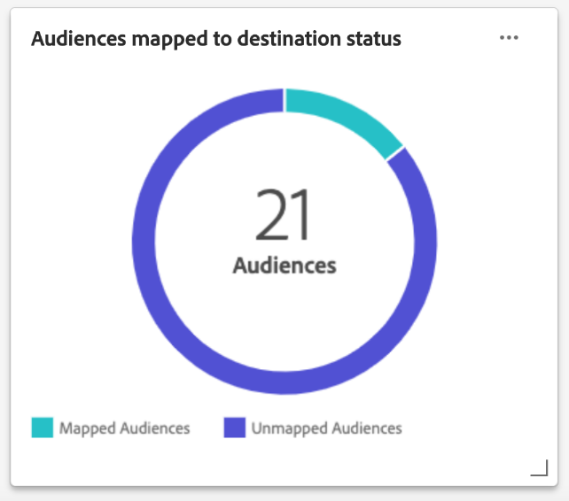

# [!UICONTROL Profiles] dashboard

De gebruikersinterface van Adobe Experience Platform (UI) verstrekt een dashboard waardoor u belangrijke informatie over uw kunt bekijken [!DNL Real-time Customer Profile] gegevens, zoals vastgelegd tijdens een dagelijkse momentopname. In deze handleiding wordt beschreven hoe u het dashboard Profielen in de gebruikersinterface kunt openen en gebruiken en wordt informatie gegeven over de metriek die in het dashboard wordt weergegeven.

Voor een overzicht van alle profielfuncties in de gebruikersinterface van het Experience Platform raadpleegt u de [Gebruikershandleiding voor gebruikersprofiel voor realtime klanten](../../profile/ui/user-guide.md).

## Profieldashboardgegevens

Op het dashboard Profielen wordt een momentopname weergegeven van de kenmerkgegevens (record) die uw organisatie heeft in de profielopslag in Experience Platform. De momentopname bevat geen gebeurtenis (tijdreeks)-gegevens.

De kenmerkgegevens in de momentopname geven de gegevens precies zo weer als op het specifieke tijdstip waarop de momentopname is gemaakt. Met andere woorden, de momentopname is geen benadering of voorbeeld van de gegevens, en het dashboard van het Profiel werkt niet in real time bij.

>[!NOTE]
>
>Wijzigingen of updates die zijn aangebracht in de gegevens nadat de momentopname is gemaakt, worden pas in het dashboard weergegeven als de volgende momentopname is gemaakt.

## Het dashboard Profielen verkennen

Als u naar het dashboard Profielen in de gebruikersinterface van het Platform wilt navigeren, selecteert u **[!UICONTROL Profiles]** in het linkerspoor, dan selecteer **[!UICONTROL Overview]** om het dashboard weer te geven.

>[!NOTE]
>
>Als uw organisatie nieuw aan Platform is en nog geen actieve datasets van het Profiel of gecreeerd samenvoegbeleid heeft, is het dashboard van Profielen niet zichtbaar. In plaats daarvan [!UICONTROL Overview] op het tabblad vindt u koppelingen en documentatie om u te helpen aan de slag te gaan met het Real-Time Klantprofiel.

### Het dashboard Profielen wijzigen

U kunt de weergave van het dashboard Profielen wijzigen door **[!UICONTROL Modify dashboard]**. Hierdoor kunt u widgets verplaatsen, toevoegen en verwijderen van het dashboard en toegang krijgen tot de **[!UICONTROL Widget library]** om beschikbare widgets te verkennen en aangepaste widgets voor uw organisatie te maken.

Raadpleeg de [wijzigen, dashboards](../customize/modify.md) en [Overzicht van widgetbibliotheek](../customize/widget-library.md) documentatie voor meer informatie.

### Widgets toevoegen {#add-widget}

Selecteren **[!UICONTROL Add widget]** om naar de widgetbibliotheek te navigeren en een lijst met de beschikbare widgets te bekijken die aan uw dashboard moeten worden toegevoegd.

In de widgetbibliotheek kunt u bladeren door de selectie van standaard- en aangepaste segmenuwidgets. Raadpleeg de documentatie bij de widgetbibliotheek voor informatie over het toevoegen van widgets. [Een widget toevoegen](../customize/widget-library.md#add-widgets).

<!-- ## (Beta) Profile efficacy insights {#profile-efficacy-insights}

>[!IMPORTANT]
>
>The profile efficacy insight functionality is currently in beta and are not available to all users. The documentation and the functionality are subject to change.

The [!UICONTROL Efficacy] tab provides metrics on the quality and completeness of your profile data through the use of profile efficacy widgets. These widgets illustrate at a glance the composition of your profiles, trends in completeness over time, and assessments on the quality of your profile data.

See the [profile efficacy widgets section](#profile-efficacy-widgets) for more information on the widgets currently available.

The layout of this dashboard is also customizable by selecting [**[!UICONTROL Modify dashboard]**](../customize/modify.md) from the [!UICONTROL Overview] tab. -->

## Bladeren door profielen {#browse-profiles}

De [!UICONTROL Browse] kunt u de alleen-lezen profielen die in uw organisatie worden opgenomen, doorzoeken en bekijken. Van hieruit kunt u belangrijke informatie zien die tot het profiel behoort met betrekking tot hun voorkeuren, gebeurtenissen uit het verleden, interacties en segmenten

Zie de documentatie over voor meer informatie over de mogelijkheden voor profielweergave die worden geboden in de interface van het Platform [browserprofielen in Adobe Real-time Customer Data Platform](../../rtcdp/profile/profile-browse.md).

## Beleid samenvoegen {#merge-policies}

De metriek die in het dashboard van Profielen wordt getoond is gebaseerd op samenvoegbeleid dat op uw gegevens van het Profiel van de Klant in real time wordt toegepast. Wanneer gegevens uit meerdere bronnen worden samengevoegd om het klantprofiel te maken, kunnen de gegevens conflicterende waarden bevatten. Bijvoorbeeld, kan één dataset een klant als &quot;enig&quot;vermelden terwijl een andere dataset de klant als &quot;gehuwd&quot;kan vermelden. Het is de taak van het fusiebeleid om te bepalen welke gegevens aan prioriteren en vertoning als deel van het profiel moeten.

Voor meer informatie over fusiebeleid, met inbegrip van hoe te om, een standaard fusiebeleid voor uw organisatie tot stand te brengen uit te geven uit te voeren, verwijs naar [overzicht van samenvoegbeleid](../../profile/merge-policies/overview.md).

Het dashboard selecteert automatisch een samenvoegbeleid dat moet worden gebruikt. Het toegepaste samenvoegbeleid kan worden gewijzigd via het vervolgkeuzemenu naast de naam van het samenvoegbeleid.

>[!NOTE]
>
>Het vervolgkeuzemenu bevat alleen samenvoegbeleidsregels die gebruikmaken van de `_xdm.context.profile` schema. Nochtans, als uw organisatie veelvoudige samenvoegingsbeleid heeft gecreeerd, kan het betekenen dat u moet scrollen om de volledige lijst van beschikbare samenvoegingsbeleid te bekijken.

## Unieregelingen

De [!UICONTROL Union Schema] Het dashboard geeft het samenvoegingsschema voor een specifieke XDM-klasse weer. Als u **[!UICONTROL Class]** kunt u de samenvoegingsschema&#39;s voor verschillende XDM-klassen weergeven.

De schema&#39;s van de unie zijn samengesteld uit veelvoudige schema&#39;s die de zelfde klasse delen en voor Profiel toegelaten. Ze stellen u in staat om in één weergave een samenvoeging te zien van elk veld in elk schema dat dezelfde klasse deelt.

Zie de gids UI van het unieschema om meer over te leren [verenigingsschema&#39;s weergeven in de gebruikersinterface van het Platform](../../profile/ui/union-schema.md#view-union-schemas).

## Widgets en metriek

Het dashboard bestaat uit widgets. Dit zijn alleen-lezen metriek die belangrijke informatie over uw profielgegevens verschaft.

De datum en tijd van de meest recente momentopname worden getoond bij de bovenkant van [!UICONTROL Overview] naast de vervolgkeuzelijst Samenvoegingsbeleid. Alle widgetgegevens zijn nauwkeurig vanaf die datum en tijd. Het tijdstempel van de momentopname wordt in UTC weergegeven; het bevindt zich niet in de tijdzone van de individuele gebruiker of organisatie.

## Standaardwidgets {#standard-widgets}

Adobe biedt meerdere standaardwidgets die u kunt gebruiken voor het visualiseren van verschillende meetgegevens die betrekking hebben op uw profielgegevens. U kunt ook aangepaste widgets maken die u met uw organisatie kunt delen met de [!UICONTROL Widget library]. Als u meer wilt weten over het maken van aangepaste widgets, leest u eerst de [Overzicht van widgetbibliotheek](../customize/widget-library.md).

Als u meer wilt weten over elk van de beschikbare standaardwidgets, selecteert u de naam van een widget in de volgende lijst:

* [[!UICONTROL Profile count]](#profile-count)
* [[!UICONTROL Profile count trend]](#profile-count-trend)
* [[!UICONTROL Profile count change]](#profile-count-change)
* [[!UICONTROL Profiles count change trend]](#profiles-count-change-trend)
* [[!UICONTROL Profiles count change trend by identity]](#profiles-count-change-trend-by-identity)
* [[!UICONTROL Profiles by identity]](#profiles-by-identity)
* [[!UICONTROL Identity overlap]](#identity-overlap)
* [[!UICONTROL Single identity profiles]](#single-identity-profiles)
* [[!UICONTROL Single identity profiles by identity]](#single-identity-profiles-by-identity)
* [[!UICONTROL Unsegmented profiles]](#unsegmented-profiles)
* [[!UICONTROL Unsegmented profiles trend]](#unsegmented-profiles-trend)
* [[!UICONTROL Unsegmented profiles by identity]](#unsegmented-profiles-by-identity)
* [[!UICONTROL Audiences]](#audiences)
* [[!UICONTROL Audiences mapped to destination status]](#audiences-mapped-to-destination-status)
* [[!UICONTROL Audiences size]](#audiences-size)
* [[!UICONTROL Audience overlap by merge policy]](#audience-overlap-by-merge-policy)
* [[!UICONTROL Audience overlap report]](#audience-overlap-report)

### [!UICONTROL Profile count] {#profile-count}

>[!CONTEXTUALHELP]
>id="platform_dashboards_profiles_profilecount"
>title="Aantal profielen"
>abstract="Deze widget geeft het totale aantal samengevoegde profielen weer in de profielopslag op het moment dat de momentopname werd gemaakt. Het getal is afhankelijk van het geselecteerde samenvoegbeleid dat wordt toegepast op de profielgegevens."

De **[!UICONTROL Profile count]** In de widget wordt het totale aantal samengevoegde profielen weergegeven in de profielopslag op het moment dat de momentopname is gemaakt. Dit getal is het resultaat van het geselecteerde samenvoegbeleid dat wordt toegepast op de profielgegevens om profielfragmenten samen te voegen tot één profiel voor elke persoon.

Zie de [sectie over samenvoegbeleid eerder in dit document](#merge-policies) voor meer informatie.

>[!NOTE]
>
>De [!UICONTROL Profile count] widget kan een ander getal weergeven dan het aantal profielen dat wordt weergegeven op het tabblad [!UICONTROL Browse] in de [!UICONTROL Profiles] om meerdere redenen. De meest voorkomende reden hiervoor is omdat de [!UICONTROL Browse] tabblad verwijst naar het totale aantal samengevoegde profielen dat is gebaseerd op het standaardsamenvoegbeleid van uw organisatie, terwijl de [!UICONTROL Profile count] widget verwijst naar het totale aantal samengevoegde profielen op basis van het samenvoegbeleid dat u hebt geselecteerd voor weergave op het dashboard.
>
>Een andere algemene reden is dat er verschillen zijn tussen de tijd waarop de dashboardmomentopname wordt gemaakt en de tijd waarop de voorbeeldtaak voor de [!UICONTROL Browse] tab. U kunt zien wanneer de [!UICONTROL Profile count] widget is voor het laatst bijgewerkt door naar de tijdstempel op de widget te kijken. Meer informatie over de manier waarop de voorbeeldtaak wordt geactiveerd op het tabblad [!UICONTROL Browse] tabblad, zie de [sectie voor het aantal profielen in de gebruikersgids Gebruikersprofiel voor realtime klanten](https://experienceleague.adobe.com/docs/experience-platform/profile/ui/user-guide.html?lang=en#profile-count).

### [!UICONTROL Profile count trend] {#profile-count-trend}

De [!UICONTROL Profile count trend] widget gebruikt een lijngrafiek om de trend in het totale aantal profielen in het systeem in tijd te illustreren. Dit totale aantal bevat alle profielen die sinds de laatste dagelijkse momentopname in het systeem zijn geïmporteerd. De gegevens kunnen gedurende perioden van 30 dagen, 90 dagen en 12 maanden worden weergegeven. De tijdsperiode wordt gekozen in een vervolgkeuzemenu in de widget.

### [!UICONTROL Profile count change] {#profile-count-change}

>[!CONTEXTUALHELP]
>id="platform_dashboards_profiles_profilescountchange"
>title="Wijziging van aantal profielen"
>abstract="Deze widget geeft het totale aantal samengevoegde profielen weer **added** naar de profielenwinkel op het moment van de laatste opname. Het getal is afhankelijk van het geselecteerde samenvoegbeleid dat wordt toegepast op de profielgegevens."

De **[!UICONTROL Profile count change]** wordt het aantal samengevoegde profielen weergegeven dat sinds de vorige momentopname aan de profielopslag is toegevoegd. Dit getal is het resultaat van het geselecteerde samenvoegbeleid dat wordt toegepast op de profielgegevens om profielfragmenten samen te voegen tot één profiel voor elke persoon. U kunt de keuzekiezer gebruiken om het aantal toegevoegde profielen weer te geven in de afgelopen 30 dagen, 90 dagen of 12 maanden.

>[!NOTE]
>
>De [!UICONTROL Profile count change] widget geeft het aantal toegevoegde profielen aan **na** de eerste profielopname en de instelling van de Profile Store. Met andere woorden, als uw organisatie de Profile Store heeft ingesteld en op dag 1 4.000.000 heeft ingeslikt, is het dashboard binnen 24 uur beschikbaar, maar de [!UICONTROL Profile count change] widget wordt ingesteld op 0. Dit wordt gedaan om een piek te vermijden verbonden aan de aanvankelijke opname van profielen in het systeem. In de komende 30 dagen, neemt uw organisatie een extra 1.000.000 profielen in de Opslag van het Profiel op. Nadat de volgende opname wordt genomen, [!UICONTROL Profile count change] widget zou in totaal 1.000.000 toegevoegde profielen weergeven, terwijl de widget [!UICONTROL Profile count] widget zou in totaal 5.000.000 profielen weergeven.

### [!UICONTROL Profiles count change trend] {#profiles-count-change-trend}

>[!CONTEXTUALHELP]
>id="platform_dashboards_profiles_profilesaddedtrend"
>title="Ontwikkeling van aantal profielen"
>abstract="Deze widget geeft het aantal samengevoegde profielen weer dat de afgelopen 30 dagen, 90 dagen of 12 maanden dagelijks aan de profielwinkel is toegevoegd. Het nummer hangt ook af van het geselecteerde samenvoegbeleid dat wordt toegepast op de profielgegevens."

De **[!UICONTROL Profiles count change trend]** widget geeft het totale aantal samengevoegde profielen weer dat de afgelopen 30 dagen, 90 dagen of 12 maanden dagelijks aan de profielwinkel is toegevoegd. Dit aantal wordt bijgewerkt elke dag wanneer de momentopname wordt genomen, daarom als u profielen in Platform zou moeten opnemen, zou het aantal profielen niet worden weerspiegeld tot de volgende momentopname wordt genomen. Het aantal toegevoegde profielen is het resultaat van het geselecteerde samenvoegbeleid dat wordt toegepast op uw profielgegevens om profielfragmenten samen te voegen tot één profiel voor elke persoon.

Zie de [sectie over samenvoegbeleid eerder in dit document](#merge-policies) voor meer informatie.

De **[!UICONTROL Profiles count change trend]** widget geeft een &#39;bijschriftknop&#39; in de rechterbovenhoek van de widget weer. Selecteren **[!UICONTROL Captions]** om het dialoogvenster voor automatische bijschriften te openen.

Een machine het leren model produceert automatisch titels voor het beschrijven van de belangrijkste tendensen en belangrijke gebeurtenissen door de grafiek en de gegevens te analyseren. Annotaties worden op basis van de bijschriften toegevoegd aan het diagram. Selecteer een bijschrift waarop u de bijbehorende annotatie wilt toepassen.

### [!UICONTROL Profiles count change trend by identity] {#profiles-count-change-trend-by-identity}

<!-- This widget uses a line graph to illustrate the change in number of profiles filtered by a chosen source identity and merge policy. -->

Deze widget filtert het aantal profielen op basis van een geselecteerde bronidentiteit en het samenvoegbeleid en illustreert vervolgens de wijziging in aantal voor verschillende periodes aan de hand van een lijngrafiek. Het samenvoegbeleid wordt geselecteerd in de overzichtsvervolgkeuzelijst boven aan de pagina. De bronidentiteit en de tijdsperiode worden geselecteerd in de widgetvervolgkeuzemenu&#39;s. De trend kan worden weergegeven over perioden van 30 dagen, 90 dagen en 12 maanden.

Met deze widget kunt u de behoeften voor doelactivering beheren door het groeipatroon van profielen aan te tonen die met een vereiste identiteit zijn gefilterd.

### [!UICONTROL Profiles by identity] {#profiles-by-identity}

>[!CONTEXTUALHELP]
>id="platform_dashboards_profiles_profilesbyidentity"
>title="Profielen op identiteit"
>abstract="Deze widget geeft de indeling van alle samengevoegde profielen in uw profielarchief op basis van identiteiten weer."

De **[!UICONTROL Profiles by identity]** widget geeft de indeling van de identiteiten in alle samengevoegde profielen in uw profielarchief weer. Het totale aantal profielen op basis van identiteit (met andere woorden, door de waarden voor elke naamruimte bij elkaar op te tellen) kan hoger zijn dan het totale aantal samengevoegde profielen, omdat aan één profiel meerdere naamruimten kunnen zijn gekoppeld. Bijvoorbeeld, als een klant met uw merk op meer dan één kanaal in wisselwerking staat, zullen de veelvoudige namespaces met die individuele klant worden geassocieerd.

Zie de [sectie over samenvoegbeleid eerder in dit document](#merge-policies) voor meer informatie.

Selecteren **[!UICONTROL Captions]** om het dialoogvenster voor automatische bijschriften te openen.

Een machine-leermodel produceert automatisch gegevensinzichten door de algemene distributie en belangrijkste dimensies van de gegevens te analyseren.

Ga voor meer informatie over identiteiten naar de [Documentatie bij Adobe Experience Platform Identity Service](../../identity-service/home.md).

### [!UICONTROL Identity overlap] {#identity-overlap}

>[!CONTEXTUALHELP]
>id="platform_dashboards_profiles_identityoverlap"
>title="Identiteitsoverlapping"
>abstract="Deze widget gebruikt een Venn-diagram om de overlapping weer te geven van profielen in uw profielarchief die de twee geselecteerde identiteiten bevatten."

De **[!UICONTROL Identity overlap]** widget gebruikt een Venn-diagram, of een setdiagram, om de overlapping weer te geven van profielen in uw profielarchief die de twee geselecteerde identiteiten bevatten.

Gebruik de widgetvervolgkeuzemenu&#39;s om de identiteiten te selecteren die u wilt vergelijken. De cirkels tonen het relatieve totale aantal profielen die elke identiteit bevatten. Het aantal profielen met beide identiteiten wordt weergegeven door de grootte van de overlapping tussen de cirkels. Als een klant op meer dan één kanaal met uw merk in wisselwerking staat, zullen de veelvoudige identiteiten met die individuele klant worden geassocieerd, daarom is het waarschijnlijk dat uw organisatie veelvoudige profielen zal hebben die fragmenten van meer dan één identiteit bevatten.

Raadpleeg de sectie over profielfragmenten voor meer informatie over profielfragmenten [profielfragmenten versus samengevoegde profielen](https://experienceleague.adobe.com/docs/experience-platform/profile/home.html?lang=en#profile-fragments-vs-merged-profiles) in het overzicht van het profiel van de Klant in real time.

Ga voor meer informatie over identiteiten naar de [Documentatie bij Adobe Experience Platform Identity Service](../../identity-service/home.md).

### [!UICONTROL Single identity profiles] {#single-identity-profiles}

>[!CONTEXTUALHELP]
>id="platform_dashboards_profiles_singleidentityprofiles"
>title="Eén identiteitsprofiel"
>abstract="Deze widget bevat een aantal profielen van uw organisatie die slechts één type id hebben waarmee hun identiteit wordt gemaakt. Dit id-type kan een e-mail of een ECID zijn."

De [!UICONTROL Single Identity Profiles] widget bevat een aantal profielen van uw organisatie die slechts één type id hebben waarmee hun identiteit wordt gemaakt. Dit id-type kan een e-mail of een ECID zijn. Het aantal profielen wordt gegenereerd op basis van de gegevens in de meest recente momentopname.

### [!UICONTROL Single identity profiles by identity] {#single-identity-profiles-by-identity}

Deze widget gebruikt een staafdiagram om het totale aantal profielen te illustreren dat met slechts één unieke id wordt geïdentificeerd. De widget ondersteunt maximaal vijf van de meest voorkomende identiteiten.

Houd de muisaanwijzer boven afzonderlijke balken om een dialoogvenster weer te geven met het totale aantal profielen voor een identiteit.

### [!UICONTROL Unsegmented profiles] {#unsegmented-profiles}

>[!CONTEXTUALHELP]
>id="platform_dashboards_profiles_unsegmentedprofiles"
>title="Niet-gesegmenteerde profielen"
>abstract="Deze widget geeft het totale aantal profielen weer dat niet aan een segment is gekoppeld en biedt de mogelijkheid om profielen in uw hele organisatie te activeren."

De [!UICONTROL Unsegmented Profiles] widget geeft het totale aantal profielen weer dat niet aan een segment is gekoppeld. Het gegenereerde nummer is nauwkeurig vanaf de laatste momentopname en biedt de mogelijkheid om het profiel in uw organisatie te activeren. Het wijst ook op de kans om profielen uit te sluiten die geen adequate ROI verstrekken.

### [!UICONTROL Unsegmented profiles trend] {#unsegmented-profiles-trend}

>[!CONTEXTUALHELP]
>id="platform_dashboards_profiles_unsegmentedprofilestrend"
>title="Trend voor niet-gesegmenteerde profielen"
>abstract="Deze widget verschaft een lijngrafiekillustratie voor het aantal profielen dat gedurende een bepaalde tijdsperiode niet aan een segment is gekoppeld. De trend van profielen die niet aan om het even welk segment verbonden zijn kan over 30 dagen, 90 dagen, en periodes van 12 maanden worden visualiseerd."

De [!UICONTROL Unsegmented Profiles Trend] widget geeft een illustratie van de lijngrafiek voor het aantal profielen die niet aan om het even welk segment over een bepaalde periode in bijlage zijn. De trend van profielen die niet aan om het even welk segment verbonden zijn kan over 30 dagen, 90 dagen, en periodes van 12 maanden worden visualiseerd. De tijdsperiode wordt gekozen in een vervolgkeuzemenu in de widget. Het aantal profielen wordt weerspiegeld op de y-as en de tijd op de x-as.

### [!UICONTROL Unsegmented profiles by identity] {#unsegmented-profiles-by-identity}

>[!CONTEXTUALHELP]
>id="platform_dashboards_profiles_unsegmentedprofilesbyidentity"
>title="Gesegmenteerde profielen opsplitsen op identiteit"
>abstract="Deze widget categoriseert het totale aantal niet-gesegmenteerde profielen op basis van hun unieke id."

De [!UICONTROL Unsegmented Profiles by Identity] widget categoriseert het totale aantal niet-gesegmenteerde profielen op basis van hun unieke id. De gegevens worden in een staafdiagram weergegeven, zodat ze gemakkelijk kunnen worden vergeleken.

### [!UICONTROL Audiences] {#audiences}

Deze widget geeft het totale aantal segmenten weer dat gereed is om te worden geactiveerd, op basis van het gekozen samenvoegbeleid dat op de profielgegevens wordt toegepast.

Selecteren **[!UICONTROL Audiences]** om naar de [!UICONTROL Segments] dashboard [!UICONTROL Browse] tab. Van daar kunt u een lijst van alle segmentdefinities voor uw organisatie zien.

<!-- https://jira.corp.adobe.com/browse/PLAT-115291 -->

<!-- * [[!UICONTROL Audiences change trend]](#audiences-change-trend) -->
<!-- ### [!UICONTROL Audiences change trend] {#audiences-change-trend}

This line graph widget visualizes the change in the total number of audiences each day, trending over time. The change in the number of audiences is dependent on the selected merge policy being applied to your profile data. The period of analysis is selected from the widget dropdown menu. The bar chart can be visualized over 30 days, 90 days, and 12-month periods.  

The visualization allows you to monitor the overall health of audiences within Adobe Experience Platform by understanding trends in the growth or decline of the total number of audiences. -->

<!--  -->

### [!UICONTROL Audience overlap report] {#audience-overlap-report}

Deze widget stelt de gegevens over publieksoverlap van alle beschikbare segmenten die door samenvoegbeleid worden gefilterd in tabelvorm samen. Een lijst van vijf publiek dat van hoogste tot laagste overlappende percentages wordt gerangschikt wordt verstrekt voor het fusiebeleid dat van het dropdown menu bij de bovenkant van het scherm wordt gekozen. De twee geanalyseerde segmenten worden vermeld in de [!UICONTROL SEGMENT A NAME] en [!UICONTROL SEGMENT B NAME] kolommen. De procentuele overlapping wordt vermeld in de derde kolom, tot op twaalf decimalen nauwkeurig.

Het publiek overlapt rapport helpt u om nieuwe, krachtige segmenten te bouwen. Wanneer u een hoog percentage van de overlappingen observeert, kunt u het publiek onderdrukken en voorkomen dat hetzelfde publiek naar andere bestemmingen wordt gestuurd. Ze helpen u ook verborgen inzichten te identificeren die kunnen helpen met betere segmentatie. Met een laag percentage overlappingen kunt u unieke profielen zoeken.

Selecteren **[!UICONTROL View more]** om een dialoogvenster op volledig scherm te openen dat meer publiek overlappende gegevens bevat.

De [!UICONTROL Audience overlap report] wordt weergegeven. Dit dialoogvenster kan tot 50 rijen publiek bevatten die analyses overlappen die in zes kolommen zijn opgedeeld. Selecteer het instellingenpictogram () om kolommen uit de tabel te verwijderen of toe te voegen.

>[!NOTE]
>
>Selecteer **[!UICONTROL Overlapping]** kolomkop om de volgorde van de resultaten te wijzigen van het hoogste naar het laagste of het laagste naar het hoogste.

Als u het volledige rapport in de indeling PDF wilt downloaden, selecteert u het optiemenu (**`...`**) gevolgd door **[!UICONTROL Download]**.

Selecteer een rij in het rapport om een Venn-diagram van de overlappende analyse te openen. Houd de muisaanwijzer boven een gedeelte van het Venn-diagram om het aantal profielen in een dialoogvenster weer te geven.

Selecteren **[!UICONTROL Close]** om terug te keren naar de [!UICONTROL Profiles] dashboard.

### [!UICONTROL Audiences mapped to destination status] {#audiences-mapped-to-destination-status}

De [!UICONTROL Audiences mapped to destination status] widget geeft het totale aantal in kaart gebrachte en niet in kaart gebrachte doelgroepen in één meting weer en gebruikt een donutdiagram om het proportionele verschil tussen hun totalen aan te geven. De berekende aantallen zijn afhankelijk van het gekozen samenvoegbeleid.

Individuele tellingen voor of in kaart gebracht of unmapped publiek worden getoond in een dialoog wanneer de curseur over de respectieve sectie van de donutgrafiek beweegt.

### [!UICONTROL Audiences size] {#audiences-size}

De [!UICONTROL Audiences size] widget biedt een tabel met twee kolommen met maximaal 20 segmenten en het totale aantal soorten publiek in elk segment. De lijst wordt geordend van hoog tot laag op basis van het totale aantal doelgroepen. Het totale aantal publieksgrootten is afhankelijk van het toegepaste samenvoegingsbeleid.

Om uitvoerige informatie over een segment te zien, selecteer een segmentnaam van de lijst wordt verstrekt om aan te navigeren [!UICONTROL Segments] [!UICONTROL Detail] pagina. Ook door **[!UICONTROL View all segments]** vanaf het einde van de widget kunt u naar het [!UICONTROL Segments] [!UICONTROL Browse] om een bestaand segment te zoeken.

Zie de documentatie voor meer informatie over de [[!UICONTROL Segments] [!UICONTROL  Browse] tab](https://experienceleague.adobe.com/docs/experience-platform/segmentation/ui/overview.html#browse).

### [!UICONTROL Audience overlap by merge policy] {#audience-overlap-by-merge-policy}

Deze widget gebruikt een Venn-diagram om de overlapping van twee geselecteerde segmenten weer te geven. Het samenvoegbeleid wordt gekozen uit de overzichtsvervolgkeuzelijst boven aan de pagina en de segmenten voor analyse worden geselecteerd uit twee vervolgkeuzemenu&#39;s binnen de widget. Het totale aantal profielen binnen de relevante segmentdefinitie kan worden gezien door de cursor over een cirkel of de doorsnede te bewegen.

Aangezien widget de visuele oversteekplaats van segmentdefinities toont, kunt u uw segmenteringsstrategie optimaliseren door gelijkenissen tussen uw segmentdefinities te bestuderen.

<!-- ## (Beta) Profile efficacy widgets {#profile-efficacy-widgets}

>[!IMPORTANT]
>
>The profile efficacy widgets are currently in Beta and are not available to all users. The documentation and the functionality are subject to change.

Adobe provides multiple widgets to assess the completeness of the ingested profiles available for your data analysis. Each of the profile efficacy widgets can be filtered by the merge policy. To change the merge policy filter, select the[!UICONTROL Profiles using merge policy] dropdown and choose the appropriate policy from the available list.

To learn more about each of the profile efficacy widgets, select the name of a widget from the following list:

* [[!UICONTROL Attribute quality assessment]](#attributes-quality-assessment)
* [[!UICONTROL Profiles by completeness]](#profiles-by-completeness)
* [[!UICONTROL Profiles completeness trend]](#profiles-completeness-trend)

### (Beta) [!UICONTROL Attributes quality assessment] {#attributes-quality-assessment}

>[!CONTEXTUALHELP]
>id="platform_dashboards_profiles_attributesqualityassessment"
>title="Attributes quality assessment"
>abstract="This widget shows the completeness and cardinality of all profiles according to their attributes. Each row describes one attribute. The **Profiles** column provides the number of profiles that have this attribute and are filled with non-null values. The **Completeness** percentage is determined by the total number of profiles that have this attribute and are filled with non-null values divided by the total number of non-empty values in the profiles for that attribute. **Cardinality** provides the total number of unique non-null values of this attribute across all attributes."

The [!UICONTROL Attribute quality assessment] widget shows the completeness and cardinality of all profiles according to their attributes. The data is accurate to the last processing date. This information is presented as a table with four columns where each row in the table represents a single attribute.

| Column  | Description  |
|---|---|
| Attribute  | The name of the attribute.  |
| Profiles  | The number of profiles that have this attribute and are filled with non-null values.  |
| Completeness  | This percentage is determined by the total number of profiles that have this attribute and are filled with non-null values. The number is calculated by dividing the total number of profiles by the total number of non-empty values in the profiles for that attribute.  |
| Cardinality  | The total number of **unique** non-null values of this attribute. It is measured across all profiles. |

### (Beta) [!UICONTROL Profiles by completeness] {#profiles-by-completeness}

>[!CONTEXTUALHELP]
>id="platform_dashboards_profiles_profilesbycompleteness"
>title="Profiles by completeness"
>abstract="The donut chart displays the percentage of profile attributes that are filled with non-null values among all observed attributes. It illustrates the proportion of profiles that are of high, medium, or low completeness. High completeness profiles have more than 70% of their attributes filled. Medium completeness profiles have between 30% and 70% of their attributes filled. Low completeness profiles have less than 30% of their attributes filled."

The [!UICONTROL Profiles by completeness] widget creates a donut chart of profile completeness since the last processing date. The completeness of a profile is measured by the percentage of attributes that are filled with non-null values among all observed attributes.

This widget shows the proportion of profiles that are of high, medium, or low completeness. By default, there are three levels of completeness configured: 

* High completeness: Profiles have more than 70% of their attributes filled. 
* Medium completeness: Profiles have between 30% and 70% of their attributes filled. 
* Low completeness: Profiles have less than 30% of their attributes filled. 

### (Beta) [!UICONTROL Profiles completeness trend] {#profiles-completeness-trend}

>[!CONTEXTUALHELP]
>id="platform_dashboards_profiles_profilescompletenesstrend"
>title="Profiles completeness trend"
>abstract="This widget creates a stacked area chart to depict the trend of profile completeness over time. Completeness is measured by the percentage of attributes that are filled with non-null values among all observed attributes."

This widget creates a stacked area chart to depict the trend of profile completeness over time. Completeness is measured by the percentage of attributes filled with non-null values among all observed attributes. It categorizes the profile completeness as high, medium, or low completeness since the last processing date.

The x-axis represents time, the y-axis represents the number of profiles, and the colors represent the three levels of profile completeness. 

The three levels of completeness are:

* High completeness: Profiles have more than 70% of attributes filled. 
* Medium completeness: Profiles have less than 70% and more than 30% of attributes filled. 
* Low completeness: Profiles have less than 30% of attributes filled.

 -->

## Volgende stappen

Als u dit document volgt, kunt u nu het dashboard voor profielen vinden en begrijpen welke maatstaven worden weergegeven in de beschikbare widgets. Meer informatie over werken met [!DNL Profile] gegevens in de gebruikersinterface van het Experience Platform, gelieve te verwijzen naar [Gebruikershandleiding voor gebruikersprofiel voor realtime klanten](../../profile/ui/user-guide.md).
