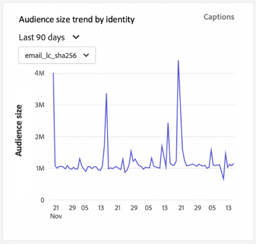

# Segmentdashboard {#segment-dashboard}

De gebruikersinterface van Adobe Experience Platform (UI) verstrekt een dashboard waardoor u belangrijke informatie over uw segmenten kunt bekijken, zoals die tijdens een dagelijkse momentopname wordt gevangen. Deze gids schetst hoe te om tot en met het segmentdashboard in UI toegang te hebben en te werken en verstrekt meer informatie betreffende de visualisaties die in het dashboard worden getoond.

Voor een overzicht van alle functies van de Adobe Experience Platform Segmentation Service in de gebruikersinterface van het Platform gaat u naar de [Handleiding voor segmentatieservice](../../segmentation/ui/overview.md).

## Segmentdashboardgegevens

Het segmentdashboard toont een momentopname van de attributen (verslag) gegevens die uw organisatie binnen de opslag van het Profiel in Experience Platform heeft. De momentopname bevat geen gebeurtenis (tijdreeks)-gegevens.

De kenmerkgegevens in de momentopname geven de gegevens precies zo weer als op het specifieke tijdstip waarop de momentopname is gemaakt. Met andere woorden, de momentopname is geen benadering of steekproef van de gegevens, en het segmentdashboard werkt niet in real time bij.

>[!NOTE]
>
>Wijzigingen of updates die zijn aangebracht in de gegevens nadat de momentopname is gemaakt, worden pas in het dashboard weergegeven als de volgende momentopname is gemaakt.

## Het segmentdashboard verkennen

Ga naar de [!UICONTROL Segments] dashboard in de interface van het Platform, selecteert u **[!UICONTROL Segments]** in het linkerspoor, dan selecteer **[!UICONTROL Overview]** om het dashboard weer te geven.

>[!NOTE]
>
>Als uw organisatie nieuw aan Platform is en nog niet de actieve datasets van het Profiel of gecreeerd verenigingsbeleid heeft, [!UICONTROL Segments] het dashboard is niet zichtbaar. In plaats daarvan [!UICONTROL Overview] het lusje toont verbindingen en documentatie om u te helpen met segmentatie beginnen.

### Het wijzigen van [!UICONTROL Segments] dashboard

U kunt de weergave van het dialoogvenster [!UICONTROL Segments] dashboard door **[!UICONTROL Modify dashboard]**. Hierdoor kunt u widgets verplaatsen, toevoegen en verwijderen van het dashboard en toegang krijgen tot de **[!UICONTROL Widget library]** om beschikbare widgets te verkennen en aangepaste widgets voor uw organisatie te maken.

Raadpleeg de [wijzigen, dashboards](../customize/modify.md) en [Overzicht van widgetbibliotheek](../customize/widget-library.md) documentatie voor meer informatie.

## Een segment selecteren

Het dashboard selecteert automatisch een segment aan vertoning, nochtans kunt u het segment veranderen door het dropdown menu of de segmentselecteur te gebruiken.

Als u een ander segment wilt kiezen, selecteert u de vervolgkeuzelijst naast de segmentnaam of gebruikt u de segmentkiezer om het dialoogvenster voor segmentselectie te openen.

## Widgets en metriek

Het segmentdashboard bestaat uit widgets. Dit zijn alleen-lezen metriek die belangrijke informatie over het geselecteerde segment verschaft.

De datum en tijd &#39;laatst bijgewerkt&#39; op een widget geeft aan wanneer de laatste momentopname van de gegevens is gemaakt. De datum en het tijdstip van de momentopname worden in UTC vermeld; het bevindt zich niet in de tijdzone van de individuele gebruiker of IMS-organisatie.

## Standaardwidgets

Adobe biedt meerdere standaardwidgets die u kunt gebruiken voor het visualiseren van verschillende maateenheden voor uw segmenten. U kunt ook aangepaste widgets maken die u met uw organisatie kunt delen met de [!UICONTROL Widget library]. Als u meer wilt weten over het maken van aangepaste widgets, leest u eerst de [Overzicht van widgetbibliotheek](../customize/widget-library.md).

Als u meer wilt weten over elk van de beschikbare standaardwidgets, selecteert u de naam van een widget in de volgende lijst:

* [[!UICONTROL Audience size]](#audience-size)
* [[!UICONTROL Identity overlap]](#identity-overlap)
* [[!UICONTROL Profiles by identity]](#profiles-by-identity)
* [[!UICONTROL Audience activation order]](#audience-activation-order)
* [[!UICONTROL Audience size trend]](#audience-size-trend)
* [[!UICONTROL Audience size change trend]](#audience-size-change-trend)
* [[!UICONTROL Audience size trend by identity]](#audience-size-trend-by-identity)

### [!UICONTROL Audience size] {#audience-size}

De **[!UICONTROL Audience size]** widget geeft het totale aantal samengevoegde profielen weer binnen het geselecteerde segment op het moment dat de opname werd gemaakt. Dit getal is het resultaat van het toepassen van het samenvoegbeleid voor segmenten op de profielgegevens om profielfragmenten samen te voegen tot één profiel voor elke persoon in het segment.

Voor meer informatie over fragmenten en samengevoegde profielen, eerst leest u de [Overzicht van het realtime klantprofiel](../../profile/home.md).

### [!UICONTROL Identity overlap] {#identity-overlap}

De **[!UICONTROL Identity overlap]** widget geeft een Venn-diagram weer of stelt een diagram in waarin de overlapping van profielen in uw segment met meerdere identiteiten wordt weergegeven.

Nadat u de vervolgkeuzemenu&#39;s op de widget hebt gebruikt om de identiteiten te selecteren die u wilt vergelijken, worden cirkels weergegeven met de relatieve grootte van elke identiteit, waarbij het aantal profielen met beide naamruimten wordt weergegeven door de grootte van de overlapping tussen de cirkels.

Als een klant op meer dan één kanaal met uw merk in wisselwerking staat, zullen de veelvoudige identiteiten met die individuele klant worden geassocieerd, daarom is het waarschijnlijk dat uw organisatie veelvoudige profielen zal hebben die fragmenten van meer dan één identiteit bevatten.

Ga voor meer informatie over identiteiten naar de [Documentatie bij Adobe Experience Platform Identity Service](../../identity-service/home.md).

### [!UICONTROL Profiles by identity] {#profiles-by-identity}

De **[!UICONTROL Profiles by identity]** widget geeft de indeling van de identiteiten in alle samengevoegde profielen in het geselecteerde segment weer. Het totale aantal profielen per identiteit kan hoger zijn dan het totale aantal profielen in het segment, omdat aan één profiel meerdere identiteiten kunnen zijn gekoppeld. Met andere woorden, het samenvoegen van de waarden die voor elke identiteit worden getoond kan meer dan de totale publieksgrootte in het segment totaal omdat als een klant met uw merk op meer dan één kanaal interactie aangaat, de veelvoudige identiteiten met die individuele klant kunnen worden geassocieerd.

Selecteren **[!UICONTROL Captions]** om het dialoogvenster voor automatische bijschriften te openen.

Een machine-leermodel produceert automatisch gegevensinzichten door de algemene distributie en belangrijkste dimensies van de gegevens te analyseren.

Ga voor meer informatie over identiteiten naar de [Documentatie bij Adobe Experience Platform Identity Service](../../identity-service/home.md).

### [!UICONTROL Audience activation order] {#audience-activation-order}

De [!UICONTROL Audience activation order] widget biedt een tabel met drie kolommen waarin de [!UICONTROL destination name]de [!UICONTROL platform]en de activering [!UICONTROL date] van het publiek. De lijst wordt geordend van hoog tot laag afhankelijk van recentie en kan maximaal 10 rijen bevatten.

### [!UICONTROL Audience size trend] {#audience-size-trend}

De [!UICONTROL Audience size trend] widget geeft een lijngrafiek voor het totale aantal profielen die voldoen aan de criteria van **alle** segmentdefinitie over een bepaalde periode. De trend van de publieksgrootte kan over 30 dagen, 90 dagen, en periodes van 12 maanden worden visualiseerd. De tijdsperiode wordt gekozen in een vervolgkeuzemenu in de widget. De publieksgrootte wordt weerspiegeld op de y-as en de tijd op de x-as.

### [!UICONTROL Audience size change trend] {#audience-size-change-trend}

Deze widget geeft een lijngrafiekillustratie van het verschil in het totale aantal profielen dat voor een bepaald segment in aanmerking kwam tussen de meest recente dagelijkse momentopnamen. Het voor analyse gekozen segment wordt geselecteerd uit het overzichtsvervolgkeuzemenu. De periode van trendanalyse kan over 30 dagen, 90 dagen, en periodes van 12 maanden worden visualiseerd. De tijdsperiode wordt gekozen in een vervolgkeuzemenu in de widget. De publieksgrootte wordt weerspiegeld op de y-as en de tijd op de x-as.

### [!UICONTROL Audience size trend by identity] {#audience-size-trend-by-identity}

Deze widget illustreert de trend van de publieksgrootte voor een bepaald segment op basis van het gekozen type identiteit in het vervolgkeuzemenu van de widget. Het segment dat voor analyse wordt gebruikt wordt geselecteerd van het overzichtsdrop-down. De periode van trendanalyse kan over 30 dagen, 90 dagen, en periodes van 12 maanden worden visualiseerd. De tijdsperiode wordt gekozen in een vervolgkeuzemenu in de widget.

## Volgende stappen

Door dit document te volgen, zou u van het segmentdashboard moeten kunnen de plaats bepalen en een segment selecteren om te bekijken. U moet ook weten welke maatstaven worden weergegeven in de beschikbare widgets. Als u meer wilt weten over het werken met segmenten in de gebruikersinterface van het Experience Platform, raadpleegt u de [Handleiding voor segmentatieservice](../../segmentation/ui/overview.md).
