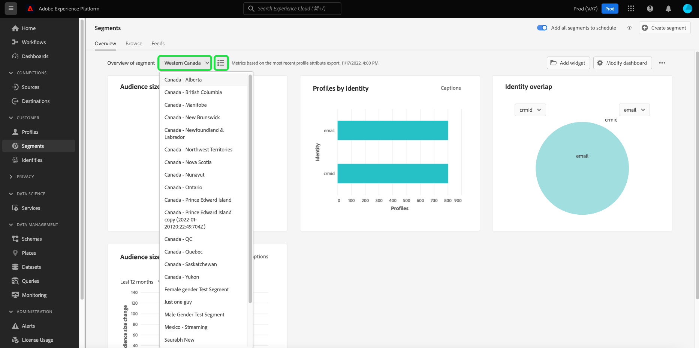
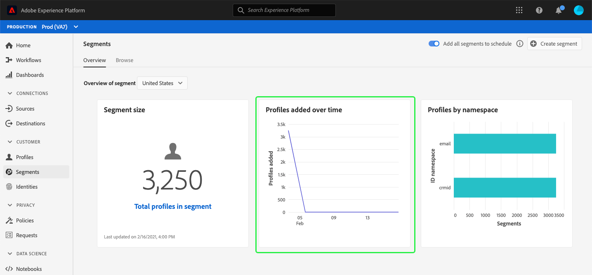

# (Beta) Segmentdashboard {#segment-dashboard}

>[!IMPORTANT]
>
>De dashboardfunctionaliteit die in dit document wordt beschreven is momenteel in bèta en is niet beschikbaar voor alle gebruikers. De documentatie en de functionaliteit kunnen worden gewijzigd.

De gebruikersinterface van Adobe Experience Platform (UI) verstrekt een dashboard waardoor u belangrijke informatie over uw segmenten kunt bekijken, zoals die tijdens een dagelijkse momentopname wordt gevangen. Deze gids schetst hoe te om tot en met het segmentdashboard in UI toegang te hebben en te werken en verstrekt meer informatie betreffende de visualisaties die in het dashboard worden getoond.

Voor een overzicht van alle functies van de Adobe Experience Platform Segmentation Service binnen de gebruikersinterface van het Platform, gelieve [de gids van de Dienst van de Segmentatie ](../../segmentation/ui/overview.md) te bezoeken.

## Segmentdashboardgegevens

Het segmentdashboard toont een momentopname van de attributen (verslag) gegevens die uw organisatie binnen de opslag van het Profiel in Experience Platform heeft. De momentopname bevat geen gebeurtenis (tijdreeks)-gegevens.

De kenmerkgegevens in de momentopname geven de gegevens precies zo weer als op het specifieke tijdstip waarop de momentopname is gemaakt. Met andere woorden, de momentopname is geen benadering of monster van de gegevens, en het segmentdashboard werkt niet in echt bij - tijd.

>[!NOTE]
>
>Wijzigingen of updates die zijn aangebracht in de gegevens nadat de momentopname is gemaakt, worden pas in het dashboard weergegeven als de volgende momentopname is gemaakt.

## Het segmentdashboard verkennen

Als u naar het segmentdashboard in de interface van het Platform wilt navigeren, selecteert u **[!UICONTROL Segmenten]** in de linkertrack en selecteert u vervolgens het tabblad **[!UICONTROL Overzicht]** om het dashboard weer te geven.

### Een segment selecteren

Het dashboard zal automatisch een segment selecteren om te tonen, maar u kunt het segment veranderen dat gebruikend het drop-down menu wordt getoond. Als u een ander segment wilt kiezen, selecteert u de vervolgkeuzelijst naast de segmentnaam en selecteert u het segment dat u wilt weergeven.

>[!NOTE]
>
>In het vervolgkeuzemenu ziet u alle segmenten die uw organisatie tot nu toe heeft gemaakt. Dit kan betekenen dat u zult moeten scrollen om de volledige lijst van beschikbare segmenten te bekijken.

### Widgets en metriek

Het segmentdashboard bestaat uit widgets. Dit zijn alleen-lezen metriek die belangrijke informatie over het geselecteerde segment verschaft. De datum en tijd &#39;laatst bijgewerkt&#39; op de widget geven aan wanneer de laatste momentopname van de gegevens is gemaakt.

## Beschikbare widgets

Experience Platform biedt meerdere widgets die u kunt gebruiken voor het visualiseren van verschillende meetgegevens die betrekking hebben op uw segment. Selecteer de naam van een widget hieronder voor meer informatie:

* [[!UICONTROL Segmentgrootte]](#segment-size)
* [[!UICONTROL Profielen die in de loop der tijd zijn toegevoegd]](#profiles-added-over-time)
* [[!UICONTROL Profielen op naamruimte]](#profiles-by-namespace)

### [!UICONTROL Segmentgrootte] {#segment-size}

Met de widget **[!UICONTROL Segmentgrootte]** wordt het totale aantal samengevoegde profielen weergegeven binnen het geselecteerde segment op het moment dat de momentopname werd gemaakt. Dit getal is het resultaat van het toepassen van het samenvoegbeleid voor segmenten op de profielgegevens om profielfragmenten samen te voegen tot één profiel voor elke persoon in het segment.

Voor meer informatie over fragmenten en samengevoegde profielen, gelieve te beginnen door [overzicht van het Profiel van de Klant in real time](../../profile/home.md) te lezen.

### [!UICONTROL Profielen die in de loop der tijd zijn toegevoegd] {#profiles-added-over-time}

De widget **[!UICONTROL Profielen die in de loop van de tijd worden toegevoegd]** biedt informatie over het totale aantal profielen in het segment dat tijdens de dagelijkse momentopname, gedurende de laatste 30 dagen is vastgelegd. Deze widget geeft aan hoe de segmentgrootte over een periode van 30 dagen kan zijn verschoven omdat nieuwe profielen in aanmerking komen voor of het segment verlaten.

Raadpleeg de [documentatie bij Segmentatieservice](../../segmentation/home.md) voor meer informatie over segmentbeoordeling en hoe profielen in aanmerking komen en uit segmenten worden afgesloten.

### [!UICONTROL Profielen op naamruimte] {#profiles-by-namespace}

Met de widget **[!UICONTROL Profielen op naamruimte]** wordt de uitsplitsing van naamruimten in alle samengevoegde profielen in het geselecteerde segment weergegeven. Het totale aantal profielen per naamruimte van de identiteit ([!UICONTROL ID naamruimte] in de widget) kan hoger zijn dan het totale aantal profielen in het segment omdat aan één profiel meerdere naamruimten kunnen zijn gekoppeld. Met andere woorden, het samenvoegen van de waarden die voor elke namespace worden getoond kan meer dan de totale profielen in het segment totaal omdat als een klant met uw merk op meer dan één kanaal interactie aangaat, veelvoudige namespaces met die individuele klant kunnen worden geassocieerd.

Voor meer informatie over naamruimten gaat u naar de [documentatie van de Adobe Experience Platform Identity Service](../../identity-service/home.md).

## Volgende stappen

Als u dit document volgt, kunt u nu het segmentdashboard vinden en een segment selecteren dat u wilt bekijken. U moet ook weten welke maatstaven worden weergegeven in de beschikbare widgets. Meer over het werken met segmenten in de UI van het Experience Platform leren, gelieve te verwijzen naar [de gids UI van de Dienst van de Segmentatie](../../segmentation/ui/overview.md).