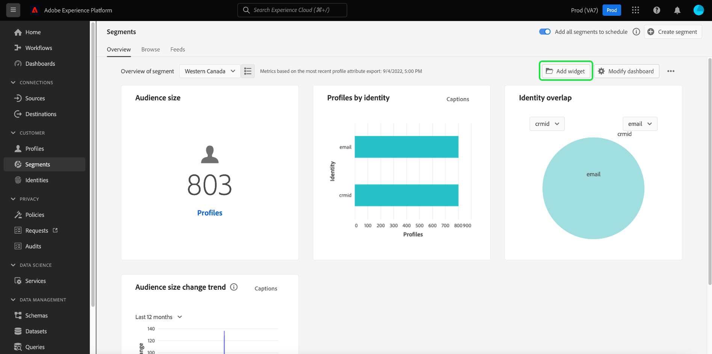
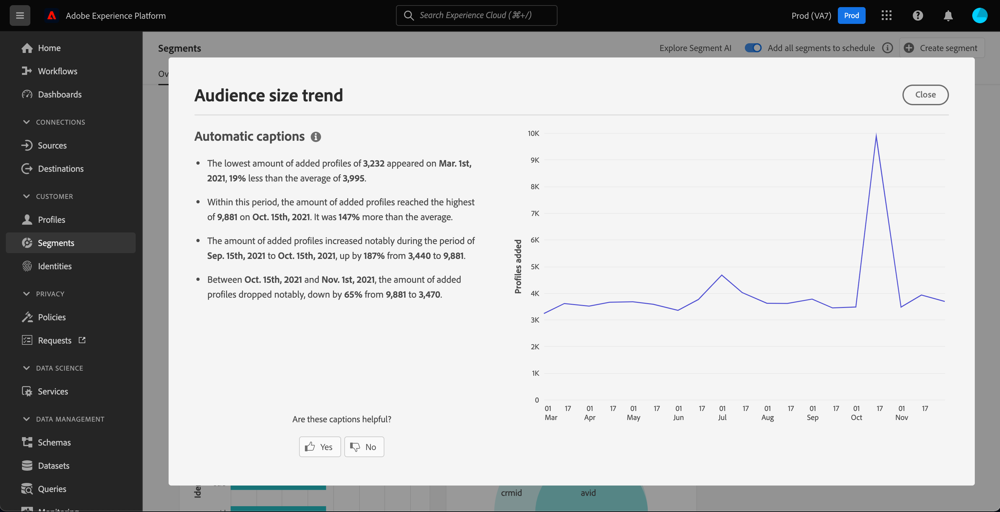
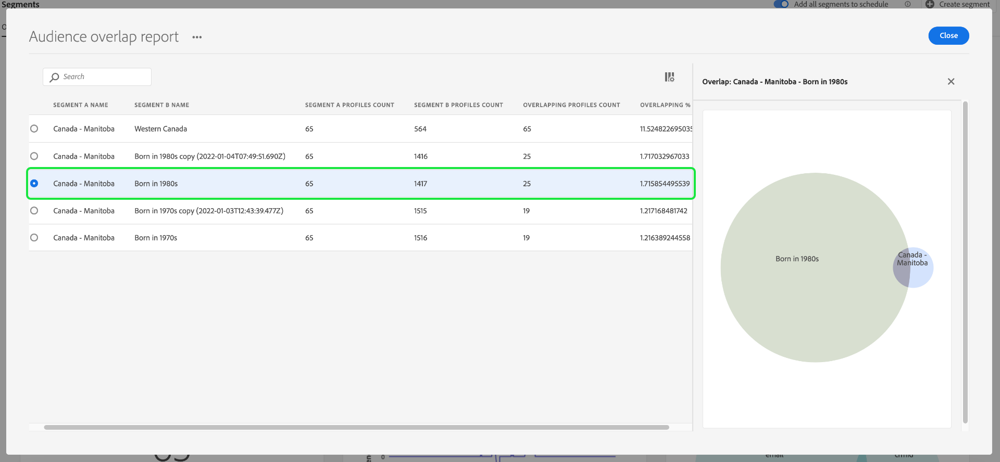

# [!UICONTROL Segments] dashboard {#segment-dashboard}

De gebruikersinterface van Adobe Experience Platform (UI) verstrekt een dashboard waardoor u belangrijke informatie over uw segmenten kunt bekijken, zoals die tijdens een dagelijkse momentopname wordt gevangen. Deze gids schetst hoe te om tot en met het segmentdashboard in UI toegang te hebben en te werken en verstrekt meer informatie betreffende de visualisaties die in het dashboard worden getoond.

Voor een overzicht van alle functies van de Adobe Experience Platform Segmentation Service in de gebruikersinterface van het Platform gaat u naar de [Handleiding voor segmentatieservice](../../segmentation/ui/overview.md).

## [!UICONTROL Segments] dashboardgegevens

Het segmentdashboard toont een momentopname van de attributen (verslag) gegevens die uw organisatie binnen de opslag van het Profiel in Experience Platform heeft. De momentopname bevat geen gebeurtenis (tijdreeks)-gegevens.

De kenmerkgegevens in de momentopname geven de gegevens precies zo weer als op het specifieke tijdstip waarop de momentopname is gemaakt. Met andere woorden, de momentopname is geen benadering of steekproef van de gegevens, en het segmentdashboard werkt niet in real time bij.

>[!NOTE]
>
>Wijzigingen of updates die zijn aangebracht in de gegevens nadat de momentopname is gemaakt, worden pas in het dashboard weergegeven als de volgende momentopname is gemaakt.

## Ontdek de [!UICONTROL Segments] dashboard {#explore}

Ga naar de [!UICONTROL Segments] dashboard in de interface van het Platform, selecteert u **[!UICONTROL Segments]** in het linkerspoor, dan selecteer **[!UICONTROL Overview]** om het dashboard weer te geven.

>[!NOTE]
>
>Als uw organisatie nieuw aan Platform is en nog niet de actieve datasets van het Profiel of gecreeerd verenigingsbeleid heeft, [!UICONTROL Segments] het dashboard is niet zichtbaar. In plaats daarvan [!UICONTROL Overview] het lusje toont verbindingen en documentatie om u te helpen met segmentatie beginnen.

### De [!UICONTROL Segments] dashboard {#modify}

U kunt de weergave van het dialoogvenster [!UICONTROL Segments] dashboard door **[!UICONTROL Modify dashboard]**. Hierdoor kunt u widgets verplaatsen, toevoegen en verwijderen van het dashboard en toegang krijgen tot de **[!UICONTROL Widget library]** om beschikbare widgets te verkennen en aangepaste widgets voor uw organisatie te maken.

Raadpleeg de [wijzigen, dashboards](../customize/modify.md) en [Overzicht van widgetbibliotheek](../customize/widget-library.md) documentatie voor meer informatie.

### Widgets toevoegen {#add-widget}

Selecteren **[!UICONTROL Add widget]** om naar de widgetbibliotheek te navigeren en een lijst met de beschikbare widgets te bekijken die aan uw dashboard moeten worden toegevoegd.

In de widgetbibliotheek kunt u bladeren door de selectie van standaard- en aangepaste segmenuwidgets. Raadpleeg de documentatie bij de widgetbibliotheek voor informatie over het toevoegen van widgets. [Een widget toevoegen](../customize/widget-library.md#add-widgets).

## Een segment selecteren

Het dashboard selecteert automatisch een segment aan vertoning, nochtans kunt u het segment veranderen door het dropdown menu of de segmentselecteur te gebruiken.

Als u een ander segment wilt kiezen, selecteert u de vervolgkeuzelijst naast de segmentnaam of gebruikt u de segmentkiezer om het dialoogvenster voor segmentselectie te openen.

>[!IMPORTANT]
>
>Alleen segmenten met een profielaantal groter dan nul worden weergegeven in de lijst met selecteerbare segmenten.

## Widgets en metriek

Het segmentdashboard bestaat uit widgets. Dit zijn alleen-lezen metriek die belangrijke informatie over het geselecteerde segment verschaft.

De datum en tijd van de meest recente momentopname worden getoond bij de bovenkant van [!UICONTROL Overview] naast de segmentvervolgkeuzelijst. Alle widgetgegevens zijn nauwkeurig vanaf die datum en tijd. Het tijdstempel van de momentopname wordt in UTC weergegeven; het bevindt zich niet in de tijdzone van de individuele gebruiker of organisatie.

## Standaardwidgets {#standard-widgets}

Adobe biedt meerdere standaardwidgets die u kunt gebruiken voor het visualiseren van verschillende maateenheden voor uw segmenten. U kunt ook aangepaste widgets maken die u met uw organisatie kunt delen met de [!UICONTROL Widget library]. Als u meer wilt weten over het maken van aangepaste widgets, leest u eerst de [Overzicht van widgetbibliotheek](../customize/widget-library.md).

Als u meer wilt weten over elk van de beschikbare standaardwidgets, selecteert u de naam van een widget in de volgende lijst:

* [[!UICONTROL Audience size]](#audience-size)
* [[!UICONTROL Audience activation order]](#audience-activation-order)
* [[!UICONTROL Audience size trend]](#audience-size-trend)
* [[!UICONTROL Audience size change trend]](#audience-size-change-trend)
* [[!UICONTROL Audience size trend by identity]](#audience-size-trend-by-identity)
* [[!UICONTROL Audience overlap]](#audience-overlap)
* [[!UICONTROL Audience overlap report]](#audience-overlap-report)
* [[!UICONTROL Identity overlap]](#identity-overlap)
* [[!UICONTROL Profiles by identity]](#profiles-by-identity)
* [[!UICONTROL Scheduled activations]](#scheduled-activations)

### [!UICONTROL Audience size] {#audience-size}

>[!CONTEXTUALHELP]
>id="platform_dashboards_segments_audiencesize"
>title="Grootte publiek"
>abstract="Deze widget geeft het totale aantal samengevoegde profielen in het geselecteerde segment weer. Dit getal is afhankelijk van het samenvoegbeleid dat op de gegevens wordt toegepast en is correct op het moment van de meest recente opname."

De **[!UICONTROL Audience size]** widget geeft het totale aantal samengevoegde profielen weer binnen het geselecteerde segment op het moment dat de opname werd gemaakt. Dit getal is het resultaat van het toepassen van het samenvoegbeleid voor segmenten op de profielgegevens om profielfragmenten samen te voegen tot één profiel voor elke persoon in het segment.

Raadpleeg voor meer informatie over fragmenten en samengevoegde profielen de [Overzicht van het realtime klantprofiel](../../profile/home.md).

### [!UICONTROL Audience size trend] {#audience-size-trend}

>[!CONTEXTUALHELP]
>id="platform_dashboards_segments_audiencesizetrend"
>title="Ontwikkeling van de omvang van het publiek"
>abstract="Deze widget bevat informatie over het totale aantal profielen dat voldoet aan de criteria van **alle** segmentdefinitie, zoals vastgelegd tijdens de dagelijkse momentopname, gedurende de laatste 30 dagen, 90 dagen, of 12 maanden."

De **[!UICONTROL Audience size trend]** widget geeft een lijngrafiek voor het totale aantal profielen die voldoen aan de criteria van **alle** segmentdefinitie over een bepaalde periode. De trend van de publieksgrootte kan over 30 dagen, 90 dagen, en periodes van 12 maanden worden visualiseerd. De tijdsperiode wordt gekozen in een vervolgkeuzemenu in de widget. De publieksgrootte wordt weerspiegeld op de y-as en de tijd op de x-as.

Deze widget bevat ook de automatische [!UICONTROL Captions] waar een machine het leren model de grafiek en segmentgegevens analyseert en automatisch titels produceert om de belangrijkste tendensen en de belangrijke gebeurtenissen te beschrijven. Selecteren **[!UICONTROL Captions]** om het dialoogvenster voor automatische bijschriften te openen.

Het dialoogvenster voor automatische bijschriften wordt geopend en verschaft inzicht in uw gegevens.

Voor meer informatie over segmentevaluatie en hoe profielen in aanmerking komen en uit segmenten verdwijnen, raadpleegt u de [Documentatie voor segmentatieservice](../../segmentation/home.md).

### [!UICONTROL Audience size change trend] {#audience-size-change-trend}

Deze widget geeft een lijngrafiekillustratie van het verschil in het totale aantal profielen dat voor een bepaald segment in aanmerking kwam tussen de meest recente dagelijkse momentopnamen. Het voor analyse gekozen segment wordt geselecteerd uit het overzichtsvervolgkeuzemenu. De periode van trendanalyse kan over 30 dagen, 90 dagen, en periodes van 12 maanden worden visualiseerd. De tijdsperiode wordt gekozen in een vervolgkeuzemenu in de widget. De publieksgrootte wordt weerspiegeld op de y-as en de tijd op de x-as.

### [!UICONTROL Audience size trend by identity] {#audience-size-trend-by-identity}

Deze widget illustreert de trend van de publieksgrootte voor een bepaald segment op basis van het gekozen type identiteit in het vervolgkeuzemenu van de widget. Het segment dat voor analyse wordt gebruikt wordt geselecteerd van het overzichtsdrop-down. De periode van trendanalyse kan over 30 dagen, 90 dagen, en periodes van 12 maanden worden visualiseerd. De tijdsperiode wordt gekozen in een vervolgkeuzemenu in de widget.

### [!UICONTROL Audience activation order] {#audience-activation-order}

De [!UICONTROL Audience activation order] widget biedt een tabel met drie kolommen waarin de [!UICONTROL destination name]de [!UICONTROL platform]en de activering [!UICONTROL date] van het publiek. De lijst wordt geordend van hoog tot laag afhankelijk van recentie en kan maximaal 10 rijen bevatten.

### [!UICONTROL Audience overlap] {#audience-overlap}

Deze widget vertegenwoordigt het aantal profielen van twee segmenten die aan de criteria voor beide segmentdefinities voldoen. De segmenten die voor vergelijking worden gebruikt, worden geselecteerd in de widgetdropdown menu&#39;s. Het totale aantal profielen in de desbetreffende segmentdefinitie kan worden gezien door de muis boven een cirkel of het snijpunt van het Venn-diagram te houden.

Met deze widget kunt u uw segmentatiestrategie optimaliseren door de gelijkenissen in de resultaten van uw segmentdefinities te visualiseren.

### [!UICONTROL Audience overlap report] {#audience-overlap-report}

Met deze widget wordt een tabelweergave gemaakt van de overlappende gegevens van het publiek voor een bepaald segment. Er wordt een lijst met vijf soorten publiek weergegeven, van de hoogste tot de laagste overlappende percentages, die wordt gekozen in het vervolgkeuzemenu boven in het scherm. Voor de duidelijkheid wordt het gekozen segment weergegeven in het dialoogvenster [!UICONTROL SEGMENT A NAME] kolom. De analyse van de overlappingen van het publiek wordt verstrekt voor het tweede segment dat in het [!UICONTROL SEGMENT B NAME] kolom. De procentuele overlapping wordt vermeld in de derde kolom, tot op twaalf decimalen nauwkeurig.

Het publiek overlapt rapport helpt u om nieuwe, krachtige segmenten te bouwen. Wanneer u een hoog percentage van de overlappingen observeert, kunt u het publiek onderdrukken en voorkomen dat hetzelfde publiek naar andere bestemmingen wordt gestuurd. Ze helpen u ook verborgen inzichten te identificeren die kunnen helpen met betere segmentatie. Met een laag percentage overlappingen kunt u unieke profielen zoeken.

Selecteren **[!UICONTROL View more]** om een dialoogvenster op volledig scherm te openen dat meer segmenten bevat die gegevens overlappen.

De [!UICONTROL Audience overlap report] wordt weergegeven. Dit dialoogvenster kan tot 50 rijen publiek bevatten die analyses overlappen die in zes kolommen zijn opgedeeld. Selecteer het instellingenpictogram () om kolommen uit de tabel te verwijderen of toe te voegen.

>[!NOTE]
>
>Selecteer **[!UICONTROL Overlapping]** kolomkop om de volgorde van de resultaten te wijzigen van het hoogste naar het laagste of het laagste naar het hoogste.

Als u het volledige rapport in de indeling PDF wilt downloaden, selecteert u het optiemenu (**`...`**) gevolgd door **[!UICONTROL Download]**.

Selecteer een rij in het rapport om een Venn-diagram van de overlappende analyse te openen. Houd de muisaanwijzer boven een gedeelte van het Venn-diagram om het aantal profielen in een dialoogvenster weer te geven.

Selecteren **[!UICONTROL Close]** om terug te keren naar de [!UICONTROL Segments] dashboard.

### [!UICONTROL Identity overlap] {#identity-overlap}

>[!CONTEXTUALHELP]
>id="platform_dashboards_segments_identityoverlap"
>title="Identiteitsoverlapping"
>abstract="Deze widget toont de overlapping van profielen in uw segment met beide gekozen identiteiten. De cirkels geven de relatieve grootte van elke identiteit weer. Het aantal profielen met beide naamruimten wordt weergegeven door de overlapping tussen de cirkels."

De **[!UICONTROL Identity overlap]** widget geeft een Venn-diagram weer of stelt een diagram in waarin de overlapping van profielen in uw segment met meerdere identiteiten wordt weergegeven.

Gebruik de vervolgkeuzemenu&#39;s op de widget om de identiteiten te selecteren die u wilt vergelijken. De cirkels geven de relatieve grootte van elke gekozen identiteit weer, waarbij het aantal profielen dat beide naamruimten bevat, wordt weergegeven door de grootte van de overlapping tussen de cirkels.

Als een klant op meer dan één kanaal met uw merk in wisselwerking staat, zullen de veelvoudige identiteiten met die individuele klant worden geassocieerd, daarom is het waarschijnlijk dat uw organisatie veelvoudige profielen zal hebben die fragmenten van meer dan één identiteit bevatten.

Ga voor meer informatie over identiteiten naar de [Documentatie bij Adobe Experience Platform Identity Service](../../identity-service/home.md).

### [!UICONTROL Profiles by identity] {#profiles-by-identity}

>[!CONTEXTUALHELP]
>id="platform_dashboards_segments_profilesbyidentity"
>title="Profielen op identiteit"
>abstract="Deze widget geeft de indeling van de identiteiten in elk samengevoegd profiel in het geselecteerde segment weer."

De **[!UICONTROL Profiles by identity]** widget geeft de indeling van de identiteiten in elk samengevoegd profiel in het geselecteerde segment weer. Het totale aantal profielen per identiteit kan hoger zijn dan het totale aantal profielen in het segment, omdat aan één profiel meerdere identiteiten kunnen zijn gekoppeld. Met andere woorden, het samenvoegen van de waarden die voor elke identiteit worden getoond kan meer dan de totale publieksgrootte in het segment totaal omdat als een klant met uw merk op meer dan één kanaal interactie aangaat, de veelvoudige identiteiten met die individuele klant kunnen worden geassocieerd.

Selecteren **[!UICONTROL Captions]** om het dialoogvenster voor automatische bijschriften te openen.

Een machine-leermodel produceert automatisch gegevensinzichten door de algemene distributie en belangrijkste dimensies van de gegevens te analyseren.

Ga voor meer informatie over identiteiten naar de [Documentatie bij Adobe Experience Platform Identity Service](../../identity-service/home.md).

### Geplande activeringen {#scheduled-activations}

De [!UICONTROL Scheduled activations] widget biedt een tabellarische weergave van de laatst geactiveerde doelen. De tabel bevat het doelplatform, de naam van de activeringsstroom naar dit doel en de begin- en einddatum van de activering voor het geselecteerde segment. Als er geen einddatum voor de activering is opgegeven, wordt deze weergegeven als [!UICONTROL Ongoing]. Het segment voor analyse wordt geselecteerd van dropdown bij de bovenkant van de pagina.

Met de widget kunt u in één oogopslag zien waar en wanneer het publiek wordt geactiveerd en kunt u dubbele of overbodige activeringen transparanter maken. Deze geaccumuleerde informatie benadrukt ook waar om het even welke activiteiten zijn weggelaten.

## Volgende stappen

Door dit document te volgen, zou u van het segmentdashboard moeten kunnen de plaats bepalen en een segment selecteren om te bekijken. U moet ook weten welke maatstaven worden weergegeven in de beschikbare widgets. Als u meer wilt weten over het werken met segmenten in de gebruikersinterface van het Experience Platform, raadpleegt u de [Handleiding voor segmentatieservice](../../segmentation/ui/overview.md).
