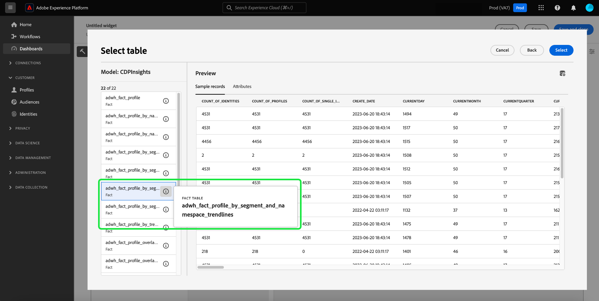

# Analyse en reeksspatiëring van toestemming

In het huidige marketinglandschap moet u de voorkeuren voor toestemming van klanten begrijpen en respecteren. Adobe Real-time Customer Data Platform biedt marketers de mogelijkheid om de toestemming van klanten te analyseren om vertrouwen op te bouwen, privacyregels na te leven en meer persoonlijke ervaringen te bieden.

In dit document wordt beschreven hoe u een toestemmingsdashboard kunt maken voor verschillende gevallen van marketinggebruik voor Real-Time CDP-gegevens. Specifiek, concentreert het zich op hoe te om een publiek met de aangewezen attributen voor uw bedrijfsbehoeften tot stand te brengen, en dan de inzichten te verbruiken door het gebruik van pre-gevormde widgets in Adobe Experience Platform UI. Er wordt ook een alternatieve methode voorgesteld om uw eigen aangepaste widget samen te stellen met de door de gebruiker gedefinieerde dashboardfunctie.

## Gebruiksscenario’s {#use-cases}

De in deze handleiding behandelde gevallen van gebruik zijn het trenderen van de toestemming en het overlappen van de toestemming.

- **Constante trending** volgt hoe de gebruikerstoestemming in tijd is geëvolueerd. Het analyseren van toestemmingsvoorkeursveranderingen helpt marketers campagnes te plannen en campagnes uit te voeren die zich aan die veranderingen van de gebruikersvoorkeur aanpassen. U kunt bijvoorbeeld gerichte educatieve campagnes, transparantie- en vertrouwenscampagnes of stimulerende campagnes voor het aansturen van toestemmingskeuzes voeren. U zou ook campagnes kunnen correleren die negatieve gevolgen kunnen hebben gehad voor de toestemming om de frequentie van die campagnes proactief te verminderen.
- **Overlap van toestemming** gebruikt de overlapping tussen toestemmingskanalen om verenigbare gepersonaliseerde overseinen op veelvoudige kanalen voor uw klanten te leveren die aan veelvoudige kanalen hebben goedgekeurd. De verkopers kunnen aan bepaalde kanalen voorrang geven en middelen toewijzen waar een hogere graad van toestemming en gepersonaliseerd overseinen met klanten zou kunnen resoneren en hogere reactieaantallen produceren.

<!-- ## Build a consent dashboard {#build-a-consent-dashboard} -->

## Goedgekeurd publiek maken {#create-consent-audiences}

Om een toestemmingsdashboard te bouwen, moet u eerst een publiek van alle profielen tot stand brengen die aan contact hebben goedgekeurd. Als u naar de Real-time Customer Data Platform Segment Builder wilt navigeren, selecteert u **[!UICONTROL Audiences]** in de linkernavigatie van Platform UI. Van de [!UICONTROL Customer] tabblad van het [!UICONTROL Audiences] dashboard, selecteren **[!UICONTROL Create audience]** in de rechterbovenhoek van de weergave, en vervolgens **[!UICONTROL Build rules]**.

<!-- Update screenshot below to include Create audience -->s

![De [!UICONTROL Audiences] dashboard met [!UICONTROL Customer], [!UICONTROL Audiences], en [!UICONTROL Create segment] gemarkeerd.](../images/insights-use-cases/consent-analysis/create-audience.png)

De Segment Builder wordt weergegeven. Selecteer vervolgens **[!UICONTROL XDM Individual Profile]** uit de beschikbare opties. Zie de documentatie voor meer informatie over de [regelbouwcanvas](../../segmentation/ui/segment-builder.md#rule-builder-canvas).

![De Segment Builder met de [!UICONTROL XDM Individual Profile] kenmerkmap gemarkeerd.](../images/insights-use-cases/consent-analysis/xdm-individual-profile.png)

Zoek uw toestemmingskenmerken uit de beschikbare opties. Selecteer **[!UICONTROL Consents and Preferences]**.

>[!NOTE]
>
>Als u uw toestemming van de gebruiker in een attribuut verschillend aan de Adobe geadviseerde gebiedsgroep hebt gehandhaafd, dan moet u die attributen in plaats van hieronder getoond selecteren.

Meer informatie is te vinden op de [behandeling van toestemming in segmentatie](../../segmentation/consents.md#handling-consent-in-segmentation) documentatie.

![De Segment Builder met de [!UICONTROL Consent and Preferences] kenmerkmap gemarkeerd.](../images/insights-use-cases/consent-analysis/consent-and-preferences.png)

De verschillende toestemmings en voorkeursopties worden getoond. Aangezien deze demonstratie zich richt op toestemming om via verschillende marketingkanalen contact te maken, selecteert u **[!UICONTROL Marketing Preferences]**.

![De Segment Builder met de [!UICONTROL Marketing Preferences] gemarkeerde map.](../images/insights-use-cases/consent-analysis/marketing-preferences.png)

De lijst met marketingvoorkeuren wordt weergegeven. Hoewel in dit voorbeeld gebruik wordt gemaakt van hoofdletters en kleine letters, richt u zich op e-mail, SMS en aanroepen, maar kunt u ook inzichten maken voor elke andere combinatie of voor alle opties. Voer voor elk kanaal de onderstaande stappen uit om een publiek te maken.

Als u een publiek wilt configureren, selecteert u **[!UICONTROL Receive SMS]** / **[!UICONTROL Receive email]** / **[!UICONTROL Receive calls]**.

De [!UICONTROL Subscriptions] wordt weergegeven. Selecteer en sleep de **[!UICONTROL Choice Value]** aan de centrumruit, dan selecteer de gewenste waarde van drop-down. In dit geval selecteert u **Ja (aanmelden)**. Geef het publiek vervolgens een naam op basis van uw zakelijke behoeften en geef een gebruikersvriendelijke beschrijving.

>[!NOTE]
>
>Er geldt een zachte limiet voor het aantal soorten publiek dat u kunt maken. Meer informatie vindt u in de [documentatie over segmentatiegids](https://experienceleague.adobe.com/docs/experience-platform/profile/guardrails.html?lang=en#segmentation-guardrails).

![De [!UICONTROL Choice Value] kenmerk met de [!UICONTROL Yes (opt-in)] waarde die in de segmentbouwer wordt benadrukt. De naam en beschrijving van het publiek worden ook gemarkeerd.](../images/insights-use-cases/consent-analysis/choice-value.png)

Nadat u het vereiste publiek hebt gemaakt, worden deze weergegeven in het dialoogvenster [!UICONTROL Audiences] [!UICONTROL Browse] tab.

>[!NOTE]
>
>Wanneer u een publiek maakt, moet u wachten tot de batchsegmentatietaak is voltooid voordat de gegevens beschikbaar zijn om uw toestemmingsdashboard te gaan bouwen. De segmentatie van de partij beschrijft het proces om al uw profielgegevens in één keer door uw segmentdefinities te bewegen om het overeenkomstige publiek te veroorzaken. Als u deze doelgroep eenmaal hebt gemaakt, wordt deze opgeslagen en opgeslagen zodat u deze kunt exporteren en gebruiken. De segmenten van de partij worden automatisch geëvalueerd om de 24 uur.

## Inzichten consumeren {#consume-insights}

Adobe heeft verschillende inzichten gemaakt die automatisch voor u beschikbaar zijn in de dashboards Profielen, Soorten publiek en Doelen. Elk publiek dat u maakt, is dan automatisch bruikbaar met deze vooraf geconfigureerde inzichten. Zie de standaardwidgetdocumentatie voor een lijst van de inzichten beschikbaar in [Profielen](../guides/profiles.md#standard-widgets), [Soorten publiek](../guides/audiences.md#standard-widgets), en [Doelen](../guides/destinations.md) dashboards.

## Audioverlap {#audience-overlap}

Als u de overlapping tussen twee toestemmingssoorten wilt bekijken, voegt u de opdracht [!UICONTROL Audience overlap by merge policy] naar het dashboard Profielen en selecteer het gewenste publiek in de vervolgkeuzemenu&#39;s. Zie de documentatie voor instructies over het toevoegen van een widget aan het dashboard als [*Publiek overlapt door samenvoegbeleid*](../guides/profiles.md#audience-overlap-by-merge-policy) voor meer informatie over inzicht.

<!-- Image needs updating to night mode -->

U kunt de overlapping van alle publiek bekijken waar de gebruikers hebben goedgekeurd om vraag over alle andere publiek te ontvangen, met het Publiek overlappend rapport in het Publiek dashboard. Navigeer eerst naar de [!UICONTROL Audiences] [!UICONTROL Overview] tab. Vanaf dat punt kunt u de [!UICONTROL Audience overlap report] widget naar het dashboard Soorten publiek. Nadat de widget is gemaakt, selecteert u de **[!UICONTROL User consented to calls]** publiek in het overzicht van het vervolgkeuzemenu voor het publiek boven aan de pagina. Selecteer vervolgens **[!UICONTROL View more]** in de widget voor het samenvattingsrapport van de doelgroep om maximaal 50 van de bovenste overlap en maximaal 50 van de minst overeenkomende overlap met betrekking tot het geselecteerde segment weer te geven.

<!-- Image needs updating to night mode -->

Het dialoogvenster Audience overlap in rapporten wordt uitgebreid om extra publiek overlappende gegevens weer te geven.

<!-- Image needs updating to night mode -->

## Trends voor de omvang van het publiek {#audience-size-trends}

Wanneer u een op toestemming-gebaseerd publiek creeert, ontwikkelt het automatisch tot 12 maanden vanaf de datum u het publiek creeerde. Voor een volledig functionele trend van uw toestemming van de klant voegt u de volgende widgets toe aan de [!UICONTROL Segments] [!UICONTROL Overview] pagina. Deze inzichten bieden een krachtig middel om te volgen hoe uw toestemming in de loop der tijd verandert. Ze correleren zelfs met campagnes die je parallel voert en die positieve of negatieve gevolgen kunnen hebben voor de toestemming. De beschrijvingen die voor deze widgets worden aangeboden, zijn van toepassing op een kwestie van het toestemmingsgebruik.

- [Ontwikkeling van de omvang van het publiek](../guides/audiences.md#audience-size-trend): Deze widget biedt een manier om te volgen hoe uw respectieve toestemming in tijd is veranderd.
- [Ontwikkeling van de omvang van het publiek](../guides/audiences.md#audience-size-change-trend): Deze widget houdt bij hoe de toestemming van uw klant dagelijks is gewijzigd. Bijvoorbeeld, als het aantal van uw klantentoestemming door 100.000 daalde, dan kunt u zien hoe die verandering over een dagelijkse basis voorkwam.
- [Ontwikkeling van de omvang van het publiek naar identiteit](../guides/audiences.md#audience-size-trend-by-identity): Met deze widget kunt u bijhouden hoe uw respectieve toestemming in de loop der tijd is gewijzigd, maar verder gefilterd door een specifieke identiteit, zoals een e-mail.

<!-- Image needs updating to night mode -->

## Het overzichtdashboard voor soorten publiek {#audiences-overview-dashboard}

Nadat u een publiek met betrekking tot toestemming zoals &quot;Gebruikers met toestemming voor SMS&quot;hebt gecreeerd, kunt u zeer belangrijke gepersonaliseerde toestemmingsinformatie over uw publiek bekijken door de aangewezen widgets aan uw het overzichtdashboard van het Overzicht van Soorten van publiek toe te voegen. Ga naar de [!UICONTROL Audiences] [!UICONTROL Overview] en voeg uw gekozen widgets toe uit de widgetbibliotheek. Elke widget die aan uw weergave van het dashboard is toegevoegd, kan worden vergroot of verkleind en verplaatst met de opdracht [!UICONTROL Modify dashboard] gebruiken. Uw gepersonaliseerde mening kan inzichten zoals de trend in tijd (tot 12 maanden), de overlappingen met andere publiek, en de identiteitssamenstelling van het publiek bevatten. Hieronder ziet u een voorbeeldweergave.

## Door gebruiker gedefinieerde dashboards {#usr-defined-dashboards}

U kunt ook uw eigen widgets maken met door de gebruiker gedefinieerde dashboards. Door uw eigen widget te maken hebt u volledige controle over het type widget, samen met de flexibiliteit om filters en nog veel meer rechtstreeks in Adobe Real-Time CDP toe te voegen.

Bijvoorbeeld, als u veelvoudige toestemmingspubliek in de zelfde grafiek wilt trenderen zodat u in tijd kunt zien hoe elk van uw toestemmingsvoorkeur is veranderd. Dit soort visualisatie is mogelijk met door de gebruiker gedefinieerde dashboards in minimale stappen en een eenmalige instelling. Eerst selecteert u **[!UICONTROL Dashboards]** in de linkernavigatie. De [!UICONTROL Dashboards] wordt weergegeven. Selecteer vervolgens **[!UICONTROL Create dashboard]**. Volledige instructies over hoe te [een dashboard en een aangepaste widget maken](../user-defined-dashboards.md) vindt u in de door de gebruiker gedefinieerde handleiding voor dashboards.

Wanneer u [uw gegevensmodel selecteren](../user-defined-dashboards.md#select-data-model) in de widgetcomposer selecteert u `CDPInsights` gevolgd door **[!UICONTROL Next]**. De [!UICONTROL Select table] wordt weergegeven.

In de volgende weergave wordt een lijst weergegeven met de beschikbare tabellen in de linkertrack. Selecteer `adwh_fact_profile_by_segment_and_namespace_trendlines`.

Voer de onderstaande stappen uit nadat de widgetcomposer is gevuld met gegevens uit uw gekozen tabel:

- [Zoeken [!UICONTROL Attributes]](../user-defined-dashboards.md#add-filter-attributes) for `[!UICONTROL date]`en voegt u vervolgens het plus-pictogram (+) toe `[!UICONTROL date]` van het vervolgkeuzemenu naar de X-as verwijzen.
  
- Zoeken [!UICONTROL Attributes] for `[!UICONTROL count_of_profiles]`en voegt u vervolgens het plus-pictogram (+) toe `[!UICONTROL count_of_profiles]` van het vervolgkeuzemenu naar de Y-as verwijzen.
- Selecteer de `...` (ovalen) in het dialoogvenster [!UICONTROL Y-axis] veld selecteert u vervolgens de [!UICONTROL SUM] statistische functie uit het vervolgkeuzemenu.
  
- Selecteer de [!UICONTROL Marks] vervolgkeuzelijst en wijzig het diagramtype in [!UICONTROL Line].
- Zoeken [!UICONTROL Attributes] voor de `[!UICONTROL segment_name]`en voegt u vervolgens het plus-pictogram (+) toe `segment_name` als [!UICONTROL Filter] in het vervolgkeuzemenu. De [!UICONTROL Filter: Segment_name] wordt weergegeven. Selecteer de eerder gemaakte soorten publiek die betrekking hebben op toestemming. In dit voorbeeld selecteert u **[!UICONTROL Users Consented to Calls]**, **[!UICONTROL Users Consented to SMS]**, en **[!UICONTROL Users Consented to Email]**, gevolgd door **[!UICONTROL Apply]**.
- Zoeken [!UICONTROL Attributes] for `[!UICONTROL segment_name]`Selecteer vervolgens het +-pictogram om toe te voegen `segment_name` als [!UICONTROL Color] in het vervolgkeuzemenu.
- Openen [de [!UICONTROL Properties] deelvenster](../user-defined-dashboards.md#widget-properties) en een passende [!UICONTROL Widget title] en [!UICONTROL Axis label].
  
- Selecteren **[!UICONTROL Save and close]** om uw instellingen te bevestigen.

>[!TIP]
>
>U kunt de widget nu vergroten of verkleinen of naar de gewenste grootte en positie verplaatsen voordat u het dashboard opslaat.

In de onderstaande afbeelding ziet u hoe de voltooide widget er uitziet en andere mogelijke aangepaste inzichten. Raadpleeg voor meer informatie over de typen widgets die u kunt maken de [documentatie over gegevensmodellen](../cdp-insights-data-model.md).

<!-- The diagram shows straight lines due to a lack of data, however in your environment the trends will reflect the actual changes over time. -->

## Beleid voor het bijhouden van toestemming {#consent-policies}

De toestemmingsdashboards die u creeert vangen **alleen de verdeling van toestemmings- en preferentiële kenmerken**.

>[!NOTE]
>
>Voor klanten van **Adobe Gezondheidsschild** of **Privacy- en beveiligingsschild van Adobe**, deze dashboards **niet** een overzicht geven van het beleid inzake instemming. Beschikbaar volgen omvat het aantal gecreeerd, toegelaten beleid, en de invloed op publiekslidmaatschap.

## Volgende stappen

Door dit document te lezen, hebt u geleerd hoe u dashboards kunt maken voor een uitgebreide weergave van uw voorkeuren voor toestemming van klanten met behulp van Real-Time CDP-inzichten. Dit document laat zien hoe Real-Time CDP een robuuste oplossing biedt voor het hedendaagse privacygerichte landschap, waar verzameling, segmentering, analyse en gepersonaliseerde marketingcampagnes op basis van toestemmingsgegevens van cruciaal belang zijn voor marketeers.
