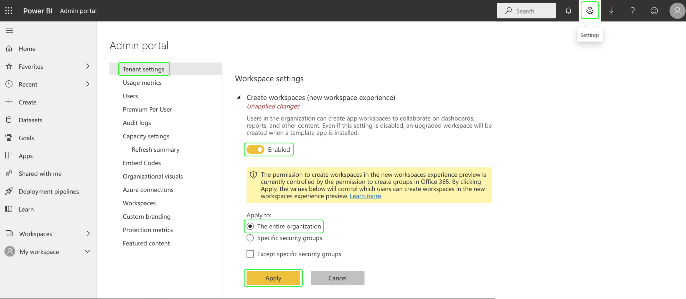
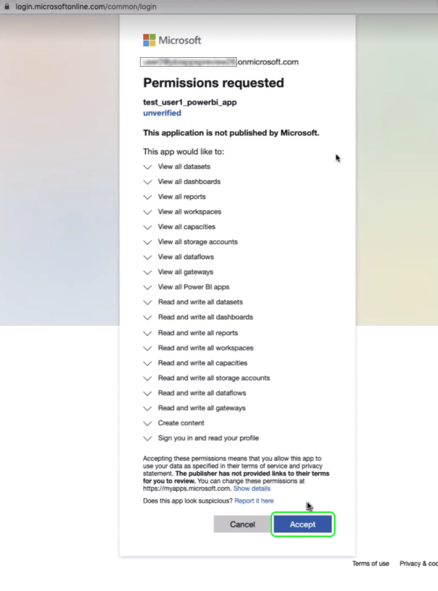

# Sjablonen voor Power BI-rapporten voor dashboards

Met de functie voor het rapportsjabloon van Power BI kunt u aansprekende rapporten maken die zijn gevuld met gegevens van Adobe Experience Platform. Het gestroomlijnde installatieproces installeert automatisch standaardwidgets voor het Profiel, de segmentatie, en de bestemmingen in real time van de Klant. De installatie verbindt ook Power BI met uw gegevensmodellen zodat kunt u uw rapportmalplaatjes gemakkelijk aanpassen en uitbreiden. Deze rapporten kunnen over uw volledige organisatie worden gedeeld zonder de ontvangers die geloofsbrieven voor uw organisatie IMS op Platform nodig hebben.

In dit document vindt u instructies voor het tot stand brengen van een verbinding tussen Adobe Experience Platform en de toepassing Power BI en het gebruik van rapportsjablonen om belangrijke gegevens van het Platform met externe gebruikers te delen.

## Aan de slag

Voordat u verdergaat met deze zelfstudie, is het raadzaam een goed inzicht te hebben in [schemacompositie](../../xdm/schema/composition.md) in Experience Platform, en hoe de attributen in het Profiel van de Klant in real time door [samenvoegingsschema](../../xdm/schema/composition.md#union).

Gebruikers moeten eerst de volgende machtigingen voor het Platform hebben verkregen om de Power BI-toepassingsintegratie te installeren:

- Query&#39;s beheren
- Sandboxen beheren

Voor meer informatie over het toewijzen van deze machtigingen leest u de [toegangsbeheer](../../access-control/home.md) documentatie.

U moet ook over een Power BI-account beschikken om deze zelfstudie te kunnen volgen. Als u een account wilt maken, navigeert u naar de [Power BI homepage](https://powerbi.microsoft.com/en-us/) en volgt u het aanmeldingsproces. Gebruikers van deze Power BI-account moeten ook de functie **Werkruimte maken** instellen binnen de instellingen voor Power BI. Deze instelling vindt u in de huurdersinstellingen van de beheerportal voor Power BI. Als uw account is opgegeven door uw huurder of werkgever, neemt u contact op met uw respectieve beheerder om deze instelling in te schakelen.

>[!NOTE]
>
>Opdat het lusje van Dashboards in de linkernavigatie van Platform UI, en de mening van de Inventaris van het Dashboard zichtbaar is, moet u toegang tot om het even welk van het Profiel, Segmentatie of de dashboards van de Bestemming als deel van uw Platform vergunning hebben.

## De integratie van de Power BI-toepassing installeren

Selecteer in de interface van het Platform de optie **[!UICONTROL Dashboards]** in de linkernavigatie om de [!UICONTROL Dashboards] werkruimte. De [!UICONTROL Browse] wordt een lijst weergegeven met momenteel beschikbare dashboardweergaven. Raadpleeg voor meer informatie over het weergeven van beschikbare dashboards de [inventarisdocumentatie](../inventory.md).

Selecteer vervolgens de **[!UICONTROL Integrations]** tab. De integratiepagina van de Power BI-toepassing wordt weergegeven. Selecteer **[!UICONTROL Install]** om de installatie te starten.

>[!NOTE]
>
>De [!UICONTROL Install] de knop is uitgeschakeld, tenzij u over de machtigingen Query Service Manage en Manage Sandboxen beschikt.

### Geef referenties op

De eerste stap in het installatieproces is het verstrekken van niet-vervallende geloofsbrieven voor de toepassingsintegratie van de Power BI. U kunt de volgende twee opties gebruiken: [[!UICONTROL Create new credentials]](#create-new-credentials) of [[!UICONTROL Use existing credentials]](#use-existing-credentials). Selecteer de juiste schakeloptie om door te gaan.

#### Nieuwe referenties maken {#create-new-credentials}

Er zijn twee vereiste gebieden wanneer het produceren van nieuwe geloofsbrieven: [!UICONTROL Name] en [!UICONTROL Assigned to]. De [!UICONTROL Assigned to] heeft betrekking op het e-mailadres dat is gekoppeld aan uw Power BI-account.

>[!IMPORTANT]
>
>Het creëren van niet-vervallende geloofsbrieven vereist u om bepaalde toegewezen toestemmingen en rollen te hebben. De noodzakelijke toestemmingen zijn leiden Sandboxes en beheren de Integratie van de Dienst van de Vraag. De vereiste rollen zijn Adobe Experience Platform admin en ontwikkelaarrollen. Voor meer informatie over het toewijzen van deze machtigingen leest u de [toegangsbeheer](../../access-control/home.md) documentatie.

Om meer over het produceren van niet-vervallende geloofsbrieven van de Dienst van de Vraag te leren, gelieve te verwijzen naar [niet-vervallende gebruikersgids](../../query-service/ui/credentials.md#non-expiring-credentials).

Nadat u voor het eerst een niet-vervallende referenties hebt gegenereerd, wordt een JSON-bestand naar die computer gedownload. Dit JSON-bestand kan vervolgens als referenties worden gedeeld met andere gebruikers om het installatieproces te voltooien.

#### Bestaande referenties gebruiken {#use-existing-credentials}

Een JSON-referentiebestand kan ook worden geüpload om de validatie te doorstaan. Deze JSON-bestanden met de niet-vervallende referentiewaarden worden gedownload naar de lokale computer die wordt gebruikt wanneer een niet-vervallende referentie wordt gemaakt.

>[!IMPORTANT]
>
>Als u een bestaande niet-vervallende referentie wilt gebruiken, moet aan de gebruiker al een referentie zijn toegewezen. Als de gebruiker geen referentie heeft toegewezen en geen nieuwe kan maken met de Adobe Admin Console, kan de gebruiker niet doorgaan met het installatieproces.

Selecteren **[!UICONTROL Upload credential file]** selecteert u vervolgens het JSON-bestand dat u wilt uploaden in het dialoogvenster dat verschijnt.

Nadat u de niet-vervallende geloofsbrieven verstrekt, worden zij automatisch bevestigd door Platform. Er verschijnt een bevestigingsbericht als de validatie is gelukt. Selecteren **[!UICONTROL Next]** de instemming van de Power BI-aanvraag te herzien.

### Goedkeuring verlenen

Het toestemmingsscherm verschijnt. Selecteren **[!UICONTROL Review consent]** om een nieuw venster te openen met de vereiste machtigingen voor Power BI om toegang te krijgen tot en gebruik te maken van uw gegevens volgens de servicevoorwaarden en privacyverklaring.

Selecteren **[!UICONTROL Accept]** om Power BI toestemming te verlenen om tot uw gegevens van het Platform toegang te hebben en te gebruiken.

>[!NOTE]
>
>Als u het installatieproces op een gegeven moment afsluit voordat u toestemming geeft, wordt de integratie van de Power BI-toepassing niet geïnstalleerd in het dashboardoverzicht.

Na het verstrekken van toestemming, wordt het rapportmalplaatje automatisch geïnstalleerd in het milieu van de Power BI als deel van het installatieproces. Power BI gebruikt dan de niet-vervallende geloofsbrieven om tot Platform toegang te hebben, alle SQL vragen opeenvolgend uit te voeren, en het rapportmalplaatje met de teruggekeerde gegevens te bevolken.

Selecteren **[!UICONTROL Finish]** om terug te keren naar de dashboardvoorraad.

Nu het het rapportmalplaatje van de Power BI wordt geïnstalleerd, verschijnt het in de lijst van beschikbare dashboards onder [!UICONTROL Browse] tab. Selecteren **[!UICONTROL Power BI]** in de lijst om naar de omgeving van de Power BI te navigeren.

>[!IMPORTANT]
>
>De beheerders van Power BI moeten ervoor zorgen dat de gebruikers de aangewezen toegangstoestemmingen hebben om deze dashboards in het milieu van de Power BI te bekijken.

## Werkruimte Power BI

Nadat u zich hebt aangemeld [de werkruimte van de Power BI](https://dxt.powerbi.com), zijn de rapportmalplaatjes beschikbaar voor elk van de diensten waartot u toegang hebt. De rapportmalplaatjes omvatten profielen, segmenten, en bestemmingsdashboards **alleen** als zij de overeenkomstige meningstoestemmingen hebben.

De standaardwidgets van profielen, segmenten, en bestemmingen zijn beschikbaar binnen de malplaatjerapporten van de Power BI door gebrek.

>[!NOTE]
>
>U moet bewerkingsmachtigingen hebben ingeschakeld voor een bepaald dashboard om dat dashboard te kunnen installeren in de Power BI-omgeving.

Nadat een dashboard in Power BI wordt geïnstalleerd, worden de rapportmalplaatjes getoond aan alle gebruikers door gebrek. Als u toegang tot om het even welke rapportmalplaatjes wilt beperken, zorg ervoor dat u toegang voor de gebruikers in kwestie van binnen het milieu van de Power BI onbruikbaar maakt.

## Uw sjabloon voor Power BI-rapporten aanpassen

Door het gebruik van douane widgets, kunt u douanekenmerken aan uw gegevensmodel toevoegen om de rapportmalplaatjes te verrijken die door Power BI worden verstrekt.

>[!NOTE]
>
>De kenmerken die u voor aangepaste widgets kunt gebruiken, zijn afhankelijk van wat beschikbaar is in het samenvoegingsschema. Als u wilt leren hoe u vakbondsschema&#39;s kunt bekijken en verkennen ten behoeve van uw aangepaste widgets, raadpleegt u de [UI-hulplijn verenigingsschema](../../profile/ui/union-schema.md).

### Een aangepaste widget maken

Aangepaste widgets worden gemaakt via de widgetbibliotheek. Zie de [Overzicht van Widget-bibliotheek](../customize/widget-library.md) voor een inleiding op het kenmerk en de [zelfstudie voor het maken van een aangepaste widget](../customize/custom-widgets.md) voor specifieke instructies.

>[!IMPORTANT]
>
>Nieuwe aangepaste widgets zijn **niet** wordt automatisch gesynchroniseerd tussen Adobe Experience Platform-dashboards en de Power BI-rapportsjablonen. Aangepaste widgets die in de gebruikersinterface van het Platform worden gemaakt, moeten handmatig opnieuw worden gemaakt in de Power BI-omgeving.

### De aangepaste widget opnieuw maken in de Power BI-omgeving

Zodra uw dashboard de aangewezen metriek en de attributen bevat binnen douane widgets, bent u bereid om het rapportmalplaatje te wijzigen dat van binnen het milieu van de Power BI wordt getoond. Zie de [Power BI](https://docs.microsoft.com/en-us/power-bi/) voor informatie over hoe te om een rapport door zijn gebruikersinterface uit te geven.

## De integratie van de Power BI-toepassing verwijderen

Als u het dashboard wilt verwijderen, navigeert u naar het dashboardoverzicht en selecteert u het verwijderpictogram () naast de naam van het dashboard.

>[!NOTE]
>
>Alleen de gebruiker die het Power BI-dashboard heeft geïnstalleerd, kan de integratie verwijderen uit de interface van het Platform.

Er verschijnt een bevestigingspop-up. Selecteren **[!UICONTROL Delete]** om het proces te bevestigen.

>[!IMPORTANT]
>
>Als u het dashboard van het Power BI verwijdert uit de interface van het Platform, gebeurt dit **niet** verwijder de rapportmalplaatjes beschikbaar in uw milieu van de Power BI. Als u de informatie volledig wilt schrappen die in de het rapportmalplaatjes van de Power BI wordt gehouden, moet u login uw rekening van de Power BI en de rapportmalplaatjes van die milieu schrappen. Nadat een gebruiker het dashboard van het Power BI heeft verwijderd, kan hij of zij de hierboven beschreven installatie-instructies volgen.

## Volgende stappen

Door dit document te lezen, hebt u een beter inzicht in hoe de malplaatjes van het Power BI- rapport in Platform kunnen worden geïntegreerd om dwingende gegevensinzichten van uw profielen, segmenten, of bestemmingsdashboards te delen. Zie de [dashboard-aanpassingsoverzicht](../customize/overview.md) voor meer informatie over het aanpassen van uw dashboards.
