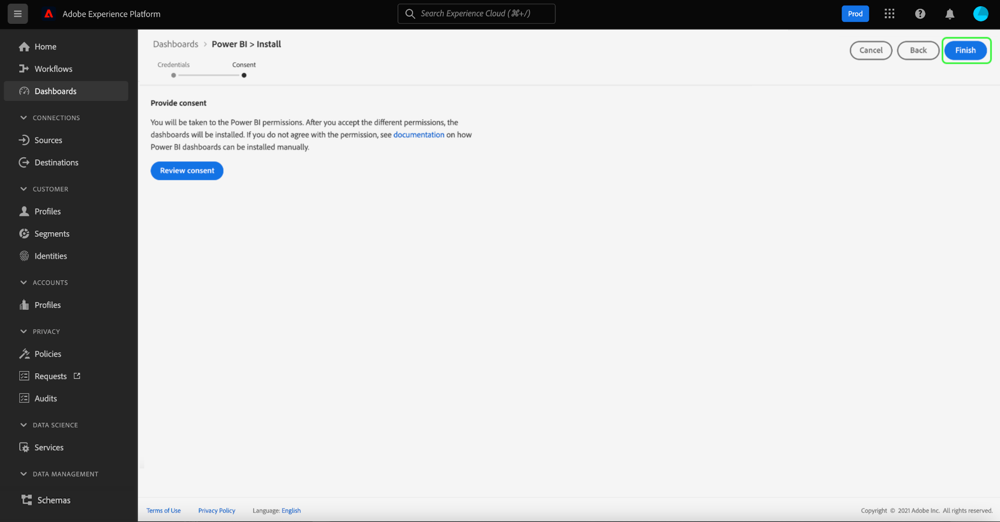

# Sjablonen voor Power BI-rapporten voor dashboards

Met de functie voor het rapportsjabloon van Power BI kunt u aansprekende rapporten maken die zijn gevuld met gegevens van Adobe Experience Platform. Het gestroomlijnde installatieproces installeert automatisch standaardwidgets voor Real-Time Klantprofiel, segmentatie, en bestemmingen. De installatie verbindt ook Power BI met uw gegevensmodellen zodat kunt u uw rapportmalplaatjes gemakkelijk aanpassen en uitbreiden. Deze rapporten kunnen over uw volledige organisatie worden gedeeld zonder de ontvangers die geloofsbrieven voor uw organisatie op Platform nodig hebben.

Dit document bevat instructies voor het maken van een verbinding tussen Adobe Experience Platform en de toepassing Power BI en het gebruik van rapportsjablonen om belangrijke platformgegevensinzichten met externe gebruikers te delen.

## Aan de slag

Alvorens met dit leerprogramma verder te gaan wordt het geadviseerd om een goed begrip van [ schemacompositie ](../../xdm/schema/composition.md) in Experience Platform te hebben, en hoe de attributen in het Profiel van de Klant in real time door het [ vakbondsschema ](../../xdm/schema/composition.md#union) inbegrepen zijn.

Gebruikers moeten eerst de volgende platformmachtigingen hebben verkregen om de Power BI-toepassingsintegratie te installeren:

- Query&#39;s beheren
- Sandboxen beheren

Leren hoe te om deze toestemmingen toe te wijzen, te lezen gelieve de [ toegangscontrole ](../../access-control/home.md) documentatie.

U moet ook over een Power BI-account beschikken om deze zelfstudie te kunnen volgen. Om een rekening tot stand te brengen, navigeer aan de [ homepage van de Power BI ](https://powerbi.microsoft.com/en-us/) en volg het sign-up proces. De gebruikers voor deze rekening van Power BI moeten **ook toelaten creeer werkruimte** plaatsen binnen hun montages van Power BI. Deze instelling vindt u in de huurdersinstellingen van de beheerportal voor Power BI. Als uw account is opgegeven door uw huurder of werkgever, neemt u contact op met uw respectieve beheerder om deze instelling in te schakelen.

{het portaal van Admin van 0} Power BI leidt werkruimtemontages.](../images/power-bi/create-workspace-settings.png)![

>[!NOTE]
>
>Als u het tabblad Dashboards wilt weergeven in de linkernavigatie van de interface van het platform en de weergave Dashboard Inventory wilt weergeven, moet u toegang hebben tot elk van de dashboards van het profiel, de segmentatie of de bestemming als onderdeel van uw Platform-licentie.

## De integratie van de Power BI-toepassing installeren

Selecteer in de gebruikersinterface van het platform de optie **[!UICONTROL Dashboards]** in de linkernavigatie om de werkruimte van [!UICONTROL Dashboards] te openen. Op het tabblad [!UICONTROL Browse] wordt een lijst weergegeven met momenteel beschikbare dashboardweergaven. Meer over het bekijken van beschikbare dashboards leren, zie de [ inventarisdocumentatie ](../inventory.md).

Selecteer vervolgens de tab **[!UICONTROL Integrations]** . De integratiepagina van de Power BI-toepassing wordt weergegeven. Selecteer van hieruit **[!UICONTROL Install]** om de installatie te starten.

>[!NOTE]
>
>De knop [!UICONTROL Install] is alleen beschikbaar als u over de machtigingen Query Service Manage en Manage Sandboxes beschikt.

### Geef referenties op

De eerste stap in het installatieproces is het verstrekken van niet-vervallende geloofsbrieven voor de toepassingsintegratie van de Power BI. U kunt de volgende twee opties opgeven: [[!UICONTROL Create new credentials]](#create-new-credentials) of [[!UICONTROL Use existing credentials]](#use-existing-credentials) . Selecteer de juiste schakeloptie om door te gaan.

#### Nieuwe referenties maken {#create-new-credentials}

Er zijn twee vereiste velden voor het genereren van nieuwe referenties: [!UICONTROL Name] en [!UICONTROL Assigned to] . Het veld [!UICONTROL Assigned to] heeft betrekking op het e-mailadres dat is gekoppeld aan uw Power BI-account.

>[!IMPORTANT]
>
>Het creëren van niet-vervallende geloofsbrieven vereist u om bepaalde toegewezen toestemmingen en rollen te hebben. De noodzakelijke toestemmingen zijn leiden Sandboxes en beheren de Integratie van de Dienst van de Vraag. De vereiste rollen zijn Adobe Experience Platform admin en ontwikkelaarrollen. Leren hoe te om deze toestemmingen toe te wijzen, te lezen gelieve de [ toegangscontrole ](../../access-control/home.md) documentatie.

Meer leren over het produceren van niet-het verlopen geloofsbrieven van de Dienst van de Vraag, gelieve te verwijzen naar [ niet-het verlopen geloofsbrieven gids ](../../query-service/ui/credentials.md#non-expiring-credentials).

Nadat u voor het eerst een niet-vervallende referenties hebt gegenereerd, wordt een JSON-bestand naar die computer gedownload. Dit JSON-bestand kan vervolgens als referenties worden gedeeld met andere gebruikers om het installatieproces te voltooien.

#### Bestaande referenties gebruiken {#use-existing-credentials}

Een JSON-referentiebestand kan ook worden geüpload om de validatie te doorstaan. Deze JSON-bestanden met de niet-vervallende referentiewaarden worden gedownload naar de lokale computer die wordt gebruikt wanneer een niet-vervallende referentie wordt gemaakt.

>[!IMPORTANT]
>
>Als u een bestaande niet-vervallende referentie wilt gebruiken, moet aan de gebruiker al een referentie zijn toegewezen. Als de gebruiker geen referentie heeft toegewezen en geen nieuwe kan maken met de Adobe Admin Console, kan de gebruiker niet doorgaan met het installatieproces.

Selecteer **[!UICONTROL Upload credential file]** en selecteer vervolgens het JSON-bestand dat u wilt uploaden in het dialoogvenster dat verschijnt.

Nadat u de niet-vervallende geloofsbrieven verstrekt, worden zij automatisch bevestigd door Platform. Er verschijnt een bevestigingsbericht als de validatie is gelukt. Selecteer **[!UICONTROL Next]** om de toestemmingsovereenkomst voor de toepassing van de Power BI te herzien.

### Goedkeuring verlenen

Het toestemmingsscherm verschijnt. Selecteer **[!UICONTROL Review consent]** om een nieuw venster te openen waarin wordt aangegeven welke machtigingen Power BI nodig hebben om uw gegevens te openen en te gebruiken in overeenstemming met de servicevoorwaarden en privacyverklaring.

Selecteer **[!UICONTROL Accept]** om Power BI toestemming te verlenen om toegang te krijgen tot en gebruik te maken van uw gegevens van het Platform.

>[!NOTE]
>
>Als u het installatieproces op een gegeven moment afsluit voordat u toestemming geeft, wordt de integratie van de Power BI-toepassing niet geïnstalleerd in het dashboardoverzicht.

Na het verstrekken van toestemming, wordt het rapportmalplaatje automatisch geïnstalleerd in het milieu van de Power BI als deel van het installatieproces. Power BI gebruikt dan de niet-vervallende geloofsbrieven om tot Platform toegang te hebben, alle SQL vragen opeenvolgend uit te voeren, en het rapportmalplaatje met de teruggekeerde gegevens te bevolken.

Selecteer **[!UICONTROL Finish]** om terug te keren naar de dashboardvoorraad.

Nu de rapportsjabloon Power BI is geïnstalleerd, wordt deze weergegeven in de lijst met beschikbare dashboards onder het tabblad [!UICONTROL Browse] . Selecteer **[!UICONTROL Power BI]** in de lijst om naar de omgeving van de Power BI te navigeren.

>[!IMPORTANT]
>
>De beheerders van Power BI moeten ervoor zorgen dat de gebruikers de aangewezen toegangstoestemmingen hebben om deze dashboards in het milieu van de Power BI te bekijken.

## Power BI-werkruimte

Na het registreren in [ de werkruimte van de Power BI ](https://dxt.powerbi.com), zijn de rapportmalplaatjes beschikbaar voor elk van de diensten waartot u toegang hebt. De rapportmalplaatjes omvatten profielen, segmenten, en bestemmingsdashboards **slechts** als zij de overeenkomstige meningstoestemmingen hebben.

De standaardwidgets van profielen, segmenten, en bestemmingen zijn beschikbaar binnen de malplaatjerapporten van de Power BI door gebrek.

>[!NOTE]
>
>U moet bewerkingsmachtigingen hebben ingeschakeld voor een bepaald dashboard om dat dashboard te kunnen installeren in de Power BI-omgeving.

Nadat een dashboard in Power BI wordt geïnstalleerd, worden de rapportmalplaatjes getoond aan alle gebruikers door gebrek. Als u toegang tot om het even welke rapportmalplaatjes wilt beperken, zorg ervoor dat u toegang voor de gebruikers in kwestie van binnen het milieu van de Power BI onbruikbaar maakt.

## Uw sjabloon voor Power BI-rapporten aanpassen

Door het gebruik van douane widgets, kunt u douanekenmerken aan uw gegevensmodel toevoegen om de rapportmalplaatjes te verrijken die door Power BI worden verstrekt.

>[!NOTE]
>
>De kenmerken die u voor aangepaste widgets kunt gebruiken, zijn afhankelijk van wat beschikbaar is in het samenvoegingsschema. Leren hoe te om verenigingsschema&#39;s aan het voordeel van uw douane widgets te bekijken en te onderzoeken, zie de [ gids UI van het uniesschema ](../../profile/ui/union-schema.md).

### Een aangepaste widget maken

Aangepaste widgets worden gemaakt via de widgetbibliotheek. Zie het [ overzicht van de Bibliotheek van Widget ](../customize/widget-library.md) voor een inleiding aan de eigenschap en [ leerprogramma voor het creëren van een douane widget ](../customize/custom-widgets.md) voor specifieke instructies.

>[!IMPORTANT]
>
>Nieuw gecreeerde douanewidgets worden **niet** automatisch gesynchroniseerd tussen de dashboards van Adobe Experience Platform en de het rapportmalplaatjes van de Power BI. Aangepaste widgets die in de gebruikersinterface van het platform worden gemaakt, moeten handmatig opnieuw worden gemaakt in de Power BI-omgeving.

### De aangepaste widget opnieuw maken in de Power BI-omgeving

Zodra uw dashboard de aangewezen metriek en de attributen bevat binnen douane widgets, bent u bereid om het rapportmalplaatje te wijzigen dat van binnen het milieu van de Power BI wordt getoond. Zie de [ documentatie van de Power BI ](https://docs.microsoft.com/en-us/power-bi/) voor informatie over hoe te om een rapport door zijn gebruikersinterface uit te geven.

## De integratie van de Power BI-toepassing verwijderen

Om het dashboard te schrappen, navigeer aan de dashboardinventaris en selecteer het schrappingspictogram () naast de dashboardnaam.

>[!NOTE]
>
>Alleen de gebruiker die het Power BI-dashboard heeft geïnstalleerd, kan de integratie verwijderen uit de interface van het platform.

Er verschijnt een bevestigingspop-up. Selecteer **[!UICONTROL Delete]** om het proces te bevestigen.

>[!IMPORTANT]
>
>Het schrappen van het dashboard van Power BI van het Platform UI schrapt **niet** de rapportmalplaatjes beschikbaar in uw milieu van de Power BI. Als u de informatie volledig wilt schrappen die in de het rapportmalplaatjes van de Power BI wordt gehouden, moet u login uw rekening van de Power BI en de rapportmalplaatjes van die milieu schrappen. Nadat een gebruiker het dashboard van het Power BI heeft verwijderd, kan hij of zij de hierboven beschreven installatie-instructies volgen.

## Volgende stappen

Door dit document te lezen, hebt u een beter inzicht in hoe de malplaatjes van het Power BI- rapport in Platform kunnen worden geïntegreerd om dwingende gegevensinzichten van uw profielen, segmenten, of bestemmingsdashboards te delen. Zie het [ overzicht van de dashboardaanpassing ](../customize/overview.md) om meer over het aanpassen van uw dashboards te leren.
