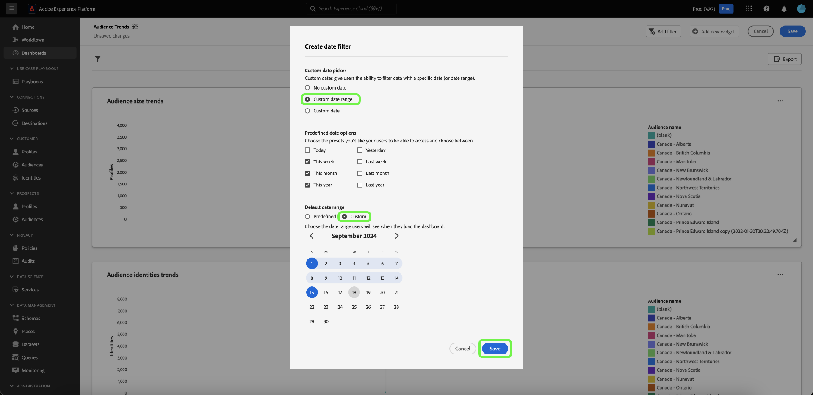
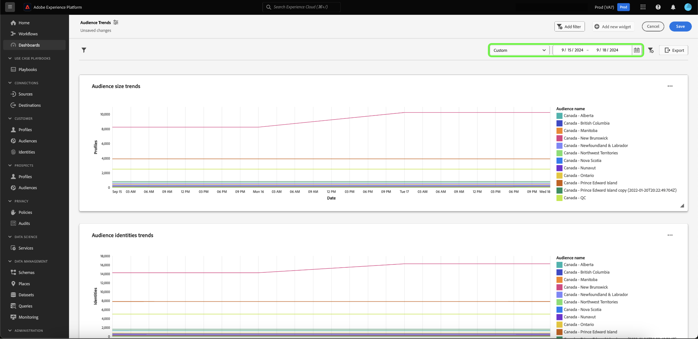
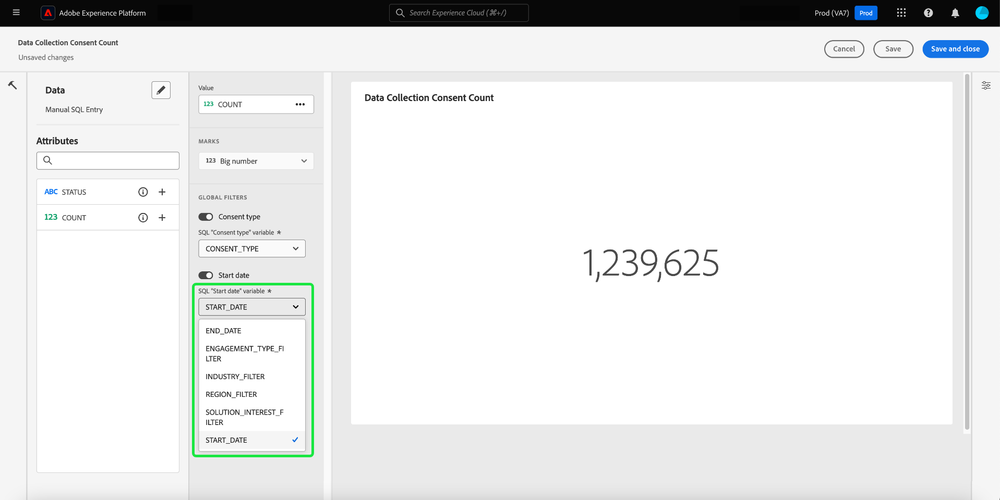

# Een datumfilter maken {#create-date-filter}

Om uw inzichten door datum te filtreren, moet u parameters aan uw SQL vragen toevoegen die datumbeperkingen kunnen goedkeuren. Dit wordt gedaan als deel van het bevel van de vraag pro wijze inzicht creatiewerkschema. Zie de [&#x200B; vraag pro wijzedocumentatie &#x200B;](../overview.md#query-pro-mode) leren hoe te om SQL voor uw inzichten in te gaan.

Met queryparameters kunt u werken met dynamische gegevens zoals deze fungeren als plaatsaanduidingen voor de waarden die u toevoegt tijdens de uitvoering. Deze plaatsaanduidingswaarden kunnen worden bijgewerkt via de gebruikersinterface en stellen minder technische gebruikers in staat de inzichten bij te werken die op datumbereiken zijn gebaseerd.

Als u met vraagparameters onbekend bent, zie de documentatie voor [&#x200B; begeleiding op hoe te om geparameterized vragen &#x200B;](../../../query-service/ui/parameterized-queries.md) uit te voeren.

## Een datumfilter toepassen op het dashboard {#apply-date-filter}

Als u een datumfilter wilt toepassen, selecteert u **[!UICONTROL Add filter]** en vervolgens **[!UICONTROL Date Filter]** in het vervolgkeuzemenu van de dashboardweergave.


U krijgt de volgende filteropties voor de datum te zien.

| Filter | Beschrijving |
| --- | --- |
| Geen aangepaste datum | Selecteer een of meer aangepaste datums uit meerdere vooraf ingestelde waarden. |
| Aangepast datumbereik | Selecteer een of meer aangepaste datums met meerdere vooraf ingestelde waarden of geef een aangepast datumbereik op. |
| Aangepaste datum | Selecteer een van de vooraf ingestelde waarden of geef de begindatum voor het dashboard op. |


### Geen aangepast datumfilter maken

Als u een vooraf gedefinieerd datumfilter wilt toepassen, selecteert u **[!UICONTROL No custom date]** en selecteert u vervolgens de vooraf gedefinieerde datumopties die u wilt opnemen. Gebruik ten slotte het vervolgkeuzemenu om het standaarddatumbereik te selecteren en selecteer vervolgens **[!UICONTROL Save]** .


U keert terug naar het dashboard, dat het standaarddatumbereik toont u eerder selecteerde. Gebruik het vervolgkeuzemenu om een ander vooraf ingesteld datumbereik te selecteren.


### Een aangepast datumbereikfilter maken

Als u een filter voor een aangepast datumbereik wilt toepassen, selecteert u **[!UICONTROL Custom date range]** en selecteert u vervolgens de vooraf gedefinieerde datumopties die u wilt opnemen. Selecteer ten slotte **[!UICONTROL Custom]** om het standaarddatumbereik in te stellen. Gebruik de kalender om een datumbereik op te geven en selecteer vervolgens **[!UICONTROL Save]** .

>[!NOTE]
>
>U hoeft geen vooraf gedefinieerde datumopties te selecteren.



U keert terug naar het dashboard, dat de waaier van douanegegevens toont u eerder specificeerde. Gebruik het vervolgkeuzemenu om een ander vooraf ingesteld datumbereik te selecteren.



### Een aangepast datumfilter maken

Als u een aangepast datumfilter wilt toepassen, selecteert u **[!UICONTROL Custom date]** en selecteert u de vooraf gedefinieerde datumopties die u wilt opnemen. Selecteer ten slotte **[!UICONTROL Custom]** en gebruik vervolgens de kalender om een begindatum te selecteren. Selecteer ten slotte **[!UICONTROL Save]** .

>[!NOTE]
>
>U hoeft geen vooraf gedefinieerde datumopties te selecteren.


U keert terug naar het dashboard, dat de douanegegevens toont u eerder specificeerde. Gebruik het vervolgkeuzemenu om een andere datum te selecteren.


## Een datumfilter verwijderen {#delete-date-filter}

Om uw datumfilter te verwijderen selecteer het pictogram van de schrappingsfilter ().


## SQL bewerken om parameters voor datumquery op te nemen {#include-date-parameters}

Zorg er daarna voor dat uw SQL queryparameters bevat die een datumbereik toestaan. Als u query-parameters nog niet hebt opgenomen in uw SQL, bewerkt u uw inzichten om deze parameters op te nemen. Zie de documentatie voor instructies op hoe te [&#x200B; een inzicht &#x200B;](../overview.md#edit) uitgeven.

>[!TIP]
>
>U wordt aangeraden `$START_DATE` - en `$END_DATE` -parameters toe te voegen aan uw SQL-instructie in elk van de grafieken waarvoor u datumfilters wilt inschakelen.

>[!NOTE]
>
>Datumfilters bieden geen ondersteuning voor tijdbeperkingen. Het filter is alleen van toepassing op datumbereiken. Dit betekent dat als u meerdere rapporten binnen een periode van 24 uur hebt, u geen onderscheid kunt maken tussen verschillende uren binnen dezelfde dag. Om deze reden, wordt u geadviseerd om de tijdcomponent als datum te werpen.

Als het gegevensmodel of de lijsten u analyseert een tijdcomponent hebben, kunt u uw gegevens groeperen door datum en dan deze datumfilters toepassen.

De voorbeeld-SQL-instructie hieronder laat zien hoe u `$START_DATE` en `$END_DATE` parameters en `cast` gebruikt om de tijdcomponent als een datum te definiëren.

```sql
SELECT Sum(personalization_consent_count) AS Personalization,
       Sum(datacollection_consent_count)  AS Datacollection,
       Sum(datasharing_consent_count)     AS Datasharing
FROM   fact_daily_consent_aggregates f
       INNER JOIN dim_consent_valued
               ON f.consent_value_id = d.consent_value_id
WHERE  f.date BETWEEN Upper(Coalesce(Cast('$START_DATE' AS date), '')) AND Upper
                      (
                             Coalesce(Cast('$END_DATE' AS date), ''))
       AND ( ( Upper(Coalesce($consent_value_filter, '')) IN ( '', 'NULL' ) )
              OR ( f.consent_value_id IN ( $consent_value_filter ) ) )
LIMIT  0; 
```

In de onderstaande schermafbeelding worden de datumbeperkingen gemarkeerd die zijn opgenomen in de SQL-instructie en de sleutelwaardeparen van de queryparameter.

>[!NOTE]
>
>Wanneer het samenstellen van uw verklaring op vraag pro wijze, moet u steekproefwaarden voor elke parameter verstrekken om de SQL verklaring uit te voeren en de grafiek te bouwen. De samplewaarden die u opgeeft wanneer u de instructie samenstelt, worden vervangen door de werkelijke waarden die u selecteert voor het datumfilter (of algemene filter) bij uitvoering.

![&#x200B; de dialoog [!UICONTROL Enter SQL] met de datumparameters die in SQL worden benadrukt.](../../images/sql-insights-query-pro-mode/sql-date-parameters.png)

## Datumparameters inschakelen in elk inzicht {#enable-date-parameters}

Nadat u de juiste parameters hebt opgenomen in de SQL van uw inzichten, zijn de variabelen `Start_date` en `End_date` nu beschikbaar als een schakeloptie in de widgetcomposer. Zie de [&#x200B; vraag pro wijze de bevolkingssectie van widgets &#x200B;](../overview.md#populate-widget) voor info over hoe te om een inzicht uit te geven.

Selecteer in de widgetcomposer de optie Schakelen om de parameters `Start_date` en `End_date` in te schakelen.


Selecteer vervolgens de juiste queryparameters in de vervolgkeuzemenu&#39;s.



Selecteer ten slotte **[!UICONTROL Save and close]** om terug te keren naar het dashboard. Datumfilters zijn nu ingeschakeld voor alle inzichten met begin- en einddatumparameters.
