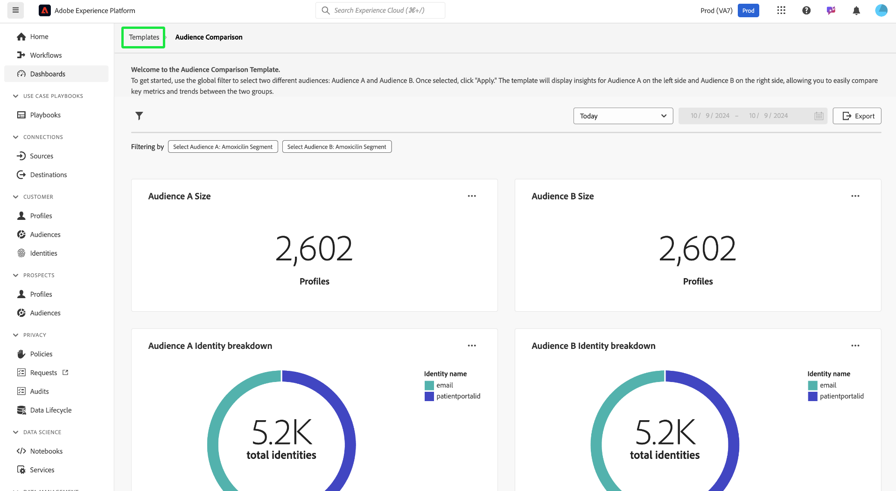

# Doelgroepvergelijking

Het dashboard van [!UICONTROL Audience comparison] vergelijkt en contrasteert de belangrijkste doelgroepmetrics in een weergave Naast elkaar. Vanuit dit dashboard kun je verschillende acties uitvoeren om twee doelgroepen te vergelijken en belangrijke metrics tussen deze doelgroepen te analyseren. Vervolgens kun je datagestuurde beslissingen nemen over doelgroepsegmentatie- en targetingstrategieën.

## Vergelijking van doelgroepen instellen {#set-audience-comparisons}

Om betekenisvollere inzichten en vergelijkingen mogelijk te maken, gebruik de systeemfilters om de doelgroepsegmenten en het tijdkader dat u in het analyseren interesseert nauwkeurig te richten. Selecteer het filterpictogram ( ) om twee verschillende doelgroepen te kiezen ([!UICONTROL Audience A] en [!UICONTROL Audience B] ) en specifieke parameters voor vergelijking in te stellen.

Het dialoogvenster [!UICONTROL Filter] wordt weergegeven. Selecteer het vervolgkeuzemenu **[!UICONTROL Select Audience A]** om het eerste publiek te kiezen dat u wilt analyseren. In dit voorbeeld is `California Patients` geselecteerd als Publiek A. Dit publiek wordt aan de linkerkant van de vergelijking weergegeven wanneer het filter wordt toegepast.

Kies vervolgens een tweede publiek dat u wilt vergelijken met [!UICONTROL Audience A] in het vervolgkeuzemenu **[!UICONTROL Select Audience B]** . In deze afbeelding is [!UICONTROL Users Consented to Email] geselecteerd als [!UICONTROL Audience B] . Dit publiek wordt rechts van het dashboard van [!UICONTROL Audience comparison] weergegeven wanneer het filter wordt toegepast.

### Datumbereiken aanpassen {#adjust-date-ranges}

U kunt uw gegevens ook filteren op specifieke tijdsperioden om te zien hoe deze soorten publiek presteren of over een waaier van de douanedatum veranderen. Als u een tijdbereik wilt instellen om de publieksgegevens op een bepaalde periode te filteren, selecteert u de begin- en einddatum in de kalendervelden.

Het dialoogvenster geeft ook aan hoeveel filters worden toegepast (in de onderstaande schermafbeelding worden twee filters gebruikt: Publiek A en Publiek B en vandaag als datumbereik). Selecteer **[!UICONTROL Clear all]** als u alle toegepaste filters wilt verwijderen.

Nadat u het publiek en het datumbereik hebt ingesteld, selecteert u **[!UICONTROL Apply]** om het dashboard van [!UICONTROL Audience comparison] te vernieuwen.

Het dashboard toont nu de vergelijkende grafieken naast elkaar voor elk publiek.

## Beschikbare vergelijkingsdiagrammen voor doelgroepen {#available-charts}

<!-- Potentially could expand this section to include images of each widget.  -->

Het dashboard biedt verschillende diagrammen om inzichten te vergelijken:

- [[!UICONTROL Audience size]](../../guides/audiences.md#audience-size): Volg eenvoudig de grootte van elke doelgroep op basis van het aantal profielen dat ze bevatten. Deze metrische informatie geeft inzicht in de schaal van de twee doelgroepen die je vergelijkt.
- [!UICONTROL Audience identity breakdown]: Een cirkeldiagram toont de relatieve samenstelling van identiteiten binnen elk publiek. U kunt het aantal totale identiteiten bekijken en onderzoeken hoe verschillende herkenningstekens (zoals e-mail of identiteitskaart van CRM) tot dat totaal bijdragen. Dit diagram helpt u om de samenstelling van elk publiek te begrijpen dat op identiteitstypes wordt gebaseerd. Houd de muis boven een gedeelte van het cirkeldiagram om een exact aantal identiteiten te zien.
- [[!UICONTROL Audience size trend]](../../guides/audiences.md#audience-size-trend): dit diagram geeft de trends in de grootte voor het gekozen publiek in de loop der tijd weer. Gebruik deze diagrammen om te visualiseren hoe de grootte van elke doelgroep is gewijzigd over een geselecteerde tijdsperiode, waarbij pieken en dalen wijzen op perioden van groei of afname van het aantal profielen.
- [[!UICONTROL Audience size change trend]](../../guides/audiences.md#audience-size-change-trend): Dit diagram toont de trends voor de grootte van het gekozen publiek. Het visualiseert hoeveel de doelgroepgrootte in de loop der tijd is toegenomen of afgenomen, en stelt je in staat significante verschuivingen of trends in de doelgroeppopulatie te identificeren.

>[!NOTE]
>
>Met de grafieken [!UICONTROL Audience size trend] en [!UICONTROL Audience size change trend] kunt u zowel de absolute grootte als de fluctuaties in grootte tussen twee doelgroepen over een bepaalde periode bijhouden en vergelijken. Deze informatie maakt het gemakkelijker om patronen en factoren te begrijpen die de veranderingen van het publiek beïnvloeden.

## Inzichten exporteren {#export-insights}

Nadat u filters hebt toegepast en het publiek hebt geanalyseerd, kunt u de gegevens voor verdere off-line analyse of rapporteringsdoeleinden uitvoeren. Als u uw inzichten wilt exporteren, selecteert u **[!UICONTROL Export]** rechtsboven in de tabel. Het dialoogvenster PDF wordt weergegeven. Vanuit dit dialoogvenster kunt u de gegevens in de tabel opslaan als een PDF of afdrukken.

Selecteer **[!UICONTROL Templates]** om terug te keren naar het overzicht van [!UICONTROL Template] .

## Volgende stappen

Na het lezen van dit document, hebt u geleerd hoe te om zeer belangrijke metriek tussen verschillende publieksgroepen te vergelijken gebruikend het **dashboard van de Vergelijking van het publiek 0&rbrace;.** Om uw publiekssegmentatie en het richten van strategieën verder te verbeteren, verkend andere Malplaatjes van Gegevens Distiller die extra inzichten verstrekken. Verwijs naar de [ Trends van het publiek ](./trends.md), [ de Overlappingen van de Identiteit van het publiek ](./identity-overlaps.md), en [ Geavanceerde gidsen van de Overlapping van het Publiek ](./overlaps.md) UI om uw besluit-makend verder te verbeteren en betrokkenheidsinspanningen te optimaliseren.

