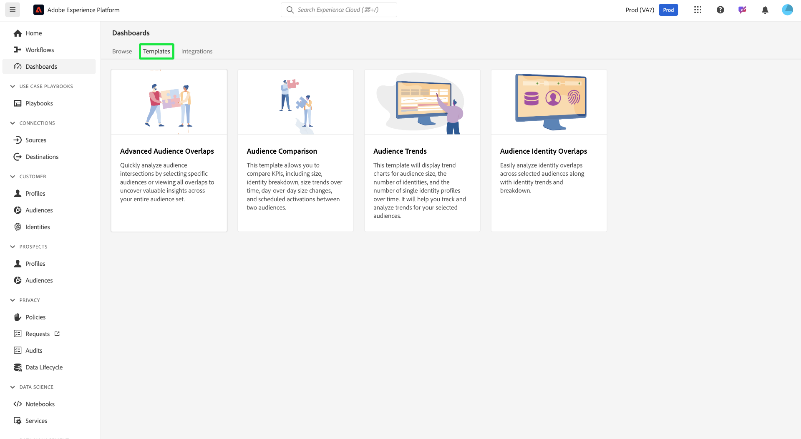

# Distiller-sjablonen voor gegevens

>[!AVAILABILITY]
>
>Distiller-sjablonen voor gegevens zijn exclusief voor gebruikers die de Data Distiller SKU hebben aangeschaft. Neem contact op met uw Adobe voor meer informatie.

**[!UICONTROL Data Distiller Templates]** biedt een reeks krachtige dashboards die u helpen inzicht te krijgen in uw publieksgegevens. Om u te helpen gegeven-gedreven besluiten maken en het richten strategieën verbeteren, biedt elke malplaatje een gestructureerde gids voor het analyseren van specifieke aspecten van publieksgedrag, segmentatie, en identiteitsbeheer.

Deze sjablonen zorgen voor consistentie en efficiëntie in uw analyseworkflows door activeerbare inzichten aan te bieden die u helpen segmentatie te verfijnen, redundantie te verminderen en de betrokkenheid te verbeteren. Of u doelt om publiekstrends te volgen, publieksgroepen te vergelijken, of identiteitsoverlap te analyseren, verstrekken de Malplaatjes van Gegevens Distiller de hulpmiddelen nodig om uw publiek beter te begrijpen en efficiënte marketing campagnes te drijven.

Om te beginnen selecteert u het tabblad **[!UICONTROL Templates]** in de [!UICONTROL Dashboards] -werkruimte van de service en kiest u een sjabloonkaart in de beschikbare lijst.

## Beschikbare sjablonen {#available-templates}

De sjablonen die momenteel beschikbaar zijn in de [!UICONTROL Dashboards] -werkruimte zijn:

### Geavanceerde publieksoverlap {#advanced-audience-overlaps}

Met het dashboard van [!UICONTROL Advanced Audience Overlaps] kunt u snel de snijpunten van de doelgroep voor een bepaald publiek analyseren of alle overlap weergeven om waardevolle inzichten in de gehele publieksset aan het licht te brengen. Gebruik deze inzichten om segmentatie te verfijnen, overtollig overseinen te verminderen, en gerichtere campagnes voor betere marketing efficiency te creëren.

### Auditievergelijking {#audience-comparison}

Met het dashboard van [!UICONTROL Audience Comparison] kunt u de belangrijkste metriek tussen twee publieksgroepen naast elkaar vergelijken. Gebruik dit dashboard om belangrijke KPIs, zoals publieksgrootte, identiteitsonderbreking, en veranderingen in publieksgrootte in tijd te analyseren. Deze inzichten helpen u geïnformeerde besluiten over publiekssegmentatie nemen en richten strategieën verbeteren.

### Trends van het publiek {#audience-trends}

Gebruik het dashboard van [!UICONTROL Audience Trends] om publieksmetriek in tijd te analyseren. Tendensen visualiseren voor de omvang van het publiek, het aantal identiteiten en het aantal afzonderlijke identiteitsprofielen om de evolutie van het publiek te volgen, de groei te meten en de strategieën voor betrokkenheid effectief te verfijnen.

### Identiteitsoverlappingen publiek {#audience-identity-overlaps}

Gebruik het dashboard van [!UICONTROL Audience Identity Overlaps] om identiteitsoverlap binnen geselecteerde doelgroepen te analyseren. Bekijk identiteitstendensen en onderverdelingen om te begrijpen hoe de verschillende identiteitstypes betrekking hebben, verbeterend identiteit stitching en verbeterend klantensegmenteringsnauwkeurigheid.

## Volgende stappen

Nadat u dit document hebt gelezen, hebt u kennis genomen van de vier Distiller-sjablonen voor gegevens die beschikbaar zijn in de werkruimte van dashboards en van de manier waarop u deze sjablonen kunt gebruiken om de gegevens van het publiek te analyseren voor een betere besluitvorming. Deze malplaatjes verstrekken hulpmiddelen om publiekskruisingen te begrijpen, metriek te vergelijken, tendensen te volgen, en identiteitsoverlappingen te analyseren om segmentatie te verfijnen, overtolligheid te verminderen, en overeenkomst te verbeteren.

Voor meer details op elk malplaatje, verwijs naar de respectieve gidsen voor [ Geavanceerde Overlappingen van het Publiek ](./overlaps.md), [ Vergelijking van het Publiek ](./comparison.md), [ Trends van het Publiek ](./trends.md), en [ de Overlappingen van de Identiteit van het Publiek ](./identity-overlaps.md).
