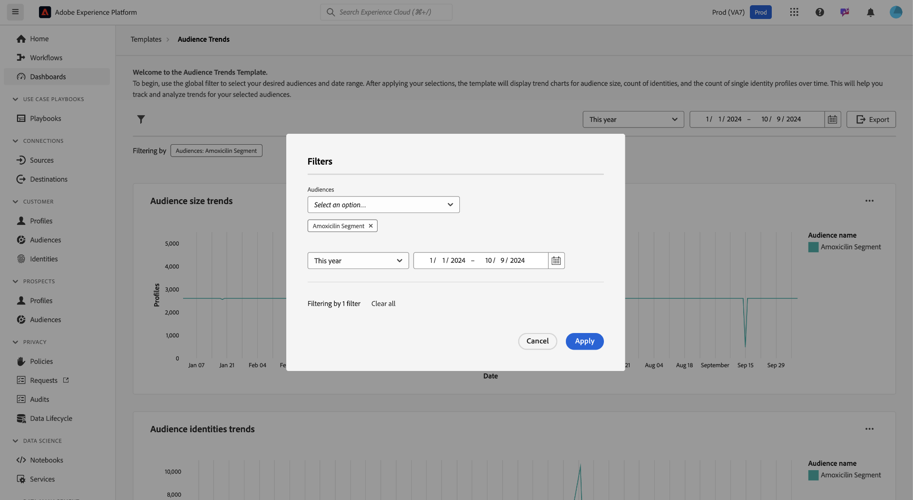

# Trends van het publiek

Analyseer hoe uw publiek in de loop der tijd verandert met visualisaties van de belangrijkste publieksmeetgegevens op het [!UICONTROL Audience Trends] dashboard. Dit dashboard helpt u trends zoals publieksgroei, het aantal identiteiten, en het aantal van enige identiteitsprofielen volgen, en machtigt u om gegeven-gedreven besluiten te nemen. Door deze cijfers te analyseren, kunnen marketers het richten strategieën optimaliseren, publieksbetrokkenheid verbeteren, en hun segmenteringsinspanningen verfijnen voor effectievere campagnes.

## Soorten publiek filteren {#filter-audiences}

Als u met de analyse wilt beginnen, selecteert u met het globale filter het specifieke publiek en het datumbereik dat u wilt analyseren. Selecteer het filterpictogram ( ) om het dialoogvenster **[!UICONTROL Filter]** te openen, waarin u het volgende kunt doen:

1. **selecteer een publiek**: Kies het publiek u wenst om te analyseren (in het voorbeeld screenshot, is het **Amoxicillin** publiek geselecteerd).
1. **plaats een datumwaaier**: Kies een vooraf bepaalde waaier van het dropdown menu of selecteer manueel begin en einddata gebruikend de kalendergebieden.

Nadat u de filters hebt ingesteld, selecteert u **[!UICONTROL Apply]** om het dashboard bij te werken. De door u gekozen filters worden toegepast en er worden gerichte inzichten van geselecteerde doelgroepen gedurende een bepaalde tijdsperiode weergegeven. Met uw aangepaste filters zorgt u ervoor dat de gegevens relevant zijn voor uw analysedoelstellingen.

## Beschikbare trends voor het publiek {#available-charts}

Er zijn drie hoofdgrafieken om u te helpen publieksmetriek in tijd begrijpen. Voor elke grafiek, kunt u de ellips (`...`) in het hoogste recht selecteren dat door [!UICONTROL View more] wordt gevolgd om of een van tabellarische vorm van de resultaten te bekijken, of de gegevens als Csv- dossier te downloaden om in een spreadsheet te bekijken. Voor meer details, verwijs naar de [ Meer gids van de Mening ](../view-more.md).

>[!TIP]
>
>U kunt de muisaanwijzer boven een bepaalde datum in een bepaald diagram plaatsen om het aantal afzonderlijke profielen in een dialoogvenster weer te geven.

### Trends bij doelgrootte {#audience-size-trends}

Het **[!UICONTROL Audience size trends]** -diagram toont het aantal profielen binnen het geselecteerde publiek in de loop van de tijd. Het helpt publieksgroei of vermindering te volgen. U kunt dit diagram gebruiken om de doeltreffendheid van de betrokkenheid te controleren en wijzigingen in de omvang van het publiek te begrijpen.

### Trends in de identiteiten van het publiek {#audience-identities-trends}

Het **[!UICONTROL Audience identities trends]** -diagram geeft inzicht in het totale aantal identiteiten in het publiekssegment. In dit diagram kunt u zien hoe unieke identiteiten bijdragen aan de totale grootte van het publiek. Het geeft een indicatie van de stabiliteit en betrokkenheid van het publiek.

### Trends bij de grootte van één identiteitspubliek {#single-identity-audience-size-trends}

Het **[!UICONTROL Single identity audience size trends]** -diagram toont het aantal publieksleden met slechts één identiteit. Deze maatstaf is nuttig om de samenstelling van uw publiek te begrijpen, met name in termen van identiteit uniek, en helpt de doeltreffendheid van identiteitsstitching inspanningen te meten.

## Inzichten exporteren {#export-insights}

Nadat u de meetgegevens hebt geanalyseerd en relevante filters hebt toegepast, kunt u de gegevens exporteren voor verdere offline analyse of rapportage. Selecteer hiervoor **[!UICONTROL Export]** rechtsboven in de tabel. Het dialoogvenster PDF wordt weergegeven. Vanuit dat dialoogvenster kunt u de visualiseerde gegevens opslaan als een PDF of deze afdrukken.

## Volgende stappen

Na het lezen van dit document, hebt u geleerd hoe te om waardevolle inzichten in publieksgedrag in tijd van het **dashboard van Trends van het publiek te bereiken 0}.** Om over andere Malplaatjes van Gegevens te leren Distiller die u kunnen helpen om geïnformeerde besluiten te nemen, segmentatie te optimaliseren, en betrokkenheidsstrategieën te verbeteren, verwijs naar de ](./comparison.md) Vergelijking van het 0} publiek, [ de Overlappingen van de Identiteit van het publiek ](./identity-overlaps.md), en [ de Geavanceerde gidsen van de Overlapping van het Publiek ](./overlaps.md) UI.[
