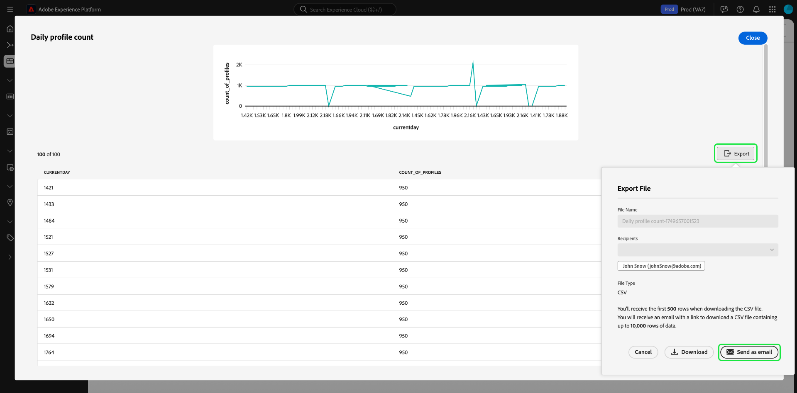

# Meer weergeven {#view-more}

Na het creëren van a [&#x200B; douane insight &#x200B;](./overview.md) gebruikend [&#x200B; vraag pro wijze &#x200B;](./overview.md#query-pro-mode), kunt u de grafiekgegevens in veelvoudige formaten bekijken. U kunt een tabelvorm van de resultaten weergeven of de gegevens exporteren in CSV-indeling of via e-mail.

## Resultaten in tabelvorm {#tabulated-results}

Voor elke grafiek die met de vraag pro wijze door SQL wordt ontworpen, kunt u de lussenresultaten van uw analyse binnen Experience Platform UI bekijken.

Selecteer in het aangepaste dashboard de ellipsen (`...`) op een willekeurige widget voor toegang tot de opties [!UICONTROL View more] en [!UICONTROL View SQL] .

## Exporteren {#export}

Exporteer de tabelgegevens vanuit het dialoogvenster **[!UICONTROL View more]** door een CSV-bestand rechtstreeks te downloaden of door later een koppeling naar uw e-mail te verzenden voor een beveiligde download.

>[!IMPORTANT]
>
>Voor toegang tot de exportopties moet uw beheerder u de machtiging **[!UICONTROL Export Dashboard Data]** verlenen. Neem contact op met de beheerder als de knop [!UICONTROL Export] grijs wordt weergegeven. Zie het [&#x200B; overzicht van de Toegangscontrole &#x200B;](../../access-control/home.md) voor meer informatie over dashboardtoestemmingen.

>[!NOTE]
>
>Voor het exporteren met alleen visualisatie is de machtiging [!UICONTROL Export Dashboard Data] niet vereist. Bijvoorbeeld, het uitvoeren van verwerkte gegevens van uw [&#x200B; inzichten van het douanedashboard in formaat PDF &#x200B;](./export-pdf.md), of van [&#x200B; de dashboardinzichten van het Platform UI &#x200B;](../download.md).

### CSV downloaden {#download-csv}

Selecteer **[!UICONTROL Export]** in het dialoogvenster [!UICONTROL View more] en kies vervolgens **[!UICONTROL Download CSV]** om de grafiekgegevens in CSV-indeling te downloaden.

>[!NOTE]
>
>Het downloaden CSV is beperkt tot de eerste 500 records.

### Verzenden als e-mail {#send-as-email}

Als u meer dan 500 records wilt exporteren, selecteert u **[!UICONTROL Export]** en kiest u **[!UICONTROL Send as email]** in het dialoogvenster [!UICONTROL Export file] . Met deze optie wordt veilig een downloadkoppeling naar uw aan Adobe gekoppeld e-mailadres verzonden. De naam en het geregistreerde Adobe-e-mailadres van de ontvanger worden weergegeven in de sectie [!UICONTROL Recipients] van het dialoogvenster.

Nadat u [!UICONTROL Send as email] hebt geselecteerd, genereert Adobe een rapport en verzendt het een e-mail naar het geregistreerde Adobe-adres. Het e-mailbericht bevat een beveiligde downloadkoppeling waarvoor verificatie via Experience Platform is vereist.

>[!NOTE]
>
>U moet het rapport downloaden binnen 24 uur na het genereren van de koppeling; daarna verloopt het bestand.

Om uw gegevens te beschermen, bewaart Adobe veilig uitgevoerde dossiers eerder dan het verzenden van hen als gehechtheid. Toegang vereist verificatie via de gebruikersinterface van Experience Platform en Adobe controleert of het bestand alleen door de beoogde ontvanger is gedownload.

Deze methode staat u toe om **tot 10.000 verslagen** uit te voeren en verzekert veilige toegang tot gevoelige gegevens.

## Sorteren op kolom {#sort-column}

Wanneer u tabellarische resultaten weergeeft, kunt u de sorteerfunctie gebruiken om in oplopende of aflopende volgorde op kolom te sorteren. Selecteer in het aangepaste dashboard de ovalen (`...`) in een tabel voor toegang tot de optie [!UICONTROL View more] .

U kunt kolommen sorteren door het keuzemenu naast de kolomnaam te selecteren en vervolgens **[!UICONTROL Sort Ascending]** of **[!UICONTROL Sort Descending]** te selecteren.

>[!NOTE]
>
>De [!UICONTROL Sort Ascending] en [!UICONTROL Sort Descending] opties zullen slechts voor kolommen verschijnen die met [&#x200B; sorterende functionaliteit &#x200B;](./overview.md#advanced-attributes) zijn gevormd.

## Het formaat van een kolom wijzigen {#resize-column}

U kunt de grootte van kolommen in tabellarische resultaten wijzigen om de leesbaarheid van de gegevens te verbeteren. Selecteer in het aangepaste dashboard de ovalen (`...`) voor uw tabel voor toegang tot de optie [!UICONTROL View more] . Gebruik het vervolgkeuzemenu naast de kolomnaam om het formaat ervan te wijzigen en selecteer vervolgens **[!UICONTROL Resize column]** .

Selecteer de schuifregelaar en sleep deze naar links of rechts om de kolomgrootte naar wens aan te passen.

## Tabelpaginering {#table-pagination}

Paginering wordt automatisch toegepast op uw tabellen in de functie [!UICONTROL View more] , zodat u uw SQL-query&#39;s niet handmatig hoeft te wijzigen. Deze eigenschap zorgt ervoor dat uw gegevens in een handelbaarder formaat worden voorgesteld, dat het proces vergemakkelijkt om door grote datasets te navigeren.

U kunt maximaal 500 records per pagina zien. Als u door de records wilt navigeren, gebruikt u de **[!UICONTROL >]** onder aan de pagina.

## Volgende stappen

Nadat u dit document hebt gelezen, weet u nu hoe u de resultaten met tabs kunt weergeven die afkomstig zijn van de SQL-analyse van uw aangepaste diagram en hoe u die gegevens veilig kunt exporteren. Zie het meningSQL document leren hoe te [&#x200B; SQL achter uw douaneinzichten &#x200B;](./view-sql.md) bekijken.

U kunt ook leren hoe te om grafieken van bestaande gegevensmodellen in Adobe Experience Platform UI met de [&#x200B; geleide gids van de ontwerpwijze &#x200B;](../standard-dashboards.md) te produceren.
