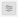

# Aangepaste dashboards

Gebruik Adobe Experience Platform-dashboards om inzichten te versnellen en visualisatie aan te passen via de functie Dashboards. Met deze functie kunt u aangepaste dashboards maken en beheren waar u op maat gemaakte widgets kunt maken, toevoegen en bewerken om belangrijke metriek die relevant is voor uw organisatie te visualiseren.

<!-- Getting started / permissions section commented out for Beta. This will be necessary after GA only

## Getting started

To view dashboards in Adobe Experience Platform you must have the appropriate permissions enabled. Please read the [dashboards permissions documentation](./permissions.md#available-permissions) to learn how to grant users the ability to view, edit, and update Experience Platform dashboards using Adobe Admin Console. If you do not have administrator privileges for your organization, contact your product administrator to obtain the required permissions. -->

## Een aangepast dashboard maken

Als u eerst een aangepast dashboard wilt maken, navigeert u naar het dashboardoverzicht. Selecteren **[!UICONTROL Dashboards]** van de linkernavigatie van Platform UI gevolgd door **[!UICONTROL Create dashboard]**.

Voordat u een aangepast dashboard toevoegt, is de dashboardvoorraad leeg en wordt &#39;&#39;Geen dashboards gevonden&#39;&#39; weergegeven. bericht. Nadat u de dashboards hebt gemaakt, worden al uw dashboards weergegeven in de dashboardvoorraad.

<!-- >[!NOTE]
>
>To edit an existing dashboard, select the dashboard name from the inventory list followed by the pencil icon ()
>{width="100" zoomable="yes"} -->

De [!UICONTROL Create dashboard] wordt weergegeven. Voer een beschrijvende naam in voor de verzameling widgets die u wilt maken en selecteer **[!UICONTROL Save]**.

Gebruikers die de Data Distiller SKU hebben aangeschaft, kunnen aangepaste SQL-query&#39;s gebruiken om hun inzichten te maken. Zie de [Aanpasbare handleiding voor het maken van inzichten](./data-distiller/customizable-insights/overview.md) voor instructies over deze workflow.

Het nieuwe lege dashboard wordt met de door u gekozen naam weergegeven in de linkerbovenhoek van de weergave.

## Een widget maken {#create-widget}

>[!CONTEXTUALHELP]
>id="platform_dashboards_udd_maxwidgets"
>title="Maximum aantal widgets"
>abstract="De Dashboard-service ondersteunt maximaal tien widgets. Nadat u tien widgets aan uw dashboard hebt toegevoegd, [!UICONTROL Add new widget] is uitgeschakeld en wordt grijs weergegeven."

Selecteer in de nieuwe dashboardweergave de optie **[!UICONTROL Add new widget]** om het maken van de widget te starten.

>[!IMPORTANT]
>
>Elk dashboard ondersteunt maximaal tien widgets. Nadat u tien widgets aan uw dashboard hebt toegevoegd, [!UICONTROL Add new widget] is uitgeschakeld en wordt grijs weergegeven.

### Widget-composer

De werkruimte van de widgetcomposer wordt weergegeven. Selecteer vervolgens **[!UICONTROL Select data]** om het gegevensmodel te kiezen waaruit u kenmerken aan uw widgets wilt toevoegen.

#### Gegevensmodel selecteren {#select-data-model}

De [!UICONTROL Select data model] wordt weergegeven. Selecteer een gegevensmodel in de linkerkolom om een voorvertoningslijst van alle beschikbare lijsten te tonen. Het vooraf geconfigureerde gegevensmodel voor Real-time Customer Data Platform is benoemd [!UICONTROL CDPInsights].

>[!TIP]
>
>Selecteer het informatiepictogram () om de volledige naam van het gegevensmodel te zien als het te lang is om in de dataroil weer te geven.

De voorvertoningslijst bevat informatie over de tabellen in het gegevensmodel. De onderstaande tabel bevat een beschrijving van de kolomvelden en de mogelijke waarden ervan.

| Kolomveld | Beschrijving |
|---|---|
| [!UICONTROL Title] | De naam van de tabel. |
| [!UICONTROL Table type] | Het type tabel. Mogelijke typen zijn: `fact`, `dimension`, en `none`. |
| [!UICONTROL Records] | Het aantal records dat aan de gekozen tabel is gekoppeld. |
| [!UICONTROL Lookups] | Het aantal tabellen dat is gekoppeld aan de gekozen tabel. |
| [!UICONTROL Attributes] | Het aantal kenmerken voor de gekozen tabel. |

Selecteren **[!UICONTROL Next]** om uw keuze van het gegevensmodel te bevestigen. In de volgende weergave wordt een lijst weergegeven met de beschikbare tabellen in de linkertrack. Selecteer een tabel voor een uitgebreide uitsplitsing van de gegevens in de geselecteerde tabel.

### Widget vullen {#populate-widget}

De [!UICONTROL Preview] deelvenster bevat tabbladen voor [!UICONTROL Sample records] en [!UICONTROL Attributes]. De [!UICONTROL Sample records] bevat een subset van de records uit de geselecteerde tabel in een tabelweergave. De [!UICONTROL Attributes] bevat de kenmerknaam, het gegevenstype en de brontabel voor elk kenmerk dat aan de geselecteerde tabel is gekoppeld.

Selecteer een tabel in de lijst in de linkertrack om gegevens voor de widget op te geven en selecteer **[!UICONTROL Select]** om terug te keren naar de widgetcomposer.

De widgetcomposer is nu gevuld met gegevens uit de door u gekozen tabel.

Het gegevensmodel en de momenteel geselecteerde tabel worden boven aan de linkertrack weergegeven. De kenmerken die beschikbaar zijn om de widget te maken, worden in het dialoogvenster [!UICONTROL Attributes] kolom. U kunt de zoekbalk gebruiken om naar kenmerken te zoeken in plaats van door de lijst te schuiven, of u kunt het gekozen gegevensmodel wijzigen door het potloodpictogram te selecteren () in de linkerspoorstaaf.

#### Kenmerken toevoegen en filteren {#add-and-filter-attributes}

Selecteer het pictogram Toevoegen () naast een kenmerknaam om een kenmerk aan de widget toe te voegen. In het vervolgkeuzemenu dat wordt weergegeven, kunt u een kenmerk toevoegen als de X-as, de Y-as, een kleur of een filter voor de widget. De [!UICONTROL Color] kunt u de resultaten van de markeringen op de X- en Y-as onderscheiden op basis van kleur. Dit wordt gedaan door de resultaten in verschillende kleuren te verdelen die op hun samenstelling van een derde attribuut worden gebaseerd.

>[!TIP]
>
>Als u de rangschikking van de X- en Y-as wilt omdraaien, selecteert u het pictogram Pijl-omhoog en Pijl-omlaag () om van regeling te veranderen.

Als u het type grafiek of grafiek van de widget wilt wijzigen, selecteert u de optie [!UICONTROL Marks] en kiest u een van de beschikbare opties. U kunt onder andere balken, punten, tikken, lijnen of gebieden kiezen. Als deze optie is geselecteerd, wordt een voorvertoning van de huidige instellingen van de widget gegenereerd.

Door een kenmerk toe te voegen als filter, kunt u selecteren welke waarden u wilt opnemen in of uitsluiten van de widget. Nadat u een filter uit de lijst met kenmerken hebt toegevoegd, kunt u [!UICONTROL Filter] wordt weergegeven waar u waarden kunt in- of uitschakelen via het selectievakje.

#### Historische gegevens uitfilteren {#filter-historical-data}

Als u historische gegevens wilt filteren uit de inzichten die door de widget zijn gegenereerd, voegt u de opdracht `date_key` kenmerk als filter en selecteer **[!UICONTROL Recent date]** gevolgd door **[!UICONTROL Apply]**. Dit filter zorgt ervoor dat de gegevens die worden gebruikt om inzichten af te leiden uit de meest recente systeemmomentopname worden genomen.

![De [!UICONTROL Filter: date_key] dialoog met [!UICONTROL Recent date] en [!UICONTROL Apply] gemarkeerd.](./images/user-defined-dashboards/recent-date.png)

U kunt ook een aangepaste periode maken om de gegevens op te filteren. Selecteren **[!UICONTROL Select dates]** om het dialoogvenster uit te breiden met een lijst met beschikbare datums. Gebruik de **[!UICONTROL Select all]** Schakel het selectievakje in om alle beschikbare opties in of uit te schakelen, of schakel het selectievakje voor elke dag afzonderlijk in. Tot slot selecteert u **[!UICONTROL Apply]** om je keuzes te bevestigen.

>[!NOTE]
>
>Als de `date_key` kenmerk is al toegevoegd als filter, selecteer de ellips gevolgd door **[!UICONTROL Edit]** in de vervolgkeuzelijst om de filterperiode te wijzigen.

![De [!UICONTROL Filter: date_key] met afzonderlijke selectievakjes voor dagen ingeschakeld en uitgeschakeld.](./images/user-defined-dashboards/select-dates.png)

### Eigenschappen van Widget

Selecteer het pictogram Eigenschappen () in het rechterspoor om het deelvenster Eigenschappen te openen. In de [!UICONTROL Properties] een naam voor de widget in het deelvenster [!UICONTROL Widget title] tekstveld.

Vanuit het deelvenster met widgeigenschappen kunt u verschillende aspecten van uw widget bewerken. U hebt volledige controle om de plaats van widgetlegenda uit te geven. Als u de legenda wilt verplaatsen, selecteert u de [!UICONTROL Legend placement] en kiest u de gewenste locatie in de lijst met beschikbare opties. U kunt ook de naam wijzigen van het label dat is gekoppeld aan de legenda en de X- of Y-as door een nieuwe naam in te voeren in het dialoogvenster [!UICONTROL Legend title] tekstveld, of [!UICONTROL Axis label] respectievelijk tekstveld.

#### Uw widget opslaan {#save-widget}

Als u de widget opslaat in de widgetcomposer, wordt de widget lokaal op het dashboard opgeslagen. Als u uw werk wilt opslaan en later wilt hervatten, selecteert u **[!UICONTROL Save]**. Een tikpictogram onder de widgetnaam geeft aan dat de widget is opgeslagen. Als u tevreden bent met de widget, selecteert u **[!UICONTROL Save and close]** om de widget beschikbaar te maken voor alle andere gebruikers die toegang hebben tot het dashboard. Selecteren **[!UICONTROL Cancel]** om af te zien van uw werk en terug te keren naar het aangepaste dashboard.

>[!TIP]
>
>Selecteer het pictogram Eigenschappen () naast de naam van het dashboard voor meer informatie over het maken ervan. U kunt de naam van het dashboard wijzigen in het dialoogvenster dat verschijnt.

U kunt widgets opnieuw rangschikken en de grootte ervan wijzigen in deze werkruimte. Selecteren **[!UICONTROL Save]** om de naam en de geconfigureerde indeling van het dashboard te behouden.

Om ervoor te zorgen dat elke vraag voor een Adobe Real-time Customer Data Platform inzichten dashboard genoeg middelen heeft om efficiënt uit te voeren, volgt API middelgebruik door gelijkheidsgroeven aan elke vraag toe te wijzen. Het systeem kan tot vier gezamenlijke vragen verwerken, en daarom zijn vier gezamenlijke vraaggroeven beschikbaar op elk bepaald ogenblik. Vragen worden in een wachtrij geplaatst op basis van sleuven voor gelijktijdige uitvoering en wachten vervolgens in de wachtrij totdat voldoende sleuven voor gelijktijdige uitvoering beschikbaar zijn.

### Een widget bewerken, dupliceren of verwijderen {#duplicate}

Nadat u een widget hebt gemaakt, kunt u volledige widgets uit uw aangepaste dashboard bewerken, dupliceren of verwijderen.

>[!TIP]
>
>Als u wilt schakelen tussen een van uw bestaande aangepaste dashboards, selecteert u Dashboards in de linkernavigatiebalk en selecteert u vervolgens de dashboardnaam in de inventarislijst.

Selecteer het potloodpictogram () rechtsboven in het aangepaste dashboard om naar de bewerkingsmodus te gaan.

Selecteer vervolgens de ovalen in de rechterbovenhoek van de widget die u wilt bewerken, kopiëren of verwijderen. Selecteer de gewenste actie in het vervolgkeuzemenu.

>[!NOTE]
>
>Met duplicatie kunt u de kenmerken van een inzicht aanpassen om een unieke widget te maken zonder dat u helemaal opnieuw hoeft te beginnen. Als u een widget dupliceert, wordt deze weergegeven in het aangepaste dashboard. Vervolgens kunt u de ovalen van de nieuwe widget selecteren, gevolgd door **[!UICONTROL Edit]**, om uw inzicht aan te passen.

## Volgende stappen en extra bronnen

Door dit document te lezen, hebt u een beter inzicht in hoe u een aangepast dashboard kunt maken en hoe u aangepaste widgets voor dat dashboard kunt maken, bewerken en bijwerken.

Om de beschikbare pre-gevormde metriek en visualisaties voor te ontdekken [profielen](./guides/profiles.md#standard-widgets), [segmenten](./guides/audiences.md#standard-widgets), en [bestemmingen](./guides/destinations.md#standard-widgets) dashboards, zie de lijst van standaardwidgets in hun respectieve documentatie.

Bekijk de volgende video om uw inzicht in dashboards in Experience Platform te versterken:

>[!VIDEO](https://video.tv.adobe.com/v/3409637?quality=12&learn=on)
