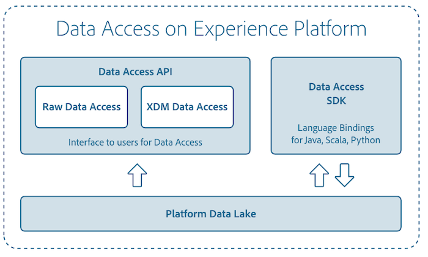

# Overzicht van gegevenstoegang

De API voor gegevenstoegang ondersteunt het Adobe Experience Platform door gebruikers een RESTful-interface te bieden die is gericht op de ontdekkingsbaarheid en toegankelijkheid van opgenomen datasets binnen het Experience Platform.



## API-specificatieverwijzing

De naslagdocumentatie voor de Swagger-API vindt u [hier](https://www.adobe.io/apis/experienceplatform/home/api-reference.html#!acpdr/swagger-specs/data-access-api.yaml).

## Terminologie

Een beschrijving van enkele veelgebruikte termen in dit document.

| Term | Beschrijving |
| ----- | ------------ |
| Gegevensset | Een verzameling gegevens met een schema en velden. |
| Batch | Een reeks gegevens die over een bepaalde periode worden verzameld en samen als één eenheid worden verwerkt. |

## Lijst met bestanden in een batch ophalen

Door een batch-id (batchID) te gebruiken, kan de API voor gegevenstoegang een lijst ophalen met bestanden die tot die bepaalde batch behoren.

**API-indeling**

```http
GET /batches/{BATCH_ID}/files
```

| Eigenschap | Beschrijving |
| -------- | ----------- |
| `{BATCH_ID}` | De id van de opgegeven batch. |

**Verzoek**

```shell
curl -X GET https://platform.adobe.io/data/foundation/export/batches/{BATCH_ID}/files \
  -H 'Authorization: Bearer {ACCESS_TOKEN}' \
  -H 'x-api-key: {API_KEY}' \
  -H 'x-gw-ims-org-id: {IMS_ORG}' \
  -H 'x-sandbox-name: {SANDBOX_NAME}'
```

**Antwoord**

```json
{
  "data": [
    {
      "dataSetFileId": "{FILE_ID_1}",
      "dataSetViewId": "string",
      "version": "1.0.0",
      "created": "string",
      "updated": "string",
      "isValid": true,
      "_links": {
        "self": {
          "href": "https://platform.adobe.io/data/foundation/export/files/{FILE_ID_1}"
        }
      }
    },
    {
      "dataSetFileId": "{FILE_ID_2}",
      "dataSetViewId": "string",
      "version": "1.0.0",
      "created": "string",
      "updated": "string",
      "isValid": true,
      "_links": {
        "self": {
          "href": "https://platform.adobe.io/data/foundation/export/files/{FILE_ID_2}"
        }
      }
    },
  ],
  "_page": {
    "limit": 100,
    "count": 1
  }
}
```

De `"data"` array bevat een lijst met alle bestanden in de opgegeven batch. Elk geretourneerd bestand heeft een eigen unieke id (`{FILE_ID}`) in het `"dataSetFileId"` veld. Deze unieke id kan vervolgens worden gebruikt om het bestand te openen of te downloaden.

| Eigenschap | Beschrijving |
| -------- | ----------- |
| `data.dataSetFileId` | De bestands-id voor elk bestand in de opgegeven batch. |
| `data._links.self.href` | De URL voor toegang tot het bestand. |

## Bestanden in een batch openen en downloaden

Door een bestand-id (`{FILE_ID}`) te gebruiken, kunt u de API voor gegevenstoegang gebruiken om toegang te krijgen tot specifieke gegevens van een bestand, zoals de naam, grootte in bytes en een koppeling die u wilt downloaden.

De reactie bevat een gegevensarray. Afhankelijk van het feit of het bestand waarnaar de id verwijst een afzonderlijk bestand of een map is, kan de geretourneerde gegevensarray één item of een lijst met bestanden bevatten die tot die map behoren. Elk bestandselement bevat de details van het bestand.

**API-indeling**

```http
GET /files/{FILE_ID}
```

| Eigenschap | Beschrijving |
| -------- | ----------- |
| `{FILE_ID}` | De id van het bestand dat moet worden geopend, komt overeen met `"dataSetFileId"`de id. |

**Verzoek**

```shell
curl -X GET https://platform.adobe.io/data/foundation/export/files/{FILE_ID} \
  -H 'Authorization: Bearer {ACCESS_TOKEN}' \
  -H 'x-api-key: {API_KEY}' \
  -H 'x-gw-ims-org-id: {IMS_ORG}' \
  -H 'x-sandbox-name: {SANDBOX_NAME}'
```

**Eén bestandreactie**

```JSON
{
  "data": [
    {
      "name": "{FILE_NAME}",
      "length": "{LENGTH}",
      "_links": {
        "self": {
          "href": "https://platform.adobe.io/data/foundation/export/files/{FILE_ID}?path={FILE_NAME}"
        }
      }
    }
  ],
  "_page": {
    "limit": 100,
    "count": 1
  }
}
```

| Eigenschap | Beschrijving |
| -------- | ----------- |
| `data.name` | Naam van het bestand (bijvoorbeeld profielen.csv). |
| `data.length` | Grootte van het bestand (in bytes). |
| `data._links.self.href` | De URL waarmee het bestand moet worden gedownload. |

**Mapreactie**

```JSON
{
  "data": [
    {
      "dataSetFileId": "{FILE_ID_1}",
      "dataSetViewId": "string",
      "version": "1.0.0",
      "created": "string",
      "updated": "string",
      "isValid": true,
      "_links": {
        "self": {
          "href": "https://platform.adobe.io/data/foundation/export/files/{FILE_ID_1}"
        }
      }
    },
    {
      "dataSetFileId": "{FILE_ID_2}",
      "dataSetViewId": "string",
      "version": "1.0.0",
      "created": "string",
      "updated": "string",
      "isValid": true,
      "_links": {
        "self": {
          "href": "https://platform.adobe.io/data/foundation/export/files/{FILE_ID_2}"
        }
      }
    }
  ],
  "_page": {
    "limit": 100,
    "count": 2
  }
}
```

Wanneer een map wordt geretourneerd, bevat deze een array van alle bestanden in de map.

| Eigenschap | Beschrijving |
| -------- | ----------- |
| `data.name` | Naam van het bestand (bijvoorbeeld profielen.csv). |
| `data._links.self.href` | De URL waarmee het bestand moet worden gedownload. |

## De inhoud van een bestand openen

De API voor gegevenstoegang kan ook worden gebruikt voor toegang tot de inhoud van een bestand. Deze kan vervolgens worden gebruikt om de inhoud naar een externe bron te downloaden.

**API-indeling**

```http
GET /files/{dataSetFileId}?path={FILE_NAME}
```

| Eigenschap | Beschrijving |
| -------- | ----------- |
| `{FILE_NAME}` | De naam van het bestand dat u wilt openen. |

**Verzoek**

```shell
curl -X GET https://platform.adobe.io/data/foundation/export/files/{FILE_ID}?path={FILE_NAME} \
  -H 'Authorization: Bearer {ACCESS_TOKEN}' \
  -H 'x-api-key: {API_KEY}' \
  -H 'x-gw-ims-org-id: {IMS_ORG}' \
  -H 'x-sandbox-name: {SANDBOX_NAME}'
```

| Eigenschap | Beschrijving |
| -------- | ----------- |
| `{FILE_ID}` | De id van het bestand in een gegevensset. |
| `{FILE_NAME}` | De volledige naam van het bestand (bijvoorbeeld profielen.csv). |

**Antwoord**

```
Contents of the file
```

## Aanvullende codevoorbeelden

Raadpleeg de zelfstudie over [gegevenstoegang](tutorials/dataset-data.md)voor meer voorbeelden.


## Abonneren op gebeurtenissen voor gegevensinvoer

Platform maakt specifieke hoogwaardige gebeurtenissen beschikbaar voor abonnement via de [Adobe I/O-console](https://console.adobe.io/). U kunt bijvoorbeeld een abonnement nemen op gebeurtenissen voor het opnemen van gegevens om op de hoogte te worden gebracht van mogelijke vertragingen en mislukkingen. Meer informatie over het gebruik van Adobe I/O Events vindt u in de gids [Aan de slag](https://www.adobe.io/apis/experienceplatform/events/docs.html).