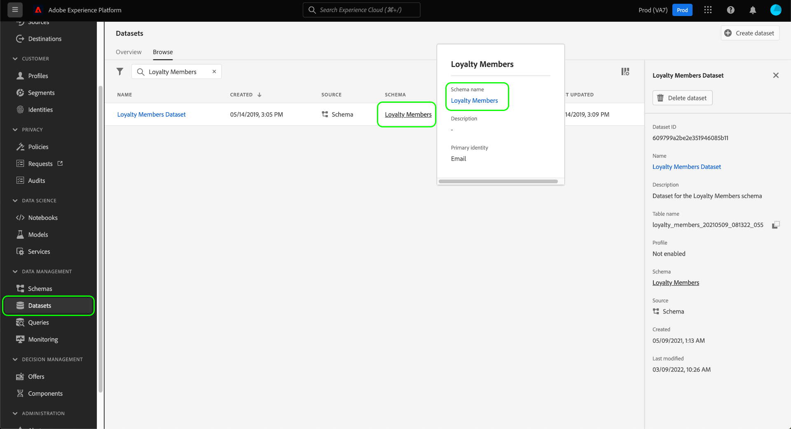
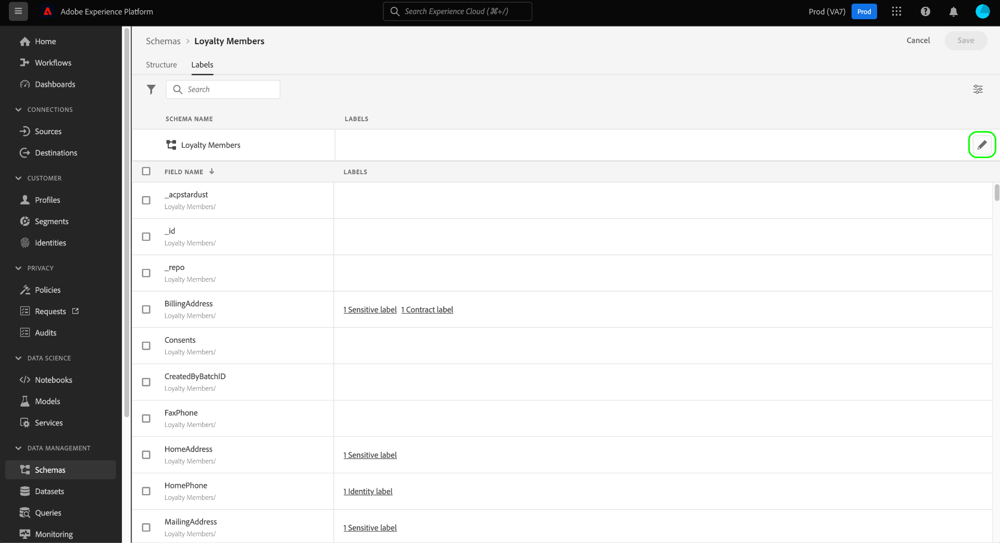

# End-to-end handleiding voor gegevensbeheer

Als u wilt bepalen welke marketingacties op bepaalde gegevenssets en velden in Adobe Experience Platform kunnen worden uitgevoerd, moet u het volgende instellen:

1. [Labels toepassen](#labels) op de datasets en de gebieden waarvan gebruik wilt beperken u.
1. [Beleid voor gegevensbeheer configureren en inschakelen](#policy) die bepalen welke soorten geëtiketteerde gegevens voor bepaalde marketing acties kunnen worden gebruikt.
1. [Marketing-acties toepassen op uw doelen](#destinations) om aan te geven welk beleid van toepassing is op gegevens die naar die bestemmingen worden verzonden.

Als u klaar bent met het configureren van uw labels, beleid en marketingacties, kunt u [uw beleidshandhaving testen](#test) ervoor te zorgen dat het naar behoren functioneert.

Deze gids doorloopt het volledige proces om een beleid van het gegevensbeheer in de UI van het Platform te vormen en af te dwingen. Voor meer gedetailleerde informatie over de eigenschappen die in deze gids worden gebruikt, verwijs naar de overzichtsdocumentatie over de volgende onderwerpen:

* [Adobe Experience Platform Data Governance](./home.md)
* [Labels voor gegevensgebruik](./labels/overview.md)
* [Beleid voor gegevensgebruik](./policies/overview.md)
* [Beleidshandhaving](./enforcement/overview.md)

## Labels toepassen {#labels}

Als er een specifieke dataset is die u beperkingen van het gegevensgebruik wilt afdwingen, kunt u [labels rechtstreeks toepassen op die gegevensset](#dataset-labels) of specifieke velden binnen die gegevensset.

U kunt ook [labels toepassen op een schema](#schema-labels) zodat alle datasets die op dat schema worden gebaseerd de zelfde etiketten erven.

>[!NOTE]
>
>Raadpleeg voor meer informatie over de verschillende labels voor gegevensgebruik en het beoogde gebruik de [gegevensgebruikslabels, verwijzing](./labels/reference.md). Als de beschikbare kernlabels niet op alle gewenste gebruiksgevallen betrekking hebben, kunt u [uw eigen aangepaste labels definiëren](./labels/user-guide.md#manage-custom-labels) ook.

### Labels toepassen op een gegevensset {#dataset-labels}

Selecteren **[!UICONTROL Datasets]** in de linkernavigatie, dan selecteer de naam van de dataset u etiketten op wilt toepassen. U kunt optioneel het onderzoeksgebied gebruiken om onderaan de lijst van getoonde datasets te versmallen.

De detailweergave voor de gegevensset wordt weergegeven. Selecteer **[!UICONTROL Data governance]** om een lijst van de gebieden van de dataset en om het even welke etiketten te bekijken die reeds op hen zijn toegepast. Schakel de selectievakjes in naast de velden waaraan u labels wilt toevoegen en selecteer vervolgens **[!UICONTROL Edit governance labels]** in het rechterspoor.

>[!NOTE]
>
>Als u etiketten aan de volledige dataset wilt toevoegen, selecteer checkbox naast **[!UICONTROL Field name]** om alle velden te markeren voordat u **[!UICONTROL Edit governance labels]**.
>
>

In de volgende dialoog, selecteer de etiketten die u op de datasetgebieden wilt toepassen die u vroeger koos. Als u klaar bent, selecteert u **[!UICONTROL Save changes]**.

Ga verder met de bovenstaande stappen om labels toe te passen op verschillende velden (of verschillende gegevenssets). Als u klaar bent, kunt u doorgaan naar de volgende stap van [beleid inzake gegevensbeheer inschakelen](#policy).

### Labels toepassen op een schema {#schema-labels}

Selecteren **[!UICONTROL Schemas]** in de linkernavigatie, dan selecteer het schema dat u etiketten aan van de lijst wilt toevoegen.

>[!TIP]
>
>Als u niet zeker bent welk schema op een bepaalde dataset van toepassing is, uitgezocht **[!UICONTROL Datasets]** in de linkernavigatie, dan selecteer de verbinding onder **[!UICONTROL Schema]** kolom voor de gewenste dataset. Selecteer de schemanaam in popover die lijkt om het schema in de Redacteur van het Schema te openen.
>
>

De structuur van het schema wordt weergegeven in de Schema-editor. Selecteer hier de **[!UICONTROL Labels]** om een lijstmening van de gebieden van het schema en de etiketten te tonen die reeds op hen zijn toegepast. Schakel de selectievakjes in naast de velden waaraan u labels wilt toevoegen en selecteer vervolgens **[!UICONTROL Edit governance labels]** in het rechterspoor.

>[!NOTE]
>
>Als u labels wilt toevoegen aan alle velden in het schema, selecteert u het potloodpictogram op de bovenste rij.
>
>

Selecteer in het volgende dialoogvenster de labels die u wilt toepassen op de schemavelden die u eerder hebt gekozen. Als u klaar bent, selecteert u **[!UICONTROL Save]**.

Ga als volgt te werk om labels toe te passen op verschillende velden (of verschillende schema&#39;s). Als u klaar bent, kunt u doorgaan naar de volgende stap van [beleid inzake gegevensbeheer inschakelen](#policy).

## Beleid voor gegevensbeheer inschakelen {#policy}

Nadat u etiketten op uw schema&#39;s en/of datasets hebt toegepast, kunt u het beleid van het gegevensbeheer tot stand brengen dat de marketing acties beperkt waarvoor bepaalde etiketten kunnen worden gebruikt.

Selecteren **[!UICONTROL Policies]** in de linkernavigatie om een lijst van kernbeleid te bekijken dat door Adobe wordt bepaald, evenals om het even welk douanebeleid dat eerder door uw organisatie wordt gecreeerd.

Elk kernetiket heeft een bijbehorend kernbeleid dat, wanneer toegelaten, de aangewezen activeringsbeperkingen op om het even welke gegevens afdwingt die dat etiket bevatten. Als u een kernbeleid wilt inschakelen, selecteert u dit in de lijst en selecteert u vervolgens de optie **[!UICONTROL Policy status]** schakelen naar **[!UICONTROL Enabled]**.

Als het beschikbare kernbeleid niet al uw gebruiksgevallen (zoals wanneer u douaneetiketten aanwendt die u onder uw organisatie hebt bepaald) behandelt, kunt u een douanebeleid in plaats daarvan bepalen. Van de **[!UICONTROL Policies]** werkruimte, selecteert u **[!UICONTROL Create policy]**.

![Afbeelding die de [!UICONTROL Create policy] knop die wordt geselecteerd in de gebruikersinterface](./images/e2e/create-policy.png)

Er verschijnt een pop-up waarin u wordt gevraagd het type beleid te selecteren dat u wilt maken. Selecteren **[!UICONTROL Data governance policy]** selecteert u vervolgens **[!UICONTROL Continue]**.

![Afbeelding die de [!UICONTROL Data governance policy] optie geselecteerd](./images/e2e/governance-policy.png)

Geef op het volgende scherm een **[!UICONTROL Name]** en optioneel **[!UICONTROL Description]** voor het beleid. Selecteer in de onderstaande tabel de labels waarop dit beleid moet controleren. Met andere woorden, dit zijn de labels die door het beleid niet kunnen worden gebruikt voor de marketingactie(s) die u in de volgende stap opgeeft.

Als u meerdere labels selecteert, kunt u de opties in het rechterspoor gebruiken om te bepalen of alle labels aanwezig moeten zijn om te zorgen dat het beleid gebruiksbeperkingen afdwingt, of dat slechts een van de labels aanwezig moet zijn. Als u klaar bent, selecteert u **[!UICONTROL Next]**.

Selecteer in het volgende scherm de marketingacties waarvoor dit beleid de eerder geselecteerde labels beperkt. Selecteren **[!UICONTROL Next]** om door te gaan.

Het definitieve scherm toont een samenvatting van de details van het beleid en de acties het zal beperken waarvoor etiketten. Selecteren **[!UICONTROL Finish]** om het beleid te creëren en in te schakelen.

Het beleid wordt gemaakt, maar is ingesteld op [!UICONTROL Disabled] standaard. Selecteer het beleid in de lijst en stel de optie **[!UICONTROL Policy status]** schakelen naar **[!UICONTROL Enabled]** om het beleid mogelijk te maken.

Ga verder met de bovenstaande stappen om het gewenste beleid te maken en in te schakelen voordat u verdergaat met de volgende stap.

## Marketing-acties voor doelen beheren {#destinations}

Als uw toegelaten beleid nauwkeurig om te bepalen welke gegevens aan een bestemming kunnen worden geactiveerd, moet u specifieke marketing acties aan die bestemming toewijzen.

Neem bijvoorbeeld een ingeschakeld beleid dat voorkomt dat gegevens een `C2` label dat voor de marketingactie wordt gebruikt &quot;[!UICONTROL Export to Third Party]&quot;. Wanneer het activeren van gegevens aan een bestemming, controleert het beleid welke marketing acties op de bestemming aanwezig zijn. Als &quot;[!UICONTROL Export to Third Party]&quot; aanwezig is, gegevens proberen te activeren met een `C2` resulteert in een beleidsovertreding. Als &quot;[!UICONTROL Export to Third Party]&quot; niet aanwezig is, wordt het beleid niet afgedwongen voor de bestemming en gegevens met `C2` etiketten kunnen vrij worden geactiveerd.

Wanneer [verbinding maken met een doel in de UI](../destinations/ui/connect-destination.md)de **[!UICONTROL Governance]** stap in het werkschema staat u toe om de marketing acties te selecteren die op deze bestemming van toepassing zijn, die uiteindelijk bepalen welk beleid van gegevensbeheer voor de bestemming wordt afgedwongen.

## Beleidshandhaving testen {#test}

Zodra u uw gegevens hebt geëtiketteerd, gegevens toegelaten beleid, en marketing acties aan uw bestemmingen toegewezen, kunt u testen of uw beleid wordt afgedwongen zoals verwacht.

Als u dingen opstelling correct, wanneer u probeert om gegevens te activeren die door uw beleid worden beperkt, wordt de activering automatisch ontkend en een bericht van de beleidsschending verschijnt, schetterend gedetailleerde informatie van de gegevenslijn over wat de schending veroorzaakte.

Document weergeven op [automatische beleidshandhaving](./enforcement/auto-enforcement.md) voor details over hoe te om de berichten van de beleidsschending te interpreteren.

## Volgende stappen

Deze handleiding bevatte de vereiste stappen voor het configureren en afdwingen van beleidsregels voor gegevensbeheer in uw activeringsworkflows. Raadpleeg de volgende documentatie voor meer informatie over de componenten voor gegevensbeheer die bij deze handleiding betrokken zijn:

* [Labels voor gegevensgebruik](./labels/overview.md)
* [Beleid voor gegevensgebruik](./policies/overview.md)
* [Beleidshandhaving](./enforcement/overview.md)
