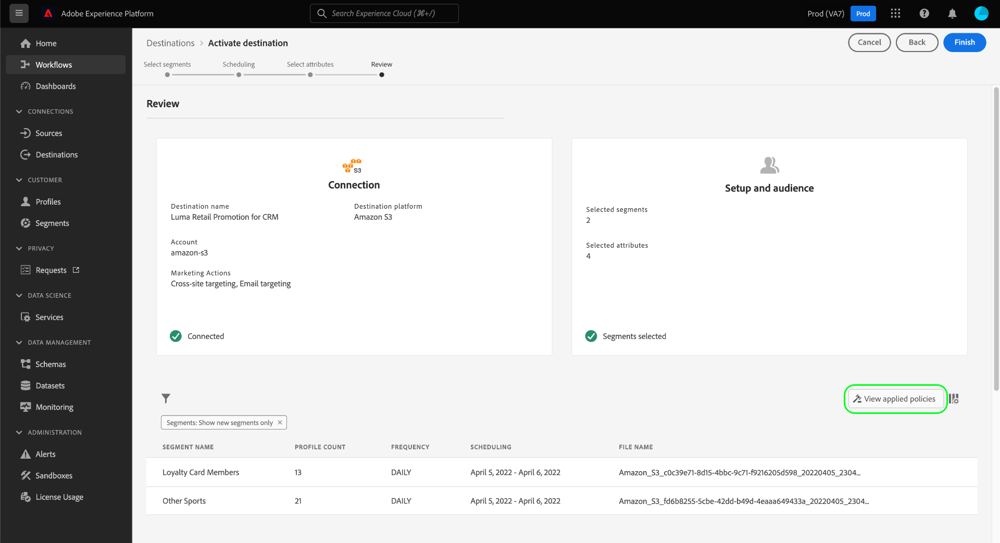

# Automatische beleidshandhaving

Zodra de gegevens worden geëtiketteerd en het gebruiksbeleid wordt bepaald, kunt u de naleving van het gegevensgebruik met beleid afdwingen. Wanneer het activeren van publiekssegmenten aan bestemmingen, dwingt Adobe Experience Platform automatisch gebruiksbeleid af als om het even welke schendingen voorkomen.

## Vereisten

Deze handleiding vereist een goed begrip van de diensten van de Platform die betrokken zijn bij de automatische handhaving. Raadpleeg de volgende documentatie voor meer informatie voordat u doorgaat met deze handleiding:

* [Adobe Experience Platform Data Governance](../home.md): Het kader waardoor het Platform de naleving van het gegevensgebruik door het gebruik van etiketten en beleid afdwingt.
* [Klantprofiel in realtime](../../profile/home.md): Verstrekt een verenigd, real-time consumentenprofiel dat op bijeengevoegde gegevens van veelvoudige bronnen wordt gebaseerd.
* [Adobe Experience Platform Segmentation Service](../../segmentation/home.md): De segmenteringsengine binnen [!DNL Platform] gebruikt om publiekssegmenten van uw klantenprofielen tot stand te brengen die op klantengedrag en attributen worden gebaseerd.
* [Doelen](../../destinations/home.md): Doelen zijn vooraf gebouwde integraties met veelgebruikte toepassingen die het mogelijk maken om gegevens van Platform naadloos te activeren voor kanaalmarketingcampagnes, e-mailcampagnes, gerichte reclame en meer.

## Handelingenstroom {#flow}

Het volgende diagram illustreert hoe de beleidshandhaving in de gegevensstroom van segmentactivering wordt geïntegreerd:

Wanneer een segment voor het eerst wordt geactiveerd, [!DNL Policy Service] controles voor toepasselijk beleid op basis van de volgende factoren:

* De labels voor gegevensgebruik die worden toegepast op velden en gegevenssets binnen het segment dat moet worden geactiveerd.
* Het marketingdoel van de bestemming.
* De profielen die hebben ingestemd met opname in de segmentactivering, op basis van uw geconfigureerde beleid voor toestemming.

>[!NOTE]
>
>Als er gegevensgebruikslabels zijn die slechts op bepaalde gebieden binnen een dataset (eerder dan de volledige dataset) zijn toegepast, komt de handhaving van die gebieden-vlakke etiketten op activering slechts onder de volgende voorwaarden voor:
>
>* De velden worden gebruikt in de segmentdefinitie.
>* De velden worden geconfigureerd als geprojecteerde kenmerken voor de doelbestemming.

## Gegevensverbinding {#lineage}

De verbinding van gegevens speelt een sleutelrol in hoe het beleid in Platform wordt afgedwongen. In algemene termen verwijst gegevenskoppeling naar de oorsprong van een set gegevens en naar wat er met de gegevens gebeurt (of waar deze naartoe worden verplaatst).

In de context van het Beheer van Gegevens, laat lijn gegevensgebruiksetiketten toe om van datasets aan stroomafwaartse diensten te verspreiden die hun gegevens, zoals het Profiel van de Klant in real time en bestemmingen verbruiken. Hierdoor kan het beleid op verschillende belangrijke punten in de gegevensreis door het Platform worden geëvalueerd en afgedwongen, en wordt de gegevensconsument een context geboden waarin hij kan zien waarom een beleidsovertreding heeft plaatsgevonden.

In Experience Platform gaat het bij de beleidshandhaving om de volgende begrotingslijn:

1. Gegevens worden in het Platform opgenomen en opgeslagen **gegevenssets**.
1. Klantprofielen worden geïdentificeerd en samengesteld op basis van deze gegevenssets door gegevensfragmenten samen te voegen volgens de **samenvoegingsbeleid**.
1. Groepen profielen zijn verdeeld in **segmenten** op basis van gemeenschappelijke kenmerken.
1. Segmenten worden geactiveerd naar de volgende laag **bestemmingen**.

Elke fase in de bovenstaande tijdlijn vertegenwoordigt een entiteit die kan bijdragen tot de handhaving van het beleid, zoals in de onderstaande tabel wordt aangegeven:

| Gegevenslijnfase | Rol bij de handhaving van het beleid |
| --- | --- |
| Gegevensset | Datasets bevatten gegevensgebruikslabels (toegepast op de dataset of het gebiedsniveau) die bepalen welke gebruiksgevallen de volledige dataset of specifieke gebieden kunnen worden gebruikt voor. Beleidsovertredingen treden op als een dataset of veld met bepaalde labels wordt gebruikt voor een doel dat door een beleid wordt beperkt.  Eventuele toestemmingskenmerken die van uw klanten worden verzameld, worden ook in gegevenssets opgeslagen. Als u toegang tot toestemmingsbeleid hebt, zullen om het even welke profielen die niet aan de vereisten van de toestemmingsattributen van uw beleid voldoen van segmenten worden uitgesloten die aan een bestemming worden geactiveerd. |
| Samenvoegbeleid | Het beleid van de fusie is de regels die het Platform gebruikt om te bepalen hoe de gegevens voorrang zullen worden gegeven wanneer het samenvoegen van fragmenten van veelvoudige datasets. De schendingen van het beleid zullen voorkomen als uw samenvoegbeleid wordt gevormd zodat de datasets met beperkte etiketten aan een bestemming worden geactiveerd. Zie de [overzicht van samenvoegbeleid](../../profile/merge-policies/overview.md) voor meer informatie . |
| Segment | De regels van het segment bepalen welke attributen van klantenprofielen zouden moeten worden omvat. Afhankelijk van de velden die een segmentdefinitie bevat, neemt het segment alle toegepaste gebruikslabels voor die velden over. De schendingen van het beleid zullen voorkomen als u een segment activeert de waarvan geërfte etiketten door het toepasselijke beleid van de doelbestemming worden beperkt, dat op zijn marketing gebruiksgeval wordt gebaseerd. |
| Bestemming | Bij het instellen van een bestemming kan een marketingactie (ook wel een marketingcase genoemd) worden gedefinieerd. Dit gebruiksgeval correleert met een marketingactie zoals gedefinieerd in een beleid. Met andere woorden, de marketingactie die u voor een bestemming definieert, bepaalt welk beleid voor gegevensgebruik en toestemmingsbeleid van toepassing zijn op die bestemming.  Het beleid van het gebruik van gegevens komt schendingen voor als u een segment activeert de waarvan gebruiksetiketten voor de marketing actie van de doelbestemming beperkt zijn.  (Beta) Wanneer een segment wordt geactiveerd, worden profielen die niet de vereiste toestemmingskenmerken voor de marketingactie bevatten (zoals gedefinieerd in uw toestemmingsbeleid), uitgesloten van het geactiveerde publiek. |

>[!IMPORTANT]
>
>Sommige beleidsregels voor gegevensgebruik kunnen twee of meer labels met een AND-relatie opgeven. Een beleid kan bijvoorbeeld een marketingactie beperken als labels `C1` EN `C2` beide aanwezig zijn, maar deze handeling niet beperkt indien slechts één van deze etiketten aanwezig is.
>
>Wat de automatische handhaving betreft, wordt in het kader van gegevensbeheer de activering van afzonderlijke segmenten naar een bestemming niet als een combinatie van gegevens beschouwd. Het voorbeeld `C1 AND C2` beleid is **NOT** afgedwongen als deze labels in afzonderlijke segmenten zijn opgenomen. In plaats daarvan, wordt dit beleid slechts afgedwongen wanneer beide etiketten in het zelfde segment na activering aanwezig zijn.

Wanneer beleidsschendingen voorkomen, verstrekken de resulterende berichten die in UI verschijnen nuttige hulpmiddelen om de schending bijdragende gegevenslijn te onderzoeken helpen de kwestie oplossen. Meer details worden verstrekt in de volgende sectie.

## Beleidshandhavingsberichten {#enforcement}

In de volgende secties worden de verschillende beleidshandhavingsberichten beschreven die in de gebruikersinterface van het Platform worden weergegeven:

* [Beleidsschending gegevensgebruik](#data-usage-violation)
* [Goedkeuring van het beleid](#consent-policy-evaluation)

### Beleidsschending gegevensgebruik {#data-usage-violation}

Als een beleidsovertreding optreedt tijdens een poging een segment te activeren (of [het aanbrengen van veranderingen in een reeds geactiveerd segment](#policy-enforcement-for-activated-segments)) de actie wordt voorkomen en een pop-up lijkt erop te wijzen dat een of meer beleidsmaatregelen zijn overtreden. Als een schending is opgetreden, wordt de **[!UICONTROL Save]** De knop is uitgeschakeld voor de entiteit die u wijzigt totdat de juiste componenten worden bijgewerkt om te voldoen aan het beleid voor gegevensgebruik.

Selecteer een beleidsovertreding in de linkerkolom van de pop-up om details voor die schending te tonen.

Het schendingsbericht geeft een overzicht van het beleid dat is overtreden, met inbegrip van de voorwaarden het beleid wordt gevormd om te controleren, de specifieke actie die de schending teweegbracht, en een lijst van mogelijke resoluties voor de kwestie.

Een grafiek van de gegevenslijn wordt getoond onder de schendingssamenvatting, toestaand u om te visualiseren welke datasets, fusiebeleid, segmenten, en bestemmingen betrokken bij de beleidsschending waren. De entiteit die u momenteel wijzigt, wordt in de grafiek gemarkeerd en geeft aan welk punt in de flow de schending veroorzaakt. U kunt een entiteitsnaam in de grafiek selecteren om de detailpagina voor de entiteit in kwestie te openen.

U kunt ook de opdracht **[!UICONTROL Filter]** icon () om de weergegeven entiteiten op categorie te filteren. U moet ten minste twee categorieën selecteren om de gegevens weer te geven.

Selecteren **[!UICONTROL List view]** om de gegevenskoppeling als een lijst weer te geven. Als u wilt terugschakelen naar de visuele grafiek, selecteert u **[!UICONTROL Path view]**.

### Goedkeuring van het beleid {#consent-policy-evaluation}

>[!IMPORTANT]
>
>Het beleid van de toestemming is momenteel slechts beschikbaar voor organisaties die Adobe Shield voor Gezondheidszorg hebben gekocht.

Als u [gemaakt toestemmingsbeleid](../policies/user-guide.md#consent-policy) en u activeert een segment naar een bestemming, kunt u zien hoe uw toestemmingsbeleid het percentage profielen beïnvloedt die in de activering inbegrepen zijn.

#### Evaluatie vóór activering

Zodra u het **[!UICONTROL Review]** stap wanneer [een doel activeren](../../destinations/ui/activation-overview.md), selecteert u **[!UICONTROL View applied policies]**.

Er wordt een dialoogvenster voor beleidscontrole weergegeven waarin u een voorvertoning ziet van de invloed die het beleid voor uw toestemming heeft op het publiek met instemming van de geactiveerde segmenten.

In het dialoogvenster ziet u het publiek met toestemming voor één segment tegelijk. Om de beleidsevaluatie voor een verschillend segment te bekijken, gebruik dropdown menu boven het diagram om van de lijst te selecteren.

Gebruik het linkerspoor om tussen het toepasselijke toestemmingsbeleid voor het geselecteerde segment te schakelen. Beleid dat niet is geselecteerd, wordt weergegeven in &quot;[!UICONTROL Other policies]&quot; deel van het diagram.

In het diagram wordt de overlapping tussen drie groepen profielen weergegeven:

1. Profielen die in aanmerking komen voor het geselecteerde segment
1. Profielen die in aanmerking komen voor het geselecteerde toestemmingsbeleid
1. Profielen die in aanmerking komen voor het andere toepasselijke toestemmingsbeleid voor het segment (aangeduid als &quot;[!UICONTROL Other policies]&quot; in het diagram)

De profielen die voor alle drie bovengenoemde groepen in aanmerking komen, vertegenwoordigen het goedgekeurde publiek voor het geselecteerde segment, samengevat in de juiste spoorstaaf.

Houd de muisaanwijzer boven een van de soorten publiek in het diagram om het aantal profielen in het diagram weer te geven.

Het publiek met toestemming wordt vertegenwoordigd door de centrale overlapping van het diagram en kan worden gemarkeerd zoals de andere secties.

#### Doorvoerbeheer

Wanneer de gegevens aan een bestemming worden geactiveerd, tonen de gegevens van de stroomlooppas het aantal identiteiten die wegens actief toestemmingsbeleid werden uitgesloten.

## Beleidshandhaving voor geactiveerde segmenten {#policy-enforcement-for-activated-segments}

De handhaving van het beleid is nog op segmenten van toepassing nadat zij zijn geactiveerd, beperkt om het even welke veranderingen in een segment of zijn bestemming die in een beleidsschending zouden resulteren. Door hoe [gegevensverbinding](#lineage) De werken in beleidshandhaving, kunnen om het even welke volgende acties potentieel een schending teweegbrengen:

* Labels voor gegevensgebruik bijwerken
* Gegevenssets voor een segment wijzigen
* Het veranderen van segmentpredikaten
* Doelconfiguraties wijzigen

Als een van de bovenstaande acties een schending veroorzaakt, wordt die actie verhinderd worden bewaard en een bericht van de beleidsschending wordt getoond, die ervoor zorgen dat uw geactiveerde segmenten aan het beleid van het gegevensgebruik blijven voldoen wanneer wordt gewijzigd.

## Volgende stappen

In dit document wordt beschreven hoe automatische beleidshandhaving in Experience Platform werkt. Voor stappen op hoe te om beleidshandhaving in uw toepassingen programmatically te integreren gebruikend API vraag, zie de gids op [Op API gebaseerde handhaving](./api-enforcement.md).
