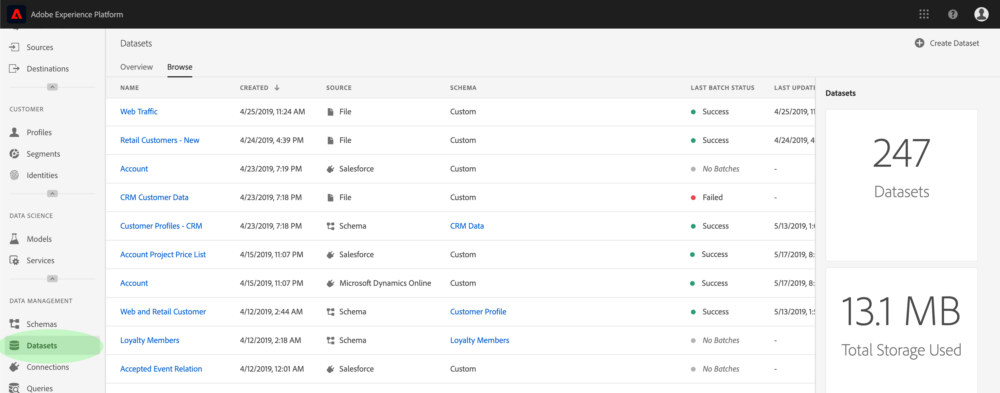
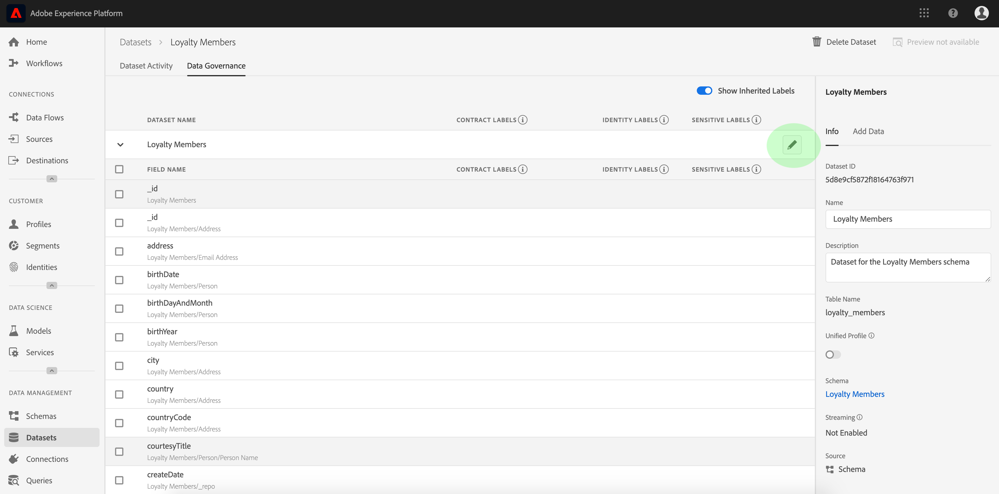

# Gebruiksaanwijzing voor labels voor gegevensgebruik

In deze gebruikershandleiding worden de stappen beschreven voor het werken met labels voor gegevensgebruik (ook wel DULE-labels genoemd) in de gebruikersinterface van het Experience Platform. Voordat u de gids gebruikt, raadpleegt u het overzicht [van](../home.md) gegevensbeheer voor een robuustere inleiding op het DULE-kader.

## De etiketten van het gegevensgebruik op het datasetniveau beheren

Om de etiketten van het gegevensgebruik op het datasetniveau te beheren, moet u een bestaande dataset selecteren of nieuwe creëren. Nadat u zich hebt aangemeld bij het Adobe Experience Platform, selecteert u **[!UICONTROL Datasets]** de linkernavigatie om de werkruimte _Datasets_ te openen. Deze pagina maakt een lijst van alle gecreeerde datasets die tot uw organisatie behoren, samen met nuttige details met betrekking tot elke dataset.

De volgende sectie verstrekt stappen voor het creëren van een nieuwe dataset om etiketten op toe te passen. Als u etiketten voor een bestaande dataset wenst uit te geven, selecteer de dataset van de lijst en ga vooruit naar het [toevoegen van de etiketten van het gegevensgebruik aan de dataset](#add-labels).

### Een nieuwe gegevensset maken

>[!NOTE] In dit voorbeeld, wordt een dataset gecreeerd gebruikend een vooraf gevormd schema van de Gegevens van de Ervaring van het Model (XDM). Voor meer informatie over schema&#39;s XDM, zie het [XDM Overzicht](../../xdm/home.md) van het Systeem en de [grondbeginselen van schemacompositie](../../xdm/schema/composition.md).

Als u een nieuwe gegevensset wilt maken, klikt u **[!UICONTROL Create Dataset]** in de rechterbovenhoek van de _[!UICONTROL Datasets]_werkruimte.

Het _[!UICONTROL Create Dataset]_scherm verschijnt. Klik hier **[!UICONTROL Create Dataset from Schema]**.

Het _[!UICONTROL Select Schema]_scherm verschijnt, dat van alle beschikbare schema&#39;s een lijst maakt die u voor het creëren van een dataset kunt gebruiken. Klik op het keuzerondje naast een schema om het te selecteren. In het_[!UICONTROL Schemas]_ gedeelte aan de rechterkant worden aanvullende gegevens over het geselecteerde schema weergegeven. Als u een schema hebt geselecteerd, klikt u op **[!UICONTROL Next]**.

Het scherm Gegevensset _configureren_ wordt weergegeven. Geef een **naam** (vereist) en een **beschrijving** (optioneel, maar aanbevolen) voor de nieuwe gegevensset op en klik vervolgens op **[!UICONTROL Finish]**.

De _[!UICONTROL Dataset Activity]_pagina wordt weergegeven met informatie over de nieuwe gegevensset. In dit voorbeeld krijgt de dataset de naam &quot;Loyalty-leden&quot;. In de bovenste navigatie ziet u daarom_ Datasets > Loyalty-leden _.

### Gegevensgebruikslabels toevoegen aan de gegevensset {#add-labels}

Na het creëren van een nieuwe dataset of het selecteren van een bestaande dataset van de lijst in de _[!UICONTROL Datasets]_werkruimte, klik **[!UICONTROL Data Governance]**om de_[!UICONTROL Data Governance]_ werkruimte te openen. De werkruimte staat u toe om de etiketten van het gegevensgebruik op het datasetniveau en gebiedsniveau te beheren.

Om de etiketten van het gegevensgebruik op het datasetniveau uit te geven, begin door het potloodpictogram naast de naam van de dataset te klikken.

Het _[!UICONTROL Edit Governance Labels]_dialoogvenster wordt geopend. Controleer in het dialoogvenster de vakken naast de labels die u op de gegevensset wilt toepassen. Herinner dat deze etiketten door alle gebieden binnen de dataset zullen worden geërft. De_[!UICONTROL Applied Labels]_ koptekst wordt bijgewerkt terwijl u elk selectievakje inschakelt. De labels die u hebt gekozen, worden weergegeven. Klik op de gewenste labels **[!UICONTROL Save Changes]**.

 

De _[!UICONTROL Data Governance]_werkruimte verschijnt opnieuw, tonend de etiketten die u op het datasetniveau hebt toegepast. U kunt ook zien dat de labels onderaan elk van de velden in de gegevensset worden overgeërfd.

U ziet dat een &quot;x&quot; wordt weergegeven naast de labels op datasetniveau, zodat u de labels kunt verwijderen. De overgeërfde labels naast elk veld hebben geen &#39;x&#39; en worden &#39;grijs weergegeven&#39; zonder mogelijkheid om te verwijderen of te bewerken. Dit komt doordat **overgeërfde velden alleen**-lezen zijn, wat betekent dat ze niet op veldniveau kunnen worden verwijderd.

De **[!UICONTROL Show Inherited Labels]** knevel is door gebrek, dat u toestaat om het even welke etiketten te zien die neer van de dataset aan zijn gebieden worden geërft. Als u de schakeloptie uitschakelt, worden alle overgeërfde labels in de gegevensset verborgen.

## De etiketten van het gegevensgebruik op het niveau van het datasetgebied beheren

Als u doorgaat met de workflow voor het [toevoegen en bewerken van labels voor gegevensgebruik op datasetniveau](#add-labels), kunt u ook labels op veldniveau binnen de _[!UICONTROL Data Governance]_werkruimte voor die dataset beheren.

Als u gegevensgebruikslabels op een afzonderlijk veld wilt toepassen, schakelt u het selectievakje naast de veldnaam in en klikt u op **[!UICONTROL Edit Governance Labels]**.

Het _[!UICONTROL Edit Governance Labels]_dialoogvenster verschijnt. In het dialoogvenster worden kopteksten weergegeven met de geselecteerde velden, toegepaste labels en overgeërfde labels. De overgeërfde labels (C2 en C5) worden grijs weergegeven in het dialoogvenster. Zij zijn read-only etiketten die van het datasetniveau worden geërft en zijn daarom slechts editable op het datasetniveau.

 

Selecteer labels op veldniveau door op het selectievakje naast elk label te klikken dat u wilt gebruiken. Terwijl u labels selecteert, wordt de _[!UICONTROL Applied Labels]_koptekst bijgewerkt en worden labels weergegeven die zijn toegepast op de velden die in de_[!UICONTROL Selected Fields]_ koptekst worden weergegeven. Als u klaar bent met het selecteren van labels op veldniveau, klikt u op **[!UICONTROL Save Changes]**.

 

De _[!UICONTROL Data Governance]_werkruimte verschijnt weer, waardoor nu de geselecteerde labels op veldniveau in de rij naast de veldnaam worden weergegeven. Het label op veldniveau heeft een &#39;x&#39; naast het label, zodat u het label kunt verwijderen.

U kunt deze stappen herhalen om door te gaan met het toevoegen en bewerken van labels op veldniveau voor extra velden, waaronder het selecteren van meerdere velden om labels op veldniveau tegelijk toe te passen.

Het is belangrijk om te herinneren dat de overerving zich van top-level slechts (dataset → gebieden) beweegt, betekenend dat de etiketten die op het gebiedsniveau worden toegepast niet aan andere gebieden of datasets worden verspreid.

## Volgende stappen

Nu u de etiketten van het gegevensgebruik op de dataset en gebiedsniveau hebt toegevoegd, kunt u beginnen om gegevens in het Platform van de Ervaring in te voeren. Voor meer informatie begint u met het lezen van de [gegevensinvoerdocumentatie](../../ingestion/home.md).

U kunt nu ook beleid voor gegevensgebruik definiëren op basis van de labels die u hebt toegepast. Zie het overzicht [van beleidsregels voor](../policies/overview.md)gegevensgebruik voor meer informatie.

## Aanvullende bronnen

De volgende video is bedoeld om uw begrip van het Beleid van Gegevens te steunen, en schetst hoe te om etiketten op een dataset en individuele gebieden toe te passen.

>[!VIDEO](https://video.tv.adobe.com/v/29709?quality=12&enable10seconds=on&speedcontrol=on)
