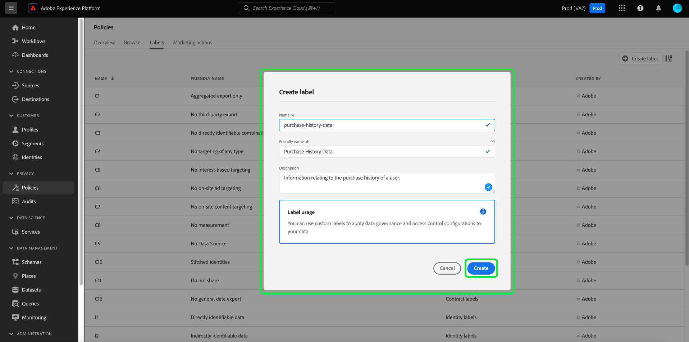

# Labels voor gegevensgebruik beheren in de gebruikersinterface {#user-guide}

>[!CONTEXTUALHELP]
>id="platform_privacyConsole_dataGovernance_description"
>title="Gegevensgebruik in platform beheren"
>abstract="<h2>Beschrijving</h2>
Met het gegevensbeheerkader in Experience Platform kunt u kenmerken en schema&#39;s labelen op basis van beperkingen voor gegevensgebruik en beleidsregels instellen die deze beperkingen voor specifieke marketingacties identificeren en naleven.
"

In deze gebruikershandleiding worden de stappen beschreven voor het werken met labels voor gegevensgebruik in de gebruikersinterface van [!DNL Experience Platform] .

## Labels beheren {#manage-labels}

Als u labels op uw gegevens wilt toepassen, hebt u de machtiging **[!UICONTROL Manage Usage Labels]** nodig voor gebruik in de standaardproductiesandbox met de naam &quot;prod&quot;. Als u een aangepast label wilt maken, moet u ook over beheerdersrechten voor het productprofiel beschikken. Elke organisatie heeft slechts één lijst van toepasselijke etiketten. U **kunt niet** etiketten schrappen. In plaats daarvan kunt u ze verwijderen uit de gegevenssets of velden waarop ze zijn toegepast.

Zie de gids op hoe te [ toestemmingen ](https://experienceleague.adobe.com/docs/platform-learn/getting-started-for-data-architects-and-data-engineers/configure-permissions.html) of het [ overzicht van de toegangscontrole ](../../access-control/home.md) voor meer informatie vormen over hoe te om een toestemming toe te wijzen. Neem contact op met de beheerder van uw organisatie als u geen toegang hebt tot de Admin Console voor uw organisatie.

## Labels op schemaniveau beheren

U kunt labels rechtstreeks toevoegen aan een schema of aan velden binnen dat schema. Om het even welke gebieden die op het schemaniveau worden toegepast zullen aan alle datasets verspreiden die op dat schema worden gebaseerd.

>[!NOTE]
>
>Als uw beleid van het gegevensgebruik werd gecreeerd alvorens u uw gebied etiketteerde, kunt u een dialoog ontmoeten van de schending van het beleid van het bestuur wanneer u etiketten op uw nieuw schema toepast. Dit dialoogvenster geeft aan dat bij toepassing van dit label een bestaand gebruiksbeleid wordt geschonden. Gebruik het diagram van de gegevenslijn om te begrijpen welke andere configuratieveranderingen moeten worden aangebracht alvorens u het etiket aan uw schemagebied kunt toevoegen.
>
>
>
>Zie de [ documentatie van de de schending van het beleid van het gegevensgebruik ](../enforcement/auto-enforcement.md#data-usage-violation) voor meer informatie over gedeeltelijke beleidsschendingen.

Als u labels voor gegevensgebruik op schemaniveau wilt beheren, moet u een bestaand schema selecteren of een nieuw schema maken. Nadat u zich hebt aangemeld bij Adobe Experience Platform, selecteert u **[!UICONTROL Schemas]** in de linkernavigatie om de werkruimte van **[!UICONTROL Schemas]** te openen. Deze pagina bevat een overzicht van alle gemaakte schema&#39;s die tot uw organisatie behoren, samen met nuttige details over elk schema.

In de volgende sectie vindt u stappen voor het maken van een nieuw schema waarop labels moeten worden toegepast. Als u wenst om etiketten voor een bestaand schema uit te geven, selecteer het schema van de lijst en overslaan vooruit aan [ toevoegend de etiketten van het gegevensgebruik aan het schema ](#add-labels).

### Een nieuw schema maken

Als u een nieuw schema wilt maken, selecteert u **[!UICONTROL Create schema]** in de rechterbovenhoek van de **[!UICONTROL Schemas]** -werkruimte. Zie de gids op [ hoe te om een schema tot stand te brengen gebruikend de Redacteur van het Schema ](../../xdm/tutorials/create-schema-ui.md#create) voor volledige instructies. Alternatief, kunt u [ een schema creëren gebruikend de Registratie API van het Schema ](../../xdm/tutorials/create-schema-api.md) indien vereist.

### Gegevensgebruikslabels toevoegen aan een schema {#add-labels-to-schema}

Nadat u een nieuw schema hebt gemaakt of een bestaand schema hebt geselecteerd in de lijst op het tabblad [!UICONTROL Browse] van de [!UICONTROL Schemas] -werkruimte, selecteert u een veld in uw schema in de Schema-editor. Selecteer **[!UICONTROL Apply Access and Data Governance Labels]** in de zijbalk van [!UICONTROL Field properties] .

Er wordt een dialoogvenster weergegeven waarin u labels voor gegevensgebruik op schemaniveau en veldniveau kunt toepassen en beheren. Zie de zelfstudie XDM voor volledige instructies op [ hoe te om de etiketten van het gegevensgebruik voor schema&#39;s toe te voegen of uit te geven XDM ](../../xdm/tutorials/labels.md#select-schema-field).

### Gegevensgebruikslabels toevoegen aan een specifieke gegevensset {#add-labels-to-dataset}

>[!CONTEXTUALHELP]
>id="platform_privacyConsole_dataGovernance_instructions"
>title="Instructies"
>abstract="<ol><li>Selecteer <a href="https://experienceleague.adobe.com/docs/experience-platform/data-governance/labels/user-guide.html"> Datasets </a> in de linkernavigatie, dan de dataset selecteren waarvan gegevens u wilt beperken.</li><li>Van de mening van de datasetdetails, selecteer het <b> beheer van Gegevens </b> tabel.</li><li>Selecteer de datasetgebieden die u wilt beperken, dan uitgezocht <b> geeft governance etiketten </b> uit om de gegevens te etiketteren die op gebruiksbeperkingen worden gebaseerd.</li><li>Na het etiketteren van uw gegevens, selecteer <a href="https://experienceleague.adobe.com/docs/experience-platform/data-governance/policies/overview.html"> Beleid </a> in de linkernavigatie, dan uitgezocht <b> leidt Beleid </b> tot.</li><li>Kies om het beleid van het Beheer van a <a href="https://experienceleague.adobe.com/docs/experience-platform/data-governance/policies/user-guide.html#create-governance-policy"> Gegevens </a> tot stand te brengen, dan de etiketten van het gegevensgebruik te selecteren dat het beleid op het beleid zal toepassen.</li><li>Selecteer de marketingactie(s) die het beleid zal weigeren voor gegevens die deze labels bevatten. Nadat het beleid is gemaakt, selecteert u het in de lijst en schakelt u het in met de schakeloptie in het rechterspoor.</li><li>Voor elk toegelaten beleid, verhindert het Platform om het even welke gegevens die de gespecificeerde etiketten bevatten voor de bepaalde marketing actie(s) worden gebruikt. Deze handhaving vindt automatisch plaats wanneer u probeert om geëtiketteerde gegevens aan een bestemming met bijbehorende marketing acties (gebruiksgevallen) te activeren.</li></ol>"

>[!IMPORTANT]
>
>Labels kunnen niet meer worden toegepast op velden op het niveau van de gegevensset. Deze workflow is vervangen door labels op schemaniveau. Alle labels die eerder op het niveau van gegevenssetobjecten zijn toegepast, worden tot 31 mei 2024 nog steeds ondersteund via de interface van het platform. Om ervoor te zorgen dat uw etiketten over alle schema&#39;s verenigbaar zijn, moeten om het even welke etiketten die eerder aan gebieden op het datasetniveau worden vastgemaakt door u over het komende jaar worden gemigreerd aan het schemaniveau. Zie de documentatie voor instructies op [ hoe te om eerder toegepaste etiketten van de dataset aan het schemaniveau ](../e2e.md#migrate-labels) te migreren.

Labels kunnen worden toegepast op de gehele gegevensset vanaf het tabblad **[!UICONTROL Data Governance]** van de **[!UICONTROL Datasets]** -werkruimte. De werkruimte staat u toe om de etiketten van het gegevensgebruik op het datasetniveau te beheren.

![ het [!UICONTROL Data Governance] lusje van de [!UICONTROL Datasets] werkruimte met benadrukte het Beleid van Gegevens.](../images/labels/dataset-governance.png)

Om de etiketten van het gegevensgebruik op het datasetniveau uit te geven, begin door het potloodpictogram te selecteren () in de rij van de naam van de gegevensset.

![ het [!UICONTROL Data Governance] lusje van de [!UICONTROL Datasets] werkruimte met uitgeeft benadrukt potloodpictogram.](../images/labels/dataset-level-edit.png)

Het dialoogvenster **[!UICONTROL Edit Governance Labels]** wordt geopend. Schakel in het dialoogvenster de selectievakjes in naast de labels die u op de gegevensset wilt toepassen. Herinner dat deze etiketten door alle gebieden binnen de dataset zullen worden geërft. De header van **[!UICONTROL Applied Labels]** wordt bijgewerkt terwijl u elk selectievakje inschakelt, met de labels die u hebt gekozen. Als u de gewenste labels hebt geselecteerd, selecteert u **[!UICONTROL Save Changes]** .

De werkruimte van **[!UICONTROL Data Governance]** verschijnt opnieuw, tonend de etiketten die u op het datasetniveau in de aanvankelijke rij van de lijst hebt toegepast. U kunt de etiketten ook zien, die door individuele kaarten worden vermeld, die neer aan elk van de gebieden binnen de dataset worden geërft.

![ het [!UICONTROL Data Governance] lusje van de [!UICONTROL Datasets] werkruimte met toegepaste die etiketten van het datasetniveau en geërfte die etiketten van het datasetgebied worden benadrukt.](../images/labels/applied-dataset-labels.png)

### Labels uit een gegevensset verwijderen {#remove-labels-from-a-dataset}

De etiketten die op het datasetniveau worden toegevoegd hebben &quot;x&quot;naast hun kaart. Dit staat u toe om de etiketten uit de volledige dataset te verwijderen. Overerfde labels naast elk veld hebben geen &quot;x&quot; en verschijnen &quot;grijs&quot;. Deze **geërfte etiketten zijn read-only**, betekenend kunnen zij niet op het gebiedsniveau worden verwijderd of worden uitgegeven.

<!-- ## View labels at the dataset field level {#view-labels-at-dataset-field-level} -->

<!-- To view labels inherited by the dataset from the schema level, select **[!UICONTROL Datasets]** to navigate to the datasets workspace and select the relevant dataset from the list. 

Next, select the **[!UICONTROL Data Governance]** tab to show the labels that have been applied to the dataset. You can also see that the labels are inherited down to each of the fields within the dataset.

The inherited labels beside each field do not have an "x" next to them and appear "greyed out" with no ability to remove or edit. This is because **inherited fields are read-only**, meaning they cannot be removed at the field level. -->

<!--Beleive can cut above here  -->

De schakeloptie **[!UICONTROL Show Inherited Labels]** is standaard ingeschakeld, zodat u labels kunt zien die zijn overgeërfd van het schema naar de bijbehorende velden. Als u de schakeloptie uitschakelt, worden alle overgeërfde labels in de gegevensset verborgen.

<!-- Labels applied to the dataset appear in read-only form within the **[!UICONTROL Data Governance]** view for that dataset. 

 -->

>[!NOTE]
>
>De etiketten die werden toegepast alvorens de eigenschap van de datasetetikettering werd afgekeurd kunnen uit de dataset worden verwijderd door de relevante dataset te vinden en het annuleringspictogram op het etiket te selecteren.
>
>Zie de documentatie voor instructies op [ hoe te om eerder toegepaste etiketten van de dataset aan het schemaniveau ](../e2e.md#migrate-labels) te migreren.

## Aangepaste labels beheren {#manage-custom-labels}

>[!CONTEXTUALHELP]
>id="platform_governance_createlabels"
>title="Labels maken"
>abstract="Met labels kunt u gegevenssets en velden categoriseren op basis van het gebruiksbeleid dat op die gegevens van toepassing is. Platform biedt een standaardset labels die u kunt gebruiken, maar u kunt ook aangepaste labels maken die specifiek zijn voor uw organisatie."

U kunt uw eigen labels voor aangepast gebruik maken in de **[!UICONTROL Policies]** -werkruimte in de [!DNL Experience Platform] -gebruikersinterface. Selecteer **[!UICONTROL Policies]** in de linkernavigatie en selecteer **[!UICONTROL Labels]** om een lijst met bestaande labels weer te geven. Selecteer **[!UICONTROL Create label]** van hier.

Het dialoogvenster **[!UICONTROL Create label]** wordt weergegeven. Geef vanaf hier de volgende informatie op voor het nieuwe label:

* **[!UICONTROL Name]**: Een unieke id voor het label. Deze waarde wordt gebruikt voor opzoekdoeleinden en moet daarom kort en beknopt zijn.
* **[!UICONTROL Friendly name]**: Een vriendelijke weergavenaam voor het label.
* **[!UICONTROL Description]**: (Optioneel) Een beschrijving van het label voor verdere context.

Selecteer **[!UICONTROL Create]** als u klaar bent.

Het dialoogvenster wordt gesloten en het nieuwe aangepaste label wordt weergegeven in de lijst onder het tabblad **[!UICONTROL Labels]** .

Het label kan nu onder **[!UICONTROL Custom Labels]** worden geselecteerd bij het bewerken van gebruikslabels voor gegevenssets en velden of bij het maken van beleidsregels voor gegevensgebruik.

## Volgende stappen

Nu u labels voor gegevensgebruik op gegevensset- en veldniveau hebt toegevoegd, kunt u gegevens invoeren in [!DNL Experience Platform] . Om meer te leren, begin door de [ documentatie van de gegevensopname ](../../ingestion/home.md) te lezen.

U kunt nu ook beleid voor gegevensgebruik definiëren op basis van de labels die u hebt toegepast. Voor meer informatie, zie het [ overzicht van het beleid van het gegevensgebruik ](../policies/overview.md).

<!-- The workflow of this video is now outdated. This can be enabled once the video has been updated

## Additional resources

The following video is intended to support your understanding of Data Governance, and outlines how to apply labels to a dataset and individual fields.

>[!VIDEO](https://video.tv.adobe.com/v/29709?quality=12&enable10seconds=on&speedcontrol=on) -->
