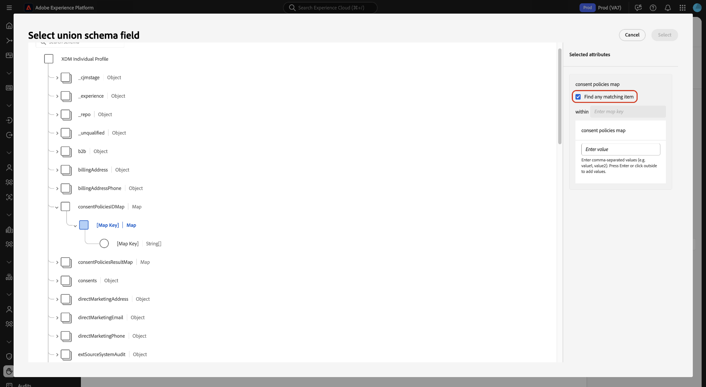

# Constante bouwverwijzing voor beleidsregels

Gebruik deze verwijzing op geavanceerde regellogica om nauwkeurige, wettelijk geldige regels in te stellen in de **[!UICONTROL Then]** clausule van de Bouwer van het Beleid van de Toestemming in Adobe Experience Platform.

![ de bouwerinterface van het toestemmingsbeleid die de [!UICONTROL Then] componentensectie benadrukt, waar de gebruikers regelvoorwaarden bepalen.](../images/policies/multiple-rules.png)

Leer hoe de beleidsregels op de structuur en de types van uw toestemmingsgegevens van toepassing zijn om klantentoestemmingsvoorkeur nauwkeurig af te dwingen.

Lees dit document om te leren hoe u op toestemming gebaseerde profielen kunt filteren door in containervelden in uw XDM-schema te navigeren en een primitief veld te selecteren. Gebruik vervolgens de juiste operator om de exacte waarde te definiëren die een profiel moet overeenkomen.

## Vereisten

Alvorens deze verwijzing te gebruiken, zorg ervoor dat uw opstelling van het toestemmingsbeleid volledig is en dat u de grondbeginselen van de gegevensarchitectuur van Adobe Experience Platform en het governancekader begrijpt.

Zorg ervoor dat u aan de volgende voorwaarden voldoet:

* **Volledige Opstelling van het Beleid**: U hebt tot stand gebracht of begonnen een toestemmingsbeleid in Adobe Experience Platform UI te creëren. Voor gedetailleerde stappen, zie de [ gebruikersgids van het het gebruiksbeleid van het gegevensgebruik ](user-guide.md#consent-policy).

* **Familiariteit met de Structuren van Gegevens**: Deze verwijzing vereist werkende kennis van de volgende kernconcepten:
   * **XDM en het Schema van de Unie**: Begrijp hoe de modelstructuren van de Gegevens van de Ervaring gegevensverhoudingen bepalen en hoe het unieschema verenigde klantenprofielen vertegenwoordigt. Zie het [ XDM overzicht van het Systeem ](../../xdm/home.md) om meer te leren.
   * **Kader van het Beheer van Gegevens**: Weet hoe Adobe Experience Platform beleid en governanceregels van het gegevensgebruik afdwingt. Zie het [ overzicht van het Beleid van Gegevens ](../home.md) voor details.
   * **de Verwerking van de Toestemming van de Klant**: Begrijp hoe de toestemmingsgegevens worden verzameld, opgeslagen, en binnen de werkschema&#39;s van de klantenervaring toegepast. Zie het [ overzicht van de toestemmingsverwerking ](../../landing/governance-privacy-security/consent/adobe/overview.md).

## Kernconcepten: primitieve en containervelden

Lees deze sectie leren hoe de regels van het toestemmingsbeleid verschillende gebiedstypes in schema XDM gebruiken. Als u het onderscheid tussen container- en primitieve velden begrijpt, kunt u het juiste veld en de juiste operator selecteren wanneer u beleidsvoorwaarden definieert.

### Ondersteunde veldtypen en regellogica

Het beleid van de toestemming steunt veelvoudige gebiedstypes, elk met specifieke exploitanten voor de voorwaarden van de bouwregel. De types van gebied worden gegroepeerd in twee categorieën: **containertypes** en **primitieve types**.

### Containertypen (schemanavigatie)

Containertypen organiseren toestemmingsgegevens, maar kunnen niet rechtstreeks in beleidsvoorwaarden worden gebruikt. Ze dienen als navigatiepaden om de primitieve velden met werkelijke waarden te bereiken.

| Containertype | Beschrijving |
|----------------|-------------|
| **Voorwerp** | Een container met een vast schema dat meerdere velden van verschillende typen bevat. |
| **Serie** | Een container die meerdere waarden van hetzelfde type bevat. |
| **Kaart** | Een container met dynamische sleutels die voorwerpen of andere gebiedstypes kan houden. |

>[!IMPORTANT]
>
>Containervelden kunnen niet rechtstreeks worden geselecteerd onder voorwaarden van het toestemmingsbeleid. U moet in containers navigeren om **primitieve gebieden** (zoals koord, aantal, of boolean) voor regelbouw te selecteren. Containeroperatoren worden alleen gebruikt voor schemanavigatie, niet voor het instellen van beleidsvoorwaarden.

### Primitieve typen (regelvoorwaarden)

Primitieve velden bevatten de werkelijke waarden van de toestemmingsgegevens (bijvoorbeeld `true` of `"weekly"` ) en zijn de enige veldtypen die kunnen worden gebruikt om de beleidsvoorwaarden te definiëren.

In de onderstaande tabel worden elk ondersteund primitief type en de beschikbare operatoren beschreven.

| Type primitief | Ondersteunde operatoren | Beschrijving |
|----------------|---------------------|-------------|
| **Koord** | `is equal to`, `is not equal to`, `exists`, `does not exist` | Op tekst gebaseerde toestemmingskenmerken. |
| **Aantal** | `is equal to`, `is not equal to`, `is greater than`, `is less than`, `exists`, `does not exist` | Kenmerken voor numerieke toestemming. |
| **Van Boole** | `is equal to`, `is not equal to` | Waarden voor werkelijke of onjuiste toestemming. |
| **Datum** | `is equal to`, `is not equal to`, `exists`, `does not exist` | Op datum gebaseerde toestemmingskenmerken. |


## Werken met complexe gegevensstructuren

Lees deze sectie om te leren hoe te om genestelde containers in uw toestemmingsschema te navigeren om primitieve gebieden te bereiken. Het introduceert gemeenschappelijke schemapatronen en verklaart hoe de diepere structuren meer korrelige toestemmingslogica toelaten.

### Geneste en complexe schemastructuren verwerken

Complexe toestemmingsschema&#39;s omvatten vaak genestelde containerstructuren die flexibel en scalable gegevensbeheer steunen. Omdat de beleidsregels slechts primitieve gebieden kunnen van verwijzingen voorzien, moet u door containerhiërarchieën navigeren om de gebieden te bereiken die in de voorwaarden van het toestemmingsbeleid kunnen worden gebruikt. Het dieper nesten maakt meer korrelige en specifieke regel het richten mogelijk.

Veelvoorkomende geneste containerpatronen zijn:

* **Kaart van kaart** - Dynamische sleutels die andere kaarten bevatten.
* **Kaart van voorwerp** - Dynamische sleutels die voorwerpen met vaste schema&#39;s bevatten.
* **Serie van kaart** - Arrays die kaarten met dynamische sleutels bevatten.
* **Serie van voorwerp** - Arrays die voorwerpen met vaste schema&#39;s bevatten.
* **Voorwerp met kaart of serieeigenschappen** - Voorwerpen die kaart of seriegebieden omvatten.

### Voorbeeld van veldstructuur

De volgende structuur fungeert als visuele referentie voor regelvoorbeelden in deze handleiding.

```
consent.marketing (Object)
├── email (Boolean)
├── sms (Boolean)
├── preferences (Map with dynamic keys)
│   ├── "email_preferences" (Object)
│   │   ├── frequency (String)
│   │   └── channels (Array of Strings)
│   ├── "sms_preferences" (Object)
│   │   ├── frequency (String)
│   │   └── opt_in_time (Date)
│   └── "push_preferences" (Object)
│       ├── frequency (String)
│       └── categories (Array of Strings)
└── lastUpdated (Date)
```

## Geavanceerde regels maken per veldtype

Lees deze sectie voor gedetailleerde begeleiding bij het creëren van regels van het toestemmingsbeleid die op gebiedstype worden gebaseerd. U zult leren hoe te om regellogica voor booleans, kaarten, voorwerpen, en series te vormen om nauwkeurige toestemmingsvoorwaarden te vangen.

### Componenten en stappen voor het opbouwen van regels

Het bouwen van efficiënte regels van het toestemmingsbeleid vereist begrip hoe te om uw schemastructuur te navigeren en de correcte exploitanten voor elk gebiedstype toe te passen. Elke regel volgt dezelfde basisbenadering: navigeer naar een primitief veld, selecteer de juiste operator en definieer de voorwaarde waaraan moet worden voldaan.

Ga als volgt te werk om een regel samen te stellen:

1. **selecteer een gebied** - navigeer door containergebieden om een primitief gebied te bereiken.
2. **kies een exploitant** - selecteer de exploitant die door het gebiedstype wordt gesteund.
   
3. **plaats een waarde** - bepaal de waarde of de voorwaarde om aan te passen.
4. **de kaartsleutels van de Gelijke** - verkies of om een specifieke sleutel te richten of over alle sleutels in een kaart aan te passen.
5. **voegt voorwaarden** toe - combineer veelvoudige regels gebruikend EN OF logica zoals nodig.

### Werken met Booleaanse velden (logica voor impliciete toestemming)

In Booleaanse velden worden waar of onwaar toestemmingswaarden opgeslagen en worden de meest voorkomende toestemmingskenmerken weergegeven. Met de operator `is not equal to` kunt u profielen opnemen die niet expliciet zijn uitgeschakeld, ter ondersteuning van impliciete toestemmingsscenario&#39;s.

**exploitanten Van Boole en resultaten**

| Operator | Waarde | Resultaat |
|----------|-------|--------|
| `is equal to` | `true` | Omvat profielen met expliciete toestemming (`true`). |
| `is equal to` | `false` | Omvat profielen met expliciete opt-out (`false`). |
| `is not equal to` | `true` | Omvat profielen zonder expliciete toestemming (`false` of het ontbreken). |
| `is not equal to` | `false` | Omvat profielen die niet uitdrukkelijk hebben gekozen uit (`true` of ontbreken). |

**Voorbeeld: Impliciete e-mailtoestemming**

```
Field: consent.marketing.email (boolean)
Operator: is not equal to
Value: false
Result: Includes profiles who have not explicitly opted out of email marketing (includes both true and missing/null values).
```

### Werken met kaartvelden (dynamische voorkeuren)

In kaartvelden worden sleutelwaardeparen met dynamische sleutels opgeslagen, in tegenstelling tot objecten met vaste schema&#39;s. Kaarten worden vaak gebruikt in voorkeurscentra waar nieuwe categorieën kunnen worden toegevoegd zonder schema-updates. U kunt specifieke toetsen als doel instellen of jokertekens gebruiken die overeenkomen met alle toetsen.

**Specifieke zeer belangrijke aanpassing**

Gebruik deze benadering om een specifieke voorkeurscategorie als doel in te stellen.

```
Field: consent.preferences["email_preferences"].frequency (string) - navigated to from the map container
Operator: is equal to
Value: "weekly"
Result: Includes profiles who set the email frequency to weekly (for the "email_preferences" key)
```

**Om het even welke sleutel aanpassing**

Gebruik de optie &quot;**[!UICONTROL find any matching item]**&quot; van het selectievakje om alle dynamische sleutels in een kaart aan te passen.



```
Field: consent.preferences.*.frequency (string)
Operator: is equal to
Value: "weekly"
Result: Includes profiles who set frequency to weekly in ANY preference category (for example, email_preferences, sms_preferences, or push_preferences)
```

### Werken met objectvelden (vaste navigatie)

Objectvelden fungeren als containers met vaste schema&#39;s. Ze worden alleen gebruikt voor navigatie en kunnen niet rechtstreeks in beleidsvoorwaarden worden genoemd.

**Voorbeeld van de Navigatie**

```
consent.marketing (object) → consent.marketing.email (boolean)
```

**het gebruiksgeval van het Voorbeeld:**

```
Field: consent.marketing.email (Boolean) - navigated to from the object
Operator: is equal to
Value: true
Result: Include profiles who have explicitly consented to marketing emails
```


### Werken met arrayvelden (meerdere waarden)

Arrayvelden bevatten meerdere waarden van hetzelfde type en vereisen verschillende verwerking, afhankelijk van het feit of er primitieven of objecten worden opgeslagen. Navigatie- en operatoropties variëren per type array.

**Serie van primitief voorbeeld**

Gebruik de operator `contains` om profielen te identificeren op basis van specifieke waarden binnen een array.

```
Field: consent.communication_channels (array of strings)
Operator: contains
Value: "email"
Result: Include profiles who have consented to email communication
```

**Serie van objecten voorbeeld**

Navigeer in de array om primitieve velden binnen geneste objecten te openen.

```
Field: consent.preferences["email_preferences"].categories[].type - navigated to from the array
Operator: is equal to
Value: "promotional"
Result: Include profiles where any email category is "promotional"
```

## Regels combineren met complexe logica

Deze sectie verklaart hoe te om veelvoudige regelvoorwaarden te combineren gebruikend EN of logica. U leert hoe logische operatoren samenwerken om een geavanceerd, multi-condition toestemmingsbeleid te definiëren.

### Meerdere voorwaarden combineren (AND of OR logica)

U kunt veelvoudige regelvoorwaarden combineren gebruikend EN of logica OF om verfijnd toestemmingsbeleid te bouwen dat specifieke profielsegmenten richt.\
**EN logica** vereist alle voorwaarden om waar te zijn, die lagere publieksgelijken veroorzaken.\
**OF logica** staat om het even welke voorwaarde toe om waar te zijn, die het publieksbereik uitbreiden.

In de interface van het toestemmingsbeleid, gebruik de logische selecteur die tussen regelvoorwaarden verschijnt om tussen EN en OF logica te schakelen.

### Algemeen complex regelvoorbeeld

In het volgende voorbeeld wordt de status van de basistoestemming gecombineerd met de voorkeurfrequentie om een bepaald segment te maken.

```
Field: consent.marketing.email
Operator: is equal to true
AND
Field: consent.preferences.frequency
Operator: is not equal to "daily"
Result: Include profiles who consent to email marketing but not to a daily frequency
```

### Geavanceerde logica voor arrays van objecten

Wanneer u voorwaarden combineert binnen een array van objecten, hangt het gedrag af van het feit of u AND of OR tussen de voorwaarden gebruikt.

**Voorbeeld: Serie van voorwerpen met EN voorwaarden**

Gebruik EN logica wanneer alle voorwaarden op het *zelfde* serieelement moeten van toepassing zijn.

```
Field: consent.preferences["email_preferences"].categories[].enabled (boolean)
Operator: is equal to
Value: true
AND
Field: consent.preferences["email_preferences"].categories[].type (string)
Operator: is equal to
Value: "promotional"
Result: Includes profiles where the same category entry has both enabled=true and type="promotional".
Note: AND conditions apply to the same array entry. Using OR logic would include profiles if any array entry matches any of the conditions.
```

>[!TIP]
>
>**Beste praktijken voor EN logica**
>
>Houd rekening met deze belangrijke gedragingen wanneer u op AND gebaseerde arrayvoorwaarden samenstelt:
>
>* Gebruik EN logica wanneer alle voorwaarden op **zelfde serieelement** moeten van toepassing zijn.
>* Vergeet niet dat AND een restrictief doel creëert (er komen minder profielen overeen).
>* Verwacht niet AND logica om over veelvoudige serieingangen aan te passen; het is binnen elke ingang van toepassing.
>* Gebruik AND niet als u flexibele overeenkomsten tussen verschillende items nodig hebt.

>[!IMPORTANT]
>
>Met AND logic moet elk arrayitem aan alle opgegeven voorwaarden tegelijk voldoen. Dit gedrag is ideaal wanneer u gecombineerde kenmerken moet aanpassen, zoals categorieën die zowel ingeschakeld als promotioneel zijn.

>[!NOTE]
>
>EN de logica is op de zelfde serieingang **slechts voor series van voorwerpen van toepassing.**\
>Voor series van primitieven, EN logica wordt geëvalueerd op het gebiedsniveau over de volledige serie.

**Voorbeeld: Serie van voorwerpen met OF voorwaarden**

Gebruik OR logica om inclusieve publieksovereenkomsten tot stand te brengen door om het even welke voorwaarde toe te staan om waar over serieingangen te zijn.

```
Field: consent.preferences["email_preferences"].categories[].enabled (boolean)
Operator: is equal to
Value: true
OR
Field: consent.preferences["email_preferences"].categories[].type (string)
Operator: is equal to
Value: "newsletter"
Result: Includes profiles where any category entry has enabled=true or any entry has type="newsletter".
Note: OR logic allows matching across different array entries. One entry can meet the first condition while another meets the second.
```

### Volgende stappen

Na het bouwen van en het verfijnen van uw regels van het toestemmingsbeleid, gebruik de volgende middelen om configuratie te voltooien, beleidshandhaving te bevestigen, en onderliggende gegevensmodellen te herzien.

* **Werkschema van de Aanmaak van het Beleid**: Voer de regels uit u in de beleidsaannemer UI met de [ Verkende Gids van het Beleid UI van de Toestemming ](user-guide.md#consent-policy.md) bepaalde
* **de Evaluatie en de Handhaving van het Beleid van de Toestemming**: Verifieer hoe het toegelaten beleid publieksactivering en profielgegevensgebruik beïnvloedt. Zie de [ Automatische gids van de beleidshandhaving ](../enforcement/auto-enforcement.md) voor details
* **XDM de Types van Gegevens van de Toestemming**: Verwijs de specifieke schemastructuren en gebiedsdefinities voor toestemmingsattributen die in uw beleidsregels worden gebruikt. Zie de [ XDM toestemmingen en van de Voorkeur gegevenstype ](../../xdm/data-types/consents.md) gids.
