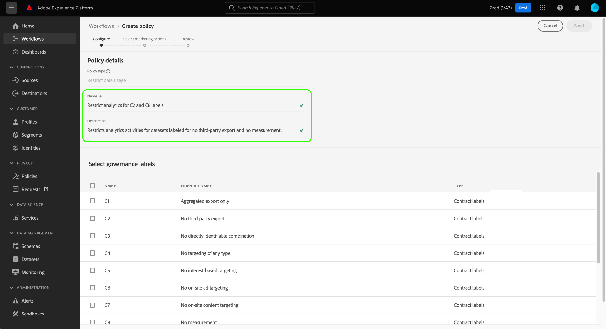
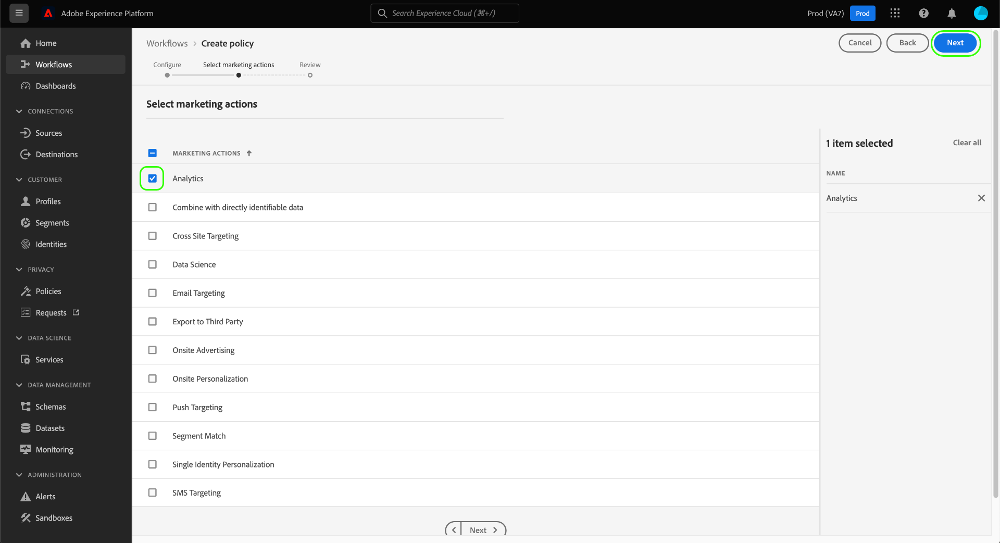

# Gebruikershandleiding voor gegevensgebruiksbeleid

Adobe Experience Platform Data Governance biedt een gebruikersinterface waarmee u beleid voor gegevensgebruik kunt maken en beheren. Dit document biedt een overzicht van de acties die u kunt uitvoeren in de werkruimte _Beleid_ in de gebruikersinterface van het Experience Platform.

## Vereisten

Deze gids vereist een werkend inzicht in de volgende concepten van het Platform van de Ervaring:

- [Gegevensbeheer](../home.md)
- [Beleid voor gegevensgebruik](./overview.md)

## Beleid voor gegevensgebruik weergeven

Klik in de gebruikersinterface van het ervaringsplatform op **[!UICONTROL Beleid]** om de werkruimte *[!UICONTROL Beleid]* te openen. Op het tabblad **[!UICONTROL Bladeren]** ziet u een lijst met beschikbare beleidsregels, inclusief de bijbehorende labels, marketingacties en status.

Klik op een vermeld beleid om de beschrijving en het type ervan weer te geven. Als een douanebeleid wordt geselecteerd, worden de extra controles getoond om uit te geven, te schrappen, of [toe te laten/onbruikbaar te maken het beleid](#enable).

## Een aangepast beleid voor gegevensgebruik maken

Als u een nieuw beleid voor het gebruik van aangepaste gegevens wilt maken, klikt u op **[!UICONTROL Beleid]** maken in de rechterbovenhoek van de werkruimte *Beleid* .

De *[!UICONTROL workflow Beleid]* maken wordt weergegeven. Begin door een naam en een beschrijving voor het nieuwe beleid te verstrekken.

Selecteer vervolgens de labels voor gegevensgebruik waarop het beleid wordt gebaseerd. Als u meerdere labels selecteert, kunt u kiezen of de gegevens alle labels moeten bevatten of slechts één label, zodat het beleid van toepassing is. Klik op **[!UICONTROL Volgende]** als u klaar bent.

De stap *[!UICONTROL Marketingacties]* selecteren wordt weergegeven. Kies de gewenste marketingacties in de lijst en klik op **[!UICONTROL Volgende]** om door te gaan.

>[!NOTE] Wanneer het selecteren van veelvoudige marketing acties, interpreteert het beleid hen als &quot;OF&quot;regel. Met andere woorden, het beleid is van toepassing als _om het even welke_ geselecteerde marketing acties worden uitgevoerd.

De stap *[!UICONTROL Revisie]* wordt weergegeven, zodat u de details van het nieuwe beleid kunt bekijken voordat u het maakt. Als u tevreden bent, klikt u op **[!UICONTROL Voltooien]** om het beleid te maken.

Het tabblad *[!UICONTROL Bladeren]* wordt opnieuw weergegeven. Hierin wordt nu het nieuwe beleid in de status &quot;Concept&quot; weergegeven. Zie de volgende sectie om het beleid in te schakelen.

## Een beleid voor gegevensgebruik in- of uitschakelen {#enable}

U kunt beleid van het douanegegevensgebruik op het *[!UICONTROL Browse]* lusje in of onbruikbaar maken in de werkruimte van *[!UICONTROL Beleid]* . Selecteer een aangepast beleid in de lijst om de details aan de rechterkant weer te geven. Selecteer onder *[!UICONTROL Status]* de schakelknop om het beleid in of uit te schakelen.

## Volgende stappen

In dit document wordt een overzicht gegeven van de manier waarop beleidsregels voor gegevensgebruik in de gebruikersinterface van het Experience Platform kunnen worden beheerd. Voor stappen op hoe te om beleid te beheren gebruikend DULE Beleid API, zie de [ontwikkelaarsgids](../api/getting-started.md). Voor informatie over hoe te om het beleid van het gegevensgebruik af te dwingen, zie het [beleidshandhavingsoverzicht](../enforcement/overview.md).

In de volgende video wordt een demonstratie gegeven van hoe u kunt werken met gebruiksbeleid in de gebruikersinterface van het Experience Platform:

>[!VIDEO](https://video.tv.adobe.com/v/32977?quality=12&learn=on)