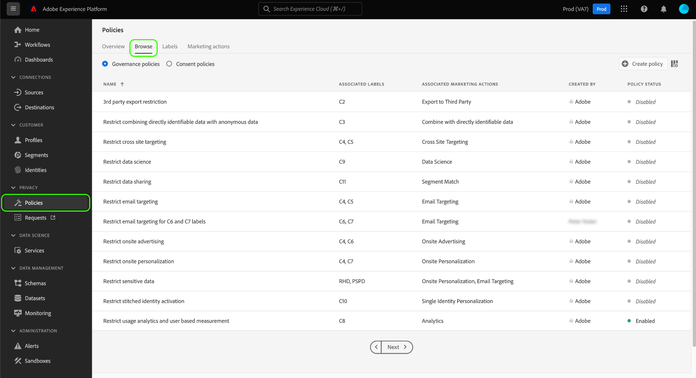

# Beleid voor gegevensgebruik beheren in de gebruikersinterface

Adobe Experience Platform [!DNL Data Governance] biedt een gebruikersinterface waarmee u beleidsregels voor gegevensgebruik kunt maken en beheren. Dit document biedt een overzicht van de acties die u kunt uitvoeren in de **Werkruimte Beleid** in de [!DNL Experience Platform] gebruikersinterface.

>[!IMPORTANT]
>
>Alle beleidsregels voor gegevensgebruik (inclusief kernbeleid van Adobe) zijn standaard uitgeschakeld. Om een individueel beleid voor handhaving te overwegen, moet u dat beleid manueel toelaten. Zie de sectie op [toelatend beleid](#enable) voor stappen op hoe te om dit in UI te doen.

## Vereisten

Deze gids vereist een werkend inzicht in de volgende [!DNL Experience Platform] concepten:

- [[!DNL Data Governance]](../home.md)
- [Beleid voor gegevensgebruik](./overview.md)

## Bestaand beleid {#view-policies} weergeven

In [!DNL Experience Platform] UI, selecteer **[!UICONTROL Beleid]** om **[!UICONTROL Beleid]** werkruimte te openen. Op **[!UICONTROL Browse]** lusje, kunt u een lijst van beschikbaar beleid, met inbegrip van hun bijbehorende etiketten, marketing acties, en status zien.

Selecteer een vermeld beleid om zijn beschrijving en type te bekijken. Als een douanebeleid wordt geselecteerd, worden de extra controles getoond om uit te geven, te schrappen, of [laat/maak het beleid ](#enable) toe onbruikbaar.

## Een aangepast beleid maken {#create-policy}

Als u een nieuw beleid voor het gebruik van aangepaste gegevens wilt maken, selecteert u **[!UICONTROL Beleid maken]** in de rechterbovenhoek van het tabblad **[!UICONTROL Bladeren]** in de werkruimte **[!UICONTROL Beleid]**.

De **[!UICONTROL Create policy]**-workflow wordt weergegeven. Begin door een naam en een beschrijving voor het nieuwe beleid te verstrekken.

Selecteer vervolgens de labels voor gegevensgebruik waarop het beleid wordt gebaseerd. Als u meerdere labels selecteert, kunt u kiezen of de gegevens alle labels moeten bevatten of slechts één label, zodat het beleid van toepassing is. Selecteer **[!UICONTROL Volgende]** als u klaar bent.

De stap **[!UICONTROL marketingacties selecteren]** wordt weergegeven. Kies de aangewezen marketing acties van de verstrekte lijst, dan uitgezocht **[!UICONTROL Volgende]** om verder te gaan.

>[!NOTE]
>
>Wanneer het selecteren van veelvoudige marketing acties, interpreteert het beleid hen als &quot;OF&quot;regel. Met andere woorden, het beleid is van toepassing als **any** van de geselecteerde marketingacties wordt uitgevoerd.

De stap **[!UICONTROL Review]** verschijnt, die u toestaat om de details van het nieuwe beleid te herzien alvorens het tot stand te brengen. Als u tevreden bent, selecteert u **[!UICONTROL Voltooien]** om het beleid te maken.

Het **[!UICONTROL Browse]** lusje verschijnt opnieuw, dat nu van het nieuw gecreëerde beleid in &quot;Ontwerp&quot;status een lijst maakt. Zie de volgende sectie om het beleid in te schakelen.

## Een beleid {#enable} in- of uitschakelen

Alle beleidsregels voor gegevensgebruik (inclusief kernbeleid van Adobe) zijn standaard uitgeschakeld. Om een individueel beleid voor handhaving te overwegen, moet u dat beleid manueel toelaten door API of UI.

U kunt beleid van **[!UICONTROL Browse]** lusje in of onbruikbaar maken **[!UICONTROL Beleid]** werkruimte. Selecteer een aangepast beleid in de lijst om de details aan de rechterkant weer te geven. Selecteer onder **[!UICONTROL Status]** de schakelknop om het beleid in of uit te schakelen.

## Marketingacties {#view-marketing-actions} weergeven

Selecteer in de werkruimte **[!UICONTROL Beleid]** het tabblad **[!UICONTROL Handelingen voor marketing]** om een lijst weer te geven met beschikbare marketingacties die door Adobe en uw eigen organisatie zijn gedefinieerd.

## Een marketingactie maken {#create-marketing-action}

Als u een nieuwe aangepaste marketingactie wilt maken, selecteert u **[!UICONTROL Marketing-actie maken]** in de rechterbovenhoek van het tabblad **[!UICONTROL Handelingen voor marketing]** in de werkruimte **[!UICONTROL Beleid]**.

Het dialoogvenster **[!UICONTROL Marketing maken]** wordt weergegeven. Voer een naam en beschrijving in voor de marketingactie en selecteer **[!UICONTROL Maken]**.

De nieuwe actie wordt weergegeven op het tabblad **[!UICONTROL Handelingen voor marketing]**. U kunt de marketingactie nu gebruiken wanneer u nieuwe beleidsregels voor gegevensgebruik maakt](#create-policy).[

## Een marketingactie {#edit-delete-marketing-action} bewerken of verwijderen

>[!NOTE]
>
>Alleen aangepaste marketingacties die door uw organisatie zijn gedefinieerd, kunnen worden bewerkt. Marketingacties die door Adobe worden gedefinieerd, kunnen niet worden gewijzigd of verwijderd.

Selecteer in de werkruimte **[!UICONTROL Beleid]** het tabblad **[!UICONTROL Handelingen voor marketing]** om een lijst weer te geven met beschikbare marketingacties die door Adobe en uw eigen organisatie zijn gedefinieerd. Selecteer een aangepaste marketingactie in de lijst en gebruik vervolgens de beschikbare velden in de rechtersectie om de details van de marketingactie te bewerken.

Als de marketingactie niet wordt gebruikt door een bestaand gebruiksbeleid, kunt u deze verwijderen door **[!UICONTROL Marketing action]** verwijderen te selecteren.

>[!NOTE]
>
>Als u probeert een marketingactie te verwijderen die door een bestaand beleid wordt gebruikt, wordt een foutbericht weergegeven dat aangeeft dat de verwijderpoging is mislukt.

## Volgende stappen

In dit document wordt een overzicht gegeven van de manier waarop beleidsregels voor gegevensgebruik in de gebruikersinterface van [!DNL Experience Platform] kunnen worden beheerd. Voor stappen op hoe te om beleid te beheren gebruikend [!DNL Policy Service API], zie [ontwikkelaarsgids](../api/getting-started.md). Voor informatie over hoe te om het beleid van het gegevensgebruik af te dwingen, zie [beleidshandhaving overzicht](../enforcement/overview.md).

De volgende video biedt een demonstratie van hoe u met gebruiksbeleid kunt werken in de gebruikersinterface van [!DNL Experience Platform]:

>[!VIDEO](https://video.tv.adobe.com/v/32977?quality=12&learn=on)