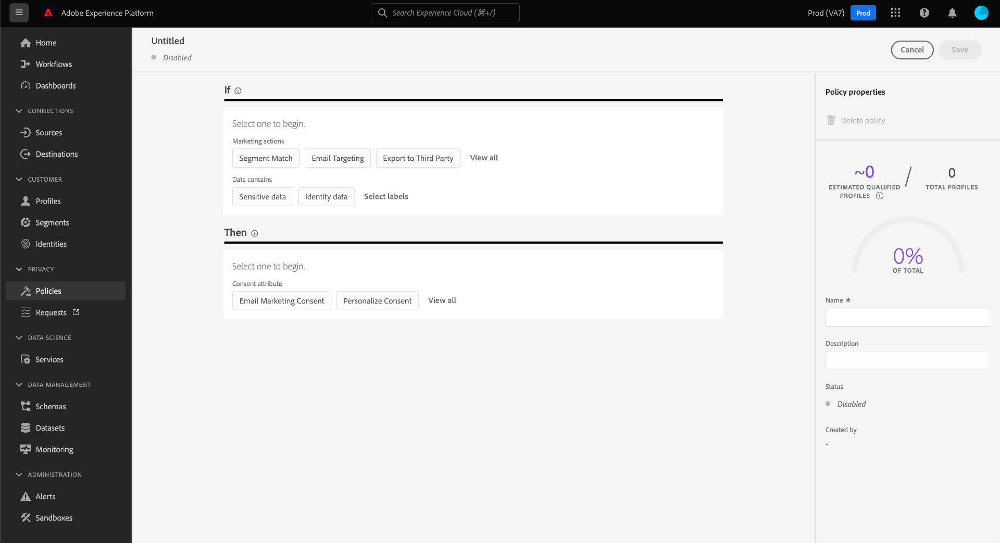

# Beleid voor gegevensgebruik beheren in de gebruikersinterface {#user-guide}

>[!CONTEXTUALHELP]
>id="platform_privacyConsole_dataUsagePolicies_description"
>title="Integreer en handhaaf klanteninstemming in uw profielgegevens"
>abstract="<h2>Beschrijving</h2>
Met Platform kunt u de gegevens die u van uw klanten hebt verzameld, integreren in hun respectievelijke profielen. U kunt dan vormtoestemmingsbeleid bepalen of deze gegevens in segmenten kunnen worden omvat die aan bepaalde bestemmingen worden geactiveerd.
"

In dit document wordt beschreven hoe u het **[!UICONTROL Policies]** in de gebruikersinterface van Adobe Experience Platform om beleid voor gegevensgebruik te maken en te beheren.

>[!NOTE]
>
>Voor informatie over hoe te om toegangsbeheerbeleid in UI te beheren, verwijs naar [Op attributen-gebaseerde gids van het toegangsbeheer UI](../../access-control/abac/ui/policies.md) in plaats daarvan.

>[!IMPORTANT]
>
>Alle beleidsregels voor gegevensgebruik (inclusief kernbeleid van Adobe) zijn standaard uitgeschakeld. Om een individueel beleid voor handhaving te overwegen, moet u dat beleid manueel toelaten. Zie de sectie over [beleid inschakelen](#enable) voor stappen over hoe te om dit in UI te doen.

## Vereisten

Deze handleiding vereist een goed begrip van het volgende: [!DNL Experience Platform] concepten:

* [Gegevensbeheer](../home.md)
* [Beleid voor gegevensgebruik](./overview.md)

## Bestaande beleidsvormen weergeven {#view-policies}

In de [!DNL Experience Platform] UI, selecteer **[!UICONTROL Policies]** om de **[!UICONTROL Policies]** werkruimte. In de **[!UICONTROL Browse]** kunt u een lijst met beschikbare beleidsregels weergeven, inclusief de bijbehorende labels, marketingacties en status.

Als u toegang hebt tot beleid voor toestemming, selecteert u de optie **[!UICONTROL Consent policies]** schakelen om ze weer te geven in het dialoogvenster [!UICONTROL Browse] tab.

Selecteer een vermeld beleid om zijn beschrijving en type te bekijken. Als een aangepast beleid is geselecteerd, worden aanvullende besturingselementen weergegeven om te bewerken, te verwijderen of [het beleid in-/uitschakelen](#enable).

## Een aangepast beleid maken {#create-policy}

Selecteer **[!UICONTROL Create policy]** in de rechterbovenhoek van het dialoogvenster **[!UICONTROL Browse]** in de **[!UICONTROL Policies]** werkruimte.

Afhankelijk van of u deel uitmaakt van de bètaversie voor het toestemmingsbeleid, komt een van de volgende situaties voor:

* Als u geen deel uitmaakt van de bètaversie, wordt u onmiddellijk naar de werkstroom gebracht voor [invoering van een beleid voor gegevensbeheer](#create-governance-policy).
* Als u deel uitmaakt van de bètaversie, biedt een dialoogvenster een extra optie voor [een beleid voor instemming ontwikkelen](#consent-policy).
   

### Een beleid voor gegevensbeheer maken {#create-governance-policy}

De **[!UICONTROL Create policy]** wordt weergegeven. Begin door een naam en een beschrijving voor het nieuwe beleid te verstrekken.

Selecteer vervolgens de labels voor gegevensgebruik waarop het beleid wordt gebaseerd. Als u meerdere labels selecteert, kunt u kiezen of de gegevens alle labels moeten bevatten of slechts één label, zodat het beleid van toepassing is. Selecteren **[!UICONTROL Next]** wanneer gereed.

De **[!UICONTROL Select marketing actions]** wordt weergegeven. Kies de gewenste marketingacties in de lijst en selecteer **[!UICONTROL Next]** om door te gaan.

>[!NOTE]
>
>Wanneer het selecteren van veelvoudige marketing acties, interpreteert het beleid hen als &quot;OF&quot;regel. Met andere woorden, het beleid is van toepassing als **alle** van de geselecteerde marketingacties worden uitgevoerd.

De **[!UICONTROL Review]** wordt weergegeven, zodat u de details van het nieuwe beleid kunt bekijken voordat u het maakt. Als u tevreden bent, selecteert u **[!UICONTROL Finish]** om het beleid te creëren.

De **[!UICONTROL Browse]** wordt opnieuw weergegeven. Dit betekent dat het nieuwe beleid de status &quot;Concept&quot; krijgt. Zie de volgende sectie om het beleid in te schakelen.

### Een toestemmingsbeleid maken {#consent-policy}

>[!CONTEXTUALHELP]
>id="platform_privacyConsole_dataUsagePolicies_instructions"
>title="Instructies"
>abstract="<ul><li>Zorg ervoor dat u voorkeursgegevens in uw verenigingsschema&#39;s via de OneTrust bronschakelaar of het standaard XDM schema voor toestemming opneemt.</li><li>Selecteren <a href="https://experienceleague.adobe.com/docs/experience-platform/data-governance/policies/overview.html">Beleid</a> in de linkernavigatie selecteert u vervolgens <a href="https://experienceleague.adobe.com/docs/experience-platform/data-governance/policies/user-guide.html#create-governance-policy">Beleid maken</a>.</li><li>Onder de <b>Indien</b> , beschrijft de voorwaarden of acties die de beleidscontrole zullen teweegbrengen.</li><li>Onder de <b>Vervolgens</b> in, voert u de toestemmingskenmerken in die aanwezig moeten zijn om een profiel te kunnen opnemen in de actie die het beleid heeft geactiveerd.</li><li>Selecteren <b>Opslaan</b> om het beleid te creëren. Selecteer de optie <b>Status</b> schakelen in de rechterspoorstaaf.</li><li>Het Experience Platform dwingt automatisch uw toegelaten toestemmingsbeleid af wanneer u segmenten aan bestemmingen activeert, en verstrekt details over hoe elk beleid uw publieksgrootte beïnvloedt.</li><li>Raadpleeg de handleiding voor meer informatie over deze functie <a href="https://experienceleague.adobe.com/docs/experience-platform/data-governance/policies/user-guide.html#consent-policy">beleid voor het maken van toestemming</a> op Experience League.</li></ul>"

>[!IMPORTANT]
>
>Beleid voor toestemming is alleen beschikbaar voor organisaties die deze hebben aangeschaft **Adobe Healthcare Shield** of **Adobe Privacy- en beveiligingsschild**.

Als u verkoos om een toestemmingsbeleid tot stand te brengen, verschijnt een nieuw scherm dat u toestaat om het nieuwe beleid te vormen.

Als u het beleid voor toestemming wilt gebruiken, moet u toestemmingskenmerken in uw profielgegevens hebben. Zie de handleiding op [verwerking van toestemming in Experience Platform](../../landing/governance-privacy-security/consent/adobe/overview.md) voor gedetailleerde stappen op hoe te om de vereiste attributen in uw unieschema te omvatten.

Het beleid van de goedkeuring bestaat uit twee logische componenten:

* **[!UICONTROL If]**: De voorwaarde die de beleidscontrole zal teweegbrengen. Dit kan gebaseerd zijn op een bepaalde marketingactie die wordt uitgevoerd, de aanwezigheid van bepaalde labels voor gegevensgebruik of een combinatie van beide.
* **[!UICONTROL Then]**: De toestemmingskenmerken die aanwezig moeten zijn opdat een profiel wordt opgenomen in de actie die het beleid heeft geïnitieerd.

#### Voorwaarden configureren {#consent-conditions}

>[!CONTEXTUALHELP]
>id="platform_governance_policies_consentif"
>title="Indien voorwaarde"
>abstract="Begin door de voorwaarden te bepalen die de beleidscontrole zullen teweegbrengen. Voorwaarden kunnen bestaan uit bepaalde marketingacties, bepaalde etiketten voor gegevensbeheer of een combinatie van beide."

Onder de **[!UICONTROL If]** selecteert u de marketingacties en/of labels voor gegevensgebruik die dit beleid moeten activeren. Selecteren **[!UICONTROL View all]** en **[!UICONTROL Select labels]** de volledige lijsten van de beschikbare marketingacties en etiketten te bekijken.

Nadat u ten minste één voorwaarde hebt toegevoegd, kunt u **[!UICONTROL Add condition]** om verdere voorwaarden te blijven toevoegen zoals nodig, verkies het aangewezen voorwaardetype van dropdown.

Als u meer dan één voorwaarde selecteert, kunt u het pictogram gebruiken dat tussen hen verschijnt om de voorwaardelijke verhouding tussen &quot;EN&quot;en &quot;OF&quot;te schakelen.

#### Goedkeuringskenmerken selecteren {#consent-attributes}

>[!CONTEXTUALHELP]
>id="platform_governance_policies_consentthen"
>title="Dan voorwaarde"
>abstract="Zodra uw &quot;als&quot;voorwaarde is bepaald, gebruik de sectie &quot;toen&quot;om minstens één toestemmingsattribuut van het unieschema te selecteren. Dit is het kenmerk dat aanwezig moet zijn om profielen te kunnen opnemen in de actie waarop dit beleid betrekking heeft."

Onder de **[!UICONTROL Then]** selecteert u ten minste één toestemmingskenmerk in het schema union. Dit is het kenmerk dat aanwezig moet zijn om profielen te kunnen opnemen in de actie waarop dit beleid betrekking heeft. U kunt een van de beschikbare opties in de lijst kiezen of **[!UICONTROL View all]** om de attributen van het unieschema direct te kiezen.

Wanneer het selecteren van de toestemmingsattributen, kies de waarden voor de attributen die u dit beleid wilt controleren.

Nadat u minstens één toestemmingsattribuut hebt geselecteerd, **[!UICONTROL Policy properties]** worden bijgewerkt om het geschatte aantal profielen weer te geven dat in het kader van dit beleid is toegestaan, inclusief het percentage van de totale profielopslag. Deze schatting wordt automatisch bijgewerkt wanneer u de beleidsconfiguratie aanpast.

Als u meer toestemmingskenmerken aan het beleid wilt toevoegen, selecteert u **[!UICONTROL Add result]**.

U kunt voorwaarden en toestemmingseigenschappen aan het beleid blijven toevoegen en aanpassen zoals nodig. Als u tevreden bent met de configuratie, geeft u een naam en een optionele beschrijving voor het beleid op voordat u het beleid selecteert **[!UICONTROL Save]**.

Het toestemmingsbeleid wordt nu tot stand gebracht en zijn status wordt geplaatst aan [!UICONTROL Disabled] standaard. Als u het beleid meteen wilt inschakelen, selecteert u de optie **[!UICONTROL Status]** schakelen in de rechterspoorstaaf.

#### Beleidshandhaving verifiëren

Nadat u een toestemmingsbeleid hebt gecreeerd en toegelaten, kunt u voorproef hoe het uw toegelaten publiek wanneer het activeren van segmenten aan bestemmingen beïnvloedt. Zie de sectie over [goedkeuring beleidsevaluatie](../enforcement/auto-enforcement.md#consent-policy-evaluation) voor meer informatie .

## Een beleid in- of uitschakelen {#enable}

Alle beleidsregels voor gegevensgebruik (inclusief kernbeleid van Adobe) zijn standaard uitgeschakeld. Voor een individueel beleid dat voor handhaving moet worden overwogen, moet u dat beleid manueel toelaten door API of UI.

U kunt het beleid in- of uitschakelen in het dialoogvenster **[!UICONTROL Browse]** in de **[!UICONTROL Policies]** werkruimte. Selecteer een aangepast beleid in de lijst om de details aan de rechterkant weer te geven. Onder **[!UICONTROL Status]**, selecteert u de schakelknop om het beleid in of uit te schakelen.

## Marketingacties weergeven {#view-marketing-actions}

In de **[!UICONTROL Policies]** werkruimte, selecteert u de **[!UICONTROL Marketing actions]** tabblad om een lijst weer te geven met beschikbare marketingacties die zijn gedefinieerd door Adobe en uw eigen organisatie.

## Een marketingactie maken {#create-marketing-action}

Als u een nieuwe aangepaste marketingactie wilt maken, selecteert u **[!UICONTROL Create marketing action]** in de rechterbovenhoek van het dialoogvenster **[!UICONTROL Marketing actions]** in de **[!UICONTROL Policies]** werkruimte.

De **[!UICONTROL Create marketing action]** wordt weergegeven. Voer een naam en beschrijving in voor de marketingactie en selecteer **[!UICONTROL Create]**.

De nieuwe actie wordt weergegeven in het dialoogvenster **[!UICONTROL Marketing actions]** tab. U kunt nu de marketingactie gebruiken wanneer [nieuw beleid voor gegevensgebruik maken](#create-policy).

## Een marketingactie bewerken of verwijderen {#edit-delete-marketing-action}

>[!NOTE]
>
>Alleen aangepaste marketingacties die door uw organisatie zijn gedefinieerd, kunnen worden bewerkt. Marketingacties die door Adobe worden gedefinieerd, kunnen niet worden gewijzigd of verwijderd.

In de **[!UICONTROL Policies]** werkruimte, selecteert u de **[!UICONTROL Marketing actions]** tabblad om een lijst weer te geven met beschikbare marketingacties die zijn gedefinieerd door Adobe en uw eigen organisatie. Selecteer een aangepaste marketingactie in de lijst en gebruik vervolgens de beschikbare velden in de rechtersectie om de details van de marketingactie te bewerken.

Als de marketingactie niet wordt gebruikt door een bestaand gebruiksbeleid, kunt u deze verwijderen door **[!UICONTROL Delete marketing action]**.

>[!NOTE]
>
>Wanneer wordt geprobeerd een marketingactie te verwijderen die door een bestaand beleid wordt gebruikt, verschijnt een foutbericht dat aangeeft dat de verwijderpoging is mislukt.

## Volgende stappen

In dit document wordt een overzicht gegeven van de manier waarop u beleidsregels voor gegevensgebruik kunt beheren in [!DNL Experience Platform] UI. Voor stappen over hoe te om beleid te beheren gebruikend [!DNL Policy Service API], zie de [ontwikkelaarsgids](../api/getting-started.md). Voor informatie over hoe te om het beleid van het gegevensgebruik af te dwingen, zie [overzicht van de beleidshandhaving](../enforcement/overview.md).

In de volgende video ziet u hoe u met het gebruiksbeleid kunt werken in het dialoogvenster [!DNL Experience Platform] UI:

>[!VIDEO](https://video.tv.adobe.com/v/32977?quality=12&learn=on)
