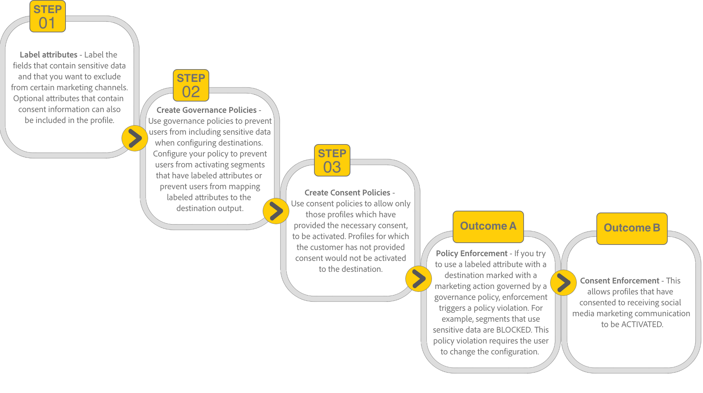
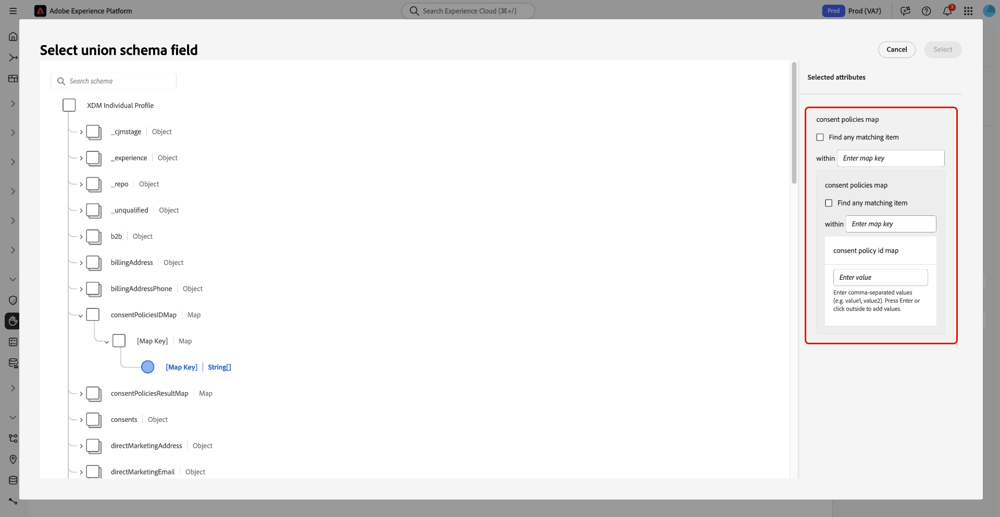

# Beleid voor gegevensgebruik beheren in de gebruikersinterface {#user-guide}

>[!CONTEXTUALHELP]
>id="platform_privacyConsole_dataUsagePolicies_description"
>title="Integreer en handhaaf klanteninstemming in uw profielgegevens"
>abstract="<h2>Beschrijving</h2>
Met Experience Platform kunt u de gegevens die u van uw klanten hebt verzameld, integreren in hun respectievelijke profielen. U kunt dan vormtoestemmingsbeleid bepalen of deze gegevens in segmenten kunnen worden omvat die aan bepaalde bestemmingen worden geactiveerd.
"

In dit document wordt beschreven hoe u de **[!UICONTROL Policies]** -werkruimte in de gebruikersinterface van Adobe Experience Platform kunt gebruiken om beleidsregels voor gegevensgebruik te maken en beheren.

>[!NOTE]
>
>Voor informatie over hoe te om toegangsbeheerbeleid in UI te beheren, verwijs naar de [&#x200B; op attributen-gebaseerde gids van de toegangscontrole UI &#x200B;](../../access-control/abac/ui/policies.md) in plaats daarvan.

>[!IMPORTANT]
>
>Alle beleidsregels voor gegevensgebruik (inclusief basisbeleid van Adobe) zijn standaard uitgeschakeld. Om een individueel beleid voor handhaving te overwegen, moet u dat beleid manueel toelaten. Zie de sectie op [&#x200B; toelatend beleid &#x200B;](#enable) voor stappen op hoe te om dit in UI te doen.

## Vereisten

Deze handleiding vereist een goed begrip van de volgende [!DNL Experience Platform] -concepten:

* [Datagovernance](../home.md)
* [Beleid voor gegevensgebruik](./overview.md)

## Bestaande beleidsvormen weergeven {#view-policies}

Selecteer in de gebruikersinterface van [!DNL Experience Platform] de optie **[!UICONTROL Policies]** om de werkruimte van **[!UICONTROL Policies]** te openen. Op het tabblad **[!UICONTROL Browse]** ziet u een lijst met beschikbare beleidsregels, inclusief de bijbehorende labels, marketingacties en status.

Als u beschikt over toestemmingsbeleid, selecteert u de schakeloptie **[!UICONTROL Consent policies]** om deze op het tabblad [!UICONTROL Browse] weer te geven.

Selecteer een vermeld beleid om zijn beschrijving en type te bekijken. Als een douanebeleid wordt geselecteerd, worden de extra controles getoond om uit te geven, te schrappen, of [&#x200B; toelaten/onbruikbaar maken het beleid &#x200B;](#enable).

## Een aangepast beleid maken {#create-policy}

Als u een nieuw beleid voor aangepast gegevensgebruik wilt maken, selecteert u **[!UICONTROL Create policy]** in de rechterbovenhoek van het tabblad **[!UICONTROL Browse]** in de werkruimte van **[!UICONTROL Policies]** .

Het dialoogvenster [!UICONTROL Choose type of policy] wordt weergegeven. Selecteer of a [&#x200B; toestemmingsbeleid &#x200B;](#consent-policy) of het beleid van het a [&#x200B; gegevensbeheer &#x200B;](#create-governance-policy).

### Beleid voor gegevensbeheer en instemming samen gebruiken {#combine-policies}

>[!NOTE]
>
>Het beleid voor toestemming is momenteel alleen beschikbaar voor organisaties die Adobe Healthcare Shield of Adobe Privacy &amp; Security Shield hebben aangeschaft.

Het beleid van bestuur en toestemming kan samen worden gebruikt om robuuste regels te creëren voor het besturen van publiek dat aan een bestemming wordt toegewezen. Het beleid van de toestemming is inclusief van aard, wat betekent zij dicteren welke profielen in elke marketing ervaring kunnen worden omvat. Omgekeerd sluit het governancebeleid het gebruik van specifieke gelabelde kenmerken uit dat dit voor activering wordt geconfigureerd.

Door dit gedrag te gebruiken, kunt u opstelling een combinatie beleid en toestemmingsregels die de correcte profielen omvatten, maar u verhindert om gegevens te omvatten die tegen uw vastgestelde organisatorische regels gaan. Een voorbeeldscenario zou zijn, waarbij u gevoelige gegevens wilt uitsluiten van opname, maar nog wel geconverteerde gebruikers voor marketing via sociale media kunt aanwijzen. De noodzakelijke stappen voor dit scenario worden geschetst in hieronder informatie.

### Een beleid voor gegevensbeheer maken {#create-governance-policy}

De **[!UICONTROL Create policy]** -workflow wordt weergegeven. Begin door een naam en een beschrijving voor het nieuwe beleid te verstrekken.

Selecteer vervolgens de labels voor gegevensgebruik waarop het beleid wordt gebaseerd. Als u meerdere labels selecteert, kunt u kiezen of de gegevens alle labels moeten bevatten of slechts één label, zodat het beleid van toepassing is. Selecteer **[!UICONTROL Next]** wanneer u klaar bent.

De stap **[!UICONTROL Select marketing actions]** wordt weergegeven. Kies de gewenste marketingacties in de lijst en selecteer vervolgens **[!UICONTROL Next]** om door te gaan.

>[!NOTE]
>
>Wanneer het selecteren van veelvoudige marketing acties, interpreteert het beleid hen als &quot;OF&quot;regel. Met andere woorden, is het beleid van toepassing als **om het even welke** van de geselecteerde marketing acties worden uitgevoerd.

De stap **[!UICONTROL Review]** wordt weergegeven, zodat u de details van het nieuwe beleid kunt bekijken voordat u het maakt. Als u tevreden bent, selecteert u **[!UICONTROL Finish]** om het beleid te maken.

Het tabblad **[!UICONTROL Browse]** wordt opnieuw weergegeven. Hierin wordt nu het nieuwe beleid de status &#39;Concept&#39; weergegeven. Zie de volgende sectie om het beleid in te schakelen.

### Een toestemmingsbeleid maken {#consent-policy}

>[!CONTEXTUALHELP]
>id="platform_privacyConsole_dataUsagePolicies_instructions"
>title="Instructies"
>abstract="<ul><li>Zorg ervoor dat u voorkeursgegevens in uw verenigingsschema&#39;s via de OneTrust bronschakelaar of het standaard XDM schema voor toestemming opneemt.</li><li>Selecteer <a href="https://experienceleague.adobe.com/docs/experience-platform/data-governance/policies/overview.html?lang=nl-NL"> Beleid </a> in de linkernavigatie, dan uitgezocht <a href="https://experienceleague.adobe.com/docs/experience-platform/data-governance/policies/user-guide.html?lang=nl-NL#create-governance-policy"> creeer Beleid </a>.</li><li>Onder <b> als </b> sectie, beschrijf de voorwaarden of de acties die de beleidscontrole zullen teweegbrengen.</li><li>Onder <b> toen </b> sectie, ga de toestemmingsattributen in die voor een profiel moeten aanwezig zijn om in de actie worden omvat die het beleid teweegbracht.</li><li>Selecteer <b> sparen </b> om het beleid tot stand te brengen. Om het beleid toe te laten, selecteer de <b> knevel van de Status </b> in het juiste spoor.</li><li>Experience Platform dwingt automatisch uw toegelaten toestemmingsbeleid af wanneer u segmenten aan bestemmingen activeert, en verstrekt details over hoe elk beleid uw publieksgrootte beïnvloedt.</li><li>Voor meer hulp met deze eigenschap, zie de gids bij <a href="https://experienceleague.adobe.com/docs/experience-platform/data-governance/policies/user-guide.html?lang=nl-NL#consent-policy"> het creëren van toestemmingsbeleid </a> op Experience League.</li></ul>"

>[!IMPORTANT]
>
>Het toestemmingsbeleid is slechts beschikbaar voor organisaties die **het Schild van de Gezondheidszorg van Adobe** of **Privacy &amp; het Schild van de Veiligheid van Adobe** hebben gekocht.

Als u verkoos om een toestemmingsbeleid tot stand te brengen, verschijnt een nieuw scherm dat u toestaat om het nieuwe beleid te vormen.

Als u het beleid voor toestemming wilt gebruiken, moet u toestemmingskenmerken in uw profielgegevens hebben. Zie de gids op [&#x200B; toestemmingsverwerking in Experience Platform &#x200B;](../../landing/governance-privacy-security/consent/adobe/overview.md) voor gedetailleerde stappen op hoe te om de vereiste attributen in uw unieschema te omvatten.

Het beleid van de goedkeuring bestaat uit twee logische componenten:

* **[!UICONTROL If]**: De voorwaarde die de beleidscontrole activeert. Dit kan gebaseerd zijn op een bepaalde marketingactie die wordt uitgevoerd, de aanwezigheid van bepaalde labels voor gegevensgebruik of een combinatie van beide.
* **[!UICONTROL Then]**: De toestemmingskenmerken die aanwezig moeten zijn om een profiel te omvatten in de actie die het beleid teweegbracht.

>[!NOTE]
>
>Het beleid van de toestemming steunt geavanceerd regel het bouwen met diverse gebiedstypes en exploitanten. Voor een volledige verwijzing van gesteunde gebiedstypes, exploitanten, en regel-bouwende voorbeelden, zie de [&#x200B; Verwijzing van de het beleidsregels van de Toestemming &#x200B;](./consent-policy-rule-building-reference.md).

#### Voorwaarden configureren {#consent-conditions}

>[!CONTEXTUALHELP]
>id="platform_governance_policies_consentif"
>title="Indien voorwaarde"
>abstract="Begin door de voorwaarden te bepalen die de beleidscontrole zullen teweegbrengen. Voorwaarden kunnen bestaan uit bepaalde marketingacties, bepaalde etiketten voor gegevensbeheer of een combinatie van beide. Gebruik AND/OR logica om complexe voorwaardelijke relaties tussen meerdere voorwaarden te maken."

Selecteer onder de sectie **[!UICONTROL If]** de marketingacties en/of labels voor gegevensgebruik die dit beleid moeten activeren. Selecteer **[!UICONTROL View all]** en **[!UICONTROL Select labels]** om respectievelijk de volledige lijsten met beschikbare marketingacties en labels weer te geven.

Nadat u ten minste één voorwaarde hebt toegevoegd, kunt u **[!UICONTROL Add condition]** selecteren om door te gaan met het toevoegen van zo nodig meer voorwaarden, waarbij u het juiste voorwaardetype in de vervolgkeuzelijst kiest.

Als u meer dan één voorwaarde selecteert, kunt u het pictogram gebruiken dat tussen hen verschijnt om de voorwaardelijke verhouding tussen &quot;EN&quot;en &quot;OF&quot;te schakelen.

#### Goedkeuringskenmerken selecteren {#consent-attributes}

>[!CONTEXTUALHELP]
>id="platform_governance_policies_consentthen"
>title="Dan voorwaarde"
>abstract="Zodra uw &quot;als&quot;voorwaarde is bepaald, gebruik de sectie &quot;toen&quot;om minstens één toestemmingsattribuut van het unieschema te selecteren. U moet door containergebieden (Voorwerp, Kaart, Serie) navigeren om primitieve gebieden (Koord, Aantal, Van Boole enz.) voor regelbouw te bereiken. Dit primitieve veld is het kenmerk dat aanwezig moet zijn om profielen te kunnen opnemen in de actie waarop dit beleid betrekking heeft."

Selecteer onder de sectie **[!UICONTROL Then]** ten minste één toestemmingskenmerk in het samenvoegingsschema. Dit is het kenmerk dat aanwezig moet zijn om profielen op te nemen in de actie waarop dit beleid betrekking heeft. U kunt een van de voorgestelde opties kiezen of **[!UICONTROL View all]** selecteren om het kenmerk rechtstreeks in het samenvoegingsschema te kiezen.

>[!NOTE]
>
>Het beleid van de toestemming steunt primitieve gebiedstypes (Koord, Aantal, Boolean, Datum) en containertypes (Voorwerp, Kaart, Serie). U kunt in containers navigeren om specifieke attributen te selecteren en EN/OF logica toe te passen om regels te combineren. Voor een volledige verwijzing van gesteunde gebiedstypes, exploitanten, en regel-bouwende voorbeelden, zie [&#x200B; de regel van het toestemmingsbeleid bouwend verwijzing &#x200B;](./consent-policy-rule-building-reference.md).

Als u **[!UICONTROL View all]** selecteert, wordt het dialoogvenster **[!UICONTROL Select consent attribute]** weergegeven. Selecteer de toestemmingsattributen die u dit beleid wilt controleren. In dit dialoogvenster kunt u ook **[!UICONTROL Advanced Schema search]** selecteren om een genest primitief veld te kiezen dat moet worden beoordeeld als onderdeel van het beleid. Selecteer **[!UICONTROL Done]** om uw instellingen te bevestigen.

### Geavanceerd zoeken in schema {#advanced-schema-search}

Selecteer in het dialoogvenster **[!UICONTROL Select consent attribute]** de optie **[!UICONTROL Advanced Schema search]** om het dialoogvenster **[!UICONTROL Select union schema field]** te openen. In deze weergave selecteert u kenmerken op hoofdniveau of geneste kenmerken van primitieve veldtypen, zoals een tekenreeks, getal, Boolean en datum, alsmede containertypen zoals object, map en array.

#### Velden met vaste waarde voor een beleidsvoorwaarde {#fixed-value-fields}

Wanneer u een veld met een vaste waarde als beleidsvoorwaarde selecteert, worden in het deelvenster [!UICONTROL Selected attributes] de vooraf gedefinieerde waarden weergegeven die in het gegevensschema zijn gedefinieerd.

>[!NOTE]
>
>Als een gebied met een vaste reeks waarden (bijvoorbeeld, als enum of andere gecontroleerde woordenschat) wordt gevormd, dwingt de beleidsaannemer die beperking om voorwaarden te verzekeren slechts tegen geldige, gestandaardiseerde gegevens worden geëvalueerd.

Om de gegevenskwaliteit en consistentie te handhaven, geeft UI deze waarden als selecteerbare controledozen eerder dan vrije-tekstgebieden terug. Deze benadering vermindert handbevestiging en helpt uw toestemmingsbeleid gegevens betrouwbaar evalueren.

Als u de voorwaarde wilt definiëren, schakelt u de selectievakjes in voor de waarden die door het beleid moeten worden geëvalueerd.

#### Gegevenstype toewijzen aan velden voor een beleidsvoorwaarde {#map-data-type-fields}

Wanneer u een primitief veld selecteert dat zich in een gegevenstype Kaart bevindt, worden aanvullende configuratieopties weergegeven in het deelvenster **[!UICONTROL Selected attributes]** . Gebruik deze opties om toestemmingscontroles over veelvoudige sleutels te vormen zonder een afzonderlijk beleid voor elke sleutel te vereisen. Deze configuratiemethode vereenvoudigt beleidsbeheer door het aantal beleid te verminderen u moet creëren.

##### Kenmerken van gegevenstypen toewijzen configureren {#configure-map-attributes}

Om een Kaart-type attribuut te vormen, volg de stappen hieronder:

In het diagram van het unieschema, selecteer een primitief gebied (zoals een koord of een aantal) bevat binnen een gegevenstype van de Kaart. Het deelvenster **[!UICONTROL Selected attributes]** wordt bijgewerkt om aanvullende configuratieopties voor dat veld weer te geven.

Configureer in het deelvenster **[!UICONTROL Selected attributes]** hoe het beleid kaarttoetsen evalueert door het selectievakje **[!UICONTROL Find any matching item]** in of uit te schakelen.

| Optie | Actie | Beleidsgedrag |
| --- | --- | --- |
| **[!UICONTROL Find any matching item]** checkbox is **geselecteerd** | Het tekstveld **[!UICONTROL within]** is uitgeschakeld. | Het beleid controleert **elke sleutel** binnen de kaart. Elke sleutel waarbij het geneste veld voldoet aan de waardevoorwaarde wordt beschouwd als een overeenkomst voor het beleid. Dit is handig voor het afdwingen van wereldwijde compatibiliteit met dynamisch vergrendelde kenmerken. |
| **[!UICONTROL Find any matching item]** checkbox is **unselected** | U moet een specifieke sleutelnaam op het **[!UICONTROL within]** tekstgebied ingaan. | Het beleid controleert alleen de kaartsleutel die is opgegeven in het veld **[!UICONTROL within]** . Alleen profielen waarin het geneste veld voor een specifieke sleutel overeenkomt met de gedefinieerde waarde. Dit is handig voor beleid dat gericht is op een specifiek programma of een specifieke frequentiesleutel (bijvoorbeeld `frequencyMap.m1`). |

Voer de waarde in voor het geselecteerde primitieve veld dat door het beleid moet worden geëvalueerd. Als het veldtype bijvoorbeeld `Integer` is, voert u een numerieke waarde in.

Selecteer **[!UICONTROL Select]** om uw configuratie te bevestigen en terug te keren naar de beleidsontwikkelaar.

Nadat u ten minste één toestemmingskenmerk hebt geselecteerd, wordt het deelvenster **[!UICONTROL Policy properties]** bijgewerkt om het geschatte aantal profielen weer te geven dat onder dit beleid valt, samen met het percentage van de betrokken profielen in het archief Profiel. De geschatte profieltelling werkt automatisch bij aangezien u de beleidsconfiguratie verandert.

Selecteer **[!UICONTROL Add result]** als u aanvullende toestemmingskenmerken wilt toevoegen. Dit leidt tot een andere regel voor het omvatten van profielen die op die attributen worden gebaseerd.

>[!NOTE]
>
>Om een bestaand attribuut uit te geven, selecteer de attributennaam en selecteer dan het potloodpictogram (). Het dialoogvenster **[!UICONTROL Select union schema field]** wordt geopend zodat u wijzigingen kunt aanbrengen.
>
>

Ga door met het toevoegen of aanpassen van voorwaarden en toestemmingskenmerken totdat het beleid aan uw vereisten voldoet. Als u klaar bent, voert u een naam en (optionele) beschrijving in en selecteert u **[!UICONTROL Save]** om het beleid te maken.

Het toestemmingsbeleid wordt nu gecreeerd, en zijn status wordt geplaatst aan [!UICONTROL Disabled] door gebrek. Als u het beleid meteen wilt inschakelen, selecteert u de **[!UICONTROL Status]** -schakeloptie in de rechtertrack.

#### Beleidshandhaving verifiëren

Nadat u een toestemmingsbeleid hebt gecreeerd en toegelaten, kunt u voorproef hoe het uw toegelaten publiek wanneer het activeren van segmenten aan bestemmingen beïnvloedt. Zie de sectie over [&#x200B; evaluatie van het toestemmingsbeleid &#x200B;](../enforcement/auto-enforcement.md#consent-policy-evaluation) voor meer informatie.

## Een beleid in- of uitschakelen {#enable}

Alle beleidsregels voor gegevensgebruik (inclusief basisbeleid van Adobe) zijn standaard uitgeschakeld. Voor een individueel beleid dat voor handhaving moet worden overwogen, moet u dat beleid manueel toelaten door API of UI.

U kunt beleid in- of uitschakelen op het tabblad **[!UICONTROL Browse]** in de **[!UICONTROL Policies]** -werkruimte. Selecteer een aangepast beleid in de lijst om de details ervan rechts weer te geven. Selecteer onder **[!UICONTROL Status]** de schakelknop om het beleid in of uit te schakelen.

## Marketingacties weergeven {#view-marketing-actions}

Selecteer in de werkruimte **[!UICONTROL Policies]** het tabblad **[!UICONTROL Marketing actions]** om een lijst weer te geven met beschikbare marketingacties die door Adobe en uw eigen organisatie zijn gedefinieerd.

## Een marketingactie maken {#create-marketing-action}

Als u een nieuwe aangepaste marketingactie wilt maken, selecteert u **[!UICONTROL Create marketing action]** in de rechterbovenhoek van de tab **[!UICONTROL Marketing actions]** in de werkruimte van **[!UICONTROL Policies]** .

Het dialoogvenster **[!UICONTROL Create marketing action]** wordt weergegeven. Voer een naam en beschrijving in voor de marketingactie en selecteer vervolgens **[!UICONTROL Create]** .

De nieuwe handeling wordt weergegeven op het tabblad **[!UICONTROL Marketing actions]** . U kunt de marketing actie nu gebruiken wanneer [&#x200B; het creëren van nieuw beleid van het gegevensgebruik &#x200B;](#create-policy).

## Een marketingactie bewerken of verwijderen {#edit-delete-marketing-action}

>[!NOTE]
>
>Alleen aangepaste marketingacties die door uw organisatie zijn gedefinieerd, kunnen worden bewerkt. Door Adobe gedefinieerde marketingacties kunnen niet worden gewijzigd of verwijderd.

Selecteer in de werkruimte **[!UICONTROL Policies]** het tabblad **[!UICONTROL Marketing actions]** om een lijst weer te geven met beschikbare marketingacties die door Adobe en uw eigen organisatie zijn gedefinieerd. Selecteer een aangepaste marketingactie in de lijst en gebruik vervolgens de beschikbare velden in de rechtersectie om de details van de marketingactie te bewerken.

Als de marketingactie niet wordt gebruikt door een bestaand gebruiksbeleid, kunt u deze verwijderen door **[!UICONTROL Delete marketing action]** te selecteren.

>[!NOTE]
>
>Wanneer wordt geprobeerd een marketingactie te verwijderen die door een bestaand beleid wordt gebruikt, verschijnt een foutbericht dat aangeeft dat de verwijderpoging is mislukt.

## Volgende stappen

Dit document biedt een overzicht van het beheer van beleidsregels voor gegevensgebruik in de gebruikersinterface van [!DNL Experience Platform] . Voor stappen op hoe te om beleid te beheren gebruikend [!DNL Policy Service API], zie de [&#x200B; ontwikkelaarsgids &#x200B;](../api/getting-started.md). Voor informatie over hoe te om het beleid van het gegevensgebruik af te dwingen, zie het [&#x200B; overzicht van de beleidshandhaving &#x200B;](../enforcement/overview.md).

In de volgende video wordt een demonstratie gegeven van het werken met gebruiksbeleid in de gebruikersinterface van [!DNL Experience Platform] :

>[!VIDEO](https://video.tv.adobe.com/v/32977?quality=12&learn=on)
