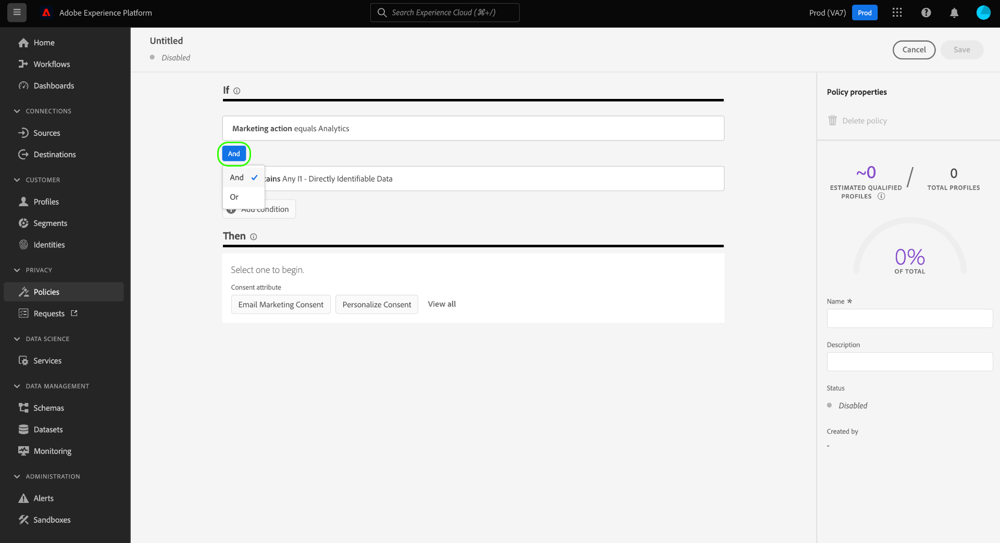

# Beleid voor gegevensgebruik beheren in de gebruikersinterface {#user-guide}

>[!CONTEXTUALHELP]
>id="platform_privacyConsole_dataUsagePolicies_description"
>title="Integreer en handhaaf klanteninstemming in uw profielgegevens"
>abstract="<h2>Beschrijving</h2>
Met het platform kunt u de gegevens die u van uw klanten hebt verzameld, integreren in hun respectievelijke profielen. U kunt dan vormtoestemmingsbeleid bepalen of deze gegevens in segmenten kunnen worden omvat die aan bepaalde bestemmingen worden geactiveerd.
"

In dit document wordt beschreven hoe u de **[!UICONTROL Policies]** -werkruimte in de gebruikersinterface van Adobe Experience Platform kunt gebruiken om beleidsregels voor gegevensgebruik te maken en beheren.

>[!NOTE]
>
>Voor informatie over hoe te om toegangsbeheerbeleid in UI te beheren, verwijs naar de [ op attributen-gebaseerde gids van de toegangscontrole UI ](../../access-control/abac/ui/policies.md) in plaats daarvan.

>[!IMPORTANT]
>
>Alle beleidsregels voor gegevensgebruik (inclusief kernbeleidsregels die door Adobe worden verschaft) zijn standaard uitgeschakeld. Om een individueel beleid voor handhaving te overwegen, moet u dat beleid manueel toelaten. Zie de sectie op [ toelatend beleid ](#enable) voor stappen op hoe te om dit in UI te doen.

## Vereisten

Deze handleiding vereist een goed begrip van de volgende [!DNL Experience Platform] -concepten:

* [Datagovernance](../home.md)
* [Beleid voor gegevensgebruik](./overview.md)

## Bestaande beleidsvormen weergeven {#view-policies}

Selecteer in de gebruikersinterface van [!DNL Experience Platform] de optie **[!UICONTROL Policies]** om de werkruimte van **[!UICONTROL Policies]** te openen. Op het tabblad **[!UICONTROL Browse]** ziet u een lijst met beschikbare beleidsregels, inclusief de bijbehorende labels, marketingacties en status.

Als u beschikt over toestemmingsbeleid, selecteert u de schakeloptie **[!UICONTROL Consent policies]** om deze op het tabblad [!UICONTROL Browse] weer te geven.

Selecteer een vermeld beleid om zijn beschrijving en type te bekijken. Als een douanebeleid wordt geselecteerd, worden de extra controles getoond om uit te geven, te schrappen, of [ toelaten/onbruikbaar maken het beleid ](#enable).

## Een aangepast beleid maken {#create-policy}

Als u een nieuw aangepast beleid voor gegevensgebruik wilt maken, selecteert u **[!UICONTROL Create policy]** in de rechterbovenhoek van het tabblad **[!UICONTROL Browse]** in de **[!UICONTROL Policies]** -werkruimte.

Afhankelijk van of u deel uitmaakt van de bètaversie voor toestemmingsbeleid, vindt een van de volgende situaties plaats:

* Als u geen deel van bèta bent, wordt u onmiddellijk gebracht aan het werkschema voor [ creërend een gegeven governancebeleid ](#create-governance-policy).
* Als u deel van bèta uitmaakt, verstrekt een dialoog een extra optie om [ een toestemmingsbeleid ](#consent-policy) tot stand te brengen.
  

### Beleid voor gegevensbeheer en instemming samen gebruiken {#combine-policies}

>[!NOTE]
>
>Het toestemmingsbeleid is momenteel alleen beschikbaar voor organisaties die een Adobe hebben aangeschaft voor het Health Care Shield of het Adobe Privacy &amp; Security Shield.

Beleid met governance en toestemming kan samen worden gebruikt om robuuste regels te creëren voor het besturen van doelgroepen die aan een bestemming zijn toegewezen. Toestemmingsbeleid is inclusief van aard, wat betekent dat ze bepalen welke profielen kunnen worden opgenomen in elke marketingervaring. Omgekeerd sluit het beleid het gebruik van specifieke gelabelde kenmerken uit van configuratie voor activering.

Door dit gedrag te gebruiken, kunt u een combinatie van beleid en toestemmingsregels opzetten die de correcte profielen omvatten, maar verhindert u gegevens op te nemen die tegen uw vastgestelde organisatorische regels indruisen. Een voorbeeldscenario zou zijn, waarbij u gevoelige gegevens wilt uitsluiten van opname, maar toch gebruikers met toestemming kunt targeten voor marketing via social media. De benodigde stappen voor dit scenario worden in de onderstaande infographic beschreven.

### Een beleid voor gegevensbeheer maken {#create-governance-policy}

De **[!UICONTROL Create policy]** -workflow wordt weergegeven. Begin door een naam en een beschrijving voor het nieuwe beleid te verstrekken.

Selecteer vervolgens de labels voor gegevensgebruik waarop het beleid wordt gebaseerd. Als u meerdere labels selecteert, kunt u kiezen of de gegevens alle labels moeten bevatten of slechts één label, zodat het beleid van toepassing is. Selecteer **[!UICONTROL Next]** wanneer u klaar bent.

De stap **[!UICONTROL Select marketing actions]** wordt weergegeven. Kies de gewenste marketingacties in de lijst en selecteer vervolgens **[!UICONTROL Next]** om door te gaan.

>[!NOTE]
>
>Wanneer het selecteren van veelvoudige marketing acties, interpreteert het beleid hen als &quot;OF&quot;regel. Met andere woorden, is het beleid van toepassing als **om het even welke** van de geselecteerde marketing acties worden uitgevoerd.

De stap **[!UICONTROL Review]** wordt weergegeven, zodat u de details van het nieuwe beleid kunt bekijken voordat u het maakt. Als u tevreden bent, selecteert u **[!UICONTROL Finish]** om het beleid te maken.

Het tabblad **[!UICONTROL Browse]** wordt opnieuw weergegeven. Hierin wordt nu het nieuwe beleid de status &#39;Concept&#39; weergegeven. Zie de volgende sectie om het beleid in te schakelen.

### Een toestemmingsbeleid maken {#consent-policy}

>[!CONTEXTUALHELP]
>id="platform_privacyConsole_dataUsagePolicies_instructions"
>title="Instructies"
>abstract="<ul><li>Zorg ervoor dat u voorkeursgegevens in uw verenigingsschema&#39;s via de OneTrust bronschakelaar of het standaard XDM schema voor toestemming opneemt.</li><li>Selecteer <a href="https://experienceleague.adobe.com/docs/experience-platform/data-governance/policies/overview.html"> Beleid </a> in de linkernavigatie, dan uitgezocht <a href="https://experienceleague.adobe.com/docs/experience-platform/data-governance/policies/user-guide.html#create-governance-policy"> creeer Beleid </a>.</li><li>Onder <b> als </b> sectie, beschrijf de voorwaarden of de acties die de beleidscontrole zullen teweegbrengen.</li><li>Onder <b> toen </b> sectie, ga de toestemmingsattributen in die voor een profiel moeten aanwezig zijn om in de actie worden omvat die het beleid teweegbracht.</li><li>Selecteer <b> sparen </b> om het beleid tot stand te brengen. Om het beleid toe te laten, selecteer de </b> knevel van de Status <b> in het juiste spoor.</li><li>Het Experience Platform dwingt automatisch uw toegelaten toestemmingsbeleid af wanneer u segmenten aan bestemmingen activeert, en verstrekt details over hoe elk beleid uw publieksgrootte beïnvloedt.</li><li>Voor meer hulp met deze eigenschap, zie de gids bij <a href="https://experienceleague.adobe.com/docs/experience-platform/data-governance/policies/user-guide.html#consent-policy"> het creëren van toestemmingsbeleid </a> op Experience League.</li></ul>"

>[!IMPORTANT]
>
>Het toestemmingsbeleid is slechts beschikbaar voor organisaties die **het Schild van de Gezondheidszorg van de Adobe** of **de Privacy en het Schild van de Adobe** hebben gekocht.

Als u verkoos om een toestemmingsbeleid tot stand te brengen, verschijnt een nieuw scherm dat u toestaat om het nieuwe beleid te vormen.

Als u het beleid voor toestemming wilt gebruiken, moet u toestemmingskenmerken in uw profielgegevens hebben. Zie de gids op [ toestemmingsverwerking in Experience Platform ](../../landing/governance-privacy-security/consent/adobe/overview.md) voor gedetailleerde stappen op hoe te om de vereiste attributen in uw unieschema te omvatten.

Het beleid van de goedkeuring bestaat uit twee logische componenten:

* **[!UICONTROL If]**: De voorwaarde die de beleidscontrole activeert. Dit kan gebaseerd zijn op een bepaalde marketingactie die wordt uitgevoerd, de aanwezigheid van bepaalde labels voor gegevensgebruik of een combinatie van beide.
* **[!UICONTROL Then]**: De toestemmingskenmerken die aanwezig moeten zijn om een profiel te omvatten in de actie die het beleid teweegbracht.

#### Voorwaarden configureren {#consent-conditions}

>[!CONTEXTUALHELP]
>id="platform_governance_policies_consentif"
>title="Indien voorwaarde"
>abstract="Begin door de voorwaarden te bepalen die de beleidscontrole zullen teweegbrengen. Voorwaarden kunnen bestaan uit bepaalde marketingacties, bepaalde etiketten voor gegevensbeheer of een combinatie van beide."

Selecteer onder de sectie **[!UICONTROL If]** de marketingacties en/of labels voor gegevensgebruik die dit beleid moeten activeren. Selecteer **[!UICONTROL View all]** en **[!UICONTROL Select labels]** om respectievelijk de volledige lijsten met beschikbare marketingacties en labels weer te geven.

Nadat u ten minste één voorwaarde hebt toegevoegd, kunt u **[!UICONTROL Add condition]** selecteren om door te gaan met het toevoegen van zo nodig meer voorwaarden, waarbij u het juiste voorwaardetype in de vervolgkeuzelijst kiest.

Als u meer dan één voorwaarde selecteert, kunt u het pictogram gebruiken dat tussen hen verschijnt om de voorwaardelijke verhouding tussen &quot;EN&quot;en &quot;OF&quot;te schakelen.

#### Goedkeuringskenmerken selecteren {#consent-attributes}

>[!CONTEXTUALHELP]
>id="platform_governance_policies_consentthen"
>title="Dan voorwaarde"
>abstract="Zodra uw &quot;als&quot;voorwaarde is bepaald, gebruik de sectie &quot;toen&quot;om minstens één toestemmingsattribuut van het unieschema te selecteren. Dit is het kenmerk dat aanwezig moet zijn om profielen op te nemen in de actie waarop dit beleid betrekking heeft."

Selecteer onder de sectie **[!UICONTROL Then]** ten minste één toestemmingskenmerk in het samenvoegingsschema. Dit is het kenmerk dat aanwezig moet zijn om profielen op te nemen in de actie waarop dit beleid betrekking heeft. U kunt een van de beschikbare opties in de lijst kiezen of u kunt **[!UICONTROL View all]** selecteren om het kenmerk rechtstreeks in het samenvoegingsschema te kiezen.

Wanneer het selecteren van de toestemmingsattributen, kies de waarden voor de attributen die u dit beleid wilt controleren.

Nadat u ten minste één toestemmingskenmerk hebt geselecteerd, wordt het deelvenster **[!UICONTROL Policy properties]** bijgewerkt om het geschatte aantal profielen weer te geven dat onder dit beleid is toegestaan, inclusief het percentage van de totale opslag van het profiel. Deze schatting wordt automatisch bijgewerkt wanneer u de beleidsconfiguratie aanpast.

Selecteer **[!UICONTROL Add result]** als u meer toestemmingskenmerken aan het beleid wilt toevoegen.

U kunt voorwaarden en toestemmingseigenschappen aan het beleid blijven toevoegen en aanpassen zoals nodig. Als u tevreden bent met de configuratie, geeft u een naam en een optionele beschrijving voor het beleid op voordat u **[!UICONTROL Save]** selecteert.

Het toestemmingsbeleid wordt nu gecreeerd, en zijn status wordt geplaatst aan [!UICONTROL Disabled] door gebrek. Als u het beleid meteen wilt inschakelen, selecteert u de **[!UICONTROL Status]** -schakeloptie in de rechtertrack.

#### Beleidshandhaving verifiëren

Nadat u een toestemmingsbeleid hebt gemaakt en ingeschakeld, kunt u een voorvertoning weergeven van de invloed die dit heeft op uw goedgekeurde doelgroepen wanneer u segmenten activeert naar bestemmingen. Zie de sectie over [ evaluatie van het toestemmingsbeleid ](../enforcement/auto-enforcement.md#consent-policy-evaluation) voor meer informatie.

## Een beleid in- of uitschakelen {#enable}

Alle beleidsregels voor gegevensgebruik (inclusief kernbeleidsregels die door Adobe worden verschaft) zijn standaard uitgeschakeld. Voor een individueel beleid dat voor handhaving moet worden overwogen, moet u dat beleid manueel toelaten door API of UI.

U kunt het beleid in- of uitschakelen via het tabblad **[!UICONTROL Browse]** in de **[!UICONTROL Policies]** -werkruimte. Selecteer een aangepast beleid in de lijst om de details ervan rechts weer te geven. Selecteer onder **[!UICONTROL Status]** de schakelknop om het beleid in of uit te schakelen.

## Marketingacties weergeven {#view-marketing-actions}

Selecteer in de **[!UICONTROL Policies]** -werkruimte het tabblad **[!UICONTROL Marketing actions]** om een lijst weer te geven met beschikbare marketingacties die zijn gedefinieerd door de Adobe en uw eigen organisatie.

## Een marketingactie maken {#create-marketing-action}

Als u een nieuwe aangepaste marketingactie wilt maken, selecteert u **[!UICONTROL Create marketing action]** in de rechterbovenhoek van het tabblad **[!UICONTROL Marketing actions]** in de **[!UICONTROL Policies]** -werkruimte.

Het dialoogvenster **[!UICONTROL Create marketing action]** wordt weergegeven. Voer een naam en beschrijving in voor de marketingactie en selecteer vervolgens **[!UICONTROL Create]** .

De nieuwe handeling wordt weergegeven op het tabblad **[!UICONTROL Marketing actions]** . U kunt de marketing actie nu gebruiken wanneer [ het creëren van nieuw beleid van het gegevensgebruik ](#create-policy).

## Een marketingactie bewerken of verwijderen {#edit-delete-marketing-action}

>[!NOTE]
>
>Alleen aangepaste marketingacties die door uw organisatie zijn gedefinieerd, kunnen worden bewerkt. Marketingacties die door Adobe worden gedefinieerd, kunnen niet worden gewijzigd of verwijderd.

Selecteer in de werkruimte **[!UICONTROL Policies]** het tabblad **[!UICONTROL Marketing actions]** om een lijst weer te geven met beschikbare marketingacties die door de Adobe en uw eigen organisatie zijn gedefinieerd. Selecteer een aangepaste marketingactie in de lijst en bewerk vervolgens de details van de marketingactie met behulp van de beschikbare velden in de rechtersectie.

Als de marketingactie niet wordt gebruikt door een bestaand gebruiksbeleid, kunt u deze verwijderen door **[!UICONTROL Delete marketing action]** te selecteren.

>[!NOTE]
>
>Als u probeert een marketingactie te verwijderen die door een bestaand beleid wordt gebruikt, verschijnt een foutbericht om aan te geven dat de verwijderpoging is mislukt.

## Volgende stappen

Dit document biedt een overzicht van het beheer van beleidsregels voor gegevensgebruik in de gebruikersinterface van [!DNL Experience Platform] . Voor stappen op hoe te om beleid te beheren gebruikend [!DNL Policy Service API], zie de [ ontwikkelaarsgids ](../api/getting-started.md). Voor informatie over hoe te om het beleid van het gegevensgebruik af te dwingen, zie het [ overzicht van de beleidshandhaving ](../enforcement/overview.md).

De volgende video laat zien hoe u met het gebruiksbeleid kunt werken in de gebruikersinterface van [!DNL Experience Platform] :

>[!VIDEO](https://video.tv.adobe.com/v/32977?quality=12&learn=on)
