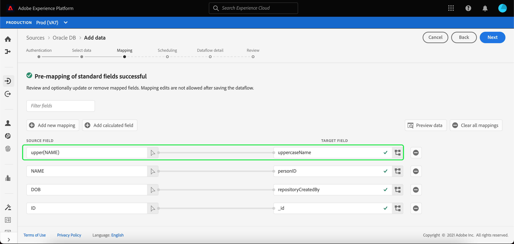

# Berekende velden

Met berekende velden kunnen waarden worden gemaakt op basis van de kenmerken in het invoerschema. Deze waarden kunnen vervolgens aan kenmerken in het doelschema worden toegewezen en een naam en beschrijving worden gegeven om de referentie eenvoudiger te maken.

Selecteer **[!UICONTROL Add calculated field]** om een berekend veld te maken.

Het **[!UICONTROL Create calculated field]** paneel verschijnt. Het linkerdialoogvenster bevat de velden, functies en operatoren die in berekende velden worden ondersteund. Selecteer een van de tabbladen om functies, velden of operatoren toe te voegen aan de expressie-editor.

| Tab | Beschrijving |
| --- | ----------- |
| -functie | Op het tabblad Functies staan de functies die beschikbaar zijn voor het transformeren van de gegevens. Voor meer informatie over de functies die u kunt gebruiken binnen berekende velden, leest u de handleiding op [met de functies Data Prep (Mapper)](./functions.md). |
| Veld | Het tabblad Veld bevat velden en kenmerken die beschikbaar zijn in het bronschema. |
| Operator | Het tabblad Operatoren bevat een lijst met operatoren die beschikbaar zijn om de gegevens te transformeren. |

U kunt handmatig velden, functies en operatoren toevoegen met de expressieeditor in het midden. Selecteer de editor om een expressie te maken.

Selecteer **[!UICONTROL Save]** om door te gaan.

Het kaartscherm verschijnt weer met het nieuwe bronveld. Pas het desbetreffende doelveld toe en selecteer **[!UICONTROL Finish]** om de toewijzing te voltooien.

