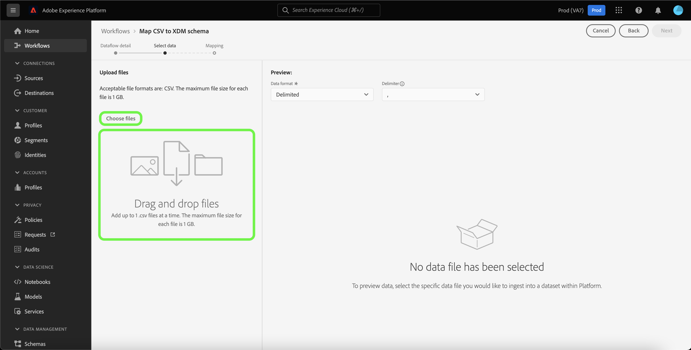
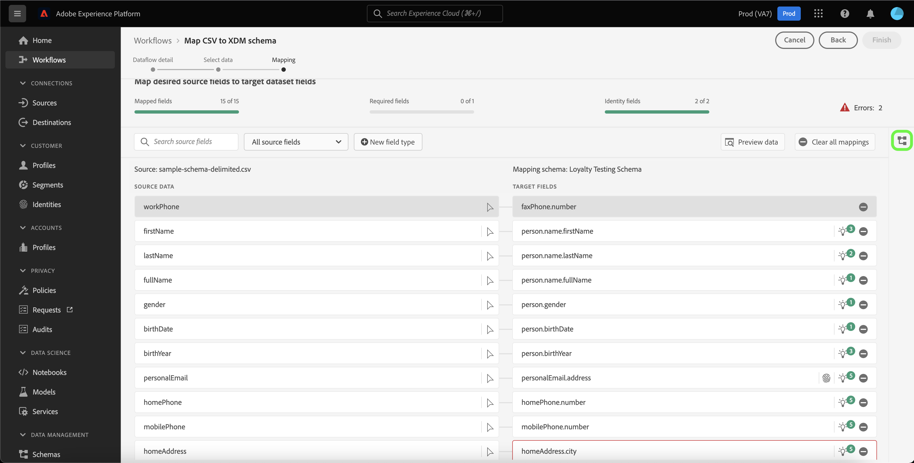
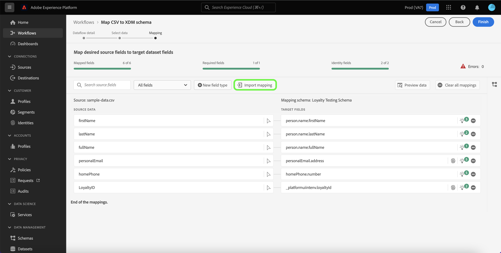

# UI-gids voor gegevenprepress

Dit document biedt aanwijzingen voor het gebruik van functies voor gegevensvoorvoegsels in de Adobe Experience Platform-gebruikersinterface om CSV-bestanden toe te wijzen aan een XDM-schema.

## Aan de slag

Deze zelfstudie vereist een goed begrip van de volgende onderdelen van het Platform:

* [[!DNL Experience Data Model (XDM)] Systeem](../../xdm/home.md): Het gestandaardiseerde kader waardoor het Platform gegevens van de klantenervaring organiseert.
   * [Basisbeginselen van de schemacompositie](../../xdm/schema/composition.md): Leer over de basisbouwstenen van schema&#39;s XDM, met inbegrip van zeer belangrijke principes en beste praktijken in schemacompositie.
   * [Zelfstudie Schema Editor](../../xdm/tutorials/create-schema-ui.md): Leer hoe te om douaneschema&#39;s tot stand te brengen gebruikend de Redacteur UI van het Schema.
* [Identiteitsservice](../../identity-service/home.md): Verbeter een beter beeld van individuele klanten en hun gedrag door identiteiten over apparaten en systemen te overbruggen.
* [[!DNL Real-time Customer Profile]](../../profile/home.md): Verstrekt een verenigd, real-time consumentenprofiel dat op bijeengevoegde gegevens van veelvoudige bronnen wordt gebaseerd.
* [Bronnen](../../sources/home.md): Met Experience Platform kunnen gegevens uit verschillende bronnen worden ingepakt en kunt u inkomende gegevens structureren, labelen en verbeteren met behulp van de services van Platforms.

## Gegevens

>[!TIP]
>
>U kunt tot gegevens toegang hebben die door om het even welke bron van de broncatalogus te selecteren. Zie voor meer informatie de [overzicht van bronnen](../../sources/home.md).

Voordat u uw CSV-gegevens kunt toewijzen aan een XDM-schema, moet u eerst de details van de gegevensstroom vaststellen.

De [!UICONTROL Dataflow detail] De pagina staat u toe om te selecteren of u uw gegevens CSV in een bestaande doeldataset of een nieuwe doeldataset wilt opnemen. Een bestaande dataset komt met een vooraf gebouwd doelschema om uw gegevens aan in kaart te brengen, terwijl een nieuwe dataset u vereist om een bestaand schema te selecteren, of een nieuw schema tot stand te brengen, om uw gegevens aan in kaart te brengen.

### Een bestaande doelgegevensset gebruiken

Om uw CSV- gegevens in een bestaande dataset in te voeren, selecteer **[!UICONTROL Existing dataset]**. U kunt of een bestaande dataset terugwinnen gebruikend [!UICONTROL Advanced search] of door door de lijst van bestaande datasets in het dropdown menu te scrollen.

Selecteer een gegevensset en geef een naam op voor de gegevensstroom en een optionele beschrijving.

Tijdens dit proces kunt u ook [!UICONTROL Error diagnostics] en [!UICONTROL Partial ingestion]. [!UICONTROL Error diagnostics] laat gedetailleerde foutenmelding generatie voor om het even welke onjuiste verslagen toe die in uw dataflow voorkomen, terwijl [!UICONTROL Partial ingestion] kunt u gegevens met fouten opnemen tot een bepaalde drempel die u handmatig definieert. Zie de [gedeeltelijke batch-opname, overzicht](../../ingestion/batch-ingestion/partial.md) voor meer informatie .

### Een nieuwe doelgegevensset gebruiken

Om uw CSV- gegevens in een nieuwe dataset in te voeren, selecteer **[!UICONTROL New dataset]** en geef vervolgens een naam voor de uitvoergegevensset en een optionele beschrijving op. Selecteer vervolgens het schema waaraan u wilt toewijzen [!UICONTROL Advanced search] of door door de lijst van bestaande schema&#39;s in het dropdown menu te scrollen.

Selecteer een schema, geef een naam voor de gegevensstroom en een optionele beschrijving op en pas vervolgens het [!UICONTROL Error diagnostics] en [!UICONTROL Partial ingestion] de gewenste instellingen voor de gegevensstroom. Als u klaar bent, selecteert u **[!UICONTROL Next]**.

## Gegevens selecteren

De [!UICONTROL Select data] wordt weergegeven, zodat u een interface hebt om uw lokale bestanden te uploaden en een voorvertoning van de structuur en inhoud ervan te bekijken. Selecteren **[!UICONTROL Choose files]** om een CSV-bestand vanaf uw lokale systeem te uploaden. U kunt ook het CSV-bestand dat u wilt uploaden, naar de [!UICONTROL Drag and drop files] deelvenster.

>[!TIP]
>
>Momenteel worden alleen CSV-bestanden ondersteund door lokale bestanden te uploaden. De maximale bestandsgrootte voor elk bestand is 1 GB.

Nadat het bestand is geüpload, wordt de voorbeeldinterface bijgewerkt en worden de inhoud en de structuur van het bestand weergegeven.

Afhankelijk van het bestand kunt u een kolomscheidingsteken selecteren, zoals tabs, komma&#39;s, pijpen of een aangepast kolomscheidingsteken voor de brongegevens. Selecteer **[!UICONTROL Delimiter]** vervolgkeuzepijl en selecteer vervolgens het juiste scheidingsteken in het menu.

Als u klaar bent, selecteert u **[!UICONTROL Next]**.

## Toewijzing

De **[!UICONTROL mapping]** biedt u een uitgebreid hulpmiddel om brongebieden van uw bronschema aan hun aangewezen doelXDM gebieden in het doelschema in kaart te brengen.

### De toewijzingsinterface {#mapping-interface}

De toewijzingsinterface bevat een dashboard dat informatie verschaft over de status van uw toewijzingsvelden binnen de context van de innameworkflow. Op het dashboard worden de volgende gegevens over de toewijzingsvelden weergegeven:

| Eigenschap | Beschrijving |
| --- | --- |
| [!UICONTROL Mapped fields] | Hiermee geeft u het totale aantal bronvelden weer dat aan een doel-XDM-veld is toegewezen, ongeacht fouten. |
| [!UICONTROL Required fields] | Hier wordt het aantal vereiste toewijzingsvelden weergegeven. |
| [!UICONTROL Identity fields] | Hiermee geeft u het totale aantal toewijzingsvelden weer dat als identiteit is gedefinieerd. Deze toewijzingsvelden worden aangegeven met een vingerafdrukpictogram. |
| [!UICONTROL Errors] | Geeft het aantal onjuiste toewijzingsvelden weer. |

De toewijzingsinterface biedt ook een deelvenster met opties die u kunt kiezen om beter te communiceren of door de toewijzingsvelden te filteren.

Selecteer **[!UICONTROL Search source fields]** en voert u de naam in van de brongegevens die u wilt isoleren.

Selecteren **[!UICONTROL All source fields]** om een vervolgkeuzemenu met filteropties weer te geven, zodat u de weergave van de toewijzingsinterface beter kunt verkleinen.

De filteropties zijn:

| Bronvelden | Beschrijving |
| --- | --- |
| [!UICONTROL All source fields] | Met deze optie worden alle bronvelden van het bronschema weergegeven. Deze optie wordt standaard weergegeven. |
| [!UICONTROL Required fields] | Met deze optie filtert u het bronschema zodat alleen de velden worden weergegeven die nodig zijn om de toewijzing te voltooien. |
| [!UICONTROL Identity fields] | Met deze optie filtert u het bronschema zodat alleen de velden worden weergegeven die zijn gemarkeerd voor Identiteit. |
| [!UICONTROL Mapped fields] | Met deze optie filtert u het bronschema zodat alleen de velden worden weergegeven die al zijn toegewezen. |
| [!UICONTROL Unmapped fields] | Met deze optie filtert u het bronschema zodat alleen de velden worden weergegeven die nog moeten worden toegewezen. |
| [!UICONTROL Fields with recommendation] | Met deze optie filtert u het bronschema om alleen de velden weer te geven die toewijzingsaanbevelingen bevatten. |

Selecteren **[!UICONTROL Fields with errors]** om alle toewijzingsvelden met fouten weer te geven.

Er wordt een geïsoleerde weergave van onjuiste toewijzingsvelden weergegeven, zodat u fouten kunt verhelpen met intelligente toewijzingsaanbevelingen of met de handmatige toewijzingsstructuur.

### Een nieuw veldtype toevoegen

U kunt een nieuw toewijzingsveld of een berekend veld toevoegen door **[!UICONTROL New field type]**.

#### Nieuw toewijzingsveld

Als u een nieuw toewijzingsveld wilt toevoegen, selecteert u **[!UICONTROL New field type]** en selecteer vervolgens **[!UICONTROL Add new field]** in het vervolgkeuzemenu dat wordt weergegeven.

Selecteer vervolgens het bronveld dat u wilt toevoegen in het bronschema dat wordt weergegeven en selecteer **[!UICONTROL Select]**.

De toewijzingsinterface wordt bijgewerkt met het bronveld dat u hebt geselecteerd en een leeg doelveld. Selecteren **[!UICONTROL Map target field]** om het nieuwe bronveld toe te wijzen aan het juiste doel-XDM-veld.

Er wordt een interactieve doelschemastructuur weergegeven, waarmee u handmatig door het doelschema kunt bladeren en het juiste doel-XDM-veld voor uw bronveld kunt vinden.

Wanneer gebeëindigd, selecteer het schemapictogram om de interface van het doelschema te sluiten.

#### Berekende velden {#calculated-fields}

Met berekende velden kunnen waarden worden gemaakt op basis van de kenmerken in het invoerschema. Deze waarden kunnen vervolgens aan kenmerken in het doelschema worden toegewezen en een naam en beschrijving worden gegeven om de referentie eenvoudiger te maken. Berekende velden mogen maximaal 4096 tekens lang zijn.

Als u een berekend veld wilt maken, selecteert u **[!UICONTROL New field type]** en selecteer vervolgens **[!UICONTROL Add calculated field]**

De **[!UICONTROL Create calculated field]** wordt weergegeven. Het linkerdialoogvenster bevat de velden, functies en operatoren die in berekende velden worden ondersteund. Selecteer een van de tabbladen om functies, velden of operatoren toe te voegen aan de expressie-editor.

| Tabtoets | Beschrijving |
| --- | ----------- |
| [!UICONTROL Function] | Op het tabblad Functies staan de functies die beschikbaar zijn voor het transformeren van de gegevens. Lees de handleiding voor meer informatie over de functies die u binnen berekende velden kunt gebruiken [functies Data Prep (Mapper) gebruiken](../functions.md). |
| [!UICONTROL Field] | Het tabblad Veld bevat velden en kenmerken die beschikbaar zijn in het bronschema. |
| [!UICONTROL Operator] | Het tabblad Operatoren bevat een lijst met operatoren die beschikbaar zijn om de gegevens te transformeren. |

U kunt handmatig velden, functies en operatoren toevoegen met de expressieeditor in het midden. Selecteer de editor om een expressie te maken. Als u klaar bent, selecteert u **[!UICONTROL Save]** om verder te gaan.

### Toewijzing importeren {#import}

U kunt de afbeelding van een bestaande gegevensstroom opnieuw gebruiken om de handmatige configuratietijd van uw gegevensinvoer te verminderen en fouten te beperken. Selecteren **[!UICONTROL Import mapping]** om een bestaande afbeelding opnieuw te gebruiken.

De [!UICONTROL Import mapping] wordt weergegeven, op voorwaarde dat u een lijst met gegevensstromen hebt waaruit u kunt kiezen.

Selecteer het voorvertoningspictogram om een voorvertoning weer te geven van de toewijzing van de gegevensstroom die u hebt geselecteerd.

In het voorvertoningsvenster kunt u bestaande toewijzingen controleren voordat u deze importeert naar uw gegevensstroom. Nadat u de toewijzing hebt geverifieerd, kunt u **[!UICONTROL Back]** om naar de lijst van gegevensstromen terug te keren en een andere reeks afbeelding te inspecteren, of u kunt selecteren **[!UICONTROL Select]** om verder te gaan.

U kunt ook de toewijzing selecteren die u wilt importeren in de lijst met gegevensstromen. Selecteer de gegevensstroom die de afbeelding bevat die u wilt importeren en selecteer vervolgens **[!UICONTROL Select]** om verder te gaan.

De interface wordt bijgewerkt met de toewijzing die u hebt geïmporteerd.

>[!NOTE]
>
>Om het even welke bestaande bijstellingsreeksen die u vestigt of de kaartaanbevelingen van ML worden vervangen door de afbeelding die u uit een bestaande dataflow invoerde.

Selecteren **[!UICONTROL Preview data]** om afbeeldingsresultaten van maximaal 100 rijen steekproefgegevens van de geselecteerde dataset te zien.

Tijdens de voorvertoning krijgt de identiteitskolom de prioriteit als het eerste veld, omdat dit de belangrijkste informatie is die nodig is voor het valideren van toewijzingsresultaten. Als u klaar bent, selecteert u **[!UICONTROL Close]**.

Als u alle toewijzingsvelden wilt verwijderen, selecteert u **[!UICONTROL Clear all mappings]**.

### De toewijzingsinterface gebruiken

Het Platform verstrekt automatisch intelligente aanbevelingen voor auto-in kaart gebrachte gebieden die op het doelschema of de dataset worden gebaseerd die u selecteerde. U kunt toewijzingsregels handmatig aanpassen aan uw gebruikscase of gedupliceerde toewijzingsvelden corrigeren om eventuele fouten te wissen.

Selecteer het gloeilamppictogram in het doelveld dat u wilt aanpassen.

De [!UICONTROL Mapping recommendations] wordt weergegeven. Hierin wordt een lijst weergegeven met aanbevolen doelvelden die kunnen worden toegewezen aan een bepaald bronveld. Standaard wordt de eerste aanbeveling automatisch toegepast.

Soms is er meer dan één aanbeveling beschikbaar voor het bronschema. Wanneer dit gebeurt, toont de kaart de meest prominente aanbeveling, die door een pictogram wordt gevolgd dat het aantal extra beschikbare aanbevelingen bevat. Als u het gloeilamppictogram selecteert, wordt een lijst met aanvullende aanbevelingen weergegeven. U kunt één van de afwisselende aanbevelingen kiezen door checkbox naast de aanbeveling te selecteren u aan in plaats daarvan wilt in kaart brengen.

Hier kunt u het geselecteerde doelveld wijzigen om een fout te corrigeren of het te gebruiken geval te laten overeenkomen.

U kunt ook **[!UICONTROL Select manually]** om de interactieve boomstructuur voor het toewijzen van doelschema&#39;s handmatig te gebruiken.

De toewijzingsinterface van het doelschema verschijnt in de zelfde mening zoals uw toewijzingsgebieden, toestaand u om kaartparen binnen het zelfde scherm te wijzigen. Selecteer het doelveld dat bij uw gebruikscase past of corrigeer de fouten.

Als u klaar bent, selecteert u **[!UICONTROL Finish]** om verder te gaan.

## Volgende stappen

Door dit document te lezen, hebt u een CSV-bestand met succes toegewezen aan een doel-XDM-schema met behulp van de toewijzingsinterface in de gebruikersinterface van het Platform. Raadpleeg de volgende documenten voor meer informatie:

* [Overzicht van Data Prep](../home.md)
* [Overzicht van bronnen](../../sources/home.md)
* [Gegevensstromen van bronnen controleren in de UI](../../dataflows/ui/monitor-sources.md)
