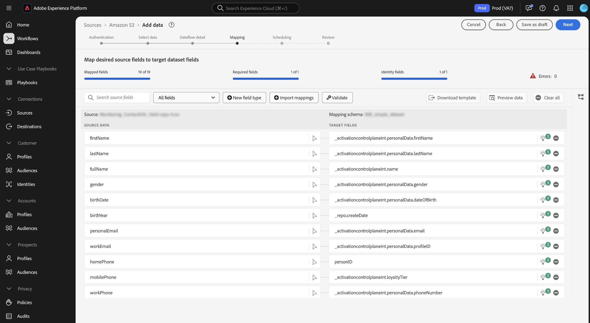

# UI-gids voor gegevenprepress

Lees deze gids om te leren hoe te om [ gegevens prep ](../home.md) kaartfuncties in het gebruikersinterface van Adobe Experience Platform te gebruiken om dossiers in kaart te brengen CSV aan een [ Model van de Gegevens van de Ervaring (XDM) schema ](../../xdm/home.md).

## Aan de slag

Deze zelfstudie vereist een goed begrip van de volgende platformcomponenten:

* [[!DNL Experience Data Model (XDM)]  Systeem ](../../xdm/home.md): Het gestandaardiseerde kader waardoor het Platform gegevens van de klantenervaring organiseert.
   * [ Grondbeginselen van schemacompositie ](../../xdm/schema/composition.md): Leer over de basisbouwstenen van schema&#39;s XDM, met inbegrip van zeer belangrijke principes en beste praktijken in schemacompositie.
   * [ het leerprogramma van de Redacteur van het Schema ](../../xdm/tutorials/create-schema-ui.md): Leer hoe te om douaneschema&#39;s tot stand te brengen gebruikend de Redacteur UI van het Schema.
* [ Dienst van de Identiteit ](../../identity-service/home.md): Verkrijg een betere mening van individuele klanten en hun gedrag door identiteiten over apparaten en systemen te overbruggen.
* [[!DNL Real-Time Customer Profile]](../../profile/home.md): biedt een uniform, real-time consumentenprofiel dat is gebaseerd op geaggregeerde gegevens van meerdere bronnen.
* [ Bronnen ](../../sources/home.md): Experience Platform staat gegevens toe om van diverse bronnen worden opgenomen terwijl het voorzien van u van de capaciteit om, inkomende gegevens te structureren te etiketteren en te verbeteren gebruikend de diensten van het Platform.

## Toegang tot de toewijzingsinterface in de gebruikersinterface

U kunt tot de toewijzingsinterface in UI door twee verschillende wegen toegang hebben.

1. Selecteer in de gebruikersinterface van Experience Platform de optie **[!UICONTROL Workflows]** in de linkernavigatie en selecteer vervolgens **[!UICONTROL Map CSV to XDM schema]** . Geef vervolgens uw gegevens op over de gegevensstroom en selecteer de gegevens die u wilt invoeren. Wanneer gebeëindigd, wordt u genomen aan de toewijzingsinterface waar u afbeelding tussen uw brongegevens en een schema XDM kunt vormen.
2. U kunt tot de toewijzingsinterface door de bronwerkruimte ook toegang hebben.

## CSV-bestanden toewijzen aan een XDM-schema

Gebruik de toewijzingsinterface en de uitgebreide toolset die het verstrekt om gegevensgebieden van uw bronschema aan hun aangewezen doelXDM gebieden in het doelschema met succes in kaart te brengen.

### De toewijzingsinterface {#mapping-interface}

Verwijs naar het dashboard bij de bovenkant van de interface voor informatie over de gezondheid van uw kaartgebieden binnen de context van de innamewerkschema. Op het dashboard worden de volgende gegevens over de toewijzingsvelden weergegeven:

| Eigenschap | Beschrijving |
| --- | --- |
| [!UICONTROL Mapped fields] | Hiermee geeft u het totale aantal bronvelden weer dat aan een doel-XDM-veld is toegewezen, ongeacht fouten. |
| [!UICONTROL Required fields] | Hier wordt het aantal vereiste toewijzingsvelden weergegeven. |
| [!UICONTROL Identity fields] | Hiermee geeft u het totale aantal toewijzingsvelden weer dat als identiteit is gedefinieerd. Deze toewijzingsvelden worden aangegeven met een vingerafdrukpictogram. |
| [!UICONTROL Errors] | Geeft het aantal onjuiste toewijzingsvelden weer. |

{style="table-layout:auto"}

Vervolgens kunt u de opties in de koptekst gebruiken om beter te communiceren met of te filteren op de toewijzingsvelden.

| Optie | Beschrijving |
| --- | --- |
| [!UICONTROL Search source fields] | Gebruik de zoekbalk om naar een specifiek bronveld te navigeren. |
| [!UICONTROL All fields] | Selecteer **[!UICONTROL All fields]** om een vervolgkeuzemenu met opties weer te geven waarmee u de toewijzingen wilt filteren. De beschikbare filteropties omvatten:<ul><li>**[!UICONTROL Required fields]**: Filtert de interface zodat alleen velden worden weergegeven die vereist zijn om de workflow te voltooien.</li><li> **[!UICONTROL Identity fields]**: filtert de interface zodat alleen velden worden weergegeven die zijn gemarkeerd als id&#39;s.</li><li>**[!UICONTROL Mapped fields]**: filtert de interface zodat alleen velden worden weergegeven die al zijn toegewezen.</li><li>**[!UICONTROL Unmapped fields]**: Filtert de interface zodat alleen velden worden weergegeven die nog moeten worden toegewezen.</li><li>**[!UICONTROL Fields with errors]**: filtert de interface zodat alleen velden met fouten worden weergegeven.</li></ul> |
| [!UICONTROL New field type] | Selecteer **[!UICONTROL New field type]** om een nieuw veld of een berekend veld toe te voegen. Voor meer informatie, lees de sectie op [ toevoegend een nieuw gebiedstype ](#add-a-new-field-type). |
| [!UICONTROL Import mappings] | Selecteer **[!UICONTROL Import mappings]** om toewijzingen te importeren uit een bestaand bestand of een bestaande gegevensstroom. Voor meer informatie, lees de sectie over [ het invoeren van afbeeldingen ](#import-mapping). |
| [!UICONTROL Validate] | Selecteer **[!UICONTROL Validate]** om te controleren op fouten in uw toewijzingen. |
| [!UICONTROL Download template] | Selecteer **[!UICONTROL Download template]** om een CSV-bestand met uw toewijzingen te exporteren en te downloaden. |
| [!UICONTROL Preview data] | Selecteer **[!UICONTROL Preview data]** om het voorproefpaneel te gebruiken en de structuur en de inhoud van uw brondataset te inspecteren. |
| [!UICONTROL Clear all] | Selecteer **[!UICONTROL Clear all]** om alle toewijzingen in de interface te verwijderen. |

{style="table-layout:auto"}

### Een nieuw veldtype toevoegen {#add-a-new-field-type}

U kunt een nieuw toewijzingsveld of een berekend veld toevoegen door **[!UICONTROL New field type]** te selecteren.

#### Nieuw toewijzingsveld

Als u een nieuw toewijzingsveld wilt toevoegen, selecteert u **[!UICONTROL New field type]** en selecteert u **[!UICONTROL Add new field]** in het vervolgkeuzemenu dat wordt weergegeven.

Selecteer vervolgens het bronveld dat u wilt toevoegen in het bronschema dat wordt weergegeven en selecteer **[!UICONTROL Select]** .

De toewijzingsinterface wordt bijgewerkt met het bronveld dat u hebt geselecteerd en een leeg doelveld. Selecteer **[!UICONTROL Map target field]** om het nieuwe bronveld toe te wijzen aan het juiste doel-XDM-veld.

Er wordt een interactieve doelschemastructuur weergegeven, waarmee u handmatig door het doelschema kunt bladeren en het juiste doel-XDM-veld voor uw bronveld kunt vinden.

#### Berekende velden {#calculated-fields}

Met berekende velden kunnen waarden worden gemaakt op basis van de kenmerken in het invoerschema. Deze waarden kunnen vervolgens aan kenmerken in het doelschema worden toegewezen en een naam en beschrijving worden gegeven om de referentie eenvoudiger te maken. Berekende velden mogen maximaal 4096 tekens lang zijn.

Als u een berekend veld wilt maken, selecteert u **[!UICONTROL New field type]** en selecteert u vervolgens **[!UICONTROL Add calculated field]**

Het venster **[!UICONTROL Create calculated field]** wordt weergegeven. Gebruik de interface om de berekende velden in te voeren en naar het dialoogvenster links te verwijzen voor ondersteunde velden, functies en operatoren.

| Tabtoets | Beschrijving |
| --- | ----------- |
| [!UICONTROL Function] | Op het tabblad Functies staan de functies die beschikbaar zijn voor het transformeren van de gegevens. Om meer over de functies te leren u binnen berekende gebieden kunt gebruiken, te lezen gelieve de gids op [ gebruikend de functies van de Prep van Gegevens (Mapper) ](../functions.md). |
| [!UICONTROL Field] | Het tabblad Veld bevat velden en kenmerken die beschikbaar zijn in het bronschema. |
| [!UICONTROL Operator] | Het tabblad Operatoren bevat een lijst met operatoren die beschikbaar zijn om de gegevens te transformeren. |

U kunt handmatig velden, functies en operatoren toevoegen met de expressieeditor in het midden. Selecteer de editor om een expressie te maken. Als u klaar bent, selecteert u **[!UICONTROL Save]** om door te gaan.

### Toewijzing importeren {#import-mapping}

U kunt de handmatige configuratietijd van het gegevensinvoerproces verminderen en fouten beperken door de functionaliteit voor het toewijzen van gegevens aan prep te gebruiken. U kunt toewijzingen importeren vanuit een bestaande flow of uit een geëxporteerd bestand.

>[!BEGINTABS]

>[!TAB  de afbeelding van de Invoer van stroom ]

Als u verscheidene gegevensstromen hebt die op gelijkaardige brondossiers en doelschema&#39;s worden gebaseerd, dan kunt u bestaande afbeelding invoeren en hen voor nieuwe gegevensstromen opnieuw gebruiken.

Als u toewijzingen wilt importeren uit een bestaande gegevensstroom, selecteert u **[!UICONTROL Import mappings]** en selecteert u vervolgens **[!UICONTROL Import mapping from flow]** .

Vervolgens gebruikt u het pop-upvenster om de gegevensstroom te zoeken waarvan u de toewijzing wilt importeren. Tijdens deze stap, kunt u de onderzoeksfunctie ook gebruiken om een specifieke gegevensstroom te isoleren en het terug te winnen het in kaart brengt. Selecteer **[!UICONTROL Select]** als u klaar bent.

>[!TAB  de afbeelding van de Invoer van dossier ]

In sommige gevallen moet u mogelijk een groot aantal toewijzingen voor uw gegevens implementeren. U kunt dit handmatig doen met de toewijzingsinterface, maar u kunt ook uw toewijzingssjabloon exporteren en uw toewijzingen op een offline werkblad configureren om tijd te besparen en gebruikerstijden op Experience Platform te voorkomen.

Als u toewijzingen wilt importeren uit een geëxporteerd bestand, selecteert u **[!UICONTROL Import mappings]** en selecteert u vervolgens **[!UICONTROL Import mapping from file]** .

Gebruik vervolgens het venster [!UICONTROL Upload template] om een CSV-kopie van uw toewijzingen te downloaden. Vervolgens kunt u uw toewijzingen lokaal op uw apparaat configureren met behulp van software die het bewerken van CSV-bestandstypen ondersteunt. Tijdens deze stap, moet u ervoor zorgen dat u slechts de gebieden gebruikt die in uw brondossier en doelschema worden verstrekt.

+++Selecteren om een voorbeeld van een geëxporteerd toewijzingsbestand weer te geven

+++

Als u klaar bent, selecteert u **[!UICONTROL Upload file]** en selecteert u het bijgewerkte CSV-bestand van uw toewijzingen. Wacht een korte tijd tot het systeem is verwerkt en selecteer vervolgens **[!UICONTROL Done]** .

>[!ENDTABS]

Als de toewijzingen zijn voltooid, kunt u nu **[!UICONTROL Finish]** selecteren en doorgaan naar de volgende stap om de gegevensstroom te voltooien.

## Volgende stappen

U kunt nu een CSV-bestand met succes toewijzen aan een doel-XDM-schema met behulp van de toewijzingsinterface in de gebruikersinterface van Experience Platform. Lees de volgende documenten voor meer informatie:

* [Overzicht van Data Prep](../home.md)
* [Overzicht van bronnen](../../sources/home.md)
* [Gegevensstromen van bronnen controleren in de UI](../../dataflows/ui/monitor-sources.md)
