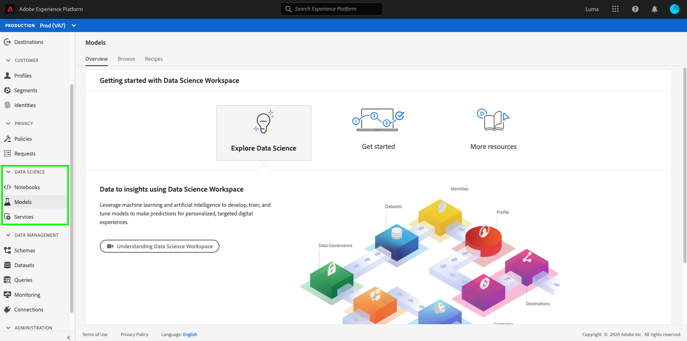

# Toegang tot en functies van Data Science Workspace

Het volgende document schetst de toestemmingen van de Werkruimte van de Wetenschap van Gegevens en toegang tot eigenschappen.

- **Laptops:** Verstrekt een interactieve ontwikkelomgeving ([JupyterLab](./jupyterlab/overview.md)) om, uw gegevens op Experience Platform te onderzoeken te analyseren en te modelleren.
- **Modellen:** biedt gereedschappen waarmee u geavanceerde methoden en modellen voor machinaal leren kunt maken, publiceren en opslaan. Voor meer informatie gaat u naar de zelfstudie [Een model voor machinetlering maken en publiceren](./models-recipes/create-publish-model.md).
- **Services:** Bevat zowel door Adobe geleverde services, zoals  [Intelligente ](../intelligent-services/home.md) services, als aangepaste services die u hebt gemaakt met de werkruimte voor wetenschap van gegevens.

Waarom zie ik slechts het lusje van de Diensten?

- Uw organisatie mag alleen recht hebben op RTCDP (Real-Time Customer Data Platform), dat de Intelligent Service Customer AI omvat.

Als u om het even welke **Gegevens Wetenschap** lusjes niet kunt zien en wenst om de eigenschappen van de Werkruimte van de Wetenschap van Gegevens te gebruiken, contacteer uw bedrijfbeheerder om te controleren of hebt u een vergunning van de Intelligentie van Adobe Experience Platform.

## Toevoeging Adobe Experience Platform Intelligence-pakket

In de volgende tabel worden enkele belangrijke verschillen voor de Data Science Workspace beschreven, met en zonder het addon-pakket voor Adobe Experience Platform Intelligence:

>[!NOTE]
>
>U kunt meer dan één pakket van de Intelligentie goedkeuring verlenen en de verhoogde capaciteit wordt toegevoegd aan uw algemene recht. Als u bijvoorbeeld een licentie hebt verleend voor 2 toevoeging aan het Adobe Experience Platform Intelligence-pakket, hebt u recht op in totaal 20 gelijktijdige gebruikers van laptops.

|  | [!DNL Data Science Workspace] | [!DNL Data Science Workspace] met toevoeging van het inlichtingenpakket |
| --- | :---: | :---: |
| Aantal ondersteunde laptopgebruikers. | 5 gelijktijdige gebruikers | Met het eerste pakket worden 5 gelijktijdige gebruikers toegevoegd en met extra aankopen worden 10 gelijktijdige gebruikers per pakket toegevoegd. |
| Hiermee worden geïntegreerde Jupyter-laptops toegestaan voor verkennende gegevensanalyse en modelontwerp (R, Python, Scala, PySpark) | X | X |
| Geïntegreerde integratie met Query-service. Mogelijkheid om gegevenssets te verkennen en vorm te geven met SQL in notebooks. | X | X |
| Toegang tot vooraf gebouwde laptopsjablonen voor voorspellende analyse. | X | X |
| Teken handmatig modellen met Jupyter-laptops en scoren deze. | X | X |
| Implementeer en operationele modellen met de mogelijkheid om trainingen te plannen en taken te evalueren. |  | X |
| Ontvang een framework om modellen eenvoudig te configureren, te evalueren, op te leiden, te scoren en te publiceren in productie. |  | X |
| Door de gebruikersinterface gestuurde modelexperimenten en -evaluaties. |  | X |
| Diepe leerondersteuning voor Tensorflow-modellen (GPU Compute). |  | X |
| Op parken gebaseerde verdeelde computer om te trainen en tegen grote datasets (10MM + rijen) te scoren. |  | X |

## Toegangsbeheer

Toegangsbeheer voor Experience Platform wordt beheerd via de [Adobe Admin Console](https://adminconsole.adobe.com). Deze functionaliteit gebruikt productprofielen in Admin Console, die gebruikers met toestemmingen en zandbakken verbinden. Zie [toegangsbeheeroverzicht](../access-control/home.md) voor meer informatie.

Om de Werkruimte van de Wetenschap van Gegevens te gebruiken, moet de toestemming &quot;van de Werkruimte van de Wetenschap van Gegevens&quot;worden toegelaten. In de volgende tabel worden de effecten weergegeven van het inschakelen of uitschakelen van deze machtiging:

| Machtiging | Ingeschakeld | Uitgeschakeld |
|---|---|---|
| Werkruimte voor gegevenswetenschap beheren | Verleent toegang tot alle diensten in de Werkruimte van de Wetenschap van Gegevens. | API- en UI-toegang tot alle services in de Data Science Workspace is uitgeschakeld. Als **Laptops**, **Modellen** en **Services** zijn uitgeschakeld, is het selecteren van de pagina&#39;s  niet mogelijk. <li>Toegang tot **Services** is mogelijk nog steeds beschikbaar via Real-time Customer Data Platform (RTCDP).</li> |

## Sandbox-ondersteuning

Sandboxen zijn virtuele partities binnen één instantie van Experience Platform. Elke instantie van het Platform steunt één productie zandbak en veelvoudige niet productiesandboxes, elk handhaven zijn eigen bibliotheek van Platform middelen. Met niet-productiesandboxen kunt u functies testen, experimenten uitvoeren en aangepaste configuraties maken zonder dat dit invloed heeft op de productiesandbox. Zie het [overzicht van sandboxen](../sandboxes/home.md) voor meer informatie over sandboxen.

Momenteel geldt voor de Data Science Workspace de volgende sandbox-beperking:

- Compute resources worden gedeeld door de productiesandbox en niet-productiesandboxen.

## Volgende stappen

Dit document schetste de verschillende soorten toegang en eigenschappen beschikbaar in de Werkruimte van de Wetenschap van Gegevens.

Om meer over de Werkruimte van de Wetenschap van Gegevens, zoals een volledig werkschema van dag tot dag te leren, te beginnen door [de werkruimteanalyse van de Wetenschap van Gegevens](./walkthrough.md) te lezen. Voor meer algemene informatie, bezoek [Overzicht van de Werkruimte van de Wetenschap van Gegevens](./home.md).