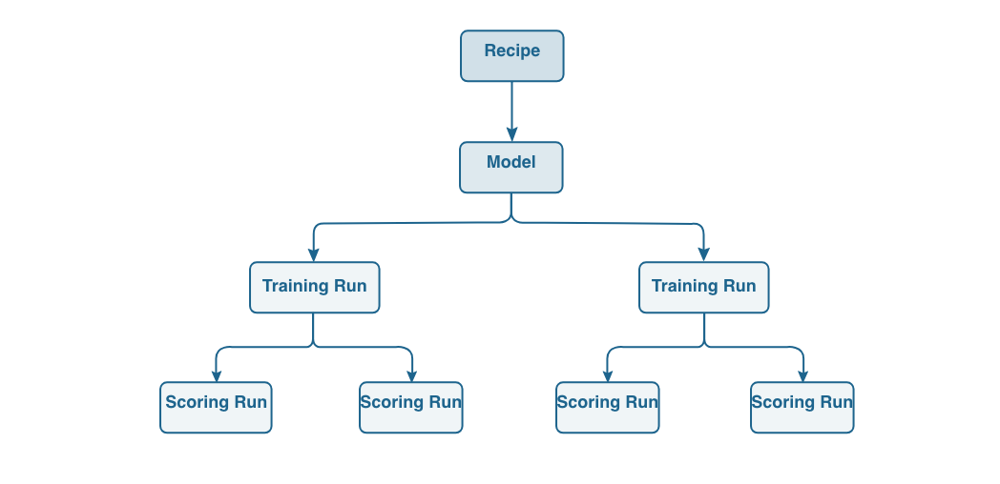
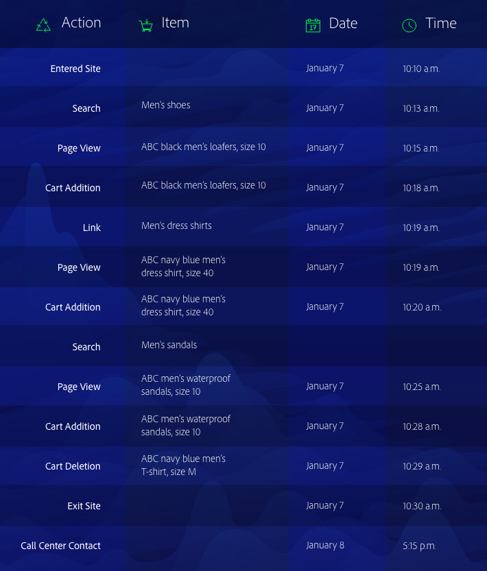

# Overzicht van de Data Science Workspace

De Werkruimte van de Wetenschap van de Gegevens van het Platform van Adobe gebruikt machine het leren en kunstmatige intelligentie om inzichten van uw gegevens te onthullen. De Data Science Workspace is geïntegreerd in het Adobe Experience Platform en helpt u om voorspellingen te maken met behulp van uw inhoud en gegevenselementen voor alle Adobe-oplossingen.

Gegevenswetenschappers van alle vaardigheidsniveaus zullen geavanceerde, makkelijk te gebruiken hulpmiddelen vinden die snelle ontwikkeling, opleiding, en het stemmen van machine het leren recepten steunen - alle voordelen van AI technologie, zonder de ingewikkeldheid.

Met de Werkruimte van de Wetenschap van Gegevens, kunnen de gegevenswetenschappers intelligente diensten APIs gemakkelijk tot stand brengen - aangedreven door machine het leren. Deze services werken samen met andere Adobe-services, waaronder Adobe Target en Adobe Analytics Cloud, om u te helpen persoonlijke, doelgerichte digitale ervaringen te automatiseren voor web-, desktop- en mobiele apps.

Deze gids verstrekt een overzicht de belangrijkste concepten met betrekking tot de Werkruimte van de Wetenschap van Gegevens.

## Inleiding

De onderneming van vandaag plaatst een hoge prioriteit op het ontginnen van grote gegevens voor voorspellingen en inzichten die hen zullen helpen klantenervaringen personaliseren en meer waarde aan klanten - en aan de zaken leveren.
Hoe belangrijk het ook is, het overstappen van gegevens naar inzichten kan hoge kosten met zich meebrengen. Meestal vereist het deskundige gegevenswetenschappers die intensief en tijdrovend gegevensonderzoek uitvoeren om machinaal leermodellen te ontwikkelen, of recepten, die intelligente diensten aandrijven. Het proces is lang, de technologie is complex, en deskundige gegevenswetenschappers kunnen moeilijk te vinden zijn.

Met de Werkruimte van de Wetenschap van Gegevens, staat het Platform van de Ervaring van Adobe u toe om ervaring-gerichte AI over de onderneming te brengen, die gegevens-aan-inzichten-aan-code stroomlijnt en versnelt met:
- Een framework voor machinetlering en runtime
- Geïntegreerde toegang tot uw gegevens die zijn opgeslagen in het Adobe Experience Platform
- Een verenigd gegevensschema dat is gebaseerd op het XDM (Experience Data Model)
- De verwerkingskracht die essentieel is voor het leren van machines/AI en het beheren van grote datasets
- Prebuilt machine het leren recepten om de sprong in AI gedreven ervaringen te versnellen
- Vereenvoudigd ontwerp, hergebruik en wijziging van recepten voor gegevenswetenschappers met verschillende vaardigheidsniveaus
- Intelligente het de dienstpubliceren en delen in slechts een paar klikken - zonder een ontwikkelaar - en controle en herscholing voor ononderbroken optimalisering van gepersonaliseerde klantenervaringen

Gegevenswetenschappers van alle vaardigheidsniveaus zullen sneller en effectievere digitale ervaringen bereiken.

## Aan de slag

Voordat u de details van de Data Science Workspace gaat bekijken, volgt een korte samenvatting van de belangrijkste termen:

| Term | Definitie |
|---------------------|------------------------------------------------------------------------------------------------------------------------------------------------------------------------------------------------------------------------------------------------------------------------------------------------------------------------------------------------------------------------------------------------------------------------------------------------------------------|
| Werkruimte voor gegevenswetenschap | De werkruimte van de Wetenschap van gegevens binnen het Platform van de Ervaring laat klanten toe om machine het leren modellen tot stand te brengen die gegevens over het platform van de Ervaring gebruiken en de Oplossingen van Adobe om intelligente inzichten en voorspellingen te produceren om heerlijke eindgebruiker digitale ervaringen te wekken. |
| Kunstmatige intelligentie | Kunstmatige intelligentie is een theorie en ontwikkeling van computersystemen die taken kunnen uitvoeren die normaal menselijke intelligentie vereisen, zoals visuele waarneming, spraakherkenning, besluitvorming en vertaling tussen talen. |
| Machine leren | Het leren van de machine is het gebied van studie dat computers de capaciteit toelaat om te leren zonder uitdrukkelijk geprogrammeerd te zijn. |
| Sensei ML Framework | Sensei ML Framework is een uniform computerleerframework voor heel Adobe dat gegevens over het Experience Platform gebruikt om gegevenswetenschappers in staat te stellen op een snellere, schaalbare en herbruikbare manier computerleergestuurde inlichtingendiensten te ontwikkelen. |
| Experience Data Model | Experience Data Model (XDM) is de standaardinspanning die Adobe levert om standaardschema&#39;s zoals Profiel en ExperienceEvent te definiëren voor Customer Experience Management. |
| JupyterLab | JupyterLab is een opensource webinterface voor Project Jupyter en is nauw geïntegreerd in het Experience Platform. |
| Ontvangers | Een recept is de term van Adobe voor een modelspecificatie en is een container van het hoogste niveau die een specifiek machine het leren, AI algoritme of een samenstel van algoritmen, verwerkingslogica, en configuratie vertegenwoordigt die wordt vereist om een opgeleid model te bouwen en uit te voeren en daardoor helpen specifieke bedrijfsproblemen oplossen. |
| Model | Een model is een geval van een machine het leren recept dat gebruikend historische gegevens en configuraties wordt opgeleid om voor een bedrijfs geval op te lossen. |
| Training | Training is het proces van leerpatronen en inzichten van gelabelde gegevens. |
| Gevolgd model | Een getraind model vertegenwoordigt de uitvoerbare output van een model opleidingsproces, waarin een reeks opleidingsgegevens werd toegepast op de modelinstantie. Een opgeleid model zal een verwijzing naar om het even welke Intelligente Dienst van het Web handhaven die van het wordt gecreeerd. Het getrainde model is geschikt voor het scoren en maken van een intelligente webservice. Wijzigingen in een getraind model kunnen als een nieuwe versie worden bijgehouden. |
| Scores | Scores is het proces om inzichten van gegevens te produceren gebruikend een opgeleid model. |
| Service | Een geïmplementeerde service stelt functies van een kunstmatige intelligentie, een model voor machinaal leren of een geavanceerd algoritme via een API beschikbaar, zodat het door andere services of toepassingen kan worden gebruikt om intelligente apps te maken. |

De volgende grafiek schetst de hiërarchische verhouding tussen Ontvangers, Modellen, de Looppas van de Opleiding, en het Scorelooppas.

## Werkruimte voor gegevenswetenschap

Met de Werkruimte van de Wetenschap van Gegevens, kunnen uw gegevenswetenschappers het lastige proces stroomlijnen om inzichten in grote datasets te ontdekken. De Data Science Workspace is gebaseerd op een gemeenschappelijk raamwerk voor machinaal leren en op runtime en biedt geavanceerd workflowbeheer, modelbeheer en schaalbaarheid. Intelligente services bieden ondersteuning voor het hergebruik van recepten voor machinaal leren, zodat verschillende toepassingen die met Adobe-producten en -oplossingen zijn gemaakt, van kracht zijn.

### Toegang tot gegevens met één stop

Gegevens zijn de hoeksteen van het leren van AI en machines.

De Werkruimte van de Wetenschap van gegevens is volledig geïntegreerd met het Platform van de Ervaring van Adobe, met inbegrip van het meer van Gegevens, het Profiel van de Klant in real time, en Verenigde Rand. Onderzoek al uw organisatorische gegevens die in het Platform van de Ervaring van Adobe tegelijkertijd, samen met gemeenschappelijke grote gegevens en diepe het leren bibliotheken, zoals Spark ML en TensorFlow worden opgeslagen. Als u niet vindt wat u nodig hebt, neemt uw eigen datasets op gebruikend het XDM gestandaardiseerde schema.

### Prebuilt machine het leren recepten

De Werkruimte van de Wetenschap van gegevens omvat prebuilt machine het leren recepten voor gemeenschappelijke bedrijfsbehoeften, zoals de voorspelling van de detailhandel en anomalieopsporing, zodat gegevenswetenschappers en ontwikkelaars niet van kras hoeven te beginnen. Er worden momenteel drie recepten aangeboden: [productaankoopprognose](./pre-built-recipes/product-purchase-prediction.md), [productaanbevelingen](./pre-built-recipes/product-recommendations.md)en [detailverkoop](./pre-built-recipes/retail-sales.md).

[//]: # (The built-in recipe gallery offers recommendations for prebuilt recipes based on your business needs.)

U kunt desgewenst een vooraf samengesteld recept aanpassen aan uw behoeften, een recept importeren of helemaal opnieuw beginnen om een aangepast recept te maken. Maar als je eenmaal begint met het trainen en afstemmen van een recept, is het maken van een aangepaste intelligente service geen ontwikkelaar nodig - slechts een paar klikken en je bent klaar om een gerichte, gepersonaliseerde digitale ervaring op te bouwen.

### Werkschema gericht op de gegevenswetenschapper

Ongeacht uw expertise op het gebied van gegevenswetenschap helpt de Data Science Workspace het zoeken naar inzichten in gegevens te vereenvoudigen en te versnellen en deze toe te passen op digitale ervaringen.

### Gegevensexploratie

Het vinden van de juiste gegevens en het voorbereiden ervan is het meest arbeidsintensieve onderdeel van het opbouwen van een effectief recept. Met de Data Science Workspace en het Adobe Experience Platform kunt u sneller van gegevens naar inzichten gaan.

Op het Adobe Experience Platform worden uw kanaalgegevens gecentraliseerd en opgeslagen in het gestandaardiseerde XDM-schema, zodat gegevens eenvoudiger te vinden, te begrijpen en schoon zijn. Één enkele opslag van gegevens die op een gemeenschappelijk schema worden gebaseerd kan u ontelbare uren van gegevensexploratie en voorbereiding besparen.

Terwijl u bladert, gebruikt u R, Python of Scala met de geïntegreerde, gehoste Jupyter-laptop om door de gegevenscatalogus op het platform te bladeren. Gebruikend één van deze talen, kunt u uit XML van de Vonk en TensorFlow ook voordeel halen. Begin helemaal opnieuw of gebruik een van de laptopsjablonen voor specifieke bedrijfsproblemen.

Als onderdeel van de workflow voor gegevensverkenning kunt u ook nieuwe gegevens invoeren of bestaande functies gebruiken voor de voorbereiding van gegevens.

### Authoring

Met de Werkruimte van de Wetenschap van Gegevens, beslist u hoe u recepten wilt ontwerpen.

- Bespaar tijd door te bladeren naar een vooraf samengesteld recept dat aan uw bedrijfsbehoeften voldoet, dat u kunt gebruiken zoals is of vormen om aan uw specifieke vereisten te voldoen.
- Maak een geheel nieuw recept en gebruik de ontwerpruntime in Jupyter Notebook om het recept te ontwikkelen en te registreren.
- Upload een recept dat buiten het Adobe Experience Platform is ontworpen naar Data Science Workspace of importeer recept code uit een opslagplaats, zoals Git, met behulp van de verificatie en integratie die beschikbaar zijn tussen Git en Data Science Workspace.

### Experimentatie

De Werkruimte van de Wetenschap van gegevens brengt enorme flexibiliteit aan het experimentatieproces. Begin met je recept. Maak vervolgens een aparte instantie met hetzelfde kernalgoritme en unieke kenmerken, zoals hyper-tuning-parameters. U kunt zo veel instanties maken als u nodig hebt, elke instantie zo vaak trainen en scoren als u wilt. Terwijl u ze traint, houdt de Werkruimte van de Wetenschap van Gegevens recepten, recepteninstanties, en opgeleide instanties bij, samen met evaluatiemetriek, zodat hoeft u het niet te doen.

### Operationalisatie

Als je tevreden bent met je recept, is het slechts een paar klikken om een intelligente dienst te creëren. Geen codering vereist - u kunt het zelf doen zonder een ontwikkelaar of technicus in te schrijven. Tot slot publiceert u de intelligente service naar Adobe IO en is deze klaar voor gebruik door uw team voor digitale ervaring.

<!--You can also publish your intelligent service to the Service Gallery, where it's available to specific people, specific organizations, or everyone who develops data solutions on Adobe Experience Platform. You can even share it with your external partners, and they can share their intelligent service with you. And the next time you're starting a new recipe, you can check the Service Gallery to see if there's a similar intelligent service you can use to get started. -->

### Continue verbetering

De Werkruimte van de Wetenschap van gegevens volgt waar de intelligente diensten worden aangehaald en hoe zij presteren. Terwijl de gegevens worden doorgegeven, kunt u de nauwkeurigheid van de intelligente service beoordelen om de lus te sluiten en de recepten zo nodig opnieuw trainen om de prestaties te verbeteren. Het resultaat is een voortdurende verfijning van de nauwkeurigheid van klantpersonalisatie.

### Toegang tot nieuwe functies en datasets

Gegevenswetenschappers kunnen profiteren van nieuwe technologieën en gegevenssets zodra deze beschikbaar zijn via Adobe-services. Door regelmatige updates, doen wij het werk om datasets en technologieën in het platform te integreren, zodat moet u niet.

### Toegangsbeheer in de werkruimte voor gegevenswetenschap

Toegangsbeheer voor Experience Platform wordt beheerd via de [Adobe Admin Console](https://adminconsole.adobe.com). Deze functionaliteit maakt gebruik van productprofielen in Admin Console, die gebruikers met toestemmingen en zandbakken verbinden. Zie het [toegangsbeheeroverzicht](../access-control/home.md) voor meer informatie.

>[!IMPORTANT] Om de Werkruimte van de Wetenschap van Gegevens te gebruiken, moet de toestemming &quot;van de Werkruimte van de Wetenschap van Gegevens&quot;worden toegelaten.

In de volgende tabel worden de effecten weergegeven van het inschakelen of uitschakelen van deze machtiging:

| Machtiging | Ingeschakeld | Uitgeschakeld |
|---|---|---|
| Werkruimte voor gegevenswetenschap beheren | Verleent toegang tot alle diensten in de Werkruimte van de Wetenschap van Gegevens. | API- en UI-toegang tot alle services in de Data Science Workspace is uitgeschakeld. Terwijl gehandicapt, wordt het verpletteren aan de *Modellen* van de Werkruimte van de Wetenschap van Gegevens en de pagina&#39;s van de *Diensten* verhinderd. |

### Veiligheid en gemoedsrust

Het beveiligen van uw gegevens is een topprioriteit voor Adobe. Adobe beschermt uw gegevens met beveiligingsprocessen en -besturingselementen die zijn ontwikkeld om te voldoen aan door de branche aanvaarde standaarden, regels en certificeringen.

De beveiliging is ingebouwd in software en services als onderdeel van de levenscyclus van het Adobe Secure Product.
Ga naar de beveiligingspagina op https://www.adobe.com/security.html voor meer informatie over de beveiliging van Adobe-gegevens en -software, compatibiliteit en meer.

### Sandbox-ondersteuning

Sandboxen zijn virtuele partities binnen één exemplaar van Experience Platform. Elke instantie van het Platform steunt één productie zandbak en veelvoudige niet productie zandbakken, elk handhaven zijn eigen bibliotheek van de middelen van het Platform. Met niet-productiesandboxen kunt u functies testen, experimenten uitvoeren en aangepaste configuraties maken zonder dat dit invloed heeft op de productiesandbox. Zie het [sandboxoverzicht](../sandboxes/home.md)voor meer informatie over sandboxen.

Op dit moment gelden voor de Data Science Workspace enkele sandboxbeperkingen:

- Compute resources worden gedeeld door de productiesandbox en niet-productiesandboxen. De isolatie voor productiesandboxen is in de toekomst gepland.
- De werklasten Scala/Spark en PySpark voor zowel laptops als recepten worden momenteel alleen ondersteund in de productiesandbox. In de toekomst zal steun worden verleend voor niet-productiesandboxen.

## Werkruimte voor gegevenswetenschap in actie

De voorspellingen en de inzichten verstrekken de informatie u nodig hebt om een hoogst gepersonaliseerde ervaring aan elke klant te leveren die uw website bezoekt, uw callcenter contacteert, of aan andere digitale ervaringen aangaat. Dit is hoe uw dagelijkse werk met de Werkruimte van de Wetenschap van Gegevens gebeurt.

### Het probleem definiëren

Het begint allemaal met een bedrijfsprobleem. Bijvoorbeeld, heeft een online callcenter context nodig om hen te helpen een negatief klantensentiment positief veranderen.

Er zijn genoeg gegevens over de klant. Ze hebben op de site gebladerd, items in hun winkelwagentje gezet en zelfs bestellingen geplaatst. Ze hebben mogelijk eerder e-mails ontvangen, coupons gebruikt of contact opgenomen met het callcenter. Het recept moet dan de beschikbare gegevens over de klant en zijn activiteiten gebruiken om te bepalen of hij geneigd is een aanbod te kopen en aan te bevelen dat de klant waarschijnlijk zal waarderen en gebruiken.

Op het tijdstip van het contact van het callcenter, heeft de klant nog twee paar schoenen in de kar, maar verwijder een shirt. Met deze informatie, zou de intelligente dienst kunnen adviseren dat de agent van het vraagcentrum een coupon voor 20% van schoenen tijdens de vraag aanbiedt. Als de klant de coupon gebruikt, wordt die informatie toegevoegd aan de dataset en worden de voorspellingen nog beter de volgende keer de klantenvraag.

### De gegevens verkennen en voorbereiden

Op basis van het gedefinieerde bedrijfsprobleem weet u dat het recept alle webtransacties van de klant moet bekijken, zoals bezoeken op de site, zoekopdrachten, paginaweergaven, geklikte koppelingen, cartacties, ontvangen aanbiedingen, ontvangen e-mails, interacties tussen callcenters enzovoort.

Een gegevenswetenschapper besteedt doorgaans tot 75% van de tijd die nodig is om een recept te maken voor het verkennen en transformeren van de gegevens. De gegevens komen vaak uit veelvoudige bewaarplaatsen en worden bewaard in verschillende schema&#39;s - het moet worden gecombineerd en in kaart gebracht alvorens het kan worden gebruikt om een recept tot stand te brengen.

[//]: # (Your first step is to check the recipe gallery to see if an existing recipe meets your needs, or comes close. An alternative is to import a recipe you created outside of Adobe Experience Platform. Starting with an existing recipe often streamlines the data exploration phase and makes it easier for a data scientist.)

Als u van kras begint of een bestaand recept vormt, begint u uw gegevensonderzoek in een gecentraliseerde en gestandaardiseerde gegevenscatalogus voor uw organisatie, die de jacht aanzienlijk vereenvoudigt. Misschien zult u zelfs zien dat een andere gegevenswetenschapper in uw organisatie al een vergelijkbare dataset heeft geïdentificeerd, en verkiest om die dataset te verfijnen eerder dan van kras te beginnen.
Alle gegevens in het Adobe Experience Platform voldoen aan een gestandaardiseerd XDM-schema, waardoor het niet nodig is om een complex model te maken voor het samenvoegen van gegevens of hulp te krijgen van een data engineer.

Als u niet onmiddellijk de gegevens vindt u wenst, maar het bestaat buiten het Platform van de Ervaring van Adobe, is het een vrij eenvoudige taak om extra datasets in te voeren, die ook in het gestandaardiseerde XDM schema zal omzetten.\
U kunt Jupyter-laptop gebruiken om de verwerking van gegevens te vereenvoudigen, mogelijk te beginnen met een laptopsjabloon of een laptop die u eerder hebt gebruikt als koopkracht.

### Auteur van het recept

Als u al een recept hebt gevonden dat aan al uw behoeften voldoet, kunt u verdergaan met experimenteren. Of u kunt het recept een beetje wijzigen of een geheel nieuw recept maken - u kunt profiteren van de ontwerpruntime voor de Data Science Workspace in Jupyter-laptop. Als u de ontwerpruntime gebruikt, weet u zeker dat u de workflow voor het trainen en scoren van de Data Science Workspace kunt gebruiken en het recept later kunt omzetten zodat het door anderen in uw organisatie kan worden opgeslagen en hergebruikt.

U kunt ook een recept importeren in de Werkruimte van de Wetenschap van Gegevens en voordeel halen uit de experimentatiewerkschema&#39;s aangezien u uw intelligente dienst creeert.

### Experimenteer met het recept

Met een recept dat uw kernalgoritmen voor machinaal leren omvat, kunnen vele recept instanties met één enkel recept worden gecreeerd. Deze recept-varianten worden modellen genoemd. Een model vereist training en evaluatie om de operationele efficiëntie en effectiviteit ervan te optimaliseren, een proces dat meestal bestaat uit vallen en fouten.

Tijdens het trainen van uw modellen worden trainingsreeksen en evaluaties gegenereerd. De Werkruimte van de Wetenschap van gegevens houdt spoor van evaluatiemetriek voor elk uniek model en hun opleidingslooppas. De metriek van de evaluatie die door experimentatie wordt geproduceerd zal u toestaan om de trainingslooppas te bepalen die het best presteert.

Ga naar [deze sectie](https://www.adobe.io/apis/experienceplatform/home/tutorials/data-science-workspace/dsw-tutorials/trainmodel.html) voor zelfstudies over het trainen en evalueren van modellen in de Werkruimte van de Wetenschap van Gegevens.

### Het model opereren

Wanneer u het beste getrainde recept hebt geselecteerd om aan uw bedrijfsbehoeften te voldoen, kunt u een intelligente dienst in de Werkruimte van de Wetenschap van Gegevens zonder ontwikkelaarshulp tot stand brengen. Het is slechts een paar klikken - geen codering vereist. Een gepubliceerde intelligente dienst is toegankelijk voor andere leden van uw organisatie zonder de behoefte om het model te ontspannen.

Een gepubliceerde intelligente dienst is configureerbaar om zich van tijd tot tijd automatisch op te leiden gebruikend nieuwe gegevens aangezien zij beschikbaar worden. Dit zorgt ervoor dat uw service efficiënt en efficiënt blijft wanneer de tijd doorgaat.

## Volgende stappen

De Werkruimte van de Wetenschap van Gegevens helpt de werkstroom van de gegevenswetenschap, van gegevens het verzamelen tot algoritmen aan intelligente diensten, voor gegevenswetenschappers van alle vaardigheidsniveaus stroomlijnen en vereenvoudigen. Met de geavanceerde hulpmiddelen verstrekt de Werkruimte van de Wetenschap van Gegevens, kunt u de tijd van gegevens aan inzichten beduidend verkorten.

Belangrijker nog, de Werkruimte van de Wetenschap van Gegevens zet de mogelijkheden van de gegevenswetenschap en algoritmische optimalisering van het toonaangevende marketing platform van Adobe in de handen van de wetenschappers van ondernemingsgegevens. Voor het eerst kunnen bedrijven bedrijfseigen algoritmen op het platform toepassen, waarbij ze profiteren van de krachtige functies van Adobe voor het leren van machines en AI om zeer persoonlijke klantervaringen op grote schaal te bieden.

Met het huwelijk van merkdeskundigheid en het machine leren van Adobe en AI vooruitgang, hebben de ondernemingen de macht om meer bedrijfswaarde en merkloyaliteit te drijven door klanten te geven wat zij willen, alvorens zij om het vragen.

Voor aanvullende informatie, zoals een volledige dagelijkse workflow, begint u met het lezen van de documentatie van de [Data Science Workspace-doorloop](./walkthrough.md) .

## Aanvullende bronnen

De volgende video is ontworpen om uw begrip van de Werkruimte van de Wetenschap van Gegevens te steunen.

>[!VIDEO](https://video.tv.adobe.com/v/30567?quality=12&amp;enable10seconds=on&amp;speedcontrol=on)

