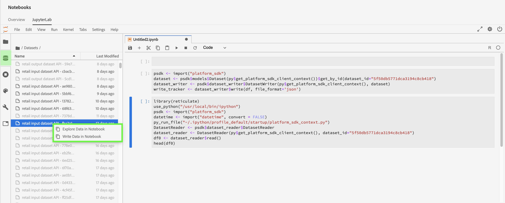
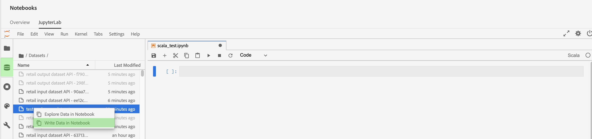

# Toegang tot gegevens in [!DNL Jupyterlab] laptops

Elke ondersteunde kernel biedt ingebouwde functies waarmee u gegevens van een Platform in een notitieboekje kunt lezen. Momenteel ondersteunt JupyterLab in de Adobe Experience Platform Data Science Workspace laptops voor [!DNL Python], R, PySpark en Scala. Ondersteuning voor paginering van gegevens is echter beperkt tot [!DNL Python]- en R-laptops. Deze handleiding is gericht op het gebruik van JupyterLab-laptops voor toegang tot uw gegevens.

## Aan de slag

Voordat u deze handleiding leest, raadpleegt u de [[!DNL JupyterLab] gebruikershandleiding](./overview.md) voor een inleiding op hoog niveau op [!DNL JupyterLab] en de rol ervan in de werkruimte voor wetenschap van gegevens.

## Gegevenslimieten voor laptops {#notebook-data-limits}

>[!IMPORTANT]
>
>Voor PySpark- en Scala-laptops als u een fout ontvangt met de reden &quot;Remote RPC client disassociated&quot;. Dit betekent doorgaans dat de bestuurder of een uitvoerder onvoldoende geheugen heeft. Schakel over naar [&quot;batch&quot;-modus](#mode) om deze fout op te lossen.

De volgende informatie definieert de maximale hoeveelheid gegevens die kan worden gelezen, het type gegevens dat is gebruikt en het geschatte tijdsbestek waarin de gegevens worden gelezen.

Voor [!DNL Python] en R, werd een notitieboekjecerver die bij 40GB RAM werd gevormd gebruikt voor de benchmarks. Voor PySpark en Scala, werd een gegevensbestandcluster gevormd bij 64GB RAM, 8 kernen, 2 DBU met een maximum van 4 arbeiders gebruikt voor de hieronder vermelde benchmarks.

De gegevens in het ExperienceEvent-schema die werden gebruikt, varieerden van 100 (1K) rijen die oplopen tot 1 miljard (1B) rijen. Merk op dat voor PySpark en [!DNL Spark] metriek, een datumspanwijdte van 10 dagen werd gebruikt voor de gegevens XDM.

De ad-hocschemagegevens zijn vooraf verwerkt met [!DNL Query Service] Tabel maken als selectie (CTAS). Deze gegevens varieerden ook in grootte die van duizend (1K) rijen die zich tot één miljard (1B) rijen uitstrekten.

### Wanneer wordt de batchmodus gebruikt in combinatie met de interactieve modus {#mode}

Wanneer het lezen van datasets met PySpark en Nota&#39;s Scala, hebt u de optie om interactieve wijze of partijwijze te gebruiken om de dataset te lezen. Interactief wordt gemaakt voor snelle resultaten terwijl de partijwijze voor grote datasets is.

- Voor PySpark- en Scala-laptops moet de batchmodus worden gebruikt wanneer 5 miljoen rijen gegevens of meer worden gelezen. Voor meer informatie over de efficiency van elke wijze, zie [PySpark](#pyspark-data-limits) of [Scala](#scala-data-limits) hieronder lijsten van de gegevensgrens.

### [!DNL Python] gegevenslimieten voor laptops

**XDM ExperienceEvent-schema:** U moet maximaal 2 miljoen rijen (~6,1 GB gegevens op schijf) met XDM-gegevens kunnen lezen in minder dan 22 minuten. Als u extra rijen toevoegt, kunnen er fouten optreden.

| Aantal rijen | 1 K | 10 kB | 100 K | 1M | 2 MB |
| ----------------------- | ------ | ------ | ----- | ----- | ----- |
| Grootte op schijf (MB) | 18,73 | 187,5 | 308 | 3000 | 6050 |
| SDK (in seconden) | 20,3 | 86,8 | 63 | 659 | 1315 |

**ad-hocschema:** U moet maximaal 5 miljoen rijen (~5,6 GB gegevens op schijf) niet-XDM (ad-hoc) gegevens in minder dan 14 minuten kunnen lezen. Als u extra rijen toevoegt, kunnen er fouten optreden.

| Aantal rijen | 1 K | 10 kB | 100 K | 1M | 2 MB | 3 MB | 5 MB |
| ----------------------- | ------- | ------- | ----- | ----- | ----- | ----- | ------ |
| Grootte op schijf (in MB) | 1,21 | 11,72 | 115 | 1120 | 2250 | 3380 | 5630 |
| SDK (in seconden) | 7,27 | 9,04 | 27,3 | 180 | 346 | 487 | 819 |

### R-laptopgegevenslimieten

**XDM ExperienceEvent-schema:** U moet maximaal 1 miljoen rijen XDM-gegevens (3 GB gegevens op schijf) kunnen lezen in minder dan 13 minuten.

| Aantal rijen | 1 K | 10 kB | 100 K | 1M |
| ----------------------- | ------ | ------ | ----- | ----- |
| Grootte op schijf (MB) | 18,73 | 187,5 | 308 | 3000 |
| R Kernel (in seconden) | 14,03 | 69,6 | 86,8 | 775 |

**ad-hocschema:** U moet in ongeveer 10 minuten maximaal 3 miljoen rijen ad-hocgegevens (293 MB gegevens op schijf) kunnen lezen.

| Aantal rijen | 1 K | 10 kB | 100 K | 1M | 2 MB | 3 MB |
| ----------------------- | ------- | ------- | ----- | ----- | ----- | ----- |
| Grootte op schijf (in MB) | 0,082 | 0,612 | 9,0 | 91 | 188 | 293 |
| R SDK (in sec) | 7,7 | 4,58 | 35,9 | 233 | 470,5 | 603 |

### PySpark-gegevenslimieten ([!DNL Python] kernel) voor laptops: {#pyspark-data-limits}

**XDM ExperienceEvent-schema:** In de interactieve modus kunt u maximaal 5 miljoen rijen (~13,42 GB gegevens op schijf) met XDM-gegevens lezen in ongeveer 20 minuten. De interactieve wijze steunt slechts tot 5 miljoen rijen. Als u wenst om grotere datasets te lezen, wordt het geadviseerd u op partijwijze te schakelen. In de batchmodus kunt u maximaal 500 miljoen rijen (~1,31 TB gegevens op schijf) met XDM-gegevens lezen in ongeveer 14 uur.

| Aantal rijen | 1 K | 10 kB | 100 K | 1M | 2 MB | 3 MB | 5 MB | 10 MB | 50 MB | 100 MB | 500 MB |
|-------------------------|--------|--------|-------|-------|-------|-------|---------|---------|----------|--------|--------|
| Grootte op schijf | 2,93 MB | 4,38 MB | 29,02 | 2,69 GB | 5,39 GB | 8,09 GB | 13,42 GB | 26,82 GB | 134,24 GB | 268,39 GB | 1,31 TB |
| SDK (interactieve modus) | 33 s | 32,4 s | 55,1s | 253,5 s | 489,2 s | 729,6 s | 1206,8s | - | - | - | - |
| SDK (batchmodus) | 815,8 s | 492,8 s | 379,1s | 637,4 s | 624,5 s | 869,2s | 1104.1s | 1786s | 5387,2s | 10624,6s | 50547s |

**ad-hocschema:** in de interactieve modus kunt u maximaal 5 miljoen rijen (ongeveer 5,36 GB gegevens op schijf) niet-XDM-gegevens lezen in minder dan 3 minuten. In de modus Batch kunt u maximaal 1 miljard rijen (ongeveer 1,05 TB gegevens op schijf) niet-XDM-gegevens lezen in ongeveer 18 minuten.

| Aantal rijen | 1 K | 10 kB | 100 K | 1M | 2 MB | 3 MB | 5 MB | 10 MB | 50 MB | 100 MB | 500 MB | 1 ter |
|--------------|--------|---------|---------|-------|-------|-------|--------|--------|---------|--------|---------|-------|
| Grootte op schijf | 1,12 MB | 11,24 MB | 109,48 MB | 2,69 GB | 2,14 GB | 3,21 GB | 5,36 GB | 10,71 GB | 53,58 GB | 107,52 GB | 535,88 GB | 1,05 TB |
| Interactieve SDK-modus (in seconden) | 28,2 s | 18,6 s | 20,8 s | 20,9 s | 23,8 s | 21,7 s | 24,7 s | - | - | - | - | - |
| SDK-batchmodus (in seconden) | 428,8 s | 578,8 s | 641,4s | 538,5 s | 630,9s | 467,3 s | 411s | 675 s | 702 s | 719,2s | 1022.1s | 1122,3s |

### [!DNL Spark] Gegevenslimieten van laptops (Scala kernel):  {#scala-data-limits}

**XDM ExperienceEvent-schema:** In de interactieve modus kunt u maximaal 5 miljoen rijen (~13,42 GB gegevens op schijf) met XDM-gegevens lezen in ongeveer 18 minuten. De interactieve wijze steunt slechts tot 5 miljoen rijen. Als u wenst om grotere datasets te lezen, wordt het geadviseerd u op partijwijze te schakelen. In de batchmodus kunt u maximaal 500 miljoen rijen (~1,31 TB gegevens op schijf) met XDM-gegevens lezen in ongeveer 14 uur.

| Aantal rijen | 1 K | 10 kB | 100 K | 1M | 2 MB | 3 MB | 5 MB | 10 MB | 50 MB | 100 MB | 500 MB |
|---------------|--------|--------|-------|-------|-------|-------|---------|---------|----------|--------|--------|
| Grootte op schijf | 2,93 MB | 4,38 MB | 29,02 | 2,69 GB | 5,39 GB | 8,09 GB | 13,42 GB | 26,82 GB | 134,24 GB | 268,39 GB | 1,31 TB |
| Interactieve SDK-modus (in seconden) | 37,9 s | 22,7 s | 45,6 s | 231,7 s | 444,7 s | 660,6 s | 1100s | - | - | - | - |
| SDK-batchmodus (in seconden) | 374,4 s | 398,5 s | 527s | 487,9 s | 588,9s | 829s | 939,1s | 1441s | 5473,2s | 1018,8 | 49207,6 |

**ad-hocschema:** in de interactieve modus kunt u maximaal 5 miljoen rijen (ongeveer 5,36 GB gegevens op schijf) niet-XDM-gegevens lezen in minder dan 3 minuten. In de batchmodus kunt u maximaal 1 miljard rijen (~1,05 TB gegevens op schijf) niet-XDM-gegevens lezen in ongeveer 16 minuten.

| Aantal rijen | 1 K | 10 kB | 100 K | 1M | 2 MB | 3 MB | 5 MB | 10 MB | 50 MB | 100 MB | 500 MB | 1 ter |
|--------------|--------|---------|---------|-------|-------|-------|---------|---------|---------|--------|---------|-------|
| Grootte op schijf | 1,12 MB | 11,24 MB | 109,48 MB | 2,69 GB | 2,14 GB | 3,21 GB | 5,36 GB | 10,71 GB | 53,58 GB | 107,52 GB | 535,88 GB | 1,05 TB |
| Interactieve SDK-modus (in seconden) | 35,7 s | 31s | 19,5 s | 25,3 s | 23 s | 33,2 s | 25,5 s | - | - | - | - | - |
| SDK-batchmodus (in seconden) | 448,8 s | 459,7 s | 519s | 475,8 s | 599,9s | 347,6 s | 407,8 s | 397 s | 518,8 s | 487,9 s | 760,2s | 975,4s |

## Python-laptops {#python-notebook}

[!DNL Python] met notebooks kunt u gegevens pagineren wanneer u gegevenssets opent. De voorbeeldcode voor het lezen van gegevens met en zonder paginering wordt hieronder getoond. Ga voor meer informatie over de beschikbare starter Python laptops naar de sectie [[!DNL JupyterLab] Launcher](./overview.md#launcher) in de JupyterLab-gebruikershandleiding.

In de onderstaande Python-documentatie worden de volgende concepten beschreven:

- [Lezen van een dataset](#python-read-dataset)
- [Schrijven naar een gegevensset](#write-python)
- [Query-gegevens](#query-data-python)
- [Filter ExperienceEvent-gegevens](#python-filter)

### Lezen uit een gegevensset in Python {#python-read-dataset}

**Zonder paginering:**

Het uitvoeren van de volgende code zal de volledige dataset lezen. Als de uitvoering is gelukt, worden de gegevens opgeslagen als een Pandas-dataframe waarnaar wordt verwezen door de variabele `df`.

```python
# Python

from platform_sdk.dataset_reader import DatasetReader
dataset_reader = DatasetReader(get_platform_sdk_client_context(), dataset_id="{DATASET_ID}")
df = dataset_reader.read()
df.head()
```

**Met paginering:**

Het uitvoeren van de volgende code zal gegevens van de gespecificeerde dataset lezen. Paginering wordt bereikt door gegevens te beperken en te verschuiven via de functies `limit()` respectievelijk `offset()`. Het beperken van gegevens heeft betrekking op het maximumaantal gegevenspunten dat moet worden gelezen, terwijl het compenseren verwijst naar het aantal gegevenspunten dat vóór het lezen van gegevens moet worden overgeslagen. Als de leesbewerking met succes wordt uitgevoerd, worden de gegevens opgeslagen als een Pandas-dataframe waarnaar door de variabele `df` wordt verwezen.

```python
# Python

from platform_sdk.dataset_reader import DatasetReader

dataset_reader = DatasetReader(get_platform_sdk_client_context(), dataset_id="{DATASET_ID}")
df = dataset_reader.limit(100).offset(10).read()
```

### Schrijven naar een gegevensset in Python {#write-python}

Als u naar een gegevensset in uw JupyterLab-notitie wilt schrijven, selecteert u het tabblad Gegevenspictogram (hieronder gemarkeerd) in de linkernavigatie van JupyterLab. De directory **[!UICONTROL Datasets]** en **[!UICONTROL Schemas]** worden weergegeven. Selecteer **[!UICONTROL Datasets]** en klik met de rechtermuisknop, dan selecteer **[!UICONTROL Gegevens in Notitieboekje]** optie van het drop-down menu op de dataset u wenst te gebruiken. Onder aan uw laptop wordt een uitvoerbaar code-item weergegeven.


- Gebruik **[!UICONTROL Gegevens schrijven in Laptop]** om een schrijfcel met uw geselecteerde dataset te produceren.
- Gebruik **[!UICONTROL Gegevens in laptop ontdekken]** om een leescel met uw geselecteerde dataset te produceren.
- Gebruik **[!UICONTROL Gegevens van de Vraag in Notitieboekje]** om een basisvraagcel met uw geselecteerde dataset te produceren.

U kunt ook de volgende codecel kopiëren en plakken. Vervang zowel `{DATASET_ID}` als `{PANDA_DATAFRAME}`.

```python
from platform_sdk.models import Dataset
from platform_sdk.dataset_writer import DatasetWriter

dataset = Dataset(get_platform_sdk_client_context()).get_by_id(dataset_id="{DATASET_ID}")
dataset_writer = DatasetWriter(get_platform_sdk_client_context(), dataset)
write_tracker = dataset_writer.write({PANDA_DATAFRAME}, file_format='json')
```

### Gegevens opvragen met [!DNL Query Service] in [!DNL Python] {#query-data-python}

[!DNL JupyterLab] op  [!DNL Platform] staat u toe om SQL in een  [!DNL Python] notitieboekje te gebruiken om tot gegevens door de Dienst [ van de Vraag van ](https://www.adobe.com/go/query-service-home-en)Adobe Experience Platform toegang te hebben. Toegang tot gegevens via [!DNL Query Service] kan nuttig zijn voor het verwerken van grote gegevenssets vanwege de superieure werktijden. Houd er rekening mee dat het opvragen van gegevens met [!DNL Query Service] een verwerkingstijd van tien minuten heeft.

Voordat u [!DNL Query Service] in [!DNL JupyterLab] gebruikt, moet u ervoor zorgen dat u een goed begrip hebt van de [[!DNL Query Service] SQL-syntaxis](https://www.adobe.com/go/query-service-sql-syntax-en).

Het vragen van gegevens die [!DNL Query Service] gebruiken vereist u om de naam van de doeldataset te verstrekken. U kunt de noodzakelijke codecellen produceren door de gewenste dataset te vinden gebruikend **[!UICONTROL de ontdekkingsreiziger van Gegevens]**. Klik met de rechtermuisknop op de gegevenssetlijst en klik op **[!UICONTROL Query-gegevens in laptop]** om twee codecellen in uw laptop te genereren. Deze twee cellen worden hieronder gedetailleerder beschreven.


Als u [!DNL Query Service] in [!DNL JupyterLab] wilt gebruiken, moet u eerst een verbinding maken tussen uw werkende [!DNL Python] laptop en [!DNL Query Service]. Dit kan worden bereikt door de eerste gegenereerde cel uit te voeren.

```python
qs_connect()
```

In de tweede gegenereerde cel moet de eerste regel worden gedefinieerd vóór de SQL-query. Door gebrek, bepaalt de geproduceerde cel een facultatieve variabele (`df0`) die de vraagresultaten als dataframe van de Pandas bewaart. <br>Het  `-c QS_CONNECTION` argument is verplicht en geeft de kernel de opdracht om de SQL-query uit te voeren  [!DNL Query Service]. Zie [appendix](#optional-sql-flags-for-query-service) voor een lijst van extra argumenten.

```python
%%read_sql df0 -c QS_CONNECTION
SELECT *
FROM name_of_the_dataset
LIMIT 10
/* Querying table "name_of_the_dataset" (datasetId: {DATASET_ID})*/
```

De variabelen van de Python kunnen direct binnen een SQL vraag worden van verwijzingen voorzien door koord-geformatteerde syntaxis te gebruiken en de variabelen in krullende steunen (`{}`), zoals aangetoond in het volgende voorbeeld te verpakken:

```python
table_name = 'name_of_the_dataset'
table_columns = ','.join(['col_1','col_2','col_3'])
```

```python
%%read_sql demo -c QS_CONNECTION
SELECT {table_columns}
FROM {table_name}
```

### Gegevens [!DNL ExperienceEvent] filteren {#python-filter}

Als u een [!DNL ExperienceEvent] dataset in een [!DNL Python] notitieboekje wilt openen en filteren, moet u identiteitskaart van de dataset (`{DATASET_ID}`) samen met de filterregels verstrekken die een specifieke tijdwaaier gebruikend logische exploitanten bepalen. Wanneer een tijdwaaier wordt bepaald, wordt om het even welke gespecificeerde paginering genegeerd en de volledige dataset wordt overwogen.

Een lijst met filteroperatoren wordt hieronder beschreven:

- `eq()`: Equal to
- `gt()`: Greater than
- `ge()`: Greater than or equal to
- `lt()`: Less than
- `le()`: Less than or equal to
- `And()`: Logische operator AND
- `Or()`: Logische operator OR

De volgende cel filtert een [!DNL ExperienceEvent] dataset aan gegevens die uitsluitend tussen 1 Januari, 2019 en eind December 31, 2019 bestaan.

```python
# Python

from platform_sdk.dataset_reader import DatasetReader

dataset_reader = DatasetReader(get_platform_sdk_client_context(), dataset_id="{DATASET_ID}")
df = dataset_reader.\
    where(dataset_reader["timestamp"].gt("2019-01-01 00:00:00").\
    And(dataset_reader["timestamp"].lt("2019-12-31 23:59:59"))\
).read()
```

## R-laptops {#r-notebooks}

Met R-laptops kunt u gegevens pagineren wanneer u gegevenssets opent. De voorbeeldcode voor het lezen van gegevens met en zonder paginering wordt hieronder getoond. Ga voor meer informatie over de beschikbare starter R-laptops naar de sectie [[!DNL JupyterLab] Launcher](./overview.md#launcher) in de gebruikershandleiding van JupyterLab.

In de onderstaande R-documentatie worden de volgende concepten beschreven:

- [Lezen van een dataset](#r-read-dataset)
- [Schrijven naar een gegevensset](#write-r)
- [Filter ExperienceEvent-gegevens](#r-filter)

### Lezen van een dataset in R {#r-read-dataset}

**Zonder paginering:**

Het uitvoeren van de volgende code zal de volledige dataset lezen. Als de uitvoering is gelukt, worden de gegevens opgeslagen als een Pandas-dataframe waarnaar wordt verwezen door de variabele `df0`.

```R
# R

library(reticulate)
use_python("/usr/local/bin/ipython")
psdk <- import("platform_sdk")
datetime <- import("datetime", convert = FALSE)
py_run_file("~/.ipython/profile_default/startup/platform_sdk_context.py")
DatasetReader <- psdk$dataset_reader$DatasetReader
dataset_reader <- DatasetReader(py$get_platform_sdk_client_context(), dataset_id="{DATASET_ID}")
df0 <- dataset_reader$read()
head(df0)
```

**Met paginering:**

Het uitvoeren van de volgende code zal gegevens van de gespecificeerde dataset lezen. Paginering wordt bereikt door gegevens te beperken en te verschuiven via de functies `limit()` respectievelijk `offset()`. Het beperken van gegevens heeft betrekking op het maximumaantal gegevenspunten dat moet worden gelezen, terwijl het compenseren verwijst naar het aantal gegevenspunten dat vóór het lezen van gegevens moet worden overgeslagen. Als de leesbewerking met succes wordt uitgevoerd, worden de gegevens opgeslagen als een Pandas-dataframe waarnaar door de variabele `df0` wordt verwezen.

```R
# R

library(reticulate)
use_python("/usr/local/bin/ipython")
psdk <- import("platform_sdk")
datetime <- import("datetime", convert = FALSE)
py_run_file("~/.ipython/profile_default/startup/platform_sdk_context.py")

DatasetReader <- psdk$dataset_reader$DatasetReader
dataset_reader <- DatasetReader(py$get_platform_sdk_client_context(), dataset_id="{DATASET_ID}") 
df0 <- dataset_reader$limit(100L)$offset(10L)$read()
```

### Schrijven naar een gegevensset in R {#write-r}

Als u naar een gegevensset in uw JupyterLab-notitie wilt schrijven, selecteert u het tabblad Gegevenspictogram (hieronder gemarkeerd) in de linkernavigatie van JupyterLab. De directory **[!UICONTROL Datasets]** en **[!UICONTROL Schemas]** worden weergegeven. Selecteer **[!UICONTROL Datasets]** en klik met de rechtermuisknop, dan selecteer **[!UICONTROL Gegevens in Notitieboekje]** optie van het drop-down menu op de dataset u wenst te gebruiken. Onder aan uw laptop wordt een uitvoerbaar code-item weergegeven.



- Gebruik **[!UICONTROL Gegevens schrijven in Laptop]** om een schrijfcel met uw geselecteerde dataset te produceren.
- Gebruik **[!UICONTROL Gegevens in laptop ontdekken]** om een leescel met uw geselecteerde dataset te produceren.

U kunt ook de volgende codecel kopiëren en plakken:

```R
psdk <- import("platform_sdk")
dataset <- psdk$models$Dataset(py$get_platform_sdk_client_context())$get_by_id(dataset_id="{DATASET_ID}")
dataset_writer <- psdk$dataset_writer$DatasetWriter(py$get_platform_sdk_client_context(), dataset)
write_tracker <- dataset_writer$write(df, file_format='json')
```

### Gegevens [!DNL ExperienceEvent] filteren {#r-filter}

Om tot een [!DNL ExperienceEvent] dataset in een notitieboekje van R toegang te hebben en te filtreren, moet u identiteitskaart van de dataset (`{DATASET_ID}`) samen met de filterregels verstrekken die een specifieke tijdwaaier gebruikend logische exploitanten bepalen. Wanneer een tijdwaaier wordt bepaald, wordt om het even welke gespecificeerde paginering genegeerd en de volledige dataset wordt overwogen.

Een lijst met filteroperatoren wordt hieronder beschreven:

- `eq()`: Gelijk aan
- `gt()`: Groter dan
- `ge()`: Groter dan of gelijk aan
- `lt()`: Minder dan
- `le()`: Kleiner dan of gelijk aan
- `And()`: Logische operator AND
- `Or()`: Logische operator OR

De volgende cel filtert een [!DNL ExperienceEvent] dataset aan gegevens die uitsluitend tussen 1 Januari, 2019 en eind December 31, 2019 bestaan.

```R
# R

library(reticulate)
use_python("/usr/local/bin/ipython")
psdk <- import("platform_sdk")
datetime <- import("datetime", convert = FALSE)
py_run_file("~/.ipython/profile_default/startup/platform_sdk_context.py")

client_context <- py$PLATFORM_SDK_CLIENT_CONTEXT
DatasetReader <- psdk$dataset_reader$DatasetReader
dataset_reader <- DatasetReader(py$get_platform_sdk_client_context(), dataset_id="{DATASET_ID}") 

df0 <- dataset_reader$
    where(dataset_reader["timestamp"]$gt("2019-01-01 00:00:00")$
    And(dataset_reader["timestamp"]$lt("2019-12-31 23:59:59"))
)$read()
```

## PySpark 3-laptops {#pyspark-notebook}

De documentatie PySpark beschrijft hieronder de volgende concepten:

- [sparkSession initialiseren](#spark-initialize)
- [Gegevens lezen en schrijven](#magic)
- [Een lokaal gegevensbestand maken](#pyspark-create-dataframe)
- [Filter ExperienceEvent-gegevens](#pyspark-filter-experienceevent)

### sparkSession {#spark-initialize} initialiseren

Alle [!DNL Spark] 2.4 laptops vereisen dat u de zitting met de volgende boilerplate code initialiseert.

```scala
from pyspark.sql import SparkSession
spark = SparkSession.builder.getOrCreate()
```

### %dataset gebruiken om te lezen en te schrijven met een PySpark 3-laptop {#magic}

Met de introductie van [!DNL Spark] 2.4 wordt `%dataset` aangepaste magie geleverd voor gebruik in PySpark 3 ([!DNL Spark] 2.4) laptops. Voor meer details over magische bevelen beschikbaar in de pitkern IPython, bezoek [de magische documentatie van IPython](https://ipython.readthedocs.io/en/stable/interactive/magics.html).


**Gebruik**

```scala
%dataset {action} --datasetId {id} --dataFrame {df}`
```

**Beschrijving**

Een aangepaste [!DNL Data Science Workspace] toveropdracht voor het lezen of schrijven van een gegevensset van een [!DNL PySpark]-laptop ([!DNL Python] 3-kernel).

| Naam | Beschrijving | Vereist |
| --- | --- | --- |
| `{action}` | Het type van actie op de dataset uit te voeren. Er zijn twee handelingen beschikbaar: &quot;read&quot; of &quot;write&quot;. | Ja |
| `--datasetId {id}` | Gebruikt om identiteitskaart van de dataset te leveren om te lezen of te schrijven. | Ja |
| `--dataFrame {df}` | Het dataframe van de pandas. <ul><li> Wanneer de handeling &quot;read&quot; is, is {df} de variabele waar de resultaten van de bewerking voor het lezen van de gegevensset beschikbaar zijn. </li><li> Wanneer de actie &quot;schrijven&quot;is, wordt dit dataframe {df} geschreven aan de dataset. </li></ul> | Ja |
| `--mode` | Een extra parameter die wijzigt hoe gegevens worden gelezen. Toegestane parameters zijn &quot;batch&quot; en &quot;interactief&quot;. De modus is standaard ingesteld op &quot;interactief&quot;. Het wordt aanbevolen de modus &quot;batch&quot; te gebruiken bij het lezen van grote hoeveelheden gegevens. | Nee |

>[!TIP]
>
>Bekijk de PySpark-tabellen in de sectie [Gegevenslimieten voor laptops](#notebook-data-limits) om te bepalen of `mode` moet worden ingesteld op `interactive` of `batch`.

**Voorbeelden**

- **Voorbeeld** lezen:  `%dataset read --datasetId 5e68141134492718af974841 --dataFrame pd0`
- **Voorbeeld** schrijven:  `%dataset write --datasetId 5e68141134492718af974842 --dataFrame pd0`

U kunt de bovenstaande voorbeelden automatisch genereren bij het aanschaffen van JupyterLab met de volgende methode:

Selecteer het tabblad Gegevenspictogram (hieronder gemarkeerd) in de linkernavigatie van JupyterLab. De directory **[!UICONTROL Datasets]** en **[!UICONTROL Schemas]** worden weergegeven. Selecteer **[!UICONTROL Datasets]** en klik met de rechtermuisknop, dan selecteer **[!UICONTROL Gegevens in Notitieboekje]** optie van het drop-down menu op de dataset u wenst te gebruiken. Onder aan uw laptop wordt een uitvoerbaar code-item weergegeven.

- Gebruik **[!UICONTROL Gegevens verkennen in laptop]** om een leescel te genereren.
- Gebruik **[!UICONTROL Gegevens schrijven in laptop]** om een schrijfcel te genereren.


### Een lokaal gegevensaframe maken {#pyspark-create-dataframe}

Om een lokaal dataframe tot stand te brengen gebruikend PySpark 3 gebruik SQL vragen. Bijvoorbeeld:

```scala
date_aggregation.createOrReplaceTempView("temp_df")

df = spark.sql('''
  SELECT *
  FROM sparkdf
''')

local_df
```

```scala
df = spark.sql('''
  SELECT *
  FROM sparkdf
  LIMIT limit
''')
```

```scala
sample_df = df.sample(fraction)
```

>[!TIP]
>
>U kunt ook een optioneel zaadmonster opgeven, zoals een booleaan met Vervanging, een dubbele fractie of een lang zaadmonster.

### Gegevens [!DNL ExperienceEvent] filteren {#pyspark-filter-experienceevent}

Als u toegang krijgt tot en filtert op een [!DNL ExperienceEvent]-gegevensset in een PySpark-laptop, moet u de gegevenssetidentiteit (`{DATASET_ID}`), de IMS-identiteit van uw organisatie en de filterregels die een specifieke tijdreeks definiëren. Een het filtreren tijdwaaier wordt bepaald door de functie `spark.sql()` te gebruiken, waar de functieparameter een SQL vraagkoord is.

De volgende cellen filteren een [!DNL ExperienceEvent] dataset aan gegevens die uitsluitend tussen 1 januari 2019 en eind december 2019 bestaan.

```python
# PySpark 3 (Spark 2.4)

from pyspark.sql import SparkSession
spark = SparkSession.builder.getOrCreate()

%dataset read --datasetId {DATASET_ID} --dataFrame df

df.createOrReplaceTempView("event")
timepd = spark.sql("""
    SELECT *
    FROM event
    WHERE timestamp > CAST('2019-01-01 00:00:00.0' AS TIMESTAMP)
    AND timestamp < CAST('2019-12-31 23:59:59.9' AS TIMESTAMP)
""")
timepd.show()
```

## Scala-laptops {#scala-notebook}

De onderstaande documentatie bevat voorbeelden van de volgende concepten:

- [sparkSession initialiseren](#scala-initialize)
- [Een gegevensset lezen](#read-scala-dataset)
- [Schrijven naar een gegevensset](#scala-write-dataset)
- [Een lokaal gegevensbestand maken](#scala-create-dataframe)
- [Filter ExperienceEvent-gegevens](#scala-experienceevent)

### SparkSession {#scala-initialize} initialiseren

Alle Scala-laptops vereisen dat u de sessie initialiseert met de volgende bouwsteencode:

```scala
import org.apache.spark.sql.{ SparkSession }
val spark = SparkSession
  .builder()
  .master("local")
  .getOrCreate()
```

### Een gegevensset {#read-scala-dataset} lezen

In Scala, kunt u `clientContext` invoeren om Platforms waarden te krijgen en terug te keren, elimineert dit de behoefte om variabelen zoals `var userToken` te bepalen. In het Scala voorbeeld hieronder, wordt `clientContext` gebruikt om alle vereiste waarden te krijgen en terug te keren nodig voor het lezen van een dataset.

```scala
import org.apache.spark.sql.{Dataset, SparkSession}
import com.adobe.platform.token.ClientContext
val spark = SparkSession.builder().master("local").config("spark.sql.warehouse.dir", "/").getOrCreate()

val clientContext = ClientContext.getClientContext()
val df1 = spark.read.format("com.adobe.platform.query")
  .option("user-token", clientContext.getUserToken())
  .option("ims-org", clientContext.getOrgId())
  .option("api-key", clientContext.getApiKey())
  .option("service-token", clientContext.getServiceToken())
  .option("sandbox-name", clientContext.getSandboxName())
  .option("mode", "interactive")
  .option("dataset-id", "5e68141134492718af974844")
  .load()

df1.printSchema()
df1.show(10)
```

| Element | Beschrijving |
| ------- | ----------- |
| df1 | Een variabele die het dataframe van Pandas vertegenwoordigt dat wordt gebruikt om gegevens te lezen en te schrijven. |
| user-token | Uw gebruikerstoken dat automatisch wordt gehaald gebruikend `clientContext.getUserToken()`. |
| service-token | Uw servicetoken dat automatisch wordt opgehaald met `clientContext.getServiceToken()`. |
| ims-org | Uw IMS-organisatie-id die automatisch wordt opgehaald met `clientContext.getOrgId()`. |
| api-toets | De API-sleutel die automatisch wordt opgehaald met `clientContext.getApiKey()`. |

>[!TIP]
>
>Bekijk de Scala-tabellen in de sectie [Gegevenslimieten voor laptops](#notebook-data-limits) om te bepalen of `mode` moet worden ingesteld op `interactive` of `batch`.

U kunt het bovenstaande voorbeeld automatisch genereren bij het aanschaffen van JupyterLab met de volgende methode:

Selecteer het tabblad Gegevenspictogram (hieronder gemarkeerd) in de linkernavigatie van JupyterLab. De directory **[!UICONTROL Datasets]** en **[!UICONTROL Schemas]** worden weergegeven. Selecteer **[!UICONTROL Datasets]** en klik met de rechtermuisknop, dan selecteer **[!UICONTROL Gegevens in Notitieboekje]** optie van het drop-down menu op de dataset u wenst te gebruiken. Onder aan uw laptop wordt een uitvoerbaar code-item weergegeven.
en
- Gebruik **[!UICONTROL Gegevens verkennen in laptop]** om een leescel te genereren.
- Gebruik **[!UICONTROL Gegevens schrijven in laptop]** om een schrijfcel te genereren.



### Naar een gegevensset {#scala-write-dataset} schrijven

In Scala, kunt u `clientContext` invoeren om Platforms waarden te krijgen en terug te keren, elimineert dit de behoefte om variabelen zoals `var userToken` te bepalen. In het Scala voorbeeld hieronder, wordt `clientContext` gebruikt om alle vereiste waarden te bepalen en terug te keren nodig om aan een dataset te schrijven.

```scala
import org.apache.spark.sql.{Dataset, SparkSession}
import com.adobe.platform.token.ClientContext
val spark = SparkSession.builder().master("local").config("spark.sql.warehouse.dir", "/").getOrCreate()

val clientContext = ClientContext.getClientContext()
df1.write.format("com.adobe.platform.query")
  .option("user-token", clientContext.getUserToken())
  .option("service-token", clientContext.getServiceToken())
  .option("ims-org", clientContext.getOrgId())
  .option("api-key", clientContext.getApiKey())
  .option("sandbox-name", clientContext.getSandboxName())
  .option("mode", "interactive")
  .option("dataset-id", "5e68141134492718af974844")
  .save()
```

| element | beschrijving |
| ------- | ----------- |
| df1 | Een variabele die het dataframe van Pandas vertegenwoordigt dat wordt gebruikt om gegevens te lezen en te schrijven. |
| user-token | Uw gebruikerstoken dat automatisch wordt gehaald gebruikend `clientContext.getUserToken()`. |
| service-token | Uw servicetoken dat automatisch wordt opgehaald met `clientContext.getServiceToken()`. |
| ims-org | Uw IMS-organisatie-id die automatisch wordt opgehaald met `clientContext.getOrgId()`. |
| api-toets | De API-sleutel die automatisch wordt opgehaald met `clientContext.getApiKey()`. |

>[!TIP]
>
>Bekijk de Scala-tabellen in de sectie [Gegevenslimieten voor laptops](#notebook-data-limits) om te bepalen of `mode` moet worden ingesteld op `interactive` of `batch`.

### een lokaal dataframe {#scala-create-dataframe} maken

SQL-query&#39;s zijn vereist voor het maken van een lokaal dataframe met Scala. Bijvoorbeeld:

```scala
sparkdf.createOrReplaceTempView("sparkdf")

val localdf = spark.sql("SELECT * FROM sparkdf LIMIT 1)
```

### Gegevens [!DNL ExperienceEvent] filteren {#scala-experienceevent}

Als u een [!DNL ExperienceEvent]-gegevensset benadert en filtert in een Scala-laptop, moet u de identiteit van de gegevensset (`{DATASET_ID}`), de IMS-identiteit van uw organisatie en de filterregels die een specifiek tijdbereik definiëren, opgeven. Een het Filtreren tijdwaaier wordt bepaald door de functie `spark.sql()` te gebruiken, waar de functieparameter een SQL vraagkoord is.

De volgende cellen filteren een [!DNL ExperienceEvent] dataset aan gegevens die uitsluitend tussen 1 januari 2019 en eind december 2019 bestaan.

```scala
// Spark (Spark 2.4)

// Turn off extra logging
import org.apache.log4j.{Level, Logger}
Logger.getLogger("org").setLevel(Level.OFF)
Logger.getLogger("com").setLevel(Level.OFF)

import org.apache.spark.sql.{Dataset, SparkSession}
val spark = org.apache.spark.sql.SparkSession.builder().appName("Notebook")
  .master("local")
  .getOrCreate()

// Stage Exploratory
val dataSetId: String = "{DATASET_ID}"
val orgId: String = sys.env("IMS_ORG_ID")
val clientId: String = sys.env("PYDASDK_IMS_CLIENT_ID")
val userToken: String = sys.env("PYDASDK_IMS_USER_TOKEN")
val serviceToken: String = sys.env("PYDASDK_IMS_SERVICE_TOKEN")
val mode: String = "batch"

var df = spark.read.format("com.adobe.platform.query")
  .option("user-token", userToken)
  .option("ims-org", orgId)
  .option("api-key", clientId)
  .option("mode", mode)
  .option("dataset-id", dataSetId)
  .option("service-token", serviceToken)
  .load()
df.createOrReplaceTempView("event")
val timedf = spark.sql("""
    SELECT * 
    FROM event 
    WHERE timestamp > CAST('2019-01-01 00:00:00.0' AS TIMESTAMP)
    AND timestamp < CAST('2019-12-31 23:59:59.9' AS TIMESTAMP)
""")
timedf.show()
```

## Volgende stappen

In dit document worden de algemene richtlijnen besproken voor toegang tot gegevenssets met JupyterLab-laptops. Raadpleeg de [Query-service in JupyterLab-laptops](./query-service.md)-documentatie voor meer gedetailleerde voorbeelden over het opvragen van gegevenssets. Voor meer informatie over het verkennen en visualiseren van uw datasets, bezoek het document op [het analyseren van uw gegevens gebruikend laptops](./analyze-your-data.md).

## Optionele SQL-markeringen voor [!DNL Query Service] {#optional-sql-flags-for-query-service}

In deze tabel staan de optionele SQL-markeringen die kunnen worden gebruikt voor [!DNL Query Service].

| **Markering** | **Beschrijving** |
| --- | --- |
| `-h`, `--help` | Help-bericht weergeven en afsluiten. |
| `-n`,  `--notify` | Optie in-/uitschakelen voor het melden van queryresultaten. |
| `-a`,  `--async` | Als u deze markering gebruikt, wordt de query asynchroon uitgevoerd en kan de kernel vrijkomen terwijl de query wordt uitgevoerd. Wees voorzichtig wanneer u queryresultaten toewijst aan variabelen, omdat deze mogelijk niet gedefinieerd zijn als de query niet volledig is. |
| `-d`,  `--display` | Met deze markering voorkomt u dat resultaten worden weergegeven. |

