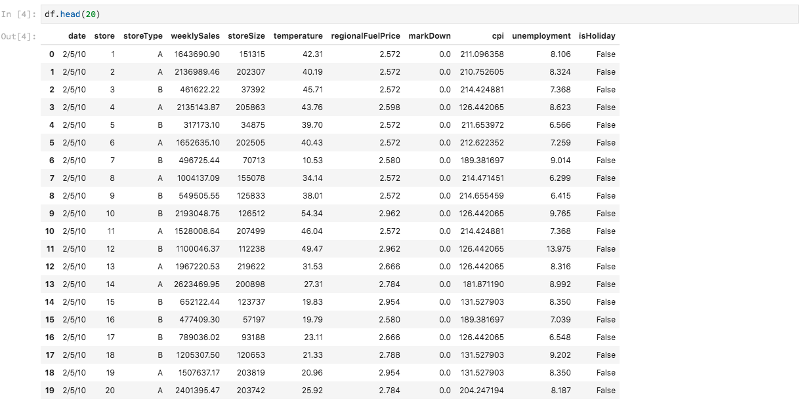

# Analyseer uw gegevens met notebooks

Deze zelfstudie richt zich op het gebruik van Jupyter-laptops, die zijn gemaakt in de Data Science Workspace, voor toegang tot uw gegevens, verkenning en visualisatie. Aan het einde van deze zelfstudie hebt u kennis nodig van enkele functies die Jupyter-laptops bieden om uw gegevens beter te begrijpen.

De volgende concepten worden geïntroduceerd:

- **JupyterLab:** [JupyterLab](https://blog.jupyter.org/jupyterlab-is-ready-for-users-5a6f039b8906) is de webinterface van de volgende generatie voor Project Jupyter en is nauw geïntegreerd in het Adobe Experience Platform.
- **Batches:** Datasets bestaan uit batches. Een batch is een reeks gegevens die over een bepaalde periode worden verzameld en samen als één eenheid worden verwerkt. Nieuwe batches worden gemaakt wanneer gegevens aan een gegevensset worden toegevoegd.
- **SDK voor gegevenstoegang (afgekeurd):** De SDK voor gegevenstoegang is nu afgekeurd. Gebruik de handleiding [Platform SDK](../authoring/platform-sdk.md) .

## Laptops verkennen in de werkruimte voor wetenschap van gegevens

In deze sectie, worden de gegevens onderzocht die eerder in het detailhandelschema werden opgenomen.

Met de werkruimte voor gegevenswetenschap kunnen gebruikers Jupyter-laptops maken via het JupyterLab-platform waar ze werkstromen voor machinaal leren kunnen maken en bewerken. JupyterLab is een programma voor samenwerking tussen servers en clients waarmee gebruikers laptopdocumenten kunnen bewerken via een webbrowser. Deze laptops kunnen zowel uitvoerbare code als tekstelementen bevatten. Voor onze doeleinden, zullen wij Markdown voor analysebeschrijving en uitvoerbare code Python gebruiken om gegevensonderzoek en analyse uit te voeren.

### Kies uw werkruimte

Bij het starten van JupyterLab krijgen we een webinterface voor Jupyter-laptops te zien. Afhankelijk van welk type laptop we kiezen, wordt een corresponderende kernel gestart.

Bij het vergelijken van welke omgeving we moeten gebruiken, moeten we rekening houden met de beperkingen van elke service. Als we bijvoorbeeld de [pandabibliotheek](https://pandas.pydata.org/) gebruiken met Python, is de RAM-limiet 2 GB als normale gebruiker. Zelfs als energiegebruiker zouden we beperkt zijn tot 20 GB RAM. Als het om grotere berekeningen gaat, zou het zinvol zijn om Spark te gebruiken, dat 1,5 TB biedt dat met alle laptopexemplaren wordt gedeeld.

Standaard werkt Tensorflow-recept in een GPU-cluster en Python in een CPU-cluster.

### Een nieuw notebook maken

Klik in de gebruikersinterface van het Adobe Experience Platform op het tabblad Data Science in het bovenste menu om naar de Data Science Workspace te gaan. Klik op het tabblad JupyterLab van deze pagina om de JupyterLab-startprogramma te openen. U zou een pagina moeten zien gelijkend op dit.


In onze zelfstudie gebruiken we Python 3 in het Jupyter-notebook om te tonen hoe we de gegevens kunnen openen en verkennen. Op de pagina Launcher staan voorbeelden van laptops. We zullen het winkelrecept voor Python 3 gebruiken.


Het recept van de Verkoop van de Detailhandel is een standalone voorbeeld dat de zelfde Detailhandel dataset van de Verkoop gebruikt om te tonen hoe de gegevens in de Notitie van Jupyter kunnen worden onderzocht en worden visualiseerd. Bovendien gaat de laptop dieper in met training en verificatie. Meer informatie over deze specifieke laptop vindt u in deze [analyse](../walkthrough.md).

### Toegangsgegevens

>[!NOTE] Het `data_access_sdk_python` is afgekeurd en wordt niet meer aanbevolen. Raadpleeg de zelfstudie [voor het converteren van gegevens naar Platform SDK](../authoring/platform-sdk.md) voor het converteren van uw code naar Platform SDK. Voor deze zelfstudie gelden nog dezelfde stappen.

We gaan over tot interne toegang tot gegevens via het Adobe Experience Platform en tot externe gegevens. Wij zullen de `data_access_sdk_python` bibliotheek gebruiken om tot interne gegevens zoals datasets en schema&#39;s toegang te hebben XDM. Voor externe gegevens gebruiken we de pandas Python-bibliotheek.

#### Externe gegevens

Open de Retail Sales-laptop en zoek de header &quot;Load Data&quot;. De volgende Python-code gebruikt de gegevensstructuur van de pandas en de `DataFrame` read_csv() [](https://pandas.pydata.org/pandas-docs/stable/generated/pandas.read_csv.html#pandas.read_csv) -functie om de CSV te lezen die op Github wordt gehost in het DataFrame:


De gegevensstructuur van Pandas&#39; DataFrame is een tweedimensionale gelabelde gegevensstructuur. Om snel de afmetingen van onze gegevens te zien, kunnen we de `df.shape`gegevens gebruiken. Dit keert een tegel terug die de dimensionaliteit van DataFrame vertegenwoordigt:


Tot slot kunnen we eens bekijken hoe onze gegevens eruit zien. Wij kunnen gebruiken `df.head(n)` om de eerste `n` rijen van DataFrame te bekijken:



#### Experience Platform-gegevens

Nu gaan we over tot de toegang tot gegevens van het Experience Platform.

##### Op gegevensset-id

Voor deze sectie, gebruiken wij de Detailhandel dataset van de Verkoop die de zelfde dataset is die in de de steekproefnotitie van de Verkoop wordt gebruikt.

In ons Jupyter-notebook hebben we toegang tot onze gegevens via het tabblad **Gegevens** aan de linkerkant. Als u op het tabblad klikt, wordt een lijst met gegevenssets weergegeven.


Nu in de folder van Datasets, zullen wij alle ingebedde datasets kunnen zien. Merk op dat het een minuut kan nemen om alle ingangen te laden als uw folder met datasets zwaar bevolkt is.

Aangezien de dataset het zelfde is, willen wij de ladingsgegevens van de vorige sectie vervangen die externe gegevens gebruikt. Selecteer het codeblok onder **Gegevens** laden en druk tweemaal op de toets **&#39;d&#39;** op het toetsenbord. Zorg ervoor dat de focus zich op het blok bevindt en niet in de tekst. U kunt op **&#39;esc&#39;** drukken om de tekstfocus te verlaten voordat u tweemaal op **&#39;d&#39;** drukt.

Nu, kunnen wij op de `Retail-Training-<your-alias>` dataset met de rechtermuisknop klikken en de &quot;Onderzoek Gegevens in Notitieboekje&quot;optie in dropdown selecteren. Er wordt een uitvoerbaar code-item in uw notitieboekje weergegeven.

>[!TIP] Raadpleeg de SDK-handleiding van het [platform](../authoring/platform-sdk.md) voor het converteren van uw code.

```PYTHON
from data_access_sdk_python.reader import DataSetReader
from datetime import date
reader = DataSetReader()
df = reader.load(data_set_id="xxxxxxxx", ims_org="xxxxxxxx@AdobeOrg")
df.head()
```

Als u met andere kernels werkt dan Python, raadpleegt u [deze pagina](https://github.com/adobe/acp-data-services-dsw-reference/wiki/Accessing-Data-on-the-Platform) voor toegang tot gegevens op het Adobe Experience Platform.

Als u de cel van het uitvoerbare bestand selecteert en vervolgens op de afspeelknop op de werkbalk drukt, wordt de uitvoerbare code uitgevoerd. De output voor `head()` zal een lijst met de sleutels van uw dataset als kolommen en eerste n rijen in de dataset zijn. `head()` Accepteert een geheel argument om te specificeren hoeveel lijnen aan output. Standaard is dit 5.


Als u de kernel opnieuw opstart en alle cellen opnieuw uitvoert, krijgt u dezelfde uitvoer als voorheen.


### Uw gegevens verkennen

Nu wij tot uw gegevens kunnen toegang hebben, laten wij nadruk op de gegevens zelf door statistieken en visualisatie te gebruiken. De dataset die wij gebruiken is een detailgegevensset die diverse informatie over 45 verschillende opslag op een bepaalde dag geeft. Sommige kenmerken voor een gegeven `date` en `store` omvatten het volgende:
- `storeType`
- `weeklySales`
- `storeSize`
- `temperature`
- `regionalFuelPrice`
- `markDown`
- `cpi`
- `unemployment`
- `isHoliday`

#### Statistisch overzicht

We kunnen de pandabibliotheek van Python gebruiken om het gegevenstype van elk kenmerk op te halen. De output van de volgende vraag zal ons informatie over het aantal ingangen en het gegevenstype voor elk van de kolommen geven:

```PYTHON
df.info()
```


Deze informatie is nuttig aangezien het weten van het gegevenstype voor elke kolom ons zal toelaten om te weten hoe te om de gegevens te behandelen.

Laten we nu eens kijken naar de statistische samenvatting. Alleen de numerieke gegevenstypen worden weergegeven, dus `date`, `storeType`en `isHoliday` niet uitgevoerd:

```PYTHON
df.describe()
```


We zien dat er 6435 gevallen zijn voor elk kenmerk. Daarnaast worden statistische informatie gegeven zoals gemiddelde, standaardafwijking (std), min, max en interkwartielen. Dit geeft ons informatie over de afwijking voor de gegevens. In de volgende sectie gaan we over tot visualisatie die samen met deze informatie werkt om ons een goed inzicht te geven in onze gegevens.

Wanneer u de minimum- en maximumwaarden voor `store`bekijkt, ziet u dat er 45 unieke opslagruimten zijn waarin de gegevens zich bevinden. Er zijn ook `storeTypes` die onderscheid maken tussen wat een winkel is. We kunnen de verdeling van `storeTypes` zien door het volgende te doen:


Dit betekent dat er 22 winkels zijn van `storeType` , `A`17 zijn `storeType` , en 6 zijn `B``storeType` `C`.

#### Gegevensvisualisatie

Nu we onze gegevenskaderwaarden kennen, willen we dit aanvullen met visualisaties om de dingen duidelijker en makkelijker te maken om patronen te identificeren. Grafieken zijn ook handig wanneer u resultaten naar een publiek verzendt. Enkele Python-bibliotheken die nuttig zijn voor visualisatie zijn onder andere:
- [Matplotlib](https://matplotlib.org/)
- [pandas](https://pandas.pydata.org/)
- [seaborn](https://seaborn.pydata.org/)
- [gumpje](https://ggplot2.tidyverse.org/)

In deze sectie gaan we snel over enkele voordelen voor het gebruik van elke bibliotheek.

[Matplotlib](https://matplotlib.org/) is de oudste visualisatiepakket van Python. Hun doel is om &quot;gemakkelijke en moeilijke dingen mogelijk te maken&quot;. Dit is meestal het geval omdat het pakket uiterst krachtig is, maar ook ingewikkeld. Het is niet altijd gemakkelijk om een redelijke grafiek te krijgen zonder veel tijd en moeite te nemen.

[Pandas](https://pandas.pydata.org/) wordt vooral gebruikt voor het DataFrame-object, dat gegevensmanipulatie met geïntegreerde indexering mogelijk maakt. Panda&#39;s bevatten echter ook een ingebouwde functie voor het uitzetten van beelden die is gebaseerd op matplotlib.

[seaborn](https://seaborn.pydata.org/) is een pakket dat bovenop matplotlib wordt gebouwd . Het hoofddoel is standaardgrafieken visueel aantrekkelijker te maken en het maken van gecompliceerde grafieken te vereenvoudigen.

[ggplot](https://ggplot2.tidyverse.org/) is een pakket dat ook boven op matplotlib is gebouwd . Nochtans is het belangrijkste verschil dat het hulpmiddel een haven van gplot2 voor R is. Net als bij seaborn is het doel om matplotlib beter te krijgen. De gebruikers die met gplot2 voor R vertrouwd zijn zouden deze bibliotheek moeten overwegen.


##### Grafieken gelijktrekken

Univariate grafieken zijn percelen van een individuele variabele. Een uniforme grafiek wordt gebruikt om uw gegevens te visualiseren is de doos en de whiskergrafiek.

Met behulp van onze detailhandelsdataset van voordien, kunnen wij de doos en de whiskerperceel voor elk van 45 winkels en hun wekelijkse verkoop produceren. Het waarnemingspunt wordt geproduceerd gebruikend de `seaborn.boxplot` functie.


Een doos en een whiskerplot worden gebruikt om de verspreiding van gegevens te tonen. De buitenlijnen van het waarnemingspunt tonen de bovenste en onderste kwartiel, terwijl de doos het interkwartielbereik beslaat. De regel in het vak markeert de mediaan. Alle gegevenspunten die meer dan 1,5 keer het bovenste of onderste kwartiel bedragen, worden als een cirkel gemarkeerd. Deze punten worden beschouwd als uitschieters.

##### Meerdere grafieken

Meerdere percelen worden gebruikt om de interactie tussen variabelen te zien. Met de visualisatie kunnen wetenschappers van data zien of er correlaties of patronen zijn tussen de variabelen. Een veelgebruikte multivariate grafiek is een correlatiematrix. Met een correlatiematrix worden de afhankelijkheden tussen meerdere variabelen gekwantificeerd aan de hand van de correlatiecoëfficiënt.

Gebruikend de zelfde kleinhandelsdataset, kunnen wij de correlatiematrix produceren.


Merk op dat 1 diagonaal naar beneden is. Dit toont aan dat wanneer het vergelijken van een variabele aan zich, het volledige positieve correlatie heeft. Sterke positieve correlatie zal een grootte dichter bij 1 hebben, terwijl zwakke correlaties dichter bij 0 liggen. Een negatieve correlatie wordt aangetoond met een negatieve coëfficiënt die een omgekeerde trend laat zien.


## Volgende stappen

In deze zelfstudie wordt uitgelegd hoe u een nieuwe Jupyter-laptop maakt in de Data Science Workspace en hoe u toegang krijgt tot externe gegevens en via het Adobe Experience Platform. We hebben met name de volgende stappen doorlopen:
- Nieuwe Jupyter-laptop maken
- Gegevensbestanden en schema&#39;s voor toegang
- Gegevenssets verkennen

Nu bent u klaar om naar de [volgende sectie](../models-recipes/package-source-files-recipe.md) te gaan om een recept te verpakken en in de Werkruimte van de Wetenschap van Gegevens te importeren.