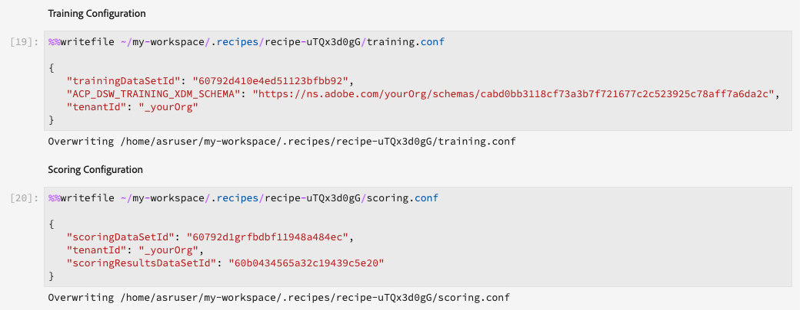
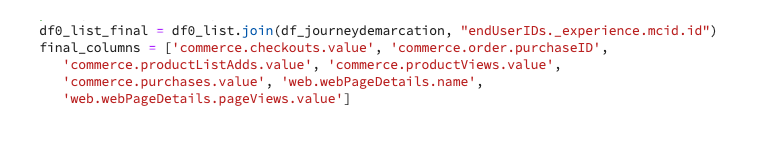
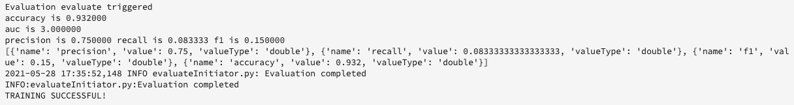

# Een model maken met JupyterLab-laptops

Deze zelfstudie begeleidt u door de vereiste stappen om een model te maken met behulp van de JupyterLab notebooks recipe builder template.

## Ingevoerde concepten:

- **Ontvangers:** Een recept is Adobe voor een modelspecificatie en is een container op hoofdniveau die een specifiek machinaal leren, AI algoritme of een samenstel van algoritmen, verwerkingslogica, en configuratie vertegenwoordigt die wordt vereist om een opgeleid model te bouwen en uit te voeren.
- **Model:** Een model is een geval van een machine het leren recept dat gebruikend historische gegevens en configuraties wordt opgeleid om voor een bedrijfs geval op te lossen.
- **Training:** Training is het proces van leerpatronen en inzichten van gelabelde gegevens.
- **Scores:** Scores is het proces om inzichten van gegevens te produceren gebruikend een opgeleid model.

## De vereiste middelen downloaden {#assets}

Alvorens u met dit leerprogramma te werk gaat, moet u de vereiste schema&#39;s en datasets tot stand brengen. De zelfstudie bezoeken voor [het creëren van de schema&#39;s en datasets van het model van de Luma&#39;s](../models-recipes/create-luma-data.md) om de vereiste elementen te downloaden en de voorwaarden in te stellen.

## Aan de slag met de [!DNL JupyterLab] laptopomgeving

Een geheel nieuw recept maken is mogelijk binnen [!DNL Data Science Workspace]. Navigeer naar [Adobe Experience Platform](https://platform.adobe.com) en selecteert u de **[!UICONTROL Notebooks]** links. Als u een nieuwe laptop wilt maken, selecteert u de sjabloon Recipe Builder in het menu [!DNL JupyterLab Launcher].

De [!UICONTROL Recipe Builder] -laptop biedt u de mogelijkheid om training en scoring uit te voeren in de laptop. Dit geeft u de flexibiliteit om veranderingen aan te brengen `train()` en `score()` methoden tussen het uitvoeren van experimenten met de opleiding en het inschatten van gegevens. Als u tevreden bent met de resultaten van de training en scoring, kunt u een recept maken en het bovendien publiceren als een model dat gebruikmaakt van het recept om de functionaliteit te modelleren.

>[!NOTE]
>
>De [!UICONTROL Recipe Builder] laptop ondersteunt het werken met alle bestandsindelingen, maar de functie voor het maken van recept wordt momenteel alleen ondersteund [!DNL Python].


Wanneer u [!UICONTROL Recipe Builder] -laptop van de draagtas, wordt de laptop geopend op een nieuw tabblad.

In het nieuwe laptoptabblad bovenaan wordt een werkbalk geladen met drie extra handelingen - **[!UICONTROL Train]**, **[!UICONTROL Score]**, en **[!UICONTROL Create Recipe]**. Deze pictogrammen worden alleen weergegeven in het dialoogvenster [!UICONTROL Recipe Builder] -laptop. Meer informatie over deze acties vindt u [in de sectie opleiding en scores](#training-and-scoring) nadat u de Recipe in de laptop hebt gemaakt.


## Aan de slag met de [!UICONTROL Recipe Builder] notebook

In de meegeleverde map met middelen is een Luminantiemodel `propensity_model.ipynb`. Met de optie voor het uploaden van een laptop in JupyterLab uploadt u het meegeleverde model en opent u de laptop.


De rest van deze zelfstudie heeft betrekking op de volgende bestanden die vooraf zijn gedefinieerd in de laptop met het model van de dichtheid:

- [Vereisten, bestand](#requirements-file)
- [Configuratiebestanden](#configuration-files)
- [Opleidingsgegevensloader](#training-data-loader)
- [Scoregegevenslader](#scoring-data-loader)
- [Pipetbestand](#pipeline-file)
- [Evaluatorbestand](#evaluator-file)
- [Gegevensopslagbestand](#data-saver-file)

In de volgende videozelfstudie wordt uitgelegd hoe u de laptop met het Luminantiemodel kunt gebruiken:

>[!VIDEO](https://video.tv.adobe.com/v/333570)

### Vereisten, bestand {#requirements-file}

Het bestand requirements wordt gebruikt om extra bibliotheken te declareren die u in het model wilt gebruiken. U kunt het versienummer specificeren als er een gebiedsdeel is. Ga naar [anaconda.org](https://anaconda.org). Ga voor meer informatie over het opmaken van het bestand met vereisten naar [Conda](https://docs.conda.io/projects/conda/en/latest/user-guide/tasks/manage-environments.html#creating-an-environment-file-manually). De lijst met hoofdbibliotheken die al worden gebruikt, bevat:

```JSON
python=3.6.7
scikit-learn
pandas
numpy
data_access_sdk_python
```

>[!NOTE]
>
>Bibliotheken of specifieke versies die u toevoegt, zijn mogelijk niet compatibel met de bovenstaande bibliotheken. Als u ervoor kiest om handmatig een omgevingsbestand te maken, wordt bovendien het `name` veld mag niet worden overschreven.

Voor de laptop met de Luminantiemodus hoeven de vereisten niet te worden bijgewerkt.

### Configuratiebestanden {#configuration-files}

De configuratiebestanden, `training.conf` en `scoring.conf`, worden gebruikt om de gegevenssets op te geven die u voor training en scoring wilt gebruiken en om hyperparameters toe te voegen. Er zijn verschillende configuraties voor training en scoring.

Als u een model wilt laten trainen, moet u de `trainingDataSetId`, `ACP_DSW_TRAINING_XDM_SCHEMA`, en `tenantId`. Daarnaast moet u voor scoring de opdracht `scoringDataSetId`, `tenantId`, en `scoringResultsDataSetId `.

Om de dataset en schema IDs te vinden, ga naar het gegevenslusje  in notities op de linkernavigatiebalk (onder het mappictogram). Drie verschillende dataset ID&#39;s moeten worden verstrekt. De `scoringResultsDataSetId` wordt gebruikt om de model het sorteren resultaten op te slaan en zou een lege dataset moeten zijn. Deze gegevensbestanden zijn eerder in de [Vereiste elementen](#assets) stap.


Dezelfde informatie is te vinden op [Adobe Experience Platform](https://platform.adobe.com/) onder de **[Schema](https://platform.adobe.com/schema)** en **[Gegevenssets](https://platform.adobe.com/dataset/overview)** tabs.

Wanneer u eenmaal een concurrent bent, moet uw training- en scoring-configuratie er ongeveer als volgt uitzien:



Standaard worden de volgende configuratieparameters voor u ingesteld wanneer u gegevens traint en scant:

- `ML_FRAMEWORK_IMS_USER_CLIENT_ID`
- `ML_FRAMEWORK_IMS_TOKEN`
- `ML_FRAMEWORK_IMS_ML_TOKEN`
- `ML_FRAMEWORK_IMS_TENANT_ID`

## De Loader voor trainingsgegevens {#training-data-loader}

Het doel van de trainingsgegevenslader is het instantiëren van gegevens die worden gebruikt voor het maken van het model voor machinaal leren. Er zijn meestal twee taken die de lader van trainingsgegevens uitvoert:

- Gegevens laden van [!DNL Platform]
- Gegevensvoorbereiding en functietechniek

De volgende twee secties gaan over het laden van gegevens en het voorbereiden van gegevens.

### Gegevens laden {#loading-data}

In deze stap worden de [pandas dataframe](https://pandas.pydata.org/pandas-docs/stable/generated/pandas.DataFrame.html). Gegevens kunnen worden geladen uit bestanden in [!DNL Adobe Experience Platform] met een van de [!DNL Platform] SDK (`platform_sdk`) of van externe bronnen die gebruik maken van panda&#39;s&quot; `read_csv()` of `read_json()` functies.

- [[!DNL Platform SDK]](#platform-sdk)
- [Externe bronnen](#external-sources)

>[!NOTE]
>
>In de Recipe Builder-laptop worden gegevens geladen via de `platform_sdk` gegevenslader.

### [!DNL Platform] SDK {#platform-sdk}

Voor een diepgaande zelfstudie over het gebruik van de `platform_sdk` gegevensloader, ga naar de [Handleiding SDK Platform](../authoring/platform-sdk.md). Dit leerprogramma verstrekt informatie over bouwstijlauthentificatie, basislezing van gegevens, en basisschrijven van gegevens.

### Externe bronnen {#external-sources}

In deze sectie ziet u hoe u een JSON- of CSV-bestand importeert naar een pandaobject. De officiële documentatie van de pandabibliotheek is te vinden op:
- [read_csv](https://pandas.pydata.org/pandas-docs/stable/generated/pandas.read_csv.html)
- [read_json](https://pandas.pydata.org/pandas-docs/stable/generated/pandas.read_json.html)

Ten eerste is hier een voorbeeld van het importeren van een CSV-bestand. De `data` is het pad naar het CSV-bestand. Deze variabele is geïmporteerd uit het dialoogvenster `configProperties` in de [vorige sectie](#configuration-files).

```PYTHON
df = pd.read_csv(data)
```

U kunt ook importeren vanuit een JSON-bestand. De `data` is het pad naar het CSV-bestand. Deze variabele is geïmporteerd uit het dialoogvenster `configProperties` in de [vorige sectie](#configuration-files).

```PYTHON
df = pd.read_json(data)
```

Uw gegevens bevinden zich nu in het dataframe-object en kunnen worden geanalyseerd en gemanipuleerd in het dialoogvenster [volgende sectie](#data-preparation-and-feature-engineering).

## Loader-bestand voor trainingsgegevens

In dit voorbeeld worden gegevens geladen met de Platform-SDK. De bibliotheek kan boven aan de pagina worden geïmporteerd door de volgende regel op te nemen:

`from platform_sdk.dataset_reader import DatasetReader`

U kunt dan de `load()` methode om de trainingsdataset van de `trainingDataSetId` zoals ingesteld in de configuratie (`recipe.conf`).

```PYTHON
def load(config_properties):
    print("Training Data Load Start")

    #########################################
    # Load Data
    #########################################    
    client_context = get_client_context(config_properties)
    dataset_reader = DatasetReader(client_context, dataset_id=config_properties['trainingDataSetId'])
```

>[!NOTE]
>
>Zoals vermeld in het [Sectie Configuratiebestand](#configuration-files), worden de volgende configuratieparameters voor u geplaatst wanneer u tot gegevens van Experience Platform toegang hebt gebruikend `client_context = get_client_context(config_properties)`:
> - `ML_FRAMEWORK_IMS_USER_CLIENT_ID`
> - `ML_FRAMEWORK_IMS_TOKEN`
> - `ML_FRAMEWORK_IMS_ML_TOKEN`
> - `ML_FRAMEWORK_IMS_TENANT_ID`


Nu u uw gegevens hebt, kunt u beginnen met gegevensvoorbereiding en functietechniek.

### Gegevensvoorbereiding en functietechniek {#data-preparation-and-feature-engineering}

Nadat de gegevens zijn geladen, moeten de gegevens worden gereinigd en worden de gegevens voorbereid. In dit voorbeeld, is het doel van het model te voorspellen of een klant een product of niet gaat opdracht geven. Omdat het model niet naar specifieke producten kijkt, hebt u niet nodig `productListItems` en dus wordt de kolom weggelaten. Vervolgens gaan er extra kolommen verloren die slechts één waarde of twee waarden in één kolom bevatten. Wanneer het leiden van een model, is het belangrijk om nuttige gegevens slechts te houden die in het voorspellen van uw doel zullen helpen.


Zodra u om het even welke onnodige gegevens hebt gelaten vallen, kunt u eigenschaptechniek beginnen. De demo-gegevens die voor dit voorbeeld worden gebruikt, bevatten geen sessiegegevens. Normaal gesproken wilt u gegevens over de huidige en vorige sessies voor een bepaalde klant. Door het gebrek aan zittingsinformatie, imiteert dit voorbeeld in plaats daarvan huidige en vroegere zittingen via reisafbakening.


Nadat de afbakening volledig is, worden de gegevens geëtiketteerd en een reis gecreeerd.



Vervolgens worden de functies gemaakt en opgedeeld in verleden en heden. Dan, om het even welke kolommen die onnodig zijn worden gelaten vallen, verlatend u zowel de vroegere als huidige reizen voor klanten Luma. Deze reizen bevatten informatie zoals of een klant een artikel heeft gekocht en de reis die hij heeft afgelegd tot de aankoop.


## Scoregegevenslader {#scoring-data-loader}

De procedure voor het laden van gegevens voor scoring is vergelijkbaar met het laden van trainingsgegevens. Als u de code goed bekijkt, ziet u dat alles hetzelfde is, behalve voor de `scoringDataSetId` in de `dataset_reader`. Dit komt doordat dezelfde Luma-gegevensbron wordt gebruikt voor training en scoring.

In het geval dat u verschillende gegevensbestanden voor training en scoring wilt gebruiken, zijn de lader voor training en scoring gescheiden. Op deze manier kunt u aanvullende voorbehandelingen uitvoeren, zoals het toewijzen van uw trainingsgegevens aan uw scoringsgegevens als dat nodig is.

## Pipetbestand {#pipeline-file}

De `pipeline.py` het bestand bevat logica voor training en scoring.

Het doel van opleiding is een model te creëren gebruikend eigenschappen en etiketten in uw opleidingsdataset. Na het kiezen van uw opleidingsmodel, moet u uw x en ytrainingsdataset aan het model passen en de functie keert het getrainde model terug.

>[!NOTE]
> 
>Functies verwijzen naar de invoervariabele die door het model voor machinaal leren wordt gebruikt om de labels te voorspellen.


De `score()` De functie moet het scorealgoritme bevatten en een meting retourneren om aan te geven hoe succesvol het model is. De `score()` de functie gebruikt de het scoren datasetetiketten en het opgeleide model om een reeks voorspelde eigenschappen te produceren. Deze voorspelde waarden worden vervolgens vergeleken met de feitelijke kenmerken in de gegevensset voor scoren. In dit voorbeeld wordt `score()` de functie gebruikt het opgeleide model om eigenschappen te voorspellen gebruikend de etiketten van de het scoren dataset. De voorspelde functies worden geretourneerd.


## Evaluatorbestand {#evaluator-file}

De `evaluator.py` Het bestand bevat logica voor de manier waarop u uw getrainde recept wilt evalueren en voor de manier waarop uw trainingsgegevens moeten worden gesplitst.

### De gegevensset splitsen {#split-the-dataset}

De fase van de gegevensvoorbereiding voor opleiding vereist opsplitsing van de gegevensset die voor opleiding en tests moet worden gebruikt. Dit `val` gegevens worden impliciet gebruikt om het model te evalueren nadat het is opgeleid. Dit proces staat los van scoring.

In deze sectie wordt het dialoogvenster `split()` Deze functie laadt gegevens in de laptop en wist de gegevens door niet-verwante kolommen te verwijderen uit de gegevensset. Van daaruit kunt u functietechniek uitvoeren. Dit is het proces om aanvullende relevante functies te maken op basis van bestaande onbewerkte functies in de gegevens.


### Evalueer het getrainde model {#evaluate-the-trained-model}

De `evaluate()` De functie wordt uitgevoerd nadat het model wordt getraind en keert metrisch terug om erop te wijzen hoe succesvol het model uitvoert. De `evaluate()` de functie gebruikt de het testen etiketten van gegevensreeksen en het opgeleide model om een reeks eigenschappen te voorspellen. Deze voorspelde waarden worden vervolgens vergeleken met de feitelijke kenmerken in de testdataset. In dit voorbeeld worden de gebruikte meetwaarden `precision`, `recall`, `f1`, en `accuracy`. De functie retourneert een `metric` object met een array van evaluatiemetriek. Deze metriek wordt gebruikt om te evalueren hoe goed het opgeleide model presteert.


Toevoegen `print(metric)` Hiermee kunt u de metrische resultaten weergeven.



## Gegevensopslagbestand {#data-saver-file}

De `datasaver.py` bevat het bestand `save()` en wordt gebruikt om uw voorspelling op te slaan tijdens het testen van scoring. De `save()` functie neemt uw voorspelling en het gebruiken [!DNL Experience Platform Catalog] API&#39;s, schrijft de gegevens naar de `scoringResultsDataSetId` u hebt opgegeven in uw `scoring.conf` bestand. U kunt


## Training en scores {#training-and-scoring}

Wanneer u klaar bent met het aanbrengen van wijzigingen in uw laptop en uw recept wilt trainen, kunt u de bijbehorende knoppen boven aan de balk selecteren om een trainingsrun in de cel te maken. Nadat u de knop hebt geselecteerd, wordt een logboek met opdrachten en uitvoerbestanden van het trainingsscript weergegeven in het notitieblok (onder de `evaluator.py` cel). Conda installeert eerst alle gebiedsdelen, dan wordt de opleiding in werking gesteld.

Let erop dat u minstens één keer training moet uitvoeren voordat u scoring kunt uitvoeren. Het selecteren van **[!UICONTROL Run Scoring]** de knoop zal op het opgeleide model scoren dat tijdens opleiding werd geproduceerd. Het scores-script wordt onder `datasaver.py`.

Als u de verborgen uitvoer wilt zien voor foutopsporingsdoeleinden, voegt u `debug` aan het einde van de uitvoercel en opnieuw uitvoeren.


## Een recept maken {#create-recipe}

Als u klaar bent met het bewerken van het recept en tevreden bent met de trainings-/scoringuitvoer, kunt u een recept maken van de laptop door **[!UICONTROL Create Recipe]** in de rechterbovenhoek.


Na het selecteren **[!UICONTROL Create Recipe]**, wordt u gevraagd een naam voor het recept in te voeren. Deze naam staat voor het recept dat op [!DNL Platform].


Zodra u **[!UICONTROL Ok]** Het proces voor het creëren van recept begint. Dit kan enige tijd duren en er wordt een voortgangsbalk weergegeven in plaats van de knop voor het maken van het recept. Nadat de bewerking is voltooid, kunt u de opdracht **[!UICONTROL View Recipes]** om u naar **[!UICONTROL Recipes]** tab onder **[!UICONTROL ML Models]**


>[!CAUTION]
>
> - Geen van de bestandscellen verwijderen
> - Bewerk de `%%writefile` regel boven aan de bestandscellen
> - Geen recepten in verschillende notebooks tegelijk maken


## Volgende stappen {#next-steps}

Door deze zelfstudie te voltooien, hebt u geleerd hoe u een model voor machinaal leren kunt maken in het dialoogvenster [!UICONTROL Recipe Builder] -laptop. U hebt ook geleerd hoe u de workflow voor het maken van een notebook kunt gebruiken.

Ga door met leren werken met bronnen binnen [!DNL Data Science Workspace], bezoek de [!DNL Data Science Workspace] recepten en modellen dropdown.