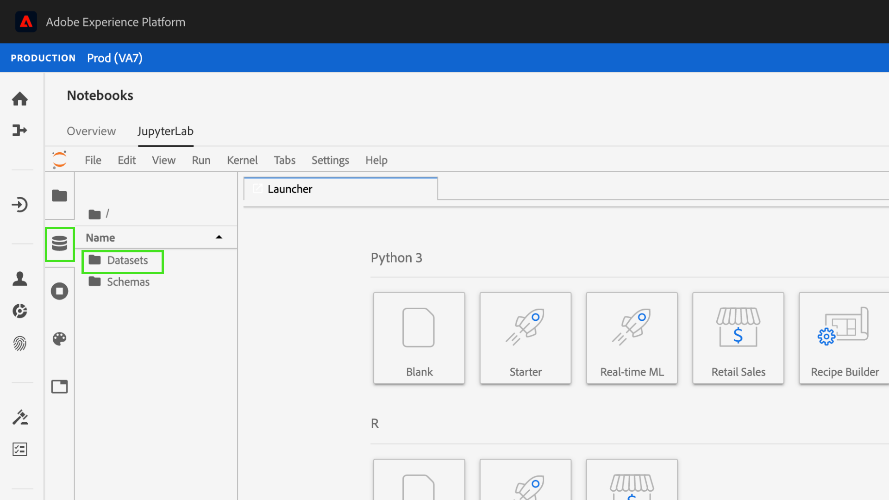

# Een model maken met JupyterLab-laptops

>[!NOTE]
>
>Data Science Workspace kan niet meer worden aangeschaft.
>
>Deze documentatie is bedoeld voor bestaande klanten met eerdere rechten op Data Science Workspace.

Deze zelfstudie begeleidt u door de vereiste stappen om een model te maken met behulp van de JupyterLab-sjabloon voor het maken van het recept van laptops.

## Ingevoerde concepten:

- **Ontvangers:** A recept is de termijn van de Adobe voor een modelspecificatie en is een top-level container die een specifiek machine het leren, AI algoritme of een samenstel van algoritmen, verwerkingslogica, en configuratie vertegenwoordigt die wordt vereist om een getraind model te bouwen en uit te voeren.
- **Model:** een model is een geval van een machine het leren recept dat gebruikend historische gegevens en configuraties wordt getraind om voor een bedrijfsgeval op te lossen.
- **Opleiding:** de Opleiding is het proces om patronen en inzichten van geëtiketteerde gegevens te leren.
- **het Schetsen:** het Scoreren is het proces om inzichten van gegevens te produceren gebruikend een opgeleid model.

## De vereiste middelen downloaden {#assets}

Alvorens u met dit leerprogramma te werk gaat, moet u de vereiste schema&#39;s en datasets tot stand brengen. Bezoek het leerprogramma voor [ creërend de modelschema&#39;s en datasets van de Bevolheid van de Luma ](../models-recipes/create-luma-data.md) om de vereiste activa te downloaden en opstelling de pre-voorwaarden.

## Aan de slag met de [!DNL JupyterLab] -laptopomgeving

U kunt een geheel nieuw recept maken binnen [!DNL Data Science Workspace] . Om te beginnen, navigeer aan [ Adobe Experience Platform ](https://platform.adobe.com) en selecteer het **[!UICONTROL Notebooks]** lusje op de linkerzijde. Als u een nieuwe laptop wilt maken, selecteert u de sjabloon Recipe Builder in de [!DNL JupyterLab Launcher] .

Met de laptop van [!UICONTROL Recipe Builder] kunt u training en scoring uitvoeren in de laptop. Dit biedt u de flexibiliteit om wijzigingen aan te brengen in de `train()` - en `score()` -methoden tussen het uitvoeren van experimenten met de training en het scoren van gegevens. Als u tevreden bent met de resultaten van de training en scoring, kunt u een recept maken en het bovendien publiceren als een model dat gebruikmaakt van het recept om de functionaliteit te modelleren.

>[!NOTE]
>
>De laptop van [!UICONTROL Recipe Builder] ondersteunt het werken met alle bestandsindelingen, maar momenteel ondersteunt de functie voor het maken van recept alleen [!DNL Python] .


Wanneer u de [!UICONTROL Recipe Builder] -laptop selecteert in de startprogramma, wordt de laptop geopend op een nieuw tabblad.

In het nieuwe laptoptabblad bovenaan wordt een werkbalk geladen met drie extra handelingen: **[!UICONTROL Train]**, **[!UICONTROL Score]** en **[!UICONTROL Create Recipe]** . Deze pictogrammen worden alleen weergegeven in de [!UICONTROL Recipe Builder] -laptop. Meer informatie over deze acties wordt verstrekt [ in de opleiding en het scoren sectie ](#training-and-scoring) na de bouw van uw Ontvanger in de notitie.


## Aan de slag met de [!UICONTROL Recipe Builder] -laptop

In de opgegeven map assets bevindt zich een waarschijnlijkheidsmodel voor Luma `propensity_model.ipynb` . Met de optie voor het uploaden van een laptop in JupyterLab uploadt u het meegeleverde model en opent u de laptop.


De rest van deze zelfstudie heeft betrekking op de volgende bestanden die vooraf zijn gedefinieerd in de notebook met het waarschijnlijkheidsmodel:

- [Vereisten-bestand](#requirements-file)
- [Configuratiebestanden](#configuration-files)
- [Opleidingsgegevensloader](#training-data-loader)
- [Scoregegevenslader](#scoring-data-loader)
- [Pipetbestand](#pipeline-file)
- [Evaluatorbestand](#evaluator-file)
- [Gegevensopslagbestand](#data-saver-file)

In de volgende videozelfstudie wordt uitgelegd hoe u het notebook met het Luma-neiging kunt gebruiken:

>[!VIDEO](https://video.tv.adobe.com/v/333570)

### Vereisten-bestand {#requirements-file}

Het bestand met vereisten wordt gebruikt om extra bibliotheken te declareren die u in het model wilt gebruiken. U kunt het versienummer opgeven als er sprake is van afhankelijkheid. Om extra bibliotheken te zoeken, bezoek [ anaconda.org ](https://anaconda.org). Leren hoe te om het behoeftendossier te formatteren, bezoek [ Conda ](https://docs.conda.io/projects/conda/en/latest/user-guide/tasks/manage-environments.html#creating-an-environment-file-manually). De lijst met hoofdbibliotheken die al worden gebruikt, bevat:

```JSON
python=3.6.7
scikit-learn
pandas
numpy
data_access_sdk_python
```

>[!NOTE]
>
>Bibliotheken of specifieke versies die u toevoegt, zijn mogelijk niet compatibel met de bovenstaande bibliotheken. Als u ervoor kiest om handmatig een omgevingsbestand te maken, mag het veld `name` niet worden overschreven.

Voor de laptop met de Luma-neiging hoeven de vereisten niet te worden bijgewerkt.

### Configuratiebestanden {#configuration-files}

De configuratiebestanden, `training.conf` en `scoring.conf` , worden gebruikt om de gegevenssets op te geven die u wilt gebruiken voor training en scores, en om hyperparameters toe te voegen. Er zijn verschillende configuraties voor training en scoring.

Een model kan training alleen uitvoeren als u de instructies `trainingDataSetId` , `ACP_DSW_TRAINING_XDM_SCHEMA` en `tenantId` opgeeft. Daarnaast moet u voor scoring de waarden `scoringDataSetId`, `tenantId` en `scoringResultsDataSetId ` opgeven.

Om de dataset en schema IDs te vinden, ga naar het lusje van Gegevens  binnen notitieboeken op de linkernavigatiebar (onder het omslagpictogram). Drie verschillende dataset ID&#39;s moeten worden verstrekt. `scoringResultsDataSetId` wordt gebruikt om de model het sorteren resultaten op te slaan en zou een lege dataset moeten zijn. Deze datasets werden eerder gemaakt in de [ Vereiste activa ](#assets) stap.



De zelfde informatie kan op [ Adobe Experience Platform ](https://platform.adobe.com/) onder het **[Schema ](https://platform.adobe.com/schema) worden gevonden** en **[Datasets ](https://platform.adobe.com/dataset/overview)** lusjes.

Wanneer u eenmaal een concurrent bent, moet uw training- en scoring-configuratie er ongeveer zo uitzien als de volgende screenshot:


Standaard worden de volgende configuratieparameters voor u ingesteld wanneer u gegevens traint en scant:

- `ML_FRAMEWORK_IMS_USER_CLIENT_ID`
- `ML_FRAMEWORK_IMS_TOKEN`
- `ML_FRAMEWORK_IMS_ML_TOKEN`
- `ML_FRAMEWORK_IMS_TENANT_ID`

## Informatie over de trainingsgegevenslader {#training-data-loader}

Het doel van de trainingsgegevenslader is om gegevens te instantiëren die worden gebruikt voor het maken van het machine-learningmodel. De trainingsgegevenslader voert doorgaans twee taken uit:

- Gegevens laden uit [!DNL Platform]
- Gegevensvoorbereiding en functietechniek

De volgende twee secties gaan over het laden van gegevens en het voorbereiden van gegevens.

### Gegevens laden {#loading-data}

Deze stap gebruikt [ pandas dataframe ](https://pandas.pydata.org/pandas-docs/stable/generated/pandas.DataFrame.html). Gegevens kunnen worden geladen uit bestanden in [!DNL Adobe Experience Platform] met behulp van de [!DNL Platform] SDK (`platform_sdk` ) of uit externe bronnen met behulp van de `read_csv()` - of `read_json()` functies van panda&#39;s.

- [[!DNL Platform SDK]](#platform-sdk)
- [Externe bronnen](#external-sources)

>[!NOTE]
>
>In de Recipe Builder-laptop worden gegevens geladen via de `platform_sdk` -gegevenslader.

### [!DNL Platform] SDK {#platform-sdk}

Voor een diepgaande zelfstudie bij het gebruiken van de `platform_sdk` gegevenslader, gelieve de [ gids van SDK van het Platform ](../authoring/platform-sdk.md) te bezoeken. Dit leerprogramma verstrekt informatie over bouwstijlauthentificatie, basislezing van gegevens, en basisschrijven van gegevens.

### Externe bronnen {#external-sources}

In deze sectie ziet u hoe u een JSON- of CSV-bestand importeert naar een pandaobject. Officiële documentatie van de pandabibliotheek is hier te vinden:
- [ read_csv ](https://pandas.pydata.org/pandas-docs/stable/generated/pandas.read_csv.html)
- [ read_json ](https://pandas.pydata.org/pandas-docs/stable/generated/pandas.read_json.html)

Ten eerste is hier een voorbeeld van het importeren van een CSV-bestand. Het argument `data` is het pad naar het CSV-bestand. Deze variabele werd ingevoerd van `configProperties` in de [ vorige sectie ](#configuration-files).

```PYTHON
df = pd.read_csv(data)
```

U kunt ook importeren vanuit een JSON-bestand. Het argument `data` is het pad naar het CSV-bestand. Deze variabele werd ingevoerd van `configProperties` in de [ vorige sectie ](#configuration-files).

```PYTHON
df = pd.read_json(data)
```

Nu zijn uw gegevens in het dataframe voorwerp en kunnen in de [ volgende sectie ](#data-preparation-and-feature-engineering) worden geanalyseerd en worden gemanipuleerd.

## Loader-bestand voor trainingsgegevens

In dit voorbeeld worden gegevens geladen met de SDK van het platform. De bibliotheek kan boven aan de pagina worden geïmporteerd door de volgende regel op te nemen:

`from platform_sdk.dataset_reader import DatasetReader`

U kunt dan de `load()` methode gebruiken om de trainingsdataset van `trainingDataSetId` te pakken zoals die in het configuratiedossier (`recipe.conf`) wordt geplaatst.

```PYTHON
def load(config_properties):
    print("Training Data Load Start")

    #########################################
    # Load Data
    #########################################    
    client_context = get_client_context(config_properties)
    dataset_reader = DatasetReader(client_context, dataset_id=config_properties['trainingDataSetId'])
```

>[!NOTE]
>
>Zoals vermeld in de [ sectie van het Dossier van de Configuratie ](#configuration-files), worden de volgende configuratieparameters geplaatst voor u wanneer u tot gegevens van Experience Platform toegang hebt gebruikend `client_context = get_client_context(config_properties)`:
> - `ML_FRAMEWORK_IMS_USER_CLIENT_ID`
> - `ML_FRAMEWORK_IMS_TOKEN`
> - `ML_FRAMEWORK_IMS_ML_TOKEN`
> - `ML_FRAMEWORK_IMS_TENANT_ID`

Nu u uw gegevens hebt, kunt u beginnen met gegevensvoorbereiding en functietechniek.

### Gegevensvoorbereiding en functietechniek {#data-preparation-and-feature-engineering}

Nadat de gegevens zijn geladen, moeten de gegevens worden gereinigd en worden de gegevens voorbereid. In dit voorbeeld, is het doel van het model te voorspellen of een klant een product of niet gaat opdracht geven. Omdat het model niet naar specifieke producten kijkt, hebt u `productListItems` niet nodig en daarom wordt de kolom gelaten vallen. Vervolgens gaan er extra kolommen verloren die slechts één waarde of twee waarden in één kolom bevatten. Wanneer het leiden van een model, is het belangrijk om nuttige gegevens slechts te houden die in het voorspellen van uw doel zullen helpen.


Als u overbodige gegevens hebt verwijderd, kunt u beginnen met het ontwerpen van functies. De demo-gegevens die in dit voorbeeld worden gebruikt, bevatten geen sessiegegevens. Normaal gesproken wilt u gegevens over de huidige en vorige sessies voor een bepaalde klant. Vanwege het gebrek aan sessiegegevens bootst dit voorbeeld in plaats daarvan huidige en eerdere sessies na via trajectafbakening.


Nadat de afbakening volledig is, worden de gegevens geëtiketteerd en een reis gecreeerd.


Vervolgens worden de functies gemaakt en opgedeeld in verleden en heden. Dan, om het even welke kolommen die onnodig zijn worden gelaten vallen, verlatend u zowel de vroegere als huidige reizen voor klanten Luma. Deze reizen bevatten informatie zoals of een klant een artikel heeft gekocht en de reis die hij heeft afgelegd tot de aankoop.


## Scoregegevenslader {#scoring-data-loader}

De procedure voor het laden van gegevens voor scoring is vergelijkbaar met het laden van trainingsgegevens. Als u de code goed bekijkt, ziet u dat alles hetzelfde is, behalve de code `scoringDataSetId` in de `dataset_reader` . Dit komt doordat dezelfde Luma-gegevensbron wordt gebruikt voor training en scoring.

In het geval dat u verschillende gegevensbestanden voor training en scoring wilt gebruiken, zijn de lader voor training en scoring gescheiden. Op deze manier kunt u aanvullende voorbehandelingen uitvoeren, zoals het toewijzen van uw trainingsgegevens aan uw scoringsgegevens als dat nodig is.

## Pipetbestand {#pipeline-file}

Het bestand `pipeline.py` bevat logica voor training en scoring.

Het doel van opleiding is een model te creëren gebruikend eigenschappen en etiketten in uw opleidingsdataset. Nadat u uw trainingsmodel hebt gekozen, moet u uw x- en y-trainingsdataset aan het model aanpassen en retourneert de functie het getrainde model.

>[!NOTE]
> 
>Functies verwijzen naar de invoervariabele die door het machine-learningmodel wordt gebruikt om de labels te voorspellen.


De functie `score()` moet het scoralgoritme bevatten en een meting retourneren om aan te geven hoe succesvol het model is. De functie `score()` maakt gebruik van de labels van de gegevensset en het getrainde model om een set voorspelde functies te genereren. Deze voorspelde waarden worden vervolgens vergeleken met de feitelijke kenmerken in de gegevensset. In dit voorbeeld gebruikt de functie `score()` het getrainde model om functies te voorspellen aan de hand van de labels uit de scoredataset. De voorspelde functies worden geretourneerd.


## Evaluatorbestand {#evaluator-file}

Het bestand `evaluator.py` bevat logica voor de manier waarop u uw getrainde recept wilt evalueren en voor de manier waarop uw trainingsgegevens moeten worden gesplitst.

### De gegevensset splitsen {#split-the-dataset}

In de fase van de voorbereiding van de gegevens voor de opleiding moet de gegevensset worden gesplitst die voor de opleiding en het testen moet worden gebruikt. Deze `val` -gegevens worden impliciet gebruikt om het model te evalueren nadat het is getraind. Dit proces staat los van scores.

Deze sectie toont de `split()` functie die gegevens in de notitieboekje laadt, dan schoonmaakt de gegevens door niet verwante kolommen in de dataset te verwijderen. Van daaruit kunt u functietechniek uitvoeren. Dit is het proces voor het maken van aanvullende relevante functies op basis van bestaande RAW-functies in de gegevens.


### Evalueer het getrainde model {#evaluate-the-trained-model}

De functie `evaluate()` wordt uitgevoerd nadat het model is getraind en retourneert een metrische waarde om aan te geven hoe succesvol het model is. De functie `evaluate()` gebruikt de labels van de testgegevensset en het getrainde model om een reeks functies te voorspellen. Deze voorspelde waarden worden vervolgens vergeleken met de feitelijke kenmerken in de testdataset. In dit voorbeeld worden de volgende metrics gebruikt: `precision`, `recall`, `f1` en `accuracy` . De functie retourneert een `metric` -object dat een array van evaluatiemetrieken bevat. Deze metrics worden gebruikt om te evalueren hoe goed het getrainde model presteert.


Door `print(metric)` toe te voegen, kunt u de metrische resultaten bekijken.


## Gegevensopslagbestand {#data-saver-file}

Het bestand `datasaver.py` bevat de functie `save()` en wordt gebruikt om uw voorspelling op te slaan tijdens het testen van scoring. De functie `save()` maakt gebruik van uw voorspelling en [!DNL Experience Platform Catalog] API&#39;s, schrijft de gegevens naar de `scoringResultsDataSetId` die u in het `scoring.conf` -bestand hebt opgegeven. U kunt


## Training en scores {#training-and-scoring}

Wanneer u klaar bent met het aanbrengen van wijzigingen in uw notitieboekje en uw recept wilt trainen, kunt u de bijbehorende knoppen boven aan de balk selecteren om een trainingsrun in de cel te maken. Nadat u de knop hebt geselecteerd, wordt een logboek met opdrachten en resultaten van het trainingsscript weergegeven in het notitieblok (onder de `evaluator.py` -cel). Conda installeert eerst alle afhankelijkheden, dan wordt de opleiding in werking gesteld.

U moet ten minste één keer training uitvoeren voordat u scores kunt uitvoeren. Als u de knop **[!UICONTROL Run Scoring]** selecteert, behaalt u de score van het getrainde model dat tijdens de training is gegenereerd. Het scorescript wordt weergegeven onder `datasaver.py` .

Als u de verborgen uitvoer wilt zien, voegt u voor foutopsporingsdoeleinden `debug` toe aan het einde van de uitvoercel en voert u deze opnieuw uit.


## Een recept maken {#create-recipe}

Als u klaar bent met het bewerken van het recept en tevreden bent met de trainings-/scoringuitvoer, kunt u een recept maken van de laptop door **[!UICONTROL Create Recipe]** in de rechterbovenhoek te selecteren.


Nadat u **[!UICONTROL Create Recipe]** hebt geselecteerd, wordt u gevraagd een naam voor het recept in te voeren. Deze naam staat voor het recept dat werkelijk is gemaakt op [!DNL Platform] .


Nadat u **[!UICONTROL Ok]** hebt geselecteerd, wordt het proces voor het maken van het recept gestart. Dit kan enige tijd duren en er wordt een voortgangsbalk weergegeven in plaats van de knop voor het maken van het recept. Na voltooiing kunt u de knop **[!UICONTROL View Recipes]** selecteren om naar de tab **[!UICONTROL Recipes]** onder **[!UICONTROL ML Models]** te gaan


>[!CAUTION]
>
> - Geen van de bestandscellen verwijderen
> - Bewerk de regel `%%writefile` niet boven aan de bestandscellen
> - Geen recepten in verschillende notebooks tegelijk maken

## Volgende stappen {#next-steps}

Door deze zelfstudie te voltooien, hebt u geleerd hoe u een model voor computerleren kunt maken in de [!UICONTROL Recipe Builder] -laptop. U hebt ook geleerd hoe u de workflow voor het maken van een notebook kunt gebruiken.

Als u wilt leren werken met bronnen binnen [!DNL Data Science Workspace] , gaat u naar het vervolgkeuzemenu [!DNL Data Science Workspace] Ontwerpen en modellen.