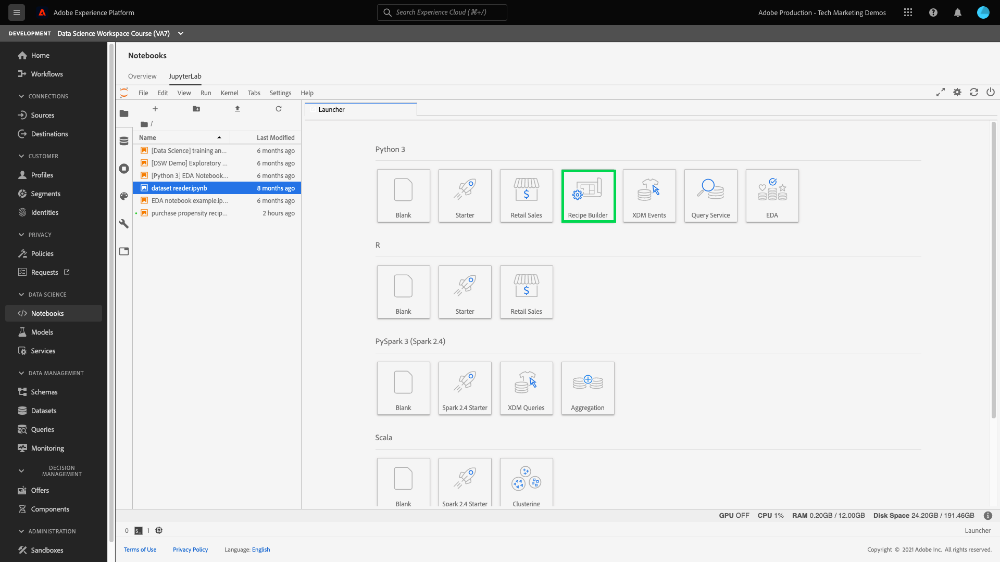

# Een recept maken met Jupyter-laptops

Deze zelfstudie heeft betrekking op twee hoofdsecties. Eerst, zult u een machine het leren model gebruikend een malplaatje binnen [!DNL JupyterLab Notebook] creëren. Vervolgens gebruikt u de workflow voor het maken van een notebook naar het recept binnen [!DNL JupyterLab] om een recept te maken binnen [!DNL Data Science Workspace].

## Ingevoerde concepten:

- **RecipesA recipe is een term** voor een modelspecificatie en een container op hoofdniveau die een specifieke machine het leren, AI algoritme of een samenstel van algoritmen, verwerkingslogica, en configuratie vertegenwoordigt die wordt vereist om een opgeleid model te bouwen en uit te voeren en daarom helpen specifieke bedrijfsproblemen oplossen.
- **Model:** Een model is een geval van een machine het leren recept dat gebruikend historische gegevens en configuraties wordt opgeleid om voor een bedrijfs geval op te lossen.
- **Training:** Training is het proces van leerpatronen en inzichten van gelabelde gegevens.
- **Scores:** Muziek is het proces om inzichten van gegevens te produceren gebruikend een opgeleid model.

## Aan de slag met de [!DNL JupyterLab]-laptopomgeving

Het maken van een geheel nieuw recept kan binnen [!DNL Data Science Workspace] worden gedaan. Navigeer naar [Adobe Experience Platform](https://platform.adobe.com) en klik op het tabblad **[!UICONTROL Laptops]** links om te starten. Maak een nieuw notebook door de Recipe Builder-sjabloon te selecteren in [!DNL JupyterLab Launcher].

Met de [!UICONTROL Recipe Builder]-laptop kunt u training en scoring uitvoeren in de laptop. Dit geeft u de flexibiliteit om veranderingen in hun `train()` en `score()` methodes in tussen het runnen van experimenten op de opleiding en het scoren gegevens aan te brengen. Als u tevreden bent met de resultaten van de training en scoring, kunt u een recept maken dat u kunt gebruiken in [!DNL Data Science Workspace] met behulp van de laptopfunctionaliteit die is ingebouwd in de Recipe Builder-laptop.

>[!NOTE]
>
>De Recipe Builder-laptop biedt ondersteuning voor het werken met alle bestandsindelingen, maar momenteel biedt de functie Ontvanger maken alleen ondersteuning voor [!DNL Python].



Wanneer u klikt op de Recipe Builder-laptop van de startprogramma, wordt de laptop geopend op het tabblad. De sjabloon die in de laptop wordt gebruikt, is de Recipe voor verkoopprognoses voor Python Retail, die ook te vinden is in [deze openbare opslagplaats](https://github.com/adobe/experience-platform-dsw-reference/tree/master/recipes/python/retail/)

U zult zien dat er op de werkbalk drie extra acties zijn: - **[!UICONTROL Training]**, **[!UICONTROL Score]** en **[!UICONTROL Ontvanger maken]**. Deze pictogrammen worden alleen weergegeven in de [!UICONTROL Recipe Builder]-laptop. Meer informatie over deze acties wordt besproken [in de sectie Training en het scoren](#training-and-scoring) nadat u de Recipe in de laptop hebt gemaakt.


## Bewerkingen uitvoeren om bestanden te recept

Als u de receptenbestanden wilt bewerken, navigeert u naar de cel in Jupyter die overeenkomt met het bestandspad. Als u bijvoorbeeld wijzigingen wilt aanbrengen in `evaluator.py`, zoekt u `%%writefile demo-recipe/evaluator.py`.

Breng de benodigde wijzigingen in de cel aan en voer de cel uit als u klaar bent. Met de opdracht `%%writefile filename.py` wordt de inhoud van de cel naar `filename.py` geschreven. U moet de cel voor elk bestand met wijzigingen handmatig uitvoeren.

>[!NOTE]
>
>U moet de cellen indien nodig handmatig uitvoeren.

## Ga aan de slag met de Recipe Builder-laptop

Nu u de basisbeginselen kent van de [!DNL JupyterLab]-laptopomgeving, kunt u beginnen met het bekijken van de bestanden die een recept vormen voor een model voor machinaal leren. De bestanden waarover we het hebben, worden hier weergegeven:

- [Vereisten, bestand](#requirements-file)
- [Configuratiebestanden](#configuration-files)
- [Opleidingsgegevensloader](#training-data-loader)
- [Scoregegevenslader](#scoring-data-loader)
- [Pipetbestand](#pipeline-file)
- [Evaluatorbestand](#evaluator-file)
- [Gegevensopslagbestand](#data-saver-file)

### Vereisten, bestand {#requirements-file}

Het bestand requirements wordt gebruikt om extra bibliotheken te declareren die u in het recept wilt gebruiken. U kunt het versienummer specificeren als er een gebiedsdeel is. Als u aanvullende bibliotheken wilt zoeken, gaat u naar [anaconda.org](https://anaconda.org). Ga naar [Conda](https://docs.conda.io/projects/conda/en/latest/user-guide/tasks/manage-environments.html#creating-an-environment-file-manually) voor meer informatie over het opmaken van het bestand met vereisten. De lijst met hoofdbibliotheken die al worden gebruikt, bevat:

```JSON
python=3.6.7
scikit-learn
pandas
numpy
data_access_sdk_python
```

>[!NOTE]
>
>Bibliotheken of specifieke versies die u toevoegt, zijn mogelijk niet compatibel met de bovenstaande bibliotheken. Als u ervoor kiest om handmatig een omgevingsbestand te maken, mag het veld `name` niet worden overschreven.

### Configuratiebestanden {#configuration-files}

De configuratiedossiers, `training.conf` en `scoring.conf`, worden gebruikt om de datasets te specificeren u voor opleiding en het scoren wenst te gebruiken evenals hyperparameters toe te voegen. Er zijn verschillende configuraties voor training en scoring.

Gebruikers moeten de volgende variabelen invullen voordat ze training en scoring uitvoeren:
- `trainingDataSetId`
- `ACP_DSW_TRAINING_XDM_SCHEMA`
- `scoringDataSetId`
- `ACP_DSW_SCORING_RESULTS_XDM_SCHEMA`
- `scoringResultsDataSetId`

Als u de gegevensset en schema-id&#39;s wilt zoeken, gaat u naar het tabblad Gegevens  in laptops op de linkernavigatiebalk (onder het mappictogram).


Dezelfde informatie vindt u op [Adobe Experience Platform](https://platform.adobe.com/) onder de tabbladen **[Schema](https://platform.adobe.com/schema)** en **[Datasets](https://platform.adobe.com/dataset/overview)**.

Standaard worden de volgende configuratieparameters voor u ingesteld wanneer u toegang krijgt tot gegevens:

- `ML_FRAMEWORK_IMS_USER_CLIENT_ID`
- `ML_FRAMEWORK_IMS_TOKEN`
- `ML_FRAMEWORK_IMS_ML_TOKEN`
- `ML_FRAMEWORK_IMS_TENANT_ID`

## Opleidingsgegevensloader {#training-data-loader}

Het doel van de trainingsgegevenslader is het instantiëren van gegevens die worden gebruikt voor het maken van het model voor machinaal leren. Er zijn doorgaans twee taken die de lader van de trainingsgegevens uitvoert:
- Gegevens laden van [!DNL Platform]
- Gegevensvoorbereiding en functietechniek

De volgende twee secties gaan over het laden van gegevens en het voorbereiden van gegevens.

### Gegevens {#loading-data} laden

In deze stap wordt het dataframe [pandas](https://pandas.pydata.org/pandas-docs/stable/generated/pandas.DataFrame.html) gebruikt. Gegevens kunnen worden geladen uit bestanden in [!DNL Adobe Experience Platform] met behulp van de [!DNL Platform] SDK (`platform_sdk`) of uit externe bronnen met behulp van de functies `read_csv()` of `read_json()` van pandas.

- [[!DNL Platform SDK]](#platform-sdk)
- [Externe bronnen](#external-sources)

>[!NOTE]
>
>In de Recipe Builder-laptop worden gegevens geladen via de `platform_sdk`-gegevenslader.

### [!DNL Platform] SDK  {#platform-sdk}

Voor een diepgaande zelfstudie over het gebruik van de `platform_sdk` gegevenslader gaat u naar de [SDK-handleiding voor Platforms](../authoring/platform-sdk.md). Dit leerprogramma verstrekt informatie over bouwstijlauthentificatie, basislezing van gegevens, en basisschrijven van gegevens.

### Externe bronnen {#external-sources}

In deze sectie ziet u hoe u een JSON- of CSV-bestand importeert naar een pandaobject. De officiële documentatie van de pandabibliotheek is te vinden op:
- [read_csv](https://pandas.pydata.org/pandas-docs/stable/generated/pandas.read_csv.html)
- [read_json](https://pandas.pydata.org/pandas-docs/stable/generated/pandas.read_json.html)

Ten eerste is hier een voorbeeld van het importeren van een CSV-bestand. Het argument `data` is het pad naar het CSV-bestand. Deze variabele is geïmporteerd uit de `configProperties` in de [vorige sectie](#configuration-files).

```PYTHON
df = pd.read_csv(data)
```

U kunt ook importeren vanuit een JSON-bestand. Het argument `data` is het pad naar het CSV-bestand. Deze variabele is geïmporteerd uit de `configProperties` in de [vorige sectie](#configuration-files).

```PYTHON
df = pd.read_json(data)
```

Uw gegevens bevinden zich nu in het dataframe-object en kunnen worden geanalyseerd en gemanipuleerd in de volgende sectie [a1/>.](#data-preparation-and-feature-engineering)

### Van Platform SDK

U kunt gegevens laden met de SDK van het Platform. De bibliotheek kan boven aan de pagina worden geïmporteerd door de volgende regel op te nemen:

`from platform_sdk.dataset_reader import DatasetReader`

Vervolgens gebruiken we de methode `load()` om de trainingsdataset van `trainingDataSetId` te pakken, zoals ingesteld in ons configuratiebestand (`recipe.conf`).

```PYTHON
def load(config_properties):
    print("Training Data Load Start")

    #########################################
    # Load Data
    #########################################    
    client_context = get_client_context(config_properties)
    
    dataset_reader = DatasetReader(client_context, config_properties['trainingDataSetId'])
    
    timeframe = config_properties.get("timeframe")
    tenant_id = config_properties.get("tenant_id")
```

>[!NOTE]
>
>Zoals vermeld in [de sectie van het Dossier van de Configuratie](#configuration-files), worden de volgende configuratieparameters geplaatst voor u wanneer u tot gegevens van Experience Platform toegang hebt gebruikend `client_context`:
> - `ML_FRAMEWORK_IMS_USER_CLIENT_ID`
> - `ML_FRAMEWORK_IMS_TOKEN`
> - `ML_FRAMEWORK_IMS_ML_TOKEN`
> - `ML_FRAMEWORK_IMS_TENANT_ID`


Nu u uw gegevens hebt, kunt u beginnen met gegevensvoorbereiding en functietechniek.

### Gegevensvoorbereiding en functietechniek {#data-preparation-and-feature-engineering}

Nadat de gegevens zijn geladen, worden de gegevens voorbereid en vervolgens gesplitst in de `train`- en `val`-gegevenssets. De voorbeeldcode wordt hieronder weergegeven:

```PYTHON
#########################################
# Data Preparation/Feature Engineering
#########################################
dataframe.date = pd.to_datetime(dataframe.date)
dataframe['week'] = dataframe.date.dt.week
dataframe['year'] = dataframe.date.dt.year

dataframe = pd.concat([dataframe, pd.get_dummies(dataframe['storeType'])], axis=1)
dataframe.drop('storeType', axis=1, inplace=True)
dataframe['isHoliday'] = dataframe['isHoliday'].astype(int)

dataframe['weeklySalesAhead'] = dataframe.shift(-45)['weeklySales']
dataframe['weeklySalesLag'] = dataframe.shift(45)['weeklySales']
dataframe['weeklySalesDiff'] = (dataframe['weeklySales'] - dataframe['weeklySalesLag']) / dataframe['weeklySalesLag']
dataframe.dropna(0, inplace=True)

dataframe = dataframe.set_index(dataframe.date)
dataframe.drop('date', axis=1, inplace=True) 
```

In dit voorbeeld worden er vijf dingen aan de originele dataset gedaan:
- `week` en `year` kolommen toevoegen
- `storeType` omzetten in een indicatorvariabele
- `isHoliday` omzetten in een numerieke variabele
- verschuiving `weeklySales` om verkoopwaarde in de toekomst en in het verleden te bepalen
- gesplitste gegevens, op datum, naar `train`- en `val`-gegevensset

Eerst worden `week` en `year` kolommen gemaakt en wordt de oorspronkelijke `date` kolom omgezet in [!DNL Python] [datetime](https://pandas.pydata.org/pandas-docs/stable/generated/pandas.to_datetime.html). Week- en jaarwaarden worden geëxtraheerd uit het datetime-object.

Vervolgens wordt `storeType` omgezet in drie kolommen die de drie verschillende winkeltypen vertegenwoordigen: (`A`, `B` en `C`). Elk object bevat een booleaanse waarde die aangeeft dat `storeType` waar is. De kolom `storeType` wordt verwijderd.

En `weeklySales` verandert `isHoliday` booleaan in een numerieke vertegenwoordiging, één of nul.

Deze gegevens worden gesplitst tussen `train` en `val` dataset.

De `load()` functie zou met `train` en `val` dataset als output moeten voltooien.

### Scoregegevenslader {#scoring-data-loader}

De procedure voor het laden van gegevens voor scoring is vergelijkbaar met de trainingsgegevens voor het laden van de functie `split()`. We gebruiken de SDK voor gegevenstoegang om gegevens te laden uit het `scoringDataSetId`-bestand in ons `recipe.conf`-bestand.

```PYTHON
def load(config_properties):

    print("Scoring Data Load Start")

    #########################################
    # Load Data
    #########################################
    client_context = get_client_context(config_properties)

    dataset_reader = DatasetReader(client_context, config_properties['scoringDataSetId'])
    timeframe = config_properties.get("timeframe")
    tenant_id = config_properties.get("tenant_id")
```

Nadat de gegevens zijn geladen, worden de gegevens voorbereid en worden de functies verbeterd.

```PYTHON
    #########################################
    # Data Preparation/Feature Engineering
    #########################################
    if '_id' in dataframe.columns:
        #Rename columns to strip tenantId
        dataframe = dataframe.rename(columns = lambda x : str(x)[str(x).find('.')+1:])
        #Drop id, eventType and timestamp
        dataframe.drop(['_id', 'eventType', 'timestamp'], axis=1, inplace=True)

    dataframe.date = pd.to_datetime(dataframe.date)
    dataframe['week'] = dataframe.date.dt.week
    dataframe['year'] = dataframe.date.dt.year

    dataframe = pd.concat([dataframe, pd.get_dummies(dataframe['storeType'])], axis=1)
    dataframe.drop('storeType', axis=1, inplace=True)
    dataframe['isHoliday'] = dataframe['isHoliday'].astype(int)

    dataframe['weeklySalesAhead'] = dataframe.shift(-45)['weeklySales']
    dataframe['weeklySalesLag'] = dataframe.shift(45)['weeklySales']
    dataframe['weeklySalesDiff'] = (dataframe['weeklySales'] - dataframe['weeklySalesLag']) / dataframe['weeklySalesLag']
    dataframe.dropna(0, inplace=True)

    dataframe = dataframe.set_index(dataframe.date)
    dataframe.drop('date', axis=1, inplace=True)

    print("Scoring Data Load Finish")

    return dataframe
```

Aangezien het doel van ons model de toekomstige wekelijkse verkoop moet voorspellen, zult u een het scoren dataset moeten creëren die wordt gebruikt om te evalueren hoe goed de voorspelling van het model presteert.

Dit doet de Recipe Builder-laptop door onze wekelijkse verkoop 7 dagen vooruit te compenseren. U ziet dat er metingen zijn voor 45 winkels elke week, zodat u de waarden `weeklySales` 45 gegevenssets naar een nieuwe kolom met de naam `weeklySalesAhead` kunt verplaatsen.

```PYTHON
df['weeklySalesAhead'] = df.shift(-45)['weeklySales']
```

Op dezelfde manier kunt u een kolom `weeklySalesLag` tot stand brengen door 45 achter te bewegen. Met dit kunt u ook het verschil in wekelijkse verkopen berekenen en deze opslaan in kolom `weeklySalesDiff`.

```PYTHON
df['weeklySalesLag'] = df.shift(45)['weeklySales']
df['weeklySalesDiff'] = (df['weeklySales'] - df['weeklySalesLag']) / df['weeklySalesLag']
```

Aangezien u `weeklySales` datapoints 45 datasets door:sturen en 45 datasets achterwaarts compenseert om nieuwe kolommen tot stand te brengen, zullen de eerste en laatste 45 gegevenspunten waarden NaN hebben. U kunt deze punten uit onze dataset verwijderen door de `df.dropna()` functie te gebruiken die alle rijen verwijdert die waarden NaN hebben.

```PYTHON
df.dropna(0, inplace=True)
```

De functie `load()` in uw het scoren gegevenslader zou met de het scoren dataset als output moeten voltooien.

### Pipettenbestand {#pipeline-file}

Het `pipeline.py`-bestand bevat logica voor training en scoring.

### Training {#training}

Het doel van opleiding is een model te creëren gebruikend eigenschappen en etiketten in uw opleidingsdataset.

>[!NOTE]
> 
>Functies verwijzen naar de invoervariabele die door het model voor machinaal leren wordt gebruikt om de labels te voorspellen.

De functie `train()` moet het trainingsmodel bevatten en het getrainde model retourneren. Enkele voorbeelden van verschillende modellen vindt u in de documentatie van de [handleiding voor scikit-learn-gebruikers](https://scikit-learn.org/stable/user_guide.html).

Na het kiezen van uw trainingsmodel, zult u uw x en y opleidingsdataset aan het model passen en de functie zal het getrainde model terugkeren. Een voorbeeld dat dit toont is als volgt:

```PYTHON
def train(configProperties, data):

    print("Train Start")

    #########################################
    # Extract fields from configProperties
    #########################################
    learning_rate = float(configProperties['learning_rate'])
    n_estimators = int(configProperties['n_estimators'])
    max_depth = int(configProperties['max_depth'])


    #########################################
    # Fit model
    #########################################
    X_train = data.drop('weeklySalesAhead', axis=1).values
    y_train = data['weeklySalesAhead'].values

    seed = 1234
    model = GradientBoostingRegressor(learning_rate=learning_rate,
                                      n_estimators=n_estimators,
                                      max_depth=max_depth,
                                      random_state=seed)

    model.fit(X_train, y_train)

    print("Train Complete")

    return model
```

Afhankelijk van uw toepassing hebt u argumenten in uw functie `GradientBoostingRegressor()`. `xTrainingDataset` moet de functies bevatten die voor training worden gebruikt, maar  `yTrainingDataset` moet ook uw labels bevatten.

### Scores {#scoring}

De functie `score()` moet het scorealgoritme bevatten en een meting retourneren om aan te geven hoe succesvol het model is. De functie `score()` gebruikt de het scoren datasetetiketten en het opgeleide model om een reeks voorspelde eigenschappen te produceren. Deze voorspelde waarden worden vervolgens vergeleken met de eigenlijke kenmerken in de gegevensset voor scoren. In dit voorbeeld gebruikt de functie `score()` het getrainde model om functies te voorspellen met de labels uit de scoredataset. De voorspelde functies worden geretourneerd.

```PYTHON
def score(configProperties, data, model):

    print("Score Start")

    X_test = data.drop('weeklySalesAhead', axis=1).values
    y_test = data['weeklySalesAhead'].values
    y_pred = model.predict(X_test)

    data['prediction'] = y_pred
    data = data[['store', 'prediction']].reset_index()
    data['date'] = data['date'].astype(str)

    print("Score Complete")

    return data
```

### Evaluatorbestand {#evaluator-file}

Het `evaluator.py`-bestand bevat logica voor de manier waarop u uw getrainde recept wilt evalueren en voor de manier waarop uw trainingsgegevens moeten worden gesplitst. In het voorbeeld van de detailhandel wordt de logica voor het laden en voorbereiden van de trainingsgegevens opgenomen. We zullen de twee onderstaande secties doornemen.

### De gegevensset {#split-the-dataset} splitsen

De fase van de gegevensvoorbereiding voor opleiding vereist opsplitsing van de gegevensset die voor opleiding en tests moet worden gebruikt. Deze `val` gegevens zullen impliciet worden gebruikt om het model te evalueren nadat het wordt opgeleid. Dit proces staat los van scoring.

In deze sectie wordt de functie `split()` weergegeven die eerst gegevens in de laptop laadt en vervolgens de gegevens opschoont door niet-verwante kolommen uit de gegevensset te verwijderen. Vanaf dat punt kunt u functietechniek uitvoeren. Dit is het proces om aanvullende relevante functies te maken op basis van bestaande onbewerkte functies in de gegevens. Een voorbeeld van dit proces is hieronder samen met een verklaring te zien.

De functie `split()` wordt hieronder getoond. Het dataframe dat in het argument wordt opgegeven, wordt gesplitst naar de variabelen `train` en `val` die moeten worden geretourneerd.

```PYTHON
def split(self, configProperties={}, dataframe=None):
    train_start = '2010-02-12'
    train_end = '2012-01-27'
    val_start = '2012-02-03'
    train = dataframe[train_start:train_end]
    val = dataframe[val_start:]

    return train, val
```

### Evalueer het opgeleide model {#evaluate-the-trained-model}

De functie `evaluate()` wordt uitgevoerd nadat het model wordt getraind en zal metrisch terugkeren om erop te wijzen hoe succesvol het model presteert. De functie `evaluate()` gebruikt de labels van de testdataset en het Getrainde model om een reeks eigenschappen te voorspellen. Deze voorspelde waarden worden vervolgens vergeleken met de feitelijke kenmerken in de testdataset. Veelvoorkomende scoringsalgoritmen zijn:
- [Gemiddelde absolute percentagefout (MAPE)](https://en.wikipedia.org/wiki/Mean_absolute_percentage_error)
- [Gemiddelde absolute fout (MAE)](https://en.wikipedia.org/wiki/Mean_absolute_error)
- [Root-gemiddelde-vierkante fout (RMSE)](https://en.wikipedia.org/wiki/Root-mean-square_deviation)


De functie `evaluate()` in het detailhandelsvoorbeeld wordt hieronder getoond:

```PYTHON
def evaluate(self, data=[], model={}, configProperties={}):
    print ("Evaluation evaluate triggered")
    val = data.drop('weeklySalesAhead', axis=1)
    y_pred = model.predict(val)
    y_actual = data['weeklySalesAhead'].values
    mape = np.mean(np.abs((y_actual - y_pred) / y_actual))
    mae = np.mean(np.abs(y_actual - y_pred))
    rmse = np.sqrt(np.mean((y_actual - y_pred) ** 2))

    metric = [{"name": "MAPE", "value": mape, "valueType": "double"},
                {"name": "MAE", "value": mae, "valueType": "double"},
                {"name": "RMSE", "value": rmse, "valueType": "double"}]

    return metric
```

De functie retourneert een `metric`-object met een array van evaluatiemetriek. Deze metriek zal worden gebruikt om te evalueren hoe goed het opgeleide model presteert.

### Gegevensopslagbestand {#data-saver-file}

Het `datasaver.py`-bestand bevat de functie `save()` om uw voorspelling op te slaan tijdens het testen van scoring. De functie `save()` zal uw voorspelling nemen en het gebruiken van [!DNL Experience Platform Catalog] APIs, schrijft de gegevens aan `scoringResultsDataSetId` u in uw `scoring.conf` dossier specificeerde.

Het voorbeeld dat in het in de detailhandel verkrijgbare product wordt gebruikt, is hier te zien. Let op het gebruik van `DataSetWriter`-bibliotheek om gegevens naar Platform te schrijven:

```PYTHON
from data_access_sdk_python.writer import DataSetWriter

def save(configProperties, prediction):
    print("Datasaver Start")
    print("Setting up Writer")

    catalog_url = "https://platform.adobe.io/data/foundation/catalog"
    ingestion_url = "https://platform.adobe.io/data/foundation/import"

    writer = DataSetWriter(catalog_url=catalog_url,
                           ingestion_url=ingestion_url,
                           client_id=configProperties['ML_FRAMEWORK_IMS_USER_CLIENT_ID'],
                           user_token=configProperties['ML_FRAMEWORK_IMS_TOKEN'],
                           service_token=configProperties['ML_FRAMEWORK_IMS_ML_TOKEN'])

    print("Writer Configured")

    writer.write(data_set_id=configProperties['scoringResultsDataSetId'],
                 dataframe=prediction,
                 ims_org=configProperties['ML_FRAMEWORK_IMS_TENANT_ID'])

    print("Write Done")
    print("Datasaver Finish")
    print(prediction)
```

## Training en scores {#training-and-scoring}

Wanneer u klaar bent met het aanbrengen van wijzigingen in uw laptop en uw recept wilt trainen, kunt u op de bijbehorende knoppen boven aan de balk klikken om een trainingsrun in de cel te maken. Nadat u op de knop hebt geklikt, wordt een logboek met opdrachten en uitvoerbestanden van het trainingsscript weergegeven in de laptop (onder de `evaluator.py`-cel). Conda installeert eerst alle gebiedsdelen, dan wordt de opleiding in werking gesteld.

Let erop dat u minstens één keer training moet uitvoeren voordat u scoring kunt uitvoeren. Wanneer u op de knop **[!UICONTROL Scores uitvoeren]** klikt, wordt het getrainde model dat tijdens de training is gegenereerd, gescand. Het scorescript wordt onder `datasaver.py` weergegeven.

Voor het zuiveren doeleinden, als u wenst om de verborgen output te zien, voeg `debug` aan het eind van de outputcel toe en stel het opnieuw in werking.

## Recept maken {#create-recipe}

Als u klaar bent met het bewerken van het recept en tevreden bent met de trainings-/scoringuitvoer, kunt u een recept maken van de laptop door te drukken op **[!UICONTROL Recipe maken]** in de navigatie rechtsboven.


Nadat u op de knop hebt gedrukt, wordt u gevraagd een naam voor het recept in te voeren. Deze naam staat voor het recept dat daadwerkelijk op [!DNL Platform] is gemaakt.


Nadat u op **[!UICONTROL Ok]** hebt gedrukt, kunt u naar het nieuwe recept navigeren op [Adobe Experience Platform](https://platform.adobe.com/). U kunt op **[!UICONTROL Ontvangers van de Mening]** knoop klikken om u aan **[!UICONTROL Ontvangt]** tabel onder **[!UICONTROL Modellen van XML]** te brengen


Zodra het proces is voltooid, zal het recept er ongeveer als volgt uitzien:


>[!CAUTION]
>
> - Geen van de bestandscellen verwijderen
> - Bewerk de regel `%%writefile` niet boven aan de bestandscellen
> - Geen recepten in verschillende notebooks tegelijk maken


## Volgende stappen {#next-steps}

Door deze zelfstudie te voltooien, hebt u geleerd hoe u een model voor computerleren kunt maken in de Recipe Builder-laptop. U hebt ook geleerd hoe u de workflow voor notebooks kunt gebruiken om een recept te maken binnen [!DNL Data Science Workspace].

Ga naar [!DNL Data Science Workspace] recepten en modellen dropdown om te leren werken met bronnen binnen [!DNL Data Science Workspace].

## Aanvullende bronnen {#additional-resources}

De volgende video is ontworpen om uw inzicht in het bouwen en implementeren van modellen te ondersteunen.

>[!VIDEO](https://video.tv.adobe.com/v/30575?quality=12&enable10seconds=on&speedcontrol=on)


