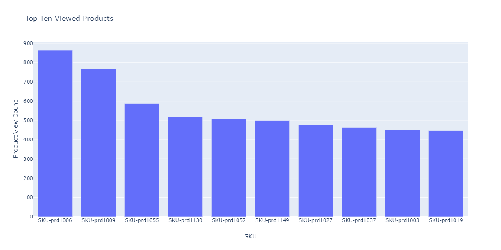

# Webgegevens verkennen voor voorspellende modellen met behulp van de EDA-laptop (exploratory Data Analysis)

De EDA-laptop (Exploratory Data Analysis) is ontworpen om u te helpen patronen in gegevens te ontdekken, de gegevenshygiëne te controleren en de relevante gegevens voor voorspellende modellen samen te vatten.

Het EDA-laptopvoorbeeld is geoptimaliseerd met gegevens voor het web en bestaat uit twee onderdelen. Deel één begint met het gebruiken van de Dienst van de Vraag om tendensen en gegevensmomentopnamen te bekijken. Vervolgens worden de gegevens geaggregeerd op profiel- en bezoekersniveau, met het oog op de verkennende gegevensanalyse.

Deel twee begint met een beschrijvende analyse van de geaggregeerde gegevens met behulp van Python-bibliotheken. Deze laptop toont visualisaties zoals histogrammen, verstrooiingspunten, vakpercelen en een correlatiematrix om actioneerbare inzichten af te leiden die worden gebruikt om te bepalen welke eigenschappen het meest waarschijnlijk nuttig zijn om een doel te voorspellen.

## Aan de slag

Voordat u deze handleiding leest, raadpleegt u de [[!DNL JupyterLab] gebruikershandleiding](./overview.md) voor een inleiding op hoog niveau op [!DNL JupyterLab] en de rol ervan in de werkruimte voor wetenschap van gegevens. Als u uw eigen gegevens gebruikt, raadpleegt u bovendien de documentatie voor [gegevenstoegang in [!DNL Jupyterlab] notebooks](./access-notebook-data.md). Deze handleiding bevat belangrijke informatie over de gegevenslimieten van laptops.

Deze laptop gebruikt een gegevensset met gemiddelde waarden in de vorm van Adobe Analytics Experience Events-gegevens in de Analytics Analysis Workspace. Als u de EDA-laptop wilt gebruiken, moet u de gegevenstabel definiëren met de volgende waarden `target_table` en `target_table_id`. Om het even welke middelwaarden dataset kan worden gebruikt.

Om deze waarden te vinden, volg de stappen in [schrijven aan een dataset in python](./access-notebook-data.md#write-python) sectie van de gids van de de gegevenstoegang JupyterLab worden geschetst. De naam van de gegevensset (`target_table`) bevindt zich in de directory van de gegevensset. Zodra u met de rechtermuisknop op de dataset klikt om gegevens in een notitieboekje te onderzoeken of te schrijven, wordt een dataset identiteitskaart (`target_table_id`) verstrekt in de uitvoerbare codeingang.

## Gegevensdetectie

Deze sectie bevat configuratiestappen en voorbeeldvragen die worden gebruikt om tendensen zoals &quot;top tien steden door gebruikersactiviteit&quot;of &quot;top tien bekeken producten&quot;te bekijken.

### Configuratie van bibliotheken

JupyterLab ondersteunt meerdere bibliotheken. De volgende code kan in een codecel worden geplakt en uitgevoerd om alle vereiste pakketten te verzamelen en te installeren die in dit voorbeeld worden gebruikt. U kunt extra of alternatieve pakketten buiten dit voorbeeld voor uw eigen gegevensanalyse gebruiken. Kopieer en plak `!pip list --format=columns` in een nieuwe cel voor een lijst met ondersteunde pakketten.

```python
!pip install colorama
import chart_studio.plotly as py
import plotly.graph_objs as go
from plotly.offline import iplot
from scipy import stats
import numpy as np
import warnings
warnings.filterwarnings('ignore')
from scipy.stats import pearsonr
import matplotlib.pyplot as plt
from scipy.stats import pearsonr
import pandas as pd
import math
import re
import seaborn as sns
from datetime import datetime
import colorama
from colorama import Fore, Style
pd.set_option('display.max_columns', None)
pd.set_option('display.max_rows', None)
pd.set_option('display.width', 1000)
pd.set_option('display.expand_frame_repr', False)
pd.set_option('display.max_colwidth', -1)
```

### Verbinden met Adobe Experience Platform [!DNL Query Service]

[!DNL JupyterLab] op Platform staat u toe om SQL in een  [!DNL Python] notitieboekje te gebruiken om tot gegevens door de Dienst [ van de ](https://www.adobe.com/go/query-service-home-en)Vraag toegang te hebben. Toegang tot gegevens via [!DNL Query Service] kan nuttig zijn voor het verwerken van grote gegevenssets vanwege de superieure werktijden. Houd er rekening mee dat het opvragen van gegevens met [!DNL Query Service] een verwerkingstijd van tien minuten heeft.

Voordat u [!DNL Query Service] in [!DNL JupyterLab] gebruikt, moet u ervoor zorgen dat u een goed begrip hebt van de [[!DNL Query Service] SQL-syntaxis](https://www.adobe.com/go/query-service-sql-syntax-en).

Om de Dienst van de Vraag in JupyterLab te gebruiken, moet u eerst een verbinding tussen uw werkende Notitieboekje Python en de Dienst van de Vraag tot stand brengen. Dit kan worden bereikt door de volgende cel uit te voeren.

```python
qs_connect()
```

### De gegevensset met middentonen definiëren voor exploratie

Om met het vragen van en het onderzoeken van gegevens te beginnen, moet een midvalues datasetlijst worden verstrekt. Kopieer en vervang de waarden `table_name` en `table_id` door uw eigen waarden van de gegevenstabel.

```python
target_table = "table_name"
target_table_id = "table_id"
```

Na voltooiing, zou deze cel aan het volgende voorbeeld gelijkaardig moeten kijken:

```python
target_table = "cross_industry_demo_midvalues"
target_table_id = "5f7c40ef488de5194ba0157a"
```

### De dataset voor beschikbare data verkennen

Met de onderstaande cel kunt u het datumbereik weergeven dat in de tabel wordt behandeld. Het doel van het onderzoeken van het aantal dagen, eerste datum, en laatste datum, is om bij het selecteren van een datumwaaier voor verdere analyse te helpen.

```python
%%read_sql -c QS_CONNECTION
SELECT distinct Year(timestamp) as Year, Month(timestamp) as Month, count(distinct DAY(timestamp)) as Count_days, min(DAY(timestamp)) as First_date, max(DAY(timestamp)) as Last_date, count(timestamp) as Count_hits
from {target_table}
group by Month(timestamp), Year(timestamp)
order by Year, Month;
```

Als u de cel uitvoert, wordt de volgende uitvoer geproduceerd:


### Datums configureren voor detectie van gegevenssets

Na het bepalen van de beschikbare data voor datasetontdekking, moeten de hieronder parameters worden bijgewerkt. De datums die in deze cel worden geconfigureerd, worden alleen gebruikt voor gegevensdetectie in de vorm van query&#39;s. De data worden later in deze handleiding opnieuw bijgewerkt tot geschikte bereiken voor verkennende gegevensanalyse.

```python
target_year = "2020" ## The target year
target_month = "02" ## The target month
target_day = "(01,02,03)" ## The target days
```

### Detectie gegevensset

Nadat u alle parameters hebt geconfigureerd, [!DNL Query Service] hebt gestart en een datumbereik hebt, kunt u beginnen met het lezen van gegevensrijen. U moet het aantal rijen dat u leest, beperken.

```python
from platform_sdk.dataset_reader import DatasetReader
from datetime import date
dataset_reader = DatasetReader(PLATFORM_SDK_CLIENT_CONTEXT, dataset_id=target_table_id)
# If you do not see any data or would like to expand the default date range, change the following query
Table = dataset_reader.limit(5).read()
```

Gebruik de volgende cel om het aantal kolommen weer te geven dat beschikbaar is in de dataset:

```python
print("\nNumber of columns:",len(Table.columns))
```

Gebruik de volgende cel om de rijen van de gegevensset weer te geven. In dit voorbeeld is het aantal rijen beperkt tot vijf.

```python
Table.head(5)
```


Zodra u een idee hebt van welke gegevens in de dataset bevat, kan het waardevol zijn om de dataset verder te verdelen. In dit voorbeeld worden de kolomnamen en gegevenstypen voor elk van de kolommen weergegeven, terwijl de uitvoer wordt gebruikt om te controleren of het gegevenstype correct is of niet.

```python
ColumnNames_Types = pd.DataFrame(Table.dtypes)
ColumnNames_Types = ColumnNames_Types.reset_index()
ColumnNames_Types.columns = ["Column_Name", "Data_Type"]
ColumnNames_Types
```


### Verkenning gegevenssettrend

De volgende sectie bevat vier voorbeeldvragen die worden gebruikt om tendensen en patronen in gegevens te onderzoeken. De onderstaande voorbeelden zijn niet uitputtend, maar hebben betrekking op een aantal van de meer algemeen bekeken kenmerken.

**Aantal uren activiteit voor een bepaalde dag**

Deze vraag analyseert het aantal acties en klikt door de dag. De output wordt vertegenwoordigd in de vorm van een lijst die metriek op het activiteitenaantal voor elk uur van de dag bevat.

```sql
%%read_sql query_2_df -c QS_CONNECTION

SELECT Substring(timestamp, 12, 2)                        AS Hour, 
       Count(enduserids._experience.aaid.id) AS Count 
FROM   {target_table}
WHERE  Year(timestamp) = {target_year} 
       AND Month(timestamp) = {target_month}  
       AND Day(timestamp) in {target_day}
GROUP  BY Hour
ORDER  BY Hour;
```


Na bevestiging van de vraagwerken, kunnen de gegevens in een univariate histogram van het plot voor visuele duidelijkheid worden voorgesteld.

```python
trace = go.Bar(
    x = query_2_df['Hour'],
    y = query_2_df['Count'],
    name = "Activity Count"
)

layout = go.Layout(
    title = 'Activity Count by Hour of Day',
    width = 1200,
    height = 600,
    xaxis = dict(title = 'Hour of Day'),
    yaxis = dict(title = 'Count')
)

fig = go.Figure(data = [trace], layout = layout)
iplot(fig)
```


**De bovenste tien weergegeven pagina&#39;s voor een bepaalde dag**

Deze vraag analyseert welke pagina&#39;s het meest voor een bepaalde dag worden bekeken. De uitvoer wordt weergegeven in de vorm van een tabel met meetgegevens voor de paginanaam en het aantal pagina&#39;s.

```sql
%%read_sql query_4_df -c QS_CONNECTION

SELECT web.webpagedetails.name                 AS Page_Name, 
       Sum(web.webpagedetails.pageviews.value) AS Page_Views 
FROM   {target_table}
WHERE  Year(timestamp) = {target_year}
       AND Month(timestamp) = {target_month}
       AND Day(timestamp) in {target_day}
GROUP  BY web.webpagedetails.name 
ORDER  BY page_views DESC 
LIMIT  10;
```

Na bevestiging van de vraagwerken, kunnen de gegevens in een univariate histogram van het plot voor visuele duidelijkheid worden voorgesteld.

```python
trace = go.Bar(
    x = query_4_df['Page_Name'],
    y = query_4_df['Page_Views'],
    name = "Page Views"
)

layout = go.Layout(
    title = 'Top Ten Viewed Pages For a Given Day',
    width = 1000,
    height = 600,
    xaxis = dict(title = 'Page_Name'),
    yaxis = dict(title = 'Page_Views')
)

fig = go.Figure(data = [trace], layout = layout)
iplot(fig)
```


**Tien steden bovenaan gegroepeerd op gebruikersactiviteit**

Deze vraag analyseert welke steden de gegevens uit voortkomen.

```sql
%%read_sql query_6_df -c QS_CONNECTION

SELECT concat(placeContext.geo.stateProvince, ' - ', placeContext.geo.city) AS state_city, 
       Count(timestamp)                                                     AS Count
FROM   {target_table}
WHERE  Year(timestamp) = {target_year}
       AND Month(timestamp) = {target_month}
       AND Day(timestamp) in {target_day}
GROUP  BY state_city
ORDER  BY Count DESC
LIMIT  10;
```

Na bevestiging van de vraagwerken, kunnen de gegevens in een univariate histogram van het plot voor visuele duidelijkheid worden voorgesteld.

```python
trace = go.Bar(
    x = query_6_df['state_city'],
    y = query_6_df['Count'],
    name = "Activity by City"
)

layout = go.Layout(
    title = 'Top Ten Cities by User Activity',
    width = 1200,
    height = 600,
    xaxis = dict(title = 'City'),
    yaxis = dict(title = 'Count')
)

fig = go.Figure(data = [trace], layout = layout)
iplot(fig)
```


**De tien meest bekeken producten**

Deze vraag verstrekt een lijst van de hoogste tien bekeken producten. In het onderstaande voorbeeld wordt de functie `Explode()` gebruikt om elk product in het object `productlistitems` naar de eigen rij te retourneren. Dit staat u toe om een genestelde vraag te doen om productmeningen voor verschillende SKU&#39;s samen te voegen.

```sql
%%read_sql query_7_df -c QS_CONNECTION

SELECT Product_List_Items.sku AS Product_SKU,
       Sum(Product_Views) AS Total_Product_Views
FROM  (SELECT Explode(productlistitems) AS Product_List_Items, 
              commerce.productviews.value   AS Product_Views 
       FROM   {target_table}
       WHERE  Year(timestamp) = {target_year}
              AND Month(timestamp) = {target_month}
              AND Day(timestamp) in {target_day}
              AND commerce.productviews.value IS NOT NULL) 
GROUP BY Product_SKU 
ORDER BY Total_Product_Views DESC
LIMIT  10;
```

Na bevestiging van de vraagwerken, kunnen de gegevens in een univariate histogram van het plot voor visuele duidelijkheid worden voorgesteld.

```python
trace = go.Bar(
    x = "SKU-" + query_7_df['Product_SKU'],
    y = query_7_df['Total_Product_Views'],
    name = "Product View"
)

layout = go.Layout(
    title = 'Top Ten Viewed Products',
    width = 1200,
    height = 600,
    xaxis = dict(title = 'SKU'),
    yaxis = dict(title = 'Product View Count')
)

fig = go.Figure(data = [trace], layout = layout)
iplot(fig)
```



Na het onderzoeken van de tendensen en de patronen van de gegevens, zou u een goed idee moeten hebben over welke eigenschappen u voor een voorspelling van een doel wilt bouwen. Skimming through lijsten kan snel de vorm van elk gegevensattribuut, duidelijke misvertegenwoordiging, en grote outliers in de waarden benadrukken en beginnen kandidaat verhoudingen voor te stellen om tussen attributen te onderzoeken.

## Verkennende gegevensanalyse

De verkennende gegevensanalyse wordt gebruikt om uw begrip van de gegevens te verfijnen en een intuïtie voor dwingende vragen te bouwen die als basis voor uw modellering kunnen worden gebruikt.

Nadat u de stap voor het detecteren van gegevens hebt voltooid, hebt u de gegevens op gebeurtenisniveau verkend met enkele aggregaties op het niveau van de gebeurtenis, stad of gebruikers-id om trends voor een dag te zien. Hoewel deze gegevens belangrijk zijn, geven ze geen volledig beeld. U begrijpt nog steeds niet wat de drijvende kracht achter een aankoop op uw website is.

Om dit te begrijpen, moet u gegevens op een profiel/bezoekersniveau samenvoegen, een aankoopdoel bepalen, en statistische concepten zoals correlatie, kaderpercelen, en verstrooiingspunten toepassen. Deze methoden worden gebruikt om patronen van activiteiten voor kopers te vergelijken met niet-kopers in het voorspellingsvenster dat u definieert.

De volgende functies worden gemaakt en onderzocht in deze sectie:

- `COUNT_UNIQUE_PRODUCTS_PURCHASED`: Het aantal unieke producten dat is aangeschaft.
- `COUNT_CHECK_OUTS`: Het aantal uitchecken.
- `COUNT_PURCHASES`: Het aantal aankopen.
- `COUNT_INSTANCE_PRODUCTADDS`: Het aantal exemplaren van het product dat wordt toegevoegd.
- `NUMBER_VISITS` : Het aantal bezoeken.
- `COUNT_PAID_SEARCHES`: Het aantal betaalde zoekopdrachten.
- `DAYS_SINCE_VISIT`: Het aantal dagen sinds het laatste bezoek.
- `TOTAL_ORDER_REVENUE`: De totale inkomsten uit bestellingen.
- `DAYS_SINCE_PURCHASE`: Het aantal dagen sinds de vorige aankoop.
- `AVG_GAP_BETWEEN_ORDERS_DAYS`: Het gemiddelde verschil tussen aankopen in dagen.
- `STATE_CITY`: Bevat de staat en de stad.

Voordat u verdergaat met de gegevensaggregatie, moet u de parameters definiëren voor de voorspellingsvariabele die wordt gebruikt in de analyse van verkennende gegevens. Met andere woorden, wat wil je van je data science model? De gemeenschappelijke parameters omvatten een doel, een voorspellingsperiode, en een analyseperiode.

Als u de EDA-laptop gebruikt, moet u de onderstaande waarden vervangen voordat u verdergaat.

```python
goal = "commerce.`order`.purchaseID" #### prediction variable
goal_column_type = "numerical" #### choose either "categorical" or "numerical"
prediction_window_day_start = "2020-01-01" #### YYYY-MM-DD
prediction_window_day_end = "2020-01-31" #### YYYY-MM-DD
analysis_period_day_start = "2020-02-01" #### YYYY-MM-DD
analysis_period_day_end = "2020-02-28" #### YYYY-MM-DD

### If the goal is a categorical goal then select threshold for the defining category and creating bins. 0 is no order placed, and 1 is at least one order placed:
threshold = 1
```

### Gegevenssamenvoeging voor functie en doel maken

Om met verkennende analyse te beginnen, moet u een doel op het profielniveau tot stand brengen, door uw dataset te groeperen wordt gevolgd. In dit voorbeeld worden twee query&#39;s opgegeven. De eerste vraag bevat de verwezenlijking van een doel. De tweede vraag moet worden bijgewerkt om het even welke variabelen buiten degenen in de eerste vraag te omvatten. U kunt `limit` voor uw vraag willen bijwerken. Nadat u de volgende query&#39;s hebt uitgevoerd, zijn de samengevoegde gegevens nu beschikbaar voor verkenning.

```sql
%%read_sql target_df -d -c QS_CONNECTION

SELECT DISTINCT endUserIDs._experience.aaid.id                  AS ID,
       Count({goal})                                            AS TARGET
FROM   {target_table}
WHERE DATE(TIMESTAMP) BETWEEN '{prediction_window_day_start}' AND '{prediction_window_day_end}'
GROUP BY endUserIDs._experience.aaid.id;
```

```sql
%%read_sql agg_data -d -c QS_CONNECTION

SELECT z.*, z1.state_city as STATE_CITY
from
((SELECT y.*,a2.AVG_GAP_BETWEEN_ORDERS_DAYS as AVG_GAP_BETWEEN_ORDERS_DAYS
from
(select a1.*, f.DAYS_SINCE_PURCHASE as DAYS_SINCE_PURCHASE
from
(SELECT DISTINCT a.ID  AS ID,
COUNT(DISTINCT Product_Items.SKU) as COUNT_UNIQUE_PRODUCTS_PURCHASED,
COUNT(a.check_out) as COUNT_CHECK_OUTS,
COUNT(a.purchases) as COUNT_PURCHASES, 
COUNT(a.product_list_adds) as COUNT_INSTANCE_PRODUCTADDS,
sum(CASE WHEN a.search_paid = 'TRUE' THEN 1 ELSE 0 END) as COUNT_PAID_SEARCHES,
DATEDIFF('{analysis_period_day_end}', MAX(a.date_a)) as DAYS_SINCE_VISIT,
ROUND(SUM(Product_Items.priceTotal * Product_Items.quantity), 2) AS TOTAL_ORDER_REVENUE
from 
(SELECT endUserIDs._experience.aaid.id as ID,
commerce.`checkouts`.value as check_out,
commerce.`order`.purchaseID as purchases, 
commerce.`productListAdds`.value as product_list_adds,
search.isPaid as search_paid,
DATE(TIMESTAMP) as date_a,
Explode(productlistitems) AS Product_Items
from {target_table}
Where DATE(TIMESTAMP) BETWEEN '{analysis_period_day_start}' AND '{analysis_period_day_end}') as a
group by a.ID) as a1
left join 
(SELECT DISTINCT endUserIDs._experience.aaid.id as ID,
DATEDIFF('{analysis_period_day_end}', max(DATE(TIMESTAMP))) as DAYS_SINCE_PURCHASE
from {target_table}
where DATE(TIMESTAMP) BETWEEN '{analysis_period_day_start}' AND '{analysis_period_day_end}'
and commerce.`order`.purchaseid is not null
GROUP BY endUserIDs._experience.aaid.id) as f
on f.ID = a1.ID
where a1.COUNT_PURCHASES>0) as y
left join
(select ab.ID, avg(DATEDIFF(ab.ORDER_DATES, ab.PriorDate)) as AVG_GAP_BETWEEN_ORDERS_DAYS
from
(SELECT distinct endUserIDs._experience.aaid.id as ID, TO_DATE(DATE(TIMESTAMP)) as ORDER_DATES, 
TO_DATE(LAG(DATE(TIMESTAMP),1) OVER (PARTITION BY endUserIDs._experience.aaid.id ORDER BY DATE(TIMESTAMP))) as PriorDate
FROM {target_table}
where DATE(TIMESTAMP) BETWEEN '{analysis_period_day_start}' AND '{analysis_period_day_end}'
AND commerce.`order`.purchaseid is not null) AS ab
where ab.PriorDate is not null
GROUP BY ab.ID) as a2
on a2.ID = y.ID) z    
left join
(select t.ID, t.state_city from
(
SELECT DISTINCT endUserIDs._experience.aaid.id as ID,
concat(placeContext.geo.stateProvince, ' - ', placeContext.geo.city) as state_city, 
ROW_NUMBER() OVER(PARTITION BY endUserIDs._experience.aaid.id ORDER BY DATE(TIMESTAMP) DESC) AS ROWNUMBER
FROM   {target_table}
WHERE  DATE(TIMESTAMP) BETWEEN '{analysis_period_day_start}' AND '{analysis_period_day_end}') as t
where t.ROWNUMBER = 1) z1
on z.ID = z1.ID)
limit 500000;
```

### Voeg de eigenschappen in de samengevoegde dataset met een doel samen

De volgende cel wordt gebruikt om de eigenschappen in de bijeengevoegde dataset samen te voegen die in het vorige voorbeeld met uw vooruitgangsdoel wordt geschetst.

```python
Data = pd.merge(agg_data,target_df, on='ID',how='left')
Data['TARGET'].fillna(0, inplace=True)
```

De volgende drie voorbeeldcellen worden gebruikt om ervoor te zorgen dat de samenvoeging is gelukt.

`Data.shape` Geeft als resultaat het aantal kolommen gevolgd door het aantal rijen, bijvoorbeeld: (11913, 12).

```python
Data.shape
```

`Data.head(5)` Hiermee wordt een tabel met 5 rijen gegevens geretourneerd. De geretourneerde tabel bevat alle 12 kolommen met geaggregeerde gegevens die zijn toegewezen aan een profiel-id.

```python
Data.head(5)
```


In deze cel wordt het aantal unieke profielen afgedrukt.

```python
print("Count of unique profiles :", (len(Data)))
```

### Ontbrekende waarden en uitschieters detecteren

Nadat u de gegevenssamenvoeging hebt voltooid en deze hebt samengevoegd met uw doel, moet u de gegevens controleren die soms een controle van de gegevensgezondheid worden genoemd.

Bij dit proces moeten ontbrekende waarden en uitschieters worden geïdentificeerd. Als er problemen worden vastgesteld, is het de volgende taak om met specifieke strategieën te komen voor de behandeling ervan.

>[!NOTE]
>
>Tijdens deze stap, kunt u corruptie in de waarden vlekken die een fout in het proces van het gegevensregistreren kunnen signaleren.

```python
Missing = pd.DataFrame(round(Data.isnull().sum()*100/len(Data),2))
Missing.columns =['Percentage_missing_values'] 
Missing['Features'] = Missing.index
```

De volgende cel wordt gebruikt om de ontbrekende waarden te visualiseren.

```python
trace = go.Bar(
    x = Missing['Features'],
    y = Missing['Percentage_missing_values'],
    name = "Percentage_missing_values")

layout = go.Layout(
    title = 'Missing values',
    width = 1200,
    height = 600,
    xaxis = dict(title = 'Features'),
    yaxis = dict(title = 'Percentage of missing values')
)

fig = go.Figure(data = [trace], layout = layout)
iplot(fig)
```


Na het ontdekken van ontbrekende waarden, is het kritiek om uitschieters te identificeren. Parametrische statistieken zoals het gemiddelde, standaardafwijking en correlatie zijn zeer gevoelig voor uitschieters. Daarnaast zijn de aannames van gemeenschappelijke statistische procedures, zoals lineaire regressies, ook gebaseerd op deze statistieken. Dit betekent dat uitschieters een analyse echt kunnen verknoeien.

In dit voorbeeld wordt interkwartielbereik gebruikt om uitschieters te identificeren. Interkwartielbereik (IQR) is het bereik tussen het eerste en derde kwartiel (25e en 75e percentiel). In dit voorbeeld worden alle gegevenspunten verzameld die onder 1,5 maal de IQR onder het 25e percentiel of 1,5 maal de IQR boven het 75e percentiel vallen. Waarden die onder een van deze waarden vallen, worden gedefinieerd als uitbijter in de volgende cel.

>[!TIP]
>
>Het verbeteren van outliers vereist u om een inzicht in de zaken en de industrie te hebben u binnen werkt. Soms kun je een observatie niet neerzetten, alleen omdat het een uitbijter is. Uitschieters kunnen legitieme observaties zijn en zijn vaak de interessantste. Voor meer informatie over het laten vallen van uitschieters, bezoek [facultatieve stap van de gegevensreiniging](#optional-data-clean).

```python
TARGET = Data.TARGET

Data_numerical = Data.select_dtypes(include=['float64', 'int64'])
Data_numerical.drop(['TARGET'],axis = 1,inplace = True)
Data_numerical1 = Data_numerical

for i in range(0,len(Data_numerical1.columns)):
    Q1 = Data_numerical1.iloc[:,i].quantile(0.25)
    Q3 = Data_numerical1.iloc[:,i].quantile(0.75)
    IQR = Q3 - Q1
    Data_numerical1.iloc[:,i] = np.where(Data_numerical1.iloc[:,i]<(Q1 - 1.5 * IQR),np.nan, np.where(Data_numerical1.iloc[:,i]>(Q3 + 1.5 * IQR),
                                                                                                    np.nan,Data_numerical1.iloc[:,i]))
    
Outlier = pd.DataFrame(round(Data_numerical1.isnull().sum()*100/len(Data),2))
Outlier.columns =['Percentage_outliers'] 
Outlier['Features'] = Outlier.index   
```

Zoals altijd is het belangrijk om de resultaten te visualiseren.

```python
trace = go.Bar(
    x = Outlier['Features'],
    y = Outlier['Percentage_outliers'],
    name = "Percentage_outlier")

layout = go.Layout(
    title = 'Outliers',
    width = 1200,
    height = 600,
    xaxis = dict(title = 'Features'),
    yaxis = dict(title = 'Percentage of outliers')
)

fig = go.Figure(data = [trace], layout = layout)
iplot(fig)
```


### Univariële analyse

Nadat de gegevens zijn gecorrigeerd voor ontbrekende waarden en uitschieters, kunt u de analyse starten. Er zijn drie soorten analyses: analyse van de univariatie, bivariatie en multivariatie. De univariate analyse neemt gegevens, vat samen, en vindt patronen in de gegevens gebruikend enige veranderlijke verhoudingen. De analyse van de bivariatie kijkt naar meer dan één variabele tegelijkertijd, terwijl de multivariate analyse drie of meer variabelen tegelijkertijd bekijkt.

In het volgende voorbeeld wordt een tabel gemaakt om de distributie van de functies te visualiseren.

```python
Data_numerical = Data.select_dtypes(include=['float64', 'int64'])
distribution = pd.DataFrame([Data_numerical.count(),Data_numerical.mean(),Data_numerical.quantile(0), Data_numerical.quantile(0.01),
                             Data_numerical.quantile(0.05),Data_numerical.quantile(0.25), Data_numerical.quantile(0.5),
                        Data_numerical.quantile(0.75),  Data_numerical.quantile(0.95),Data_numerical.quantile(0.99), Data_numerical.max()])
distribution = distribution.T
distribution.columns = ['Count', 'Mean', 'Min', '1st_perc','5th_perc','25th_perc', '50th_perc','75th_perc','95th_perc','99th_perc','Max']
distribution
```


Als u de functies eenmaal hebt gedistribueerd, kunt u visualiseerde gegevensgrafieken maken met behulp van een array. De volgende cellen worden gebruikt om de bovenstaande tabel te visualiseren met numerieke gegevens.

```python
A = sns.palplot(sns.color_palette("Blues"))
```

```python
for column in Data_numerical.columns[0:]:
    plt.figure(figsize=(5, 4))
    plt.ticklabel_format(style='plain', axis='y')
    sns.distplot(Data_numerical[column], color = A, kde=False, bins=6, hist_kws={'alpha': 0.4});
```


### Categorische gegevens

Groepering van categoriale gegevens wordt gebruikt om de waarden in elk van de kolommen van samengevoegde gegevens en hun verdeling te begrijpen. In dit voorbeeld worden de bovenste tien categorieën gebruikt om de distributies uit te zetten. Het is belangrijk om op te merken dat er duizenden unieke waarden in een kolom kunnen zijn. U wilt een onleesbaar perceel niet onoverzichtelijk maken. Met uw bedrijfsdoel in mening, geeft het groeperen van gegevens zinvollere resultaten.

```python
Data_categorical = Data.select_dtypes(include='object')
Data_categorical.drop(['ID'], axis = 1, inplace = True, errors = 'ignore')
```

```python
for column in Data_categorical.columns[0:]:
    if (len(Data_categorical[column].value_counts())>10):
        plt.figure(figsize=(12, 8))
        sns.countplot(x=column, data = Data_categorical, order = Data_categorical[column].value_counts().iloc[:10].index, palette="Set2");
    else:
        plt.figure(figsize=(12, 8))
        sns.countplot(x=column, data = Data_categorical, palette="Set2");
```


### Kolommen met slechts één afzonderlijke waarde verwijderen

Kolommen met slechts één waarde voegen geen informatie toe aan de analyse en kunnen worden verwijderd.

```python
for col in Data.columns:
    if len(Data[col].unique()) == 1:
        if col == 'TARGET':
            print(Fore.RED + '\033[1m' + 'WARNING : TARGET HAS A SINGLE UNIQUE VALUE, ANY BIVARIATE ANALYSIS (NEXT STEP IN THIS NOTEBOOK) OR PREDICTION WILL BE MEANINGLESS' + Fore.RESET + '\x1b[21m')
        elif col == 'ID':
            print(Fore.RED + '\033[1m' + 'WARNING : THERE IS ONLY ONE PROFILE IN THE DATA, ANY BIVARIATE ANALYSIS (NEXT STEP IN THIS NOTEBOOK) OR PREDICTION WILL BE MEANINGLESS' + Fore.RESET + '\x1b[21m')
        else:
            print('Dropped column :',col)
            Data.drop(col,inplace=True,axis=1)
```

Nadat u kolommen met één waarde hebt verwijderd, controleert u de overige kolommen op fouten met de opdracht `Data.columns` in een nieuwe cel.

### Correct voor ontbrekende waarden

De volgende sectie bevat enkele voorbeeldbenaderingen voor het corrigeren van ontbrekende waarden. Hoewel in de bovenstaande gegevens slechts één kolom een ontbrekende waarde had, hadden de voorbeeldcellen onder correcte waarden voor alle gegevenstypen. Deze omvatten:

- Numerieke gegevenstypen: input 0 of max, indien van toepassing
- Categorische gegevenstypen: input modal value

```python
#### Select only numerical data
Data_numerical = Data.select_dtypes(include=['float64', 'int64'])

#### For columns that contain days we impute max days of history for null values, for rest all we impute 0

# Imputing days with max days of history
Days_cols = [col for col in Data_numerical.columns if 'DAYS_' in col]
d1 = datetime.strptime(analysis_period_day_start, "%Y-%m-%d")
d2 = datetime.strptime(analysis_period_day_end, "%Y-%m-%d")
A = abs((d2 - d1).days)

for column in Days_cols:
    Data[column].fillna(A, inplace=True)

# Imputing 0
Data_numerical = Data.select_dtypes(include=['float64', 'int64'])
Missing_numerical = Data_numerical.columns[Data_numerical.isnull().any()].tolist()

for column in Missing_numerical:
    Data[column].fillna(0, inplace=True)
```

```python
#### Correct for missing values in categorical columns (Replace with mode)
Data_categorical = Data.select_dtypes(include='object')
Missing_cat = Data_categorical.columns[Data_categorical.isnull().any()].tolist() 
for column in Missing_cat:
    Data[column].fillna(Data[column].mode()[0], inplace=True)
```

Na voltooiing zijn de schone gegevens gereed voor bivariumanalyse.

### Bivariumanalyse

Bivariate-analyse wordt gebruikt om inzicht te krijgen in de relatie tussen twee sets waarden, zoals de functies en een doelvariabele. Aangezien verschillende percelen betrekking hebben op categorieën en numerieke gegevenstypen, moet deze analyse voor elk gegevenstype afzonderlijk worden uitgevoerd. De volgende grafieken worden aanbevolen voor bivariumanalyse:

- **Correlatie**: Een correlatiecoëfficiënt is de maat voor de sterkte van een relatie tussen twee eigenschappen. Correlatie heeft waarden tussen -1 en 1, waarbij: 1 wijst op een sterke positieve verhouding, -1 wijst op een sterke negatieve verhouding, en een resultaat van nul wijst op helemaal geen verhouding.
- **Paarplot**: Paarten zijn een eenvoudige manier om relaties tussen elke variabele te visualiseren. Het produceert een matrijs van verhoudingen tussen elke variabele in de gegevens.
- **Heatmap**: Heatmaps zijn de correlatiecoëfficiënt voor alle variabelen in de gegevensset.
- **Vakpercelen**: De percelen van de doos zijn een gestandaardiseerde manier om gegevensdistributie te tonen die op een vijf aantalsamenvatting (minimum, eerste kwartiel (Q1), mediaan, derde kwartiel (Q3), en maximum) wordt gebaseerd.
- **Grafiekplot**: Een telplot is als een histogram of een staafgrafiek voor sommige categorische eigenschappen. Hier wordt het aantal exemplaren van een item weergegeven op basis van een bepaald type categorie.

Om het verband tussen de &quot;doel&quot;variabele en de voorspellers/de eigenschappen te begrijpen, worden de grafieken gebruikt gebaseerd op datatypes. Voor numerieke eigenschappen, zou u een doosplot moeten gebruiken als de &quot;doel&quot;variabele categorisch is, evenals, een pairplot en een heatmap als de &quot;doel&quot;variabele numeriek is.

Voor categorische eigenschappen, zou u een countplot moeten gebruiken als de &quot;doel&quot;variabele categorisch is, evenals, een kaderplot als de &quot;doel&quot;variabele numeriek is. Het gebruiken van deze methodes helpt met begrip van verhoudingen. Deze relaties kunnen de vorm aannemen van eigenschappen, of voorspellers en een doel.

**Numerieke voorspellers**

```python
if len(Data) == 1:
    print(Fore.RED + '\033[1m' + 'THERE IS ONLY ONE PROFILE IN THE DATA, BIVARIATE ANALYSIS IS NOT APPLICABLE, PLEASE INCLUDE AT LEAST ONE MORE PROFILE TO DO BIVARIATE ANALYSIS')
elif len(Data['TARGET'].unique()) == 1:
    print(Fore.RED + '\033[1m' + 'TARGET HAS A SINGLE UNIQUE VALUE, BIVARIATE ANALYSIS IS NOT APPLICABLE, PLEASE INCLUDE PROFILES WITH ATLEAST ONE DIFFERENT VALUE OF TARGET TO DO BIVARIATE ANALYSIS')
else:
    if (goal_column_type == "categorical"):
        TARGET_categorical = pd.DataFrame(np.where(TARGET>=threshold,"1","0"))
        TARGET_categorical.rename(columns={TARGET_categorical.columns[0]: "TARGET_categorical" }, inplace = True)
        Data_numerical = Data.select_dtypes(include=['float64', 'int64'])
        Data_numerical.drop(['TARGET'],inplace=True,axis=1)
        Data_numerical = pd.concat([Data_numerical, TARGET_categorical.astype(int)], axis = 1)
        ncols_for_charts = len(Data_numerical.columns)-1
        nrows_for_charts = math.ceil(ncols_for_charts/4)
        fig, axes = plt.subplots(nrows=nrows_for_charts, ncols=4, figsize=(18, 15))
        for idx, feat in enumerate(Data_numerical.columns[:-1]):
            ax = axes[int(idx // 4), idx % 4]
            sns.boxplot(x='TARGET_categorical', y=feat, data=Data_numerical, ax=ax)
            ax.set_xlabel('')
            ax.set_ylabel(feat)
            fig.tight_layout();
    else:
        Data_numerical = Data.select_dtypes(include=['float64', 'int64'])
        TARGET = pd.DataFrame(Data_numerical.TARGET)
        Data_numerical = Data.select_dtypes(include=['float64', 'int64'])
        Data_numerical.drop(['TARGET'],inplace=True,axis=1)
        Data_numerical = pd.concat([Data_numerical, TARGET.astype(int)], axis = 1)
        for i in Data_numerical.columns[:-1]:
            sns.pairplot(x_vars=i, y_vars=['TARGET'], data=Data_numerical, height = 4)
        f, ax = plt.subplots(figsize = (10,8))
        corr = Data_numerical.corr()
```

Als u de cel uitvoert, worden de volgende uitvoerbestanden gegenereerd:


**Categorische voorspellers**

Het volgende voorbeeld wordt gebruikt om de frequentiepunten voor de bovenste tien categorieën van elke categoriale variabele te plotten en te bekijken.

```python
if len(Data) == 1:
    print(Fore.RED + '\033[1m' + 'THERE IS ONLY ONE PROFILE IN THE DATA, BIVARIATE ANALYSIS IS NOT APPLICABLE, PLEASE INCLUDE AT LEAST ONE MORE PROFILE TO DO BIVARIATE ANALYSIS')
elif len(Data['TARGET'].unique()) == 1:
    print(Fore.RED + '\033[1m' + 'TARGET HAS A SINGLE UNIQUE VALUE, BIVARIATE ANALYSIS IS NOT APPLICABLE, PLEASE INCLUDE PROFILES WITH ATLEAST ONE DIFFERENT VALUE OF TARGET TO DO BIVARIATE ANALYSIS')
else:
    if (goal_column_type == "categorical"):
        TARGET_categorical = pd.DataFrame(np.where(TARGET>=threshold,"1","0"))
        TARGET_categorical.rename(columns={TARGET_categorical.columns[0]: "TARGET_categorical" }, inplace = True)
        Data_categorical = Data.select_dtypes(include='object')
        Data_categorical.drop(["ID"], axis =1, inplace = True)
        Cat_columns = Data_categorical
        Data_categorical = pd.concat([TARGET_categorical,Data_categorical], axis =1)
        for column in Cat_columns.columns:
            A = Data_categorical[column].value_counts().iloc[:10].index
            Data_categorical1 = Data_categorical[Data_categorical[column].isin(A)]
            plt.figure(figsize=(12, 8))
            sns.countplot(x="TARGET_categorical",hue=column, data = Data_categorical1, palette = 'Blues')
            plt.xlabel("GOAL")
            plt.ylabel("COUNT")
            plt.show();
    else:
        Data_categorical = Data.select_dtypes(include='object')
        Data_categorical.drop(["ID"], axis =1, inplace = True)
        Target = Data.TARGET
        Data_categorical = pd.concat([Data_categorical,Target], axis =1)
        for column in Data_categorical.columns[:-1]:
            A = Data_categorical[column].value_counts().iloc[:10].index
            Data_categorical1 = Data_categorical[Data_categorical[column].isin(A)]
            sns.catplot(x=column, y="TARGET", kind = "boxen", data =Data_categorical1, height=5, aspect=13/5);
```

Als u de cel uitvoert, wordt de volgende uitvoer geproduceerd:


### Belangrijke numerieke functies

Met behulp van een correlatieanalyse kunt u een lijst maken met de tien belangrijkste numerieke functies die u wilt gebruiken. Deze functies kunnen allemaal worden gebruikt om de eigenschap &#39;target&#39; te voorspellen. Deze lijst kan als eigenschaplijst voor worden gebruikt wanneer u begint uw model te bouwen.

```python
if len(Data) == 1:
    print(Fore.RED + '\033[1m' + 'THERE IS ONLY ONE PROFILE IN THE DATA, BIVARIATE ANALYSIS IS NOT APPLICABLE, PLEASE INCLUDE AT LEAST ONE MORE PROFILE TO FIND IMPORTANT VARIABLES')
elif len(Data['TARGET'].unique()) == 1:
    print(Fore.RED + '\033[1m' + 'TARGET HAS A SINGLE UNIQUE VALUE, BIVARIATE ANALYSIS IS NOT APPLICABLE, PLEASE INCLUDE PROFILES WITH ATLEAST ONE DIFFERENT VALUE OF TARGET TO FIND IMPORTANT VARIABLES')
else:
    Data_numerical = Data.select_dtypes(include=['float64', 'int64'])
    Correlation = pd.DataFrame(Data_numerical.drop("TARGET", axis=1).apply(lambda x: x.corr(Data_numerical.TARGET)))
    Correlation['Corr_abs'] = abs(Correlation)
    Correlation = Correlation.sort_values(by = 'Corr_abs', ascending = False)
    Imp_features = pd.DataFrame(Correlation.index[0:10])
    Imp_features.rename(columns={0:'Important Feature'}, inplace=True)
    print(Imp_features)
```


### Voorbeeld van inzicht

Terwijl u bezig bent met het analyseren van uw gegevens, is het niet ongebruikelijk om inzichten te ontdekken. Het volgende voorbeeld is een inzicht dat de recentie en monetaire waarde voor een doelgebeurtenis in kaart brengt.

```python
# Proxy for monetary value is TOTAL_ORDER_REVENUE and proxy for frequency is NUMBER_VISITS
if len(Data) == 1:
    print(Fore.RED + '\033[1m' + 'THERE IS ONLY ONE PROFILE IN THE DATA, INSIGHTS ANALYSIS IS NOT APPLICABLE, PLEASE INCLUDE AT LEAST ONE MORE PROFILE TO FIND IMPORTANT VARIABLES')
elif len(Data['TARGET'].unique()) == 1:
    print(Fore.RED + '\033[1m' + 'TARGET HAS A SINGLE UNIQUE VALUE, INSIGHTS ANALYSIS IS NOT APPLICABLE, PLEASE INCLUDE PROFILES WITH ATLEAST ONE DIFFERENT VALUE OF TARGET TO FIND IMPORTANT VARIABLES')
else:
    sns.lmplot("DAYS_SINCE_VISIT", "TOTAL_ORDER_REVENUE", Data, hue="TARGET", fit_reg=False);
```


## Optionele stap {#optional-data-clean} voor gegevensreiniging

Het verbeteren van outliers vereist u om een inzicht in de zaken en de industrie te hebben u binnen werkt. Soms kun je een observatie niet neerzetten, alleen omdat het een uitbijter is. Uitschieters kunnen legitieme observaties zijn en zijn vaak de interessantste.

Voor meer informatie over uitschieters en of om hen te laten vallen of niet, lees deze ingang van [analytiefactor](https://www.theanalysisfactor.com/outliers-to-drop-or-not-to-drop/).

De volgende gegevenspunten van voorbeeldcellen en vloeren die uitschieters zijn gebruikend [interkwartielwaaier](https://www.thoughtco.com/what-is-the-interquartile-range-rule-3126244).

```python
TARGET = Data.TARGET

Data_numerical = Data.select_dtypes(include=['float64', 'int64'])
Data_numerical.drop(['TARGET'],axis = 1,inplace = True)

for i in range(0,len(Data_numerical.columns)):
    Q1 = Data_numerical.iloc[:,i].quantile(0.25)
    Q3 = Data_numerical.iloc[:,i].quantile(0.75)
    IQR = Q3 - Q1
    Data_numerical.iloc[:,i] = np.where(Data_numerical.iloc[:,i]<(Q1 - 1.5 * IQR), (Q1 - 1.5 * IQR), np.where(Data_numerical.iloc[:,i]>(Q3 + 1.5 * IQR),
                                                                                                     (Q3 + 1.5 * IQR),Data_numerical.iloc[:,i]))
Data_categorical = Data.select_dtypes(include='object')
Data = pd.concat([Data_categorical, Data_numerical, TARGET], axis = 1)
```

## Volgende stappen

Nadat u uw verkennende gegevensanalyse hebt voltooid, bent u klaar om met het creëren van een model te beginnen. U kunt ook de gegevens en inzichten gebruiken die u hebt afgeleid om een dashboard te maken met gereedschappen zoals Power BI.

Adobe Experience Platform scheidt het proces voor het maken van modellen in twee verschillende fasen: Recipes (een modelinstantie) en Modellen. Als u het proces voor het maken van recept wilt starten, raadpleegt u de documentatie voor [het maken van een recept in JupyerLab-laptops](./create-a-recipe.md). Dit document bevat informatie en voorbeelden voor het maken, trainen en scoren van een recept in [!DNL JupyterLab]-laptops.
