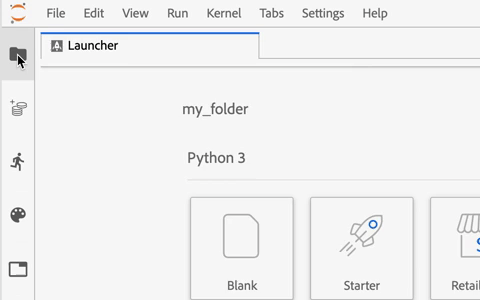

# [!DNL JupyterLab] Overzicht van gebruikersinterface

[!DNL JupyterLab] is een webgebaseerde gebruikersinterface voor [Jupyter-project](https://jupyter.org/) en is nauw geïntegreerd in Adobe Experience Platform. Het verstrekt een interactieve ontwikkelomgeving voor gegevenswetenschappers om met Notities Jupyter, code, en gegevens te werken.

Dit document biedt een overzicht van [!DNL JupyterLab] en de bijbehorende functies en instructies voor het uitvoeren van algemene handelingen.

## [!DNL JupyterLab] op [!DNL Experience Platform]

De JupyterLab-integratie van Experience Platform gaat gepaard met architectuurwijzigingen, ontwerpoverwegingen, aangepaste laptopextensies, vooraf geïnstalleerde bibliotheken en een Adobe-interface.

In de volgende lijst worden enkele functies beschreven die uniek zijn voor JupyterLab op Platform:

| Functie | Beschrijving |
| --- | --- |
| **Kernels** | Kernels bieden laptop en andere [!DNL JupyterLab] front-ends de mogelijkheid om code uit te voeren en in verschillende programmeertalen te introspecteren. [!DNL Experience Platform] verstrekt extra kernels om ontwikkeling in te steunen [!DNL Python], R, PySpark, en [!DNL Spark]. Zie de [steenkool](#kernels) voor meer informatie. |
| **Toegang tot gegevens** | Toegang tot bestaande datasets rechtstreeks vanuit [!DNL JupyterLab] met volledige ondersteuning voor lees- en schrijfmogelijkheden. |
| **[!DNL Platform]serviceintegratie** | Dankzij de ingebouwde integratie kunt u andere [!DNL Platform] rechtstreeks vanuit [!DNL JupyterLab]. Een volledige lijst met ondersteunde integratie is te vinden in het gedeelte over [Integratie met andere diensten van de Platform](#service-integration). |
| **Verificatie** | Naast <a href="https://jupyter-notebook.readthedocs.io/en/stable/security.html" target="_blank">Ingebouwd beveiligingsmodel van JupyterLab</a>, wordt elke interactie tussen uw toepassing en Experience Platform, met inbegrip van de dienst-aan-dienst van het Platform mededeling gecodeerd en voor authentiek verklaard door <a href="https://www.adobe.io/authentication/auth-methods.html" target="_blank">[!DNL Adobe Identity Management System] (IMS)</a>. |
| **Ontwikkelingsbibliotheken** | In [!DNL Experience Platform], [!DNL JupyterLab] biedt vooraf geïnstalleerde bibliotheken voor [!DNL Python], R en PySpark. Zie de [aanhangsel](#supported-libraries) voor een volledige lijst met ondersteunde bibliotheken. |
| **Bibliotheekcontroller** | Wanneer de vooraf geïnstalleerde bibliotheken niet aan uw behoeften voldoen, kunnen extra bibliotheken voor Python en R worden geïnstalleerd en tijdelijk in geïsoleerde containers worden opgeslagen om de integriteit van [!DNL Platform] en uw gegevens veilig te houden. Zie de [steenkool](#kernels) voor meer informatie. |

>[!NOTE]
>
>Aanvullende bibliotheken zijn alleen beschikbaar voor de sessie waarin ze zijn geïnstalleerd. Wanneer u nieuwe sessies start, moet u alle extra bibliotheken die u nodig hebt opnieuw installeren.

## Integratie met andere [!DNL Platform] diensten {#service-integration}

Standaardisering en interoperabiliteit zijn de belangrijkste concepten achter [!DNL Experience Platform]. De integratie van [!DNL JupyterLab] op [!DNL Platform] als ingebedde winde toestaat het met andere interactie aan [!DNL Platform] services, waarmee u [!DNL Platform] ten volle te benutten. Het volgende [!DNL Platform] services zijn beschikbaar in [!DNL JupyterLab]:

* **[!DNL Catalog Service]:** Toegang tot en verken gegevenssets met lees- en schrijffuncties.
* **[!DNL Query Service]:** Toegang tot en verken gegevenssets met SQL, waardoor u lagere gegevenstoegangsoverheadkosten krijgt wanneer u te maken hebt met grote hoeveelheden gegevens.
* **[!DNL Sensei ML Framework]:** Modelontwikkeling met de mogelijkheid om gegevens op te leiden en te scoren, en het maken van recept met één klik.
* **[!DNL Experience Data Model (XDM)]:** Standaardisering en interoperabiliteit zijn de belangrijkste concepten achter Adobe Experience Platform. [Experience Data Model (XDM)](https://www.adobe.com/go/xdm-home-en), gedreven door Adobe, is een inspanning om de gegevens van de klantenervaring te standaardiseren en schema&#39;s voor het beheer van de klantenervaring te bepalen.

>[!NOTE]
>
>Sommige [!DNL Platform] serviceintegratie op [!DNL JupyterLab] beperkt zijn tot specifieke korrels. Zie de sectie over [steenkool](#kernels) voor meer informatie .

## Belangrijke functies en veelvoorkomende bewerkingen

Informatie over de belangrijkste kenmerken van [!DNL JupyterLab] en instructies voor het uitvoeren van gemeenschappelijke operaties worden in de volgende secties gegeven:

* [Access JupyterLab](#access-jupyterlab)
* [JupyterLab-interface](#jupyterlab-interface)
* [Codecellen](#code-cells)
* [Kernels](#kernels)
* [Kernel-sessies](#kernel-sessions)
* [Launcher](#launcher)

### Ga naar [!DNL JupyterLab] {#access-jupyterlab}

In [Adobe Experience Platform](https://platform.adobe.com), selecteert u **[!UICONTROL Notebooks]** in de linkernavigatiekolom. Enige tijd toestaan voor [!DNL JupyterLab] om volledig te initialiseren.

### [!DNL JupyterLab] interface {#jupyterlab-interface}

De [!DNL JupyterLab] interface bestaat uit een menubalk, een opvouwbare linkerzijbalk en het hoofdwerkgebied met tabbladen met documenten en activiteiten.

**Menubalk**

De menubalk boven aan de interface heeft menu&#39;s op hoofdniveau die acties beschikbaar maken in [!DNL JupyterLab] met hun sneltoetsen:

* **Bestand:** Acties in verband met bestanden en mappen
* **Bewerken:** Acties in verband met het bewerken van documenten en andere activiteiten
* **Weergave:** Handelingen die de weergave van [!DNL JupyterLab]
* **Uitvoeren:** Handelingen voor het uitvoeren van code in verschillende activiteiten, zoals notebooks en codeconsoles
* **Kernel:** Handelingen voor het beheren van kernels
* **Tabs:** Een lijst van geopende documenten en activiteiten
* **Instellingen:** Algemene instellingen en een geavanceerde instellingeneditor
* **Help:** Een lijst van [!DNL JupyterLab] en kernel Help-koppelingen

**Linkerzijbalk**

De linkerzijbalk bevat klikbare tabbladen die toegang bieden tot de volgende functies:

* **Bestandenbrowser:** Een lijst met opgeslagen laptopdocumenten en -mappen
* **Gegevensverkenner:** Doorblader, toegang, en onderzoek datasets en schema&#39;s
* **Lopende kernels en terminals:** Een lijst van actieve kernel en eindzittingen met de capaciteit om te eindigen
* **Opdrachten:** Een lijst met nuttige opdrachten
* **Celcontrole:** Een celeditor die toegang biedt tot gereedschappen en metagegevens die nuttig zijn voor het instellen van een laptop voor presentatiedoeleinden
* **tabs:** Een lijst met geopende tabbladen

Selecteer een tab om de bijbehorende functies weer te geven of selecteer een uitgevouwen tab om de linkerzijbalk samen te vouwen, zoals hieronder wordt getoond:

**Belangrijkste werkterrein**

Het belangrijkste werkterrein [!DNL JupyterLab] kunt u documenten en andere activiteiten rangschikken in tabbladen waarvan u de grootte kunt wijzigen of die u kunt onderverdelen. Sleep een tab naar het midden van een deelvenster met tabbladen om de tab te migreren. Verdeel een deelvenster door een tab naar links, rechts, boven of onder in het deelvenster te slepen:

### GPU- en geheugenserverconfiguratie in [!DNL Python]/R

In [!DNL JupyterLab] Selecteer het tandwielpictogram in de rechterbovenhoek om het te openen *Configuratie notebookserver*. Met de schuifregelaar kunt u de GPU in- en uitschakelen en de benodigde hoeveelheid geheugen toewijzen. De hoeveelheid geheugen die u kunt toewijzen, is afhankelijk van de hoeveelheid geheugen die uw organisatie heeft ingericht. Selecteren **[!UICONTROL Update configs]** om op te slaan.

>[!NOTE]
>
>Per organisatie is slechts één GPU beschikbaar voor laptops. Als de GPU in gebruik is, moet u wachten op de gebruiker die momenteel de GPU heeft gereserveerd om deze vrij te geven. Dit kan worden gedaan door uit te loggen of GPU in een nutteloze staat voor vier of meer uren te verlaten.

### Beëindigen en opnieuw starten [!DNL JupyterLab]

In [!DNL JupyterLab]kunt u de sessie beëindigen om te voorkomen dat meer bronnen worden gebruikt. Begin door te selecteren **energiepictogram** selecteert u vervolgens **[!UICONTROL Shut Down]** uit de pop-up die wordt weergegeven om de sessie te beëindigen. Laptopsessies worden automatisch beëindigd na twaalf uur geen activiteit.

Opnieuw starten [!DNL JupyterLab], selecteert u de **pictogram voor opnieuw opstarten**  die zich direct links van het machtspictogram bevinden, dan uitgezocht **[!UICONTROL Restart]** uit de pop-up die wordt weergegeven.

### Codecellen {#code-cells}

Codecellen zijn de belangrijkste inhoud van laptops. Ze bevatten broncode in de taal van de bijbehorende kernel van de laptop en de uitvoer als gevolg van het uitvoeren van de codecel. Rechts van elke codecel wordt een aantal uitvoeringen weergegeven die de volgorde van uitvoering ervan aangeven.

Vaak voorkomende celhandelingen worden hieronder beschreven:

* **Een cel toevoegen:** Klik op het plusteken (**+**) van het notitieboekje om een lege cel toe te voegen. Nieuwe cellen worden onder de cel geplaatst waarmee momenteel wordt gewerkt, of aan het einde van de laptop als geen bepaalde cel de focus heeft.

* **Een cel verplaatsen:** Plaats de cursor rechts van de cel die u wilt verplaatsen, klik en sleep de cel naar een nieuwe locatie. Als u bovendien een cel van het ene notebook naar het andere verplaatst, wordt de cel met de inhoud gerepliceerd.

* **Een cel uitvoeren:** Klik op de hoofdtekst van de cel die u wilt uitvoeren en klik vervolgens op de knop **play** icon (**!**) van het notitieboekje. Een sterretje (**\***) wordt weergegeven in de uitvoeringsteller van de cel wanneer de kernel de uitvoering verwerkt en wordt na voltooiing vervangen door een geheel getal.

* **Een cel verwijderen:** Klik op de hoofdtekst van de cel die u wilt verwijderen en klik vervolgens op de knop **schaar** pictogram.

### Kernels {#kernels}

Notebookkernels zijn de taalspecifieke computerengines voor de verwerking van notebookcellen. Naast [!DNL Python], [!DNL JupyterLab] verleent extra taalsteun in R, PySpark, en [!DNL Spark] (Scala). Wanneer u een notitieboekjectdocument opent, wordt de bijbehorende kernel gestart. Wanneer een laptopcel wordt uitgevoerd, voert de kernel de berekening uit en levert dit resultaten op die aanzienlijke CPU- en geheugenbronnen verbruiken. Let op: toegewezen geheugen wordt pas vrijgemaakt wanneer de kernel wordt afgesloten.

Bepaalde kenmerken en functies zijn beperkt tot bepaalde kernels zoals beschreven in de onderstaande tabel:

| Kernel | Ondersteuning voor bibliotheekinstallatie | [!DNL Platform] integratie |
| :----: | :--------------------------: | :-------------------- |
| **[!DNL Python]** | Ja | <ul><li>[!DNL Sensei ML Framework]</li><li>[!DNL Catalog Service]</li><li>[!DNL Query Service]</li></ul> |
| **R** | Ja | <ul><li>[!DNL Sensei ML Framework]</li><li>[!DNL Catalog Service]</li></ul> |
| **Scala** | Nee | <ul><li>[!DNL Sensei ML Framework]</li><li>[!DNL Catalog Service]</li></ul> |

### Kernel-sessies {#kernel-sessions}

Elke actieve laptop of activiteit op [!DNL JupyterLab] gebruikt een kernel-sessie. U kunt alle actieve sessies vinden door de **Lopende terminals en kernels** in de linkerzijbalk. Het type en de toestand van de kernel voor een laptop kunnen worden geïdentificeerd door de laptop rechtsboven te volgen. In het onderstaande diagram wordt de bijbehorende kernel van de laptop weergegeven **[!DNL Python]3** en de huidige staat wordt voorgesteld door een grijze cirkel naar rechts. Een holle cirkel impliceert een nutteloze kernel en een stevige cirkel impliceert een bezige kernel.

Als de kernel gedurende langere tijd wordt afgesloten of niet actief is, dan **Geen kerel!** met een effen cirkel. Activeer een kernel door op de kernel-status te klikken en het juiste kernel-type te selecteren, zoals hieronder wordt getoond:

### Launcher {#launcher}

[//]: # (Talk about the different Notebooks, introduce that certain starter notebooks are limited to particular kernels)

De aangepaste *Launcher* biedt u nuttige laptopsjablonen voor hun ondersteunde kernels om u te helpen uw taak snel te starten, zoals:

| Sjabloon | Beschrijving |
| --- | --- |
| Leeg | Een leeg laptopbestand. |
| Starter | Een voorgevulde laptop die de gegevensexploratie aantoont met behulp van voorbeeldgegevens. |
| Detailhandel | Een voorgevulde laptop met de [recept voor detailverkoop](../pre-built-recipes/retail-sales.md) met behulp van voorbeeldgegevens. |
| Recipe Builder | Een laptopsjabloon voor het maken van een recept in [!DNL JupyterLab]. De voorgevulde code en opmerkingen tonen en beschrijven het proces voor het maken van recept. Zie de [zelfstudie over notebook tot recept](https://www.adobe.com/go/data-science-create-recipe-notebook-tutorial-en) voor een gedetailleerde analyse . |
| [!DNL Query Service] | Een voorgevulde laptop die het gebruik van [!DNL Query Service] rechtstreeks in [!DNL JupyterLab] met meegeleverde voorbeeldworkflows die gegevens op schaal analyseren. |
| XDM-gebeurtenissen | Een voorgevulde laptop waarin de gegevensverkenning op postvalue Experience-gebeurtenisgegevens wordt gedemonstreerd, waarbij de nadruk ligt op functies die gemeenschappelijk zijn in de gegevensstructuur. |
| XDM-query&#39;s | Een voorgevulde laptop met voorbeelden van zakelijke vragen over Experience Event-gegevens. |
| Samenvoeging | Een voorgevulde laptop met voorbeelden van workflows om grote hoeveelheden gegevens samen te voegen tot kleinere, beheerbare blokken. |
| Clustering | Een voorgevulde laptop die het end-to-end computerleermodelleringsproces aantoont met behulp van clusteringsalgoritmen. |

Sommige laptopsjablonen zijn beperkt tot bepaalde kernels. De beschikbaarheid van het malplaatje voor elke pit wordt in de volgende lijst in kaart gebracht:

<table>
    <tr>
        <td></td>
        <th><strong>Leeg</strong></th>
        <th><strong>Starter</strong></th>
        <th><strong>Detailhandel</strong></th>
        <th><strong>Recipe Builder</strong></th>
        <th><strong>[!DNL Query Service]</strong></th>
        <th><strong>XDM-gebeurtenissen</strong></th>
        <th><strong>XDM-query's</strong></th>
        <th><strong>Samenvoeging</strong></th>
        <th><strong>Clustering</strong></th>
    </tr>
    <tr>
        <th><strong>[!DNL Python]</strong></th>
        <td >ja</td>
        <td >ja</td>
        <td >ja</td>
        <td >ja</td>
        <td >ja</td>
        <td >ja</td>
        <td >nee</td>
        <td >nee</td>
        <td >nee</td>
    </tr>
    <tr>
        <th ><strong>R</strong></th>
        <td >ja</td>
        <td >ja</td>
        <td >ja</td>
        <td >nee</td>
        <td >nee</td>
        <td >nee</td>
        <td >nee</td>
        <td >nee</td>
        <td >nee</td>
    </tr>
      <tr>
        <th  ><strong>PySpark 3 ([!DNL Spark] 2,4)</strong></th>
        <td >nee</td>
        <td >ja</td>
        <td >nee</td>
        <td >nee</td>
        <td >nee</td>
        <td >nee</td>
        <td >ja</td>
        <td >ja</td>
        <td >nee</td>
    </tr>
    <tr>
        <th ><strong>Scala</strong></th>
        <td >ja</td>
        <td >ja</td>
        <td >nee</td>
        <td >nee</td>
        <td >nee</td>
        <td >nee</td>
        <td >nee</td>
        <td >nee</td>
        <td >ja</td>
    </tr>
</table>

Een nieuwe *Launcher*, klikt u op **Bestand > Nieuwe startpagina**. U kunt ook de **Bestandenbrowser** in de linkerzijbalk en klik op het plusteken (**+**):

## Volgende stappen

Ga voor meer informatie over elk van de ondersteunde laptops en hoe u deze kunt gebruiken naar de [Toegang tot gegevens van Jupyterlab-laptops](./access-notebook-data.md) ontwikkelaarshandleiding. In deze handleiding wordt vooral uitgelegd hoe u JupyterLab-laptops kunt gebruiken om toegang te krijgen tot uw gegevens, zoals lezen, schrijven en vragen om gegevens. De gids voor gegevenstoegang bevat ook informatie over de maximale hoeveelheid gegevens die kan worden gelezen door elke ondersteunde laptop.

## Ondersteunde bibliotheken {#supported-libraries}

Voor een lijst met ondersteunde pakketten in Python, R en PySpark kopieert en plakt u `!conda list` in een nieuwe cel, voert u de cel uit. Een lijst met ondersteunde pakketten wordt in alfabetische volgorde gevuld.

Bovendien worden de volgende gebiedsdelen gebruikt maar niet vermeld:
* CUDA 11.2
* CUDNN 8.1

