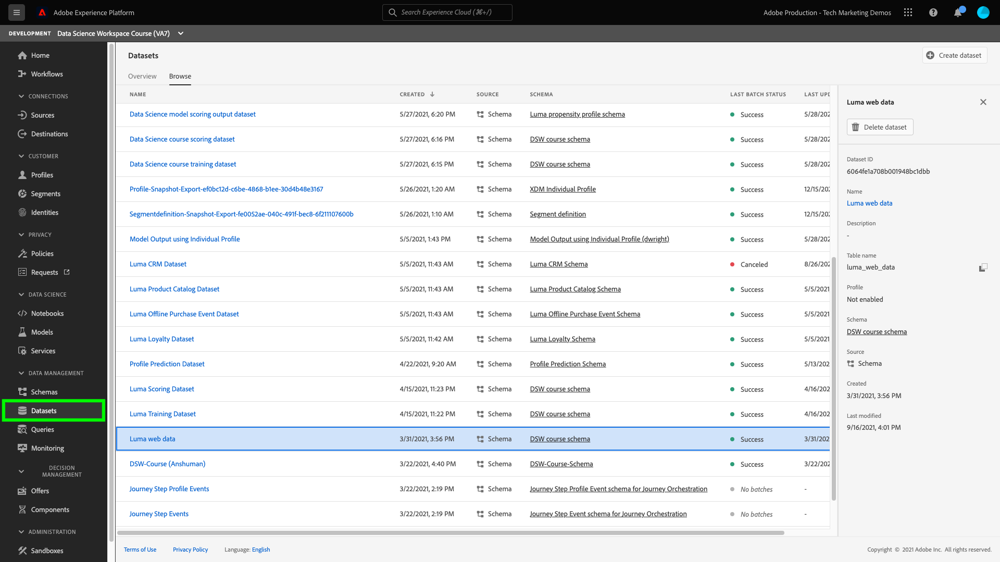

# Een leermodel voor computers maken en publiceren

In de volgende handleiding worden de stappen beschreven die nodig zijn om een model voor machinaal leren te maken en te publiceren. Elke sectie bevat een beschrijving van wat u gaat doen en een verbinding aan de documentatie UI en API om de beschreven stap uit te voeren.

## Aan de slag

Voordat u deze zelfstudie kunt starten, moet u aan de volgende voorwaarden voldoen:

- Toegang tot [!DNL Adobe Experience Platform]. Als u geen toegang hebt tot een IMS-organisatie in [!DNL Experience Platform], spreek gelieve met uw systeembeheerder alvorens te werk te gaan.

- Alle zelfstudies in de werkruimte voor wetenschappen van gegevens maken gebruik van het model Luminantie. Als u de stappen wilt volgen, moet u de opdracht [Luminantiemodel, schema&#39;s en gegevenssets](./create-luma-data.md).

### Ontdek de gegevens en begrijp de schema&#39;s

Aanmelden bij [Adobe Experience Platform](https://platform.adobe.com/) en selecteert u **[!UICONTROL Datasets]** om van alle bestaande datasets een lijst te maken en de dataset te selecteren die u zou willen onderzoeken. Selecteer in dit geval de optie **Luminagewebgegevens** dataset.

De pagina van de datasetactiviteit opent, die informatie opsomt met betrekking tot uw dataset. U kunt **[!UICONTROL Preview Dataset]** in de buurt van de rechterbovenhoek om de voorbeeldrecords te bekijken. U kunt het schema voor de geselecteerde dataset ook bekijken.

Selecteer de schemaverbinding in het juiste spoor. Er wordt een pop-up weergegeven en de koppeling onder **[!UICONTROL schema name]** Hiermee opent u het schema in een nieuw tabblad.

U kunt de gegevens verder verkennen met de geleverde EDA-laptop (Exploratory Data Analysis). Deze laptop kan worden gebruikt om inzicht te krijgen in de patronen in de Luminantiemaatgegevens, de gegevenshygiëne te controleren en een overzicht te maken van de relevante gegevens voor het voorspellende-nevenmodel. Meer over de Verkennende Analyse van Gegevens leren, bezoek [EDA-documentatie](../jupyterlab/eda-notebook.md).

## Maak het veelvuldigheidsrecept voor Luma {#author-your-model}

Een hoofdcomponent van de [!DNL Data Science Workspace] De levenscyclus omvat het ontwerpen van Ontvangers en Modellen. Het model van de Luminantiemogelijkheid is ontworpen om een voorspelling te genereren over de vraag of klanten een hoge neiging hebben om een product van Luma te kopen.

Voor het maken van het model Luma-eigenschappen wordt de sjabloon voor het maken van het recept gebruikt. Ontvangers vormen de basis voor een model, aangezien zij machine het leren algoritmen en logica bevatten die worden ontworpen om specifieke problemen op te lossen. Nog belangrijker is dat met behulp van Ontvangers u het leren van machines in uw organisatie kunt democratiseren, zodat andere gebruikers toegang hebben tot een model voor verschillende gebruiksgevallen zonder dat er code hoeft te worden geschreven.

Volg de [een model maken met JupyterLab-laptops](../jupyterlab/create-a-model.md) zelfstudie voor het maken van het recept voor het model Luminantie, dat in volgende zelfstudies wordt gebruikt.

## Een recept uit externe bronnen importeren en verpakken (*optioneel*)

Als u een recept voor gebruik in de Werkruimte van de Wetenschap van Gegevens wilt invoeren en verpakken, moet u uw brondossiers in een archiefdossier verpakken. Volg de [bronbestanden in een recept plaatsen](./package-source-files-recipe.md) zelfstudie. Deze zelfstudie laat u zien hoe u bronbestanden in een recept kunt verpakken. Dit is de eerste vereiste stap voor het importeren van een recept in de werkruimte voor wetenschap van gegevens. Zodra de zelfstudie is voltooid, krijgt u een Docker-afbeelding in een Azure Container-register, samen met de bijbehorende afbeelding-URL, met andere woorden een archiefbestand.

Dit archiefbestand kan worden gebruikt om een recept te maken in de Data Science Workspace door de workflow voor het importeren van recept te volgen met de [UI-workflow](./import-packaged-recipe-ui.md) of de [API-workflow](./import-packaged-recipe-api.md).

## Een model trainen en evalueren {#train-and-evaluate-your-model}

Nu uw gegevens zijn voorbereid en een recept klaar is, hebt u de mogelijkheid om uw model voor het leren van machines verder te maken, te trainen en te evalueren. Terwijl u de Recipe Builder gebruikt, had u uw model al moeten opleiden, scoren en evalueren voordat u het in een recept hebt verpakt.

Met de gebruikersinterface van de Data Science Workspace en de API kunt u uw recept als model publiceren. Daarnaast kunt u specifieke aspecten van uw model verder perfectioneren, zoals het toevoegen, verwijderen en wijzigen van hyperparameters.

### Een model maken

Als u meer wilt weten over het maken van een model met behulp van de gebruikersinterface, gaat u naar de trein en evalueert u een model in de werkruimte Gegevenswetenschap [UI-zelfstudie](./train-evaluate-model-ui.md) of [API-zelfstudie](./train-evaluate-model-api.md). Deze zelfstudie biedt een voorbeeld van het maken, trainen en bijwerken van hyperparameters om uw model verder aan te passen.

>[!NOTE]
>
> Hyperparameters kunnen niet worden geleerd, daarom moeten zij worden toegewezen alvorens de opleidingslooppas voorkomt. Het aanpassen van hyperparameters kan de nauwkeurigheid van uw getrainde model veranderen. Aangezien het optimaliseren van een model een herhalend proces is, kunnen meerdere trainingen nodig zijn voordat een bevredigende evaluatie wordt uitgevoerd.

## Score een model {#score-a-model}

De volgende stap bij het maken en publiceren van een model is het operationeel maken van uw model om inzichten van het datumpeer en het Real-Time Profiel van de Klant te scoren en te verbruiken.

Scores in de Werkruimte van de Wetenschap van Gegevens kunnen worden bereikt door inputgegevens in een bestaand opgeleid Model te voeren. De resultaten van het scoren worden dan opgeslagen en viewable in een gespecificeerde outputdataset als nieuwe partij.

Ga voor meer informatie over het behalen van uw model naar de score van een model [UI-zelfstudie](./score-model-ui.md) of [API-zelfstudie](./score-model-api.md).

## Een model met een score publiceren als service

De Werkruimte van de Wetenschap van gegevens staat u toe om uw opgeleid model als dienst te publiceren. Hierdoor kunnen gebruikers binnen uw IMS-organisatie gegevens behalen zonder dat ze zelf modellen hoeven te maken.

Ga voor meer informatie over het publiceren van een model als service naar de [UI-zelfstudie](./publish-model-service-ui.md) of [API-zelfstudie](./publish-model-service-api.md).

### Geautomatiseerde training voor een service plannen

Als u een model eenmaal als service hebt gepubliceerd, kunt u geplande scoring- en trainingsprogramma&#39;s voor de leerservice voor uw computer instellen. Het automatiseren van het trainings- en scoringsproces kan de efficiëntie van een service helpen behouden en verbeteren door patronen in uw gegevens bij te houden. Ga naar [plant een model in de Werkruimte van de Wetenschap van Gegevens UI](./schedule-models-ui.md) zelfstudie.

>[!NOTE]
>
> U kunt een model voor geautomatiseerde opleiding en het scoren slechts van UI plannen.

## Volgende stappen {#next-steps}

Adobe Experience Platform [!DNL Data Science Workspace] biedt de tools en bronnen om modellen voor machinaal leren te maken, te evalueren en te gebruiken om gegevensvoorspellingen en inzichten te genereren. Wanneer inzichten van het leren van machines worden opgenomen in een [!DNL Profile]-enabled dataset, dat de zelfde gegevens ook worden opgenomen zoals [!DNL Profile] records die vervolgens kunnen worden gesegmenteerd [!DNL Adobe Experience Platform Segmentation Service].

Aangezien profiel en tijdreeksgegevens worden opgenomen, beslist het Profiel van de Klant in real time automatisch om die gegevens van segmenten door een aan de gang zijnde proces te omvatten of uit te sluiten die het stromen segmentatie wordt genoemd, alvorens het met bestaande gegevens samen te voegen en de verenigingsmening bij te werken. Dientengevolge, kunt u onmiddellijk berekeningen uitvoeren en besluiten nemen om verbeterde, geïndividualiseerde ervaringen aan klanten te leveren aangezien zij met uw merk in wisselwerking staan.

De zelfstudie bezoeken voor [Het verrijken van Real-Time Klantprofiel met machine het leren inzichten](./enrich-profile.md) voor meer informatie over hoe u inzichten van machine-leren kunt gebruiken.
