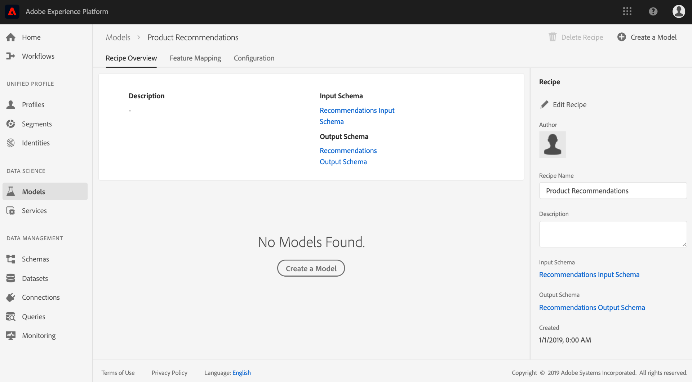

# Een analyse van een model voor machinaal leren maken en publiceren

Voorbereid u een online detailhandelswebsite. Wanneer uw klanten op uw detailhandelswebsite winkelen, wilt u hen met gepersonaliseerde productaanbevelingen presenteren om een verscheidenheid van andere producten bloot te stellen uw bedrijfsaanbiedingen. Gedurende de periode dat uw website bestaat, hebt u voortdurend klantgegevens verzameld en wilt u deze gegevens op de een of andere manier gebruiken om gepersonaliseerde productaanbevelingen te genereren.

De werkruimte van de Wetenschap van de Wetenschap van het Platform van de Ervaring van Adobe verstrekt de middelen om uw doel te bereiken gebruikend het prebuilt Recipe van de Aanbevelingen van het [Product](../pre-built-recipes/product-recommendations.md). Volg deze zelfstudie om te zien hoe u toegang hebt tot uw gegevens in de detailhandel, een model voor machinaal leren kunt maken en optimaliseren en inzichten kunt genereren in de werkruimte voor wetenschap van gegevens.

Deze zelfstudie weerspiegelt de workflow van Data Science Workspace en behandelt de volgende stappen voor het maken van een model voor machinaal leren:

1. [Uw gegevens voorbereiden](#prepare-your-data)
2. [Uw model ontwerpen](#author-your-model)
3. [Uw model trainen en evalueren](#train-and-evaluate-your-model)
4. [Uw model exploiteren](#operationalize-your-model)

## Aan de slag

Voordat u deze zelfstudie kunt starten, moet u aan de volgende voorwaarden voldoen:

* Toegang tot het Adobe Experience Platform. Als u geen toegang hebt tot een IMS-organisatie in het ervaringsplatform, neemt u contact op met uw systeembeheerder voordat u verdergaat.

* Enablement assets. Neem contact op met uw accountvertegenwoordiger om de volgende items voor u beschikbaar te stellen.
   * Aanbevelingen ontvangen
   * Aanbevelingen Gegevensset invoer
   * Aanbevelingen Invoerschema
   * Gegevensset voor aanbevolen uitvoer
   * Uitvoerschema voor aanbevelingen
   * Gouden gegevensset, postwaarden
   * Goudgegevenssetschema

* Download de drie vereiste Jupyter-laptopbestanden van de openbare Git-opslagplaats <a href="https://github.com/adobe/experience-platform-dsw-reference/tree/master/Summit/2019/resources/Notebooks-Thurs" target="_blank">van</a>Adobe. Deze bestanden worden gebruikt om de JupyterLab-workflow in de Data Science Workspace te demonstreren.

* Een goed begrip van de volgende belangrijkste concepten die in deze zelfstudie worden gebruikt:
   * [Gegevensmodel](../../xdm/home.md)van ervaring: De standaardiseringsinspanning die door Adobe wordt geleid om standaardschema&#39;s zoals Profiel en ExperienceEvent, voor het Beheer van de Ervaring van de Klant te bepalen.
   * Gegevenssets: Een opslag- en beheerconstructie voor werkelijke gegevens. Een fysieke instantie van een [XDM-schema](../../xdm/schema/field-dictionary.md).
   * Batches: Datasets bestaan uit batches. Een batch is een reeks gegevens die over een bepaalde periode worden verzameld en samen als één eenheid worden verwerkt.
   * JupyterLab: [JupyterLab](https://blog.jupyter.org/jupyterlab-is-ready-for-users-5a6f039b8906) is een opensource webinterface voor Project Jupyter en is nauw geïntegreerd in het Experience Platform.

## Uw gegevens voorbereiden {#prepare-your-data}

Als u een model voor machinaal leren wilt maken dat gepersonaliseerde productaanbevelingen doet aan uw klanten, moeten eerdere aankopen van klanten op uw website worden geanalyseerd. In deze sectie wordt beschreven hoe deze gegevens via Adobe Analytics in Platform worden ingevoerd en hoe die gegevens worden omgezet in een gegevensset met functies die door het model voor machinaal leren moet worden gebruikt.

### Ontdek de gegevens en begrijp de schema&#39;s

1. Meld u aan bij het [Adobe Experience Platform](https://platform.adobe.com/) en klik **[!UICONTROL Datasets]** om alle bestaande gegevenssets weer te geven en selecteer de gegevensset die u wilt verkennen. In dit geval, de dataset van Analytics **Golden Data Set postValues**.
   
2. Selecteer **[!UICONTROL Preview Dataset]** in de rechterbovenhoek om de voorbeeldrecords te controleren en klik op **[!UICONTROL Close]**.
   
3. Selecteer de verbinding onder Schema in het juiste spoor om het schema voor de dataset te bekijken, dan ga terug naar de pagina van de datasetdetails.&quot;
   

De andere datasets zijn vooraf gevuld met partijen voor het voorvertonen van doeleinden. U kunt deze datasets bekijken door de bovengenoemde stappen te herhalen.

| Naam gegevensset | Schema | Beschrijving |
| ----- | ----- | ----- |
| Gouden gegevensset, postwaarden | Goudgegevenssetschema | Brongegevens van uw website analyseren |
| Aanbevelingen Gegevensset invoer | Aanbevelingen Invoerschema | De gegevens van Analytics worden omgezet in een opleidingsdataset gebruikend een eigenschappijpleiding. Deze gegevens worden gebruikt voor de training van het Product Recommendations Machine Learning Model. `itemid` en `userid` overeenkomen met een product dat door die klant is aangekocht. |
| Gegevensset voor aanbevolen uitvoer | Uitvoerschema voor aanbevelingen | De dataset waarvoor het scoren resultaten worden opgeslagen, zal het de lijst van geadviseerde producten voor elke klant bevatten. |

## Uw model ontwerpen {#author-your-model}

Het tweede onderdeel van de levenscyclus van de Data Science Workspace omvat het ontwerpen van recept en modellen. De Recipe van de Aanbevelingen van het Product wordt ontworpen om productaanbevelingen op schaal te produceren door vroegere aankoopgegevens en machine het leren te gebruiken.

Ontvangers vormen de basis voor een model aangezien zij machine het leren algoritmen en logica bevatten die worden ontworpen om specifieke problemen op te lossen. Nog belangrijker is dat met behulp van Ontvangers u het leren van machines in uw organisatie kunt democratiseren, zodat andere gebruikers toegang hebben tot een model voor verschillende gebruiksgevallen zonder dat er code hoeft te worden geschreven.

### Ontdek de Recipe voor productaanbevelingen

1. Navigeer in het Adobe Experience Platform naar **[!UICONTROL Models]** de linkernavigatiekolom en klik vervolgens **[!UICONTROL Recipes]** bovenaan om een lijst met beschikbare Ontvangers voor uw organisatie weer te geven.
   
2. Zoek en open de opgegeven tekst **[!UICONTROL Recommendations Recipe]** door op de naam ervan te klikken.
   
3. Klik in het rechterspoor **[!UICONTROL Recommendations Input Schema]** om het schema voor het recept weer te geven. De schemagebieden **[!UICONTROL itemId]** en **[!UICONTROL userId]** beantwoorden aan een product dat (**[!UICONTROL interactionType]**) door die klant op een specifiek tijdstip (**[!UICONTROL timestamp]**) wordt gekocht. Voer dezelfde stappen uit om de velden voor de **[!UICONTROL Recommendations Output Schema]**pagina te controleren.
   

U hebt nu de invoer- en uitvoerschema&#39;s gecontroleerd die vereist zijn voor de Recipe voor productaanbevelingen. U kunt nu verdergaan naar de volgende sectie om te weten te komen hoe u een model van de Aanbevelingen van het Product creeert, opleidt en evalueert.

## Uw model trainen en evalueren {#train-and-evaluate-your-model}

Nu uw gegevens zijn voorbereid en de recept klaar is om te worden gebruikt, kunt u uw model voor machinetolering maken, trainen en evalueren.

### Een model maken

Een model is een instantie van een recept, waarmee u gegevens op schaal kunt trainen en scoren.

1. Navigeer in het Adobe Experience Platform naar **[!UICONTROL Models]** de linkernavigatiekolom en klik vervolgens **[!UICONTROL Recipes]** boven aan de pagina om een lijst weer te geven met alle beschikbare Ontvangers voor uw organisatie.
   
2. Zoek en open de opgegeven pagina **[!UICONTROL Recommendations Recipe]** door op de naam te klikken en de overzichtspagina van de ontvanger in te voeren. Klik **[!UICONTROL Create a Model]** of van het centrum (als er geen bestaande Modellen) of van het hoogste recht van de Recipe pagina van het Overzicht zijn.
   
3. Een lijst van beschikbare inputdatasets voor opleiding wordt getoond, selecteert **[!UICONTROL Recommendations Input Dataset]** en klikt **[!UICONTROL Next]**.
   
4. Geef het model een naam, bijvoorbeeld &quot;Model met productaanbevelingen&quot;. De beschikbare configuraties voor het model worden vermeld, die montages voor het de standaardopleiding van het Model en het scoring gedrag bevatten. Er zijn geen wijzigingen nodig omdat deze configuraties specifiek zijn voor uw organisatie. Controleer de configuraties en klik op **[!UICONTROL Finish]**.
   
5. Het model is nu gemaakt en de pagina *Overzicht* van het model wordt weergegeven in een nieuw gegenereerde trainingsreeks. Een trainingsrun wordt standaard gegenereerd wanneer een model wordt gemaakt.
   

U kunt ervoor kiezen te wachten totdat de trainingsreeks is voltooid of een nieuwe trainingsreeks te maken in de volgende sectie.

### Het model trainen met aangepaste hyperparameters

1. Voor de pagina van het Overzicht *van het* Model, klik **[!UICONTROL Train]** dichtbij het hoogste recht om een nieuwe opleidingslooppas tot stand te brengen. Selecteer de invoergegevensset die u bij het maken van het model hebt gebruikt en klik op **[!UICONTROL Next]**.
   
2. De pagina *Configuratie* wordt weergegeven. Hier kunt u de **[!UICONTROL num_recommendations]** waarde van de trainingsrun configureren, ook wel een hyperparameter genoemd. Een getraind en geoptimaliseerd model zal de best-presterende Hyperparameters gebruiken die op de resultaten van de trainingslooppas worden gebaseerd.

   Hyperparameters kunnen niet worden geleerd, daarom moeten zij worden toegewezen alvorens de opleidingslooppas voorkomt. Het aanpassen van Hyperparameters kan de nauwkeurigheid van het Getrainde Model veranderen. Aangezien het optimaliseren van een model een herhalend proces is, kunnen meerdere trainingen nodig zijn voordat een bevredigende evaluatie wordt uitgevoerd.

   >[!TIP] Instellen **[!UICONTROL num_recommendations]** op 10.

   
3. Er verschijnt een extra gegevenspunt in het modelevaluatieschema wanneer de nieuwe trainingsrun is voltooid. Dit kan enkele minuten in beslag nemen.
   

### Het model evalueren

Telkens als een trainingslooppas voltooit, kunt u de resulterende evaluatiemetriek bekijken om te bepalen hoe goed het Model uitvoerde.

1. Controleer de evaluatiemetriek (Precisie en Herinnering) voor elke voltooide opleiding door op de trainingslooppas te klikken.
2. Onderzoek de informatie die voor elke metrische evaluatie wordt verstrekt. Hoe hoger deze maatstaven, hoe beter het Model wordt uitgevoerd.
   
3. U kunt de dataset, het schema, en de configuratieparameters zien die voor elke opleiding op het juiste spoor worden gebruikt.
4. Navigeer terug naar de modelpagina en identificeer de best presterende opleiding door hun evaluatiemetriek te observeren.

## Uw model exploiteren {#operationalize-your-model}

De laatste stap in de Data Science-workflow is het operationeel maken van uw model, zodat u uw gegevens kunt bijhouden en inzichten van uw gegevensarchief kunt gebruiken.

### Score en genereren inzichten

1. Voor de pagina van het ModelOverzicht ** van het ModelOverzicht van de productaanbevelingen, klik de naam van de best-presterende trainingslooppas, met de hoogste herinnering en precisienormen.
2. Klik rechtsboven op de pagina met details voor de trainingsuitvoering op **[!UICONTROL Score]**.
3. Selecteer de gegevensset **[!UICONTROL Recommendations Input Dataset]** als de gegevensset voor het noteren van de invoergegevens. Dit is dezelfde gegevensset die u hebt gebruikt toen u het Model hebt gemaakt en de trainingsreeks uitvoerde. Klik vervolgens op **[!UICONTROL Next]**.
   
4. Selecteer de gegevensset **[!UICONTROL Recommendations Output Dataset]** als de gegevensset voor het noteren van uitvoer. De resultaten van het noteren zullen in deze dataset als partij worden opgeslagen.
   
5. Controleer de scoreconfiguraties. Deze parameters bevatten de input en outputdatasets die vroeger samen met de aangewezen schema&#39;s worden geselecteerd. Klik **[!UICONTROL Finish]** om de scoring uit te voeren. De uitvoering kan enkele minuten duren.
   

### Gecodeerde inzichten weergeven

Nadat de scoring is voltooid, kunt u een voorvertoning van de resultaten bekijken en de gegenereerde inzichten bekijken.

1. Klik op de pagina waarop de scoring wordt uitgevoerd op de voltooide scoring en klik vervolgens op **[!UICONTROL Preview Scoring Results Dataset]** de rechterrail.
   
2. In de voorproeflijst, bevat elke rij productaanbevelingen voor een bepaalde klant, geëtiketteerd als **[!UICONTROL recommendations]** en **[!UICONTROL userId]** respectievelijk. Aangezien de **[!UICONTROL num_recommendations]** Hyperparameter aan 10 in de steekproefscreenshots werd geplaatst, kan elke rij van aanbevelingen tot 10 productidentiteiten bevatten die door een aantalteken (#) worden afgebakend.
   

## Volgende stappen {#next-steps}

Goed gedaan, hebt u met succes productaanbevelingen geproduceerd!

Deze zelfstudie introduceerde u tot de workflow van de Data Science Workspace en laat zien hoe onverwerkte gegevens kunnen worden omgezet in nuttige informatie via leren van machines. Om meer over het gebruiken van de Werkruimte van de Wetenschap van Gegevens te leren, ga aan de volgende gids bij het [creëren van het detailhandelschema en de dataset](./create-retails-sales-dataset.md)verder.