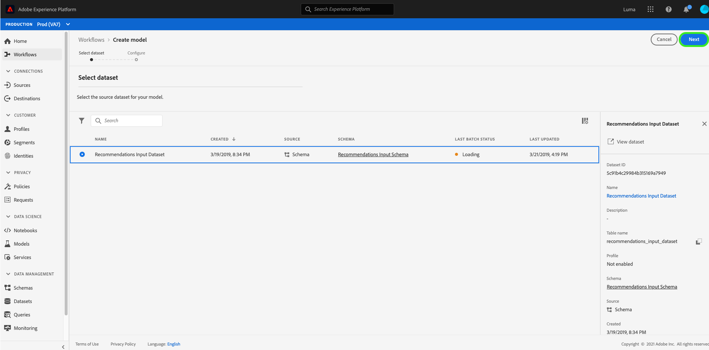
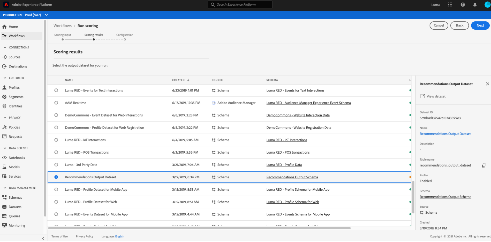

# Een leermodel voor computers maken en publiceren

Voorbereid u een online detailhandelswebsite. Wanneer uw klanten op uw detailhandelswebsite winkelen, wilt u hen met gepersonaliseerde productaanbevelingen presenteren om een verscheidenheid van andere producten bloot te stellen uw bedrijfsaanbiedingen. Gedurende de periode dat uw website bestaat, hebt u voortdurend klantgegevens verzameld en wilt u deze gegevens op de een of andere manier gebruiken om gepersonaliseerde productaanbevelingen te genereren.

[!DNL Adobe Experience Platform] [!DNL Data Science Workspace] biedt de middelen om uw doel te bereiken met behulp van het vooraf gebouwde  [Product Recommendations Recipe](../pre-built-recipes/product-recommendations.md). Volg deze zelfstudie om te zien hoe u toegang krijgt tot uw gegevens in de detailhandel, een model voor machinetlering kunt maken en optimaliseren en inzichten kunt genereren in [!DNL Data Science Workspace].

Deze zelfstudie weerspiegelt de workflow van [!DNL Data Science Workspace] en behandelt de volgende stappen voor het maken van een model voor machinaal leren:

1. [Uw gegevens voorbereiden](#prepare-your-data)
2. [Uw model ontwerpen](#author-your-model)
3. [Uw model trainen en evalueren](#train-and-evaluate-your-model)
4. [Uw model exploiteren](#operationalize-your-model)

## Aan de slag

Voordat u deze zelfstudie kunt starten, moet u aan de volgende voorwaarden voldoen:

- Toegang tot [!DNL Adobe Experience Platform]. Als u geen toegang tot een Organisatie IMS in [!DNL Experience Platform] hebt, gelieve met uw systeembeheerder te spreken alvorens te werk te gaan.

- Enablement assets. Neem contact op met uw accountvertegenwoordiger om de volgende items voor u beschikbaar te stellen.
   - Recommendations Recipe
   - Recommendations Input Dataset
   - Recommendations-invoerschema
   - Recommendations-uitvoergegevensset
   - Recommendations-uitvoerschema
   - Gouden gegevensset, postwaarden
   - Goudgegevenssetschema

- Download de drie vereiste [!DNL Jupyter Notebook] bestanden van [Adobe public [!DNL Git] repository](https://github.com/adobe/experience-platform-dsw-reference/tree/master/Summit/2019/resources/Notebooks-Thurs), deze worden gebruikt om de [!DNL JupyterLab] workflow in [!DNL Data Science Workspace] te demonstreren.

Een goed begrip van de volgende belangrijkste concepten die in deze zelfstudie worden gebruikt:
- [[!DNL Experience Data Model]](../../xdm/home.md): De standaardiseringsinspanning die door Adobe wordt geleid om standaardschema&#39;s zoals  [!DNL Profile] en ExperienceEvent, voor het Beheer van de Ervaring van de Klant te bepalen.
- Gegevenssets: Een opslag- en beheerconstructie voor werkelijke gegevens. Een fysieke instantie van een [XDM-schema](../../xdm/schema/field-dictionary.md).
- Batches: Datasets bestaan uit batches. Een batch is een reeks gegevens die over een bepaalde periode worden verzameld en samen als één eenheid worden verwerkt.
- [!DNL JupyterLab]:  [[!DNL JupyterLab]](https://blog.jupyter.org/jupyterlab-is-ready-for-users-5a6f039b8906) is een open-bron web-based interface voor Project  [!DNL Jupyter] en is strak geïntegreerd in  [!DNL Experience Platform].

## Uw gegevens {#prepare-your-data} voorbereiden

Als u een model voor machinaal leren wilt maken dat gepersonaliseerde productaanbevelingen doet aan uw klanten, moeten eerdere aankopen van klanten op uw website worden geanalyseerd. In deze sectie wordt beschreven hoe deze gegevens worden opgenomen in [!DNL Platform] tot en met [!DNL Adobe Analytics] en hoe die gegevens worden omgezet in een gegevensset met functies die moet worden gebruikt door het model voor machinaal leren.

### Ontdek de gegevens en begrijp de schema&#39;s

Meld u aan bij [Adobe Experience Platform](https://platform.adobe.com/) en selecteer **[!UICONTROL Datasets]** om alle bestaande datasets weer te geven en selecteer de dataset die u wilt verkennen. In dit geval, [!DNL Analytics] dataset **Gulden Dataset postValues**.

De pagina van de datasetactiviteit opent, die informatie opsomt met betrekking tot uw dataset. U kunt **[!UICONTROL Gegevensset van de voorvertoning]** dichtbij het hoogste recht selecteren om steekproefverslagen te onderzoeken. U kunt het schema voor de geselecteerde dataset ook bekijken. Selecteer de schemaverbinding in het juiste spoor. Er verschijnt een pop-upvenster waarin u de koppeling onder **[!UICONTROL schemanaam]** selecteert, wordt het schema op een nieuw tabblad geopend.

De andere datasets zijn vooraf gevuld met partijen voor het voorvertonen van doeleinden. U kunt deze datasets bekijken door de bovengenoemde stappen te herhalen.

| Naam gegevensset | Schema | Beschrijving |
| ----- | ----- | ----- |
| Gouden gegevensset, postwaarden | Goudgegevenssetschema | [!DNL Analytics] brongegevens van uw website |
| Recommendations Input Dataset | Recommendations-invoerschema | De [!DNL Analytics] gegevens worden omgezet in een opleidingsdataset gebruikend een eigenschappijpleiding. Deze gegevens worden gebruikt voor de training van het Product Recommendations-model voor machinetechniek. `itemid` en  `userid` overeenstemmen met een product dat door die klant is aangekocht. |
| Recommendations-uitvoergegevensset | Recommendations-uitvoerschema | De dataset waarvoor het scoren resultaten worden opgeslagen, zal het de lijst van geadviseerde producten voor elke klant bevatten. |

## Uw model {#author-your-model} ontwerpen

De tweede component van de [!DNL Data Science Workspace] levenscyclus omvat het ontwerpen van Ontvangers en Modellen. De Product Recommendations Recipe is ontworpen om op grote schaal productaanbevelingen te genereren door gebruik te maken van eerdere aankoopgegevens en computerlessen.

Ontvangers vormen de basis voor een model aangezien zij machine het leren algoritmen en logica bevatten die worden ontworpen om specifieke problemen op te lossen. Nog belangrijker is dat met behulp van Ontvangers u het leren van machines in uw organisatie kunt democratiseren, zodat andere gebruikers toegang hebben tot een model voor verschillende gebruiksgevallen zonder dat er code hoeft te worden geschreven.

### Ontdek het product dat Recommendations recept

In Experience Platform, navigeer aan **[!UICONTROL Modellen]** van de linkernavigatiekolom, dan uitgezocht **[!UICONTROL Recipes]** in de hoogste navigatie om een lijst van beschikbare recepten voor uw organisatie te bekijken.

Zoek en open vervolgens de opgegeven **[!UICONTROL Recommendations Recipe]** door de naam ervan te selecteren. De overzichtspagina Recipe wordt weergegeven.

Selecteer vervolgens in het rechterspoor **[!UICONTROL Recommendations Input Schema]** om het schema voor het recept weer te geven. De schemavelden &quot;[!UICONTROL itemId]&quot; en &quot;[!UICONTROL userId]&quot; komen overeen met een product dat door die klant op een specifiek tijdstip ([!UICONTROL interactionType]) is aangeschaft ([!UICONTROL timestamp]). Voer dezelfde stappen uit om de velden voor het **[!UICONTROL Recommendations-uitvoerschema]** te bekijken.

U hebt nu de invoer- en uitvoerschema&#39;s gecontroleerd die vereist zijn voor de Product Recommendations Recipe. Ga verder met het volgende gedeelte en leer hoe u een product-Recommendations-model maakt, opleidt en evalueert.

## Uw model opleiden en evalueren{#train-and-evaluate-your-model}

Nu uw gegevens zijn voorbereid en de recept klaar is, kunt u uw model voor machinaal leren maken, trainen en evalueren.

### Een model maken

Een model is een instantie van een recept, waarmee u gegevens op schaal kunt trainen en scoren.

Navigeer in Experience Platform naar **[!UICONTROL Modellen]** in de linkernavigatiekolom en selecteer **[!UICONTROL Recipes]** in de bovenste navigatie. Hier wordt een lijst weergegeven met beschikbare recepten voor uw organisatie. Selecteer het recept voor productaanbevelingen.

Selecteer **[!UICONTROL Model maken]** op de pagina met recept.

De workflow voor het maken van modellen begint met het selecteren van een recept. Selecteer **[!UICONTROL Recommendations Recipe]** en selecteer **[!UICONTROL Next]** in de rechterbovenhoek.

Geef vervolgens een modelnaam op. Beschikbare configuraties voor het model worden weergegeven met instellingen voor de standaardtraining en -scoring van het model. Controleer de configuraties en selecteer **[!UICONTROL Voltooien]**.

U wordt omgeleid uw modellenoverzichtspagina met een onlangs geproduceerde trainingslooppas. Een trainingsrun wordt standaard gegenereerd wanneer een model wordt gemaakt.

U kunt ervoor kiezen te wachten totdat de trainingsreeks is voltooid of een nieuwe trainingsreeks te maken in de volgende sectie.

### Het model trainen met aangepaste hyperparameters

Selecteer op de pagina **Modeloverzicht** **[!UICONTROL Lijn]** rechtsboven om een nieuwe trainingsrun te maken. Selecteer de zelfde inputdataset u toen het creëren van het model gebruikte en **[!UICONTROL daarna]** selecteert.

De **[!UICONTROL Configuration]** pagina verschijnt. Hier kunt u de trainingslooppas `num_recommendations` waarde vormen, die ook als hyperparameter wordt bekend. Een getraind en geoptimaliseerd model zal de best-presterende hyperparameters gebruiken die op de resultaten van de trainingslooppas worden gebaseerd.

Hyperparameters kunnen niet worden geleerd, daarom moeten zij worden toegewezen alvorens de opleidingslooppas voorkomt. Het aanpassen van hyperparameters kan de nauwkeurigheid van het getrainde model veranderen. Aangezien het optimaliseren van een model een herhalend proces is, kunnen meerdere trainingen nodig zijn voordat een bevredigende evaluatie wordt uitgevoerd.

>[!TIP]
>
>Stel `num_recommendations` in op 10.

De extra gegevenspunten verschijnen op de modelgrafiek van de evaluatie. Het kan enkele minuten duren voordat dit wordt weergegeven wanneer een bewerking is voltooid.

### Het model evalueren

Telkens als een trainingslooppas voltooit, kunt u de resulterende evaluatiemetriek bekijken om te bepalen hoe goed het Model uitvoerde.

Als u de evaluatiemetriek (Precisie en Herinnering) voor elke voltooide trainingsrun wilt controleren, selecteert u de trainingsrun.

U kunt de informatie onderzoeken die voor elke metrische evaluatie wordt verstrekt. Hoe hoger deze waarden, hoe beter het model wordt uitgevoerd.

U kunt de dataset, het schema, en de configuratieparameters zien die voor elke opleiding op het juiste spoor worden gebruikt. Navigeer terug naar de modelpagina en identificeer de best presterende opleiding door hun evaluatiemetriek te observeren.

## Uw model laten werken {#operationalize-your-model}

De laatste stap in de Data Science-workflow is het operationeel maken van uw model, zodat u uw gegevens kunt bijhouden en inzichten van uw gegevensarchief kunt gebruiken.

### Score en genereren inzichten

Selecteer op de overzichtspagina van het model met productaanbevelingen de naam van de best-presterende trainingslooppas, met de hoogste terugroepings en precisienormen.

Selecteer vervolgens **[!UICONTROL Score]** in de rechterbovenhoek van de pagina met gegevens over de trainingsrun.

Vervolgens selecteert u **[!UICONTROL Recommendations Input Dataset]** als de gegevensset voor de score van de invoergegevensset. Dit is dezelfde gegevensset die u hebt gebruikt toen u het Model hebt gemaakt en de trainingsreeks uitvoerde. Selecteer vervolgens **[!UICONTROL Volgende]**.

Als u uw invoergegevensset hebt, selecteert u **[!UICONTROL Recommendations Output Dataset]** als de gegevensset voor de score van de uitvoergegevens. Scoreresultaten worden opgeslagen in deze dataset als partij.

Tot slot herzie de het scoren configuraties. Deze parameters bevatten de input en outputdatasets u vroeger samen met de aangewezen schema&#39;s selecteerde. Selecteer **[!UICONTROL Voltooien]** om de scoring te starten. De uitvoering kan enkele minuten duren.

### Gecodeerde inzichten weergeven

Nadat de scoring is voltooid, kunt u een voorvertoning van de resultaten bekijken en de gegenereerde inzichten weergeven.

Selecteer op de pagina met scoring-resultaten de voltooide scoring-run en selecteer vervolgens **[!UICONTROL Voorvertoning met scoreresultaatgegevens]** in de rechterrail.

In de voorproeflijst, bevat elke rij productaanbevelingen voor een bepaalde klant, geëtiketteerd als [!UICONTROL aanbevelingen] en [!UICONTROL userId] respectievelijk. Aangezien de [!UICONTROL num_recommendations] hyperparameter aan 10 in de steekproefscreenshots werd geplaatst, kan elke rij van aanbevelingen tot 10 productidentiteiten bevatten die door een aantalteken (#) worden afgebakend.

## Volgende stappen {#next-steps}

Deze zelfstudie introduceerde u aan het werkschema van [!DNL Data Science Workspace], die aantoont hoe onverwerkte gegevens in nuttige informatie door machine leren kunnen worden omgezet. Om meer over het gebruiken van [!DNL Data Science Workspace] te leren, ga aan de volgende gids op [het creëren van het detailhandelschema en dataset](./create-retails-sales-dataset.md) verder.