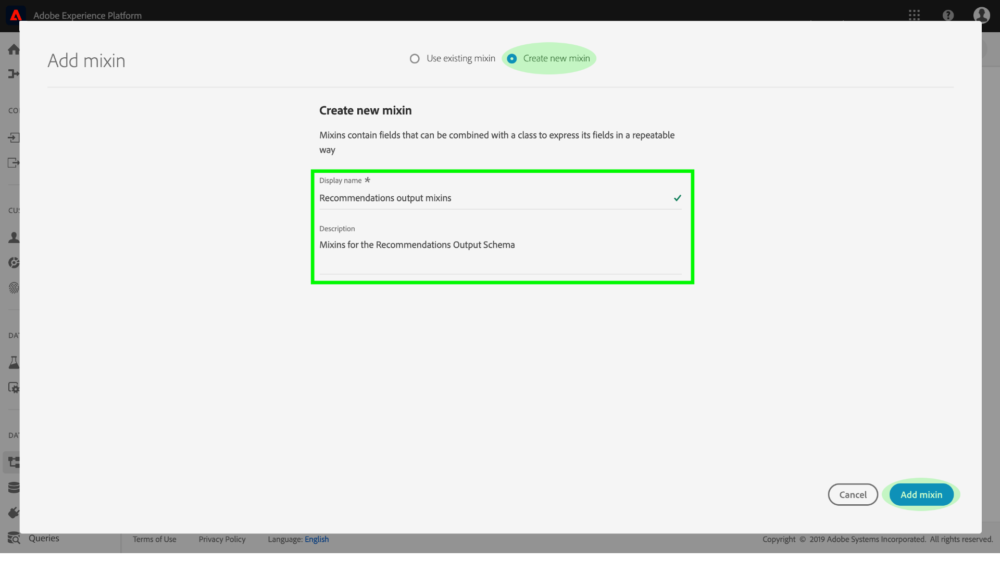
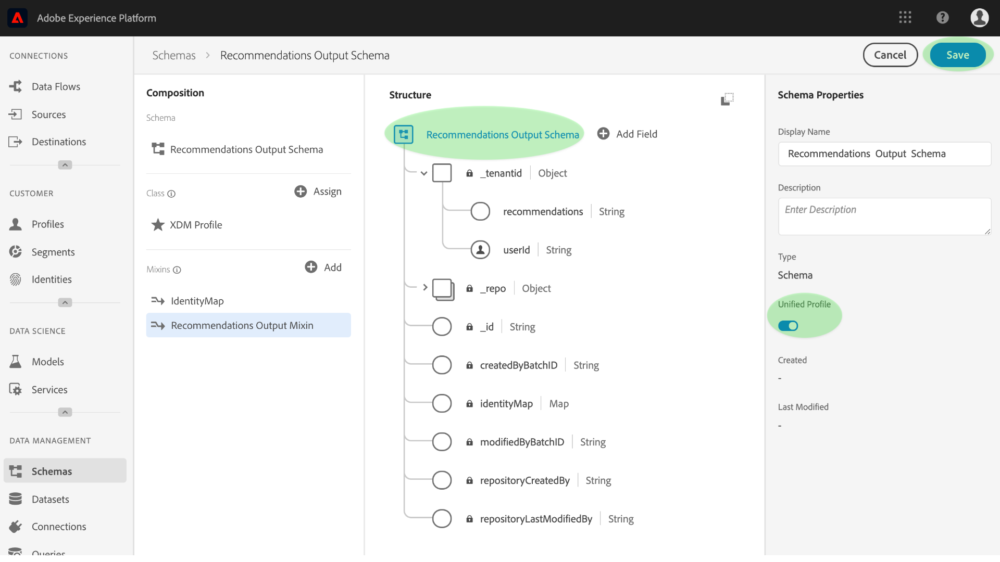
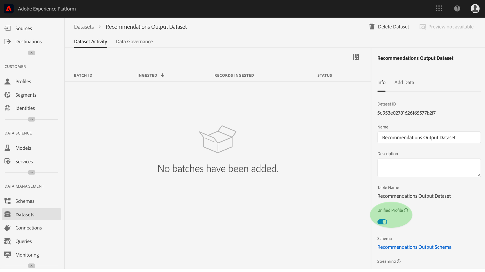

# Klantprofiel in realtime verrijken met kennis van machinaal leren

[!DNL Adobe Experience Platform] De Werkruimte van de Wetenschap van gegevens verstrekt de hulpmiddelen en de middelen om, machine het leren modellen tot stand te brengen te evalueren en te gebruiken om gegevensvoorspellingen en inzichten te produceren. Wanneer machinaal leerinzichten in een profiel-Toegelaten dataset worden opgenomen, worden die zelfde gegevens ook opgenomen als verslagen van het Profiel die dan in ondergroepen van verwante elementen kunnen worden gesegmenteerd door de Dienst van de Segmentatie van het Platform van de Ervaring te gebruiken.

Dit document biedt een stapsgewijze zelfstudie om het realtime profiel van klanten te verrijken met inzichten in het leren van machines. De stappen worden in de volgende secties opgedeeld:

1. [Een uitvoerschema en gegevensset maken](#create-an-output-schema-and-dataset)
2. [Een uitvoerschema en gegevensset configureren](#configure-an-output-schema-and-dataset)
3. [Segmenten maken met de Segment Builder](#create-segments-using-the-segment-builder)

## Aan de slag

Deze zelfstudie vereist een goed begrip van de verschillende aspecten van [!DNL Adobe Experience Platform] het opnemen van profielgegevens en het maken van segmenten. Voordat u met deze zelfstudie begint, raadpleegt u de documentatie voor de volgende services:

* [Klantprofiel](../../rtcdp/overview.md)in realtime: Verstrekt een verenigd, real-time consumentenprofiel dat op bijeengevoegde gegevens van veelvoudige bronnen wordt gebaseerd.
* [Identiteitsservice](../../identity-service/home.md): Laat het Profiel van de Klant in real time toe door identiteiten van ongelijke gegevensbronnen te overbruggen die in Platform worden opgenomen.
* [XDM (Experience Data Model)](../../xdm/home.md): Het gestandaardiseerde kader waardoor Platform gegevens van de klantenervaring organiseert.

Naast de bovengenoemde documenten, wordt het ten zeerste geadviseerd dat u ook de volgende gidsen op schema&#39;s en de Redacteur van het Schema bekijkt:

* [Basisbeginselen van de schemacompositie](../../xdm/schema/composition.md): Beschrijft schema&#39;s XDM, bouwstenen, principes, en beste praktijken voor het samenstellen van schema&#39;s die in het Platform van de Ervaring moeten worden gebruikt.
* [Zelfstudie](../../xdm/tutorials/create-schema-ui.md)Schema-editor: Verstrekt gedetailleerde instructies voor het creëren van schema&#39;s gebruikend de Redacteur van het Schema binnen het Platform van de Ervaring.

## Een uitvoerschema en gegevensset maken {#create-an-output-schema-and-dataset}

De eerste stap naar het verrijken van het Profiel van de Klant in real time met het scoren van inzichten is het weten van welk echt voorwerp (zoals een persoon) uw gegevens bepaalt. Dankzij een goed begrip van uw gegevens kunt u een structuur beschrijven en ontwerpen die betekenis heeft voor uw gegevens, vergelijkbaar met het ontwerpen van een relationele database.

Het samenstellen van een schema begint door een klasse toe te wijzen. De klassen bepalen de gedragsaspecten van de gegevens het schema (verslag of tijdreeks) zal bevatten. Deze sectie verstrekt basisinstructies om een schema tot stand te brengen gebruikend de schemabouwer. Voor een meer diepgaande zelfstudie raadpleegt u de zelfstudie over het [maken van een schema met de Schema-editor](../../xdm/tutorials/create-schema-ui.md).

1. Klik op het tabblad **[!UICONTROL Schema]** op het Adobe Experience Platform om de schemabrowser te openen. Klik **[!UICONTROL creëren Schema]** toegang tot de Redacteur *van het*Schema, waar u schema&#39;s op elkaar inwerkend kunt bouwen en creëren.
   

2. Klik in het venster *Compositie* op **[!UICONTROL Toewijzen]** om door de beschikbare klassen te bladeren.
   * Als u een bestaande klasse wilt toewijzen, klikt u op de gewenste klasse en markeert u deze. Klik vervolgens op Klasse ****toewijzen.
      

   * Als u een aangepaste klasse wilt maken, klikt u op Nieuwe klasse **** maken in het midden van het browservenster. Geef een klassenaam, beschrijving en kies het gedrag van de klasse. Klik op Klasse **** toewijzen als u klaar bent.
      

   Op dit punt moet de structuur van uw schema enkele klassevelden bevatten en u kunt nu mixen toewijzen. Een mix is een groep van één of meerdere gebieden die een bepaald concept beschrijven.

3. Klik in het venster *Compositie* op **[!UICONTROL Toevoegen]** in de subsectie *Mixins* .
   * Als u een bestaande mix wilt toewijzen, klikt u op de gewenste mix en markeert u deze. Klik vervolgens op **[!UICONTROL Mixin]**toevoegen. In tegenstelling tot klassen, kunnen de veelvoudige mengen aan één enkel schema worden toegewezen zolang het aangewezen is om dit te doen.
      

   * Als u een nieuwe mix wilt maken, klikt u op Nieuwe **[!UICONTROL mixin]** maken in het midden van het browservenster. Geef een naam en beschrijving voor de mix op en klik vervolgens op **[!UICONTROL Mixin]** toewijzen als u klaar bent.
      

   * Als u mengvelden wilt toevoegen, klikt u op de naam van de mix in het venster *Compositie* . Vervolgens kunt u mengvelden toevoegen door in het venster **[!UICONTROL Structuur]** op Veld ** toevoegen te klikken. Zorg ervoor dat u de eigenschappen voor mixen op basis hiervan opgeeft.
      

4. Zodra u klaar bent met het bouwen van uw schema, klik het hoogste niveaugebied van uw schema binnen het venster van de *Structuur* om de eigenschappen van het schema in het juiste bezitsvenster te tonen. Geef een naam en een beschrijving op en klik op **[!UICONTROL Opslaan]** om het schema te maken.
   

5. Creeer een outputdataset gebruikend uw onlangs gecreeerd schema door **[!UICONTROL Datasets]** van de linkernavigatiekolom te klikken, dan de klik **[!UICONTROL leidt dataset]**. Kies in het volgende scherm de optie Gegevensset **[!UICONTROL maken van schema]**.
   

6. Gebruikend schemabrowser, vind en selecteer het onlangs gecreeerd schema, dan klik **[!UICONTROL daarna]**.
   

7. Geef een naam en een optionele beschrijving op en klik vervolgens op **[!UICONTROL Voltooien]** om de gegevensset te maken.
   

Nu u een gecreeerd dataset van het outputschema hebt, bent u klaar aan de volgende sectie verder om hen voor de verrijking van het Profiel te vormen en toe te laten.

## Een uitvoerschema en gegevensset configureren {#configure-an-output-schema-and-dataset}

Alvorens u een dataset voor Profiel kunt toelaten, moet u het schema van de dataset aan het hebben van een primair identiteitsgebied vormen en dan het schema voor Profiel toelaten. Als u een nieuw schema wilt creëren en toelaten, kunt u naar het leerprogramma verwijzen bij het [creëren van een schema gebruikend de Redacteur](../../xdm/tutorials/create-schema-ui.md)van het Schema. Volg anders de instructies hieronder om een bestaand schema en een dataset toe te laten.

1. Op het Platform van de Ervaring van Adobe, gebruik schemabrowser om het outputschema te vinden u wenst om Profiel toe te laten en zijn naam te klikken om zijn samenstelling te bekijken.
   

2. Breid de schemastructuur uit en vind een aangewezen gebied om als primaire herkenningsteken te plaatsen. Klik op het gewenste veld om de eigenschappen ervan weer te geven.
   

3. Stel het veld in als de primaire identiteit door de eigenschap **[!UICONTROL Identiteit]** van het veld, de eigenschap **[!UICONTROL Primaire identiteit]** en vervolgens een geschikte **[!UICONTROL identiteitsnaamruimte]** in te schakelen. Klik op **[!UICONTROL Toepassen]** als u de wijzigingen hebt aangebracht.
   

4. Klik op het bovenste object van de schemastructuur om de schemaeigenschappen weer te geven en schakel het schema voor Profiel in door de **[!UICONTROL profielschakelaar]** in en uit te schakelen. Klik **[!UICONTROL sparen]** om uw veranderingen te voltooien, dataset die gebruikend dit schema werd gecreeerd kan nu voor Profiel worden toegelaten.
   

5. Gebruik datasetbrowser om de dataset te vinden u wenst om Profiel toe te laten en zijn naam te klikken om tot zijn details toegang te hebben.
   

6. Schakel de gegevensset voor Profiel in door te schakelen tussen de **[!UICONTROL profielschakelaar]** in de informatiekolom rechts.
   

Wanneer gegevens in een profiel-Toegelaten dataset worden opgenomen, worden die zelfde gegevens ook opgenomen als verslagen van het Profiel. Nu uw schema en dataset wordt voorbereid, produceer sommige gegevens in de dataset door het uitvoeren van het scoren looppas gebruikend een aangewezen model, en ga met dit leerprogramma verder om inzicht tot segmenten te leiden gebruikend de Bouwer van het Segment.

## Segmenten maken met de Segment Builder {#create-segments-using-the-segment-builder}

Nu u inzichten in uw profiel-Toegelaten dataset hebt geproduceerd en opgenomen, kunt u die gegevens beheren door ondergroepen van verwante elementen te identificeren gebruikend de Bouwer van het Segment. Volg de onderstaande stappen om uw eigen segmenten te maken.

1. Klik op het tabblad **[!UICONTROL Segmenten]** op het Adobe Experience Platform, gevolgd door Segment **** maken voor toegang tot de Segment Builder.
   

2. Binnen de Bouwer van het Segment, verleent de linkerspoorlijn toegang tot de kernbouwstenen van segmenten: kenmerken, gebeurtenissen en bestaande segmenten. Elke bouwsteen verschijnt in zijn eigen respectieve lusje. Selecteer de klasse tot waar uw profiel-toegelaten schema zich dan uitbreidt doorblader en vind de bouwstenen voor uw segment.
   

3. De belemmering en laat vallen bouwstenen op het canvas van de regelbouwer, voltooit hen door vergelijkende verklaringen te verstrekken.
   

4. Terwijl u uw segment bouwt, kunt u geschatte segmentresultaten voorvertonen door het deelvenster *Segmenteigenschappen* te observeren.
   

5. Selecteer een geschikt **[!UICONTROL samenvoegbeleid]**, geef een naam en een optionele beschrijving op en klik vervolgens op **[!UICONTROL Opslaan]** om het nieuwe segment te voltooien.
   

## Volgende stappen {#next-steps}

Dit document liep u door de stappen die worden vereist om een schema en dataset voor Profiel toe te laten, en toonde kort het werkschema voor het creëren van inzicht segmenten gebruikend de Bouwer van het Segment aan. Meer over segmenten en de Bouwer van het Segment leren, verwijs naar het de dienstoverzicht [van de](../../segmentation/home.md)Segmentatie.