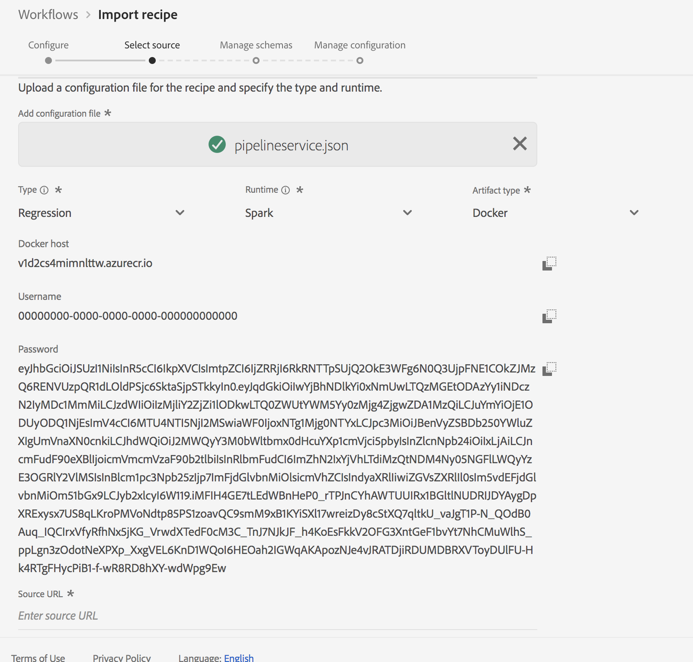

# Een verpakt recept (UI) importeren

Deze zelfstudie biedt inzicht in het configureren en importeren van een verpakt recept met behulp van het opgegeven voorbeeld Detailhandel. Aan het einde van deze zelfstudie bent u klaar om een model te maken, te trainen en te evalueren in de Adobe Experience Platform Data Science Workspace.

## Vereisten

Voor deze zelfstudie is een recept in een pakket nodig in de vorm van een URL voor een Docker-afbeelding. Zie de zelfstudie over het [verpakken van bronbestanden in een recept](./package-source-files-recipe.md) voor meer informatie.

## UI-workflow

Voor het importeren van een verpakt recept in de Data Science Workspace zijn specifieke recept-configuraties vereist, gecompileerd in één JSON-bestand (JavaScript Object Notation). Deze compilatie van recept-configuraties wordt het **configuratiebestand** genoemd. Een verpakt recept met een bepaalde reeks configuraties wordt bedoeld als **recept geval**. Eén recept kan worden gebruikt om veel recept-instanties te maken in de Data Science Workspace.

De workflow voor het importeren van een pakketrecept bestaat uit de volgende stappen:
- [Een recept configureren](#configure)
- [Op docker gebaseerd recept importeren - Python](#python)
- [Op Docker gebaseerde recept importeren - R](#r)
- [Op docker gebaseerde recept importeren - PySpark](#pyspark)
- [Op Docker gebaseerde recept importeren - Scala](#scala)

### Een recept configureren {#configure}

Elk recept-exemplaar in de Data Science Workspace gaat vergezeld van een set configuraties die het recept-exemplaar aanpassen aan een bepaald gebruiksgeval. De dossiers van de configuratie bepalen het standaardopleiding en het scoren gedrag van een Model dat gebruikend dit recept geval wordt gecreeerd.

>[!NOTE] De dossiers van de configuratie zijn recept en geval-specifiek.

Hieronder ziet u een voorbeeldconfiguratiebestand met standaardtraining en scoring voor het detailhandelsverkooprecept.

```json
[
    {
        "name": "train",
        "parameters": [
            {
                "key": "learning_rate",
                "value": "0.1"  
            },
            {
                "key": "n_estimators",
                "value": "100"
            },
            {
                "key": "max_depth",
                "value": "3"
            },
            {
                "key": "ACP_DSW_INPUT_FEATURES",
                "value": "date,store,storeType,storeSize,temperature,regionalFuelPrice,markdown,cpi,unemployment,isHoliday"
            },
            {
                "key": "ACP_DSW_TARGET_FEATURES",
                "value": "weeklySales"
            },
            {
                "key": "ACP_DSW_FEATURE_UPDATE_SUPPORT",
                "value": false
            },
            {
                "key": "tenantId",
                "value": "_{TENANT_ID}"
            },
            {
                "key": "ACP_DSW_TRAINING_XDM_SCHEMA",
                "value": "{SEE BELOW FOR DETAILS}"
            },
            {
                "key": "evaluation.labelColumn",
                "value": "weeklySalesAhead"
            },
            {
                "key": "evaluation.metrics",
                "value": "MAPE,MAE,RMSE,MASE"
            }
        ]
    },
    {
        "name": "score",
        "parameters": [
            {
                "key": "tenantId",
                "value": "_{TENANT_ID}"
            },
            {
                "key":"ACP_DSW_SCORING_RESULTS_XDM_SCHEMA",
                "value":"{SEE BELOW FOR DETAILS}"
            }
        ]
    }
]
```

| Parametersleutel | Type | Beschrijving |
| ----- | ----- | ----- |
| `learning_rate` | Getal | Schaalbaar voor verloopvermenigvuldiging. |
| `n_estimators` | Getal | Aantal bomen in het bos voor Random Forest Classifier. |
| `max_depth` | Getal | Maximale diepte van een boom in Random Forest Classifier. |
| `ACP_DSW_INPUT_FEATURES` | String | Lijst met door komma&#39;s gescheiden invoerschemakenmerken. |
| `ACP_DSW_TARGET_FEATURES` | String | Lijst met door komma&#39;s gescheiden kenmerken van het uitvoerschema. |
| `ACP_DSW_FEATURE_UPDATE_SUPPORT` | Boolean | Hiermee wordt bepaald of invoer- en uitvoerfuncties kunnen worden gewijzigd |
| `tenantId` | String | Deze id zorgt ervoor dat bronnen die u maakt, op de juiste wijze worden benoemd en zich binnen uw IMS-organisatie bevinden. [Volg de stappen hier](../../xdm/api/getting-started.md#know-your-tenant_id) om uw huurder te vinden identiteitskaart |
| `ACP_DSW_TRAINING_XDM_SCHEMA` | String | Het invoerschema dat wordt gebruikt voor het trainen van een model. Laat dit leeg wanneer u importeert in de gebruikersinterface, vervang deze door de trainingsschema-id wanneer u importeert met de API. |
| `evaluation.labelColumn` | String | Kolomlabel voor evaluatievisualisaties. |
| `evaluation.metrics` | String | Door komma&#39;s gescheiden lijst met evaluatiemetriek die moet worden gebruikt voor de evaluatie van een model. |
| `ACP_DSW_SCORING_RESULTS_XDM_SCHEMA` | String | Het uitvoerschema dat voor het scoren van een model wordt gebruikt. Laat dit leeg wanneer u importeert in de gebruikersinterface, vervang het bestand door een SchemaID wanneer u importeert met behulp van de API. |

Voor dit leerprogramma, kunt u de standaardconfiguratiedossiers voor de Verkoop van de Detailhandel in de Verwijzing van de Werkruimte van de Wetenschap van Gegevens verlaten de manier zij zijn.

### Op docker gebaseerd recept importeren - Python {#python}

Begin door te navigeren en **[!UICONTROL Werkschema]** te selecteren die in de hoogste-linkerzijde van de UI van het Platform wordt gevestigd. Selecteer vervolgens *Importeren* en klik op **[!UICONTROL Starten]**.


De pagina *Configureren* voor de workflow voor *Importrecept* wordt weergegeven. Voer een naam en beschrijving voor het recept in en selecteer vervolgens **[!UICONTROL Volgende]** in de rechterbovenhoek.


>[!NOTE]
> In de brondossiers van het [Pakket in een Recipe](./package-source-files-recipe.md) leerprogramma, werd een Docker URL verstrekt aan het eind van de bouw van het Retailrecept van de Verkoop gebruikend Python brondossiers.

Wanneer u zich op de *pagina Bron* selecteren bevindt, plakt u de URL van Docker die overeenkomt met het verpakte recept dat is gemaakt met Python-bronbestanden in het veld **[!UICONTROL Bron-URL]** . Importeer vervolgens het configuratiebestand door te slepen en neer te zetten of gebruik de **browser** van het bestandssysteem. Het opgegeven configuratiebestand is te vinden op `experience-platform-dsw-reference/recipes/python/retail/retail.config.json`. Selecteer **[!UICONTROL Python]** in de vervolgkeuzelijst *Runtime* en **[!UICONTROL Classificatie]** in de vervolgkeuzelijst *Type* . Als alles is ingevuld, klikt u op **[!UICONTROL Volgende]** in de rechterbovenhoek om door te gaan naar *Schema&#39;s* beheren.

>[!NOTE]
> *Type *ondersteunt **[!UICONTROL Classificatie]**en **[!UICONTROL Regressie]**. Selecteer **[!UICONTROL Aangepast]**als uw model niet onder een van deze typen valt.


Daarna, selecteer de de input en outputschema&#39;s van de Verkoop van de Detailhandel onder de sectie *leidt Schema*, werden zij gecreeerd gebruikend het verstrekte laarzentrekkermanuscript in [creeer het detailhandelschema en de datasetzelfstudie](../models-recipes/create-retails-sales-dataset.md) .


Onder de sectie van het Beheer van de *Eigenschap* , klik op uw huurdersidentificatie in de schemakijker om het Retailschema van de input van de Verkoop uit te breiden. Selecteer de invoer- en uitvoerfuncties door de gewenste functie te markeren en selecteer **[!UICONTROL Invoerfunctie]** of **[!UICONTROL Doelfunctie]** in het rechtervenster **[!UICONTROL Veldeigenschappen]** . Voor deze zelfstudie stelt u **[!UICONTROL wekelijkseSales]** in als de **[!UICONTROL doelfunctie]** en alles als **[!UICONTROL invoerfunctie]**. Klik op **[!UICONTROL Volgende]** om uw nieuwe geconfigureerde recept te bekijken.

Bekijk het recept, voeg configuraties toe, wijzig of verwijder configuraties zoals nodig. Klik op **[!UICONTROL Voltooien]** om het recept te maken.


Ga aan de [volgende stappen](#next-steps) te werk om te weten te komen hoe te om een Model in de Werkruimte van de Wetenschap van Gegevens tot stand te brengen gebruikend het onlangs gecreëerde Commerciële recept van de Verkoop.

### Op Docker gebaseerde recept importeren - R {#r}

Begin door te navigeren en **[!UICONTROL Werkschema]** te selecteren die in de hoogste-linkerzijde van de UI van het Platform wordt gevestigd. Selecteer vervolgens *Importeren* en klik op **[!UICONTROL Starten]**.


De pagina *Configureren* voor de workflow voor *Importrecept* wordt weergegeven. Voer een naam en beschrijving voor het recept in en selecteer vervolgens **[!UICONTROL Volgende]** in de rechterbovenhoek.


>[!NOTE]
> In de brondossiers van het [Pakket in een Recipe](./package-source-files-recipe.md) leerprogramma, werd een Docker URL verstrekt aan het eind van de bouw van het Retailrecept van de Verkoop gebruikend de brondossiers van R.

Wanneer u zich op de *Uitgezochte bronpagina* bevindt, plakt u de URL van Docker die overeenkomt met het verpakte recept dat is samengesteld met R-bronbestanden in het veld **[!UICONTROL Bron-URL]** . Importeer vervolgens het configuratiebestand door te slepen en neer te zetten of gebruik de **browser** van het bestandssysteem. Het opgegeven configuratiebestand is te vinden op `experience-platform-dsw-reference/recipes/R/Retail\ -\ GradientBoosting/retail.config.json`. Selecteer **[!UICONTROL R]** in de vervolgkeuzelijst *Runtime* en **[!UICONTROL Classificatie]** in de vervolgkeuzelijst *Type* . Als alles is ingevuld, klikt u op **[!UICONTROL Volgende]** in de rechterbovenhoek om door te gaan naar *Schema&#39;s* beheren.

>[!NOTE]
> *Type *ondersteunt **[!UICONTROL Classificatie]**en **[!UICONTROL Regressie]**. Selecteer **[!UICONTROL Aangepast]**als uw model niet onder een van deze typen valt.


Daarna, selecteer de de input en outputschema&#39;s van de Verkoop van de Detailhandel onder de sectie *leidt Schema*, werden zij gecreeerd gebruikend het verstrekte laarzentrekkermanuscript in [creeer het detailhandelschema en de datasetzelfstudie](../models-recipes/create-retails-sales-dataset.md) .


Onder de sectie van het Beheer van de *Eigenschap* , klik op uw huurdersidentificatie in de schemakijker om het Retailschema van de input van de Verkoop uit te breiden. Selecteer de invoer- en uitvoerfuncties door de gewenste functie te markeren en selecteer **[!UICONTROL Invoerfunctie]** of **[!UICONTROL Doelfunctie]** in het rechtervenster **[!UICONTROL Veldeigenschappen]** . Voor deze zelfstudie stelt u **[!UICONTROL wekelijkseSales]** in als de **[!UICONTROL doelfunctie]** en alles als **[!UICONTROL invoerfunctie]**. Klik op **[!UICONTROL Volgende]** om uw nieuwe geconfigureerde recept te bekijken.

Bekijk het recept, voeg configuraties toe, wijzig of verwijder configuraties zoals nodig. Klik op **Voltooien** om het recept te maken.


Ga aan de [volgende stappen](#next-steps) te werk om te weten te komen hoe te om een Model in de Werkruimte van de Wetenschap van Gegevens tot stand te brengen gebruikend het onlangs gecreëerde Commerciële recept van de Verkoop.

### Op docker gebaseerde recept importeren - PySpark {#pyspark}

Begin door te navigeren en **[!UICONTROL Werkschema]** te selecteren die in de hoogste-linkerzijde van de UI van het Platform wordt gevestigd. Selecteer vervolgens *Importeren* en klik op **[!UICONTROL Starten]**.


De pagina *Configureren* voor de workflow voor *Importrecept* wordt weergegeven. Voer een naam en beschrijving voor het recept in en selecteer vervolgens **[!UICONTROL Volgende]** in de rechterbovenhoek om door te gaan.


>[!NOTE]
> In de brondossiers van het [Pakket in een Recipe](./package-source-files-recipe.md) leerprogramma, werd een Docker URL verstrekt aan het eind van de bouw van het Detailhandelrecept van de Verkoop gebruikend PySpark brondossiers.

Zodra u op de *Uitgezochte bronpagina* bent, kleef de Docker URL die aan het verpakte recept beantwoordt dat gebruikend PySpark brondossiers in het **[!UICONTROL BronURL]** gebied wordt gebouwd. Importeer vervolgens het configuratiebestand door te slepen en neer te zetten of gebruik de **browser** van het bestandssysteem. Het opgegeven configuratiebestand is te vinden op `experience-platform-dsw-reference/recipes/pyspark/retail/pipeline.json`. Selecteer **[!UICONTROL PySpark]** in de drop-down *Runtime* . Nadat de PySpark-runtime is geselecteerd, wordt het standaardartefact automatisch ingevuld in **[!UICONTROL Docker]**. Selecteer vervolgens **[!UICONTROL Classificatie]** in de vervolgkeuzelijst *Type* . Als alles is ingevuld, klikt u op **[!UICONTROL Volgende]** in de rechterbovenhoek om door te gaan naar *Schema&#39;s* beheren.

>[!NOTE]
> *Type *ondersteunt **[!UICONTROL Classificatie]**en **[!UICONTROL Regressie]**. Selecteer **[!UICONTROL Aangepast]**als uw model niet onder een van deze typen valt.


Daarna, selecteer de de input en outputschema&#39;s van de Verkoop van de Detailhandel onder de sectie *leidt Schema*, werden zij gecreeerd gebruikend het verstrekte laarzentrekkermanuscript in [creeer het detailhandelschema en de datasetzelfstudie](../models-recipes/create-retails-sales-dataset.md) .


Onder de sectie van het Beheer van de *Eigenschap* , klik op uw huurdersidentificatie in de schemakijker om het Retailschema van de input van de Verkoop uit te breiden. Selecteer de invoer- en uitvoerfuncties door de gewenste functie te markeren en selecteer **[!UICONTROL Invoerfunctie]** of **[!UICONTROL Doelfunctie]** in het rechtervenster **[!UICONTROL Veldeigenschappen]** . Voor deze zelfstudie stelt u **[!UICONTROL wekelijkseSales]** in als de **[!UICONTROL doelfunctie]** en alles als **[!UICONTROL invoerfunctie]**. Klik op **[!UICONTROL Volgende]** om uw nieuwe geconfigureerde recept te bekijken.

Bekijk het recept, voeg configuraties toe, wijzig of verwijder configuraties zoals nodig. Klik op **[!UICONTROL Voltooien]** om het recept te maken.


Ga aan de [volgende stappen](#next-steps) te werk om te weten te komen hoe te om een Model in de Werkruimte van de Wetenschap van Gegevens tot stand te brengen gebruikend het onlangs gecreëerde Commerciële recept van de Verkoop.

### Op Docker gebaseerde recept importeren - Scala {#scala}

Begin door te navigeren en **[!UICONTROL Werkschema]** te selecteren die in de hoogste-linkerzijde van de UI van het Platform wordt gevestigd. Selecteer vervolgens *Importeren* en klik op **[!UICONTROL Starten]**.


De pagina *Configureren* voor de workflow voor *Importrecept* wordt weergegeven. Voer een naam en beschrijving voor het recept in en selecteer vervolgens **[!UICONTROL Volgende]** in de rechterbovenhoek om door te gaan.


>[!NOTE]
> In de brondossiers van het [Pakket in een Recipe](./package-source-files-recipe.md) leerprogramma, werd een Docker URL verstrekt aan het eind van de bouw van het Detailhandelsrecept van de Verkoop gebruikend Scala (Vonk) brondossiers.

Wanneer u zich op de *pagina Bron* selecteren bevindt, plakt u de URL van Docker die overeenkomt met het verpakte recept dat is samengesteld met de bronbestanden Scala in het veld *Bron-URL* . Importeer vervolgens het configuratiebestand door te slepen en neer te zetten of gebruik de **browser** van het bestandssysteem. Het opgegeven configuratiebestand is te vinden op `experience-platform-dsw-reference/recipes/scala/retail/pipelineservice.json`. Selecteer **[!UICONTROL Vonk]** in de drop-down *Runtime* . Zodra runtime van de Vonk wordt geselecteerd vult het standaardartefact automatisch aan **[!UICONTROL Docker]**. Selecteer vervolgens **[!UICONTROL Regressie]** in de vervolgkeuzelijst *Type* . Als alles is ingevuld, klikt u op **[!UICONTROL Volgende]** in de rechterbovenhoek om door te gaan naar *Schema&#39;s* beheren.

>[!NOTE]
> *Type *ondersteunt **[!UICONTROL Classificatie]**en **[!UICONTROL Regressie]**. Selecteer **[!UICONTROL Aangepast]**als uw model niet onder een van deze typen valt.



Daarna, selecteer de de input en outputschema&#39;s van de Verkoop van de Detailhandel onder de sectie *leidt Schema*, werden zij gecreeerd gebruikend het verstrekte laarzentrekkermanuscript in [creeer het detailhandelschema en de datasetzelfstudie](../models-recipes/create-retails-sales-dataset.md) .


Onder de sectie van het Beheer van de *Eigenschap* , klik op uw huurdersidentificatie in de schemakijker om het Retailschema van de input van de Verkoop uit te breiden. Selecteer de invoer- en uitvoerfuncties door de gewenste functie te markeren en selecteer **[!UICONTROL Invoerfunctie]** of **[!UICONTROL Doelfunctie]** in het rechtervenster **[!UICONTROL Veldeigenschappen]** . Voor deze zelfstudie stelt u **[!UICONTROL wekelijkseSales]** in als de **[!UICONTROL doelfunctie]** en alles als **[!UICONTROL invoerfunctie]**. Klik op **[!UICONTROL Volgende]** om uw nieuwe geconfigureerde recept te bekijken.

Bekijk het recept, voeg configuraties toe, wijzig of verwijder configuraties zoals nodig. Klik op **[!UICONTROL Voltooien]** om het recept te maken.


Ga aan de [volgende stappen](#next-steps) te werk om te weten te komen hoe te om een Model in de Werkruimte van de Wetenschap van Gegevens tot stand te brengen gebruikend het onlangs gecreëerde Commerciële recept van de Verkoop.

## Volgende stappen {#next-steps}

Deze zelfstudie gaf inzicht in het configureren en importeren van een recept in de Data Science Workspace. U kunt nu een model maken, trainen en evalueren met het nieuwe recept.

- [Een model trainen en evalueren in de gebruikersinterface](./train-evaluate-model-ui.md)
- [Een model trainen en evalueren met behulp van de API](./train-evaluate-model-api.md)