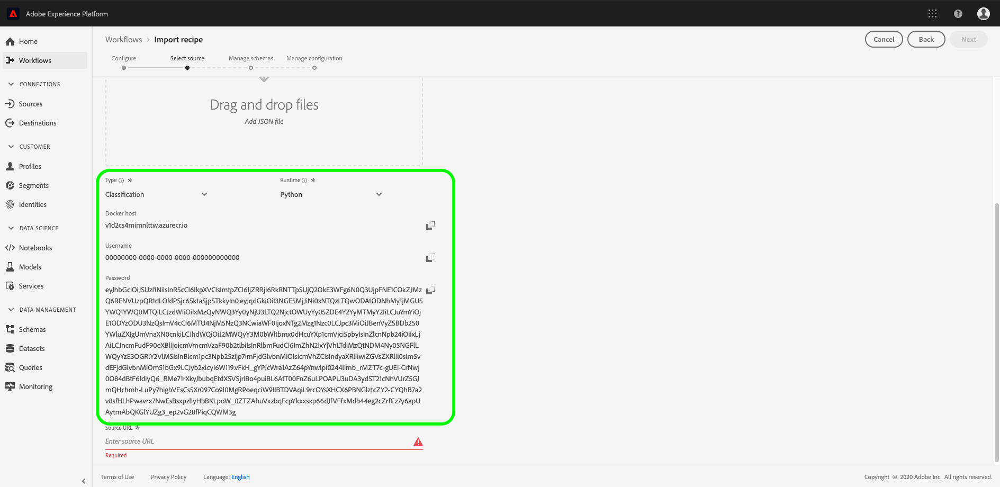

# Bronbestanden in een recept verpakken

>[!NOTE]
>
>Data Science Workspace is niet meer verkrijgbaar.
>
>Deze documentatie is bedoeld voor bestaande klanten met eerdere rechten op Data Science Workspace.

Deze zelfstudie bevat instructies voor het verpakken van de voorbeeldbronbestanden voor de detailhandel in een archiefbestand. U kunt dit bestand gebruiken om een recept te maken in Adobe Experience Platform [!DNL Data Science Workspace] door de workflow voor het importeren van recept op te volgen in de gebruikersinterface of met de API.

Concepten om te begrijpen:

- **Ontvangt**: Een recept is de termijn van de Adobe voor een Model specificatie en is een top-level container die een specifiek machine het leren, kunstmatig intelligentiealgoritme of samenkomen van algoritmen, verwerkingslogica, en configuratie vertegenwoordigt die wordt vereist om een opgeleid model te bouwen en uit te voeren en vandaar hulp specifieke bedrijfsproblemen op te lossen.
- **de dossiers van Source**: Individuele dossiers in uw project die de logica voor een recept bevatten.

## Vereisten

- [[!DNL Docker]](https://docs.docker.com/install/#supported-platforms)
- [[!DNL Python 3 and pip]](https://docs.conda.io/en/latest/miniconda.html)
- [[!DNL Scala]](https://www.scala-sbt.org/download.html?_ga=2.42231906.690987621.1558478883-2004067584.1558478883)
- [[!DNL Maven]](https://maven.apache.org/install.html)

## Ontvanger maken

Het maken van ontvangers begint met het verpakken van bronbestanden om een archiefbestand te maken. Source-bestanden definiëren de computerleerlogica en algoritmen die worden gebruikt om een specifiek probleem op te lossen en worden geschreven in [!DNL Python] , R, PySpark of Scala. Gebouwde archiefbestanden hebben de vorm van een Docker-afbeelding. Zodra gebouwd, wordt het verpakte archiefdossier ingevoerd in [!DNL Data Science Workspace] om een recept [ in UI ](./import-packaged-recipe-ui.md) tot stand te brengen of [ gebruikend API ](./import-packaged-recipe-api.md).

### Ontwerpmodel gebaseerd op docker {#docker-based-model-authoring}

Met een Docker-afbeelding kan een ontwikkelaar een toepassing verpakken met alle benodigde onderdelen, zoals bibliotheken en andere afhankelijkheden, en deze als één pakket verzenden.

De ingebouwde Docker-afbeelding wordt naar het Azure Container-register gepusht met behulp van referenties die aan u worden geleverd tijdens de workflow voor het maken van het recept.

Om uw Azure geloofsbrieven van de Registratie van de Container te verkrijgen, login in [ Adobe Experience Platform ](https://platform.adobe.com). Navigeer in de linkernavigatiekolom naar **[!UICONTROL Workflows]** . Selecteer **[!UICONTROL Import Recipe]** gevolgd door **[!UICONTROL Launch]** te selecteren. Zie de schermafbeelding hieronder ter referentie.


De pagina **[!UICONTROL Configure]** wordt geopend. Geef het juiste **[!UICONTROL Recipe Name]** op, bijvoorbeeld &quot;Detailhandelrecept&quot;, en geef desgewenst een beschrijving of documentatie-URL op. Klik op **[!UICONTROL Next]** als u klaar bent.


Selecteer aangewezen *Runtime*, dan kies a **[!UICONTROL Classification]** voor *Type*. Uw Azure Container Registry-referenties worden gegenereerd zodra dit is voltooid.

>[!NOTE]
>
>*Type* is de klasse van machine het leren probleem het recept wordt ontworpen voor en na opleiding gebruikt helpen evaluerend de opleidingslooppas aanpassen.

>[!TIP]
>
>- Selecteer voor [!DNL Python] -recepten de **[!UICONTROL Python]** -runtime.
>- Voor R-ontvangers selecteert u de **[!UICONTROL R]** -runtime.
>- Voor PySpark-recepten selecteert u de **[!UICONTROL PySpark]** -runtime. Een artefacttype dat automatisch wordt gevuld.
>- Selecteer voor Scala-recepten de **[!UICONTROL Spark]** -runtime. Een artefacttype dat automatisch wordt gevuld.



Noteer de waarden voor Docker-host, gebruikersnaam en wachtwoord. Deze worden gebruikt om uw [!DNL Docker] -afbeelding samen te stellen en te duwen in de onderstaande workflows.

>[!NOTE]
>
>De Source-URL wordt opgegeven nadat de hieronder beschreven stappen zijn uitgevoerd. Het configuratiedossier wordt verklaard in verdere leerprogramma&#39;s die in [ worden gevonden volgende stappen ](#next-steps).

### De bronbestanden verpakken

Begin door de steekproefcodebase te verkrijgen die in de <a href="https://github.com/adobe/experience-platform-dsw-reference" target="_blank"> wordt gevonden de Verschuiving van de Verwijzing van Workspace van de Wetenschap van de Gegevens van het Experience Platform </a>.

- [Python Docker-afbeelding samenstellen](#python-docker)
- [Afbeelding samenstellen of docker](#r-docker)
- [Afbeelding van PySpark Docker maken](#pyspark-docker)
- [Schaaldockerafbeelding (Spark) maken](#scala-docker)

### [!DNL Python] Docker-afbeelding samenstellen {#python-docker}

Als u dit nog niet hebt gedaan, kloont u de [!DNL GitHub] -opslagplaats op uw lokale systeem met de volgende opdracht:

```shell
git clone https://github.com/adobe/experience-platform-dsw-reference.git
```

Navigeer naar de map `experience-platform-dsw-reference/recipes/python/retail` . Hier vindt u de scripts `login.sh` en `build.sh` die worden gebruikt om u aan te melden bij Docker en de [!DNL Python Docker] -afbeelding te maken. Als u uw [&#128279;](#docker-based-model-authoring) klaar geloofsbrieven van het 0&rbrace; Dock hebt, ga de volgende bevelen in orde in:

```BASH
# for logging in to Docker
./login.sh
 
# for building Docker image
./build.sh
```

Wanneer u het aanmeldingsscript uitvoert, moet u de Docker-host, de gebruikersnaam en het wachtwoord opgeven. Tijdens het bouwen, moet u de gastheer van de Dokker en een versietag voor de bouwstijl verstrekken.

Zodra het bouwstijlmanuscript volledig is, wordt u gegeven een van het brondossier van de Docker URL in uw consoleoutput. Voor dit specifieke voorbeeld ziet het er ongeveer als volgt uit:

```BASH
# URL format: 
{DOCKER_HOST}/ml-retailsales-python:{VERSION_TAG}
```

Kopieer dit URL en ga op [ volgende stappen ](#next-steps).

### R-afbeelding samenstellen [!DNL Docker] {#r-docker}

Als u dit nog niet hebt gedaan, kloont de [!DNL GitHub] gegevensopslagruimte op uw lokale systeem met de volgende opdracht:

```BASH
git clone https://github.com/adobe/experience-platform-dsw-reference.git
```

Navigeer naar de map `experience-platform-dsw-reference/recipes/R/Retail - GradientBoosting` in uw gekloonde opslagplaats. Hier vindt u de bestanden `login.sh` en `build.sh` waarmee u zich aanmeldt bij Docker en de R Docker-afbeelding maakt. Als u uw [&#128279;](#docker-based-model-authoring) klaar geloofsbrieven van het 0&rbrace; Dock hebt, ga de volgende bevelen in orde in:

```BASH
# for logging in to Docker
./login.sh
 
# for build Docker image
./build.sh
```

Wanneer u het aanmeldingsscript uitvoert, moet u de Docker-host, de gebruikersnaam en het wachtwoord opgeven. Tijdens het bouwen, moet u de gastheer van de Dokker en een versietag voor de bouwstijl verstrekken.

Zodra het bouwstijlmanuscript volledig is, wordt u gegeven een van het brondossier van de Docker URL in uw consoleoutput. Voor dit specifieke voorbeeld ziet het er ongeveer als volgt uit:

```BASH
# URL format: 
{DOCKER_HOST}/ml-retail-r:{VERSION_TAG}
```

Kopieer dit URL en ga naar de [ volgende stappen ](#next-steps).

### Afbeelding van PySpark Docker samenstellen {#pyspark-docker}

Begin met het klonen van de [!DNL GitHub] -opslagplaats op uw lokale systeem met de volgende opdracht:

```shell
git clone https://github.com/adobe/experience-platform-dsw-reference.git
```

Navigeer naar de map `experience-platform-dsw-reference/recipes/pyspark/retail` . De scripts `login.sh` en `build.sh` bevinden zich hier en worden gebruikt om u aan te melden bij Docker en om de Docker-afbeelding te maken. Als u uw [&#128279;](#docker-based-model-authoring) klaar geloofsbrieven van het 0&rbrace; Dock hebt, ga de volgende bevelen in orde in:

```BASH
# for logging in to Docker
./login.sh
 
# for building Docker image
./build.sh
```

Wanneer u het aanmeldingsscript uitvoert, moet u de Docker-host, de gebruikersnaam en het wachtwoord opgeven. Tijdens het bouwen moet u de Docker-host en een versietag voor de build opgeven.

Zodra het bouwstijlmanuscript volledig is, wordt u gegeven een van het brondossier van de Docker URL in uw consoleoutput. In dit specifieke voorbeeld ziet het er ongeveer als volgt uit:

```BASH
# URL format: 
{DOCKER_HOST}/ml-retailsales-pyspark:{VERSION_TAG}
```

Kopieer dit URL en ga naar de [ volgende stappen ](#next-steps).

### Afbeelding van Scala Docker maken {#scala-docker}

Begin met het klonen van de [!DNL GitHub] repository op uw lokale systeem met de volgende opdracht in het terminale domein:

```shell
git clone https://github.com/adobe/experience-platform-dsw-reference.git
```

Navigeer vervolgens naar de map `experience-platform-dsw-reference/recipes/scala` waar u de scripts `login.sh` en `build.sh` kunt vinden. Deze scripts worden gebruikt om u aan te melden bij Docker en de Docker-afbeelding te maken. Als u uw [ geloofsbrieven van de Dokker ](#docker-based-model-authoring) klaar hebt, ga de volgende bevelen aan eind in orde in:

```BASH
# for logging in to Docker
./login.sh
 
# for building Docker image
./build.sh
```

>[!TIP]
>
>Als u een machtigingsfout ontvangt bij het aanmelden bij Docker via het script `login.sh` , probeert u de opdracht `bash login.sh` .

Wanneer het uitvoeren van het login manuscript, moet u de gastheer van het Docker, gebruikersbenaming, en wachtwoord verstrekken. Tijdens het bouwen, moet u de gastheer van de Dokker en een versietag voor de bouwstijl verstrekken.

Zodra het bouwstijlmanuscript volledig is, wordt u gegeven een van het brondossier van de Docker URL in uw consoleoutput. Voor dit specifieke voorbeeld ziet het er ongeveer als volgt uit:

```BASH
# URL format: 
{DOCKER_HOST}/ml-retailsales-spark:{VERSION_TAG}
```

Kopieer dit URL en ga naar de [ volgende stappen ](#next-steps).

## Volgende stappen {#next-steps}

Deze zelfstudie ging over het verpakken van bronbestanden naar een recept, de noodzakelijke stap voor het importeren van een recept naar [!DNL Data Science Workspace] . U moet nu een Docker-afbeelding in het Azure Container-register hebben, samen met de bijbehorende afbeelding-URL. U kunt nu beginnen met de zelfstudie over het importeren van een verpakt recept in [!DNL Data Science Workspace] . Selecteer een van de onderstaande koppelingen voor zelfstudie om aan de slag te gaan:

- [Een verpakte ontvanger importeren in de gebruikersinterface](./import-packaged-recipe-ui.md)
- [Een verpakte ontvanger importeren met de API](./import-packaged-recipe-api.md)
