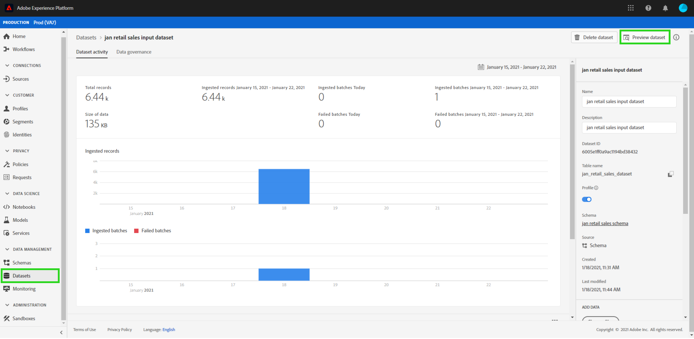

# Een voorvertoning weergeven van het detailhandelsschema en de dataset

Op succesvolle voltooiing van het laarzentrekkerscript van [kleinhandelsverkoopschema en dataset](./create-retails-sales-dataset.md) leerprogramma. Uitvoerschema&#39;s en datasets kunnen op [!DNL Experience Platform] worden bekeken. Volg onderstaande stappen om de schema&#39;s en datasets weer te geven:

Selecteer het tabblad **[!UICONTROL Schema&#39;s]** in de linkernavigatie en zoek het invoerschema dat door het bootstrap-script is gemaakt. De naam van het schema komt overeen met wat in de vorige stap is gedefinieerd in `config.yaml`. Bekijk de schemadetails en het is samenstelling door in het te klikken.

Selecteer het tabblad **[!UICONTROL Datasets]** in de linkernavigatie en open de gegevensset die is gemaakt door de naam van de gegevensset te selecteren. De naam van de gegevensset komt overeen met de naam die in de vorige stap is gedefinieerd in `config.yaml`.

Selecteer **[!UICONTROL Gegevensset voorvertoning]** rechtsboven om een subset van de gegevensset voor te vertonen.

## Volgende stappen

U hebt met succes met de gegevens van de steekproef van de Verkoop van de Handel in [!DNL Experience Platform] gebruikend het verstrekte laarzentrekwescript opgenomen.

U kunt als volgt met de opgenomen gegevens blijven werken:
- [Uw gegevens analyseren met Jupyter-laptops](../jupyterlab/analyze-your-data.md)
   - Gebruik Jupyter-laptops in [!DNL Data Science Workspace] voor toegang tot, verkenning, visualisatie en begrip van uw gegevens.
- [Bronbestanden in een pakket plaatsen in een ontvanger](./package-source-files-recipe.md)
   - Volg deze zelfstudie om te leren hoe u uw eigen model in [!DNL Data Science Workspace] kunt brengen door bronbestanden in een importeerbaar Recipe-bestand te verpakken.