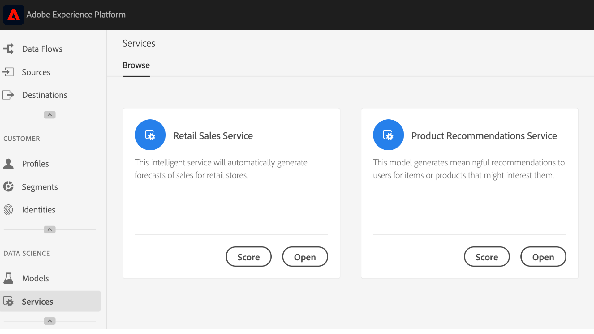

# Een model publiceren als service (UI)

De Werkruimte van de Wetenschap van Gegevens van het Adobe Experience Platform staat u toe om uw opgeleid en geëvalueerd Model als Dienst te publiceren, toelatend gebruikers binnen uw organisatie IMS om gegevens te scoren zonder de behoefte om hun eigen Modellen te creëren.

## Aan de slag

Voor het voltooien van deze zelfstudie hebt u toegang tot [!DNL Experience Platform]. Als u geen toegang hebt tot een IMS-organisatie in [!DNL Experience Platform], neemt u contact op met uw systeembeheerder voordat u verdergaat.

Voor deze zelfstudie is een bestaand model met een geslaagde trainingsuitvoering vereist. Als u geen publiceerbaar model hebt, volgt u de [training en evalueert u een model in de zelfstudie voor de gebruikersinterface](./train-evaluate-model-ui.md) voordat u verdergaat.

Raadpleeg de [API-zelfstudie](./publish-model-service-api.md)als u een model wilt publiceren met gebruik van API&#39;s voor leren door Sensei-machines.

## Een model publiceren {#publish-a-model}

1. Klik in Adobe Experience Platform op de koppeling **[!UICONTROL Modellen]** in de linkernavigatiekolom om alle bestaande modellen weer te geven. Zoek en klik op de naam van het model dat als service moet worden gepubliceerd.
   
2. Klik op **[!UICONTROL Publiceren]** in de rechterbovenhoek van de overzichtspagina Model om een serviceproces te starten.
   
3. Voer een gewenste naam voor de service in en geef desgewenst een servicebeschrijving op en klik op **[!UICONTROL Volgende]** als u klaar bent.
   
4. Alle geslaagde trainingen voor het model worden weergegeven. De nieuwe Dienst zal training en het scoren configuraties van de geselecteerde trainingslooppas erven.
   
5. Klik op **[!UICONTROL Voltooien]** om de service te maken en omleiding naar de **[!UICONTROL servicegalerie]** om alle beschikbare services weer te geven, inclusief de zojuist gemaakte service.
   

## Score met een service {#access-a-service}

1. Klik in Adobe Experience Platform op het tabblad **[!UICONTROL Services]** in de linkernavigatiekolom voor toegang tot de *servicegalerie*. Zoek de service die u wilt gebruiken en klik op **[!UICONTROL Score]**.
   
2. Selecteer een aangewezen inputdataset voor de het scoren looppas, dan klik **[!UICONTROL daarna]**.
   
3. Selecteer een geschikte uitvoerdataset voor de het scoren resultaten, dan klik **[!UICONTROL daarna]**.
   
4. Wanneer een Dienst wordt gecreeerd, erft het gebrek die configuraties scoring. U kunt deze configuraties bekijken en deze naar wens aanpassen door op de waarden te dubbelklikken. Als u tevreden bent met de configuraties, klikt u op **[!UICONTROL Voltooien]** om de scoring uit te voeren.
   
5. Op de *overzichtspagina* van de Dienst, worden de details van de nieuwe het scoren baan en zijn vooruitgang getoond. Nadat de taak is voltooid, wordt de **[!UICONTROL meest recente]** scores-taak bijgewerkt.
   

## Volgende stappen {#next-steps}

Door deze zelfstudie te volgen, hebt u met succes een Model als toegankelijke Dienst gepubliceerd, en gegevens die de nieuwe Dienst door de Galerij *van de* Dienst worden gescoord. Ga verder met de volgende zelfstudie om te leren hoe u geautomatiseerde training en scoring op een service [kunt](./schedule-models-ui.md)plannen.
