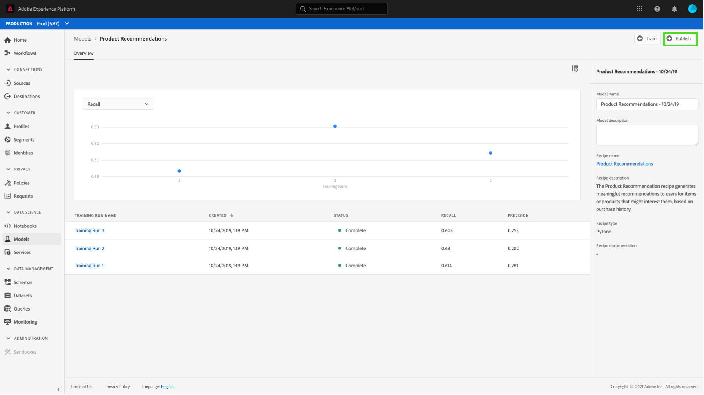

# Een model publiceren als service in de gebruikersinterface van Data Science Workspace {#publish-a-model-as-a-service}

>[!NOTE]
>
>Data Science Workspace kan niet meer worden aangeschaft.
>
>Deze documentatie is bedoeld voor bestaande klanten met eerdere rechten op Data Science Workspace.

>[!CONTEXTUALHELP]
>id="platform_intelligentservices_publishmodel"
>title="Een model publiceren als service"
>abstract=""

Met Adobe Experience Platform Data Science Workspace kunt u uw getrainde en geëvalueerde Model als service publiceren, zodat gebruikers binnen uw organisatie gegevens kunnen scoren zonder dat ze zelf modellen hoeven te maken.

## Aan de slag

U moet toegang hebben tot [!DNL Experience Platform] om deze zelfstudie te kunnen voltooien. Als u geen toegang hebt tot een organisatie in [!DNL Experience Platform] , neemt u contact op met uw systeembeheerder voordat u verdergaat.

Voor deze zelfstudie is een bestaand model met een geslaagde trainingsuitvoering vereist. Als u geen publiceerbaar Model hebt, volg de [&#x200B; Lijn en evalueer een Model in de UI &#x200B;](./train-evaluate-model-ui.md) leerprogramma alvorens verder te gaan.

Als u verkiest om een Model te publiceren door het Leren APIs van de Machine van Sensei te gebruiken, verwijs naar het [&#x200B; API leerprogramma &#x200B;](./publish-model-service-api.md).

## Een model publiceren {#publish-a-model}

Selecteer in Adobe Experience Platform de optie **[!UICONTROL Models]** in de linkernavigatiekolom en selecteer vervolgens de tab **[!UICONTROL Browse]** om alle bestaande modellen weer te geven. Selecteer de naam van het model dat u als service wilt publiceren.

Selecteer **[!UICONTROL Publish]** rechtsboven op de pagina Modeloverzicht om een serviceproces te starten.

Voer een gewenste naam voor de service in en geef desgewenst een servicebeschrijving op en selecteer **[!UICONTROL Next]** als u klaar bent.

Alle geslaagde trainingen voor het model worden weergegeven. De nieuwe Dienst zal training en het scoren configuraties van de geselecteerde trainingslooppas erven.

Selecteer **[!UICONTROL Finish]** om de service te maken en om te leiden naar **[!UICONTROL Service Gallery]** om alle beschikbare services weer te geven, inclusief de zojuist gemaakte service.

## Score met gebruik van een service {#access-a-service}

In Adobe Experience Platform selecteert u de tab **[!UICONTROL Services]** in de navigatiekolom links om het bestand **[!UICONTROL Service Gallery]** te openen. Zoek de service die u wilt gebruiken en selecteer **[!UICONTROL Open]** .

Selecteer **[!UICONTROL Score]** op de pagina met het serviceoverzicht.

Selecteer een geschikte invoergegevensset voor de scoring en selecteer vervolgens **[!UICONTROL Next]** . U wordt gevraagd om de zelfde stap voor de het scoren dataset te doen. Zodra u de input en outputdataset hebt geselecteerd, kunt u de configuraties bijwerken.

Wanneer een Dienst wordt gecreeerd, erft het gebrek die configuraties scoring. U kunt deze configuraties bekijken en deze naar wens aanpassen door op de waarden te dubbelklikken. Als u tevreden bent met de configuraties, selecteert u **[!UICONTROL Finish]** om te beginnen met de scoring.

Op de pagina van het Overzicht van de Dienst **&#x200B;**, worden de details van de nieuwe het scoren baan en zijn vooruitgang getoond. Nadat de taak is voltooid, wordt de header **[!UICONTROL Most Recent]** in de container van **[!UICONTROL Scoring]** bijgewerkt.

## Volgende stappen {#next-steps}

Door deze zelfstudie te volgen, hebt u met succes een Model als toegankelijke Dienst gepubliceerd, en gegevens gescoord gebruikend de nieuwe Dienst door [!UICONTROL Service Gallery]. Ga aan het volgende leerprogramma verder om te leren hoe u [&#x200B; geautomatiseerde opleiding en het scoren looppas op de Dienst &#x200B;](./schedule-models-ui.md) kunt plannen.
